> PMBOK® is a registered mark of the Project Management Institute, Inc.

## 1. Introduction

The Standard for Project Management identifies project management principles that guide the behaviors and actions of project professionals and other stakeholders who work on or are engaged with projects.

This introductory section describes the purpose of this standard, defines key terms and concepts, and identifies the audience for the standard.

The Standard for Project Management consists of the following sections:

- Section 1: Introduction  
- Section 2: A System for Value Delivery  
- Section 3: Project Management Principles  

---

### 1.1 Purpose of the Standard for Project Management

The Standard for Project Management provides a basis for understanding project management and how it enables intended outcomes. This standard applies regardless of industry, location, size, or delivery approach (for example, predictive, hybrid, or adaptive). It describes the system within which projects operate, including governance, possible functions, the project environment, and considerations for the relationship between project management and product management.

---

### 1.2 Key Terms and Concepts

The Standard for Project Management reflects the progression of the profession. Organizations expect projects to deliver outcomes in addition to outputs and artifacts. Project managers are expected to deliver projects that create value for the organization and stakeholders within the organization’s system for value delivery.

Below are key terms defined to provide context for this standard:

| Term                     | Definition                                                                                                                                                                                                                                                                         |
|--------------------------|------------------------------------------------------------------------------------------------------------------------------------------------------------------------------------------------------------------------------------------------------------------------------------|
| Outcome                  | An end result or consequence of a process or project. Outcomes can include outputs and artifacts, but they have a broader intent, focusing on the benefits and value that the project was undertaken to deliver.                                                                  |
| Portfolio                | Projects, programs, subsidiary portfolios, and operations managed as a group to achieve strategic objectives.                                                                                                                                                                      |
| Product                  | An artifact that is produced, is quantifiable, and can be either an end item itself or a component item.                                                                                                                                                                           |
| Program                  | Related projects, subsidiary programs, and program activities that are managed in a coordinated manner to obtain benefits not available from managing them individually.                                                                                                           |
| Project                  | A temporary endeavor undertaken to create a unique product, service, or result. The temporary nature of projects indicates a beginning and an end to the project work or a phase of the project work. Projects can stand alone or be part of a program or portfolio.               |
| Project management       | The application of knowledge, skills, tools, and techniques to project activities to meet project requirements. Project management refers to guiding the project work to deliver the intended outcomes. Project teams can achieve the outcomes using a broad range of approaches. |
| Project manager          | The person assigned by the performing organization to lead the project team that is responsible for achieving the project objectives. Project managers perform a variety of functions, such as facilitating the project team’s work to achieve outcomes and managing processes.    |
| Project team             | A set of individuals performing the work of the project to achieve its objectives.                                                                                                                                                                                                 |
| System for value delivery| A collection of strategic business activities aimed at building, sustaining, and/or advancing an organization. Portfolios, programs, projects, products, and operations can all be part of an organization’s system for value delivery.                                           |
| Value                    | The worth, importance, or usefulness of something. Different stakeholders perceive value in different ways. Customers can define value as the ability to use specific features or functions. Organizations may focus on business value as determined by financial metrics.         |

For additional terms used in this standard, refer to the Glossary at the end of this document and the PMI Lexicon of Project Management Terms [1].

---

### 1.3 Audience for This Standard

This standard provides a foundational reference for stakeholders participating in a project. This includes, but is not limited to, project practitioners, consultants, educators, students, sponsors, stakeholders, and vendors who:

- Are responsible or accountable for delivering project outcomes  
- Work on projects full or part time  
- Work in portfolio, program, or project management offices (PMOs)  
- Are involved in project sponsorship, product ownership, product management, executive leadership, or project governance  
- Are involved with portfolio or program management  
- Provide resources for project work  
- Focus on value delivery for portfolios, programs, and projects  
- Teach or study project management  
- Are involved in any aspect of the project value delivery chain  

---

## 2. A System for Value Delivery

The information in this section provides a context for value delivery, governance, project functions, the project environment, and product management.

- Section 2.1 Creating Value: Describes how projects operate within a system to produce value.  
- Section 2.2 Organizational Governance Systems: Describes how governance supports a system for value delivery.  
- Section 2.3 Functions Associated with Projects: Identifies the functions that support projects.  
- Section 2.4 The Project Environment: Identifies internal and external factors that influence projects and the delivery of value.  
- Section 2.5 Product Management Considerations: Identifies ways portfolios, programs, projects, and products relate.

---

### 2.1 Creating Value

Projects exist within a larger system, such as a governmental agency, organization, or contractual arrangement. This standard uses the term “organization” generally to cover government agencies, enterprises, joint ventures, or other arrangements. Organizations create value for stakeholders. Examples of how projects produce value include:

| Examples of Ways That Projects Produce Value                                                    |
|-------------------------------------------------------------------------------------------------|
| Creating a new product, service, or result that meets customer or end-user needs                |
| Generating positive social or environmental contributions                                       |
| Improving efficiency, productivity, effectiveness, or responsiveness                            |
| Enabling changes needed to facilitate an organizational transition to a desired future state     |
| Sustaining benefits enabled by previous programs, projects, or business operations              |

#### 2.1.1 Value Delivery Components

There are various components—such as portfolios, programs, projects, products, and operations—that can be used individually and collectively to create value, comprising a system for delivering value aligned with the organization’s strategy.

### Figure 2‑1. Example of a System for Value Delivery

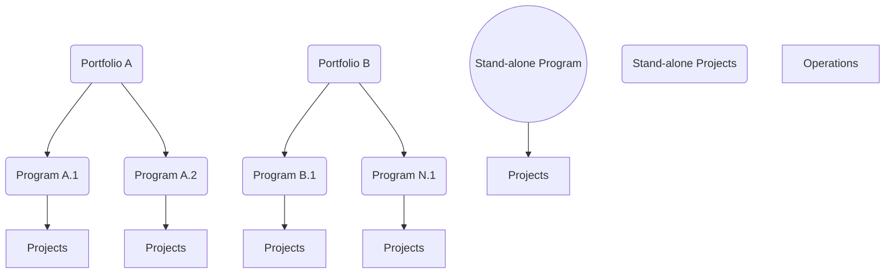

Any of the projects or programs may include products. Operations can directly support or influence portfolios, programs, and projects, alongside other business functions. Additionally, portfolios, programs, and projects impact each other and operations.

### Figure 2‑2. Components of a Sample System for Value Delivery

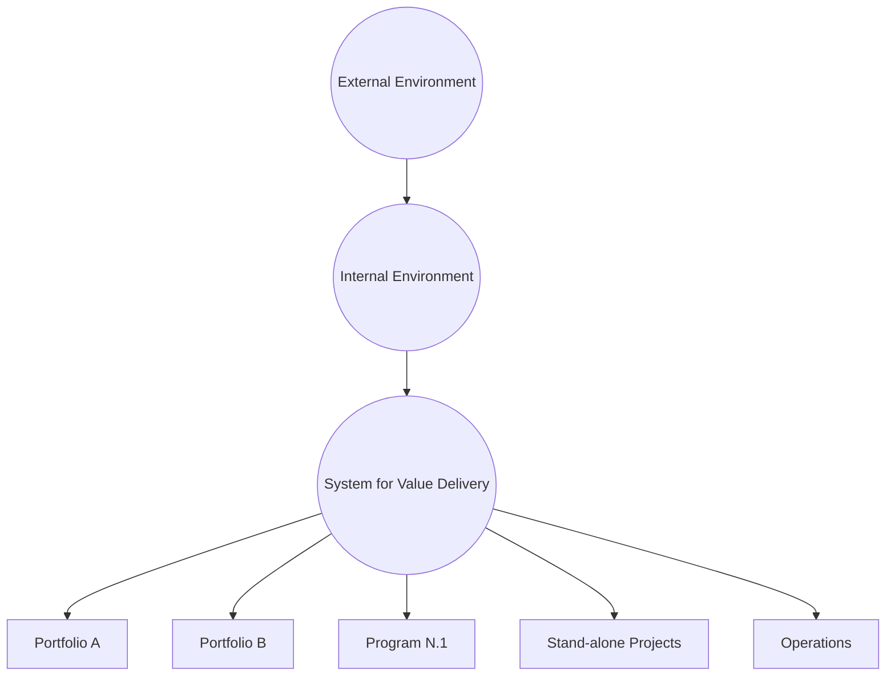

Within this system, components create deliverables that produce outcomes. These outcomes, in turn, create benefits (gains realized by the organization), which collectively deliver value.

#### 2.1.2 Information Flow

A value delivery system works most effectively when information and feedback are shared consistently among all components, keeping the system aligned with strategy and attuned to the environment.

### Figure 2‑3. Example of Information Flow

- Black arrows represent information flowing from senior leadership (strategic direction) down to portfolios, then on to programs/projects, and finally operations.  
- Gray arrows represent the reverse flow: operations informing programs and projects about updates, programs providing performance to portfolios, and portfolios reporting performance back to senior leadership.

---

### 2.2 Organizational Governance Systems

Governance systems provide a framework with functions and processes that guide activities. A governance framework can include oversight, control, value assessment, integration, and decision-making capabilities. It evaluates changes, issues, risks, and aligns them with organizational levels such as portfolio objectives, program benefits, and project deliverables.

Projects can operate within a program or portfolio or independently. In some organizations, a project management office (PMO) may support programs and projects within a portfolio. Project governance includes approvals and business decisions affecting the project and aligns with organizational governance.

---

### 2.3 Functions Associated with Projects

People drive project delivery by fulfilling functions that help a project run effectively and efficiently. These can be carried out by individuals or teams, or be combined into defined roles.

Examples of functions often found on projects include:

• Provide Oversight and Coordination  
• Present Objectives and Feedback  
• Facilitate and Support  
• Perform Work and Contribute Insights  
• Apply Expertise  
• Provide Business Direction and Insight  
• Provide Resources and Direction  
• Maintain Governance  

---

### 2.4 The Project Environment

Projects exist within internal and external environments influencing value delivery. Influences can be favorable, unfavorable, or neutral, shaping requirements, planning, or other project activities.

#### 2.4.1 Internal Environment

Internal factors arise from within the organization:

| Internal Factor                             | Description/Examples                                                                      |
|---------------------------------------------|---------------------------------------------------------------------------------------------|
| Process assets                              | Tools, methodologies, templates, frameworks, or PMO resources                               |
| Governance documentation                    | Organizational policies, procedures, processes                                             |
| Data assets                                 | Databases, document libraries, metrics, or artifacts from previous projects                 |
| Knowledge assets                            | Tacit knowledge among team members, experts, other employees                                |
| Security and safety                         | Data protection, confidentiality, handling of intellectual property                          |
| Organizational culture, structure, and governance | Vision, mission, values, hierarchy, ethics                                                  |
| Geographic distribution of facilities       | Virtual project teams, multiple locations                                                   |
| Infrastructure                              | Facilities, equipment, IT hardware, telecom channels                                        |
| Information technology software             | Scheduling, version control, collaboration tools                                           |
| Resource availability                       | Funding, contracting constraints, approved suppliers                                        |
| Employee capability                         | Expertise, skills, competencies, techniques, and knowledge                                  |

#### 2.4.2 External Environment

External factors exist outside the organization and may impact project outcomes:

| External Factor                           | Description/Examples                                                                               |
|-------------------------------------------|----------------------------------------------------------------------------------------------------|
| Marketplace conditions                    | Competitors, market share, technology trends                                                       |
| Social and cultural influences and issues | Political climate, customs, ethics, regional events                                                |
| Regulatory environment                    | Laws and regulations for data protection, business conduct, licensing, procurement                 |
| Commercial databases                      | Standardized cost estimating data, industry risk studies                                           |
| Academic research                         | Industry studies, publications, benchmarking                                                       |
| Industry standards                        | Standards for products, production, environment, quality                                           |
| Financial considerations                  | Currency exchange rates, inflation, taxes, tariffs                                                 |
| Physical environment                      | Weather, working conditions, environmental factors                                                 |

---

### 2.5 Product Management Considerations

Portfolio, program, project, and product management are increasingly interlinked. A product is an artifact that is produced, quantifiable, and can be an end item or a component. Product management involves integrating people, data, processes, and systems to develop a product throughout its life cycle (introduction, growth, maturity, retirement).

### Figure 2‑4. Sample Product Life Cycle with Program/Project Overlaps

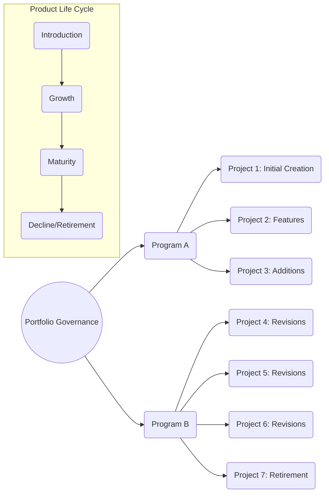

Programs and projects can be initiated at various points to enhance features or capabilities. Each discipline—product, program, project, portfolio—must coordinate and be tailored appropriately when product deliverables are involved.

---

## 3. Project Management Principles

Principles provide foundational guidelines for strategy, decision making, and problem solving. The 12 principles are not prescriptive; they guide behavior for those involved in projects. Drawn from global input, these principles align with values of responsibility, respect, fairness, and honesty, as reflected in the PMI Code of Ethics and Professional Conduct [2].

### Figure 3‑1. Overlap of Project Management and General Management Principles

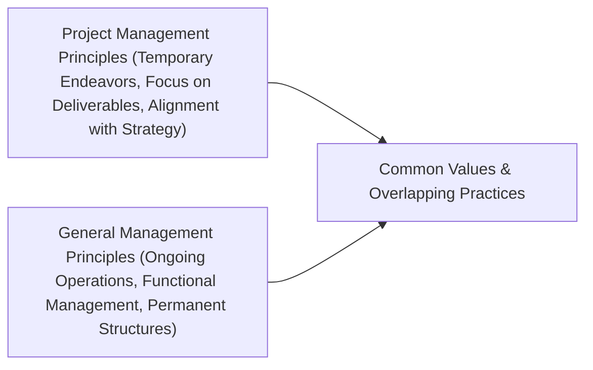

---

## The 12 Principles of Project Management

1. Be a diligent, respectful, and caring steward.  
2. Create a collaborative project team environment.  
3. Effectively engage with stakeholders.  
4. Focus on value.  
5. Recognize, evaluate, and respond to system interactions.  
6. Demonstrate leadership behaviors.  
7. Tailor based on context.  
8. Build quality into processes and deliverables.  
9. Navigate complexity.  
10. Optimize risk responses.  
11. Embrace adaptability and resiliency.  
12. Enable change to achieve the envisioned future state.

---

### 3.1 Be a Diligent, Respectful, and Caring Steward

### Figure 3‑2. Be a Diligent, Respectful, and Caring Steward

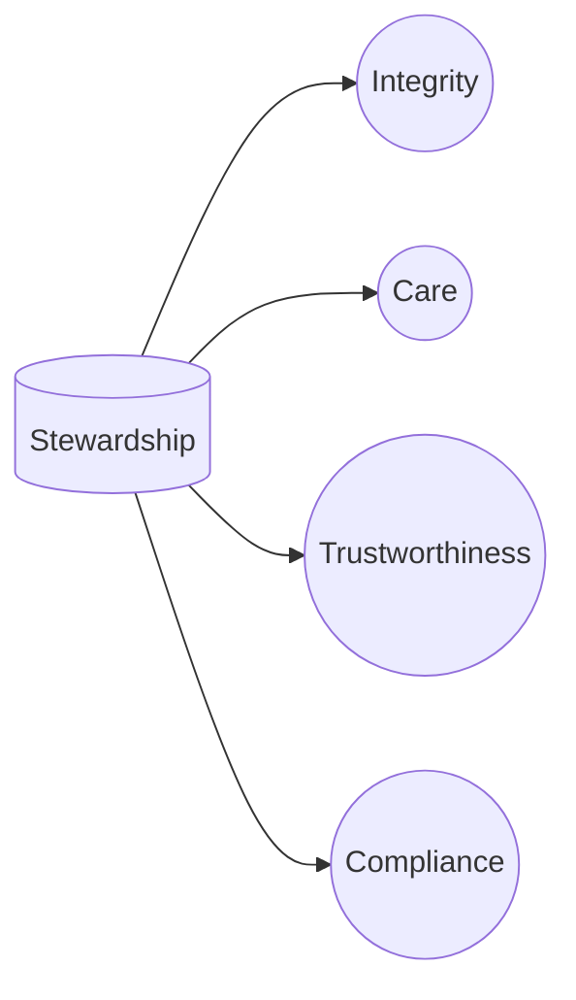

Stewards act responsibly to carry out activities with integrity, care, and trustworthiness while following guidelines and considering financial, social, technical, and environmental impacts.

---

### 3.2 Create a Collaborative Project Team Environment

### Figure 3‑3. Create a Collaborative Project Team Environment

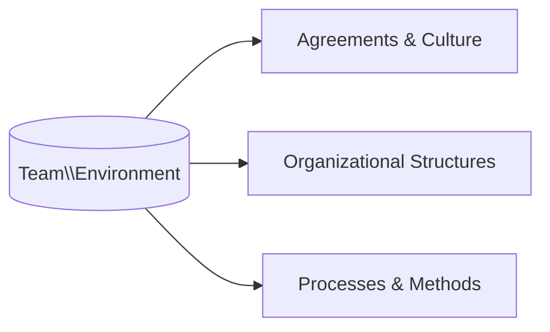

Projects are delivered by teams. A collaborative environment supports alignment with organizational goals, team learning, and effective delivery of outcomes.

---

### 3.3 Effectively Engage with Stakeholders

### Figure 3‑4. Effectively Engage with Stakeholders

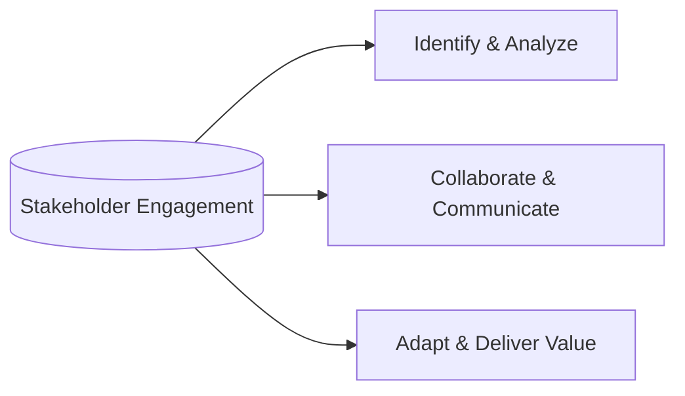

Engage stakeholders proactively to contribute to project success, customer satisfaction, and alignment with evolving needs.

---

### 3.4 Focus on Value

### Figure 3‑5. Focus on Value

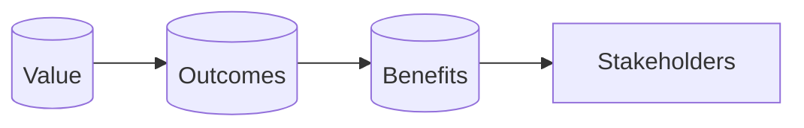

Continually evaluate and adjust strategies toward intended benefits and value.

For example, Earned Value (EV) can be calculated as a measure of work performed:

$$
\text{EV} = \frac{\text{Percent Complete}}{100} \times \text{BAC}
$$

Where BAC is the Budget at Completion.

---

### 3.5 Recognize, Evaluate, and Respond to System Interactions

### Figure 3‑6. Recognize, Evaluate, and Respond to System Interactions

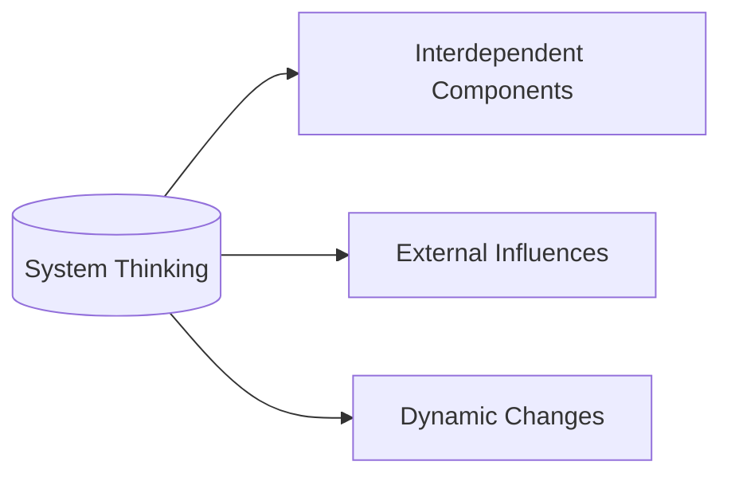

Projects are open systems with interdependent components. Systems thinking requires a holistic perspective on project variables, including timing and external factors.

---

### 3.6 Demonstrate Leadership Behaviors

### Figure 3‑7. Demonstrate Leadership Behaviors

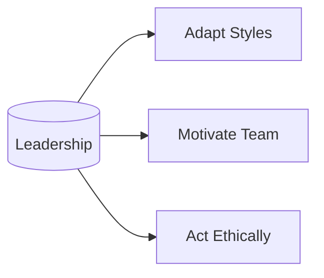

Leadership goes beyond authority. Effective leaders inspire commitment, resolve conflicts, and guide the team to success.

---

### 3.7 Tailor Based on Context

### Figure 3‑8. Tailor Based on Context

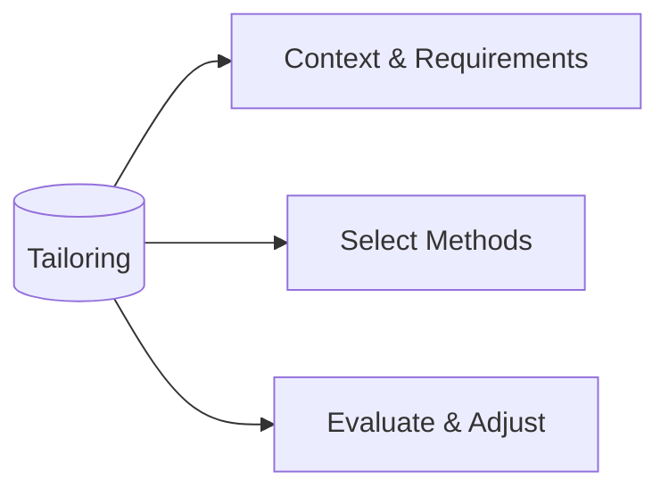

Every project is unique. Use “just enough” process, governance, and methods to maximize value and manage constraints.

---

### 3.8 Build Quality into Processes and Deliverables

### Figure 3‑9. Build Quality into Processes and Deliverables

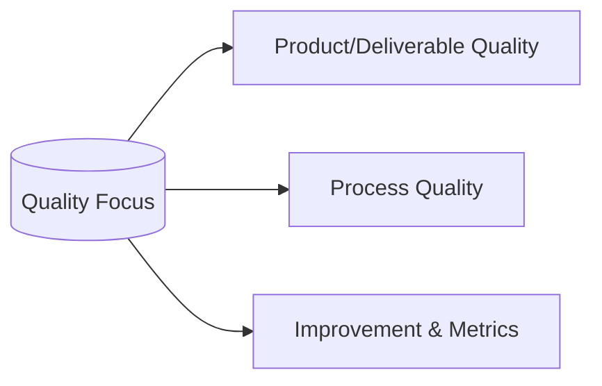

Quality includes meeting requirements and ensuring stakeholder satisfaction. Preventing defects is typically more cost-effective than fixing them later.

---

### 3.9 Navigate Complexity

### Figure 3‑10. Navigate Complexity

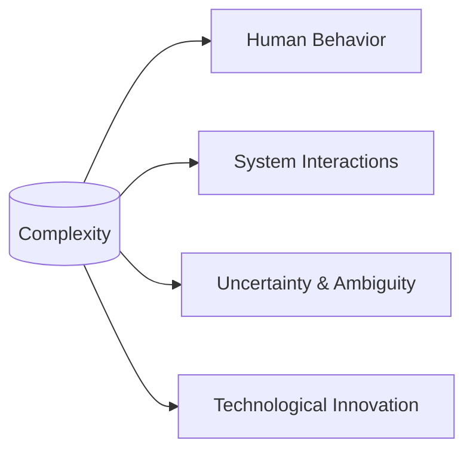

Complexity arises from different and often unpredictable elements. Vigilance and adaptiveness are essential to manage complexity effectively.

---

### 3.10 Optimize Risk Responses

### Figure 3‑11. Optimize Risk Responses

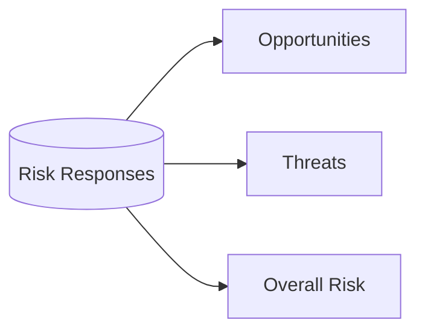

Continually evaluate risk to maximize positive impacts (opportunities) and minimize negative impacts (threats). Risk exposure can shift as the project evolves.

---

### 3.11 Embrace Adaptability and Resiliency

### Figure 3‑12. Embrace Adaptability and Resiliency

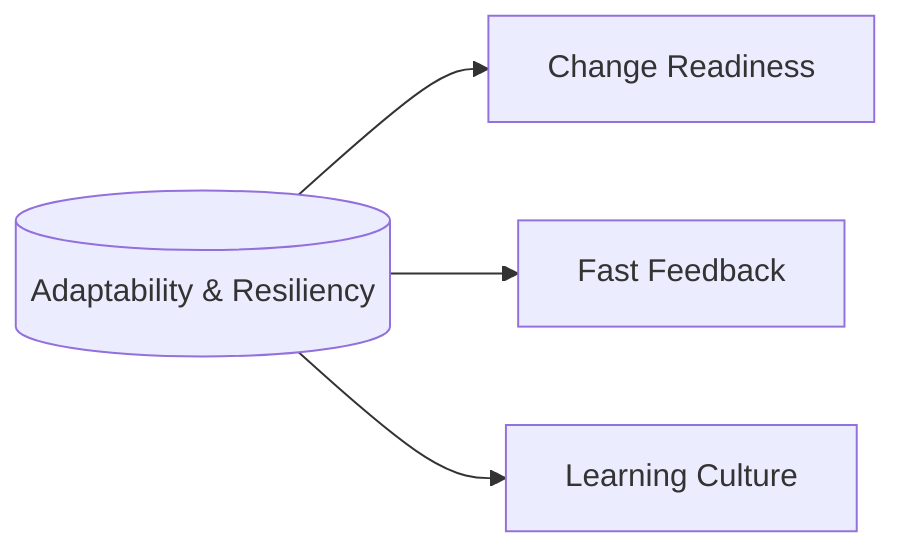

Projects rarely go exactly as planned. Adaptive teams pivot quickly in response to changes, setbacks, and new information.

---

### 3.12 Enable Change to Achieve the Envisioned Future State

### Figure 3‑13. Enable Change to Achieve the Envisioned Future State

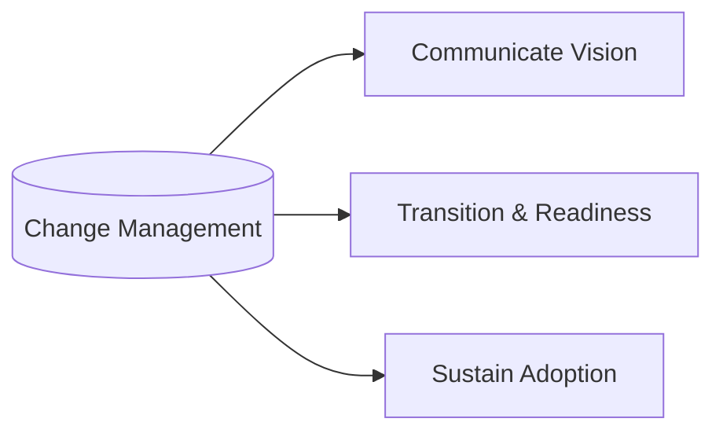

Projects typically create something new. Success often requires guiding people from the current state to the future state. Structured change management ensures adoption and realization of benefits.

---

## Expanded References

[1] Project Management Institute (PMI). 2016. “PMI Lexicon of Project Management Terms.”  
    Available from: https://www.pmi.org/learning/lexicon  
[2] Project Management Institute (PMI). 2006. “PMI Code of Ethics and Professional Conduct.”  
    Available from: https://www.pmi.org/about/ethics/code  
[3] Project Management Institute (PMI). 2019. “The Standard for Risk Management in Portfolios, Programs, and Projects.” Newtown Square, PA: Author.  
[4] Project Management Institute. 2013. “Managing Change in Organizations: A Practice Guide.” Newtown Square, PA: Author.  
[5] Project Management Institute. 2021. “A Guide to the Project Management Body of Knowledge (PMBOK® Guide) – Seventh Edition.” Newtown Square, PA: Author.  
[6] ISO 21500:2012. “Guidance on Project Management.” International Organization for Standardization.  
[7] ISO 10006:2017. “Quality Management in Projects.” International Organization for Standardization.

---

## Glossary

Below are selected terms relevant to this standard. (See also Section 1.2 for key definitions.)

• Authority: The formally delegated right to make decisions, approve expenses, or represent the organization.  
• Accountability: Being ultimately answerable for the outcome of assigned responsibilities.  
• Change Management: A structured approach enabling individuals, teams, or organizations to transition from a current state to a future desired state.  
• Complexity: A characteristic of a project arising from multiple interconnected parts, uncertainties, or emergent properties that make outcomes less predictable.  
• Deliverable: Any unique and verifiable product, service, or result required to complete a process, phase, or project.  
• Governance: The framework, functions, and processes that guide organizational or project activities, ensuring alignment with objectives, oversight, and consistent decision making.  
• Portfolio Management: The centralized management of portfolios to achieve strategic objectives by selecting, prioritizing, and controlling project and program investments.  
• Program Management: The coordinated management of related projects, subsidiary programs, and activities to obtain benefits not available from managing them individually.  
• Stakeholder Engagement: The process of identifying, analyzing, and communicating effectively with individuals or groups with a stake in project outcomes, to influence project success.  
• Tailoring: The deliberate adaptation of processes, governance, and methods to fit the specific context of a project, reducing unneeded complexity and improving efficiency.  
• Value: The worth, importance, or usefulness of something from the stakeholder’s perspective; can be financial, social, or otherwise beneficial.  

---

© 2024 Tokenizer Inc. CC BY-NC-SA 4.0  

