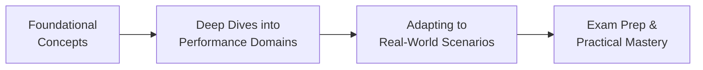

## 1.1 How to Use This Book

This companion guide is designed to help you confidently prepare for the PMP® exam while equipping you with robust, real-world project management skills. Below, you will find strategies, tips, and resources to get the most out of each chapter, how to integrate official PMI standards into your study regimen, and the best ways to apply your knowledge on actual projects. Whether you are new to project management or a seasoned professional, this book ensures that the concepts you learn are immediately practical as well as fully aligned with the current PMP® Exam Content Outline.

### Purpose and Audience
Our primary aim is to bridge the gap between theoretical understanding and real-world practice. The content is tailored to those aiming to pass the PMP® exam, as well as practicing project managers seeking to refine their approach to agile, hybrid, or traditional methodologies. By reading this guide, you will not only learn about core project management processes, but also discover advanced techniques for risk optimization, leadership, stakeholder engagement, and more.

### Organization of the Book
This book is divided into multiple sections:

- Part I introduces the structure, purpose, and context for today’s project management landscape. It lays out preliminary information about the PMP® exam format and how the PMBOK® Guide has evolved from the Sixth to the Seventh Edition.

- Part II covers core concepts, including the 12 Project Management Principles from the PMBOK® Guide Seventh Edition and the specifics of the PMP® exam domains.

- Part III focuses on the seven PMBOK® Guide Seventh Edition Performance Domains—covering Stakeholders, Team, Development Approach and Life Cycle, Planning, Project Work, Delivery, Measurement, and Uncertainty—along with insights on how these concepts align to exam topics.

- Part IV delves into traditional Knowledge Areas and Best Practices, bridging the PMBOK® Guide Sixth Edition foundation with modern updates, so you can navigate process-based details (e.g., Scope, Schedule, Cost) while remaining adaptable.

- Part V explores Agile and Hybrid Delivery Approaches, linking the Agile Practice Guide with established methodologies and frameworks like Scrum, Kanban, and Lean, showing how to tailor these approaches to various project contexts.

- Part VI addresses Business Environment and Strategy to demonstrate how projects align with organizational goals, benefits realization, and compliance considerations.

- Part VII provides deep dives into Advanced Topics and Emerging Trends such as complexity management, advanced leadership, new technologies, and portfolio/program intersections.

- Part VIII offers Exam Preparation and Study Techniques, including formulas, templates for quick reference, and tips for optimized exam-day performance.

- Part IX houses Appendices, Glossaries, and Reference Materials for ongoing support, including recommended readings, extended bibliographies, and essential charts and templates.

Rather than simply rehashing the PMBOK® Guide or the PMP® Exam Content Outline, this comprehensive supplement integrates them with extensive commentary, practical case studies, and examples that encourage a deeper understanding of how to adapt and succeed in diverse project situations.

### Recommended Reading Approach
Below is a suggested reading strategy to help you navigate the text efficiently:

• Skim the Table of Contents to identify chapters most relevant to your immediate needs. For instance, if you struggle with stakeholder engagement, start with Chapters 7, 16, and 28 before returning to earlier chapters.  
• Read sequentially if you want a structured perspective that builds from fundamental principles in Part I to advanced topics in Part VII.  
• Reference later chapters (e.g., advanced leadership in Chapter 33 or emerging technologies in Chapter 34) as you bolster specific skill sets.  
• Use the integrated quizzes at the end of each chapter to test your knowledge. If you score below your expectation, revisit the relevant sections and attempt the quiz again to monitor improvement.  
• Leverage Part VIII for pragmatic tips on exam preparation, focusing on formulas in Chapter 37 and memorization tools in Chapter 38. Use these methods while practicing with mock exams.  
• Look to the Appendices (Part IX), particularly the comprehensive glossary (Chapter 40) and reference charts (Chapter 41), to clarify unfamiliar terms or methods as you progress.  

If you already possess solid project management experience, picking and choosing specific chapters that address your knowledge gaps can speed up your exam readiness. Conversely, newcomers often benefit from a linear read-through that builds a strong foundational layer before exploring advanced or agile-specific material.

### Navigating Chapter Layout and Features
Each chapter follows a structured approach to ensure clarity and continuity:

• Introduction: Sets the tone by explaining how the chapter topics relate to PMP® exam success, professional practice, and organizational strategy.  
• Key Topics: Offers an in-depth dive into the subject area, lined with real-life examples, formulas, tips, and best practices.  
• Cross-References: Suggests related chapters or external resources to broaden your perspective.  
• Quizzes and Exercises: Helps you reinforce and validate your understanding of the material.  
• Practical Applications: Features real-world scenarios to illustrate how concepts play out in day-to-day project environments.  

This format is consistent across the book, so as you become familiar with it, you can quickly find the content you need, assess your understanding via interactive quizzes, and move forward confidently.

### Integrating This Guide with Official PMI Resources
This guide does not replace the official PMBOK® Guide or the Agile Practice Guide. Instead, it complements and expands upon these resources:

• Combine your reading of this book with the official PMBOK® Guide Seventh Edition, paying special attention to how each domain and principle is contextualized.  
• Align your learning strategy with PMI’s Examination Content Outline, ensuring you cover every domain (People, Process, and Business Environment).  
• Reference the Agile Practice Guide when reading Part V and connect agile mindsets, principles, and events to real-world application.  
• Leverage PMIstandards+ for the latest articles and case studies that mirror modern project environments.  
• Remain aware of PMI updates and exam changes. While we continuously revise our content, it is crucial to check PMI publications for the latest official information.  

### Bridging Theory and Real-World Practice
This book prioritizes practical examples and case studies. You’ll see how to apply theory from the PMBOK® Guide and the fundamental concepts of the PMP® exam:

- Illustrative Case Scenarios. Learn how stakeholder engagement might unfold in a software development project with globally distributed teams or in a manufacturing context with complex supply chain dynamics.  
- Templates and Tools. Discover ready-to-use stakeholder registers, risk registers, work breakdown structures (WBS), and other artifacts (see Chapter 41).  
- Agile vs. Predictive Comparisons. Each chapter highlights how to adapt processes for agile, hybrid, or traditional project environments, showing how a single principle—like early feedback—translates into a daily standup (agile) or a phase gate review (predictive).  

Keeping your future projects in mind, the content is consistently framed to help you make better decisions. By merging theoretical domains with actual workflows, you develop a critical lens that is not only vital for passing the PMP® exam, but also for delivering maximum value in your projects.

### Diagram: How This Book Supports You 
Below is a simple diagram that illustrates how each chapter builds upon the previous ones, eventually guiding you from foundational theory to confident project delivery:

**Explanation:**  
• A (Foundational Concepts) includes introductions to project management fundamentals in Part I and Part II.  
• B (Deep Dives into Performance Domains) corresponds to the in-depth look at how projects are systematically organized in Parts III and IV.  
• C (Adapting to Real-World Scenarios) covers agile and hybrid practices, business environment considerations, and advanced practice (Parts V through VII).  
• D (Exam Prep & Practical Mastery) reflects advanced review, exam simulation, and knowledge consolidation in Part VIII and the supporting materials in Part IX.

### Use of Quizzes, Templates, and Exercises
Each chapter contains short quizzes and reflection questions designed to reinforce learning immediately. Pay close attention to rationales provided for each answer, as they clarify common misunderstandings and exam traps. Templates included in the appendices facilitate practical application; you can adapt them to your current projects or use them as references when studying exam scenarios that focus on controlling change, managing stakeholders, or scheduling tasks.

#### Sample Table: Suggested Ways to Study

| Study Component         | When to Use                          | Outcome                                     |
|-------------------------|--------------------------------------|---------------------------------------------|
| Chapter Reading         | Initial or in-depth review           | Comprehensive understanding of key themes   |
| End-of-Chapter Quizzes  | After reading, before final exams    | Quick knowledge check, identify weaknesses |
| Templates (Appendix)    | During real projects or exam drills  | Practical application, hands-on exercises   |
| Mock Exams              | Throughout study schedule            | Exam-taking stamina, identify knowledge gaps|
| Glossary References     | Anytime a new term appears unclear   | Reinforcement of terminology                |

**Explanation:**  
• Begin your study with the chapter text to ground yourself thoroughly in the topic.  
• Immediately follow up with quizzes to reinforce your understanding and pinpoint areas needing more focus.  
• Apply the templates for practical exercises, especially if you currently manage projects.  
• Periodically take full mock exams to train in time management and multi-domain question navigation.  
• Refer to the glossary whenever you encounter unfamiliar project management terms or acronyms.

### Common Pitfalls and Strategies
Using a comprehensive resource like this can lead to “information overload”—a pitfall where you might attempt to grasp every detail without applying it strategically. Here are some tips:

• **Pitfall:** Skipping Fundamentals  
  **Strategy:** Even if you have years of experience, reviewing fundamental topics (such as those in Chapter 4: Project Management Fundamentals) can clarify misconceptions and fill knowledge gaps.  
  
• **Pitfall:** Memorizing Without Understanding  
  **Strategy:** Instead of rote memorization, focus on how the processes and principles interconnect. Use real project examples to visualize how you would respond to a change request or handle stakeholder conflict.  
  
• **Pitfall:** Ignoring Agile or Hybrid Chapters  
  **Strategy:** The PMP® exam heavily integrates agile or hybrid methods. Ensure that you understand iterative and incremental development, particularly how they differ from predictive life cycle stages (see Chapter 9 and Part V).  
  
• **Pitfall:** Not Balancing Study with Practice  
  **Strategy:** Use real-world scenarios, chapter quizzes, and the recommended mock exams as frequent practice. This facilitates knowledge retention and exam-question agility.  

By mindfully addressing these pitfalls, you give yourself a robust platform for success on the exam and in your day-to-day project responsibilities.

### Real-World Case in Point
Imagine that you are a project manager at a healthcare IT company tasked with implementing a new hospital information system. By referencing this book, you might:

1. Consult the Stakeholder Performance Domain (Chapter 7) to identify doctors, nurses, administrative staff, and external regulators as key stakeholders early in the project.  
2. Employ the techniques in Chapter 16 (Stakeholder and Communications Management) to create a robust communication plan that accounts for confidentiality and regulatory constraints.  
3. Use agile tailoring advice from Chapters 9 and 27 to introduce iterative feedback loops for software testing, ensuring that end-users can test new features incrementally and provide feedback.  
4. Track progress using Earned Value Management formulas from Chapter 37 to see if the project is staying within budget while meeting schedule targets.  

Through these connections, the book becomes a real-world companion, linking theory to actual project scenarios.

### Where to Go Next
Upon finishing this sub-section, consider exploring the rest of Chapter 1 to see how the book’s structure and the PMP® exam are intimately connected. Then, delve into Chapter 2 for an overview of the exam format, including question types and test-taking tips, or Chapter 3 to understand how project management thinking has shifted from the Sixth to Seventh Edition of the PMBOK® Guide.

If you find yourself wanting more context on critical project management standards, skip ahead to Part VIII for exam preparation and study techniques. Alternatively, if you plan on diving right into stakeholder strategies or agile methods, jump to the relevant chapters in Part III or Part V, respectively.

Regardless of your path, remember: you can personalize your reading strategy to match your schedule, knowledge gaps, and professional interests.

### References for Further Exploration
• Project Management Institute. (2021). A Guide to the Project Management Body of Knowledge (PMBOK® Guide) – Seventh Edition.  
• Project Management Institute. (2021). The Standard for Project Management.  
• Project Management Institute. (2017). Agile Practice Guide.  
• Babou, S. & Rousseau, D. M. (2020). "Systems Thinking in Project Management." PMI Standards+.  
• Kerzner, H. (2022). Project Management: A Systems Approach to Planning, Scheduling, and Controlling.  

Use these resources to deepen your understanding, verify evolving areas of knowledge, and discover additional case studies that can sharpen your project management skills while you prepare for the PMP® exam.

---

## Top 10 Quiz Questions for Effective Book Navigation



### Which section of the book primarily covers the Agile Practice Guide insights along with hybrid methods?
- [ ] Part IV: Knowledge Areas & Best Practices  
- [x] Part V: Agile & Hybrid Delivery Approaches  
- [ ] Part VI: Business Environment & Strategy  
- [ ] Part VII: Advanced Topics & Emerging Trends  

> **Explanation:** Part V explicitly revolves around Agile foundations, frameworks, artifacts, events, and hybrid approaches, showcasing how to merge predictive and agile styles.

### Which chapter focuses specifically on providing advanced leadership and team development strategies? 
- [ ] Chapter 10: Planning Performance Domain  
- [x] Chapter 33: Advanced Leadership and Team Development  
- [ ] Chapter 21: Resource Management  
- [ ] Chapter 6: The PMP® Exam Domains, Tasks, and Enablers  

> **Explanation:** Chapter 33 delves deep into emotional intelligence, cultural intelligence, conflict de-escalation, and coaching techniques, making it central to advanced leadership concepts.

### What is a key component included in each chapter to reinforce your understanding?
- [x] End-of-chapter quizzes  
- [ ] Group Zoom sessions  
- [ ] Dedicated PMI instructor commentary  
- [ ] Software tutorials  

> **Explanation:** Each chapter includes concise quizzes and reflection questions to help you measure and reinforce your understanding of core concepts.

### What is one pitfall that many experienced project managers fall into when studying the fundamentals?
- [x] Skipping over foundational topics due to assumed knowledge  
- [ ] Overemphasis on agile methods  
- [ ] Focusing excessively on formula memorization  
- [ ] Studying the PMBOK® Guide Seventh Edition only  

> **Explanation:** Even seasoned PMs risk overlooking the nuances of fundamental concepts, potentially missing out on critical exam details and refreshing their knowledge base.

### What does this book prioritize by merging the PMBOK® Guide, the Agile Practice Guide, and real-world examples?
- [x] Bridging theory and real-world practice  
- [ ] Strict adherence to memorized definitions  
- [x] Building a robust critical thinking skill set  
- [ ] Limiting application to highly regulated industries  

> **Explanation:** The text goes beyond theory, illustrating how principles are best applied in everyday project situations to promote adaptive, critical thinking.

### Which part of the book would you turn to for advanced, emerging topics such as AI and machine learning in project management?
- [ ] Part VI: Business Environment & Strategy  
- [ ] Part III: Performance Domains & PMBOK® Guide Seventh Edition  
- [ ] Part V: Agile & Hybrid Delivery Approaches  
- [x] Part VII: Advanced Topics & Emerging Trends  

> **Explanation:** Topics like AI, machine learning, and other cutting-edge tools are showcased in Part VII to help you stay current with evolving project management practices.

### Which approach does this guide recommend for achieving deep retention of project management formulas and processes?
- [x] Applying concepts to real or simulated project scenarios  
- [ ] Relying on rote memorization alone  
- [x] Engaging with quizzes and practice exams  
- [ ] Only reading the PMBOK® Guide once  

> **Explanation:** By coupling active recall techniques such as practice exercises with real-life applications, you strengthen conceptual understanding and long-term retention.

### What should you do after finishing each chapter’s quiz if your score is below your goal?
- [ ] Proceed to the next chapter regardless  
- [x] Revisit the relevant sections and retake the quiz  
- [ ] Switch to reading business environment topics only  
- [ ] Memorize the quiz answers and move on  

> **Explanation:** Re-examining the chapter’s material and redoing the quiz is crucial for solidifying your understanding and addressing weaknesses early.

### What is the best way to deal with “information overload” when using a comprehensive resource like this?
- [x] Focus on strategic reading, prioritize weak areas, and apply knowledge incrementally  
- [ ] Skip chapters that go beyond your comfort zone  
- [ ] Only read about agile practices because they are trendy  
- [ ] Memorize all the processes without context  

> **Explanation:** A purposeful approach—targeting your weaker areas, practicing regularly, and applying concepts to real-life scenarios—helps you navigate a dense body of knowledge effectively.

### True or False: This book replaces official PMI publications and the PMBOK® Guide.
- [ ] True  
- [x] False  

> **Explanation:** This guide is meant to complement the PMBOK® Guide, the Agile Practice Guide, and other PMI resources by offering additional insights, practical frameworks, and real-world examples.



---

## PMP Mastery: 1500+ Hard Mock Exams with Full Explanations 

Looking to crush the PMP exam with confidence? Dive deep into 6 rigorous mock exams totaling 1500+ advanced-level questions, each accompanied by clear, step-by-step explanations. Hone your test-taking strategies, master complex topics, and build the resilience you need on exam day. Perfect for serious PMs aiming beyond fundamentals.  

Enroll now:  
[PMP Mastery: 1500+ Hard Mock Exams with Exceptional Clarity & Full Explanations](https://www.udemy.com/course/pmp-2025/?referralCode=CF83A54BC86BE27F9AFE)

_Disclaimer: This course is not endorsed by or affiliated with the PMI examination authority. All content is provided purely for educational and preparatory purposes._
