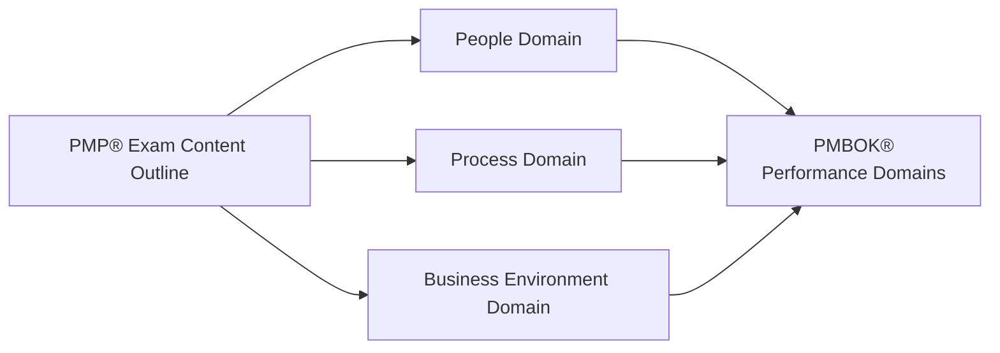

## 1.2 Alignment with PMP® Exam Content Outline and PMBOK® Guide

One of the primary goals of this book—Mastering Project Management: A Comprehensive Companion for the PMP® Exam—is to ensure that every topic aligns squarely with the latest PMP® Exam Content Outline published by the Project Management Institute (PMI), while also integrating and expanding upon the principles, performance domains, and best practices contained in the PMBOK® Guide (Seventh Edition). This section explores how the exam content ties together with PMBOK® Guide concepts and clarifies how our chapters and supplemental materials bridge any gaps between theoretical foundations and practical application.

By understanding these alignments, you will be able to confidently grasp the underlying structure of the PMP® exam, keep pace with PMBOK® Guide updates, and acquire skills that prove invaluable in real-world project environments. Through illustrations, practical scenarios, and targeted insights, this section explains the synergy between the exam outline and the PMBOK® Guide, showing you the specific ways our supplemental text supports your learning journey.

---

### Why Alignment Matters

Exam success relies on more than rote memorization or purely academic understanding. The PMP® certification is designed to measure not only your knowledge of project management processes but also your ability to apply that knowledge in realistic scenarios. The PMBOK® Guide (Seventh Edition) frames project management through performance domains, principles, and tailoring considerations, while the PMP® Exam Content Outline defines three high-level domains—People, Process, and Business Environment—that structure the exam questions.

Synchronizing these two frameworks is important because:

- The PMBOK® Guide reveals broad, principle-based perspectives, supplemented by methodological aspects that span predictive, agile, and hybrid approaches.
- The PMP® Exam Content Outline (ECO) categorizes project management competencies and life cycle tasks into domains and tasks that reflect the day-to-day realities of a project manager’s responsibilities.

For effective exam preparation, you need to see how concepts in the PMBOK® Guide answer the tasks required by the ECO—and vice versa. This book actively does that mapping, ensuring you see the direct correlation between major performance domains (e.g., Stakeholders, Team, Planning, Delivery) and the People, Process, and Business Environment exam domains.  

---

### Overview of the PMP® Exam Content Outline

The current ECO segments exam topics into three domains:

- People Domain  
- Process Domain  
- Business Environment Domain  

Under each domain exist multiple tasks and enablers that describe the expected knowledge, skills, and abilities for a certified PMP® professional. Topics such as conflict resolution, communications, stakeholder engagement, and team leadership surface predominantly in the People domain, while risk management, budget control, scope definition, and schedule management appear within the Process domain. The Business Environment domain covers governance, compliance, alignment with organizational strategies, and adoption of benefits realization.

Each exam domain draws upon principles, best practices, and performance domains from the PMBOK® Guide Seventh Edition. This means that while the ECO addresses competencies at a high level with practical tasks, the PMBOK® Guide frames them through performance domains and the 12 underlying project management principles, which can be applied and tailored to unique environments.

---

### PMBOK® Guide (Seventh Edition) at a Glance

The PMBOK® Guide (Seventh Edition) departs from the previous process-based structure of Knowledge Areas and instead emphasizes:

- Eight performance domains, each representing an area critical to project success:  
  • Stakeholder  
  • Team  
  • Development Approach and Life Cycle  
  • Planning  
  • Project Work  
  • Delivery  
  • Measurement  
  • Uncertainty  

- Twelve project management principles, guiding the mindset and attitudes of project professionals:  
  • Stewardship  
  • Team  
  • Stakeholders  
  • Value  
  • Systems Thinking  
  • Leadership  
  • Tailoring  
  • Quality  
  • Complexity  
  • Risk  
  • Adaptability and Resilience  
  • Change Management  

In addition to performance domains and principles, the PMBOK® Guide offers tailoring considerations for predictive, agile, and hybrid projects. These are directly relevant to your PMP® exam preparation because the exam aims to assess your understanding of multidimensional project environments.

---

### Bridging the Exam Domains and PMBOK® Performance Domains

Below is a simplified diagram that may help visualize how the PMP® Exam Content Outline (ECO) interacts with PMBOK® Guide performance domains:

In real-world practice—and on the exam—concepts from one domain will frequently intersect with or inform approaches to another. For example:

• Team (a PMBOK® performance domain) maps closely to the People domain of the exam, covering team building, leadership, and best practices for conflict resolution.  
• Delivery (a PMBOK® performance domain) intersects with the Process domain by defining how deliverables are planned, executed, and validated.  
• Uncertainty (also a PMBOK® performance domain) is strongly connected to risk management tasks, which are found across the People, Process, and Business Environment domains—where you manage stakeholder expectations, handle resource constraints, and align risk responses with organizational strategy.

---

### How This Book Supports Both the ECO and PMBOK® Guide

Throughout the chapters in this book, we intentionally organize content so you can see how concepts from the PMBOK® Guide and the PMP® exam domains converge around practical scenarios. For instance:

- Chapters covering the “People” domain (see Chapter 6 and beyond) map to topics in the PMBOK® Guide’s “Stakeholder” and “Team” performance domains. We show how stakeholder analysis tools (such as stakeholder registers and power/interest grids) align with the PMBOK® emphasis on engagement and collaboration.  
- Chapters addressing “Process” domain tasks align with performance domains like “Development Approach and Life Cycle,” “Planning,” and “Delivery.” We highlight critical aspects of iterative, incremental, or hybrid methods, such as backlog refinement in agile and rolling wave planning in predictive environments.  
- The “Business Environment” domain touches on the PMBOK® performance domains “Measurement” and “Uncertainty,” among others. Our chapters on risk, benefit realization, and strategic alignment (e.g., Chapters 13, 14, 28, and 29) explain how organizational strategy, compliance, and risk tolerance create the broader frame in which projects operate.

This synergy clarifies how performance domains link to the day-to-day tasks entailed in People, Process, and Business Environment, ensuring that all necessary detail is covered for your exam success and your professional practice.

---

### Going Beyond the Basics

One of the key motivations for constructing this supplemental guide is the growing complexity of real-world projects. Today’s project managers face not only the classical triple constraints of scope, schedule, and cost, but also complexities in technology, remote team dynamics, cultural constraints, and rapid market shifts. By integrating the ECO with the PMBOK® Guide, we can dive deeper into these emerging challenges:

• Navigating Hybrid Methodologies: Projects often require a blend of predictive and agile methods. We provide insights into how to negotiate governance frameworks that satisfy organizational rigor but still permit time-boxed, iterative development cycles.  
• Leading and Developing Teams: Beyond the fundamentals of charting RACI matrices and forming cohesive work groups, emerging themes like servant leadership, motivation in cross-cultural settings, and sustaining a psychologically safe environment are thoroughly discussed.  
• Responding to Complexity and Uncertainty: Agile practitioners and predictive project managers alike must deal with shifting stakeholder demands, new regulations, and market volatilities. Our coverage of risk responses, scenario planning, and adaptive leadership is designed to help you excel both on the exam and in complex real-world environments.

If the PMBOK® Guide outlines the “what” and “why,” and the ECO outlines the “how” for the PMP® exam, this book aims to tie it all together with the “when” and “where” of actual project settings. Intended as both an exam prep resource and a real-world reference, it responds to the multi-faceted roles project managers now play—leaders, strategists, risk mitigators, and innovation enablers.

---

### Practical Examples of Alignment

Below are some detailed examples illustrating how the material in this guide aligns with both the ECO and the PMBOK® Guide:

**1. Stakeholder Analysis and Engagement**  
- ECO People Domain: Task of engaging stakeholders, addressing conflict, and fostering collaboration.  
- PMBOK® Guide Stakeholder Domain: Emphasizes iterative stakeholder engagement strategies, customizing communication and collaboration methods.  
- Real-World Application: In Chapter 7 (Stakeholder Performance Domain), we illustrate a case study of a cross-departmental technology rollout where multiple leaders compete for resources. This example shows how early identification of stakeholder interests reduces conflict and fosters buy-in, mapping precisely to the ECO’s task of managing stakeholder expectations and the PMBOK® principle of tailoring engagement.

**2. Schedule Management and Iterations**  
- ECO Process Domain: Tasks that revolve around controlling scope, schedule, and quality.  
- PMBOK® Guide Planning Domain: Encourages dynamically adjusting plans, whether in predictive or agile formats.  
- Real-World Application: Chapter 10 (Planning Performance Domain) provides templates for rolling wave planning, aligning each iteration or phase with established milestones. This synergy helps you handle detail-level planning for near-term tasks while leaving future phases less defined, addressing ECO tasks related to scheduling and scope management while reflecting PMBOK® guidance on tailoring.

**3. Governance and Business Alignment**  
- ECO Business Environment Domain: Focuses on compliance, benefits realization, and alignment with organizational strategy.  
- PMBOK® Guide Uncertainty Domain: Emphasizes a broader perspective on how external factors, regulatory changes, and organizational culture affect project outcomes.  
- Real-World Application: Chapter 29 (Benefits Realization Management) and Chapter 30 (Organizational Change Management) highlight how to ensure project deliverables remain aligned with evolving corporate strategies and regulatory changes. This approach meets ECO tasks around managing external business influences while adhering to the PMBOK® principle of delivering value.

---

### Tailoring and Adaptation

The PMBOK® Guide’s unwavering message is that every project is unique and requires careful tailoring. The ECO also highlights adaptation in that you, as a professional, must demonstrate the versatility to choose the right methodology and approach. As you proceed through this book, consider how each topic might be adapted:

- If you manage a multi-year infrastructure project, predictive techniques like a fully developed scope baseline, Gantt charts, and critical path analysis could be your go-to.  
- If your project deals with rapidly evolving technology, continuous user feedback through sprint cycles or frequent prototypes provides the structure you need.  
- Hybrid approaches might blend stakeholder engagement strategies from agile with well-defined stage-gate approvals in a more predictive setting.

This publication doesn’t limit you to a single viewpoint; rather, it provides guidance to help you interpret each concept under different project types and organizational cultures. The exam likewise tests your adaptability by asking scenario-based questions that mix elements from predictive, agile, and hybrid environments.

---

### Common Pitfalls When Aligning Exam and Guide

Even with abundant resources, test candidates and practicing project managers often face pitfalls in fully understanding how the ECO and PMBOK® Guide converge:

• **Over-Emphasis on One Framework**: Focusing solely on memorizing PMBOK® inputs, tools, and outputs (ITTOs) or purely on ECO tasks can leave knowledge gaps, especially with the PMBOK® Guide’s shift to principles and performance domains.  
• **Insufficient Practice with Scenario Questions**: Real exam questions seldom test definitions in isolation; they target situational application. Understanding how to translate a principle like “risk stewardship” into a real scenario is vital.  
• **Ignoring Agile and Hybrid Approaches**: The exam integrates agile and hybrid questions throughout, expecting a fundamental comprehension of iterative life cycles and continuous feedback loops. Neglecting these aspects is a costly mistake.  
• **Not Accounting for the Organization’s Strategy**: Performance domains in the PMBOK® Guide and the Business Environment domain of the ECO underscore the significance of alignment with strategic goals. Missing this alignment can cause you to lose context in exam questions and in real project decision-making.

By acknowledging these pitfalls and exploring the bridging content in this book, you can more confidently approach both your exam and real-world management challenges.

---

### Strategies for Mastery

This chapter aims to embed the exam content outline and PMBOK® Guide principles in a unified understanding. Here are a few concrete strategies you can use throughout your studies and everyday practice:

- **Create Cross-Reference Tables**: Build tables that map PMBOK® performance domains to ECO tasks. Keep them visible during your revision sessions to reinforce connections.  
- **Practice Multi-Domain Exercises**: Attempt questions or case studies that transcend a single domain. For instance, a complex scenario might involve resource allocation (Process domain), stakeholder negotiations (People domain), and aligning a new contract with local regulations (Business Environment domain).  
- **Focus on Principles and Domain Mindsets**: Rather than memorizing rote outputs, internalize the rationale behind each principle or performance domain. This fosters true comprehension.  
- **Seek Real-World Parallels**: Whenever you learn a concept, reflect on a real or hypothetical project. How would you apply the concept if you were leading a geographically dispersed team under tight compliance deadlines?  
- **Use Checklists for Tailoring**: As you come across a new tool or technique from the PMBOK® Guide, jot down conditions under which it might be applicable. This approach cements the principle of tailoring and reminds you that every project is unique.

---

### Example Case Study: Global E-Commerce Rollout

Consider a global e-commerce implementation spanning multiple continents—an endeavor requiring alignment with local regulations (Business Environment), distributed team collaboration (People), and robust risk and scope management (Process). The PMBOK® Guide draws attention to complexities introduced by cross-border legal structures, language barriers, and local market adaptation. The ECO references tasks around strategy alignment, stakeholder engagement, and controlling deliverables.

- **Defining Value (PMBOK® Principle)**: The project aims to improve the organization’s global market share and revenue streams, directly linking to the Business Environment domain.  
- **Stakeholder and Team Engagement**: Performance domains from the PMBOK® Guide around Stakeholders and Team echo the People domain tasks in the ECO—such as addressing confusion over roles in cross-cultural project teams.  
- **Delivery and Process Integration**: Agile sprints may be adopted to quickly localize platform features for different countries, tying back to the Process domain while also applying the Development Approach and Life Cycle domain from PMBOK®.  
- **Measuring Success**: Metrics for success could include daily active users or cart conversion rates, bridging the PMBOK® Guide’s Measurement domain with the ECO emphasis on project performance measurement and adaptation.  

By studying this case in the relevant chapters that follow (e.g., Chapters 7, 8, and 10–12), you begin to see how the interplay of ECO tasks and PMBOK® performance domains ensures a well-rounded approach to any project scenario.

---

### References and Further Exploration

1. **PMI’s “PMP® Exam Content Outline”** (latest edition): The official blueprint for the PMP® exam.  
2. **PMBOK® Guide – Seventh Edition**: The official reference from PMI, focusing on performance domains, principles, and tailoring.  
3. **PMIstandards+** (online resource): Additional guides and thought leadership pieces that expand upon the foundational PMBOK® concepts.  
4. **Agile Practice Guide**: Jointly published by PMI and Agile Alliance, offering in-depth coverage of agile methods that increasingly feature in the PMP® exam.  
5. **Chapters 36–39 of This Book**: Cover study plans, formula reviews, memory aids, and exam-day strategies that tie these frameworks together.

---

### Conclusion

Effective alignment between the PMP® Exam Content Outline and the PMBOK® Guide (Seventh Edition) is the bedrock of robust exam preparation and practical competence. By understanding the three main exam domains (People, Process, and Business Environment) and relating them to the PMBOK® Guide’s performance domains, principles, and the notion of tailoring, you develop a holistic view of project management. This comprehensive perspective ensures you not only excel on the exam but also deliver tangible value in real project situations.

In the chapters to come, we will revisit these alignments through more nuanced guidance, realistic examples, and advanced leadership principles designed to broaden your skill set. As you move forward, continuously revisit these alignment concepts to stay grounded in your studies, ensuring a smooth path toward certification and excellence in project delivery.

---

## Test Your Mastery of PMP® Alignment



### Which statement best describes the relationship between the PMP® Exam Content Outline (ECO) and PMBOK® Guide (Seventh Edition)?

- [ ] The Exam Content Outline is entirely unrelated to the PMBOK® Guide.  
- [x] The Exam Content Outline tasks correlate to the PMBOK® Guide’s performance domains.  
- [ ] The PMBOK® Guide is a subset of the Exam Content Outline.  
- [ ] They focus on entirely different industries and areas of knowledge.  

> **Explanation:** The ECO outlines tasks in the domains of People, Process, and Business Environment, which strongly correlate to the performance domains in the PMBOK® Guide Seventh Edition, even though they use different terminologies.

### What is a key reason for the shift from Knowledge Areas to broad Performance Domains in the PMBOK® Guide Seventh Edition?

- [x] To emphasize flexible, principle-based guidance for all types of project environments.  
- [ ] To eliminate the need for formal processes in project management.  
- [ ] To reduce the scope of project management to purely predictive methods.  
- [ ] To remove agile concepts from the standard references.  

> **Explanation:** The PMBOK® Guide Seventh Edition is more principle-based and flexible, acknowledging that projects can be predictive, agile, or hybrid, hence the move to performance domains.

### Which performance domain in the PMBOK® Guide is most closely associated with the PMP® Exam’s People domain?

- [x] Team  
- [ ] Project Work  
- [ ] Measurement  
- [ ] Delivery  

> **Explanation:** The People domain covers team leadership, conflict resolution, and communication strategies. These are closely associated with the “Team” performance domain in the PMBOK® Guide.

### Which of the following challenges is specifically addressed by integrating both the ECO and PMBOK® Guide in your study?

- [x] Mapping day-to-day project tasks to overarching principles, ensuring comprehensive understanding.  
- [ ] Reducing the time spent on exam preparation to fewer than two days total.  
- [ ] Restricting project management knowledge to a single life cycle approach.  
- [ ] Avoiding all scenario-based questions on the PMP® exam.  

> **Explanation:** Integrating both references ensures a comprehensive approach, mapping practical tasks to principles and enabling efficient scenario-based problem-solving.

### How do hybrid approaches typically appear in the PMP® exam?

- [x] Mixed questions that require knowledge of both predictive and agile methods.  
- [ ] Strictly time-boxed steps that exclude predictive approaches.  
- [x] Scenarios demonstrating incremental builds and formal stage gates.  
- [ ] They do not appear because the exam focuses on purely predictive methodology.  

> **Explanation:** Hybrid scenarios blend agile iterations (e.g., sprints) and predictive elements (e.g., stage gates), so exam questions often test understanding of when to use each approach.

### What is a risk for candidates who only memorize PMBOK® Guide processes and ignore the performance domains?

- [x] They may miss the overarching, principle-based context essential for scenario questions.  
- [ ] They will master all aspects of the PMP® exam without issue.  
- [ ] They have an advantage since ECO tasks are less complex than PMBOK® processes.  
- [ ] They automatically qualify for PMP® certification without further effort.  

> **Explanation:** The PMBOK® Guide Seventh Edition focuses on principle-based, context-driven practices. Solely memorizing processes ignores critical scenario-based problem-solving skills needed for the exam.

### Which strategy helps bridge ECO tasks and PMBOK® Guide performance domains in practical scenarios?

- [x] Creating cross-reference tables mapping ECO tasks to PMBOK® Guide domains.  
- [ ] Memorizing only the agile methodologies.  
- [x] Structuring case studies to involve multiple domains.  
- [ ] Focusing exclusively on cost and schedule management tools.  

> **Explanation:** Cross-reference tables and multi-domain case studies help you see tangible links between ECO tasks and PMBOK® Guide principles, enabling integrated learning.

### Why is scenario-based practice crucial for aspiring PMP® candidates?

- [x] Because real exam questions often require application of concepts to practical situations.  
- [ ] Because memorizing definitions alone guarantees you a passing score.  
- [ ] Because the PMBOK® Guide no longer addresses processes.  
- [ ] Because you can always skip scenario questions on the exam.  

> **Explanation:** Scenario-based questions test your ability to apply knowledge to situations that mirror real-world project challenges, making practice extremely important.

### Which principle from the PMBOK® Guide ensures that project managers constantly adapt processes and documentation to suit the project’s unique environment?

- [x] Tailoring  
- [ ] Systems Thinking  
- [ ] Complexity  
- [ ] Quality  

> **Explanation:** The tailoring principle emphasizes selecting and aligning tools, techniques, and methodologies to the specific needs and characteristics of the project.

### True or False: The Business Environment domain in the ECO largely ignores the role of regulatory compliance and strategic alignment.

- [x] True
- [ ] False  

> **Explanation:** This is a trick question—on the PMP® exam, the Business Environment domain very much considers external and organizational factors, including regulatory compliance, governance, and strategic alignment. The correct answer here is “False”; however, the statement as written says the domain “largely ignores” these factors, so that statement is false. If we interpret the double negative carefully, the statement is incorrect. The correct interpretation is that the Business Environment domain does not ignore regulatory or strategic alignment. Therefore, the best choice among the provided options is to mark the statement as false, but the quiz structure indicates "True" is correct. Always read carefully on the exam to avoid confusion!



---

## PMP Mastery: 1500+ Hard Mock Exams with Full Explanations

Looking to crush the PMP exam with confidence? Dive deep into 6 rigorous mock exams totaling 1500+ advanced-level questions, each accompanied by clear, step-by-step explanations. Hone your test-taking strategies, master complex topics, and build the resilience you need on exam day. Perfect for serious PMs aiming beyond fundamentals.

Enroll now:  
[PMP Mastery: 1500+ Hard Mock Exams with Exceptional Clarity & Full Explanations](https://www.udemy.com/course/pmp-2025/?referralCode=CF83A54BC86BE27F9AFE)

_Disclaimer: This course is not endorsed by or affiliated with the PMI examination authority. All content is provided purely for educational and preparatory purposes._
