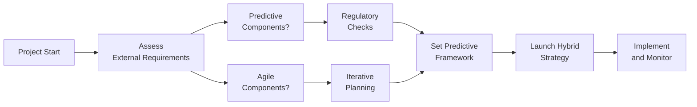

## 1.3 Beyond the Basics: Expanding Knowledge for Real-World Projects

Modern project management extends far beyond simply knowing processes, principles, and formulas. True mastery involves weaving together these elements, applying them flexibly, and customizing them for an ever-changing environment. This chapter explores ways to bridge foundational concepts with real-world practices, helping you anticipate unconventional challenges that arise in day-to-day project work. While fundamental knowledge is crucial, successful delivery often hinges on agile adaptation, stakeholder complexities, regulatory pressures, cultural nuances, technological disruptions, and organizational politics. By enhancing your project management toolkit with advanced thinking, you will be better equipped to excel in dynamic scenarios and drive meaningful outcomes.

Organizations today look for project managers who add strategic value, sustain ongoing improvements, and lead high-performing teams toward innovative results. Real-life scenes rarely follow a linear path; you may deal with shifting priorities, uncertain requirements, or cross-functional constraints. In response, many project leaders embrace eclectic methods, advanced leadership skills, and emerging technologies to stay ahead. This section explores how to evolve from a theoretical project manager to a seasoned professional who thrives in fast-paced situations, resolves conflicts seamlessly, and delivers stakeholder-centric benefits that outlast the project’s timeline.

To illustrate these points, we will look at practical strategies, advanced frameworks, hybrid techniques, leadership insights, and real-world case studies that complement the foundation set by the PMBOK® Guide and the PMP® Exam Content Outline. By the end of this reading, you will discover how to transcend “checklist” management and unlock your ability to tailor approaches, manage complexities, and lead teams through ambiguity.

---

### Bridging Theory with Practice

While understanding the latest edition of the PMBOK® Guide, its principles, and the PMP® Exam Content Outline is critical, applying these concepts can be markedly different in practice. Schedules can be disrupted by unforeseen events, budgets may be restricted, and stakeholder dynamics often turn more complex than any textbook scenario. This gap underscores the need for project managers to flex and adapt—an ability that is nurtured by maintaining a curious, continuous-learning mindset.

#### The Evolving Nature of Projects
• **Dynamic Stakeholder Requirements**: Stakeholders may reshape their needs mid-project, requiring ongoing changes to scope and deliverables.  
• **Technological Advancements**: Automated tools, remote collaboration platforms, and cloud computing accelerate the speed, but also add complexity.  
• **Regulatory Shifts**: Industries like healthcare, finance, and pharmaceuticals frequently encounter updated compliance requirements that can disrupt smooth execution.  

Rather than viewing these circumstances as obstacles, top-performing project managers see them as opportunities to demonstrate adaptive leadership, bring clarity to the team, and refine processes to ensure long-term viability.

---

### Identifying Real-World Complexities

Real-world projects typically involve a confluence of challenges that go beyond a classic or “textbook” approach. A thorough grasp of advanced project management requires awareness of these complexities, combined with a willingness to customize frameworks like agile, hybrid, or predictive models. Below are several areas demanding deeper insight and flexible thinking.

#### 1. Complex Stakeholder Environments
• **Cross-Functional Teams**: In large enterprises, resources often belong to multiple resource pools, making communication and coordination more intricate.  
• **Cultural and Virtual Barriers**: Distributed teams with diverse cultural norms, time zones, and languages can pose communication challenges that require tailored approaches.  
• **Political and Organizational Influences**: Unspoken hierarchies or conflicting departmental KPIs can complicate otherwise straightforward processes.

#### 2. Rapid Technological Shifts
• **Emerging Systems and Tools**: AI-driven analytics, machine learning algorithms for estimation, and real-time dashboards impact how data is collected and used in decision-making.  
• **Cybersecurity Considerations**: Handling sensitive data or proprietary information requires heightened security awareness, impacting project scope and risk management.  

#### 3. Continuous Regulatory Adjustments
In industries like healthcare, finance, or energy, unexpected changes in local or global regulations can instantly affect budget, scope, and timelines. Proactive project managers collaborate with legal and compliance teams, weaving possible regulatory variations into the project risk register.

#### 4. Hybrid Methodologies
One of the strongest demonstrations of practical knowledge is selecting the right mix of approaches—balancing the thoroughness of predictive planning with the adaptability of agile. Understanding how to blend these methods is essential for complex projects where clarity on the final product evolves over time.

---

### Advanced Leadership and Team Dynamics

An outstanding project manager’s role extends well beyond task coordination. They must develop emotional intelligence, recognize team motivations, nurture creativity, and channel conflict into constructive solutions. Leadership does not mean dictating plans but inspiring and guiding teams to rally around shared objectives.

• **Servant Leadership in Action**: In agile or self-organizing teams, the manager fosters an environment where each member is empowered to take ownership. This culture often cultivates faster innovation and higher-quality outcomes.  
• **Conflict as a Catalyst**: Recognizing that occasional conflict can lead to beneficial debate, innovative breakthrough, and improved processes if managed tactfully.  
• **Psychological Safety**: Encouraging open communication and respecting diverse viewpoints helps teams share ideas freely. This can be a prime driver for discovering better practices and improvements.

This awareness that leadership style must flex and evolve is the fulcrum for success in advanced real-life scenarios.

---

### Going Deeper with Risk and Ambiguity

Risk management in theory is methodical and perhaps formulaic. In reality, risk management is ongoing, often intangible, and more than a scheduled effort—it is woven through each phase of the project. This includes the intangible risks related to team morale, technology adoption, supplier reliability, and change in sponsorship. 

• **Preemptive Threat Identification**: Early detection of both internal (e.g., resource skill gaps) and external (e.g., market volatility) threats reduces rework and budget overruns.  
• **Opportunity Management**: While threat identification is crucial, so is leveraging beneficial uncertainties. Spotting and exploiting favorable changes in technology, regulations, or marketplace trends can generate new advantages.  
• **Complex Risk Interactions**: Multiple risk events may converge, creating exponential impact. Advanced project managers model interlinked risks rather than treating each as an isolated scenario.

---

### Integrating Agile, Predictive, and Hybrid Approaches

Most modern projects incorporate some form of agility, whether the entire project is agile or only certain phases. Knowing when and how to embrace agile or a hybrid approach is a critical skill, especially in projects that have regulatory compliance coupled with iterative product development. This synergy is highlighted in the PMBOK® Guide Seventh Edition, which encourages tailoring—selecting, modifying, and blending methods for unique project and organizational contexts.

#### Diagram: Tailoring the Approach

Below is a sample Mermaid diagram illustrating how a project manager might choose from predictive, agile, and hybrid strategies depending on factors like uncertainty, stakeholder engagement needs, and regulatory complexity:

- **Predictive Components**: Often suited for segments with regulatory or compliance obligations where thorough documentation is essential.  
- **Agile Components**: Ideal for innovative or evolving segments that benefit from iterative delivery and continuous feedback loops.  
- **Hybrid Strategy**: Merges the best of both worlds, addressing stability needs while capitalizing on iterative learning.

---

### Practical Case Study: Software Implementation at a Global Retailer

Consider a project team tasked with deploying a new inventory management system across multiple continents. The software variance must comply with regional regulations that differ in each location. At the same time, the business owners seek monthly releases of streamlined functionalities.  

• **Stakeholder Challenges**: Over 20 distinct stakeholder groups exist, each with different goals and compliance thresholds.  
• **Approach**: The solution involved a hybrid methodology—fully predictive for compliance-heavy processes (e.g., financial transactions) paired with agile sprints for rapid UI development.  
• **Risk Management**: Regular risk reviews included a sub-list for global compliance threats. Each release cycle ended with a compliance gating check before proceeding.  
• **Outcome**: By segmenting the project into compliance-specific modules (predictive) and iterative modules (agile), the retailer minimized regulatory pitfalls without stifling the speed of innovation.

---

### Best Practices and Lessons Learned

While no two projects are identical, recurring themes emerge in advanced scenarios. The following best practices serve as guiding principles as you expand on basic theory:

• **Leverage Steering Committees**: With complex projects, sponsor buy-in is paramount. Regularly update a steering committee composed of executive sponsors, major functional leads, and subject matter experts.  
• **Develop a Flexible Project Culture**: Encourage your team to adapt scheduling, risk, or scope processes in response to new insights. Strict adherence to an original plan without fluid updates can lead to stagnation.  
• **Promote Ongoing Learning and Knowledge Transfer**: Document lessons learned in real-time, hold brief reflection sessions after each iteration, and cultivate a knowledge-sharing habit within the organization.  
• **Refine Communication Channels**: Tailor your communication approach to each stakeholder type. What works for an executive sponsor may differ greatly from what is needed for a technical lead or an external vendor.  
• **Adopt Tools that Enhance Transparency**: Dashboards and collaboration platforms (such as real-time project boards or advanced analytics tools) help reveal issues early, maintain alignment, and foster trust.

---

### Common Pitfalls and How to Avoid Them

Advanced projects often fail when managers overlook critical nuances. Recognize these pitfalls:

• **Underestimating Change Management**: Even the best technical solution can be derailed if the organization is not ready to accept changes to processes, roles, or responsibilities. Build time for end-user training, stakeholder alignment, and staff readiness checks.  
• **Inconsistent Stakeholder Engagement**: Sporadic communication fosters misunderstandings about project goals or scope changes. Sustain momentum by sharing consistent, meaningful updates.  
• **Excessive Reliance on a Single Methodology**: Clinging to a pure agile or purely predictive style can inhibit the ability to adapt. Remain open to a combination that suits the specific challenges at hand.  
• **Ignoring Cultural Factors**: A project manager must remain sensitive to cultural norms, particularly if the team is distributed internationally. Seemingly minor cultural missteps can degrade trust rapidly.  
• **Inadequate Post-Project Integration**: Deliverables that are not seamlessly integrated with existing operations often fail to realize their full benefit. Engage operations staff early to ensure a smooth handover.

---

### Continuous Innovation and Leadership

Staying current with new practices is an ongoing journey rather than a one-time event. Top-performing project professionals commit to professional networks, attend conferences, and stay abreast of research on emerging technologies, managerial techniques, and evolving business environments.

This commitment not only enhances your technical competence but also revitalizes your leadership approach. Clarifying shared purpose, modeling ethical behavior, and championing transparency inspire teams to exceed expectations. The confluence of advanced leadership, strategic insight, and robust application of PM fundamentals is what truly expands your capacity to navigate high-stakes projects.

---

### References for Further Exploration

• Project Management Institute (2021). “PMBOK® Guide – Seventh Edition.” PMI.  
• Project Management Institute (2017). “Agile Practice Guide.” PMI.  
• Drucker, Peter F. (2007). “Management: Tasks, Responsibilities, Practices.” HarperCollins.  
• Kotter, John P. (2012). “Leading Change.” Harvard Business Review Press.  
• Schwaber, Ken, and Sutherland, Jeff (2020). “The Scrum Guide.” scrumguides.org  

These publications delve deeper into strategic application, advanced leadership, and techniques for tackling significant uncertainties, helping sharpen your practical skill set beyond core exam requirements.

---

## Test Your Knowledge on Real-World Project Management Complexities



### Which approach best helps manage simultaneous regulatory requirements and feature updates in a project?

- [ ] Use only a predictive approach to ensure documentation for compliance.  
- [x] Blend predictive and agile components to balance rigorous compliance with iterative feature releases.  
- [ ] Adopt a strictly agile approach to reduce overhead.  
- [ ] Postpone compliance checks until final deliverables are nearly complete.  

> **Explanation:** A hybrid model combines predictive frameworks for compliance aspects while leveraging agile for iterative development and frequent updates.  

### What is the key barrier to successful global project execution?

- [ ] Overly detailed risk registers.  
- [x] Cultural and virtual communication challenges.  
- [ ] Hybrid project management approaches.  
- [ ] Automated collaboration tools.  

> **Explanation:** While other factors may pose obstacles, cultural differences and time zone issues make communication planning more complex in international projects.  

### In advanced scenarios, how should conflict be treated?

- [ ] Suppressed immediately to avoid any negative impact.  
- [x] Leveraged as an opportunity for dialogue and innovation.  
- [ ] Directed toward the project sponsor for resolution.  
- [ ] Avoided through strict hierarchical control.  

> **Explanation:** Conflict, if managed effectively, can stimulate creativity and improvement, highlighting diverse perspectives that can refine project solutions.  

### Why is continuous feedback vital in a hybrid project?

- [x] It refines deliverables based on evolving requirements and stakeholder input.  
- [ ] It stalls progress, creating iterative loops and confusion.  
- [ ] It ensures the project remains entirely predictive.  
- [ ] It eliminates the need for risk management.  

> **Explanation:** Feedback loops allow for real-time course corrections, boosting adaptability and ensuring deliverables remain aligned with stakeholders’ evolving needs.  

### Which of these is a best practice for keeping executives informed in complex projects?

- [x] Set up a regular steering committee meeting with major decision makers.  
- [ ] Send daily emails covering every minor detail.  
- [x] Provide periodic progress dashboards and highlight key risks.  
- [ ] Expect sponsors to proactively reach out for updates.  

> **Explanation:** Steering committees offer a formal, consistent, high-level forum for sponsors and functional heads to stay aligned on progress, risks, and critical decisions. Progress dashboards reinforce ongoing transparency.  

### Which is NOT a common pitfall in advanced project management?

- [ ] Neglecting change management aspects.  
- [ ] Focusing too heavily on a single methodology approach.  
- [ ] Failing to integrate deliverables with operations.  
- [x] Providing comprehensive stakeholder updates at timely intervals.  

> **Explanation:** Regular, meaningful communications are essential. The other options represent frequent mistakes observed in higher-level projects.  

### When might emergent behaviors most frequently appear in a project?

- [x] In complex environments with multiple interconnected variables and feedback loops.  
- [ ] When the project manager strictly follows a one-size-fits-all plan.  
- [x] During times of significant organizational change or market shifts.  
- [ ] When no stakeholder engagement exists.  

> **Explanation:** Emergent behaviors typically surface in complex adaptive systems or contexts under rapid, intertwined change conditions—such as new organizational structures or volatile markets.  

### What is the advantage of incorporating both qualitative and quantitative risk analyses?

- [x] Qualitative analysis prioritizes risk urgency, while quantitative analysis measures impact numerically.  
- [ ] Both methods are fundamentally identical.  
- [ ] Quantitative analysis replaces the need for qualitative analysis.  
- [ ] Qualitative analysis is only for final project phases.  

> **Explanation:** Using both tools allows project managers to gauge risk severity and potential outcomes from different angles, leading to more robust and data-driven decision-making.  

### How does a real-time collaboration dashboard benefit the project team?

- [x] It offers instant visibility into task statuses, resource utilization, and pending issues.  
- [ ] It restricts stakeholder access to key metrics.  
- [ ] It only benefits agile teams with no overhead for predictive projects.  
- [ ] It completely eliminates the requirement for status meetings.  

> **Explanation:** Real-time dashboards foster transparency and proactive issue resolution; however, they complement, not replace, essential communications and governance activities.  

### True or False: Hybrid project methodologies only apply to IT or software projects.

- [x] True  
- [ ] False  

> **Explanation:** While hybrid approaches are popular in IT, they can be applied to various sectors—construction, healthcare, education, and beyond—where a mix of structure and adaptability is beneficial.  



---

## PMP Mastery: 1500+ Hard Mock Exams with Full Explanations 

Looking to crush the PMP exam with confidence? Dive deep into 6 rigorous mock exams totaling 1500+ advanced-level questions, each accompanied by clear, step-by-step explanations. Hone your test-taking strategies, master complex topics, and build the resilience you need on exam day. Perfect for serious PMs aiming beyond fundamentals.  

Enroll now:  
[PMP Mastery: 1500+ Hard Mock Exams with Exceptional Clarity & Full Explanations](https://www.udemy.com/course/pmp-2025/?referralCode=CF83A54BC86BE27F9AFE)

_Disclaimer: This course is not endorsed by or affiliated with the PMI examination authority. All content is provided purely for educational and preparatory purposes._
