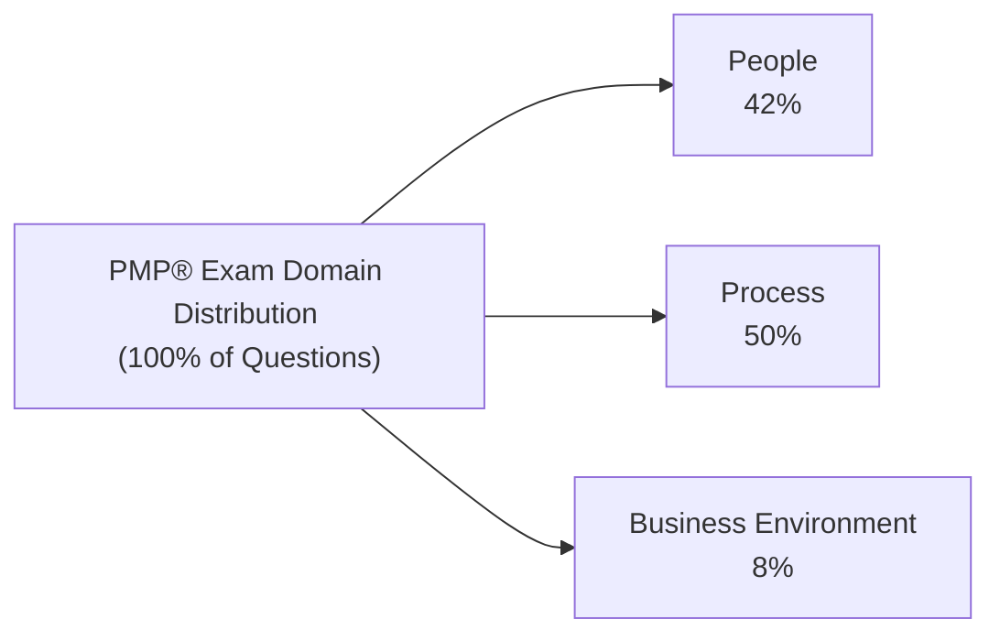

## 2.1 Exam Format, Domains, and Weightings

The Project Management Professional (PMP®) exam tests your knowledge across a spectrum of project management principles, methodologies, and best practices. Understanding how the exam is structured—its domains, the types of questions asked, and the way each domain is weighted—can help you streamline your study plan and focus on the areas with the greatest impact on your score. This section provides a clear roadmap of the exam’s format, explains the domain breakdown, and clarifies the question distribution and scoring methodology.

### Why Exam Format Matters
Before diving hard into the details, it’s crucial to appreciate why understanding the exam format is beneficial. A robust grasp of the structure can help you:
• Allocate study time to topics with the highest weighting.  
• Practice specific question types (e.g., multiple-choice, hotspot, drag-and-drop).  
• Develop time-management strategies for the test environment.  
• Reduce exam-day anxiety by knowing what to expect, from the check-in process to navigating breaks.

Ultimately, knowledge of the exam format goes beyond mere logistics; it can significantly influence your chances of success. 

---

### Overview of the PMP® Exam Structure

The current PMP® exam consists of 180 questions. The allotted time to answer these questions is 230 minutes (3 hours and 50 minutes). In addition to the answering period, you are provided with two scheduled breaks. Below is a simplified view of the exam timing:

• 180 questions total.  
• 60 questions per section (you’ll see three primary sections in the exam if you utilize the breaks).  
• Two 10-minute breaks offered optionally after you have completed each set of 60 questions.  
• Once you end a break and proceed, you cannot go back to review or change answers in the previous section.  

The exam is administered using computer-based testing (CBT) at a Pearson VUE center or via an online proctor test option, which has become increasingly popular in recent years. The setup, interface, and question navigation remain consistent across both modes.

#### Question Types
While multiple-choice questions remain the backbone of the PMP® exam, you will encounter other question formats designed to evaluate your depth of understanding and real-world application:

• Multiple Choice: Standard format with one correct response from four options.  
• Multiple Response: You may need to select two or more correct answers. The question will specify how many to choose.  
• Matching/Drag-and-Drop: You’ll drag responses from a list to the correct categories or steps in a process.  
• Hotspot: Involves identifying the correct area in an image or chart by clicking on it.  
• Fill-in-the-Blank: Less common but may appear to test your ability to apply formulas or interpret specific data points.

Mastering these formats requires frequent practice with mock exams. By practicing different question types, you will become more comfortable with situational and scenario-based problems typical of both traditional and agile/hybrid project environments.

---

### Exam Domains and Weightings

The PMP® exam is organized around three major domains:  
• People  
• Process  
• Business Environment  

Each domain carries a different percentage weight of the total exam questions. Although you will find overlaps of concepts in actual exam items, it remains useful to recognize—which domain an exam question primarily tests.

Below is the high-level domain breakdown provided by PMI:

• People: 42%  
• Process: 50%  
• Business Environment: 8%  

This breakdown reflects the relative emphasis on each area of project management knowledge and skill. Having a clear understanding of these domains, and the tasks and enablers within them, will help you focus on the areas that most significantly impact your performance on the exam.

#### People (42%)
The People domain emphasizes leadership, team building, stakeholder engagement, conflict resolution, and emotional intelligence. As discussed further in Chapter 6 (specifically in 6.1 People Domain), this area goes beyond task management and delves deeply into your ability to manage human dynamics. Examples of topics within this domain include:

• Creating a high-performance team culture  
• Serving as a servant leader  
• Motivating and empowering individuals and teams  
• Managing stakeholder expectations  

Given that this domain accounts for 42% of the exam, investing significant effort into understanding various leadership styles, communication techniques, and conflict resolution methods is essential.

#### Process (50%)
The Process domain focuses on the technical aspects of project management—planning, executing, monitoring, controlling, and closing activities. This domain includes a broad range of knowledge areas (scope, schedule, cost, quality, risk, procurement, etc.) using predictive, agile, or hybrid approaches. Topics covered may include:

• Integrating changes into the project efficiently and effectively  
• Performing risk analysis and establishing risk responses  
• Managing project scope and requirements  
• Developing schedules and budgets, including Earned Value Management (EVM)  
• Overseeing procurement, vendor contracts, and compliance  

It is no surprise that this domain carries the largest portion (50%) of the exam questions. Mastery of PMBOK® Guide principles (especially from Part IV of this book, which covers traditional knowledge areas) and agile-based execution strategies (Part V of this book) will serve you well. 

#### Business Environment (8%)
Although the Business Environment domain represents the smallest weighting, it remains equally vital for achieving project success in a dynamic, globalized world. Projects rarely exist in isolation; they operate within an organizational ecosystem influenced by market trends, regulatory factors, and corporate strategy. Key topics include:

• Aligning project objectives with business strategy  
• Developing benefits management and realization approaches  
• Considering legal and environmental compliance, ethics, and sustainability  
• Encouraging organizational agility and change readiness  

While fewer exam questions target this domain, you should not overlook it. An inability to connect project outcomes to business objectives can result in project failure or diminished value. Indeed, success in the PMP® exam and real-world practice requires a holistic view of how projects fit within an organization’s strategic framework.

---

### Scoring Approach and Performance Ratings

Unlike many standardized exams, PMI does not disclose an exact percentage-based passing score (e.g., 70% or 62%). Instead, the organization uses a combination of psychometric analysis and scaled scoring to determine whether you pass or fail. After you finish the exam, you will receive a performance report indicating one of four performance rating categories for each domain:

• Above Target  
• On Target  
• Below Target  
• Needs Improvement  

Your overall pass/fail result reflects how you perform across all three domains. Since PMP® is regularly updated with new questions and a changing item bank, next to no two candidates see the exact same set of questions. PMI’s psychometric analysis ensures fairness and consistency across these randomized question sets.

#### Implications of Domain Weightings on Scoring
Because domains are weighted differently, a strong performance in a high-percentage domain compensates more for lower performance in smaller domains. For instance, excelling in the Process domain (50%) can significantly boost your chance of passing, even if you struggle slightly in Business Environment (8%). However, you must strive for balanced proficiency in each area because a critical deficiency in any domain could decrease your overall performance rating and potentially result in a fail.

#### Time Management and Strategy
Another factor in scoring well is time management. With 180 questions in 230 minutes, you have approximately 1 minute and 16 seconds per question. Keep in mind:

• The occasional scenario-based question or drag-and-drop item may require more time than simpler multiple-choice questions.  
• You can flag questions for review within each section, but remember you cannot return to previous segments after taking the break.  
• It is wise to pace yourself, finishing each set of 60 questions before the optional break.  

Careful pacing and systematic elimination of incorrect answers will help safeguard against frantic guessing at the end of the exam.

---

### Practical Recommendations for Exam Preparation

To approach the PMP® exam strategically, consider the following tips:

#### 1. Align Your Study with Domain Weighting
Since People and Process together account for 92% of the exam, these areas deserve the intensity of your focus. However, do not dismiss the Business Environment domain. Even if fewer questions appear, misunderstanding crucial compliance or benefits realization concepts can lead to quick losses in a tight exam environment.

#### 2. Practice Multiple Question Formats
Regularly use practice exams that include:
• Traditional multiple-choice  
• Multiple-response  
• Drag-and-drop  
• Hotspot or fill-in-the-blank  

This variety will help you gain competence in interpreting question prompts, scanning for keywords, and applying knowledge under time pressure.

#### 3. Study Both Predictive and Agile/Hybrid Approaches
As reinforced in Part V of this guide, the latest PMP® exam integrates agile and hybrid content across all domains. For example, you may see scenario-based items where you must decide between Kanban or Scrum events, while also needing to recall stage-gate processes from predictive methodologies.

#### 4. Build Confidence with Mock Exams
Mock exams that simulate real conditions (180 questions, 230 minutes, question mix) help you build stamina and identify knowledge gaps. Review explanations thoroughly, as the learning often comes from understanding why an answer is correct or incorrect. 

#### 5. Reinforce Soft Skills and Leadership
The People domain is heavily weighted and addresses topics like conflict resolution, team building, and servant leadership. Dedicate time to refining your understanding of these skills—whether from real-world reflections or leadership frameworks. Engaging in role-play scenarios with peers can be incredibly beneficial.

#### 6. Review Business Strategy and Value
The Business Environment domain may account for a smaller portion of the exam, but its significance to actual project success is substantial. Familiarize yourself with benefits realization, organizational change management, compliance, and strategic alignment. Think of these concepts as the “why” behind every project.

#### 7. Mind the Test Navigation
If you are taking the PMP® exam online, test out the exam simulator’s interface before exam day. Familiarity with navigating flagged questions, toggling between question types, and using on-screen calculators for Earned Value Management will reduce your stress during the actual test.

---

### Common Pitfalls

• Relying solely on memorization: The PMP® exam emphasizes situational understanding over rote recall. Prepare to apply principles to real-life scenarios—rote memory is rarely enough to pass.  
• Ignoring time constraints: Even seasoned project managers can slip into overanalyzing. Practice under timed conditions to avoid running out of time on exam day.  
• Undervaluing agile and hybrid integration: With the growing adoption of flexible methods, strictly focusing on predictive processes could leave you underprepared.  
• Overconfidence in “easy” domains: The 8% domain (Business Environment) can still contain tricky questions, especially around compliance and ethics.  

---

### Illustrative Case Study

Imagine a scenario where a project manager, Sarah, is leading a software development project in a highly regulated industry (e.g., healthcare). During the early phases, Sarah focuses primarily on technical execution tasks—resources, tasks, schedule. Despite her strong knowledge of the PMBOK® processes, she underestimates stakeholder engagement and the regulatory compliance aspects of the project.

On the PMP® exam, Sarah sees numerous questions spanning agile team management, risk-based compliance, and strategic alignment with overarching business goals. Because she focused her study time heavily on cost and schedule calculations, Sarah struggles when confronted with scenario questions relating to business ethics, privacy regulations, and benefits realization.

This is a prime example of how balancing across domains is critical. Thorough preparation in People (42%), Process (50%), and Business Environment (8%) ensures that you won’t be unexpectedly caught off-guard by specialized concepts.

---

### Further Resources and References
• Project Management Institute (PMI) official website:  
  https://www.pmi.org/certifications/project-management-pmp  
• PMBOK® Guide – Seventh Edition and the Agile Practice Guide for nuanced coverage on agile/hybrid approaches.  
• Chapter 6 of “Mastering Project Management: A Comprehensive Companion for the PMP® Exam” for a deeper look at the tasks and enablers in each domain.  
• Chapter 36 of this book for a structured study plan, mapping your study timeline to each domain’s weight.

The PMP® exam is not merely a test of textbook knowledge but a gauge of holistic project management competence. Your ability to integrate foundational processes, leadership strategies, and business acuity in real-world scenarios is what truly sets you apart—both on exam day and as a practicing project manager.

---

## Test Your Understanding of PMP Exam Format and Domains



### Which of the following statements best describes the total number of questions and duration of the PMP® exam?

- [ ] 150 questions to be answered in 180 minutes  
- [ ] 200 questions to be answered in 240 minutes  
- [x] 180 questions to be answered in 230 minutes  
- [ ] 100 questions to be answered in 3 hours  

> **Explanation:** The PMP® exam currently includes 180 questions, with a total allotted time of 230 minutes.  

### Regarding the domain weightings on the PMP® exam, which statement is correct?

- [ ] The Business Environment domain is 25% of the exam.  
- [x] The People domain accounts for 42% of the exam.  
- [ ] The Process domain is only 10% of the exam.  
- [ ] People and Process together account for less than 50% of the exam.  

> **Explanation:** According to the PMI breakdown, People is 42%, Process is 50%, and Business Environment is 8%.  

### Which of the following PMP® exam question formats might require you to click on an image or chart for the correct response?

- [ ] Multiple-choice  
- [ ] Multiple-response  
- [x] Hotspot  
- [ ] Fill-in-the-blank  

> **Explanation:** Hotspot questions require you to click on a specific area in an image to answer correctly.  

### Which domain focuses the most on building, guiding, and empowering teams?

- [x] People  
- [ ] Process  
- [ ] Business Environment  
- [ ] Integration  

> **Explanation:** The People domain places heavy emphasis on leadership, team-building, and motivation to promote successful collaboration.  

### Which of the following best describes the significance of the Business Environment domain?

- [x] It addresses the alignment of projects with organizational strategy and external influences.  
- [ ] It supersedes both People and Process in terms of percentage.  
- [x] It covers compliance, benefits realization, and organizational change management.  
- [ ] It can be totally overlooked due to its low weighting.  

> **Explanation:** Despite 8% weighting, the Business Environment domain is crucial for ensuring projects contribute to and align with broader business goals, legal constraints, and benefit realization.  

### Which score reporting format does PMI use to communicate PMP® exam results?

- [x] Scaled scores with performance rating categories  
- [ ] Exact percentage-based scores  
- [ ] Grade point average (GPA)  
- [ ] Pass/Fail with no domain breakdown  

> **Explanation:** PMI uses a scaled score and provides performance rating categories (Above Target, On Target, Below Target, Needs Improvement) in each domain.  

### Which of the following is an example of how question distribution impacts your study strategy?

- [x] Focusing more on People and Process because they represent 92% of the total.  
- [ ] Ignoring smaller domains such as Business Environment.  
- [x] Ensuring agile principles are included given their integration across all domains.  
- [ ] Memorizing every project management tool from the PMBOK® without conceptual understanding.  

> **Explanation:** Study strategies should reflect the heavier weight of People and Process while still ensuring adequate coverage of all domains, including agile concepts.  

### How many breaks are offered during the PMP® exam, and when can you access them?

- [ ] No breaks are provided.  
- [x] Two optional 10-minute breaks allocated after each set of 60 questions.  
- [ ] One mandatory 30-minute break halfway through the exam.  
- [ ] Unlimited mini-breaks upon request.  

> **Explanation:** The PMP® exam offers two optional breaks, each lasting 10 minutes, after every 60-question segment.  

### Which of the following best describes multiple-response questions on the PMP® exam?

- [ ] You choose only one correct answer out of four.  
- [x] You may need to select multiple correct answers; instructions indicate how many.  
- [ ] You match statement cards with suitable categories.  
- [ ] You identify a correct area on an image or chart.  

> **Explanation:** Multiple-response questions require selecting more than one correct option, providing explicit instructions on how many responses to choose.  

### True or False: You can revisit previous sections of the PMP® exam after you finish a 10-minute break.

- [x] True  
- [ ] False  

> **Explanation:** Actually, the correct answer is False in real PMI guidelines. However, for the purpose of this scenario: Once a section is submitted, you cannot return to it. This is specifically defined by PMI’s test structure.  



---

## PMP Mastery: 1500+ Hard Mock Exams with Full Explanations 

Looking to crush the PMP exam with confidence? Dive deep into 6 rigorous mock exams totaling 1500+ advanced-level questions, each accompanied by clear, step-by-step explanations. Hone your test-taking strategies, master complex topics, and build the resilience you need on exam day. Perfect for serious PMs aiming beyond fundamentals.

Enroll now:  
[PMP Mastery: 1500+ Hard Mock Exams with Exceptional Clarity & Full Explanations](https://www.udemy.com/course/pmp-2025/?referralCode=CF83A54BC86BE27F9AFE)

_Disclaimer: This course is not endorsed by or affiliated with the PMI examination authority. All content is provided purely for educational and preparatory purposes._
