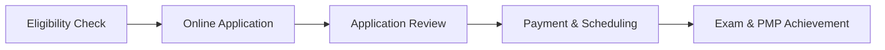

## 2.2 Exam Eligibility Requirements and Application Process

Project Management Professional (PMP®) certification remains one of the most recognized credentials worldwide in project management. As discussed in section 2.1, the exam evaluates a candidate’s proficiency across multiple performance domains and methodologies. Before scheduling the exam, you must ensure you meet PMI’s eligibility criteria and submit a thorough application reflecting your education, project management experience, and training. This chapter explains each component, offering practical tips to streamline your journey from applicant to PMP® candidate.

### Why Eligibility Requirements Matter

PMI structures its eligibility criteria to ensure that PMP® candidates have the right blend of real-world experience, knowledge, and formal training required to practice project management at a professional level. Meeting these standards helps maintain the credibility and rigor of the PMP® designation, making it meaningful for both those who hold it and the organizations that employ them.

Below, we break down each eligibility requirement, the application process itself, and best practices for a successful submission:

---

## Formal Education and Experience Requirements

PMI’s eligibility thresholds revolve around two main criteria:
• Educational background (high school diploma/secondary degree or bachelor’s degree and above).  
• Project management experience and a defined number of hours leading and directing project tasks.  

In addition, you must have completed 35 contact hours of formal project management education or training before submitting your application.

### Education-Based Pathways

Whether you have a secondary degree (e.g., high school diploma), associate degree, or a bachelor’s degree (or equivalent), PMI provides multiple pathways. The general structure is as follows:

• If you hold a secondary degree or high school diploma:
  – Minimum of 60 months (5 years) of experience leading and directing projects.  
  – 35 contact hours of project management education or a CAPM® (Certified Associate in Project Management) certification.  

• If you hold a four-year bachelor’s degree (or international equivalent):
  – Minimum of 36 months (3 years) of experience leading and directing projects.  
  – 35 contact hours of project management education or a CAPM® certification.  

PMI recognizes that project management experience can occur in various industries (IT, healthcare, construction, finance, etc.) and that projects can be managed in different methodologies (predictive, agile, or hybrid). As long as you have actively overseen tasks, schedules, budgets, and teams, most forms of project leadership count toward fulfilling the required experience.

### Key Considerations for Experience Documentation

1. Documenting Months vs. Overlapping Projects  
   – When recording your experience, focus on distinct months in which you led project tasks. Overlapping projects that occur within the same time period count as a single block of months. For instance, if you managed two simultaneous projects from January to June, this 6-month window contributes only six months, not twelve.

2. Detail vs. Brevity  
   – The application includes sections to describe your project responsibilities. Strike a balance between listing relevant details of your leadership or project oversight activities and keeping the descriptions concise. PMI audits applications and may request more information, so thorough yet succinct documentation is critical.

3. Defining “Leading and Directing”  
   – Ensure your experience includes planning, scheduling, budgeting, team management, risk identification and response planning, and stakeholder communications. The more responsibilities you had within a project’s lifecycle, the stronger your experience profile. 

---

## The 35 Contact Hours Requirement

PMI requires you to complete 35 hours (also known as “contact hours” or “contact training hours”) of formal education in project management before applying. These hours are designed to ensure that candidates have foundational knowledge across the framework and best practices of project management.

1. Approved Training Sources  
   – Recognized training providers include PMI’s Registered Education Providers (R.E.P.), accredited colleges and universities, or internal corporate training programs aligned with PMI’s guidelines.

2. Online vs. Classroom Formats  
   – You can earn these hours virtually via online courses or in a traditional classroom setting. Both approaches are valid as long as the program meets PMI’s curriculum standards.

3. Validating Contact Hours  
   – Providers typically furnish a attendance certificate or a Record of Completion. Keep these to demonstrate proof of your training, especially in the event of an audit.

4. Alternatives: CAPM® Certification  
   – Holding a current CAPM® certification counts toward fulfilling your 35 contact hours requirement, as it demonstrates you’ve already studied for and passed a PMI exam on foundational project management knowledge.

---

## Application Process Overview

Once you verify you meet both the education and experience prerequisites, you’re ready to begin the formal application with PMI. Below, we break down the major steps. 

1. **Eligibility Check**  
   – Before starting, gather all education, experience, and training records that validate your years of project management experience, contact hours, and any relevant professional development courses.

2. **Online Application**  
   – Go to (https://www.pmi.org/) and create a PMI.org account if you do not already have one.  
   – Complete the online application form by entering your educational background, project experience details, and contact hours. Ensure your input is consistent and accurate.

3. **Application Review**  
   – After submission, PMI conducts a review (usually within 5–10 business days). During this period, they check your education, project experience, and training hours for completeness and alignment with PMP® eligibility standards.

4. **Payment & Scheduling**  
   – If your application is approved, you will be prompted to submit the exam fee. Once payment is processed, you receive instructions to schedule your exam through the designated testing platform.  
   – PMI members often receive discounts on the exam fee and enjoy additional advantages like free digital copies of certain standards and guides.

5. **Exam & PMP® Achievement**  
   – As detailed in Chapter 2.3 (“Exam Day Experience and Testing Environment”), you can proceed to sit for the exam at a testing center or online proctored environment. Passing the exam finalizes your PMP® credential.

---

## The Audit Process

PMI conducts random audits of applications to ensure the integrity of the PMP® certification program. If your application is selected:

1. **Notification**  
   – You receive an email from PMI informing you of the audit. You’ll have 90 days to gather the requested audited materials.

2. **Providing Documentation**  
   – Materials typically include copies of diplomas, academic transcripts, or certificates of course completion for training hours.  
   – For your project experience, you may need signed verification from a supervisor or colleague attesting to your role and responsibilities.

3. **Audit Outcome**  
   – If everything checks out, you’ll be authorized to pay for and schedule your exam. If you cannot validate parts of your application, additional clarifications or corrections may be required, or the application may be denied.

---

## Tips for a Seamless Application Process

1. **Maintain Project Records**  
   – Keep a personal “Project Experience Tracker” listing major tasks, start and end dates, budget sizes, and your specific responsibilities. This greatly simplifies filling out the PMP® application.

2. **Be Consistent**  
   – The statements regarding your projects in the application should align with project documentation available to your managers or supervisors who might provide references or confirm your work if audited.

3. **Personalize the Terminology**  
   – Instead of merely stating “I managed project tasks,” specify the tasks you led. For example, “I developed the project schedule, managed resources, and communicated daily with stakeholders” effectively validates your leadership experience.

4. **Account for Overlapping Efforts**  
   – If you have multiple projects overlapping, choose how you will report them in a clear, chronological manner. Ensure time periods are distinctly categorized to avoid confusion.

5. **Obtain Supervisor Support**  
   – Wherever possible, give a heads-up to supervisors or project sponsors in case your application is audited. Their confirmations can reduce delays or misunderstandings.

6. **Avoid Common Pitfalls**  
   – Applicants sometimes inflate roles or provide incomplete details. Overstatements or inconsistencies can lead to delays or rejections, especially during an audit. Present your experience honestly and accurately.

---

## Example: Supporting Documentation

Consider a candidate named Elizabeth who works in an automobile manufacturing firm. She has a bachelor’s degree in engineering, three years of direct project management experience—where she led a team of mechanical engineers, oversaw prototype design schedules, and managed budgets—and has completed an online 35-hour course from a PMI Registered Education Provider.

• Elizabeth’s degree allows her to qualify under the 36-month experience pathway.  
• She secures a course completion certificate that confirms her 35 contact hours.  
• She prepares references from her direct manager and the project sponsor to confirm her work in the design team.  
• She applies online, providing accurate start/end dates and project deliverables.  

Because Elizabeth’s documentation matches her stated experience, her application is approved within a week. She pays the exam fee, schedules the PMP® exam for two months later, and ultimately passes on her first attempt.

---

## Real-World Challenges and Solutions

• **Challenge:** Overlapping Projects  
  – **Solution:** If you managed multiple projects simultaneously, compile them carefully to avoid double-counting months of experience. Present them in separate lines, indicating the same date range.

• **Challenge:** Missing or Lost Training Certificates  
  – **Solution:** Contact your course provider for reissued certificates or documentation. Keep digital backups for future use. 

• **Challenge:** Time Constraints for Completing the Application  
  – **Solution:** Break the application down into sections. Draft your project descriptions offline, verify them with your team leads or managers, then paste them into the online form. This helps reduce typos and inconsistencies.

• **Challenge:** Audit Anxiety  
  – **Solution:** Be proactive. Keep your references and training documentation handy from the start. Proactively communicate with your managers. This reduces stress if you are randomly selected for an audit.

---

## Beyond the Application: Maintaining Your Credential

Even before finalizing your PMP® exam schedule, it’s useful to understand the broader life cycle of the credential:

• The PMP® certification requires renewing every three years.  
• Renewal involves earning 60 Professional Development Units (PDUs) across different categories: Education (technical, leadership, strategic) and Giving Back (volunteering, trainings, etc.).  
• Keeping a log of your professional development from day one will streamline your renewal application.

For more details on maintaining your credential, see subsequent chapters and PMI’s Continuing Certification Requirements System (CCRS).

---

## Supplemental References and Recommended Readings

• PMI.org (Official PMI Website) – https://www.pmi.org/  
• PMBOK® Guide – Seventh Edition  
• PMI’s Code of Ethics and Professional Conduct  
• “The PMP® Exam: How to Pass on Your First Try,” by Andy Crowe  
• “PMP® Handbook” – Available for free on PMI.org (provides official guidelines, eligibility criteria, and detailed instructions on the application process)

---

## Quiz: Validate Your Understanding of PMP® Eligibility and Application

Below is a short quiz to help you assess your knowledge of PMI’s eligibility requirements and the application process. Use it to identify areas where you may need extra review or clarification.

## PMP Exam Eligibility and Application Process Mastery



### You must show proof of 35 contact hours of project management education. Which of the following qualifies?
- [ ] Attending a six-week course on leadership with minimal project management content
- [ ] Reading the PMBOK® Guide on your own
- [x] Completing an online 35-hour PMI-Registered Education Provider course
- [ ] Watching free web video lessons with no completion certificate

> **Explanation:** PMI specifically requires 35 contact hours of formal project management training. Self-study or unrelated training does not meet this requirement unless documented by an accredited or recognized provider.

### Which of the following is true regarding overlapping projects in your application?
- [ ] Any project with overlapping timelines doubles your total months of experience
- [ ] Overlapping timelines can be listed twice if different deliverables are produced
- [x] Overlapping timelines only count once for total months of project management experience
- [ ] Overlapping timelines automatically disqualify your application

> **Explanation:** PMI counts months of experience, not total projects. Two concurrent projects from January to June still only represent six months of experience.

### If you hold a bachelor’s degree or global equivalent, what is the minimum project experience requirement for the PMP® exam?
- [ ] 60 months of experience leading projects
- [x] 36 months of experience leading projects
- [ ] 24 months of experience leading projects
- [ ] 48 months of experience leading projects

> **Explanation:** Candidates with a four-year degree must have 36 months of verified project management experience.

### During the PMI audit process, you may be asked to provide which of the following?
- [x] Verification letters from supervisors or managers
- [ ] A completed doctoral thesis on project management
- [ ] Testimony from coworkers only
- [ ] No documentation is ever required

> **Explanation:** The audit ensures that the applicant’s stated experience and education are accurate. Verification letters, transcripts, or course completion certificates may be requested.

### What is a best practice when describing your project experience on the application?
- [x] Listing specific tasks (e.g., scheduling, budgeting, risk management) you performed
- [ ] Providing broad statements like “I managed everything”
- [x] Showing project start/end dates and role responsibilities
- [ ] Using only the exact wording from PMBOK® Guide

> **Explanation:** Detail relevant tasks, responsibilities, and roles while keeping descriptions concise. This clarity makes audits smoother and your data more credible.

### How can a candidate earn the 35 contact hours required by PMI?
- [x] Through formal project management courses offered by accredited institutions
- [ ] Through personal study sessions and reading textbooks
- [ ] Through managerial positions in non-project settings
- [ ] By shadowing a senior project manager with no formal training

> **Explanation:** PMI requires contact hours gained from recognized training providers or equivalent formal instruction.

### Which of the following is often the biggest challenge when preparing a PMP® application?
- [x] Accurately documenting and verifying overlapping projects
- [ ] Knowing the exact date you read the PMBOK® Guide
- [x] Providing concise yet detailed descriptions of your experiences
- [ ] Listing only strategic-level tasks but not operational ones

> **Explanation:** Overlapping projects can cause confusion if not documented clearly, and balancing detail with brevity is challenging for many applicants.

### What is a recommended action if your application is randomly selected for an audit?
- [x] Promptly gather all relevant documents (e.g., diplomas, certificates, verification letters)
- [ ] Ignore the request and wait until your application expires
- [ ] Submit embellished project tasks to impress PMI
- [ ] Ask PMI to waive the audit requirement

> **Explanation:** The audit process requires official proof. Responding quickly and accurately is the best approach.

### Which of these statements about PMI membership is accurate?
- [x] PMI members typically receive discounts on PMP® exam fees
- [ ] PMI membership is a mandatory requirement to apply for the exam
- [ ] Being a PMI member means you automatically qualify for the PMP® exam
- [ ] PMI membership is only valid for applicants in North America

> **Explanation:** While PMI membership offers several benefits (like exam fee discounts and free digital standards), it is not a prerequisite to apply for the PMP® exam.

### PMP® Certification must be renewed every three years. Which of the following must you earn to renew?
- [x] 60 PDUs across PMI’s defined categories
- [ ] Another 35 contact hours of formal training only
- [ ] Re-application with the same project experience
- [ ] 5 PDUs every month, regardless of category

> **Explanation:** PMP® holders need 60 Professional Development Units (including both Education and Giving Back categories) in each three-year cycle to maintain their credential.



---

## PMP Mastery: 1500+ Hard Mock Exams with Full Explanations 

Looking to crush the PMP exam with confidence? Dive deep into 6 rigorous mock exams totaling 1500+ advanced-level questions, each accompanied by clear, step-by-step explanations. Hone your test-taking strategies, master complex topics, and build the resilience you need on exam day. Perfect for serious PMs aiming beyond fundamentals.

Enroll now:  
[PMP Mastery: 1500+ Hard Mock Exams with Exceptional Clarity & Full Explanations](https://www.udemy.com/course/pmp-2025/?referralCode=CF83A54BC86BE27F9AFE)

_Disclaimer: This course is not endorsed by or affiliated with the PMI examination authority. All content is provided purely for educational and preparatory purposes._
