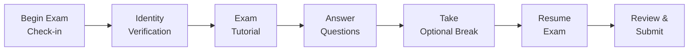

## 2.3 Exam Day Experience and Testing Environment

Taking the PMP® exam is a pivotal moment in your project management journey. The preparation leading up to this day is intense, and the exam environment itself can be a source of anxiety and stress if you do not feel prepared for the practicalities. By understanding the available testing options, arrival procedures, question navigation strategies, and best practices for concentration and time management, you can significantly reduce stress and focus on demonstrating what you know.

This section covers key aspects of the exam day experience—both in test center and online settings—and explores how to maintain peak performance throughout the exam. It also draws on insights from other sections of this resource (see Chapter 2.1 for exam format details and Chapter 2.2 for application processes) to give you a well-rounded view of the PMP® exam day.

## Understanding the PMP Exam Format in Context
While Chapter 2.1 (Exam Format, Domains, and Weightings) outlines the exam’s structure in detail—covering the types of questions and domain weightings—here you’ll learn how these elements come to life on exam day. The standard PMP exam, as of this writing, consists of 180 questions to be answered in 230 minutes. The questions cover the People, Process, and Business Environment domains, with various question types such as multiple choice, multiple responses, drag-and-drop, and hotspot items.

Critical to your success is pacing. You need to be able to move through the exam, question by question, while leaving adequate time for review. Exam breaks can be planned (one or two short breaks depending on PMI guidelines), but keep in mind the break time does not extend the overall 230-minute limit. Familiarity with these features will help set realistic expectations for the tempo of your exam progress.

## Testing Options: Online Versus Test Center

Many professionals face a primary decision: Should you take the exam at a testing center or opt for an online-proctored environment? Each option has its unique advantages and characteristics.

### Testing Center Option
• Controlled Environment: Testing centers offer a quiet and monitored setting, which can help minimize distractions.  
• Reliable Equipment: You can typically rely on center-provided computers, secure networks, and standardized tools like noise-canceling headphones.  
• Clear Security Protocols: You will check in with one or two forms of identification, place personal items in a locker, and sometimes go through a light security screen.  
• Professional Staff on Site: Center staff are on hand to clarify the check-in process, resolve technology issues, and guide you if emergencies arise.  

However, traveling to a test center can introduce logistical considerations: traffic, parking, or the potential stress of being in an unfamiliar place. If you choose a test site, plan your commute well to ensure you arrive early and calm.

### Online Proctored Option
• Convenience: You can test from the comfort of your home or office, eliminating travel times and logistical hassle.  
• System Compatibility Requirements: Ensure your computer, webcam, and internet connection meet PMI and the testing vendor’s requirements. You will complete a system test before the exam day.  
• Strict Proctoring Protocols: You must remain on camera, share your screen, and adhere to guidelines about your environment—often you cannot have notes, phones, or other people in the room.  
• Possible Technical Risks: Power outages, internet connectivity issues, or software glitches can happen. Minimizing these risks means using stable, high-quality equipment and a backup plan if something goes wrong.  

Online exams can confer flexibility and reduce the pressure of unfamiliar settings. However, the responsibility for ensuring a distraction-free environment, secure technology, and following strict proctor instructions rests heavily on you.

## Preparing the Night Before
Whether testing at home or visiting a center, taking strategic steps the night before can help ensure exam-day success:

• Review Key Concepts: Engage in light review of the most critical formulas or frameworks (Earned Value Management, risk calculations, etc.).  
• Gather Identification and Materials: Prepare at least two forms of valid ID and any compliance documents you need.  
• Familiarize Yourself with Directions (for Test Center): Double-check the route, time to commute, and parking situation. Set alarms that account for potential delays.  
• Organize Your Workspace (for Online Exam): Ensure your test area is well-lit, clutter-free, and free from distractions. Remove any non-permitted devices or papers.  

Sleep is a vital part of memory consolidation, so aim for 7-8 hours of rest. Regardless of your test time, rest can significantly boost mental clarity and recall.

## Checking In and Navigating Security Procedures
Some of the most stressful moments can occur just before the exam begins. Understanding how you’ll check in and clear security can alleviate some of that anxiety.

### Test Center Check-In
• Arrival Time: Arrive 30 minutes ahead of your scheduled slot to complete sign-in paperwork, ID verification, and store belongings in a locker.  
• Identification: Typically, two forms of ID are requested. Ensure your name on the IDs precisely matches the name on your exam registration.  
• Personal Belongings: You’ll be asked to remove outer clothing like jackets and may need to empty your pockets. Only certain items—like medication or earplugs—are allowed in the exam room.  
• Seating & Tutorial: Once seated, you’ll watch or read a short computer-based tutorial on navigation. Typically, you may opt to skip it if you’re familiar, but using this time to calm nerves can be beneficial.

### Online Proctored Check-In
• System Readiness: About 30 minutes prior, complete your final system check. Update your testing software if required.  
• Room Scan: You may be required to show a 360-degree view of your room with your webcam. The proctor verifies that no prohibited items are in view.  
• Environment Rules: Some proctors require that your door remain closed, that no one else enters, and that your phone or other devices be out of reach.  
• Proctor Interaction: You can communicate with the proctor via chat in case of technical issues or clarifications about procedures.

In either mode, you must confirm that you understand the security and confidentiality agreements—strictly no copying, photographing, or recording exam questions in any form.

## Managing the Exam Interface and Tools
Once you’re through the check-in process, the PMP exam interface becomes your home screen. Knowing how to navigate and use the exam tools effectively can save you precious time and reduce errors.

• Question Navigation: You can typically move forward or backward through the questions, flag uncertain items for review, and skip questions to revisit later.  
• Digital Whiteboard (Online Proctored): In place of physical paper, you may have an on-screen scribble pad for quick calculations or mind maps (check the PMI website or your proctor guidelines to see if a real paper/pen are allowed at your test center or if you must use the digital tool).  
• On-Screen Calculator: Built into the system for cost or earned value calculations. Familiarize yourself with the typical functionalities (like memory, scientific mode, etc.).  
• Break Periods: Depending on the exam policy in effect, you may get one or two short breaks. The exam clock may continue to run, so plan carefully.

Below is a simplified visual diagram illustrating how an examinee typically moves through the exam day’s stages:

Examinees commonly note that proper mastery of the interface can significantly reduce mental load. Consider practicing with any provided PMI exam simulator or an official practice system if available.

## Time Management Strategies
Pacing is critical in a high-stakes exam like the PMP. Track these tactics to keep a steady rhythm:

• Divide and Conquer: With 230 minutes for 180 questions, you have about 1.3 minutes per question on average. Pre-allocate time for reading vignettes or scenario-based items that are more complex.  
• Flag Uncertain Questions: Don’t get stuck. Mark them to revisit if time allows.  
• Use Breaks Wisely: If you feel your concentration slipping, it might be better to take a short break (if permitted) rather than rushing through and making careless errors.  
• Final Review: Leave a cushion of 10-15 minutes at the end for reviewing flagged questions, ensuring you’re not leaving easy points on the table.  

If you stretch your time too far on particularly tough questions, you risk missing simpler ones later. Part of your exam readiness is practicing how to make an educated guess quickly and move on.

## Stress and Anxiety Management
For many, the biggest threat on exam day isn’t the content knowledge but exam nerves. Strategies to mitigate this include:

• Deep Breathing: Taking 30 seconds to inhale deeply and exhale slowly can spark mental clarity, reduce heart rate, and improve focus.  
• Positive Visualization: Picture yourself confidently tackling the questions. This fosters an “I can succeed” mindset through the entire exam.  
• Practice Under Timed Conditions: Full-length mock exams help you familiarize yourself with the pressure while refining your pacing.  
• Confidence Reminders: Keep in mind the hours, days, and months you spent preparing. Remind yourself you are well-versed in project management.

Physical comfort also matters. For in-person exams, you may request items like earplugs if noise bothers you. For the online exam, ensure you have a comfortable chair and a stable desk arrangement.

## Completing the Exam and Receiving Results
When you finish answering all questions or run out of time, you’ll proceed to a short question review stage to revisit flagged items. Once you submit, the system typically processes the results, and you’ll see your pass/fail status (sometimes you have to wait for a formal email, but usually you get an immediate on-screen outcome).

• Preliminary Results: If you pass, celebrate! If you do not pass, the report will highlight areas for improvement, helping you strategize for a retake if necessary.  
• Score Report: You’ll receive an official breakdown across the domains.  
• Congratulatory Message (if Passed): PMI may provide you with a digital “pass” notification; your official certificate usually arrives via email or mail within a few weeks.

## Possible Technical or Procedural Hiccups
It’s possible to run into issues—power outages at a test center or dropped internet connections online. If it happens:

• Stay Calm: Proctors or test center employees are trained to resolve disruptions and file incident reports to ensure fairness.  
• Document the Issue: If something significantly impacts your exam, request that it be noted with the test vendor and PMI.  
• Follow Up: In extreme cases, you may need to open a case for a retest or reevaluation with PMI.

## Real-World Scenario: Balancing Stress in the Final Minutes
Imagine you’ve reached question 160, and you only have 30 minutes remaining. You have about 20 questions left. The realization that time is short can cause panic. A balanced approach is to:

• Decide whether you should take a brief mental reset (5 deep breaths, quick 15-second mental break) or push forward.  
• Skip complex calculations if you think they’ll consume too much time—perform a best guess if the question is extremely complex.  
• Mark any uncertain answers and proceed rapidly, returning if seconds remain at the end.  
• Submit with confidence, trusting your process.

In real project scenarios, we juggle deadlines and unexpected constraints. Similarly, your exam time management can mirror the risk-response mindset required of practicing project managers.

## Best Practices and Common Pitfalls
• Double-Check IDs: Misalignment between your exam registration name and ID is a common issue that can prevent you from taking the exam.  
• Maintain Professionalism: Even at home, your attire, posture, and environment should reflect that you are in a formal testing situation.  
• Be Ready to Compromise on Comfort: At test centers, thermostats are set for general comfort, which may not be ideal for you personally. Carry a light sweater or jacket (if allowed).  
• Avoid Over-Caffeination: Too much coffee can heighten anxiety. Balance hydration with lower or moderate caffeine intake.  
• Familiarize Yourself with Emergency Procedures: Know what to do if the power fails or your internet drops during an online exam.

## Additional References
• PMBOK® Guide Seventh Edition  
• PMI’s Official PMP® Exam Guidance: [https://www.pmi.org/certifications/project-management-pmp](https://www.pmi.org/certifications/project-management-pmp)  
• Pearson VUE and Prometric Testing Protocols (depending on current PMI vendor)  
• Online Proctoring Guidelines: [https://home.pearsonvue.com/pmi/onvue](https://home.pearsonvue.com/pmi/onvue)

By adequately preparing for the environment in which you’ll take your PMP exam—organizationally, mentally, and physically—you can transform exam day from a nerve-racking event into a confident display of your project management expertise.

## Exam Day Confidence: 10 PMP Questions on Testing Environment



### Which of the following is NOT a recommended action prior to taking the PMP exam at a testing center?

- [ ] Arriving at least 30 minutes in advance
- [x] Studying complex topics for 2-3 hours immediately before the exam
- [ ] Bringing two valid forms of identification
- [ ] Checking directions to the test center and confirming parking arrangements

> **Explanation:** Although quick reviews the night before can be helpful, excessive last-minute study on exam morning can amplify stress and impede mental clarity.

### What is one advantage of taking the PMP exam at a testing center over the online-proctored option?

- [x] Access to a dedicated testing lab environment
- [ ] Ability to have a personal smartphone for quick note-taking
- [ ] Guaranteed unlimited breaks
- [ ] No requirement to provide identification documents

> **Explanation:** Testing centers generally provide a focused environment with dedicated technology and staff available to address technical issues on the spot. Phones are strictly prohibited in both settings.

### In the online-proctored PMP exam, why might you need to do a room scan?

- [x] To ensure no prohibited materials or persons are present
- [ ] To calibrate the brightness of your webcam
- [ ] To measure the noise levels in your environment
- [ ] To confirm if you have adequate lighting for paper-based notes

> **Explanation:** Online proctors need to verify that your workspace is free from potential cheating materials or outside distractions.

### Which of the following strategies helps optimize time management during the PMP exam?

- [x] Flagging questions that require more thought and returning to them later
- [ ] Spending at least five minutes per question for detailed analysis
- [ ] Randomly guessing all questions in the last 30 minutes
- [ ] Stopping the exam mid-way to reevaluate your knowledge gaps

> **Explanation:** Proper question flagging speeds up progress and prevents getting stuck, while saving complicated items for a second pass if time remains.

### What is the recommended approach if you remain unsure about an answer after a thorough check?

- [x] Make an educated guess based on partial elimination and move on
- [ ] Leave it blank for the final scoring to ignore
- [x] Use the flag for a quick final review near exam completion
- [ ] Skip it completely and never return to it

> **Explanation:** There is no penalty for guessing. When uncertain, use partial elimination to narrow the likely correct choice, mark it for review, and revisit if time allows.

### During an in-person exam, which of the following items is typically NOT permitted at your workstation?

- [x] Personal mobile phone
- [ ] Locker key
- [ ] Noise-canceling headphones provided by the center
- [ ] Company ID if pre-approved

> **Explanation:** Personal electronic devices, including phones, must be stored away. Test centers typically supply any items you need for the exam environment.

### Why is it important to do a system test prior to the online-proctored exam date?

- [x] To ensure compatibility with testing software and confirm minimum hardware requirements
- [ ] To start the exam earlier and finish before exam day
- [x] To identify potential connectivity issues and fix them proactively
- [ ] To practice skipping questions quickly

> **Explanation:** A thorough system check ensures your computer, camera, and internet meet the exam’s technical standards, preventing preventable disruptions.

### If you encounter a technical issue (e.g., power outage or software crash) during an online exam, what is your best first step?

- [x] Stay calm and immediately communicate with the proctor
- [ ] Resolve it offline without notifying anyone
- [ ] Restart your PC without waiting for instructions
- [ ] Abandon the exam and reschedule

> **Explanation:** The right first move is to reach out to your proctor or exam vendor’s support. They can guide you through next steps and document the incident.

### What should you do if you finish the exam and still have time remaining?

- [x] Review flagged questions and ensure you have answered all items
- [ ] Immediately submit so you can leave early
- [ ] Change random answers so they vary from your first guess
- [ ] Browse the internet quickly before the official exam ends

> **Explanation:** Using leftover time to revisit flagged items or double-check tough questions enhances your chances of performing well.

### True or False: After passing the PMP exam, you typically receive a hard copy certificate immediately at the testing center.

- [x] True
- [ ] False

> **Explanation:** Depending on current guidelines, some testing centers may provide a provisional pass result and hand out a printed congratulatory document—though official certificates are often delivered digitally. Check recent policies as these can vary over time.



## PMP Mastery: 1500+ Hard Mock Exams with Full Explanations 

Looking to crush the PMP exam with confidence? Dive deep into 6 rigorous mock exams totaling 1500+ advanced-level questions, each accompanied by clear, step-by-step explanations. Hone your test-taking strategies, master complex topics, and build the resilience you need on exam day. Perfect for serious PMs aiming beyond fundamentals.  

Enroll now:  
[PMP Mastery: 1500+ Hard Mock Exams with Exceptional Clarity & Full Explanations](https://www.udemy.com/course/pmp-2025/?referralCode=CF83A54BC86BE27F9AFE)

_Disclaimer: This course is not endorsed by or affiliated with the PMI examination authority. All content is provided purely for educational and preparatory purposes._
