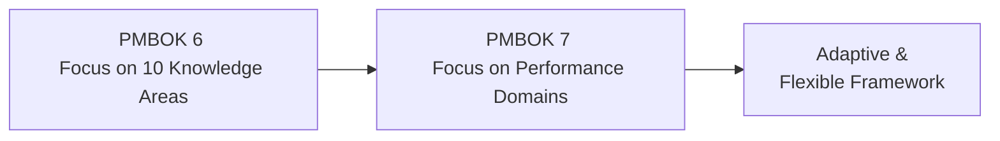
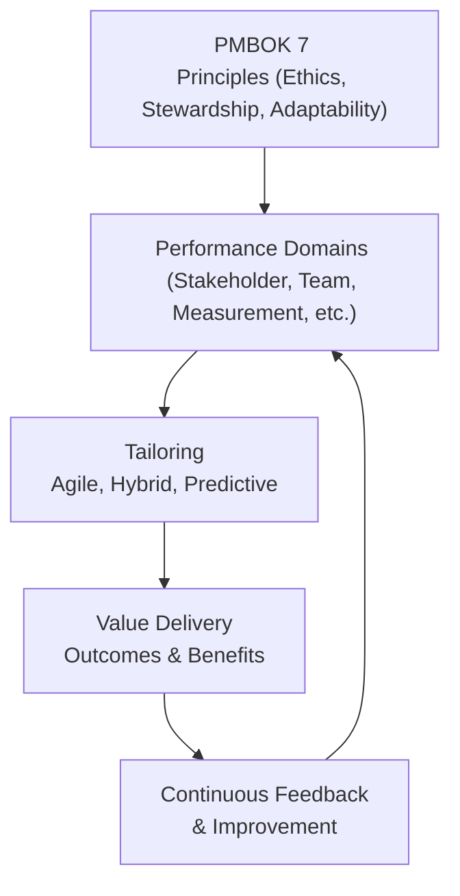

## 3.1 Major Changes and New Focus Areas

The transition from the Sixth Edition to the Seventh Edition of the PMBOK® Guide signals a significant paradigm shift in project management theory and practice. By moving from a primarily process-based approach to a more flexible and principles-based framework, this new edition addresses the realities of delivering value in a rapidly evolving business landscape. As such, you will see increased emphasis on adaptable project life cycles, greater alignment with agile and hybrid methods, and broader perspectives on how to tailor project practices to specific organizational and stakeholder needs. In this section, we will dive deeply into the key changes and new focal points, clarifying why and how these adjustments impact the way we plan, manage, and lead projects.

### The Shift from a Process-Based to a Principles-Based Paradigm

One of the most notable changes in the PMBOK® Guide Seventh Edition is the move from a detailed process-oriented perspective, featuring 49 processes across 10 Knowledge Areas, to a more generalized set of conceptual guidelines known as “Principles.” Traditional process-based structures provided step-by-step instructions on how to manage each phase of a project. However, given today’s complex environments—where projects can be agile, predictive, or hybrid—these stringent steps often fell short of addressing each unique organization’s needs.

By contrast, the principles-based focus emphasizes values, behaviors, and essential practices that can be adapted to fit distinct project or organizational contexts. For example, instead of prescribing an exact procedure for stakeholder communication, the new guide highlights a principle that compels project managers to communicate effectively and adaptively, based on stakeholder needs, interests, and project complexity. This flexibility empowers Project Managers to exercise judgment and tailor methodologies for each scenario.

### Evolving the Structure: Performance Domains Replacing Knowledge Areas

In the Seventh Edition, **Performance Domains** have become a unifying construct that helps steer the conversation away from rigid knowledge domains such as Scope, Schedule, and Cost. These new performance domains address overarching areas of project management competence, focusing on outcomes and value:

• Stakeholder  
• Team  
• Development Approach and Life Cycle  
• Planning  
• Project Work  
• Delivery  
• Measurement  
• Uncertainty  

While Knowledge Areas still exist in various forms throughout the text—and remain tested in the PMP® exam to some extent—Performance Domains aim to address how work is performed and value is delivered rather than simply listing processes. This structural change caters to the variety of ways organizations approach projects today. It is much easier to see how agile iterations, hybrid governance structures, and flexible testing cycles can coexist with more traditional work breakdown systems in an environment guided by performance domains.

Below is a simple illustration showing the pivot from a Knowledge Area-focused paradigm to a broader performance-oriented one:

As demonstrated in the diagram, shifting from a Knowledge-Area focus (A) to a Performance-Domain focus (B) leads to more adaptation and flexibility (C).

### Filling the Gaps: Emphasis on Value Delivery

An important driving force behind many of the updates in the Seventh Edition is delivering **business value**. The PMBOK® Guide has always connected project outcomes to organizational strategy, but the new emphasis underscores how every project activity should support value generation over the project’s entire life cycle. This forward-looking orientation pushes project managers to think about downstream benefits, sustainability, and how quickly stakeholder needs can be met.

Organizations do not just want to complete projects on time and within budget; they want to capitalize on outcomes. The updated framework encourages you to collaborate closely with leadership and stakeholders to define, measure, and optimize the value your project brings to the organization, customers, and the wider community.

### Increased Importance of Tailoring

The Seventh Edition stresses that no single methodology or approach can universally address the range of challenges contemporary projects face. **Tailoring** has therefore risen to the forefront, positioning project managers as creative designers of best-fit project management strategies. Whether you select agile sprints, a fully predictive waterfall model, or a blend of both, the key is to adopt and adapt practices to serve the unique requirements, constraints, and risks of your environment.

In the Sixth Edition, tailoring was mentioned frequently, but the Seventh Edition makes it a core theme. The discussion goes beyond superficial “adaptation,” providing project managers with tools and guidelines for more meaningful and context-specific adjustments to governance, life cycle models, and project artifacts.

### Greater Alignment with Agile and Hybrid Methods

While earlier versions of the PMBOK® Guide recognized agile techniques in a relatively separate addendum (the Agile Practice Guide), the Seventh Edition weaves agile and hybrid approaches into its central narrative. This reflects the reality of modern project management, where teams regularly combine **Scrum**, **Kanban**, and other agile frameworks with traditional predictive methods, depending on their specific industry, team composition, and stakeholder expectations.

You will find more direction on how to handle iterative releases, manage changing requirements, and leverage self-organizing teams. The new edition also aligns closely with the Agile Practice Guide to promote synergy between standard project management and agile principles. If your organization adopts a complex multi-framework approach, these guidelines help ensure that each approach operates cohesively.

### Integration of PMIstandards+ and Other Digital Resources

Another major evolution is the recognition that a single printed guide cannot encompass the full spectrum of practices, evolving references, and real-world examples needed by every professional. The Seventh Edition integrates references to **PMIstandards+**, an online knowledge repository that provides updates, case studies, templates, and interactive tools. This digital shift allows practitioners to access resources that are continuously updated, bridging the gap between static text and modern practice.

For the PMP® candidate, this means that the “static” study materials found in the PMBOK® Guide are now supplemented by digital, on-demand content tailored to real-world scenarios. Ultimately, it equips project professionals with expanded perspectives and resources to manage complexities across diverse environments.

### Spotlight on the 12 PMI Project Management Principles

Among the most prominent shifts is the introduction of **12 project management principles**, formalized in the Seventh Edition (refer to Chapter 5 of this book for more details). These principles serve as a compass guiding ethical behavior, stakeholder-focused collaboration, leadership agility, and continuous improvement. They provide a high-level framework that grants teams the freedom to design processes aligned with these fundamental truths.

Unlike the Sixth-Edition knowledge areas, which were prescriptive in nature, these 12 principles are broad directives that can be adapted to various life cycles, organizational cultures, and industry regulations. By emphasizing stewardship, leadership, systems thinking, and a proactive stance on risk, they create a unifying philosophy across all project types.

### Expanded View of Uncertainty and Risk

Risk management has always been a core aspect of project management. However, **uncertainty** is now given greater prominence, acknowledging that many projects operate in volatile contexts. The PMBOK® Guide Seventh Edition devotes more discus­sion to emergent and ambiguous risks, tapping into broader uncertainty management strategies.

In a world where business cycles are shortening and technologies are rapidly changing, conventional risk assessments may no longer be enough. The Seventh Edition encourages project managers to cultivate **adaptive responses**, incorporate flexible budgeting, and maintain continuous risk monitoring—ensuring that each project can flex with the environment and pivot quickly in the face of disruption.

### Accommodating a Wide Range of Delivery Methods

From predictive to agile, from lean to hybrid, the PMBOK® Guide Seventh Edition acknowledges the reality of diverse delivery approaches. More explicitly than before, it offers guidelines to select, blend, or tailor these approaches. Complex programs might use a stable predictive method for compliance-driven elements, while a brand-new product development track might use iterative sprints. By highlighting various ways of working, the Seventh Edition encourages customization to balance control and agility.

### Real-World Case Study: Developing a Web Application in a Large Enterprise

Imagine an enterprise-level web application that needs to comply with strict data privacy regulations (e.g., GDPR), incorporate robust analytics, and deliver features incrementally to a dynamic user base. In a Sixth Edition framework, you might struggle to directly fit compliance requirements into agile sprints without splicing in processes from the Agile Practice Guide.

Under the Seventh Edition perspective, the project could blend two performance domains—Delivery and Uncertainty—to match the compliance demands with iterative testing. The overarching principles, particularly “stewardship” and “stakeholder engagement,” would guide every decision from user story creation to formal acceptance testing. Meanwhile, the new emphasis on tailoring would encourage the team to integrate agile sprints for feature delivery with a robust risk management plan for regulatory changes.

By marrying compliance-driven tasks (predictive approach) with frequent user feedback loops (agile approach), the project can remain flexible to shifting requirements while satisfying mandatory compliance checks at defined intervals.

### Best Practices, Pitfalls, and Strategies

Below are some common pitfalls and recommended strategies for transitioning to the Seventh Edition principles-based framework:

• **Pitfall**: Over-applying agile concepts in a context that demands heavy documentation or regulatory oversight.  
  • **Strategy**: Use the principle of tailoring. Combine iterative release cycles with well-defined gating points or milestone approvals that satisfy regulatory needs.

• **Pitfall**: Focusing too narrowly on “outputs” (documents, checklists, deliverables) without tracking the ultimate value or benefits.  
  • **Strategy**: Adopt a value-driven mindset. Continuously measure outcomes against strategic objectives and adjust the scope or direction as needed.

• **Pitfall**: Neglecting the leadership dimension and relying solely on processes to manage teams.  
  • **Strategy**: Embrace the principle of active leadership and emotional intelligence. Foster collaboration, open communication, and conflict resolution at all project stages.

• **Pitfall**: Applying old-fashioned risk management that only accounts for identified risks rather than emergent uncertainties.  
  • **Strategy**: Expand your risk repertoire to include ongoing monitoring and dynamic risk registers. Encourage iterative reviews to respond swiftly to changing conditions.

### Visualizing the New Focus

The following mermaid diagram visually depicts how the Seventh Edition fosters an environment where project success depends on interlocking elements such as outcomes, principles, domains, and continuous feedback:

As illustrated, the Seventh Edition encourages a continuous cycle (E → B) that integrates principles, performance domains, and tailored approaches to deliver maximum value.

### References for Further Exploration

• PMI (2021). “A Guide to the Project Management Body of Knowledge (PMBOK® Guide) – Seventh Edition.”  
• PMIstandards+ (online environment) for case studies, templates, and industry-specific examples.  
• “Agile Practice Guide” (PMI, 2017) for supplemental methods, especially for teams transitioning to agile or hybrid workflows.  
• “Project Management Principles” resource pages in Chapter 5 of this book for a deeper dive into each of the 12 principles.

---

## Test Your Knowledge of PMBOK® Guide Evolution



### What is one of the biggest structural changes in the PMBOK® Guide Seventh Edition compared to the Sixth Edition?

- [ ] Removing all mention of processes.
- [x] Moving from Knowledge Areas to Performance Domains.
- [ ] Eliminating knowledge areas and agile references entirely.
- [ ] Implementing a fully prescriptive plan-do-check-act cycle.

> **Explanation:** A significant change in the Seventh Edition is the shift from a process-driven approach organized into Knowledge Areas to a set of Performance Domains. This approach allows for more flexibility and adaptability.

### Which key concept is emphasized more in the PMBOK® Guide Seventh Edition than in previous editions?

- [ ] Strict compliance with each of the 49 processes.
- [x] Tailoring project management approaches to the specific context.
- [ ] Exclusive focus on predictive methodologies.
- [ ] Eliminating stakeholder engagement to reduce distractions.

> **Explanation:** The Seventh Edition underscores the importance of tailoring, ensuring that project teams adapt their methods and frameworks to fit the project environment, team culture, and organizational needs.

### In the Seventh Edition, which aspect is considered central to guiding how project managers should think and act?

- [x] A set of 12 underlying principles.
- [ ] A mandatory set of checklists for each deliverable.
- [ ] A new organizational chart mandated by PMI.
- [ ] A universal framework for vendor management.

> **Explanation:** The Seventh Edition introduces 12 project management principles to provide a broad, values-driven approach for guiding decisions and actions across a variety of project contexts.

### Why did the Seventh Edition’s approach to risk management evolve?

- [x] To address the complexity and volatility of modern project environments.
- [ ] To simplify and reduce the number of risk-related processes.
- [ ] To focus solely on threats, ignoring opportunities.
- [ ] To remove the need for a risk register.

> **Explanation:** Modern projects often face uncertainties beyond traditional risk controls, so the Seventh Edition includes deeper discussion on emergent risks, ongoing risk monitoring, and adaptive strategies.

### How does the PMBOK® Guide Seventh Edition help project managers address agile needs?

- [x] By integrating agile principles and hybrid methods throughout its new structure.
- [ ] By providing a separate guide that ignores previous PMBOK® content.
- [ ] By aligning solely with Scrum and rejecting other frameworks.
- [ ] By reverting to pure waterfall models.

> **Explanation:** The Seventh Edition interweaves agile, hybrid, and other methodologies, recognizing that teams often blend different approaches to best meet project requirements. 

### Which of the following best describes how the PMBOK® Guide Seventh Edition manages compliance-driven aspects of a project?

- [ ] It removes them entirely to focus on flexible project approaches.
- [x] It encourages the organization to tailor methods that incorporate compliance when needed.
- [ ] It mandates purely predictive compliance oversight processes only.
- [ ] It focuses solely on agile sprints to manage compliance.

> **Explanation:** The Seventh Edition emphasizes adaptability and tailoring for all project aspects, including compliance. Projects can incorporate regulatory milestones, documentation, or predictive checkpoints within a broader tailored or hybrid approach.

### Performance Domains in the Seventh Edition primarily emphasize what?

- [ ] Rigid checklists of steps to follow.
- [ ] Temporary and optional guidance.
- [ ] Strict adherence to the 10 Knowledge Areas.
- [x] High-level areas of performance to optimize project outcomes.

> **Explanation:** Performance Domains act as overarching areas that guide project success, focusing on desired outcomes (e.g., stakeholder engagement, uncertainty management) rather than prescriptive steps.

### Why is continuous feedback critical in the PMBOK® Guide Seventh Edition?

- [x] It allows continuous improvement and adaptation throughout the project life cycle.
- [ ] It replaces project closure activities entirely.
- [ ] It mandates daily “big room planning” sessions.
- [ ] It eliminates the need for formal project reviews.

> **Explanation:** Continuous feedback ensures that teams can learn and adapt in real-time, thus refining processes, updating stakeholder strategies, and delivering higher-value outcomes.

### Which resource does the Seventh Edition integrate to provide on-demand knowledge and best practices?

- [ ] A new physical binder for storing processes.
- [x] PMIstandards+, an online repository.
- [ ] A single PDF containing all possible project management solutions.
- [ ] No external resources are mentioned or encouraged.

> **Explanation:** Recognizing that one guide cannot cover every scenario, the Seventh Edition points practitioners to PMIstandards+, where they can explore updated case studies, templates, and tools.

### True or False: The Seventh Edition reduces focus on ethical leadership and stakeholder stewardship.

- [ ] True
- [x] False

> **Explanation:** Ethical leadership and stakeholder stewardship remain key considerations. The new set of principles effectively highlights ethics, stewardship, and the importance of stakeholder-centric decision-making.



---

## PMP Mastery: 1500+ Hard Mock Exams with Full Explanations 

Looking to crush the PMP exam with confidence? Dive deep into 6 rigorous mock exams totaling 1500+ advanced-level questions, each accompanied by clear, step-by-step explanations. Hone your test-taking strategies, master complex topics, and build the resilience you need on exam day. Perfect for serious PMs aiming beyond fundamentals.

Enroll now:  
[PMP Mastery: 1500+ Hard Mock Exams with Exceptional Clarity & Full Explanations](https://www.udemy.com/course/pmp-2025/?referralCode=CF83A54BC86BE27F9AFE)

_Disclaimer: This course is not endorsed by or affiliated with the PMI examination authority. All content is provided purely for educational and preparatory purposes._
