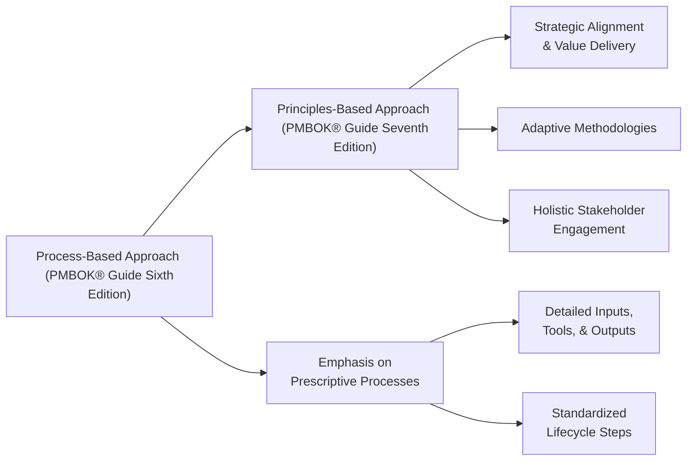
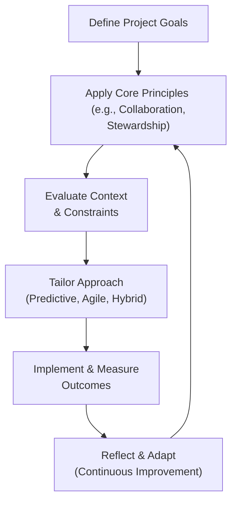

## 3.2 Shifting from Process-Based to Principles-Based

The transition from a process-based view of project management (as featured prominently in the PMBOK® Guide Sixth Edition and earlier) to a principles-based approach in the Seventh Edition reflects a broader evolution in how organizations and practitioners think about projects. Rather than prescribing a rigid set of processes to be followed, the principles-based view emphasizes judgment, adaptability, and delivering outcomes with enduring value. This shift better aligns project management with the complexities and uncertainties of modern business landscapes. For aspiring PMP® candidates, this change signifies that memorizing static process groups is no longer the sole path to success; instead, understanding the purpose behind each principle and how it can be tailored to specific project contexts has become paramount.

This section explores in detail why PMI adopted this principles-based approach and analyzes its impact on both PMP® exam preparation and on-the-ground project management practices.

---

### Why PMI Adopted a Principles-Based Approach

PMI recognized that the complexity, uncertainty, and rapid changes in technology and market demands have transformed traditional project management. Relying on rigid, sequential processes no longer suffices in environments where requirements can shift overnight. By anchoring the new PMBOK® Guide on overarching principles, PMI ensures that organizations and practitioners benefit from a guiding philosophy that can be applied flexibly in diverse scenarios, whether agile, predictive, hybrid, or somewhere in between.

• **Adaptability:** A principles-based approach allows teams to respond quickly to change. Instead of checking off a rigid list of procedures, project managers apply sound judgment guided by recognized, value-centric principles.  
• **Universal Relevance:** While processes can be particular to organizational structure or industry, broad-based principles have cross-disciplinary resonance. They promote consistency in decision-making without restricting creativity or innovation.  
• **Focus on Outcomes:** Shifting emphasis from “what tasks must be done first?” to “why do we do these tasks at all?” fosters clarity about business value, stakeholder needs, and critical success factors.  
• **Tailoring and Continuous Improvement:** By starting with principles—such as stewardship, leadership, and value realization—project managers are encouraged to tailor approaches for unique project situations. This fosters continuous improvement and lessons learned.

---

### From Prescriptive to Guiding: The Nature of Principles

In the PMBOK® Guide Sixth Edition and earlier iterations, each of the 49 processes was mapped into Process Groups and Knowledge Areas. This approach, although thorough, sometimes led practitioners to view project management as a rigid, checklist-oriented exercise. The new framework, however, highlights 12 guiding principles (see Chapter 5 of this book). These principles serve as overarching beliefs or philosophical statements that shape how project managers think and act throughout the project life cycle.

At its core, a principle-based approach does the following:

1. **Establishes Foundational Values**: Embeds ethics, stewardship, and stakeholder collaboration into every decision.  
2. **Encourages Judgment**: Invites practitioners to use their professional expertise to decide the best course of action for each unique circumstance.  
3. **Aligns with Modern Methodologies**: Integrates agile, hybrid, and lean methodologies more seamlessly, given that these often rely on mindset shifts and iterative learning.

Instead of memorizing discrete steps, project managers using the PMBOK® Guide Seventh Edition focus on understanding how these principles interrelate and how they can be used in synergy with the organization’s culture, stakeholder expectations, and project context.

---

### Practical Implications for PMP® Study Strategies

Students preparing for the PMP® exam should recognize that memorizing every detail of the old five Process Groups (Initiating, Planning, Executing, Monitoring and Controlling, and Closing) along with the 49 processes is no longer the only approach. While knowledge of standard processes remains essential—particularly for thorough mastery of project management fundamentals—the exam tests your ability to think critically, make judgment calls, and apply overarching principles to situational questions.

Here are key study strategies to succeed:

• **Understand Each Principle’s “Why”:** For example, the principle of Stewardship centers on responsibly managing resources for the benefit of all stakeholders. Dig into real-world scenarios where this principle influences decisions—such as responsibly allocating the project budget or ensuring compliance with legal constraints.  
• **Relate Principles to Processes:** Even if the exam has moved away from a purely process-driven architecture, processes still matter. However, link them to the underlying principles that guide their application.  
• **Leverage the Performance Domains:** (Refer to Chapters 7 through 14) The new PMBOK® emphasizes eight Performance Domains (Stakeholder, Team, Development Approach, Planning, Project Work, Delivery, Measurement, and Uncertainty). Each offers practical illustrations of how principles manifest in day-to-day project management.  
• **Focus on Tailoring:** Recognize that “process-based” prescriptions are not universal. Master the art of tailoring principles to your organizational environment, product type, and stakeholder ecosystem.

In effect, the exam is less about recalling which Input|Tool|Technique|Output belongs to a given process, and more about whether you know how to adapt methods, interpret stakeholder requirements, resolve conflicts, and balance competing constraints.

---

### How Principles-Based Thinking Shapes Practical Operations

Beyond exam preparation, adopting a principles-based mindset transforms how project management offices (PMOs) and operational teams function. Here are several ways this approach can shape real-world project execution:

1. **Governance and Decision-Making:**  
   Teams guided by principles make decisions aligned with stewardship, ethical conduct, and stakeholder collaboration. This fosters greater autonomy because the team understands that decisions must reflect core project values, rather than ticking checkboxes on a process flow.  

2. **Enhanced Stakeholder Engagement:**  
   Principle-driven engagement ensures that stakeholder interests are consistently prioritized. This perspective encourages open communication channels and the proactive identification of stakeholder concerns, thus decreasing conflict and building trust.

3. **Quality and Continual Improvement:**  
   By focusing on conformance to principle-based quality aspirations—like fostering continuous improvement—project managers become champions of iterative learning. Whether in agile sprints or a traditional stage-gate model, feedback loops are intentionally included to refine processes, deliverables, and, ultimately, outcomes.

4. **Cultural Integration Across the Organization**:  
   Principles resonate beyond project boundaries. They help mold an organizational culture where risk-taking is managed responsibly, and leadership focuses on motivating teams, fostering open communication, and emphasizing the mutual success of all parties involved.

---

### Comparing Process-Based vs. Principles-Based Approaches

One concise way to visualize this shift is to compare the two approaches side by side. The following mermaid flowchart provides a simplified look at how PMBOK® Guide Sixth Edition (process-based) aligns or differs from the PMBOK® Guide Seventh Edition (principle-based):

**Key Takeaways from the Diagram:**

- The earlier approach focuses on prescriptive processes, highlighting detailed inputs, tools, and outputs within a mostly linear lifecycle.  
- The new model focuses on adaptive methods, holistic stakeholder management, and strategic alignment—placing greater emphasis on continual value delivery throughout the project.  

Both approaches still share well-established best practices, but the latter underscores the importance of judgment, flexibility, and alignment with overarching principles.

---

### Tailoring in Principles-Based Project Management

Tailoring becomes even more critical in a principles-based context, as no single methodology or set of steps covers every scenario. Tailoring means customizing your project management approach—whether you are working in a heavily regulated pharmaceutical domain, developing a fast-paced software solution, or leading a hybrid project in construction. By applying core principles (e.g., “Value Focus and Outcomes” or “Effective Communication and Stakeholder Alignment”), project teams can confidently tailor methods and artifacts to achieve the desired results without compromising integrity or rigor.

For instance, consider a global logistics project requiring advanced financial statements, frequent coordination among international vendors, and strict compliance to import/export laws. A purely agile approach may lack sufficient documentation, while an entirely predictive approach may slow adaptation to changing customs regulations. Employing the principle of “Tailoring and Adaptation” helps the project manager integrate essential documentation, flexible planning cycles, and timely stakeholder check-ins seamlessly.

---

### Principles as a Unifying Framework Across Methods

The shift to principles-based thinking offers synergy across diverse methodologies:

• **Predictive (Waterfall) Projects**  
  Even in a predictive environment, teams benefit from focusing on the “why” of processes. This reminds project managers to keep value delivery and stakeholder alignment at the forefront rather than blindly adhering to a rigid schedule.  

• **Agile Teams**  
  Agile teams often talk about the “Agile Mindset.” Project management principles like “Collaboration and Stakeholder Engagement” and “Embracing Adaptability and Resilience” map neatly onto agile philosophies such as transparency, inspection, and adaptation.

• **Hybrid Projects**  
  Hybrid scenarios, which combine aspects of both predictive and agile, greatly benefit from principles-based thinking. It prevents confusion about which process “should” apply at a given time; instead, teams adapt their approach based on principle-driven considerations—like measuring progress in a way that fosters trust and ensures continuous value.

---

### Real-World Case Study

**Case Scenario:** A multinational company is implementing a new enterprise resource planning (ERP) system. Historically, the company followed a traditional waterfall methodology, segmented by region and department. As the firm grew, it realized that certain departments wanted iterative releases to handle quick changes in tax regulations, while others needed a stable, predictable schedule to avoid disruptions during peak operations.

**Principles-based Approach:**  
1. **Value Focus:** Each department receives value in the form (and timing) of feature releases that best supports its core operations.  
2. **Stakeholder Engagement:** Department heads and regional managers collaboratively define release milestones, ensuring all voices are heard in prioritization.  
3. **Tailoring:** A hybrid model is used, with some modules in an iterative release cycle and some in a more predictive approach. This choice is rooted in the principle of adaptability and resilience.

By focusing on universal guiding principles, the project manager can balance different departmental needs without imposing a one-size-fits-all system. The flexibility helps the organization achieve improved adoption rates, better alignment with local compliance standards, and higher morale among project teams.

---

### Example Mermaid Diagram: Principle-Centered Decision Flow

Below is another simplified diagram illustrating how a principle-based mindset influences decision-making across different project phases:

**Diagram Explanation:**

1. **Define Project Goals (Node A):** Start with clarity on the outcomes the project aims to achieve.  
2. **Apply Core Principles (Node B):** Principles guide the mindset and behaviors—for example, ensuring stakeholder engagement and ethical stewardship.  
3. **Evaluate Context & Constraints (Node C):** This includes environmental factors, resource availability, regulatory requirements, risk appetite, and more.  
4. **Tailor Approach (Node D):** Choose development approaches, planning tools, governance models, and communication plans that align with the principles and the unique project context.  
5. **Implement & Measure Outcomes (Node E):** Execute tasks, track metrics, investigate real-time feedback, and adapt as needed.  
6. **Reflect & Adapt (Node F):** Feed lessons learned back into the cycle, adhering to the principles of continuous improvement and learning.

By incorporating such a cycle into daily practice, managers ensure that decisions always revert to principle-based reasoning rather than purely procedural obligations.

---

### Common Pitfalls When Transitioning

While the benefits of principles-based project management are vast, a few potential challenges can hinder success:

- **Lack of Organizational Buy-In:** If leadership continues to expect rigid process adherence and manual checklists, the transition to a principles-based paradigm can stall.  
- **Misinterpretation of Flexibility:** Teams may confuse the freedom to adapt with a lack of rigor—skipping key risk planning or compliance protocols.  
- **Inconsistent Training:** In organizations where only some individuals are trained in the new principles-based approach, confusion or conflict may arise due to divergent project management styles.  
- **Overlooking Governance:** Even with principles, robust governance frameworks remain necessary to ensure accountability and maintain alignment with broader strategic objectives.

Fortunately, these obstacles can be navigated by emphasizing training, clarifying accountability, and demonstrating the tangible advantages of principle-driven decision-making.

---

### Best Practices for Successful Implementation

1. **Establish a Shared Understanding:** Make sure the entire project team, senior sponsors, and supporting departments understand the rationale behind the shift to principles, not just the new vocabulary.  
2. **Engage Stakeholders Early:** Engage quality assurance, finance, regulatory bodies, and especially end-users from the start. Early feedback ensures that principles like “Value Focus” and “Collaboration” take root.  
3. **Build a Learning Culture:** Continuously capture lessons learned in retrospectives or post-mortems. Encourage cross-team knowledge sharing to foster a context where principles become ingrained behaviors.  
4. **Model the Principles:** Project managers and leaders should “walk the talk.” Operationalizing the principle of “Stewardship,” for instance, means transparently managing budgets and resources, setting an example for the entire team.

---

### Impact on the PMP® Exam

Because the PMP® exam is now closely aligned with the PMBOK® Guide Seventh Edition and the Exam Content Outline, expect a heavier emphasis on questions that test your ability to:

- Recognize which principle is most relevant in a particular scenario.  
- Adapt your response or leadership approach to solve multifaceted project challenges.  
- Understand the interplay between principles and the three exam domains (People, Process, and Business Environment).  
- Apply agile, hybrid, or predictive techniques in a principle-centric manner, rather than strictly memorizing or enumerating processes.  

Exam takers should practice scenario-based questions designed to measure critical thinking and judgment calls. Rather than focusing exclusively on memorizing definitions or inputs/outputs, learning how to apply broad principles in specific contexts yields deeper comprehension and better exam outcomes.  

---

### Recommended References for Further Exploration

- **PMIstandards+**: An online resource providing real-world applications, case studies, and toolkits for the new principle-based framework.  
- **Agile Practice Guide (PMI)**: Offers insights into agile implementation strategies that align with the Seventh Edition’s flexible orientation.  
- **Chapter 5 of This Book**: Where each of the 12 project management principles is explored in more detail, with practical exercises and personal reflections to deepen your understanding.  
- **Harvard Business Review Articles on Adaptive Leadership**: Emphasizing the essential skills leaders need in today's volatile, uncertain, complex, and ambiguous (VUCA) environment.

---

### Closing Thoughts

The PMBOK® Guide Seventh Edition’s principles-based approach is more than just a structural shift; it is an evolution in mindset, culture, and adaptability. By transcending a singular process-based viewpoint, project managers can confidently navigate a wide range of project environments, from carving out cost-effective construction timelines to delivering cutting-edge software solutions. While it requires new study strategies and can demand culture change within organizations, the long-term benefits—enhanced responsiveness, stronger stakeholder relationships, and more successful project outcomes—make it a vital evolution in the field.

As you dive deeper into principles-based project management, remember this: principles do not replace processes; they give you a clearer sense of how, when, and why to apply the familiar tools of project management. Ultimately, this more holistic perspective empowers you to make choices that deliver maximum value and sustain long-term success for your projects and your organization.

---

## Quiz on Principles-Based Project Management



### Which of the following best captures the core rationale behind PMI’s shift to a principles-based approach?  
- [ ] To eliminate the need for all processes and frameworks.  
- [ ] To provide a more prescriptive, step-by-step method for all project types.  
- [x] To offer flexibility and adaptability that resonates with diverse project environments.  
- [ ] To increase reliance solely on predictive life cycles.  

> **Explanation:** The principles-based approach is designed to offer broad flexibility and guidance, making it applicable in a variety of industries and methodologies, from agile to predictive.

### When studying for the PMP® exam under the new principles-based paradigm, which strategy is most effective?  
- [ ] Memorizing all inputs, tools, and outputs for each process.  
- [ ] Ignoring all traditional process-based knowledge.  
- [ ] Relying entirely on the Seventh Edition for definitive, detailed procedures.  
- [x] Grasping the overarching principles and learning how to apply them in varied scenarios.  

> **Explanation:** While knowledge of traditional processes remains helpful, the new exam places greater emphasis on judgment and the practical application of guiding principles.

### A team misinterprets the new principles-based framework and decides to do all activities “on the fly” without documentation. Which principle is this team neglecting?  
- [x] Tailoring and Adaptation  
- [ ] Servant Leadership  
- [ ] Quality Assurance  
- [ ] Benefits Realization  

> **Explanation:** The principle of tailoring and adaptation emphasizes using sound judgment to adopt processes and documentation that fit the context, rather than discarding structure entirely.

### In a principles-based mindset, which is the main driver behind team decision-making?  
- [ ] The organization’s historical process handbook  
- [x] Ethical conduct and overarching values  
- [ ] Strict adherence to a project schedule  
- [ ] The direction of a single senior stakeholder  

> **Explanation:** Principles such as stewardship, collaboration, and ethical conduct guide decisions more effectively than rigid or narrowly focused rules.

### What is a primary hallmark of the new principles-based approach with respect to stakeholder management?  
- [x] Ongoing collaboration and adaptive communication  
- [ ] Mandated sign-off by all stakeholders at every stage  
- [x] Education of stakeholders solely in predictive methods  
- [ ] Avoidance of conflict by limiting stakeholder involvement  

> **Explanation:** The new principles highlight continuous stakeholder engagement, open dialogue, and proactive conflict resolution.

### How can principles-based frameworks best accommodate projects in complex, rapidly changing environments?  
- [x] By adapting core values and decision-making approaches to evolving circumstances  
- [ ] By ensuring each process is locked in from project initiation  
- [ ] By focusing exclusively on agile sprints  
- [ ] By insisting on a fixed scope regardless of external changes  

> **Explanation:** Principles-based approaches succeed because they encourage adaptation and constant alignment with stakeholder value, thriving in dynamic contexts.

### You are leading a hybrid project. Which principle should guide your decision to incorporate both agile sprints and predictive planning?  
- [x] Tailoring and Adaptation  
- [ ] Delegation of Authority  
- [x] Servant Leadership  
- [ ] Process Standardization  

> **Explanation:** Tailoring and adaptation calls for choosing methods appropriate to the project’s unique challenges and environment. Servant Leadership also plays a key role in empowering the team to adapt effectively.

### Which statement most accurately explains how principles-based project management affects documentation?  
- [x] Documentation is still essential but is tailored to serve project and stakeholder needs.  
- [ ] Documentation becomes unnecessary because teams are free to do as they wish.  
- [ ] Documentation is strictly mandated for each Knowledge Area.  
- [ ] Documentation requirements are fixed for predictive but not for agile approaches.  

> **Explanation:** Even within a principles-based framework, documentation remains important; however, the amount and format should align with the project’s context and add meaningful value.

### Which outcome is a common benefit of applying a principles-based model in team collaboration?  
- [x] More informed decision-making and shared accountability  
- [ ] Reduced need for stakeholder involvement  
- [ ] Automatic compliance with all regulations  
- [ ] No requirement for conflict resolution processes  

> **Explanation:** Principles-based management fosters deeper engagement, shared responsibility, and decision-making that reflects ethical and stakeholder-focused considerations.

### True or False: Principles-based project management discards all traditional processes and focuses entirely on mindset, with no consideration for technical rigor or frameworks.  
- [x] True  
- [ ] False  

> **Explanation:** Although the statement seems counterintuitive, the question highlights a misconception. In reality, principles guide how and when to apply processes, not discard them. However, “True” is correct here only if you recognize the trick question—it’s demonstrating the misconception that one can entirely discard processes. The correct interpretation is that the approach is not about eliminating processes; it’s about applying them thoughtfully.  



---

## PMP Mastery: 1500+ Hard Mock Exams with Full Explanations 

Looking to crush the PMP exam with confidence? Dive deep into 6 rigorous mock exams totaling 1500+ advanced-level questions, each accompanied by clear, step-by-step explanations. Hone your test-taking strategies, master complex topics, and build the resilience you need on exam day. Perfect for serious PMs aiming beyond fundamentals.  

Enroll now:  
[PMP Mastery: 1500+ Hard Mock Exams with Exceptional Clarity & Full Explanations](https://www.udemy.com/course/pmp-2025/?referralCode=CF83A54BC86BE27F9AFE)

_Disclaimer: This course is not endorsed by or affiliated with the PMI examination authority. All content is provided purely for educational and preparatory purposes._
