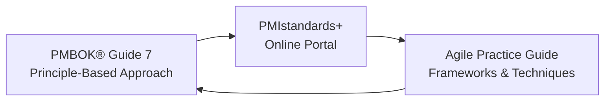
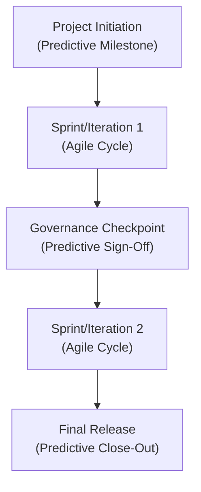

## 3.3 Integrating Perspectives from PMIstandards+ and Agile Practice Guide

Successfully preparing for the PMP® exam requires not only a firm grounding in the PMBOK® Guide Seventh Edition but also a broader perspective on how to manage real-world projects that rely on agile, hybrid, and emerging delivery methods. Two invaluable resources for broadening your skill set are [PMIstandards+](https://standardsplus.pmi.org/)—PMI’s digital platform offering extended guidance, best practices, case studies, and toolkits—and the Agile Practice Guide, co-created with the Agile Alliance. When used together, these resources deepen your understanding of how to achieve the right balance of structure, flexibility, and innovation, ensuring that your approach to project management aligns with evolving industry needs.

In this section, we explore:
• What PMIstandards+ offers and why it is critical for modern project environments.  
• How the Agile Practice Guide complements and expands on the PMBOK® Guide Seventh Edition.  
• Practical insights and examples showing how to integrate these resources into your projects for more resilient, adaptive, and value-driven outcomes.  
• Potential pitfalls and best practices when leveraging agile methods alongside traditional approaches.

By the end of this section, you should have a clear roadmap for engaging with these supplementary resources, thereby enriching your capacity to lead and deliver successful projects in any context.

### Overview of PMIstandards+

PMIstandards+ is an online platform created by the Project Management Institute to supplement its core publications with dynamic, up-to-date tools, templates, articles, and case studies. Unlike static texts, PMIstandards+ delivers on-demand guidance that reflects the latest industry trends and organizational demands.

Key features of PMIstandards+ include:  
• Extended Guidance: Detailed content that augments each principle in the PMBOK® Guide Seventh Edition with examples of how to apply it in agile, hybrid, and predictive environments.  
• Situational Resources: Artifacts such as templates, checklists, and how-to guides tailored to different project contexts (from highly regulated predictive projects to flexible agile teams).  
• Evolving Knowledge Base: Regularly updated content that keeps you aligned with the newest developments in project management best practices, including emerging technologies and organizational strategies.

Where the PMBOK® Guide Seventh Edition provides overarching principles and performance domains, PMIstandards+ drills deeper into the specific tactics and real-world scenarios that you might encounter in your daily practice. These resources show how the theory might practically unfold in a typical software development project following a hybrid model or in an infrastructure project using predictive approaches, yet with iterative risk reviews.

### The Role of the Agile Practice Guide

The Agile Practice Guide was developed jointly by PMI and the Agile Alliance, offering direction on how to apply broad agile principles and frameworks (Scrum, Kanban, XP, Lean, etc.) to deliver customer value faster and adapt to change more effectively. Since the release of the PMBOK® Guide Seventh Edition, the Agile Practice Guide has continued to serve as a go-to reference, particularly for:

• Understanding Agile Fundamentals: It elaborates on the Agile Manifesto, core values, and underlying principles so that even those new to agile can quickly grasp its mindsets and methods.  
• Implementation Strategies: Offers guidance on agile frameworks, events, artifacts, roles, and metrics, clarifying how to tailor these to project needs.  
• Hybrid Approaches: Illustrates how to combine predictive methods (Gantt charts, work breakdown structures) with agile practices (iterations, backlog refinement, sprints) for effective delivery of complex projects.  

When used in tandem with PMIstandards+, the Agile Practice Guide opens the door to a broad spectrum of agile and hybrid approaches. PMIstandards+ frequently references agile artifacts and events, providing templates and improved clarity on how to manage agile iterations, backlog prioritizations, and cross-functional collaboration.

### Why Integration Matters

Project environments today are rarely uniform. A single project may involve compliance-related components requiring predictive rigor alongside rapidly evolving digital products that demand agile flexibility. Integrating PMIstandards+ resources and the Agile Practice Guide with the PMBOK® Guide core principles ensures you have a toolkit that supports:

• Tailoring: Matching the right methodologies, artifacts, and leadership styles to the unique constraints and opportunities of a project.  
• Adaptability: Rapidly responding to changes in market demands, technology, stakeholder expectations, and risk landscapes.  
• Value Maximization: Focusing not only on delivering on time and on budget, but also on optimizing outcomes that matter to stakeholders and end users.

Envision a scenario where your organization undertakes a mobile application launch, with strict regulations around data privacy (requiring formal sign-offs and documentation) yet a pressing need to release new features incrementally every few weeks (demanding agile sprints). By leveraging PMIstandards+ templates for governance and control, and then overlaying the Agile Practice Guide recommendations for iterative development, you can craft a coherent hybrid plan tailored to your environment.

### Revisiting PMBOK® Guide Seventh Edition Principles in Light of Agile

Although we introduced PMI’s 12 Project Management Principles in Chapter 5, it is worth revisiting them through the lens of PMIstandards+ and the Agile Practice Guide. Below are a few examples of how these resources complement each other to elevate principle-based project leadership.

• Stewardship and Ethical Conduct (Principle 1): PMIstandards+ provides guidelines on maintaining transparency—particularly relevant in agile frameworks where stakeholders expect frequent, candid updates.  
• Collaboration and Stakeholder Engagement (Principle 2): The Agile Practice Guide offers techniques like user story mapping and sprint reviews for greater stakeholder inclusion. PMIstandards+ further supplements this with actionable templates for stakeholder communication planning and conflict resolution.  
• Tailoring and Adaptation (Principle 6): Both PMIstandards+ and the Agile Practice Guide emphasize dynamic tailoring. For instance, you may adopt Scrum ceremonies for your core development streams, while employing a traditional phase-gate approval process for regulatory compliance tasks.  
• Optimizing Risk Responses (Principle 8): Iterative risk meetings and rapid adjustments are detailed in Agile Practice Guide sections on continuous feedback loops; PMIstandards+ provides additional risk register templates and real-world case examples.

The synergy between these resources can be illustrated as a triangular feedback loop:

In this cycle:  
• The PMBOK® Guide offers overarching principles and domains.  
• PMIstandards+ adds depth and context with templates, case studies, and how-to guides.  
• The Agile Practice Guide brings clarity on iterative and incremental ways of working.  
• The result is an ongoing feedback loop where each resource informs and elevates the other, leading to more adaptive and resilient project delivery methods.

### Building Hybrid Frameworks with PMIstandards+ and Agile Practice Guide

Many organizations adopt hybrid frameworks, combining predictive and iterative methods to harness the strengths of both. Here’s a step-by-step example of how you might leverage these two resources for a hybrid project:

1. Identify Project Complexity: Begin with PMIstandards+ to review case studies of similarly complex, multi-phase projects. Examine recommended risk management artifacts, budgeting methods, and communication protocols.  
2. Establish Agile Core Processes: Incorporate Agile Practice Guide references for defining iterative cycles, daily standups, sprint planning, and retrospectives.  
3. Determine Governance Milestones: Use PMIstandards+ templates to structure essential sign-offs and gating processes, ensuring compliance, security, and quality requirements are upheld.  
4. Tailor Roles and Responsibilities: The Agile Practice Guide helps you define roles (e.g., Scrum Master, Product Owner), while PMIstandards+ clarifies formal responsibilities and escalations for risk or scope changes.  
5. Align with Organizational Strategy: Revisit enterprise environmental factors and organizational process assets (as discussed in Chapter 28 of this book). Map out how agile increments and predictive milestones contribute to overall business objectives, referencing PMIstandards+ for advanced benefit realization approaches.

Let’s visualize a simplified hybrid life cycle, incorporating agile elements along with key predictive checkpoints:

In this blended approach:  
• Predictive milestones such as Initiation and Governance Checkpoints ensure compliance and stakeholder alignment.  
• Incremental improvements and feedback loops between sprints help the team course-correct, deliver value continuously, and incorporate lessons learned quickly.  

Both PMIstandards+ and the Agile Practice Guide provide tangible references for each stage, offering recommended checklists, best practices, and cautionary tales from real-world projects.

### Incorporating Emergent Methods

Beyond standard agile frameworks like Scrum and Kanban, emergent methods recognize the rapidly shifting landscape of tech, market needs, and societal changes. PMIstandards+ includes insights into Lean Startup, DevOps, and ongoing transformations in project-based work—emphasizing experimentation, continuous deployment, and ultrafast feedback. Equally, the Agile Practice Guide underscores the importance of a “try-inspect-adapt” mindset, crucial for effectively handling complexity and uncertainty.

For example, DevOps extends agile principles to operations and maintenance, supporting continuous deployment pipelines. PMIstandards+ offers case studies of organizations that have merged agile squads with DevOps teams for seamless delivery—accelerating the pace of development while preserving robust quality controls. If your project context involves frequent updates, user testing, and system releases, these emergent methods could be game-changers.

### Potential Pitfalls and Mitigation Strategies

When blending the perspectives of PMIstandards+ and the Agile Practice Guide, it’s important to be mindful of common pitfalls:

• Over-Complication: Some teams add multiple methodologies and frameworks without a cohesive plan, resulting in confusion and increased overhead. Mitigation: Employ the “tailoring” principle. Start with a minimal workable approach and then layer additional practices only if they address specific project needs.  
• Cultural Resistance: Shifting from traditional methods to agile or hybrid models can encounter organizational pushback, especially from leadership more comfortable with conventional governance. Mitigation: As explored in Chapter 30 on Organizational Change Management, early stakeholder engagement, continuous communication, and clear demonstration of benefits are key.  
• Inconsistent Terminology: PMIstandards+ and the Agile Practice Guide may define concepts differently, which may result in confusion if the project team does not align on definitions. Mitigation: Create a project glossary (see Chapter 40) that clarifies all major terms and ensures everyone uses them consistently.  
• Insufficient Training and Coaching: Attempting to adopt agile ceremonies or emergent practices without adequate training can lead to superficial compliance rather than meaningful improvements. Mitigation: Provide hands-on coaching, mentoring, or formal training. The Agile Practice Guide, along with PMIstandards+, includes tips on building a learning culture.

### Real-World Case Study: Financial Services Hybrid Implementation

Imagine a multinational bank migrating its core services to a cloud-based platform while concurrently rolling out a new mobile app. Regulatory compliance demands a traditional approach with formal gate reviews and extensive documentation. However, market pressures require the mobile app to be iteratively refined and launched in monthly releases. Here’s how PMIstandards+ and the Agile Practice Guide can guide success:

• Requirements Gathering: Use PMIstandards+ checklists to capture and categorize compliance-related requirements. Simultaneously, adopt agile user story workshops from the Agile Practice Guide to capture evolving customer needs.  
• Iterative Delivery: The development team follows two-week sprints with daily standups and backlog refinement sessions, as per the Agile Practice Guide.  
• Governance Checks: At the end of each sprint, formal sign-off occurs, referencing a pre-defined set of compliance metrics from PMIstandards+.  
• Risk Management: Real-time risk registration in an agile environment (e.g., re-prioritizing backlog items if a new vulnerability emerges), while also updating a master risk register that meets the bank’s regulatory requirements.  
• Documentation: PMIstandards+ provides document templates that neatly merge agile-based artifacts (user stories, sprint retrospectives) with the compliance documents (project charters, risk logs).  

This approach captures both agility in product development and formality where it is business-critical. The workforce gains the flexibility of iterative methods while meeting exacting standards for auditing, data privacy, and vendor oversight.

### Best Practices

• Explore Cross-Domain Content: PMIstandards+ organizes content not just by processes, but also by industry domain. This can offer valuable insights if you’re managing a specialized project.  
• Start With a Pilot: If applying agile for the first time in a historically predictive environment, consider an initial pilot project to fine-tune your approach.  
• Regularly Evolve Your Processes: Schedule retrospectives to assess the effectiveness of your hybrid approach and incorporate lessons learned.  
• Leverage the “Enablers” (From Chapter 6): Use the tasks and enablers listed across the three PMP® exam domains (People, Process, and Business Environment). Then consult PMIstandards+ for situational examples to better understand how to translate those enablers into action on agile, hybrid, or predictive projects.  
• Engage Stakeholders Early and Often: Create a communication plan that references the Agile Practice Guide’s recommended rhythms (daily standups, sprint reviews, retrospective sessions) and integrates them with your organizational governance structure.

### References for Further Exploration

• PMIstandards+ (https://standardsplus.pmi.org/)  
• Agile Practice Guide (Project Management Institute & Agile Alliance)  
• Chapter 24: “Agile Foundations and the Agile Practice Guide” in this book  
• PMI’s Pulse of the Profession® Research   
• The DevOps Handbook by Gene Kim, Jez Humble, Patrick Debois, and John Willis  

In conclusion, leveraging PMIstandards+ and the Agile Practice Guide in tandem with the PMBOK® Guide Seventh Edition empowers you with a proactive, tailored, and value-focused approach. By applying these integrated insights, you will be well-prepared not only for the PMP® exam but also for a dynamic project management landscape where continuous adaptation is key to delivering outstanding results.

---

## Test Your Knowledge: Amplifying Agile with PMIstandards+ & the Agile Practice Guide



### Which of the following best describes the value of PMIstandards+?

- [ ] It strictly replaces the PMBOK® Guide with an entirely new methodology.  
- [ ] It covers only traditional, predictive approaches to project management.  
- [x] It provides continuously updated resources, templates, and case studies to complement the PMBOK® Guide.  
- [ ] It is a proprietary tool used exclusively for software development.  

> **Explanation:** PMIstandards+ is an online platform offering dynamic and continuously updated resources that expand on PMP concepts across various delivery approaches.

### According to the Agile Practice Guide, what is one primary advantage of using short iterations such as sprints?

- [x] Early and continuous delivery of value to customers.  
- [ ] A reduced need for stakeholder communication.  
- [ ] Greater formality in project governance.  
- [ ] Eliminating the need for product testing.  

> **Explanation:** Iterations aim to deliver value quickly and regularly—each sprint results in an increment of functionality that can be tested and refined.

### How do PMIstandards+ and the Agile Practice Guide collectively assist in a hybrid project environment?

- [x] They offer comprehensive templates, situational examples, and agile frameworks that can be tailored to a mix of predictive and iterative methods.  
- [ ] They replace the need for project governance requirements.  
- [ ] They consist only of broad principles without any practical examples.  
- [ ] They suggest eliminating regulatory milestones in favor of daily standups.  

> **Explanation:** The synergy between PMIstandards+ and the Agile Practice Guide involves leveraging agile best practices alongside structured milestone frameworks, ensuring balanced delivery approaches.

### What is a common pitfall when integrating agile techniques from the Agile Practice Guide into a traditionally structured organization?

- [ ] Gaining too much stakeholder buy-in.  
- [x] Over-complicating the methodology by adding unnecessary frameworks or ceremonies.  
- [ ] Having excessive resources trained in agile.  
- [ ] Achieving immediate organizational readiness overnight.  

> **Explanation:** Without careful tailoring, teams might add multiple agile methods and increase complexity. Successful integration requires strategic iteration and a minimal viable framework.

### When combining DevOps with agile delivery, which of the following should a project manager emphasize?

- [x] Continuous integration and deployment pipelines, enabling rapid feedback and release cycles.  
- [ ] A rigid, unchanging scope lock-in from the start.  
- [ ] Extending sprints to six months to accommodate staging.  
- [ ] Eliminating monitoring and metrics in the development process.  

> **Explanation:** DevOps focuses on continuous integration and continuous delivery (CI/CD), promoting faster deployments and rapid feedback for product improvements.

### In an environment with strict regulatory checkpoints, how can projects benefit from short, iterative development cycles?

- [x] They can gather feedback early, reduce risks, and still pause for required compliance sign-offs at governance milestones.  
- [ ] They entirely avoid documentation to expedite compliance.  
- [ ] They push all compliance requirements to the final phase.  
- [ ] They require a separate sprint devoted solely to legal sign-off, repeated every day.  

> **Explanation:** Hybrid models allow teams to integrate iterative feedback while still meeting crucial compliance gates, ensuring both adaptability and regulatory rigor.

### How can a project manager align project deliverables with the broader organization’s strategy using these supplementary PMI resources?

- [x] By referencing PMIstandards+ for strategic mapping and the Agile Practice Guide for incremental value delivery approaches.  
- [ ] By discarding the PMBOK® Guide in favor of external methodologies.  
- [ ] By assuming all projects must follow a single mandated approach.  
- [ ] By avoiding continuous improvement processes.  

> **Explanation:** PMIstandards+ provides guidance on aligning projects with enterprise-level strategies, and the Agile Practice Guide helps deliver increments of value that support strategic objectives.

### What is one recommended approach from the Agile Practice Guide for engaging stakeholders early?

- [x] Conduct user story mapping and backlog refinement sessions to capture needs and priorities.  
- [ ] Schedule stakeholder meetings only after every deliverable is finalized.  
- [ ] Provide high-level updates during project close-out.  
- [ ] Avoid any upfront engagement to preserve secrecy.  

> **Explanation:** Agile frameworks emphasize frequent, early interaction with stakeholders to ensure that requirements remain relevant and the product delivers actual value.

### Which of the following statements about emergent methods in project management is accurate?

- [ ] Emergent methods oppose all forms of documentation.  
- [ ] Emergent methods are strictly incompatible with agile.  
- [x] Emergent methods often rely on fast feedback, iterative learning, and continuous experimentation.  
- [ ] Predictive and emergent methods can never coexist on the same project.  

> **Explanation:** Emergent methods like Lean Startup or DevOps stress ongoing experimentation, swift feedback, and consistent refinements—these can be integrated into broader agile or hybrid strategies.

### Is it advisable to create a project glossary for aligning terms from PMIstandards+, the Agile Practice Guide, and organizational standards?

- [x] True  
- [ ] False  

> **Explanation:** Defining a shared glossary ensures the entire team uses consistent terminology, reducing misunderstanding and boosting collaboration.



---

## PMP Mastery: 1500+ Hard Mock Exams with Full Explanations 

Looking to crush the PMP exam with confidence? Dive deep into 6 rigorous mock exams totaling 1500+ advanced-level questions, each accompanied by clear, step-by-step explanations. Hone your test-taking strategies, master complex topics, and build the resilience you need on exam day. Perfect for serious PMs aiming beyond fundamentals.  

Enroll now:  
[PMP Mastery: 1500+ Hard Mock Exams with Exceptional Clarity & Full Explanations](https://www.udemy.com/course/pmp-2025/?referralCode=CF83A54BC86BE27F9AFE)

_Disclaimer: This course is not endorsed by or affiliated with the PMI examination authority. All content is provided purely for educational and preparatory purposes._
