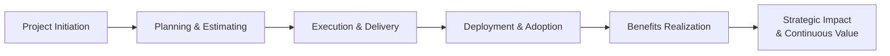

## 4.2 Business and Strategic Value of Projects

Projects not only deliver specific products, services, or results, but also generate tangible and intangible value that directly impacts an organization’s strategic objectives. Whether increasing market share, optimizing processes to reduce costs, or elevating customer satisfaction, successful projects drive real business outcomes. Understanding how projects align with strategic goals and create value is therefore a core competency for project managers.

This section explores the concept of business and strategic value, highlighting the methods used to evaluate returns, plan for long-term benefits, and ensure that each project contributes to organizational success. By tying project objectives to bigger-picture strategies, project managers become vital enablers for sustainable growth and competitive advantage.

## Introduction

Business value refers to the net worth a project brings to an organization, and it is typically measured in terms of financial, tangible, and intangible benefits. Strategic value, on the other hand, emphasizes how a project aligns with and advances the organization’s overarching goals, such as market differentiation, operational efficiency, customer engagement, or innovation leadership.

When a project is initiated, sponsors, stakeholders, and senior leadership often have clear expectations about the benefits they hope to achieve. These expectations go beyond delivering a scope on time and within budget; they include delivering the right outcomes that ultimately contribute to the organization’s bottom line, brand reputation, and future direction. The following sections examine the alignment between project deliverables and broader strategic imperatives.

## Linking Projects to Organizational Strategy

Projects serve as a bridge between an organization’s strategic plan and the execution of that plan. By carefully selecting and managing projects, companies are able to turn high-level objectives—like increasing revenue or enhancing brand recognition—into tangible results.

Organizations often employ portfolio management techniques to prioritize which projects align with the larger strategy. Projects that demonstrate a high potential return on investment (ROI), engage critical stakeholders, or open new market opportunities may be deemed more strategically vital than those that merely address short-term issues.

To visualize this alignment, consider the following simplified flowchart:

In this diagram:
• The business strategy defines the vision and long-term aspirations.  
• Project proposals are generated and then evaluated based on alignment with those aspirations.  
• Selected projects undergo execution guided by robust monitoring and control mechanisms.  
• Benefits are realized, measured, and reviewed to ensure they support strategic objectives.

## Defining Business and Strategic Value

Business value can be quantified in terms of financial metrics like ROI, Net Present Value (NPV), or Internal Rate of Return (IRR). Strategic value can be more nuanced, often involving intangible factors such as customer sentiment, organizational culture, or an expanded knowledge base. Both dimensions are equally significant and need to be balanced for effective decision-making.

### Tangible and Intangible Value

Tangible value is relatively straightforward to quantify. It may include:
• Revenue growth from entering a new market.  
• Cost savings from digitizing manual processes.  
• Reduced defects by investing in better quality management.  

Intangible value, though potentially more difficult to measure, can significantly influence an organization’s ability to thrive. Examples include:
• Brand perception improvements that lead to stronger customer loyalty.  
• Enhanced employee morale and retention resulting from an engaged corporate culture.  
• Innovations in products or services that position the company as an industry leader.  

A comprehensive business case often incorporates both tangible and intangible benefits, ensuring project sponsors have a holistic view of how the project will enhance strategic goals.

### Aligning Value With Strategy

Projects that contribute to long-term strategy typically focus on:
• Differentiation: Creating unique proposition in the marketplace (e.g., advanced product features).  
• Operational Excellence: Streamlining processes to improve efficiency and reduce waste.  
• Customer Intimacy: Nurturing relationships and delivering highly tailored experiences.  
• Innovation: Building cutting-edge capabilities and solutions for future market needs.  

If a project does not support at least one of these strategic anchors (or whatever strategic pillars the organization has defined), its feasibility and priority often diminish. The project manager should be able to articulate precisely how the project drives strategic advantages, especially during stakeholder negotiations and investment justification.

## Measuring and Communicating ROI

ROI is one of the most frequently used metrics to gauge the financial benefits of any endeavor. Calculating ROI typically involves:

(1) Estimating all costs associated with executing the project (including capital expenditures, operational expenses, resources, training, and time).  
(2) Calculating the expected returns in terms of revenue gains, cost reductions, risk mitigation, or intangible benefits that can be approximated in financial terms.  
(3) Comparing returns vs. investments to determine profitability or overall value creation.  

A simplified ROI formula can be:


\text{ROI} = \frac{\text{Net Profit (Benefits - Costs)}}{\text{Total Costs}} \times 100\%


If, for instance, a project costs $200,000 to implement and yields $300,000 in cost savings, the net benefit is $100,000, resulting in an ROI of 50%. Though simplistic, it provides a snapshot of value for project sponsors and executives.

ROI alone is not always sufficient. Other metrics like IRR and NPV offer more nuanced perspectives on the time value of money and long-term returns. For strategic projects that extend over multiple years, these metrics can better capture long-term viability, potential risks, and break-even points.

## NPV, IRR, and Payback Period

### NPV (Net Present Value)
NPV discounts future cash flows to present value terms. It answers the question: “How much is this project worth in today’s dollars?” Positive NPV indicates that discounted benefits exceed costs, which implies the project is financially viable.

### IRR (Internal Rate of Return)
IRR is the rate at which the project’s discounted cash inflows equal its outflows, effectively pegging the project at a break-even scenario over its lifecycle. The higher the IRR, the more attractive the investment, because it suggests faster or greater returns.

### Payback Period
The payback period estimates how long it will take for project benefits to recover initial costs. Though simple, it does not account for cash flows beyond the payback point, nor does it factor in the time value of money. It is useful for short-term comparisons or quick evaluations of risk.

## Balancing Financial and Strategic Considerations

While financial metrics like ROI, NPV, and IRR steer decisions, project managers must equally weigh strategic imperatives. Some projects with modest short-term returns can have significant long-term strategic impact—such as investing in a new customer relationship management (CRM) platform that improves brand loyalty. Other ventures might protect the company from regulatory or reputational risks, making them indispensable although the direct financial returns might be relatively small.

For instance, an organization might invest in a sustainability project primarily due to environmental compliance requirements. Even if the immediate ROI seems marginal, the long-term strategic gain might be critical for entering eco-conscious markets, preserving brand reputation, or meeting future regulations without incurring penalties.

## Considering Portfolio Management

Project selection occurs within the larger context of the project portfolio, which encapsulates all projects an organization undertakes. Portfolio management ensures the company invests resources in a set of projects that collectively maximize business value and strategic alignment. A well-managed portfolio balances short- and long-term investments, high-risk and low-risk initiatives, and internal improvement projects vs. external growth initiatives.

The organization might adopt a scoring model, weighting projects by factors such as:
• Strategic fit  
• Financial potential  
• Risk complexity  
• Regulatory compliance  
• Resource availability  

The final score informs which projects advance to the pipeline. This structured approach plays a crucial role in ensuring each project truly contributes to business and strategic aims rather than divert resources to unaligned tasks.

## Translating Strategy into Project Objectives

Before project planning even begins in earnest, sponsors and project managers should articulate the project’s alignment to organizational strategy and define measurable objectives. This typically happens in collaboration with senior management and other stakeholders. Setting clear, quantifiable goals (e.g., “Increase market share by 5% in the next 12 months”) allows the project manager to craft a scope and plan that directly targets these outcomes.

Project objectives might include:
• Enhancing brand loyalty by rolling out a new product line integrated with existing services.  
• Improving operational efficiency by automating data entry tasks.  
• Complying with new industry regulations that impact corporate reputation if unmet.  

Explicitly defining these objectives fosters accountability and clarity, enabling the team to track whether the project is genuinely driving business value rather than producing outputs that do not translate into desired outcomes.

## Practical Example: Implementing an Enterprise Resource Planning (ERP) Solution

Consider a medium-sized manufacturing firm that decides to implement an ERP system to unify inventory tracking, human resources, and financial management. Implementing such a system incurs substantial costs for software licenses, hardware investments, and staff training. However, the company estimates that real-time data will bring significant time savings, reduce inventory carrying costs, and improve cash flow management.

Through a business case, the firm calculates an anticipated ROI of 40% over three years. Additionally, intangible benefits are identified, such as better collaboration between departments, improved employee satisfaction from streamlined workflows, and future-readiness for automating or digitizing more advanced capabilities. Collectively, these benefits far exceed the costs, justifying the ERP rollout and tying it to a broader strategy of achieving operational excellence.

## Key Pitfalls and Lessons Learned

Failure to Tie Deliverables to Strategic Goals  
Without explicitly connecting project deliverables to strategic goals, teams may deliver outputs that have limited or no real organizational impact. This leads to wasted resources and missed opportunities.

Over-Reliance on Financial Metrics  
While metrics such as ROI and payback period are crucial, they hardly paint the full picture. Ignoring intangible benefits or strategic alignment can result in underprioritized projects that could otherwise provide long-lasting competitive advantage.

Neglecting Continuous Stakeholder Engagement  
Projects that do not regularly communicate metrics of success and progress in plain business-friendly language might lose stakeholder support. Continuous engagement ensures benefits remain relevant and on track.

Lack of Benefit Realization Planning  
Organizations sometimes fail to track or measure whether the projected benefits materialize after the project closes. Without post-project evaluations or a benefits realization plan, it is hard to confirm if the project truly generated strategic value.

## Benefits Realization and Sustaining Long-Term Value

Once the project deliverables are handed over, the organization should actively measure their short- and long-term impacts. Conducting benefits realization reviews at regular intervals ensures that projected benefits are not just theoretical but translate effectively into tangible results. These could be scheduled at 6-month or 12-month intervals post-go-live, focusing on both financial and non-financial outcomes:

• Has the project led to the anticipated revenue increase?  
• Are the forecasted time savings materializing?  
• How satisfied are end-users and customers with the new processes?  
• Are there additional strategic insights or developments that arose unexpectedly?  

If underperformance is observed, corrective actions or follow-up initiatives might be necessary. This iterative process nurtures a culture of continuous learning and improvement, ensuring that projects remain relevant and yield sustained value.

## Real-World Approaches to Sustaining Strategic Value

• Agile Release Management: In agile environments, teams release new features iteratively, gathering feedback to continuously refine benefits. This iterative approach helps confirm that delivered features produce real value and stay aligned with evolving strategies.  
• Change Management Execution: Projects often fail to deliver intended benefits due to poor user adoption. Strong change management, including training, communication, and stakeholder engagement, fosters acceptance, ensuring that the project’s outputs truly bolster strategic objectives.  
• Governance and Oversight: Regular governance checkpoints, such as monthly or quarterly portfolio reviews, track whether a project’s trajectory still supports the strategic roadmap. If necessary, strategic pivots or re-scoping can be undertaken to recalibrate direction.

## Diagram: Life Cycle of Business Value Realization

• Project Initiation: Clarifies strategic intent and obtains sponsorship.  
• Planning & Estimating: Outlines financial projections, intangible benefits, and timeline.  
• Execution & Delivery: Builds the product or service, adhering to defined scope, time, and budget.  
• Deployment & Adoption: Rolls out deliverables to end-users, accompanied by training and change management.  
• Benefits Realization: Monitors progress against expected outcomes, adjusting as necessary.  
• Strategic Impact & Continuous Value: Captures lessons learned and capitalizes on new opportunities created by the project’s deliverables.

## Best Practices for Maximizing Business and Strategic Value

• Involve Executive Stakeholders Early  
Securing leadership buy-in ensures alignment with strategy and a robust sense of urgency.  
• Anchor KPIs to Strategic Goals  
Identify a set of well-defined, relevant Key Performance Indicators (KPIs) that illustrate both financial and non-financial gains.  
• Plan for Change Management  
Effective user adoption often determines whether a project’s outputs meaningfully contribute to the organization.  
• Conduct Benefits Tracking Beyond Project Closure  
Executing a Post-Implementation Review (PIR) or benefits realization check ensures that lessons learned are documented and future project planning is improved.

## Sample Table: Mapping Projects to Strategic Goals

| Strategic Goal                     | Aligned Project Example                        | Potential Metric                  | Expected Outcome                                  |
|-----------------------------------|-----------------------------------------------|-----------------------------------|---------------------------------------------------|
| Operational Excellence            | ERP Implementation                            | Time-to-Ship, Inventory Accuracy | Reduced cycle times and improved data insight     |
| Customer Intimacy                 | Customer Loyalty Program                      | Customer Retention Rate          | Enhanced brand loyalty and repeat purchases       |
| Innovation and Market Leadership  | R&D Investment in a New Product Line          | Speed-to-Market                  | Early market access, competitive differentiation  |
| Regulatory Compliance             | Implementation of GDPR Data Protection Measures | Compliance Gap                   | Avoidance of fines and reputational damage        |

## Conclusion

Projects are not merely transient endeavors undertaken to meet short-term, isolated goals. Instead, they are catalysts for real and sustained transformation, empowering an organization to fulfill its strategic vision. By methodically linking each project to clearly defined objectives and outcomes, project managers ensure that resources are utilized wisely and that every initiative has an impact on long-term profitability, brand integrity, and customer satisfaction.

Understanding business and strategic value demands a blend of financial acumen, stakeholder collaboration, and vision. As you deepen your project management expertise, focus not only on delivering a project’s scope on time and within budget, but also on ensuring that downstream benefits materialize as planned. This overarching perspective distinguishes merely functional project managers from truly strategic leaders in today’s ever-evolving marketplace.

## References

• Project Management Institute. A Guide to the Project Management Body of Knowledge (PMBOK® Guide) – Seventh Edition.  
• PMI. “Strategic Alignment: Sustaining Competitive Advantage” (PMI White Paper).  
• Harvard Business Review. “Managing Your Mission-Critical Projects.”  
• Kaplan, R. S. & Norton, D. P. “The Balanced Scorecard: Translating Strategy into Action.”  
• Kotter, J. P. “Leading Change.”  

## Test Your Mastery: Business and Strategic Value of Projects Quiz



### Which of the following BEST describes business value in the context of projects?

- [ ] The estimated number of resources needed to complete a project.
- [x] The net worth a project delivers to an organization, measured through tangible and intangible benefits.
- [ ] The total scope items and deliverables a project must produce.
- [ ] The unique constraints that limit a project’s possible outcomes.

> **Explanation:** Business value encompasses financial returns, brand strength, market position, and other intangible benefits that a project brings to the organization.

### Which metric is generally used to see how quickly a project can recover its investment?

- [ ] NPV
- [x] Payback Period
- [ ] IRR
- [ ] ROI %

> **Explanation:** The payback period determines how long it takes to recover the initial cost, providing a quick sense of timing for project benefits.

### Which statement is TRUE regarding ROI (Return on Investment)?

- [x] It measures net benefits relative to project costs in percentage terms.
- [ ] It is the only metric to consider when assessing strategic value.
- [ ] ROI is unaffected by intangible benefits.
- [ ] ROI always yields the same conclusion as NPV.

> **Explanation:** ROI compares net gains to the costs of the project in percentage terms. However, intangible benefits should also be considered, and ROI may differ from NPV or IRR conclusions.

### Why is stakeholder engagement trackable for business and strategic value?

- [ ] Stakeholders rarely affect ROI calculations.
- [ ] It guarantees a high IRR.
- [ ] It ensures only financial data is considered.
- [x] It fosters alignment, clarifies expectations, and helps achieve desired benefits.

> **Explanation:** By engaging stakeholders, project managers ensure the project stays aligned with strategic goals and that users or customers are prepared to accept and realize the benefits.

### What is a primary reason to include intangible benefits in a business case?

- [x] They contribute to long-term growth and competitive edge.
- [ ] They can be leveraged to bypass stakeholder approvals.
- [x] They never require quantification.
- [ ] They have no impact on project selection.

> **Explanation:** Intangible benefits can significantly shape an organization’s future positioning and are often key factors in sustaining competitive advantage.

### In what way does NPV differ from ROI?

- [x] NPV accounts for the time value of money, while ROI expresses net benefit as a percentage.
- [ ] ROI is only applicable to intangible benefits, whereas NPV is not.
- [ ] NPV cannot be applied to multi-year projects.
- [ ] ROI always uses discount rates, while NPV does not.

> **Explanation:** NPV discounts future cash flows to present value, which acknowledges the time value of money. ROI simply presents net benefits as a percentage of costs, without discounting future benefits.

### How does a strong change management plan improve long-term benefit realization?

- [x] It promotes user adoption of new processes and tools, securing the intended project benefits.
- [ ] It defers training until after project closure to reduce costs.
- [x] It eliminates the need for post-project reviews.
- [ ] It replaces traditional financial analysis.

> **Explanation:** Change management practices ensure that end-users embrace new ways of working, preventing common pitfalls that can erode the project’s intended benefits.

### When talking about strategic alignment, which scenario is MOST advantageous?

- [ ] Initiating numerous projects that generate similar short-term gains.
- [x] Selecting a smaller number of projects that clearly connect to the organization’s long-term goals.
- [ ] Rejecting all projects that have no immediate financial ROI.
- [ ] Pursuing high-return projects with minimal regard for the company’s vision.

> **Explanation:** Strategic alignment focuses on projects that advance the organization’s overarching objectives. If a project lacks a clear connection to these goals, it may hinder long-term competitiveness or resource allocation.

### What is a key function of portfolio management in maximizing strategic value?

- [ ] Tracking daily project tasks.
- [ ] Replacing the need for stakeholder analysis.
- [ ] Only focusing on cost reduction.
- [x] Prioritizing projects to ensure resources align with strategic objectives.

> **Explanation:** Portfolio management helps to choose, prioritize, and align projects based on the organization’s strategic vision and resource constraints.

### True or False: Projects that show limited immediate ROI might still provide vital strategic advantages in the long run.

- [x] True
- [ ] False

> **Explanation:** Certain initiatives, such as research or regulatory compliance, may have modest short-term returns but yield significant long-term strategic benefits, such as market leadership or brand reputation enhancement.



## PMP Mastery: 1500+ Hard Mock Exams with Full Explanations 

Looking to crush the PMP exam with confidence? Dive deep into 6 rigorous mock exams totaling 1500+ advanced-level questions, each accompanied by clear, step-by-step explanations. Hone your test-taking strategies, master complex topics, and build the resilience you need on exam day. Perfect for serious PMs aiming beyond fundamentals.  

Enroll now:  
[PMP Mastery: 1500+ Hard Mock Exams with Exceptional Clarity & Full Explanations](https://www.udemy.com/course/pmp-2025/?referralCode=CF83A54BC86BE27F9AFE)

_Disclaimer: This course is not endorsed by or affiliated with the PMI examination authority. All content is provided purely for educational and preparatory purposes._
