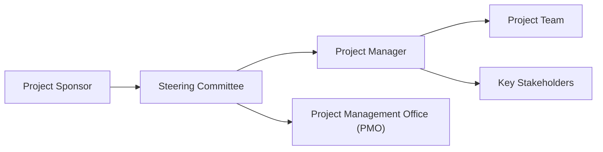

## 4.3 Project Roles, Stakeholders, and Governance

Effective project management hinges on three closely intertwined elements: clearly defined roles, stakeholder engagement, and a well-established governance framework. This section examines the spectrum of participant roles and their responsibilities, the multifaceted nature of stakeholder relationships, and the governance structures that bring consistency, transparency, and alignment to project efforts.

A project may succeed or fail based on the clarity of responsibilities and the quality of oversight and support from its governing bodies. By understanding these foundational principles, project managers can foster collaboration, manage conflicts more effectively, and set realistic expectations. This knowledge forms a cornerstone of professional project management practice, aligning with principles highlighted in the PMBOK® Guide (Seventh Edition) and explored throughout this book.

---

### Introduction to Project Roles, Stakeholders, and Governance

Projects, by their very nature, require cross-functional collaboration, structured oversight, and active involvement from individuals across an organization and sometimes beyond. Each participant brings a unique perspective, set of responsibilities, and decision-making authority. When these roles are not clearly defined or properly governed, confusion, conflicts, and inefficiencies arise. Conversely, well-defined roles and robust governance structures create an environment that allows team members to excel, fosters transparent communication, and ensures that strategic objectives are met.

---

### Defining Key Project Roles

One hallmark of organizational maturity is the ability to articulate and delegate roles effectively. In project management, these roles often include:

- Project Sponsor  
- Project Manager  
- Project Team Members (including roles like Business Analysts, Developers, Testers, Designers)  
- Functional and Resource Managers  
- Product Owner or Product Manager (in agile or hybrid settings)  
- Project Management Office (PMO) Personnel  
- Steering Committee or Governance Board  

Each role contributes a distinct perspective, and all must align to achieve project success.

#### Project Sponsor

The Project Sponsor is often a senior executive or departmental head who champions the project at the highest organizational level. This person:  
• Ensures the project’s objectives align with the organization’s strategy and business goals.  
• Secures funding, resources, and political support.  
• Provides.
 high-level guidance on scope and strategic direction.  
• Removes organizational barriers by leveraging their authority.

A strong sponsor can lubricate the path to success, offering access to resources and resolving escalated conflicts swiftly. For example, if procurement delays inhibit timely vendor onboarding, the sponsor can intervene to expedite negotiation. On the PMP® exam and in real-world scenarios, the sponsor’s commitment is frequently a decisive factor in a project’s ultimate success or failure.

#### Project Manager

The Project Manager (PM) is the individual responsible for planning, executing, and closing the project in accordance with its scope, schedule, and budget. Specific tasks include:  
• Defining detailed milestones and deliverables in the project management plan.  
• Leading the project team, delegating tasks, and monitoring progress.  
• Communicating with stakeholders and sponsors.  
• Managing risks and controlling changes.  
• Cultivating a healthy project culture that promotes collaboration and accountability.

A project manager’s leadership style might be directive, facilitative, or servant-leadership oriented (especially in agile contexts). The PM is not merely an administrator but typically acts as a central communication hub and motivator.

#### Project Team

The Project Team comprises individuals who perform technical, functional, or support tasks in pursuit of project deliverables. Members may include engineers, developers, quality assurance testers, subject matter experts (SMEs), or business analysts. Core responsibilities include:  
• Executing assigned tasks in alignment with project requirements.  
• Raising risks and issues early.  
• Collaborating effectively and providing feedback on feasibility.  
• Contributing to continuous improvement through lessons learned.

In agile settings, the project team is often referred to as a cross-functional, self-organizing unit that cumulatively shares responsibility for delivering incremental value.

#### Functional and Resource Managers

Functional managers oversee departmental staff and resources. Their responsibilities may intersect with the project when:  
• Project requirements overlap with functional responsibilities (e.g., IT systems, marketing campaigns).  
• Allocating resources to the project team.  
• Managing performance reviews of team members who are “on loan” to the project.  

Resource managers often coordinate workforce planning, balancing competing demands from multiple projects while ensuring the organization’s strategic needs remain fulfilled.

#### Product Owner or Product Manager (Agile/Hybrid)

In agile and hybrid approaches, the Product Owner (often referred to as the Product Manager in some frameworks) is accountable for maximizing the value of the product resulting from the work of the development team. Key responsibilities include:  
• Maintaining and prioritizing the product backlog.  
• Ensuring the team understands acceptance criteria and stakeholder requirements.  
• Acting as the voice of the customer, balancing various interests to optimize value.

#### Steering Committee or Governance Board

For more complex or large-scale initiatives, a Steering Committee (or Governance Board) provides high-level oversight. Members may include executive sponsors, senior functional managers, risk officers, or finance experts. Their role includes:  
• Verifying that projects stay aligned with organizational strategy.  
• Assessing change requests with broad organizational implications.  
• Resolving escalated conflicts.  
• Ensuring compliance with corporate mandates (legal, regulatory, or ethical).

The Steering Committee functions as a governance mechanism that ensures projects remain on track, within tolerance, and consistent with long-term objectives.  

---

### Stakeholder Identification and Engagement

Stakeholders are individuals or groups who have an interest in or can influence project outcomes. They may be internal to the organization (e.g., senior management, employees) or external (e.g., customers, regulators, suppliers). Whether the influence is directly on the project plan or indirectly through intangible concerns such as public relations and brand image, stakeholder inputs and expectations require careful management.

Key dimensions of stakeholder engagement include:

• Identifying all relevant stakeholders early, assessing their level of power, interest, and influence.  
• Understanding their requirements, concerns, and communication preferences.  
• Engaging them throughout the project life cycle in appropriate ways (e.g., formal meetings, consultations, agile reviews, or informal one-on-ones).  
• Continuously monitoring and adjusting engagement strategies to ensure alignment and buy-in.

#### Internal vs. External Stakeholders

• Internal stakeholders: Senior leadership, project team, PMO staff, other departments within the organization.  
• External stakeholders: Customers, end-users, vendors, regulators, community representatives.

Engagement strategies vary significantly between these groups, as external stakeholders often require more rigorous communication and alignment, particularly regarding compliance, contractual obligations, and reputational concerns.

#### Positive vs. Negative Stakeholders

While most stakeholders are “positive,” supporting the project’s objectives, some may perceive it as threatening their existing processes or authority. So-called “negative” stakeholders may possess significant influence and can obstruct progress if not managed thoughtfully. Proactive communication, negotiation, and sometimes compromise are critical to bridging differences and moving the project forward.

---

### Governance Frameworks in Project Management

Governance provides the framework within which decisions are made, resources are allocated, and performance is monitored. In project management, governance ensures accountability, oversight, and alignment with organizational strategy. A well-structured governance model clarifies who does what, how, and when, ensuring that no critical decisions slip through the cracks.

Project governance involves:

• Establishing roles and authorities for decision-making (sponsor, PM, steering committee).  
• Defining approval pathways for scope changes, budget allocations, and risk responses.  
• Providing mechanisms for conflict resolution and escalation.  
• Monitoring adherence to organizational policies, regulations, and ethical standards.

In large organizations, a Project Management Office (PMO) frequently defines and enforces governance processes across multiple projects or programs. Gated reviews at different milestones can also be part of governance. Before moving from one phase to another, a governance board might evaluate the project’s readiness, resource allocations, and alignment with strategy.

#### Governance Structure Diagram

Consider the following sample structure that illustrates high-level governance roles:

- A["Project Sponsor"]  
  The ultimate champion providing budget and strategic alignment.  

- B["Steering Committee"]  
  Senior-level governance body ensuring progress aligns with organizational goals.  

- C["Project Manager"]  
  Day-to-day leader who coordinates tasks, manages risks, and ensures deliverables stay on track.  

- D["Project Management Office (PMO)"]  
  Defines standards, provides support, may facilitate resource allocation, and ensures compliance with organizational methodologies.  

- E["Project Team"]  
  Responsible for executing tasks, producing deliverables, and communicating issues or risks.  

- F["Key Stakeholders"]  
  Actively engaged, consulted, or informed depending on power/influence and stakeholder strategy.

---

### RACI Charts and Role Definition

RACI (Responsible, Accountable, Consulted, Informed) charts help clarify roles and responsibilities, ensuring transparency in who does what. A typical RACI chart for a project phase (e.g., Scope Definition) could look like this:

| Task / Role             | Sponsor | Project Manager | Team Members | PMO  | Stakeholders |
|-------------------------|---------|-----------------|-------------|------|--------------|
| Define Project Charter  | A       | R              | C           | C    | I            |
| Gather Requirements     | I       | A              | R           | C    | C            |
| Approve Scope Statement | A       | R              | C           | I    | I            |
| Validate Scope          | A       | R              | R           | I    | C            |

- R (Responsible): Completes the task.  
- A (Accountable): Ultimately answerable for the correct completion of the task.  
- C (Consulted): Provides input or expertise prior to decisions.  
- I (Informed): Receives updates or information about the task or decision.

This tool helps prevent role-related misunderstandings and fosters accountability. On the PMP® exam, knowledge of RACI charts is frequently tested under resource management and stakeholder domain questions.

---

### Governance in Agile and Hybrid Environments

Agile methodologies typically emphasize lean governance—decisions are often made at the team level, and the structure is more flexible. Yet, higher-level oversight is still vital to ensure alignment with business objectives. In scaled agile frameworks, for instance:

• A Release Train Engineer (RTE) or Scrum Master role facilitates team-of-teams communication.  
• Product Management (or Product Owner sync) ensures backlog alignment across multiple teams.  
• Portfolio governance may set funding allocations and strategic priorities.

In hybrid setups, aspects of predictive governance (e.g., phase gates, documentation, budget approvals) can blend with agile practices (e.g., sprints, product backlogs, daily standups). The challenge is striking the right balance so that the project retains enough flexibility to respond to change while still meeting organizational compliance and reporting standards.

---

### Practical Examples and Case Studies

1. Construction Project with a Centralized PMO  
   • A large construction firm establishes a centralized PMO that oversees resource planning and procurement policies. Each project’s sponsor must submit a business case, which the PMO evaluates for alignment with corporate objectives. A steering committee meets monthly to review scope changes, budget variances, and risk exposures.

2. SaaS Product Launch in an Agile Environment  
   • A tech startup implements Scrum for rapid product increments. The Product Owner liaises with multiple external stakeholders, including pilot customers and strategic partners, through regular demos and reviews. A minimal governance layer (led by a sponsor who is also the CEO) focuses on ensuring that the rollout aligns with the company vision and meets investor expectations.  

3. Global Pharmaceutical Program  
   • A global pharmaceutical company runs a multi-year program subject to strict regulatory controls. The program governance board includes legal and compliance officers, ensuring medical trials comply with clinical practice guidelines. The sponsor escalates issues related to regulation or ethics to a dedicated committee for expedited decision-making.

These examples highlight that context shapes governance design. Regulatory, cultural, and organizational maturity factors dictate how robust or flexible governance should be.

---

### Best Practices for Effective Project Governance

• Define Roles and Responsibilities Early  
  Make sure that each participant’s role is documented and understood.  

• Use Clear Governance Pathways  
  Spell out escalation routes and decision-making thresholds (e.g., who approves changes above a certain budget extension).  

• Balance Control and Flexibility  
  Particularly in agile or rapidly changing environments, governance should prevent chaos without stifling innovation.  

• Engage Stakeholders Continuously  
  Consistent and transparent communication is the backbone of successful governance.  

• Establish Performance Metrics  
  Key Performance Indicators (KPIs), earned value metrics, or agile velocity metrics enable data-driven oversight.  

• Maintain Audit Trails and Documentation  
  While agile teams may minimize documentation, certain regulatory domains demand rigorous records of approvals, decisions, and compliance checks.

---

### Common Pitfalls and Challenges

1. Role Ambiguity  
   • Overlapping responsibilities can sow confusion. Example: two managers claiming final say in approving scope changes.  

2. Lack of Timely Decision-Making  
   • Governance bodies that rarely meet or fail to respond quickly can cause bottlenecks, delaying critical project actions.  

3. Overly Complex Governance Structures  
   • Too many layers of oversight can hamper flexibility and demoralize the project team.

4. Underestimating the Stakeholder Influence  
   • Projects can be derailed when key stakeholders (internal or external) are not identified or effectively engaged.  

5. Insufficient Sponsor Commitment  
   • Sponsors with limited availability or lacking organizational clout can undermine the team’s ability to resolve issues.  

6. Inadequate Risk Management at the Governance Level  
   • Governance boards sometimes focus on top-level strategy but fail to recognize early risk signals from project teams.

---

### Strategies to Overcome Challenges

• Conduct a Governance Needs Assessment  
  Evaluate the project’s complexity, risk, and strategic value. Tailor governance processes accordingly.  

• Establish Clear Communication Channels  
  Define when and how sponsors, steering committees, and PMOs will interact with the project manager and team.  

• Onboard Sponsors and Stakeholders Properly  
  Offer concise orientation sessions on the governance approach, so everyone understands roles, processes, and expectations.  

• Foster a Culture of Transparency  
  Encourage open reporting of issues and lessons learned, ensuring that governance bodies are aware of real-time challenges.  

• Simplify Where Possible  
  If the governance layers are too convoluted, prune them to accelerate decision-making and reduce administrative load.

---

### Conclusion

The interplay of project roles, active stakeholder engagement, and sound governance practices can drastically influence a project’s success. From the senior sponsor’s strategic oversight to the project manager’s day-to-day leadership and the project team’s technical execution, each role links into a broader governance framework designed for transparency, accountability, and alignment. Whether operating in a predictive, agile, or hybrid environment, all roles must be clearly defined and coordinated under a governance structure that balances oversight with adaptive flexibility.

Project management maturity—both at the individual and organizational level—is often measured by how well roles, stakeholders, and governance are managed. Establishing clarity in these areas cultivates collaboration, mitigates risk, and increases the likelihood of delivering successful outcomes that meet both immediate project objectives and overarching strategic goals.

---

## Test Your Knowledge: Roles and Stakeholders in Project Management



### Which of the following roles is typically responsible for removing organizational barriers by leveraging their high-level authority?

- [ ] Project Manager
- [ ] Project Team
- [x] Project Sponsor
- [ ] Stakeholder Committee

> **Explanation:** The Project Sponsor provides the senior-level support and authority needed to remove barriers that a Project Manager or Team may encounter.

### In a RACI chart, which category of involvement indicates that a person must be actively kept aware of progress, but not necessarily consulted for decisions?

- [ ] Responsible (R)
- [ ] Accountable (A)
- [ ] Consulted (C)
- [x] Informed (I)

> **Explanation:** “Informed” means the individual remains updated but doesn't provide direct input or make decisions.

### What is the primary purpose of a Steering Committee or Governance Board in project management?

- [x] To ensure projects remain aligned with organizational strategy and resolve high-level escalations
- [ ] To manage day-to-day project tasks
- [ ] To write project charters on behalf of the sponsor
- [ ] To handle administrative tasks for the project

> **Explanation:** The Steering Committee provides oversight, alignment with strategic goals, and guidance for major decisions and escalations.

### Which of the following best describes a negative stakeholder?

- [ ] A stakeholder with no interest in the project
- [x] A stakeholder who perceives the project as a threat and can obstruct progress
- [ ] A stakeholder who provides active support to the project
- [ ] A stakeholder outside of the organization

> **Explanation:** Negative stakeholders may oppose or feel threatened by project outcomes, potentially obstructing progress if not managed effectively.

### Which governance principle is most critical for agile and hybrid environments?

- [ ] Strictly following a hierarchical chain of command
- [x] Balancing the need for adaptability with essential oversight
- [ ] Requiring extensive documentation for every decision
- [ ] Eliminating sponsor involvement entirely

> **Explanation:** Agile approaches demand responsiveness and adaptability; however, essential oversight ensures alignment and control without stifling flexibility.

### In which project role is rigorous engagement with stakeholders to gather requirements most typical?

- [ ] Sponsor
- [x] Project Manager
- [ ] Steering Committee Member
- [ ] PMO Director

> **Explanation:** The Project Manager usually leads or coordinates requirement-gathering efforts, ensuring that stakeholder needs are captured and understood.

### Which item is most essential in clarifying approval pathways for scope changes, budget allocations, and risk responses?

- [ ] Project Charter
- [ ] Scope Statement
- [x] Governance Plan
- [ ] Issue Log

> **Explanation:** A Governance Plan outlines who authorizes changes, budgets, and risk actions, creating clarity and consistency across the project.

### What challenge might arise if the PMO layers are overly complex?

- [x] Delayed decision-making and a negative impact on team morale
- [ ] Clearer oversight and smoother communication
- [ ] No impact; complexity doesn’t affect governance
- [ ] Reduced need for sponsor support

> **Explanation:** Excessive layers of governance or bureaucracy often slow down decision-making and undermine project momentum.

### Which of the following is NOT a responsibility of the Project Manager?

- [x] Approving and securing the overall project budget from the organization
- [ ] Leading the team and delegating tasks
- [ ] Managing risks and changes
- [ ] Communicating project progress to stakeholders

> **Explanation:** While the Project Manager usually manages the budget, the sponsor and higher-level management typically approve and secure the overall budget.

### One key advantage of a well-defined stakeholder engagement strategy is that it:

- [x] Ensures stakeholders’ needs and concerns are heard and addressed proactively
- [ ] Eliminates the need for project documentation
- [ ] Guarantees no conflicts will arise
- [ ] Removes the need for risk management

> **Explanation:** A robust stakeholder engagement approach facilitates proactive communication and conflict resolution, although it does not eliminate all potential issues or conflicts.



---

## PMP Mastery: 1500+ Hard Mock Exams with Full Explanations 

Looking to crush the PMP exam with confidence? Dive deep into 6 rigorous mock exams totaling 1500+ advanced-level questions, each accompanied by clear, step-by-step explanations. Hone your test-taking strategies, master complex topics, and build the resilience you need on exam day. Perfect for serious PMs aiming beyond fundamentals.

Enroll now:  
[PMP Mastery: 1500+ Hard Mock Exams with Exceptional Clarity & Full Explanations](https://www.udemy.com/course/pmp-2025/?referralCode=CF83A54BC86BE27F9AFE)

_Disclaimer: This course is not endorsed by or affiliated with the PMI examination authority. All content is provided purely for educational and preparatory purposes._
