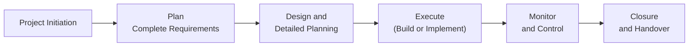
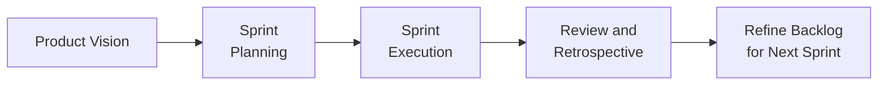
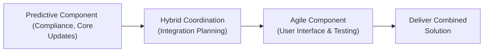

## 4.4 Project Life Cycles: Predictive, Agile, Hybrid

Selecting the right project life cycle can significantly influence a project’s success. The choice often comes down to factors such as product clarity, organizational culture, team expertise, level of uncertainty, and stakeholder engagement. Traditionally, predictive (or waterfall) approaches reigned in steady environments. However, with rising uncertainty and the need for frequent feedback, agile and hybrid models have emerged as key strategies. This section delves into how each life cycle type operates, how to select the most suitable model, and how combining traits of each can lead to more effective project outcomes.

### Understanding the Concept of Project Life Cycles

A project life cycle outlines the phases a project traverses from initiation to closure. Each phase need not necessarily be a strict time-bound segment with a single milestone; rather, it often reflects a grouping of activities and decision points. As noted in earlier sections of this guide, a project can align with multiple methodologies so long as it meets stakeholder and organizational requirements. The PMBOK® Guide (Seventh Edition) encourages practitioners to tailor the approach to context as part of good project management practice.  

Below, we examine three primary life cycle categories:

- Predictive (Waterfall) Life Cycle  
- Agile (Adaptive) Life Cycle  
- Hybrid (Blended) Life Cycle  

Each approach has unique strengths and may be tailored further using organizational process assets, enterprise environmental factors, and situational context.

---

### Predictive (Waterfall) Life Cycle

Often considered the most traditional approach, the predictive life cycle (commonly called “waterfall”) involves extensive planning up front. Requirements are gathered, documented, and validated early in the project. Subsequently, all tasks are executed in logically distinct phases, like planning, execution, monitoring, and closure. Each phase typically culminates with a formal review or sign-off.

#### Key Characteristics

• Requirements are defined in detail before project execution starts.  
• A dedicated planning phase precedes most execution activities.  
• Scope, time, and cost baselines are established early and remain relatively stable.  
• Changes to scope or requirements typically undergo formal, stringent change-control processes.  
• Progress is tracked against an overarching plan, often using tools like Gantt charts, critical path analysis, and earned value management (EVM).  

#### Strengths

1. Clear Structure and Milestones  
   Projects in well-understood domains or with thoroughly defined requirements benefit from the linear approach, ensuring minimal rework.  

2. Predictable Costs and Timelines  
   With known requirements and robust planning, organizations can forecast and budget with relative confidence.  

3. Familiarity for Stakeholders  
   Many organizations have historically used or still use predictive approaches, making them comfortable with the structure and artifacts (e.g., Work Breakdown Structure, Gantt charts).  

#### Limitations

1. Inflexibility in Changing Environments  
   Rigid baselines can make it difficult to adapt when requirements evolve or unforeseen events occur.  

2. Risk of Late Feedback  
   Testing or validation sometimes occurs late, leading to potential rework if user acceptance testing reveals mismatches between delivered solutions and stakeholder expectations.  

3. Team Dynamics  
   Roles and responsibilities may be siloed (e.g., business analysts, developers, testers), which can reduce cross-functional collaboration.  

#### Practical Example

Consider a construction project for a residential building. Requirements such as building codes, design specifications, and regulatory constraints are well-known. A predictive approach ensures proper sequencing of site clearing, foundation, framing, and finishing. Changes after the fact, such as altering the layout mid-construction, can be extremely costly—hence the emphasis on thorough up-front planning.

In the diagram above, each phase flows sequentially from left to right, reflecting the well-defined linear progression in a predictive model.

---

### Agile (Adaptive) Life Cycle

Agile approaches emerged as a response to rapidly changing requirements and the need for continuous feedback (see Chapters 24–26 for deeper insights). Software development teams pioneered agile methods like Scrum and Kanban, but the principles now extend to diverse fields such as marketing, product innovation, and even manufacturing prototypes.

#### Key Characteristics

• Continuous stakeholder feedback throughout the project.  
• Iterative development cycles where small increments of functionality are delivered frequently.  
• Self-organizing, cross-functional teams that prioritize collaboration and continuous improvement.  
• Requirements are allowed to evolve over time, rather than being fixed up front.  
• Progress tracking relies on artifacts like product backlogs, burn-down charts, or Kanban boards.  

#### Strengths

1. Adaptability to Change  
   Priorities and tasks can pivot quickly, making agile ideal for volatile environments where customer needs evolve rapidly.  

2. Early and Frequent Value Delivery  
   Stakeholders see incremental results early, which helps validate assumptions and uncover potential issues quickly.  

3. Collaborative and Empowering Approach  
   Agile frameworks emphasize team self-management, continuous learning, and stakeholder engagement, often improving morale and productivity.  

#### Limitations

1. Less Predictability of Final Deliverable Early On  
   Since requirements can shift iteratively, providing a precise timeline and cost at the outset is challenging.  

2. Cultural Adaptation  
   Implementing agile successfully often requires cultural shifts, organizational buy-in, and a shift from command-and-control to servant leadership.  

3. Possible Scope Creep  
   If not carefully managed, the openness to changing requirements can lead to analysis paralysis or ongoing additions without closure.  

#### Practical Example

A technology startup developing a new mobile application might employ short development sprints. At the end of each sprint, the team demonstrates potentially shippable app features—login functionality, user profiles, or chat modules—receiving immediate feedback from stakeholders. The backlog is refined routinely, reflecting the user-centric perspective that emerges as the product evolves.

The diagram depicts the iterative nature of planning, execution, review, and refinement integral to agile cycles.

---

### Hybrid (Blended) Life Cycle

Hybrid approaches combine elements of both predictive and agile frameworks. They are particularly useful when certain components of the project have stable and well-understood requirements, while other parts remain uncertain, benefit from incremental development, or require quick stakeholder feedback loops.

#### Key Characteristics

• A portion of the project or some deliverables may follow a predictive sequence, while experimental or less-understood components adopt iterative cycles.  
• The team may set up an overarching master plan (predictive) for key infrastructure or compliance milestones, complemented by agile sprints for user-facing features or R&D.  
• Change management processes may vary within the same project. Predictive components follow a formal sign-off procedure, while agile segments accept evolving requirements.  
• Governance and reporting might be a blend of traditional earned value metrics and agile status updates like velocity or burn charts.  

#### Strengths

1. Balancing Predictability and Flexibility  
   Ensures stable elements remain under tight control while allowing room for iterative experimentation on higher-risk areas.  

2. Minimizing Total Cost of Change  
   High-level design components are locked in to avoid large-scale rework; agile portions absorb evolving stakeholder needs or market changes.  

3. Accommodating Organizational Constraints  
   Some industries (e.g., healthcare, finance, aerospace) demand rigorous compliance tracking, yet teams can still inject agility for components where strict oversight is less critical.  

#### Limitations

1. Complexity of Governance  
   Managing two distinct sets of processes and mindsets (traditional vs. agile) may result in confusion if not clearly delineated.  

2. Team Skill Requirements  
   Hybrid success often demands a diverse skill set: comfort with standard PMBOK® artifacts as well as agile frameworks.  

3. Communication Gaps  
   Clarifying handoffs between predictive and agile segments can be tricky. Teams need excellent coordination to avoid bottlenecks.  

#### Practical Example

A financial services company updating a legacy loan processing system might use a hybrid approach. The core database updates would follow a predictive path (heavy compliance, stable requirements), while front-end features for customer interaction iterate under an agile framework to incorporate dynamic user feedback.

This diagram shows how distinct project workstreams (one predictive, one agile) converge under a hybrid management approach.

---

### Selection Criteria: Matching the Life Cycle to the Project Environment

Selecting the most appropriate life cycle depends on specific project factors:

• **Requirements Clarity**: Stable, well-documented requirements typically suit predictive; uncertain or evolving requirements favor agile or hybrid.  
• **Risk and Uncertainty Tolerance**: If the organization or project environment can handle iterative changes, agile or hybrid might be best. For low change tolerance, a predictive approach may be safer.  
• **Stakeholder Engagement**: High involvement or frequent feedback might necessitate agile or hybrid. Less frequent engagement is more aligned with predictive.  
• **Regulatory and Compliance Needs**: Industries with strict regulatory requirements sometimes prefer predictive approaches. A hybrid model might still work if agile sections do not conflict with compliance.  
• **Project Size and Complexity**: Larger projects with multiple subcomponents often benefit from hybrid solutions, combining stable predictions with flexible, iterative sub-projects.  
• **Organizational Culture**: A culture that is open to iterative exploration and cross-functional collaboration can embrace agile or hybrid. Traditional command-and-control cultures may initially lean toward predictive.

---

### Best Practices Across All Approaches

1. **Tailor Methodologies**  
   Even in predictive life cycles, you can incorporate some agile practices—like daily standups or iterative prototyping—to mitigate risk. Similarly, agile projects can adopt predictive elements (e.g., milestone planning) if the project environment calls for them.

2. **Maintain Transparency and Communication**  
   Regardless of life cycle type, communication is paramount. In predictive projects, formal documentation and sign-off cycles are critical. In agile, real-time collaborative tools and daily standups keep everyone aligned.

3. **Engage Stakeholders Throughout**  
   Even in predictive environments, scheduling regular check-ins fosters trust and avoids surprises. In agile or hybrid, close involvement at each iteration or sprint review prevents misalignment.

4. **Focus on Business Value**  
   While the approach might differ, every project aims to deliver value. In predictive cycles, ensure the customer accepts requirements early. In agile/hybrid scenarios, continuously verify each increment aligns with business goals.

5. **Balance Governance and Flexibility**  
   Projects often fail by overemphasizing governance at the expense of innovation—or vice versa. Predictive approaches must remain open to changes with measured processes, whereas agile teams need enough structure to manage risks effectively.

---

### Common Pitfalls and How to Avoid Them

• **Excessive Documentation in Agile**: Agile does not ignore documentation but ensures only necessary documentation is produced. Overdoing formal documents may bog the team down.  
• **Rigidly Applying One Technique**: Dogmatic adherence to a single approach might hinder adaptability. Projects vary, so be open to adjusting the methodology as needed.  
• **Neglecting Quality Gates**: Even agile approaches need definition of done (DoD) and acceptance criteria. Predictive projects require well-defined phase exits. Ensure quality is integrated at each phase.  
• **Underestimating Cultural Resistance**: Moving to agile or hybrid frameworks can face resistance from teams and stakeholders used to waterfall methods. Use change management techniques (as covered in Chapter 30) to guide transitions.

---

### Real-World Scenario: Pharmaceutical R&D

A pharmaceutical company is developing a new drug. The compliance-related aspects (clinical trials, FDA approvals) typically follow strict, predictive procedures with detailed documentation and phase gates. Meanwhile, the formulation and exploratory research might rely on agile iterations—running small-scale lab experiments, collecting data weekly, and refining approaches collaboratively. This hybrid strategy ensures regulatory compliance while staying adaptive in research.

---

### Further Reading

• “PMBOK® Guide – Seventh Edition," Project Management Institute.  
• “Agile Practice Guide,” Project Management Institute and Agile Alliance.  
• “Disciplined Agile Delivery (DAD),” by Scott W. Ambler and Mark Lines – for deeper insight into hybrid enterprise contexts.  
• “Managing Successful Projects with PRINCE2®,” AXELOS – highlights how predictive methods can incorporate iterative management strategies.

---

## Evaluate Your Knowledge of Predictive, Agile, and Hybrid Life Cycles



### Which life cycle is often referred to as the “waterfall” approach due to its linear progression of phases?

- [x] Predictive life cycle
- [ ] Agile life cycle
- [ ] Hybrid life cycle
- [ ] Incremental life cycle

> **Explanation:** A predictive project life cycle follows a sequential progression resembling a waterfall, where each phase flows into the next.

### Which of the following is a key advantage of agile approaches?

- [ ] Tightly controlled cost baselines with minimal stakeholder input
- [x] Rapid response to changing requirements and frequent stakeholder feedback
- [ ] Complete elimination of documentation
- [ ] Guaranteed fixed schedule and cost at the outset

> **Explanation:** Agile emphasizes quick adaptation to changing requirements and frequent stakeholder collaboration, ensuring continuous value delivery.

### In which project approach are well-defined requirements least critical at the outset?

- [ ] Predictive
- [x] Agile
- [ ] Fixed life cycle
- [ ] None of the above

> **Explanation:** Agile approaches accept evolving requirements, making them particularly suitable for projects where details emerge over time.

### A project in a heavily regulated environment where compliance is rigid would likely benefit from:

- [x] A predictive or hybrid approach with rigorous documentation and gate reviews
- [ ] A purely agile approach with minimal governance
- [ ] A no-process approach to minimize overhead
- [ ] Relying solely on frequent changes for real-time updates

> **Explanation:** Compliance-heavy projects often require strong documentation and formal sign-offs. A predictive or hybrid setup provides structure while retaining limited agility where feasible.

### Hybrid life cycles typically:

- [x] Combine aspects of predictive and agile
- [ ] Completely replace all predictive processes with agile ones
- [x] Allow some components to follow iterative cycles while others remain sequential
- [ ] Require specialized contracts that forbid changes

> **Explanation:** Hybrid approaches mix stable, predictive elements with agile or iterative practices where flexibility is beneficial.

### Which is most critical to selecting the right life cycle?

- [x] Project environment, stakeholder requirements, level of uncertainty
- [ ] The PM’s personal preference
- [ ] Availability of historical data
- [ ] The organizational chart

> **Explanation:** Effective life cycle selection depends on multiple factors such as clarity of scope, stakeholder engagement needs, and how much risk or uncertainty the project can handle.

### Why do agile teams often conduct retrospectives?

- [x] To identify what went well, what didn’t, and to plan improvements
- [ ] To re-discuss requirements already finalized
- [x] To foster continuous improvement and adjust processes
- [ ] To draft legal documentation for future predictions

> **Explanation:** Retrospectives are a hallmark of agile practice, promoting ongoing improvement, team cohesion, and adaptation.

### A major disadvantage of a purely predictive approach is:

- [x] Potential for late discovery of defects or mismatched requirements
- [ ] Tight risk tracking
- [ ] Frequent demos to stakeholders
- [ ] Highly flexible scope management

> **Explanation:** Predictive methods may lead to later discovery of issues because verification happens primarily toward the end, leaving less room for iteration.

### Which statement best explains how team members interact in an agile setting?

- [x] They often self-organize, collaboratively focusing on priority tasks
- [ ] Strict hierarchical roles govern all decision-making
- [ ] All team members must wait for formal approvals before each task
- [ ] Conflict is avoided by preventing open discussions

> **Explanation:** Agile emphasizes team empowerment and collaboration. Self-organization allows members to own tasks and make decisions collectively.

### True or False: In hybrid projects, it is common for some workstreams to be managed predictively while others are managed with agile methods.

- [x] True
- [ ] False

> **Explanation:** Hybrid approaches often split project components, applying predictive methods to well-defined areas and agile methods where requirements are subject to change.



---

## PMP Mastery: 1500+ Hard Mock Exams with Full Explanations 

Looking to crush the PMP exam with confidence? Dive deep into 6 rigorous mock exams totaling 1500+ advanced-level questions, each accompanied by clear, step-by-step explanations. Hone your test-taking strategies, master complex topics, and build the resilience you need on exam day. Perfect for serious PMs aiming beyond fundamentals.

Enroll now:  
[PMP Mastery: 1500+ Hard Mock Exams with Exceptional Clarity & Full Explanations](https://www.udemy.com/course/pmp-2025/?referralCode=CF83A54BC86BE27F9AFE)

_Disclaimer: This course is not endorsed by or affiliated with the PMI examination authority. All content is provided purely for educational and preparatory purposes._
