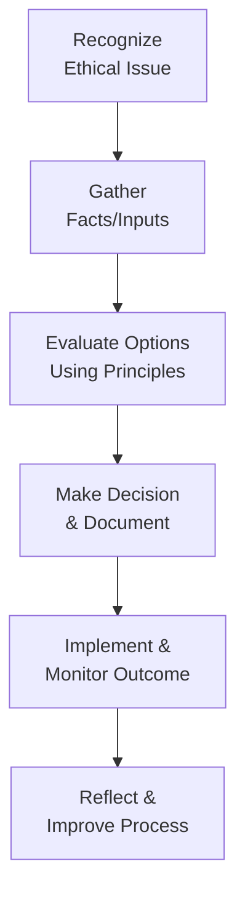

## 5.1 Stewardship and Ethical Conduct

Stewardship and ethical conduct form the cornerstone of professional project management. As outlined in the PMI Code of Ethics and Professional Conduct, these principles guide project managers to act responsibly, protect the well-being of stakeholders, and maintain integrity in decision-making. Stewardship goes beyond mere managerial tasks; it emphasizes taking ownership and accountability for resources, outcomes, and societal impact. It also involves fostering an environment where transparency, fairness, and respect become the norm. In this section, we will explore the foundational meaning of stewardship, examine the ethical and professional obligations of project managers, and provide practical guidance for navigating complex ethical dilemmas.

### Understanding Stewardship

Stewardship refers to the careful and responsible management of something entrusted to one’s care. In the context of project management, this encompasses:

• Oversight of resources (financial, human, material, and time).  
• Protection of stakeholder interests, including customers, team members, vendors, and the wider community.  
• Commitment to delivering value while upholding moral and professional standards.  

Rather than simply managing tasks, a project manager who practices stewardship upholds the well-being of all stakeholders involved. This involves making choices that benefit the organization, the project, and the larger community, even if those decisions are not the most convenient or cost-efficient in the short term.

Stewardship is also deeply linked to leadership. While both leadership and stewardship aim to guide teams toward a shared objective, stewardship places extra emphasis on responsibility and accountability. Project managers adopting stewardship behaviors see their role not just as a director of tasks but as a guardian of ethical practices, fair resource allocation, and cultural integrity.

### Key Components of Ethical Conduct

A project manager’s ethical conduct is defined by several interrelated principles:

• Integrity: Acting honestly and consistently—whether interacting with team members, stakeholders, or vendors—serves as the foundation of trust.  
• Transparency: Sharing relevant information openly, ensuring decision-making processes and outcomes can be traced and understood by everyone involved.  
• Responsibility: Accepting accountability for outcomes and behaviors, both personally and as a representative of the organization.  
• Fairness: Making decisions objectively and equitably, without bias, favoritism, or discrimination.  
• Respect: Valuing the perspectives and contributions of each team member, stakeholder, and external partner.

Successful project outcomes depend on trust. When project managers consistently demonstrate these ethical behaviors, they create an environment where people trust each other enough to share accurate information early, flag issues promptly, and negotiate conflicts rationally. This environment, in turn, promotes more effective collaboration and results.

### Real-World Ethical Dilemmas in Project Management

Ethical dilemmas can surface in multiple aspects of a project. Common scenarios include:

• Conflict of Interest: A senior stakeholder may try to steer the project in a direction that benefits them or their department at the expense of overall project success.  
• Compromised Data: Team members might discover discrepancies in a vendor’s performance reports, presenting a dilemma about whether to confront the vendor or sweep the issue under the rug for the sake of meeting an aggressive schedule.  
• Confidentiality Breaches: Sensitive financial or customer data might leak if the project manager doesn’t enforce proper data-handling protocols.  
• Scope and Cost Pressures: A sponsor may pressure the project manager to underreport costs or skip certain steps to keep the project on track, straining both professional responsibility and the organization’s ethics compliance.  

Each of these examples highlights a point where a decision must be made under competing pressures—financial, political, or personal. The project manager’s role is to balance these pressures in a manner that upholds ethical guidelines and principles of stewardship.

### Case Study: Insider Influence and Conflicts of Interest

Consider a scenario where a project manager, Carlos, is leading a software implementation for a major healthcare provider. A high-ranking board member champions a vendor that is owned by a close relative. The vendor’s proposal is expensive yet lacks a proven track record of delivering solutions at the required scale. Despite the red flags, the board member insists on favoring this particular vendor, citing intangible benefits like “faster response times” and “unique domain expertise.”

Carlos finds himself in an ethical dilemma. If he follows the board member’s recommendation, the project is placed at higher risk of failure. Yet by opposing the board member, he may jeopardize his own standing in the organization.

How does stewardship guide Carlos’s decisions here?

• Upholding Stakeholder Interests: As steward of the project, Carlos must protect the larger stakeholder group—patients, clinicians, the sponsoring organization, and the public that depends on reliable healthcare technology.  
• Ethical Accountability: He must maintain fairness in the selection process. Even though the board member has authority, Carlos must provide transparent, fact-based reasons to the selection committee, describing how each vendor scored against objective criteria.  
• Documenting and Reporting: Carlos should formally document the conflict of interest, notify the project sponsor or oversight committee, and follow established corporate governance policies to ensure the process remains unbiased.  

By following this approach, Carlos safeguards both the project—and his integrity—even if it leads to tense conversations with influential stakeholders. This type of scenario is not uncommon, and it underscores why ethical conduct is not only a moral obligation but also a practical necessity for long-term project success.

### Practical Tips to Foster Stewardship and Ethical Culture

Organizations and project managers can actively cultivate stewardship and ethical behavior. Here are strategies to implement:

• Encourage Open Communication: Provide formal and informal channels where team members can voice concerns or potential ethical issues without fear of reprisal.  
• Train Teams Regularly: Offer ongoing training on relevant ethics policies, codes of conduct, and decision-making frameworks, so ethical guidelines become second nature.  
• Establish Clear Processes: Define transparent procedures for reporting and escalating potential conflicts of interest or misconduct.  
• Leverage External Governance: In large projects, incorporate independent advisory boards or oversight committees to ensure that project managers have the support and legitimacy to address ethical concerns.  
• Measure and Reward Integrity: Rather than only celebrating speed and budget savings, recognize stewardship and ethical milestones. Encourage team members to highlight examples where ethics were upheld, particularly under challenging circumstances.

### Ethical Decision-Making Model

A helpful way to navigate ethical dilemmas is to use a structured decision-making model. While there are many variations, an easy-to-remember format is:

1. Recognize the ethical issue.  
2. Gather all relevant facts and inputs.  
3. Evaluate the alternatives using code of conduct and organizational values.  
4. Make the decision and document the rationale.  
5. Implement, monitor outcomes, and take corrective action if needed.  

Below is a Mermaid diagram illustrating a simplified flow of such an ethical decision-making model:

This model encourages a systematic approach to handling ethical questions. By following these steps, project managers can minimize emotional bias and ensure they act in alignment with both the organization’s values and PMI’s standards.

### Common Pitfalls and Mitigation Strategies

Even the most ethical project managers can fall into traps if they are not vigilant. Below are common pitfalls and ways to mitigate them:

• Ignoring Early Warning Signals: If a stakeholder repeatedly skirts protocol or requests unorthodox changes without justification, it may signal deeper ethical issues. Track such behaviors in an issue log (see Chapter 41: Reference Charts and Templates).  
• Power Imbalances: When top-level executives or high-ranking sponsors pressure the team, individuals may feel compelled to compromise ethical lines. Mitigate by clearly communicating that all ethical concerns are reported through a neutral channel, such as an ethics committee or an anonymous hotline.  
• Groupthink: Teams working under looming deadlines may be reluctant to question a dominant viewpoint, even if it feels ethically questionable. Foster a psychologically safe environment where debate over ethical concerns is expected and encouraged.  
• Overemphasis on Cost and Schedule: In many projects, metrics such as cost performance index (CPI) or schedule performance index (SPI) get all the attention, overshadowing considerations of compliance, fairness, or quality. Balance these performance indicators with explicit metrics for integrity and compliance.  
• Lack of Clarity in Governance: Without clear governance structures, the project manager might not know to whom or where potential conflicts should be escalated. Proactively define escalation paths, monthly review cycles, and accountability checkpoints.

### Stewardship in the Larger Organizational Context

Stewardship is also about aligning project-level decisions with the broader organization’s mission and values. In Chapter 28 (Aligning Projects with Organizational Strategy), we discuss how enterprise environmental factors and organizational process assets shape your approach. If the organization’s culture fosters strong ethical behaviors and invests in ethical infrastructure (e.g., regular ethics audits, well-documented compliance processes), your role as a project manager becomes more straightforward.

However, not all organizations have mature governance or compliance frameworks. In such environments, the onus falls heavily on the project manager to champion stewardship. This might involve:

• Creating mini-codes of conduct specific to the project.  
• Setting up direct communication channels between the project team and organizational leaders.  
• Engaging external subject matter experts who can provide an unbiased view of complex issues.  
• Advocating for additional training or policy development within the organization.

### Encouraging Critical Thinking and Continuous Learning

Ethical behavior is not static; it requires ongoing attention to societal, legal, and technological changes. For instance, the growing influence of data analytics and artificial intelligence in project management (see Chapter 34: Emerging Technologies in Project Management) brings new challenges such as data privacy, algorithmic bias, and responsible AI usage. By staying informed about these evolutions, you ensure that your ethical framework remains relevant and robust.

### References for Further Exploration

• Project Management Institute. (2017). PMI Code of Ethics and Professional Conduct.  
• Project Management Institute. (2021). A Guide to the Project Management Body of Knowledge (PMBOK® Guide) – Seventh Edition.  
• Treviño, L. K., & Nelson, K. A. (2017). Managing Business Ethics: Straight Talk About How To Do It Right.  
• Gray, C. F., & Larson, E. W. (2020). Project Management: The Managerial Process.  
• Ethics & Compliance Initiative (ECI): https://www.ethics.org  

---

## Strengthen Your Stewardship and Ethical Conduct Skills: Quiz on Ethical Decision-Making



### In project management, "stewardship" primarily refers to:
- [x] The responsible oversight and protection of entrusted resources.
- [ ] The exclusive focus on meeting deadlines and budget constraints.
- [ ] Transferring ownership of the project to the most senior stakeholder.
- [ ] Delegating decisions to auditors or external oversight bodies.

> **Explanation:** Stewardship emphasizes the guardian-like role of the project manager, ensuring responsible management of resources, stakeholders, and outcomes.

### Which of the following is least associated with ethical project management?
- [x] Acting in self-interest at the expense of team members.
- [ ] Making decisions that favor the well-being of all stakeholders.
- [ ] Upholding transparency and honesty in communications.
- [ ] Reporting inconsistencies or unethical behavior to the appropriate channels.

> **Explanation:** Ethical project management involves making decisions for the greater good and maintaining honesty. Acting purely in self-interest indicates a lack of ethical accountability.

### What is a potential result of an environment where ethical norms are strong and upheld by leadership?
- [x] Team members are more likely to report issues or concerns.
- [ ] Communication channels between managers and employees decline.
- [ ] Stakeholders avoid providing feedback to leadership.
- [ ] Projects consistently prioritize speed over quality.

> **Explanation:** When ethical standards are clear and enforced from the top down, individuals feel safer raising concerns, which improves transparency and project success.

### Which step in the ethical decision-making model involves checking the outcome against expected results and taking corrective actions if necessary?
- [x] Implement & Monitor Outcome.
- [ ] Recognize the Ethical Issue.
- [ ] Gather Facts/Inputs.
- [ ] Make the Decision & Document.

> **Explanation:** Monitoring and reflecting on the decision’s final impact is crucial for comprehensively managing ethical dilemmas, ensuring lessons are learned and applied.

### What is a common pitfall that can lead to unethical decisions being made by an entire project team?
- [x] Groupthink, where dissenting opinions are suppressed.
- [ ] Open dialogue and transparent decision-making.
- [x] Adoption of organizational codes of conduct.
- [ ] Frequent check-ins and audits by leadership.

> **Explanation:** Groupthink happens when team members conform to the majority viewpoint to maintain harmony, often suppressing legitimate concerns—resulting in unethical or ill-informed decisions.

### When a senior stakeholder pressures the project manager to withhold critical data in status reports for personal gain, the project manager should:
- [x] Document the request and escalate the concern through proper channels.
- [ ] Immediately comply with the stakeholder's demand.
- [ ] Refuse and resign from the project before reporting.
- [ ] Keep the data withheld to preserve the relationship with the stakeholder.

> **Explanation:** Ethical conduct requires transparency and a commitment to best practices. Project managers are expected to escalate unethical requests to the appropriate governance bodies.

### How can a project manager most effectively handle a conflict of interest involving a sponsor's preferred vendor?
- [x] Evaluate all proposals against established criteria and document the process.
- [ ] Automatically select the vendor to satisfy the sponsor.
- [x] Keep vendor selection criteria confidential to avoid disputes.
- [ ] Seek to have the vendor’s proposal ignored entirely without reason.

> **Explanation:** The best approach is to maintain transparency, use objective criteria, and carefully document the reasons for the final selection, ensuring fairness and integrity.

### Which is the best description of integrity in a project management context?
- [x] Consistently aligning one's words and actions with ethical principles and values.
- [ ] Adhering to a flexible definition of standards depending on the political context.
- [ ] Only applying ethical principles when it does not impact the project's budget.
- [ ] Exempting top leadership from compliance requirements.

> **Explanation:** Integrity involves uniform adherence to moral and professional principles, regardless of convenience or external pressures.

### What is the primary function of establishing a neutral channel for reporting unethical behavior?
- [x] To provide project team members with a safe forum to raise concerns without fear of retaliation.
- [ ] To avoid documenting issues in the main project repository.
- [ ] To reduce the quality audit scope.
- [ ] To remove accountability from the project manager.

> **Explanation:** A neutral channel encourages team members and stakeholders to come forward with ethical concerns, making it less likely that issues go unreported.

### A project manager diligently monitors the progress of all tasks, verifies compliance with regulations, and ensures proper resource allocation. This approach primarily reflects:
- [x] True
- [ ] False

> **Explanation:** Such actions illustrate core elements of stewardship, indicating responsible and ethical management of entrusted resources and project objectives.



---

## PMP Mastery: 1500+ Hard Mock Exams with Full Explanations 

Looking to crush the PMP exam with confidence? Dive deep into 6 rigorous mock exams totaling 1500+ advanced-level questions, each accompanied by clear, step-by-step explanations. Hone your test-taking strategies, master complex topics, and build the resilience you need on exam day. Perfect for serious PMs aiming beyond fundamentals.

Enroll now:  
[PMP Mastery: 1500+ Hard Mock Exams with Exceptional Clarity & Full Explanations](https://www.udemy.com/course/pmp-2025/?referralCode=CF83A54BC86BE27F9AFE)

_Disclaimer: This course is not endorsed by or affiliated with the PMI examination authority. All content is provided purely for educational and preparatory purposes._
