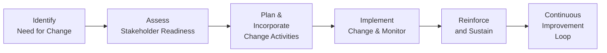

## 5.10 Enabling Organizational Change

Organizational change can be a monumental endeavor, impacting processes, people, and the very culture of the organization. According to PMI’s twelfth principle—Enabling Organizational Change—project managers play a crucial role in driving or supporting changes that extend beyond the immediate project environment. Helping organizations embrace and sustain valuable transformations requires more than technical expertise; it demands empathy, communication, influence, and strategic alignment. In this section, we will explore how project managers can foster organizational readiness, implement change strategies, address stakeholder resistance, and ensure the smooth transition of new processes or structures.

Effective change leadership is essential for any project that introduces significant alterations to business operations or systems. Whether a project’s goal is the launch of a cutting-edge software tool, a nimble agile framework, or a merger of two corporate entities, the end result requires individuals and teams to work differently than before. Understanding change management best practices—while applying project management rigor—creates a structured environment to guide people from the current state to a future improved state. Through case examples and practical tips, we will clarify what it means to enable and sustain change within a project’s life cycle and afterward.

### Understanding the Nature of Organizational Change

Organizational change can occur in many forms:

• Technological changes (e.g., new software systems, updated tools)  
• Structural or process re-engineering (e.g., reorganizing teams, altering workflows)  
• Cultural or behavioral transformations (e.g., shifting leadership styles, encouraging collaborative mindsets)  
• Strategic pivots (e.g., entering new markets, changing business models)

Regardless of the particular nature, change management research consistently points to the importance of planning for resistance, engaging stakeholders early, and aligning the change objectives with broader organizational goals. Here, the project manager becomes a crucial facilitator, linking the change initiative to strategic outcomes, clarifying roles and responsibilities, and ensuring the right level of commitment is secured from leadership.

### Key Principles of Effective Change Enablement

Several foundational principles guide effective change enablement:

• Alignment With Strategy: The change should be justified by strategic value. Tying each change initiative to business benefits (Chapter 2 discusses business value for projects) helps legitimize and sustain long-term commitment.  
• Stakeholder Engagement: Identify and involve those who will be impacted or can influence the outcome (see Chapter 7 for Stakeholder Performance Domain). Early and consistent dialogue ensures alignment of expectations and fosters buy-in.  
• Communication and Transparency: Provide updates on progress, obstacles, and successes. Open communication cultivates trust and reduces uncertainty.  
• Readiness and Training: Equip individuals with the knowledge, resources, and skills needed to effectively adopt new processes or systems.  
• Monitoring and Reinforcement: Continuously track the effectiveness of the change, proactively address lingering resistance, and celebrate milestones to maintain momentum.

### The Project Manager’s Role in Organizational Change

While many organizations have change managers or dedicated change management offices, the project manager often serves as the practical anchor point for ensuring that new processes or deliverables are accepted and utilized. Below are some key roles played by project managers in organizational change initiatives:

• Aligning Objectives: Ensure that project objectives clearly tie back to the organization’s strategic vision. Help stakeholders see the “big picture” and the business reasons behind the change.  
• Assessment of Readiness: Evaluate whether stakeholders are willing and prepared for the change. This includes gauging infrastructure readiness, cultural receptiveness, and resource availability.  
• Championing Communication: Act as a central communication hub, sharing updates, clarifying implications, and collecting feedback across the organization.  
• Coordinating Training and Support: Work with functional leads to plan training sessions, readiness workshops, and on-the-job support.  
• Managing Risks and Resistance: Identify potential sources of pushback, develop response plans, and address issues promptly through stakeholder engagement.  
• Sustaining Momentum: Beyond project closure, ensure that the newly introduced changes are embedded into organizational processes and sustained over time.

### Stages of Organizational Change

Multiple change management models exist (Kotter’s 8-step process, Lewin’s Unfreeze-Change-Refreeze model, ADKAR, etc.), but they share a common core: identifying need, preparing your stakeholders, implementing the change, and reinforcing new behaviors. Below is a simplified overview of how these stages align with project manager responsibilities:

1. **Identification of Change Needs**  
   – Engage with sponsors to understand organizational drivers.  
   – Validate alignment with strategic priorities.  

2. **Stakeholder Engagement**  
   – Identify impacted groups and key influencers.  
   – Explore each group’s readiness, concerns, and specific support needs.  

3. **Planning**  
   – Integrate change management tasks into the project plan (training, communications, resource planning).  
   – Outline success metrics and how you will measure them.  

4. **Implementation**  
   – Coordinate technical tasks with human factors (e.g., new system setup plus user training).  
   – Provide consistent communication on the “why” and “how” of the change.  
   – Monitor adoption rates, address feedback or barriers swiftly.  

5. **Reinforcement and Sustainability**  
   – Celebrate milestones, share success stories, and recognize early adopters.  
   – Incorporate continuous improvement loops to fix small issues before they become significant hurdles.  
   – Ensure changes become standard operating procedure, well-documented in official policies or best practices.

Below is a simplified flowchart illustrating how a project manager might integrate change enablement activities into the broader project life cycle:

### Assessing Stakeholder Readiness and Transition

Stakeholder readiness can be understood in terms of awareness, willingness, and capability to adopt the new processes or behaviors introduced by the project:

• Awareness: Do stakeholders know the reasons for the change, the scope of its impact, and the expected benefits?  
• Willingness: Are stakeholders motivated to accept, support, or champion the change, or are they likely to resist it?  
• Capability: Do they possess the skills, resources, and authority to carry out new responsibilities or behaviors effectively?

Project managers often collaborate with organizational leaders, human resources, or dedicated change management practitioners to conduct readiness assessments. These assessments typically involve surveys, interviews, and workshops. The information gleaned allows the project team to refine the change approach, targeting areas of high resistance or strengthening aspects that are critical for success.

### Managing Resistance

Resistance to change is a natural human response—especially when individuals feel their sense of stability or competence is at risk. Common sources of resistance include fear of job security, lack of clarity regarding expected outcomes, and misalignment with personal or departmental objectives. Strategies to mitigate resistance include:

• Clear, Frequent Communication: Respond quickly to rumors or misunderstandings; maintain multiple communication channels (reports, newsletters, town halls).  
• Early Involvement: Invite potential resisters into the planning process, giving them a sense of ownership and influence.  
• Tailored Training and Support: Help stakeholders build competence and confidence in the new methods.  
• Escalation of High-Impact Issues: If certain forms of resistance threaten project objectives, the project manager might need sponsor support or organizational policy enforcement.

### Embedding Change into the Organization

A crucial difference between a short-lived or superficial change and lasting transformation lies in your ability to embed new practices into the organization’s operational DNA. Embedding change involves:

• Process Integration: Updating procedures, templates, documentation, and job descriptions to reflect new ways of working.  
• Metrics and KPIs: Establishing relevant performance indicators to measure the sustained impact of the change.  
• Reinforcement Mechanisms: Recognizing and rewarding behaviors that align with the new order. Encouraging people to stay consistent and improve their skills.  
• Ongoing Support Structures: Establishing communities of practice (CoPs) or internal user groups that continue to bolster adoption and refine best practices.

### Common Pitfalls and Challenges

• **Overlooking Cultural Factors**: Even the best-crafted plan can falter if the organizational culture is not receptive or if the new way of working conflicts with deeply held norms.  
• **Poor Communication Strategy**: Inconsistent or unclear messaging can multiply confusion and worsen resistance, often causing schedule delays or cost overruns.  
• **Underestimating Resource Requirements**: Change management activities (e.g., training, consultations) consume time, budget, and attention. Failing to account for these can cause scope creep.  
• **Weak Sponsorship**: If leaders are not fully committed to the change, their ambivalence or shifting priorities can undermine momentum.  
• **Inadequate Follow-Through**: Declaring “project completion” without ensuring the change has been absorbed into operations is a recipe for relapse into old behaviors.

### Techniques, Tools, and Best Practices

• **Stakeholder Register**: From a project management perspective, a thorough stakeholder register ensures each individual’s or group’s influence, impact, and possible reactions are documented.  
• **Engagement Matrices**: Classify stakeholders based on their level of engagement (resistant, neutral, supportive, etc.) and develop customized strategies to move them toward support.  
• **Kotter’s 8-Step Process**: Provide structure by creating a sense of urgency, forming a guiding coalition, and anchoring the changes in the organizational culture.  
• **ADKAR Model**: Focus on the individual journey of change by building Awareness, Desire, Knowledge, Ability, and Reinforcement.  
• **Pilot Programs**: Use pilot groups to test changes on a smaller scale before rolling them out broadly. This reduces risk, gathers valuable feedback, and generates success stories.  
• **Knowledge Transfer Sessions**: Integrate knowledge management processes (see Chapter 11, “Project Work Performance Domain”) to capture lessons learned regarding the change.

### Real-World Case Study: From Waterfall to Agile

Consider an example: A mid-sized software company decided to transition from a traditional Waterfall model to Agile methodologies. Although the immediate goal was to streamline feedback loops and improve product quality, the deeper intention was to empower teams and culture.

• **Identification of Need**: Project sponsors recognized that time-to-market and user satisfaction would improve with Agile.  
• **Stakeholder Assessment**: Several veteran developers initially resisted, fearing that daily stand-ups and iteration reviews would slow them down or micromanage their work.  
• **Change Planning**: The project manager worked with an Agile coach to customize training. Leadership established a clear timeline and success metrics (reduced defects, faster releases).  
• **Implementation**: They ran pilot sprints for one product team. The project manager cultivated open communication, organizing sprint retrospectives to gather feedback on how the transition felt for the team.  
• **Reinforcement**: As the pilot team measured positive outcomes (increased collaboration, faster user feedback), the organization gradually rolled out Agile to multiple teams. Celebrating the pilot team’s achievements galvanized others. Leadership ingrained the iteration-based approach into performance evaluations and job descriptions.

Through this structured approach, the organization ultimately showcased a successful shift, with minimal disruption and high stakeholder satisfaction.

### References for Further Exploration

• PMI’s “Managing Change in Organizations” Practice Guide  
• John P. Kotter’s “Leading Change” for the 8-step change model  
• Prosci’s ADKAR Model for individual-centric change management  
• Chapter 7, “Stakeholder Performance Domain,” for details on stakeholder analysis and engagement  
• Chapter 11, “Project Work Performance Domain,” to learn more about knowledge management and lessons learned practices  

Enabling organizational change isn’t a simple, one-time task. It’s a holistic process that brings employees, leadership, and processes together for common goals. Through strategic alignment, proactive communication, and a structured approach to readiness, project managers can shepherd transitions that produce long-lasting, positive outcomes—ensuring that the future state isn’t just a vision, but an enduring reality.

---

## Test Your Knowledge: Organizational Change Readiness Quiz



### Which aspect of change enablement most directly addresses uncertainties and anxiety among project stakeholders?
- [ ] Establishing a firm project deadline
- [ ] Holding team socials
- [x] Providing transparent and continuous communication
- [ ] Focusing exclusively on technical documentation

> **Explanation:** Continuous, transparent communication assures individuals they are kept in the loop, which reduces uncertainty and anxiety about what the change entails and how it affects them.

### A project manager is assessing an organization’s preparedness to adopt a new software system. Which readiness factor is evaluated by determining if users have sufficient skills and resources for successful adoption?
- [ ] Awareness
- [ ] Willingness
- [ ] Transparency
- [x] Capability

> **Explanation:** Capability refers to whether stakeholders have the necessary knowledge, skills, and resources to successfully adopt the new system.

### Which of the following best describes a key pitfall when enabling organizational change?
- [ ] Allocating substantial training budgets
- [x] Failing to integrate change efforts into organizational culture and processes
- [ ] Holding monthly progress reviews
- [ ] Consulting senior leadership

> **Explanation:** A major pitfall is neglecting to embed the new processes and cultural shifts into daily operations. Without integration, changes often revert as soon as the project ends.

### What is one advantage of performing a pilot rollout before a full-scale implementation?
- [x] It provides early feedback in a controlled environment.
- [ ] It reduces the overall project timeline.
- [ ] It entirely eliminates stakeholder resistance.
- [ ] It guarantees no technical issues.

> **Explanation:** A pilot or test rollout identifies issues and gathers user feedback on a smaller scale, reducing risk for the broader implementation.

### When dealing with strong stakeholder resistance, which tactic is most effective to encourage a change in attitude?
- [x] Involving them in shaping the solution
- [ ] Avoiding contact unless necessary
- [x] Providing targeted training to address skill gaps
- [ ] Removing them from the project team

> **Explanation:** Engaging resistant stakeholders early and offering support are often the best tactics to turn skepticism into acceptance.

### Why is it important for project managers to champion communication during organizational change?
- [x] They serve as a central hub for information exchange and clarification.
- [ ] They must personally generate all corporate announcements.
- [ ] They can replace formal change management practitioners.
- [ ] Communication is only necessary after final deliverables are ready.

> **Explanation:** Project managers orchestrate cross-functional efforts and are uniquely positioned to consolidate, streamline, and clarify communications across various stakeholders.

### Which of the following models is specifically designed to focus on the individual journey of change adoption?
- [x] ADKAR
- [ ] Lewin’s Model
- [x] Kotter’s 8-Step
- [ ] Five Dysfunctions of a Team

> **Explanation:** The ADKAR model (Awareness, Desire, Knowledge, Ability, Reinforcement) highlights the individual’s progression through change. Kotter's 8-Step also addresses change but at a broader organizational level.

### Which action can help sustain newly implemented changes beyond project closure?
- [x] Incorporating new processes into operational procedures
- [ ] Only scheduling weekly status updates
- [ ] Eliminating formal documentation
- [ ] Shifting resources to another project immediately

> **Explanation:** By integrating and standardizing new processes within the organization’s operational documentation and guidelines, the transformation becomes part of the regular workflow.

### In addition to aligning with an organization’s strategic goals, what is a key reason to emphasize clear benefits when enabling change?
- [x] Benefits supply a compelling rationale for stakeholder buy-in.
- [ ] Benefits allow ignoring risk management.
- [ ] Benefits automatically trigger immediate adoption.
- [ ] Benefits always reduce project scheduling needs.

> **Explanation:** Demonstrating tangible reasons behind the change increases motivation, helping stakeholders understand “what’s in it for them” and paving the way for cooperation and commitment.

### Emphasizing a sense of urgency to motivate employees is strongly associated with which change management framework?
- [x] True
- [ ] False

> **Explanation:** John Kotter’s 8-Step Process for Leading Change begins with creating a sense of urgency, prompting commitment and momentum for transformations.



---

## PMP Mastery: 1500+ Hard Mock Exams with Full Explanations

Looking to crush the PMP exam with confidence? Dive deep into 6 rigorous mock exams totaling 1500+ advanced-level questions, each accompanied by clear, step-by-step explanations. Hone your test-taking strategies, master complex topics, and build the resilience you need on exam day. Perfect for serious PMs aiming beyond fundamentals.

Enroll now:  
[PMP Mastery: 1500+ Hard Mock Exams with Exceptional Clarity & Full Explanations](https://www.udemy.com/course/pmp-2025/?referralCode=CF83A54BC86BE27F9AFE)

_Disclaimer: This course is not endorsed by or affiliated with the PMI examination authority. All content is provided purely for educational and preparatory purposes._
