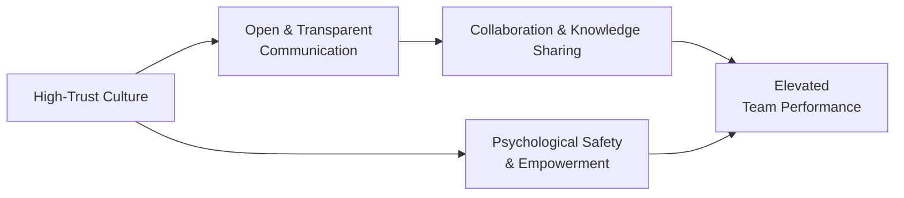

## 5.11 Fostering Team Environments

Creating a thriving team environment is critical for project success and is a core principle outlined in the PMBOK® Guide Seventh Edition. High collective performance doesn’t occur by accident; it unfolds when a project manager—supported by organizational culture—intentionally cultivates trust, openness, and a sense of shared purpose among team members. When people feel safe to contribute ideas, voice concerns, and learn from mistakes, they develop a collective ownership of the project’s outcomes. This sense of ownership bolsters commitment, motivation, and innovation—parameters essential for team excellence.

Fostering team environments is a principle that transcends the borders of traditional, agile, or hybrid delivery practices. Whether you are leading a large multinational project with cross-functional teams in a predictive setup, or a smaller, quickly iterating agile team, the human component remains consistent: it thrives on psychologically safe, empathetic, and well-structured networks of collaboration. This comprehensive guide explores essential elements that define high-trust environments and offers actionable strategies to help you foster these conditions within any project.

---

### The Significance of Fostering Team Environments

A well-articulated environment offers the conditions that enable people to do their best work. Traditionally, project managers might concentrate on scheduling, cost management, or risk analysis. However, without a supportive environment characterized by trust and psychological safety, even the most refined project methodology can falter. The reason is straightforward: people drive project outcomes. When team members feel valued, they willingly bring their best insights and go the extra mile, managing roadblocks more effectively and optimizing collaboration.

From the perspective of the PMP® exam, fostering team environments aligns with the “People Domain” but resonates across all performance domains (as described in Chapter 6 and throughout the PMBOK® Guide Seventh Edition). Competency in guiding teams and ensuring they operate harmoniously contributes substantially to project success.

---

### Psychological Safety: The Bedrock of Trust

A critical aspect of fostering team environments is psychological safety. Harvard Business School professor Amy Edmondson defines psychological safety as a shared belief that a team is safe for interpersonal risk-taking. It’s the sense that no one will be ridiculed or punished for speaking their mind, posing questions, or admitting errors.

Why is psychological safety so vital?

• It promotes open dialogue: Team members are free to ask clarifying questions, challenge assumptions, and brainstorm solutions.  
• It accelerates learning: Mistakes become opportunities for collective learning rather than fear-induced blame games.  
• It amplifies creativity: Individuals are more likely to present innovative ideas when they are not worried about negative feedback.  

When project environments are psychologically safe, performance metrics often improve because team members are not spending cognitive or emotional energy on self-preservation but rather on discovering optimal solutions and delivering value.

---

### Core Attributes of High-Trust Team Environments

High-trust environments, whether in agile or traditional contexts, tend to exhibit several common attributes:

• Mutual Respect: Team members treat each other’s perspectives, backgrounds, and expertise with dignity and openness.  
• Transparent Communication: Information flows freely, and knowledge sharing is encouraged.  
• Empowerment: Individuals have the autonomy to make decisions relevant to their roles.  
• Accountability: Everyone is both empowered and responsible for the outcomes of their decisions.  
• Constructive Conflict: Teams engage in candid, respectful debate focused on solutions and improvement, without personal attacks.  

When these attributes are integrated, they establish a foundation where each person feels that they can contribute their best.

---

### Practical Steps to Build and Sustain Trust

Building trust involves consistent actions over time. While trust-building strategies can vary across corporate cultures or project life cycles, the principles remain consistent.

#### Step 1: Set a Clear Team Charter

A team charter is an explicit agreement that highlights the team’s values, goals, responsibilities, and expectations. When everyone understands their role and how it fits into the broader context, misunderstandings diminish, and people feel more cohesive. Review and refine the team charter regularly (see Chapter 15: Integration Management for additional guidance on ensuring all management plans and charters are aligned).

#### Step 2: Model Desired Behaviors

Leaders shape team norms through their actions:

• Be transparent with information, especially on project risks or changes.  
• Show vulnerability by admitting mistakes and encouraging others to do the same.  
• Demonstrate inclusivity by actively soliciting input from all team members.  

Modeling these behaviors sets a tone that influences team interactions.

#### Step 3: Encourage Open Forums and Dialogues

Whether in daily “stand-up” meetings for agile teams (see Chapter 26: Key Agile Events and Artifacts) or in weekly status reviews for predictive environments, create safe spaces where people can share experiences, raise roadblocks, and brainstorm collectively. Use facilitation techniques like “round-robin” discussions or silent brainstorming to ensure even the quieter voices are heard.

#### Step 4: Recognize Contributions Publicly

Recognition is an essential component of any healthy environment. When a team member does something extraordinary—like resolving a complex issue, going the extra mile, or supporting others—publicly acknowledge their contribution. This fosters a culture where efforts are valued and encourages repeat of positive behaviors.

#### Step 5: Address Conflicts Constructively

Conflict isn’t inherently bad—unresolved conflict is. Encourage team members to address issues promptly using conflict resolution techniques (see Chapter 8: Team Performance Domain for deeper insights into conflict resolution and leadership styles). Using a data-driven approach and focusing on facts rather than personalities can help maintain professionalism.

---

### Developing a Sense of Community and Belonging

A robust team environment isn’t solely about work outcomes; it’s also about building community. People who feel a sense of belonging are more likely to stay engaged and put in discretionary effort for the project’s success.

• Celebrate achievements, both big and small.  
• Host team-building events that encourage social interaction outside formal tasks.  
• Share personal stories or fun facts in icebreaker sessions, especially in virtual setups.  

These seemingly small gestures create camaraderie and strengthen interpersonal relationships.

---

### Leveraging Diversity and Inclusion

Teams are increasingly diverse—spanning different cultures, age groups, and functional backgrounds. Inclusive team environments acknowledge the richness that diversity brings. Recognizing and valuing differences fosters greater creativity and more robust decision-making.

• Rotate leadership roles in smaller sub-teams, empowering different individuals to lead.  
• In global or distributed teams, be mindful of time zones and communication preferences.  
• Establish norms where individuals with different viewpoints are encouraged to articulate their thoughts.

When managed properly, diversity becomes a project’s asset, offering varied perspectives that challenge the status quo and spark innovation.

---

### Empowerment and Delegation

Empowerment in a project management context means giving team members the authority, resources, and autonomy to carry out tasks effectively. It is tantamount to trusting the capabilities of individuals.

• Delegate tasks in line with individual skill sets and interests.  
• Allow freedom in decision-making where possible, to foster ownership.  
• Provide constructive feedback loops, ensuring mistakes become learning opportunities.  

Empowerment doesn’t imply an absence of oversight; the project manager should still monitor performance and provide course corrections. However, the primary message is that each team member’s expertise and judgment are central to achieving project objectives.

---

### Strengthening Motivation Through Intrinsic and Extrinsic Factors

Motivation within a team environment arises from both intrinsic and extrinsic factors. Although financial rewards, bonuses, or public praise (extrinsic motivators) can spark short-term boosts in effort, sustainable performance often hinges on intrinsic factors, such as:

• Purpose: Linking daily tasks to a broader project mission.  
• Autonomy: Allowing individuals to navigate their own methods and solutions.  
• Mastery: Facilitating continuous learning to develop new skills.  
• Impact: Showing how each contribution benefits end users, the organization, or wider stakeholders.  

Project managers who acknowledge these deeper motivations can align roles and responsibilities to nurture personal growth, fueling more durable passion and commitment.

---

### Creating a Feedback Culture

Regular, constructive feedback is a pillar of healthy project environments. As the project landscape evolves, standing still is rarely an option. Teams need to identify, discuss, and resolve issues or skill gaps continuously. A robust feedback culture includes:

• Frequent One-on-Ones: Scheduled check-ins between project managers or team leaders and each team member to discuss progress, barriers, and development goals.  
• Peer Review Mechanisms: Code reviews in software projects or design critiques in product development that sharpen skills and ensure high quality.  
• Retrospectives and Lessons Learned: Systematic reflections (especially common in agile sprints) that dissect successes and stumbling blocks to inform future iterations.  

An environment where feedback is delivered and received in a solution-oriented way empowers constant improvement and fosters a spirit of collaboration.

---

### Addressing Remote and Virtual Team Dynamics

The rise of distributed teams makes fostering a high-trust environment more challenging. Remote communication can sometimes limit nonverbal cues or make it difficult to gauge emotional tone. As discussed in Chapter 8: Team Performance Domain, virtual setups necessitate additional attention to:

• Technology Adoption: Use reliable collaboration platforms, instant messaging systems, and cloud-based document repositories for sharing project artifacts.  
• Time Zone Considerations: Rotate meeting times to accommodate different regions fairly.  
• Cultural Sensitivity: Understand local customs, communication styles, and work habits to prevent misunderstandings.  

When well-structured and empathetically managed, virtual environments can still achieve the same levels of openness and synergy as co-located teams.

---

### The Role of Leadership Styles in Nurturing Team Environments

Project managers often adopt multiple leadership styles (transformational, servant leadership, situational, etc.) depending on the project’s needs. However, certain leadership traits are universally beneficial in creating thriving team climates:

• Active Listening: Leaders genuinely hear team members’ perspectives without jumping to immediate solutions or judgments.  
• Emotional Intelligence (EQ): Self-awareness and empathy help detect unspoken issues.  
• Servant Leadership: The manager’s goal is to enable team members to excel by removing impediments, offering support, and facilitating personal growth.  

These leadership behaviors align well with agile and human-centered approaches, but they are equally relevant in more predictable project frameworks that rely on hierarchical structures.

---

### Using Diagrams to Visualize Team Environment Dynamics

Visual representations can be powerful in illuminating the intangible qualities of team environments. The following Mermaid diagram outlines the synergy between trust, communication, and performance in fostering effective team environments:

Explanation of the Diagram:  
• High-Trust Culture is at the start of the cycle, enabling open and transparent communication.  
• Communication becomes a conduit for collaboration and knowledge sharing.  
• Collaboration and knowledge sharing then feed into elevated team performance.  
• Parallel to communication, psychological safety and empowerment also contribute profoundly to team performance.

This holistic structure underlines how multiple elements interplay to create an environment that drives high performance.

---

### Case Study: A Global Software Development Team

Consider a global software development project across three continents. The company had historically struggled with integrating updates from different time zones. Stakeholders frequently missed deadlines due to inadequate communication, and tensions persisted over accountability. To address these issues:

• The project manager organized a virtual kickoff that emphasized trust, clarified roles, and established a “no blame” culture.  
• The team created a digital team charter highlighting communication protocols (e.g., Slack for immediate queries, weekly Zoom calls for synchronous discussion, Confluence for documentation).  
• Pair programming sessions were introduced, pairing senior developers from one region with junior developers from another. This enhanced skill transfer, built rapport, and drastically reduced defect rates.  
• During a monthly retrospective, the team discussed not just process updates but also issues around time-zone overlaps. They jointly decided on rotating shift alignments to distribute inconvenience equally.  

Over six months, performance metrics improved across the board: code review times dropped by 30%, bug counts decreased by 20%, and overall predictability of sprints improved. This transformation highlighted that fostering an environment of trust and open dialogue can unify even geographically separated teams toward a common objective.

---

### Common Pitfalls and How to Avoid Them

Despite best intentions, certain obstacles can derail efforts to cultivate healthy team environments:

• Lip Service to Trust: Saying you trust the team but micromanaging tasks.  
• Using Feedback as a Weapon: Criticizing mistakes without offering solutions or support.  
• Overemphasis on Positive Thinking: Dismissing legitimate concerns with phrases like “just be positive,” which invalidates employees’ real challenges.  
• One-Way Communication: Managers repeatedly broadcasting updates without inviting meaningful input from the team.  

Overcoming these pitfalls requires consistent self-awareness by the project manager and genuine commitment to address problems as they surface.

---

### Measuring Team Environment Success

Though “team environment” might sound intangible, there are practical ways to assess its health:

• Turnover/Attrition Rates: High turnover can be a signal of deeper workplace issues.  
• Employee Engagement Surveys: Anonymous surveys can reveal levels of trust, satisfaction, and psychological safety.  
• Productivity Metrics: These could be task completion rates, velocity in agile sprints, or defect rates.  
• Peer Feedback Scores: Tools that let teams rate collaboration quality or sense of mutual support.  

Regular monitoring of these indicators ensures you can take swift action to pivot your leadership style or project approach if team morale starts to dip.

---

### Continual Improvement and Ongoing Learning

Fostering a healthy team environment isn’t a one-time initiative. It’s a dynamic process calling for continuous adaptation to evolving project requirements and interpersonal dynamics. Regular retrospectives, lessons learned sessions, and team get-togethers provide opportunities to identify blind spots, celebrate achievements, and initiate improvements.

Make sure you budget time and resources for professional development, leadership training, or skill-building workshops. As the PMBOK® Guide Seventh Edition emphasizes, tailoring is key—adapt best practices to your specific project context and team composition. Keep refining, keep iterating.

---

### References for Further Exploration

• Edmondson, Amy C. (2019). “The Fearless Organization: Creating Psychological Safety in the Workplace for Learning, Innovation, and Growth.”  
• Lencioni, Patrick (2002). “The Five Dysfunctions of a Team: A Leadership Fable.”  
• Schein, Edgar H. (2016). “Organizational Culture and Leadership.”  
• “Pulse of the Profession®” by PMI – Offers insights into team performance metrics and success factors.  
• PMI’s “Agile Practice Guide” – Provides frameworks on how to maintain team cohesion in agile and hybrid environments.  

These resources build deeper awareness of how to optimize your team’s environment for project success, bridging theory with actionable strategies.

---

## Test Your Knowledge: High-Trust Team Environments



### Which of the following statements best describes the concept of psychological safety in a team environment?

- [ ] It emphasizes strict adherence to rules and procedures.  
- [x] It allows team members to express concerns or errors without fear of retribution.  
- [ ] It limits open feedback to senior leadership only.  
- [ ] It forces teams to avoid any form of conflict or disagreement.  

> **Explanation:** Psychological safety encourages open, honest communication where employees can voice concerns, admit mistakes, and share ideas without fear of negative consequences.

### Which approach can best foster an inclusive environment in multicultural teams?

- [ ] Holding all project meetings at a time convenient to senior management only.  
- [x] Rotating meeting times to accommodate participants from multiple time zones.  
- [ ] Insisting all communications occur solely in one region’s native language.  
- [ ] Awarding performance bonuses for the largest geographical sub-team.  

> **Explanation:** Inclusivity involves respecting different cultures and schedules. Rotating meeting times ensures fairness and helps everyone feel valued.

### How does public recognition of achievements impact team environments?

- [x] It reinforces positive behavior and encourages continued contributions.  
- [ ] It leads to cliques and favoritism.  
- [ ] It discourages risk-taking within the team.  
- [ ] It fosters a competitive atmosphere at the expense of collaboration.  

> **Explanation:** Public recognition validates hard work and motivates other team members to replicate desired behaviors, enhancing collective morale.

### What is a key characteristic of a high-trust environment?

- [x] Transparent dissemination of project information and risks.  
- [ ] Only the project manager is accountable for outcomes.  
- [ ] Strict limitations on team communication to reduce distractions.  
- [ ] Teams avoid addressing issues or conflicts directly.  

> **Explanation:** Trust flourishes when information is communicated openly and reflects a shared sense of accountability, fostering collaboration and proactive problem-solving.

### Which of the following is recommended to build a strong feedback culture?

- [x] Schedule regular and structured one-on-one check-ins for open dialogue.  
- [ ] Provide feedback only at project closeout to avoid distractions.  
- [x] Use retrospectives to identify root causes and improvements continuously.  
- [ ] Reprimand team members publicly when they fail to meet expectations.  

> **Explanation:** Ongoing, structured feedback and retrospectives promote learning and help the team adapt to changing project demands. Public reprimand typically leads to fear rather than improvement.

### Which of the following leadership traits directly helps foster a positive team environment?

- [x] Emotional intelligence and active listening.  
- [ ] Constantly micromanaging all deliverables.  
- [ ] Avoiding tough conversations about performance.  
- [ ] Encouraging competition between team members.  

> **Explanation:** Emotional intelligence and active listening help leaders understand team concerns, guide conflict resolution, and build stronger interpersonal connections.

### Which action supports mutual respect in a team?

- [x] Soliciting input and staying open to different perspectives from all roles.  
- [ ] Giving tasks only to high performers.  
- [x] Establishing norms that discourage personal attacks.  
- [ ] Prioritizing management convenience over team well-being.  

> **Explanation:** Mutual respect flourishes when everyone’s viewpoints are heard, validated, and integrated, and personal attacks or favoritism are not tolerated.

### What is the primary purpose of a team charter in fostering team environments?

- [x] It clarifies roles, expectations, and team values.  
- [ ] It replaces the need for a project management plan.  
- [ ] It determines which project management methodology must be used.  
- [ ] It is used exclusively for budgeting discussions.  

> **Explanation:** A team charter outlines shared goals, values, responsibilities, and processes, ensuring alignment and reducing misunderstandings about individual and collective roles.

### How can conflict be leveraged constructively in team settings?

- [x] By focusing discussions on facts and solutions rather than personal attacks.  
- [ ] By avoiding discussion of conflict altogether to maintain harmony.  
- [ ] By assigning blame to individuals and making examples of them.  
- [ ] By using conflict as a reason to dissolve the team.  

> **Explanation:** Conflict can be a catalyst for new ideas and improved processes when handled constructively, focusing on problem-solving, not on personal blame.

### Building a psychologically safe environment for remote or virtual teams involves:

- [x] Using reliable technology and creating structured opportunities for connection.  
- [ ] Ensuring only face-to-face meetings occur.  
- [ ] Limiting communication to brief emails to avoid confusion.  
- [ ] Expecting global teams to attend all meetings during a single time zone.  

> **Explanation:** Virtual teams thrive when supported by robust technology, clear communication strategies, and empathy for different cultural and time-zone constraints.



---

## PMP Mastery: 1500+ Hard Mock Exams with Full Explanations 

Looking to crush the PMP exam with confidence? Dive deep into 6 rigorous mock exams totaling 1500+ advanced-level questions, each accompanied by clear, step-by-step explanations. Hone your test-taking strategies, master complex topics, and build the resilience you need on exam day. Perfect for serious PMs aiming beyond fundamentals.

Enroll now:  
[PMP Mastery: 1500+ Hard Mock Exams with Exceptional Clarity & Full Explanations](https://www.udemy.com/course/pmp-2025/?referralCode=CF83A54BC86BE27F9AFE)

_Disclaimer: This course is not endorsed by or affiliated with the PMI examination authority. All content is provided purely for educational and preparatory purposes._
