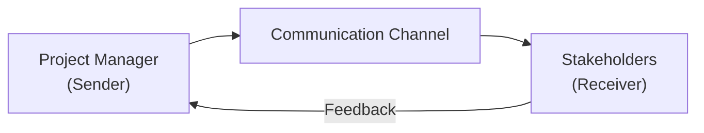

## 5.12 Effective Communication and Stakeholder Alignment

Effective communication acts as the conduit that connects project teams, stakeholders, and organizational objectives. Without well-defined and well-executed communication channels, even the most technically proficient projects can struggle with misaligned expectations, scope creep, and unresolved conflicts. In the context of PMI’s 12 Project Management Principles, the principle of Effective Communication and Stakeholder Alignment underlines the necessity of tailoring communication strategies to each stakeholder group, ensuring that everyone remains engaged, informed, and committed to achieving the project’s goals.

This chapter dives deep into the modes, methods, and frameworks that help project managers build and maintain strong relationships with stakeholders—from executive sponsors to end users. It explores best practices for collaborating effectively, avoiding common pitfalls, and leveraging the right communication channels at the right time.

### The Foundations of Effective Communication in Project Management

In project management, communication is more than a routine update or a meeting agenda. It is a carefully crafted process that fosters shared understanding, facilitates collaboration, and drives decisions toward project success. Communication is two-way, involving both transmitting information and receiving feedback. When done effectively, it aligns everyone’s perspective, prevents misunderstandings, and builds trust.

Key aspects of foundational communication include:
- Consistency: Deliver messages in a predictable rhythm adapted to the project’s lifecycle, meeting stakeholder expectations for when and how they receive information.
- Clarity: Use precise language to target your audience without overcomplicating the message. Avoid jargon that can confuse or alienate non-technical stakeholders.
- Transparency: Offer visibility into project challenges, accomplishments, and changes. Transparent communication promotes credibility and accountability.
- Active Listening: Encourage stakeholders and team members to speak openly and share real concerns. Actively listening improves team morale and fosters creative problem solving.

### Aligning Communication with Project Objectives

Stakeholder alignment hinges on how well communication is mapped to project objectives. Each update, briefing, or conversation should be framed in a way that connects back to why the project exists and what success looks like. When team members and stakeholders understand why their contributions matter and how everything fits into the broader organizational strategy, they become more motivated and supportive.

Bringing alignment to life requires:
- Highlighting the “why” behind project decisions. For example, linking a schedule adjustment to the organization’s strategic need to enter a new market quickly helps garner stakeholder buy-in.  
- Sharing context about the project’s milestones, dependencies, and constraints. This perspective keeps stakeholder focus on delivering value while navigating known obstacles.  
- Reinforcing the project’s value proposition at every stage. Whether you are in a predictive, agile, or hybrid approach, emphasizing benefits and outcomes keeps communication relevant and motivated.

### Understanding Stakeholder Engagement

Different stakeholders have diverse goals, interests, cultural backgrounds, and engagement levels. Achieving true alignment calls for understanding each stakeholder’s perspective, their sphere of influence, and their communication preferences. (See also Stakeholder Performance Domain in Chapter 7 and comprehensive Stakeholder Management practices in Chapter 16.)

1. Stakeholder Identification:  
   Identify and categorize stakeholders (executive sponsors, project team members, end users, customers, vendors, regulatory bodies, etc.).  

2. Stakeholder Analysis:  
   Determine each stakeholder’s interest, influence, and potential impact on the project. Evaluate the level of engagement needed: supportive, neutral, or leading.  

3. Personalized Engagement Strategies:  
   Develop a communication approach suited to each stakeholder’s needs. Executive sponsors often prefer high-level dashboards or big-picture briefs, while end users might need hands-on training or frequent short updates.  

4. Ongoing Monitoring and Adapting:  
   Recognize that stakeholder priorities and attitudes can shift over time. Continuously re-evaluate and adjust communication tactics to keep them aligned with stakeholder sentiment and project conditions.

### Communication Channels, Modes, and Methods

Communication channels refer to the platforms, technologies, or mediums through which information is transmitted. Some common channels include:

- Face-to-face meetings (on-site or virtual)  
- Email, newsletters, or discussion boards  
- Instant messaging platforms (e.g., Slack, Microsoft Teams)  
- Project management software (e.g., Trello, Jira, MS Project)  
- Formal presentations, dashboards, or online reports  
- Video conferences or webinars  

Selecting the best channel depends on project complexity, stakeholder location, and cultural norms. In agile settings, short daily standups provide frequent communication, while in large predictive projects, weekly or monthly status meetings might suffice.

#### Formal vs. Informal Communication 
- Formal Communication: Often documented and follows structured protocols, especially around reporting to executives or regulatory authorities. Tools typically include official reports, compliance forms, or procurement documents.  
- Informal Communication: Involves spontaneous or unplanned discussions. Although not always documented, these informal chats can yield invaluable insights about stakeholder perceptions, team dynamics, or emerging risks.  

Bridging formal and informal communication builds a cohesive project environment. While official channels provide necessary oversight and accountability, informal dialogue helps maintain real-time awareness and fosters trust.

### The Communication Model in a Project Context

To visualize how information flows between a sender (e.g., the project manager) and a receiver (e.g., sponsor, team member, or external stakeholder), one can refer to a simplified model rooted in the classic Shannon–Weaver communication model. Below is a basic representation tailored for project management environments:

In the sequence above:
- The sender encodes the idea or message.  
- The message travels through a chosen communication channel.  
- The receiver decodes and interprets the message.  
- The receiver provides feedback, which confirms understanding or requests clarification.  

### Active Listening and Feedback Loops

Active listening amplifies the clarity of communication. It is an approach where the listener focuses fully on the speaker, processes the information, and clarifies any ambiguity. This practice fosters trust, ensures mutual understanding, and mitigates risks of misinterpretation.

Consider these tips for active listening:
- Maintain eye contact (for in-person or video calls) and use open body language.  
- Ask clarifying questions and paraphrase the speaker’s points.  
- Avoid interrupting and give the speaker time to articulate their ideas.  
- Summarize or restate agreed-upon next steps or actions.

Integrating feedback loops into your communication plan ensures that each stakeholder has opportunities to respond, challenge assumptions, and propose new ideas. Particularly in agile or iterative environments, short, frequent feedback loops keep the project adaptive and aligned with customer needs.

### Communication Planning for Stakeholder Alignment

A well-thought-out communication plan is essential to ensure messages reach the right audience, with the right level of detail, at the right time. A communication plan typically addresses:

- Purpose: Why is this communication needed?  
- Audience: Which stakeholders need the information?  
- Content: What specific data or narratives must be delivered?  
- Timing/Frequency: How often should updates be shared, and on what schedule?  
- Channel: Which medium is most suitable—email, phone, dashboard, meeting, or a combination?  
- Owner/Sender: Who is responsible for preparing and delivering this communication?  

This structured planning aligns the entire project team around consistent messaging. It is highly recommended to store the communication plan in a project repository (e.g., SharePoint, Confluence, project management tool) for easy access and revision as the project unfolds.

Sample Communication Plan Table:

| Communication Type | Audience            | Frequency         | Channel/Medium | Key Content/Objective                                 | Owner         |
|--------------------|---------------------|-------------------|----------------|--------------------------------------------------------|--------------|
| Status Report      | Sponsor, Executives| Weekly            | Email, Dashboard| Milestones, issues, risks, upcoming approvals         | Project Manager|
| Standup Meeting    | Core Project Team   | Daily (15 min)    | Virtual Call    | Progress updates, blockers, daily tasks               | Scrum Master  |
| Project Review     | All Stakeholders    | Monthly           | Formal Meeting  | Progress on deliverables, high-level changes, finances | Project Manager|
| Product Demo       | End Users, SMEs     | Every 2 weeks     | Video Conference| Review new features, collect feedback, adjust backlog | Product Owner |

### Tailoring Communication in Different Project Environments

Different project delivery approaches impose unique communication challenges:

- Predictive (Waterfall) Environments: Communication might lean toward structured, scheduled updates (e.g., milestone-based). Gate reviews, formal sign-offs, and progress reports are key.  
- Agile Environments: Emphasis is on just-in-time communication. Frequent standups, retrospectives, and sprint reviews create a continuous information flow. Feedback loops are particularly short and iterative.  
- Hybrid Environments: Communication blends scheduled formal reviews with agile ceremonies. The project manager must ensure that the entire team and relevant stakeholders understand which communication events follow the predictive logic (e.g., monthly steering committee) versus the agile logic (e.g., daily scrums, backlog refinement).

Adapt your strategies based on the evolving project context, stakeholder feedback, and organizational norms.

### Strategies for Building Trust and Resolving Conflicts

Effective communication goes hand-in-hand with conflict resolution. Misalignment often stems from misunderstandings or unspoken concerns, so early and clear communication is the first step toward conflict prevention.

1. Encourage Open Dialogue:  
   Foster an environment where stakeholders and team members can express their viewpoints freely. This openness reduces tension and surfaces issues before they escalate.

2. Address Issues Early:  
   Quickly engage the relevant parties when conflicts arise. Delaying discussions or avoiding them often compounds negativity and misalignment.

3. Focus on Interests, Not Positions:  
   Dig deeper into the underlying interests that drive each stakeholder’s stance. Searching for mutual gains leads to more sustainable resolutions.

4. Use Neutral Facilitation:  
   For high-stakes conflicts, consider bringing in a neutral party (e.g., a senior manager not directly associated with the project) to mediate and ensure fairness.

5. Document Agreements:  
   Summaries of conflict resolutions and resulting decisions help prevent re-litigation of issues later. Recognize any unresolved concerns as open action items and keep them visible in project documentation.

### Building a Culture of Collaborative Communication

To embed stakeholder alignment into the project’s DNA, emphasize collaborative communication as an ongoing cultural attribute rather than a one-time directive.

- Celebrate Successes Publicly: Acknowledge stakeholder contributions and team achievements. Public recognition boosts morale, fosters continued engagement, and shows appreciation for diverse perspectives.  
- Encourage Cross-Functional Feedback: Invite comments from all relevant groups—even those outside the direct project team—to prevent groupthink and ensure you account for different viewpoints.  
- Leverage Visual Tools: Charts, diagrams, infographics, and prototypes convey complex information more effectively than text-heavy reports. Tools like Gantt charts, Kanban boards, or mind maps can reduce ambiguity, especially for visual learners.  
- Champion Inclusivity: Ensure communication styles, languages, and mediums suit global or remote teams. Respect cultural nuances, time zone differences, and varied communication styles.

A strong communication culture serves as the bedrock for robust stakeholder relationships, frequent innovation, and smoother decision-making processes.

### Real-World Example: Multi-Site Software Deployment

Imagine a project manager overseeing a global software deployment across multiple departments in different countries. Key stakeholders include regional managers, IT support staff, end users, vendors supplying specialized modules, and the central executive team overseeing budget and strategic alignment.

- The project manager develops a tailored communication plan outlining weekly status calls for IT teams, monthly executive dashboards summarizing budget usage, and weekly internal newsletters for end users describing upcoming features.  
- Face-to-face (virtual) calls supplement weekly emails, ensuring intangible cues—such as team morale—are considered.  
- A shared collaboration platform (e.g., Microsoft Teams or Slack) fosters continuous informal communication, letting the global team troubleshoot issues in real time.  
- Culture-specific training sessions are arranged to address local norms and user sophistication with new technologies.

By consistently aligning communication artifacts (status dashboards, executive briefs, newsletters, and daily chat pings) with each group’s needs, the project manager secures buy-in, addresses concerns swiftly, and unites the entire organization behind smoother software implementation.

### Common Pitfalls and How to Avoid Them

1. Information Overload:  
   Oversharing excessively detailed data can overwhelm stakeholders, causing them to tune out. Tailor the depth of content to each stakeholder’s role and expertise.

2. Lack of Feedback Mechanisms:  
   One-way communication without feedback loops fosters misunderstandings or slow responses to emergent issues. Encourage questions and provide explicit channels for feedback.

3. Inconsistent Messaging:  
   Mixing statuses, changes, or directions that conflict with earlier communications erodes credibility. Designate a single source of truth, such as a centralized project repository or official channel.

4. Cultural Barriers and Assumptions:  
   Failing to adapt communication to cultural, linguistic, or generational differences can create distance between team members. Request feedback and confirm comprehension to avoid confusion based on stereotypes or assumptions.

5. Failure to Update Communication Plan:  
   A static communication plan that ignores changing project conditions causes misalignment. Schedule periodic reviews of the plan and incorporate feedback from new or evolving stakeholders.

### Continuing Your Learning

Effective communication and stakeholder alignment is not only central to PMI’s 12 Project Management Principles but also a recurring theme across various chapters of this guide. For deeper explorations:  
- Refer to “Stakeholder Performance Domain” in Chapter 7 for managing stakeholder engagement strategies.  
- Check Chapter 16 for further strategies and templates on Communications Management.  
- See Chapter 8 for insights into building high-performing teams through collaborative communication.  
- Review Chapter 11 for techniques on documenting lessons learned and knowledge transfer—critical to ensuring alignment and continuous improvement.

Additionally, you can explore external resources such as:
- PMI’s “Communication Management” resources on PMIstandards+  
- Books like “Crucial Conversations” by Patterson et al. for deep dives into conflict resolution  
- Online courses focusing on cross-cultural communication and negotiation techniques  

This multi-faceted approach will refine your abilities to adapt and thrive in diverse project environments, ultimately boosting your capacity to deliver successful outcomes.

## Quiz: Elevate Your Communication and Stakeholder Alignment Skills



### Which of the following best describes transparency in project communication?

- [x] Sharing challenges, accomplishments, and project risks openly with stakeholders
- [ ] Limiting access to information to reduce complexity
- [ ] Maintaining an optimistic front despite encountering setbacks
- [ ] Routing progress updates only through the executive sponsor

> **Explanation:** Transparency assumes all relevant information—both positive and negative—is shared. When stakeholders have a clear view of project realities, trust and accountability increase significantly.

### Which approach is typically associated with short, frequent feedback loops for continuous alignment?

- [x] Agile delivery
- [ ] Predictive approach
- [ ] Hybrid approach
- [ ] Solely external vendor-led approach

> **Explanation:** Agile frameworks emphasize iterative delivery and rapid feedback loops (e.g., through sprints, standups, and retrospectives), making them highly adaptable to changes and new insights.

### What is a key benefit of using a communication plan?

- [x] It clarifies who needs which information, when they need it, and how it will be delivered
- [ ] It eliminates the need for face-to-face communication
- [ ] It replaces the Project Management Plan
- [ ] It reduces the number of project stakeholders

> **Explanation:** A communication plan outlines the specifics of stakeholder communication, ensuring consistency and preventing misalignment. It doesn’t replace in-person interactions or supersede other planning documents.

### How can active listening improve stakeholder relationships?

- [x] It fosters trust, clarifies misunderstandings, and encourages open dialogue
- [ ] It eliminates the need for formal documentation
- [ ] It replaces mandatory regulatory meetings
- [ ] It always leads to immediate agreement among all parties

> **Explanation:** When project managers and team members practice active listening, stakeholders feel heard and respected, improving overall collaboration and alignment. However, formal documentation and regulatory meetings remain necessary in many contexts.

### Why is it important to tailor communication methods to different stakeholder groups?

- [x] Different groups have varying information needs, levels of technical understanding, and engagement preferences
- [ ] It makes the project manager’s job easier by reducing content creation
- [x] It ensures both executive leadership and end users receive information in a relevant format
- [ ] It reduces the number of required status meetings

> **Explanation:** Tailoring communication is critical to ensure every stakeholder receives the right level of detail, timing, and context. Executives often prefer summarized reports, whereas end users may need specific functional updates or training.

### Which of the following is a sign of information overload in project updates?

- [x] Stakeholders begin to skip or ignore meeting invites and reports
- [ ] Stakeholders ask for more detailed documentation
- [ ] Project timeline shortens due to increased efficiency
- [ ] The frequency of executive reviews increases

> **Explanation:** Information overload often manifests in stakeholder disengagement, resulting in missed emails, ignored reports, or lack of attendance at meetings.

### Which of the following helps minimize cultural barriers in global project teams?

- [x] Providing communications in local languages or highly visual formats
- [ ] Using one universal language without visual aids
- [x] Scheduling meeting times that consider multiple time zones
- [ ] Relying on informal ‘watercooler talk’ only

> **Explanation:** Adapting language, meeting times, and communication formats helps respect stakeholder differences and reduces misunderstandings in geographically distributed or culturally diverse teams.

### What is the advantage of integrating both formal and informal communication?

- [x] It balances official documentation with real-time, free-flowing feedback
- [ ] It eliminates the need for a formal communication plan
- [ ] It discourages team members from socializing outside work
- [ ] It ensures that all communication is done in writing

> **Explanation:** Combining formal channels for accountability and structure with informal ones for spontaneous discussion ensures a healthy flow of information both vertically and horizontally.

### Which of the following is NOT a recommended practice for conflict resolution in communication?

- [x] Avoid bringing a third-party mediator to maintain project autonomy at all costs
- [ ] Document key agreements and next steps
- [ ] Encourage open dialogue and transparency
- [ ] Focus on understanding underlying interests rather than positions

> **Explanation:** In high-tension situations, using a neutral third-party mediator can be highly effective. Avoiding mediation at all costs can leave conflicts unresolved and heighten risks to project success.

### Communication in agile environments typically involves:

- [x] True
- [ ] False

> **Explanation:** Agile environments emphasize frequent, iterative communication events like daily standups, sprint reviews, and retrospectives, keeping the project team and stakeholders aligned.



## PMP Mastery: 1500+ Hard Mock Exams with Full Explanations 

Looking to crush the PMP exam with confidence? Dive deep into 6 rigorous mock exams totaling 1500+ advanced-level questions, each accompanied by clear, step-by-step explanations. Hone your test-taking strategies, master complex topics, and build the resilience you need on exam day. Perfect for serious PMs aiming beyond fundamentals.

Enroll now:  
[PMP Mastery: 1500+ Hard Mock Exams with Exceptional Clarity & Full Explanations](https://www.udemy.com/course/pmp-2025/?referralCode=CF83A54BC86BE27F9AFE)

_Disclaimer: This course is not endorsed by or affiliated with the PMI examination authority. All content is provided purely for educational and preparatory purposes._
