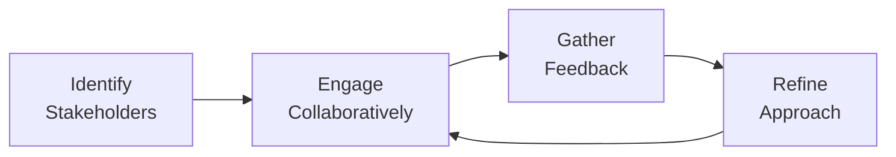

## 5.2 Collaboration and Stakeholder Engagement

Effective collaboration and stakeholder engagement lie at the heart of successful project management. Regardless of whether a project follows predictive, agile, or hybrid approaches, consistently creating and maintaining open communication channels with stakeholders is fundamental for ensuring alignment with business goals, managing project constraints, and securing project buy-in. This section explores the core principles of collaboration, explains why stakeholder engagement is integral to project success, and provides a host of tools and methods to cultivate robust stakeholder relationships.

  
### Understanding the Essence of Collaboration

Collaboration involves coming together to fulfill a shared vision, where every participant’s perspective and contribution enhances the outcome. In a project environment, collaboration transcends mere cooperation. It means that all project team members and stakeholders work in synergy, willingly exchanging information, helping one another overcome obstacles, and brainstorming creative solutions for the project’s challenges.

• Collaborative Mindset: A collaborative mindset welcomes diverse viewpoints and promotes dialogue. It places trust and respect at the forefront, ensuring that project efforts benefit from multiple inputs while fostering ownership.

• Shared Responsibility: Collaboration involves distributing responsibilities wisely based on expertise, availability, and stakeholder expectations. Everyone on the project team, from senior leadership to frontline contributors, should feel responsible for both the project’s successes and shortcomings.

• Transparency: Genuine collaboration demands transparency in communication, decision-making, and problem-solving. When team members and stakeholders understand the “why” behind decisions, they engage more deeply with the process.

Collaboration isn’t simply a feel-good concept but a dynamic driver of stronger project outputs. By consistently prioritizing inclusion, openness, and honesty, project managers can establish an environment where ideas flow, conflicts are mitigated empathetically, and everyone can see how they individually contribute to a shared success story.

  
### Defining Stakeholder Engagement

Stakeholder engagement is the process through which a project’s leaders and participants involve relevant parties—individuals, groups, or organizations—in critical decisions and day-to-day tasks that influence project outcomes. Stakeholders include sponsors, team members, customers, end-users, regulatory bodies, vendors, and any other parties who might influence or be affected by the project.

The Project Management Institute (PMI) highlights stakeholder engagement as one of the most vital aspects of a project manager’s role. Effective stakeholder engagement ensures the project aligns with the overall organizational strategy, addresses stakeholder needs, and builds trust that ultimately leads to smoother execution and beneficial outcomes. 

Key elements of stakeholder engagement include:
- Identifying and analyzing stakeholders.  
- Prioritizing them according to power, interest, urgency, or other relevant factors.  
- Understanding their expectations and motivations.  
- Involving them in decision-making processes appropriately.  
- Continuously monitoring and adjusting engagement strategies to match the project’s evolving reality.

  
### The Interplay Between Collaboration and Stakeholder Engagement

Collaboration and stakeholder engagement often function hand-in-hand. Collaboration promotes an inclusive work culture, and such an environment naturally fosters open communication with stakeholders. Conversely, ongoing stakeholder engagement feeds back into collaboration by providing the project team with timely feedback, clarifications, and course corrections.

Below is a conceptual flowchart illustrating how collaboration and stakeholder engagement evolve through a typical project:

Explanation of Diagram:
- A["Identify  Stakeholders"]: The project manager begins by identifying all key players.  
- B["Engage  Collaboratively"]: Collaboration starts when the project team and stakeholders exchange ideas, goals, and concerns.  
- C["Gather  Feedback"]: Through discussions, demonstrations, or formal reviews, stakeholders provide feedback.  
- D["Refine  Approach"]: The project team refines processes, deliverables, and communication plans based on input. This cycle continues as the project progresses.

  
### Importance of Frequent Interactions

Frequent interactions help maintain transparency and momentum throughout the project. Whether these interactions are daily standups in an agile environment, milestone reviews in a more traditional approach, or weekly sync-ups in a hybrid method, consistent touchpoints prevent misalignment from festering. They also help build trust, which, once lost, can be exceptionally difficult to regain.

• Timely Feedback Loops: Short, regular feedback loops (e.g., daily standups or iteration reviews) illuminate issues quickly and enable teams to pivot where needed. This is particularly critical in agile or hybrid settings.

• Rapid Issue Resolution: Swiftly organizing meetings, using chat tools, and encouraging real-time communication can minimize the escalation of problems. When stakeholders see quick responses, they feel valued, encouraging them to remain engaged and supportive.

• Maintaining Team Cohesion: Regular check-ins not only address the technical aspects of the project but also nurture personal connections among team members, across departments, and up the hierarchy. Strong relationships unify the project team.

  
### Building a Culture of Relationship-Building

Strong relationships aren’t formed overnight. They require sustained attention, empathy, and proactive engagement. This ongoing relationship-building is fundamental to ensuring the success of collaboration and stakeholder engagement efforts.

• Establish Trust Early: Introduce the project vision, goals, and constraints explicitly from the outset. When stakeholders know what to expect, they’re less likely to feel surprised later and more likely to trust the process.

• Encourage Two-Way Communication: Clarify that feedback is desired, appreciated, and leads to meaningful action. If stakeholders perceive that their input is repeatedly ignored, engagement quickly diminishes.

• Recognize and Respect Cultural Differences: On global or cross-cultural teams, be aware of cultural norms around communication, conflict resolution, and decision-making. A measure of cultural sensitivity can go a long way in sustaining harmonious relationships.

  
### Communication Plans and Collaboration Tools

A robust communication plan is central to promoting effective collaboration and stakeholder engagement. This plan, often created during project planning (see Chapter 16 on Stakeholder and Communications Management), specifies the who, what, when, how, and why of project communications.

  
#### Elements of an Effective Communication Plan

• Audience Identification: Categorize stakeholders by their information needs. Sponsors may need a high-level metric-based summary, while implementation teams prefer technical details.  
• Frequency and Formats: Decide how frequently you will communicate and through which channels (e.g., email, video conferencing, instant messaging).  
• Feedback Protocols: Build feedback loops into your communication plan to systematically capture stakeholder responses.  
• Escalation Matrix: Clearly define the process for escalating issues, detailing responsible parties and timelines.

  
#### Technology for Collaboration

In today’s distributed work environment, virtual collaboration plays a pivotal role. Project managers should thoughtfully select tools that align with the team’s culture, stakeholder preferences, security requirements, and budgetary constraints.  

Common Collaboration Tools:  
- Messaging Platforms (e.g., Slack, Microsoft Teams) for quick, organized chats.  
- Project Management Systems (e.g., Jira, Trello, Asana) to capture tasks, track progress, and gather real-time updates.  
- Collaborative Documents (e.g., Google Workspace, Microsoft SharePoint) for co-creating project master documents.  
- Video Conferencing (e.g., Zoom, Webex) for face-to-face interactions with remote stakeholders.

  
### Approaches to Stakeholder Engagement

Stakeholder engagement can vary depending on the development approach—predictive, agile, or hybrid. Each approach has unique structures for bringing stakeholders together:

**Predictive Approach:**  
- Stakeholder engagement often follows defined phases and gates, accompanied by formal stage reviews and approval cycles. Communication can be more periodic, typically tied to each project milestone or deliverable sign-off.

**Agile Approach:**  
- Agile fosters continuous stakeholder engagement through daily standups, sprint reviews, and retrospectives. Stakeholders are heavily involved throughout the iterations, providing real-time feedback on incremental deliverables.

**Hybrid Approach:**  
- In a hybrid approach, some elements are timeboxed, while others follow a linear progression. Agile ceremonies may be merged with traditional project reviews, ensuring a blend of structured approvals with iterative feedback.

  
### Practical Example: Stakeholder Engagement in an IT Upgrade Project

Consider a company-wide IT system upgrade:

• Predictive Segment (Platform Architecture): The architecture is specified in detail at the beginning, with stakeholder input focusing on ensuring compliance with security and performance standards.

• Agile Segment (User Experience and Interface): Concurrently, iterative prototypes and testing sessions involve user groups, who provide feedback each sprint on how well the new interface addresses their needs.

• Hybrid Coordination: Senior management receives formal status reports monthly but also attends sprint review sessions—aligning the more traditional reporting structure with agile’s iterative nature.  

This approach makes it possible for technical and non-technical stakeholders to engage fully in shaping both the system’s underlying architecture and its user-facing features in a way that is both planned and flexible.

  
### Overcoming Common Pitfalls

Even well-intentioned collaboration and stakeholder engagement efforts can fall short if certain pitfalls are overlooked:

• Lack of Clarity: If project leaders fail to articulate the project’s purpose, approach, or stakeholder roles, people may become disengaged or suspicious.  
• Misunderstood Cultural Nuances: Cultural or organizational norms may hinder open communication, particularly in hierarchical settings. Addressing this requires sensitivity, training, and established ground rules.  
• Information Overload: Bombarding stakeholders with excessive details or meetings can lead to apathy. Strive for a balanced communication cadence that keeps everyone informed without causing burnout.  
• One-Directional Communication: Failing to act on feedback disheartens stakeholders. Show that feedback triggers real changes in strategy, scope, or process when necessary.  
• Ignoring Key Stakeholders: Omitting critical voices (e.g., front-line workers or external agencies) can result in major issues surfacing late. Reevaluating stakeholder lists regularly ensures no crucial perspectives are missed.

  
### Best Practices for Continuous Improvement

1. Conduct Regular Pulse Checks: Incorporate small-scale surveys or “pulse checks” to see how stakeholders feel about engagement levels, meeting efficiency, and progress.  
2. Use Visual Communication: Present complex data through dashboards, graphs, or Kanban boards to provide clarity. Visual aids can simplify decision-making and speed up comprehension.  
3. Leverage Retrospectives: Borrow from agile’s retrospective practice. At the end of each phase or iteration, examine how well collaboration worked. Then, document lessons learned and apply them to the next phase.  
4. Rotate Stakeholder Representatives: In some settings, rotating the stakeholder representative role among different departments or functional groups helps gather a richer diversity of insights.  
5. Celebrate Small Wins: Recognizing incremental achievements fosters positivity and encourages continuous stakeholder participation throughout the project life cycle.

  
### Real-World Case Study: International NGO Project

An international NGO set out to build a digital platform to facilitate local service delivery in various developing countries. Cultural differences across continents posed unique challenges, ranging from language barriers to varied technological maturity. Here’s how they navigated these challenges:

• Early Stakeholder Analysis: They mapped each region’s local government agencies, community representatives, and potential beneficiaries (citizens).  
• Frequent Virtual Meetings: Instead of semi-annual planning meetings, they hosted monthly webinars to share platform updates and invite local feedback.  
• Feedback-Loops: Lightweight instant messaging channels were established specifically to disseminate urgent updates and gather quick responses, ensuring two-way dialogue in each country’s primary language.  
• Incremental Pilots: They rolled out the platform incrementally to a small set of pilot communities. Mistakes were discovered early, enabling them to refine the platform and the training materials before broader deployment.  
• Transparency and Inclusion: All stakeholders were welcomingly included in significant decisions, from software features to training procedures. This inclusiveness accelerated buy-in and adoption.

Ultimately, by actively fostering open lines of communication and adapting collaboration methods to the cultural context of each region, the NGO significantly increased both the speed of deployment and satisfaction with the end product.

  
### Conclusion

Collaboration and stakeholder engagement serve as two foundational pillars in the PMBOK® Guide Seventh Edition’s principles-driven model of project management. When implemented thoughtfully, they enable project teams to remain flexible, respond effectively to changing requirements, and deliver outcomes that truly satisfy stakeholder expectations. Project managers who champion a culture of frequent interactions, feedback loops, and relationship-building empower their teams to handle complexity confidently and create sustainable success.  

A well-executed stakeholder engagement strategy not only keeps people informed but also ensures that their voices genuinely influence the direction of the project. It nurtures trust, cultivates a sense of shared accountability, and drives continuous improvement. In this way, collaboration and stakeholder engagement truly embody the spirit of modern, adaptive project management.

  
### References and Further Reading

- Project Management Institute. (2021). A Guide to the Project Management Body of Knowledge (PMBOK® Guide) – Seventh Edition.  
- Project Management Institute. (2017). Agile Practice Guide.  
- Katzenbach, J. R., & Smith, D. K. (2002). The Discipline of Teams. Harvard Business Review Press.  
- De Bono, E. (2016). Six Thinking Hats. Penguin.  
- Covey, S. (2004). The 7 Habits of Highly Effective People. Free Press.  
- [PMIstandards+](https://standardsplus.pmi.org/) – Aggregated resources on fostering transparency and collaboration in project environments.  

  
## Test Your Knowledge: Stakeholder Engagement and Collaborative Principles



### How do frequent communication and feedback loops benefit stakeholder engagement?

- [x] They help identify issues early and enable timely course corrections.
- [ ] They reduce the overall project schedule by skipping regular meetings.
- [ ] They eliminate the need for formal approval processes.
- [ ] They minimize any direct interactions with stakeholders.

> **Explanation:** Frequent communication paired with consistent feedback loops allows project managers and teams to discover issues at an early stage and address them before they grow into larger problems—thus promoting stakeholder satisfaction.

### Which of the following best describes the link between collaboration and stakeholder engagement?

- [x] Collaboration fosters inclusivity and transparency, which enhances stakeholders’ willingness to participate.
- [ ] Collaboration replaces the need for formal stakeholder analysis and prioritization.
- [ ] Collaboration is only applicable in agile environments and not relevant to predictive methods.
- [ ] Collaboration prevents conflict by avoiding any stakeholder feedback.

> **Explanation:** Collaboration and stakeholder engagement go hand-in-hand because an inclusive, transparent environment encourages stakeholders to offer their feedback, leading to stronger buy-in and trust.

### What is the primary purpose of a stakeholder communication plan?

- [ ] To ensure that all stakeholders receive identical information regardless of their levels of interest or influence.
- [x] To define the frequency, channels, content, and responsible parties for project communications.
- [ ] To limit the number of people who can attend project meetings.
- [ ] To serve as a contract that stakeholders must sign before the project’s start.

> **Explanation:** Communication plans tailor information distribution and content to various stakeholder needs, establishing how often, in what format, and by whom communications occur.

### Which of the following is a key characteristic of a collaborative environment?

- [ ] Strict hierarchies that limit idea sharing.
- [ ] Minimal stakeholder input to reduce decision complexity.
- [x] Openness to diverse perspectives and shared responsibility for outcomes.
- [ ] Reliance on a single authority for all project decisions.

> **Explanation:** In a collaborative space, individuals work together as equals, contributing diverse perspectives while also sharing the success or failure of the project.

### How can a project manager strengthen relationship-building with stakeholders?

- [x] By encouraging two-way feedback and proactively acting on stakeholder concerns. 
- [ ] By communicating project goals only upon request.
- [x] By respecting cultural or organizational nuances that influence communication.
- [ ] By limiting stakeholders’ participation in critical decisions.

> **Explanation:** Effective relationship-building involves actively listening to stakeholders, addressing their feedback, and adapting to cultural or organizational norms, thus demonstrating respect and inclusivity.

### Which communication method best suits rapid feedback in a distributed agile team?

- [x] Daily standups or video calls that allow real-time discussion.
- [ ] Sending a quarterly report by postal mail.
- [ ] A single stakeholder workshop at project closeout.
- [ ] Long email threads with delayed responses.

> **Explanation:** Rapid, real-time communication—such as a short daily standup—enables distributed teams to address issues quickly and maintain alignment consistently.

### What challenge can arise if feedback from stakeholders is consistently ignored?

- [x] Stakeholders may become disengaged and less supportive of the project.
- [ ] Stakeholders will offer even more unsolicited feedback.
- [x] Project requirements will remain unaffected by feedback, ensuring an unchanging scope.
- [ ] Project timelines will automatically be compressed.

> **Explanation:** Ignoring stakeholder feedback fosters distrust and disengagement, which can derail collaboration and lead to resistance later in the project life cycle.

### Which practice helps create a sense of shared ownership among stakeholders?

- [x] Inviting stakeholders to participate in incremental reviews and decision-making.
- [ ] Enforcing minimal dialogue to avoid confusion.
- [ ] Restricting updates to senior executives only.
- [ ] Implementing changes without informing the broader team.

> **Explanation:** When stakeholders actively contribute and see their input recognized or implemented, they feel more responsible for and invested in the project’s success.

### Why is it crucial to proactively identify all relevant stakeholders at the beginning of a project?

- [x] To prevent key influences or voices from being overlooked during critical planning and execution phases.
- [ ] To eliminate the need for a formal communication plan.
- [ ] To reward stakeholder participation with additional funding.
- [ ] To reduce the project scope significantly.

> **Explanation:** A thorough stakeholder identification process ensures that important perspectives are not missed, helping the project team craft better communication and engagement strategies early on.

### True or False: Collaboration and stakeholder engagement become less important in small-scale projects.

- [x] True
- [ ] False

> **Explanation:** Even if a project is small in scope or resources, collaboration and active stakeholder engagement remain critical. On smaller projects, the absence of these principles can lead to misalignment and wasted effort just as on large-scale initiatives.



---

## PMP Mastery: 1500+ Hard Mock Exams with Full Explanations 

Looking to crush the PMP exam with confidence? Dive deep into 6 rigorous mock exams totaling 1500+ advanced-level questions, each accompanied by clear, step-by-step explanations. Hone your test-taking strategies, master complex topics, and build the resilience you need on exam day. Perfect for serious PMs aiming beyond fundamentals.

Enroll now:  
[PMP Mastery: 1500+ Hard Mock Exams with Exceptional Clarity & Full Explanations](https://www.udemy.com/course/pmp-2025/?referralCode=CF83A54BC86BE27F9AFE)

_Disclaimer: This course is not endorsed by or affiliated with the PMI examination authority. All content is provided purely for educational and preparatory purposes._
