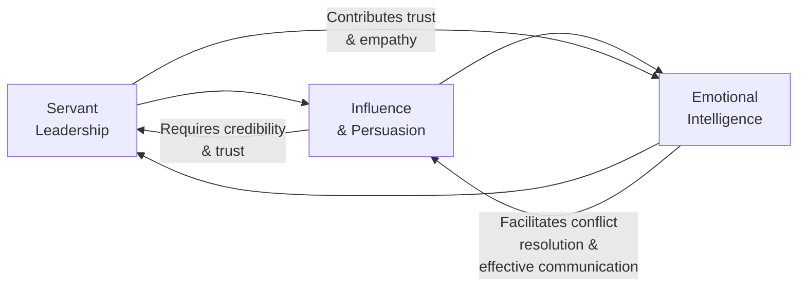

## 5.3 Leadership Behaviors

Leadership is often considered the cornerstone of successful project delivery. While technical competence and good planning are essential, the day-to-day dynamics of a project team hinge on how the leader—often the project manager—guides, motivates, and supports the team toward shared objectives. Today’s project environments are increasingly complex, and effective leadership transcends traditional command-and-control mindsets. Instead, it emphasizes enablement, trust, and meaningful relationships.

In line with the PMI’s emphasis on adaptable project manager competencies and the principles outlined in the PMBOK® Guide (Seventh Edition), this section examines three interrelated areas of leadership behaviors:

• Servant Leadership  
• Influence and Persuasion  
• Emotional Intelligence  

By understanding and integrating these dimensions, project managers can navigate uncertainty, motivate diverse teams, and deliver tangible value to stakeholders with integrity.

---

### Distinguishing Leadership from Management

Before exploring specific leadership behaviors, it helps to clarify the difference between leadership and management. Both are essential, but they serve distinct purposes:

• Management focuses on planning, organizing, and controlling resources to achieve specific outcomes.  
• Leadership involves setting a vision, influencing others, and fostering an environment in which people feel motivated and empowered to excel.

In project settings, you must balance these two roles. Strong leadership behaviors complement management practices by galvanizing support, building team morale, and ensuring alignment with strategic objectives.

---

### Leadership Styles in Project Environments

Although we focus primarily on servant leadership, influence, and emotional intelligence, it is valuable to acknowledge the broader spectrum of leadership styles. These may include:

• Transformational Leadership: Inspires and empowers team members through a shared vision, innovation, and a focus on development.  
• Transactional Leadership: Relies on rewards and penalties for motivation, emphasizing compliance with established processes.  
• Situational Leadership: Adapts style (telling, selling, participating, delegating) to meet the developmental level of the team.  
• Laissez-Faire Leadership: Provides autonomy to team members, often intervening minimally.  

Project managers may blend these approaches or shift between them, depending on context and team needs.

---

### Servant Leadership

Servant leadership places the emphasis on serving the team first, ensuring that team members’ needs are met so they can perform at their highest potential. The term originated with Robert K. Greenleaf in the 1970s and has since become a guiding philosophy in modern organizations, especially agile environments.

#### Key Principles of Servant Leadership

• Focus on the Growth and Well-Being of Team Members: A servant leader invests time in coaching, mentoring, and skill development. This approach fosters personal and professional growth.  
• Building Trust and Collaboration: Power is shared by creating a culture of collective ownership in decisions and outcomes.  
• Active Listening: A servant leader values the perspectives of all team members, offering them a safe space to express ideas, challenges, and concerns.  
• Removing Impediments: Servant leaders actively identify and eliminate barriers that limit team performance.  
• Empowering Decision Making: Decision making is often decentralized, allowing individuals closest to the work to make timely decisions.  

#### Case Study: Implementing Servant Leadership

Imagine a global software development project where teams are distributed in multiple continents. A project manager embracing servant leadership would:

1. Schedule regular, short check-ins to understand the team’s challenges.  
2. Provide a clear forum in which team members can propose process improvements.  
3. Ensure each team member has access to learning platforms or mentors for skill development.  
4. Foster a sense of ownership by encouraging local decisions rather than centralizing authority in one location.  

In this way, the project manager’s role shifts from “director” to “enabler,” boosting trust, autonomy, and engagement across geographically diverse teams.

---

### Influence and Persuasion

In many modern organizational structures—particularly matrix or functional ones—project managers seldom have formal authority over all resources. Influence, then, becomes a critical tool. Effective influencing is underpinned by relationship building, credibility, and communication skills.

#### Building Credibility

Credibility is often earned over time through consistent behavior, demonstrated expertise, and ethical integrity. Behaviors that strengthen a project manager’s credibility include:

• Honesty: Being transparent about project challenges, potential risks, and changes.  
• Accountability: Taking responsibility for outcomes and not shifting blame to team members.  
• Competence: Demonstrating mastery in project management techniques and domain-specific knowledge.  

#### Techniques for Influencing Stakeholders

• Positive Stakeholder Engagement: Seek first to understand stakeholder priorities (Chapter 7 of this guide). Show how your proposals align with their strategic interests.  
• Negotiation and Compromise: In situations where stakeholder demands seem conflicting, propose “win-win” solutions or identify trade-offs that align with overarching goals.  
• Storytelling and Visualization: Use data visualizations, success stories, or prototypes to help stakeholders see the value of a proposal.  

#### Influencing Without Authority

Because project managers often rely on shared, cross-functional resources, the ability to influence directly without hierarchical authority is critical. Actions such as providing recognition, sharing knowledge, or publicly celebrating team accomplishments can build goodwill. This goodwill makes it more likely that team members and stakeholders will support initiatives.

---

### Emotional Intelligence

Emotional intelligence (EI) involves understanding and managing our own emotions, as well as recognizing and influencing the emotions of others. Renowned psychologist Daniel Goleman identified four primary EI dimensions:

1. **Self-Awareness**: Recognizing one’s own emotions, tendencies, and triggers.  
2. **Self-Management**: Handling emotions in a healthy way, adapting to change, and maintaining integrity.  
3. **Social Awareness**: Detecting others’ emotions, needs, and concerns; reading social cues accurately.  
4. **Relationship Management**: Fostering positive relationships, managing conflict, and coaching team members.

High emotional intelligence aids project managers in communicating effectively, navigating conflicts, and creating an inclusive team culture.  

#### Practical EI Strategies for Project Managers

• **Pause and Reflect**: Before reacting to negative feedback, pause to evaluate the situation objectively. This helps deescalate potential conflicts.  
• **Active Empathy**: When a team member is distressed or frustrated, demonstrate empathy by genuinely listening and asking clarifying questions.  
• **Constructive Feedback**: Use a balance of positive and improvement-focused comments. Praise individuals in specific ways, highlighting exactly what they did well and its impact.  
• **Stress Management**: Recognize physiological or emotional warning signs of stress and employ proactive strategies (e.g., short breaks, deep breathing, time-boxed tasks).  

#### Emotional Intelligence and Team Motivation

Teams often mirror the emotional tone set by the leader. A project manager with high EI fosters open communication, navigates conflict productively, celebrates collective achievements, and encourages a supportive atmosphere. When team members sense authentic empathy, honesty, and emotional stability, they are more inclined to remain engaged and dedicated to the project’s vision.

---

### Integrating Servant Leadership, Influence, and Emotional Intelligence

Project managers do not exercise these skills in isolation. Instead, they overlap and function synergistically. Servant leadership sets the philosophical foundation that encourages team empowerment and an environment of trust. Influence skills enable persuasive communication and stakeholder alignment, while emotional intelligence aids in maintaining strong interpersonal relationships and conflict resolution.

Below is a simplified diagram illustrating how these factors interconnect and support each other:

As shown in the diagram:

• Servant Leadership creates an environment of trust and team empowerment, enabling effective influence tactics.  
• Influence & Persuasion is more credible and respectful when guided by servant leadership principles.  
• Emotional Intelligence helps leaders effectively read stakeholder emotions, manage conflicts, and maintain constructive team dynamics.  

---

### Best Practices and Common Pitfalls

**Best Practices**  
• **Practice Authenticity**: Consistency between words and actions builds trust.  
• **Seek Feedback**: Regularly invite feedback from the project team, sponsors, and stakeholders on leadership style and communication.  
• **Continuously Learn**: Enroll in leadership workshops, read relevant books, or find a mentor to further develop emotional intelligence and influence skills.  
• **Model Adaptability**: Remain open-minded when project conditions change. By modeling how to handle uncertainties calmly, you encourage the team to respond similarly.  

**Common Pitfalls**  
• **Micromanagement**: Over-involvement can erode trust and hamper team motivation.  
• **Excessive Formal Authority**: Relying on positional power rather than influence reduces long-term loyalty and engagement.  
• **Ignoring Emotional Climate**: Oversight of emotional undercurrents can lead to unresolved conflicts, low morale, or team burnout.  
• **Incomplete Delegation**: Delegating tasks without the necessary support or authority can frustrate team members.  

---

### Practical Tips for Developing Leadership Behaviors

1. **Conduct Self-Assessments**: Use tools such as emotional intelligence quizzes or the 360-degree feedback process to identify strengths and areas for improvement.  
2. **Define Personal Leadership Goals**: Articulate clear goals around being more empathetic, more collaborative, or more transparent.  
3. **Practice Active Listening**: In meetings, focus on truly understanding each speaker’s perspective before responding or deciding next steps.  
4. **Develop a Coaching Mindset**: Instead of directing, ask open-ended questions like “How can we approach this differently?” to help team members arrive at their own solutions.  
5. **Enhance Communication Channels**: Regularly update team members on project milestones, changes, or risks using diverse platforms (e.g., daily scrums, email updates, Slack channels).  

---

### Real-World Example: Turnaround with Servant Leadership and Emotional Intelligence

Consider a construction project that was behind schedule and over budget. The project manager attempted to get back on track by demanding overtime and intensifying oversight. Morale plummeted, and quality issues multiplied. The manager then shifted to a servant leadership approach:

• Created open forums for problem-solving.  
• Asked team leads for insights into roadblocks.  
• Distributed responsibilities based on skills and interests, giving teams autonomy while providing necessary support.  
• Practiced emotional intelligence by identifying stress points within the team and addressing them individually (e.g., flexible scheduling for employees struggling with childcare).  

Within weeks, the atmosphere improved, defect rates declined, and stakeholders reported higher satisfaction with progress. By combining the philosophies of servant leadership with emotional intelligence skills, this project manager not only achieved a turnaround but also earned long-standing respect from the team and management.

---

### Conclusion

Leadership behaviors, especially servant leadership, influence, and emotional intelligence, represent a dynamic synergy that helps project managers guide teams through uncertainties, build trustful collaborations, and deliver results that satisfy stakeholder expectations. By committing to personal growth in these areas, you not only facilitate immediate project success but also create an enduring impact on your organization’s culture, strategy, and long-term performance.

By exploring the strategies introduced in this chapter and practicing them consistently, you can refine your leadership approach over time and adapt to a wide range of project environments—from agile teams to cross-enterprise initiatives. This aligns with several of PMI’s 12 Project Management Principles, highlighting the importance of leadership, stakeholder engagement, and effective communication—which in turn lead to higher value delivery.

---

## Check Your Understanding of Leadership Behaviors



### What is the primary characteristic of servant leadership?
- [x] Serving the needs of the team to enable them to achieve their best work
- [ ] Exerting top-down authority to ensure tasks are completed
- [ ] Infrequent communication to preserve project manager time
- [ ] Focusing solely on financial metrics to gauge project success

> **Explanation:** Servant leadership emphasizes the growth and well-being of the team, placing their needs first to encourage optimal performance.

### Which of the following best describes a key component of influence in a matrix organization?
- [ ] Exercising strict command-and-control approach
- [ ] Leveraging positional authority to ensure compliance
- [x] Building credibility and strong relationships
- [ ] Assigning tasks based on random selection

> **Explanation:** In matrix organizations, formal authority may be limited. Project managers rely on credibility and relationship-building to influence others.

### Which dimension of emotional intelligence involves recognizing and understanding your own emotions?
- [x] Self-Awareness
- [ ] Self-Management
- [ ] Social Awareness
- [ ] Relationship Management

> **Explanation:** Self-awareness focuses on accurately perceiving and understanding your emotions, strengths, weaknesses, and triggers.

### Which statement best describes a common pitfall in leadership behaviors?
- [x] Relying too heavily on positional power and formal authority
- [ ] Delegating tasks while offering appropriate support
- [ ] Balancing both servant leadership and influence approaches
- [ ] Encouraging team members to innovate and experiment

> **Explanation:** Overusing formal authority can undermine trust and fail to leverage the benefits of empowerment and influence.

### Which of the following is a fundamental practice of servant leadership?
- [x] Decentralizing decision-making
- [ ] Limiting team autonomy
- [x] Removing impediments for the team
- [ ] Avoiding structured feedback channels

> **Explanation:** Servant leaders empower the team by pushing decision-making authority to those closest to the work, and they remove obstacles that hinder success.

### Which technique can project managers employ to influence stakeholders effectively?
- [x] Demonstrating empathy and aligning proposals with stakeholder needs
- [ ] Ignoring opposing views until stakeholders agree
- [ ] Serving only senior management interests
- [ ] Concealing risks to limit worry

> **Explanation:** Influencing effectively involves empathy, aligning with stakeholder agendas, and open communication.

### Which of the following practices enhances credibility?
- [x] Admitting mistakes and being transparent about project challenges
- [ ] Always appearing omniscient, even when unsure
- [x] Consistently delivering on commitments
- [ ] Relying on rumor-based project updates

> **Explanation:** Credibility is developed through honest and consistent behavior, including admitting mistakes and following through on promises.

### Which emotional intelligence principle relates to detecting and understanding the feelings of others?
- [ ] Self-Awareness
- [ ] Self-Management
- [x] Social Awareness
- [ ] Relationship Management

> **Explanation:** Social awareness focuses on perceiving others’ emotions accurately and recognizing power dynamics within a group.

### What is a key benefit of applying emotional intelligence in project management?
- [x] Better conflict resolution and stronger interpersonal relationships
- [ ] Faster creation of Gantt charts and scheduling
- [ ] Eliminating the need for stakeholder meetings
- [ ] Guaranteeing zero changes or risks

> **Explanation:** Emotional intelligence helps project managers handle sensitive interpersonal situations effectively, leading to better conflict resolution and team cohesion.

### Servant leadership implies project managers should always:
- [x] Put the team’s growth and well-being at the forefront
- [ ] Default to autocratic decision-making
- [ ] Micromanage tasks to prevent errors
- [ ] Strictly follow each process without deviating

> **Explanation:** Servant leaders focus on empowering and serving their teams, removing impediments and prioritizing development and well-being.



---

## PMP Mastery: 1500+ Hard Mock Exams with Full Explanations 

Looking to crush the PMP exam with confidence? Dive deep into 6 rigorous mock exams totaling 1500+ advanced-level questions, each accompanied by clear, step-by-step explanations. Hone your test-taking strategies, master complex topics, and build the resilience you need on exam day. Perfect for serious PMs aiming beyond fundamentals.  

Enroll now:  
[PMP Mastery: 1500+ Hard Mock Exams with Exceptional Clarity & Full Explanations](https://www.udemy.com/course/pmp-2025/?referralCode=CF83A54BC86BE27F9AFE)

_Disclaimer: This course is not endorsed by or affiliated with the PMI examination authority. All content is provided purely for educational and preparatory purposes._
