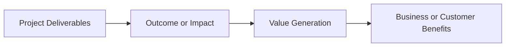
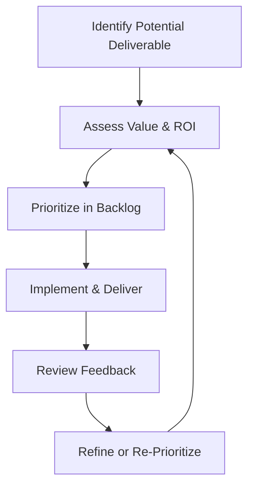

## 5.4 Value Focus and Outcomes

Focusing on value rather than simply completing tasks or generating outputs is at the heart of modern project management. When teams emphasize outcomes that matter most to customers, end users, and the organization, projects become more than just pipelines of deliverables—they become catalysts for strategic advantage and sustainable results. This principle encourages project managers and team members to continually ask: “How does this activity, deliverable, or decision optimize value for our stakeholders?”

In this section, we will examine why a “value focus” is fundamental to the successful delivery of project outcomes, especially within the broader context of the PMBOK® Guide Seventh Edition. You will learn techniques to identify and prioritize high-value deliverables, how to measure the impact of your project outcomes, and ways to effectively guide your team toward a shared focus on value creation.

### Understanding Value in Project Management
Value in project management is multifaceted and can be interpreted in several ways:
• Quantitative (tangible) returns such as increased revenue, lower operational costs, or higher profit margins.  
• Qualitative (intangible) gains such as improved brand reputation, stronger stakeholder relationships, or enhanced employee morale.  

According to PMI, “value” transcends basic metrics like cost and schedule performance. It involves benefits realization—whether your project outcomes truly align with and support strategic goals. For instance, if your organization aims to expand its market share in a new region, the project’s deliverables should contribute directly to that strategic intent. By focusing on outcomes, teams look beyond immediate tasks to the broader business impacts their work will create.

### Shifting from Outputs to Outcomes
Historically, project success was measured solely by adherence to the “iron triangle” of scope, time, and cost. While these metrics remain important, modern practices encourage a shift from outputs (e.g., a new software module) to outcomes (e.g., a measurable increase in customer engagement). An “output” is something your project team produces. An “outcome” is the effect that output has on the organization or its customers.

To illustrate: If your project’s output is an e-commerce platform, the outcome might be a 10% increase in online sales within six months. Focusing on this outcome prompts the team to plan features, user experience enhancements, and marketing strategies that cumulatively drive sales—rather than just delivering the platform as a standalone product.

### Establishing a Value-Centric Mindset
A strong project management culture involves regularly asking how each activity will generate—or protect—value. Value-centric teams often exhibit:
• Continuous alignment with stakeholder needs.  
• Openness to evolving requirements that enhance return on investment.  
• Proactive management of risk to preserve or enhance potential benefits.  
• Frequent feedback loops to validate whether evolving deliverables still match stakeholder priorities.  

This mindset aligns closely with agile and hybrid approaches, where iterative delivery and regular stakeholder reviews allow the team to pivot if they discover a more efficient path to achieving the desired outcome.

### Techniques for Prioritizing Value
There are several methods project managers can employ to keep a relentless focus on value:

#### 1. Weighted Shortest Job First (WSJF)
Often used in agile or scaled agile frameworks, WSJF helps teams rank project features or tasks by their cost of delay (how much value is lost by not doing the job soon) relative to the time it takes to complete. Features with the highest WSJF score get prioritized first, ensuring the team’s resources are deployed where they maximize value.

#### 2. Value Stream Mapping
Value Stream Mapping (VSM) originally comes from Lean methodology. It identifies each step in the process of creating value, from request to delivery, highlighting wasteful or redundant processes. By removing bottlenecks and streamlining workflows, the team boosts the throughput of valuable outcomes.

#### 3. Business Case Analysis and ROI
In predictive or more traditional environments, tools like Return on Investment (ROI), Net Present Value (NPV), and Payback Period help gauge the financial viability of project initiatives. These methods ensure that the project’s direction aligns with broader financial objectives and that the team focuses on deliverables that promise the highest returns.

#### 4. Minimum Viable Product (MVP) Approaches
Whether using agile or a hybrid model, launching an MVP helps you rapidly validate a project’s key assumption and gain quick feedback on its actual value. In some cases, an MVP can reduce the risk of overbuilding products that do not meet market needs, thereby ensuring continuous alignment between stakeholder expectations and the team’s efforts.

### Diagram: Flow from Deliverables to Outcomes to Value

Below is a Mermaid diagram illustrating how project deliverables should feed into tangible or intangible outcomes, which then generate value for the organization and its stakeholders.

**Diagram Explanation:**  
• Project Deliverables (A): The tangible or intangible products your team creates (reports, features, prototypes).  
• Outcome or Impact (B): The intended effect or result of deploying these deliverables (higher user adoption rates, improved efficiency, or better collaboration).  
• Value Generation (C): The net benefits realized through those outcomes (increased revenue, reduced cost, brand enhancement, etc.).  
• Business or Customer Benefits (D): The ultimate measure of success, sometimes tied to metrics like customer satisfaction, market share growth, or internal efficiency gains.

This chain highlights the incremental steps that transform raw outputs into real business or customer enhancements.

### Integrating Value Across the Project Life Cycle
Value creation does not occur at a single point; it demands ongoing attention throughout the project life cycle:

• Initiation: During chartering, define which strategic goals the project serves and how the final outputs will be measured for success.  
• Planning: Ensure your scope, schedule, and budget revolve around high-priority features or deliverables that create the most value. Identify relevant Key Performance Indicators (KPIs) for tracking.  
• Execution: Continually validate that deliverables meet stakeholder expectations. Use agile ceremonies (e.g., sprint reviews) or formal stage gates as checkpoints to confirm alignment with value objectives.  
• Monitoring and Controlling: Measure actual outcomes versus desired outcomes. Adapt plans if certain deliverables fail to produce expected results.  
• Closure: Evaluate overall value delivered, compile lessons learned, and ensure that operational transitions maximize the project’s long-term benefits.  

### Measuring Value and Outcomes
To confirm whether your project has truly delivered value, organizations must define and measure relevant metrics. Some common measures of outcomes:

• Financial Metrics: ROI, NPV, Internal Rate of Return (IRR).  
• Customer-Centric Metrics: Customer Satisfaction Score (CSAT), Net Promoter Score (NPS), customer adoption rate.  
• Operational Metrics: Reduction in processing time, lowered defect rates, improved throughput.  
• Employee Metrics: Job satisfaction, retention rates, and productivity gains linked to the project.  

By choosing the right metrics—directly aligned with the project's objectives—teams can continuously monitor whether their efforts are yielding the intended value.

### Real-World Example: Value Enhancement in Product Development
Consider a software company developing a new Customer Relationship Management (CRM) module to enhance client retention. Traditional measures of success might revolve around completing the module “on time and within budget,” but a value-driven approach sets more expansive goals:

• Outcome: A 15% reduction in client churn within 12 months.  
• Deliverables: New module features for contact management, analytics for customer feedback, and integrated communication features.  
• Metrics: Annual client retention, customer satisfaction surveys, and direct revenue growth from the new module.  

By prioritizing the analytics functionality (which directly impacts the retention strategy) over less critical UI enhancements, the team creates more value sooner. If analytics features reveal a spike in user dissatisfaction with a particular feature, the product team can pivot quickly. They address the root cause while simultaneously continuing the module’s expansion. In this scenario, a value focus ensures every development sprint aligns with retention targets, making the final product more impactful for both the organization and its clients.

### Common Pitfalls in Value-Centric Approaches
While acting on a value focus is highly beneficial, project managers may face several obstacles:

• Overemphasis on Short-Term Gains: Sometimes, the pursuit of immediate wins overlooks long-term strategic goals leading to technical debt or missed opportunities.  
• Inadequate Stakeholder Alignment: If key sponsors or stakeholders do not agree on the definition of “value,” prioritization becomes fragmented.  
• Lack of Feedback Loops: Without iterative reviews or user testing, teams might assume that the deliverable is valuable without validating real outcomes.  
• Resistance to Change: Shifting from traditional metrics (on time, on budget, within scope) to outcome-based measures can meet resistance, especially if organizations have deeply ingrained processes.  

### Overcoming Challenges and Best Practices
• Engage Stakeholders Early: Define “value” with sponsors, customers, and team members in a collaborative way. This alignment fosters a shared sense of purpose.  
• Employ Adaptive Strategies: Regularly revisit priorities, especially in volatile or high-uncertainty environments (see Chapter 14: Uncertainty Performance Domain). Agile, iterative techniques help ensure you’re still aiming at the most valuable targets.  
• Use Incremental Feedback: Conduct frequent reviews or sprint demos to confirm ongoing alignment with a value-based product roadmap.  
• Support a Learning Culture: Encourage your team to propose enhancements, question assumptions, and experiment with small prototypes. Failure swiftly recognized and corrected can lead to greater eventual success.  

### Fostering a Value-Driven Team Mindset
From the day-to-day standups to higher-level strategic planning sessions, reiterate why certain tasks have top priority based on their anticipated benefit. Reinforced regularly, this practice helps everyone—from developers to sponsors—maintain a clear view of what success looks like and how each deliverable moves the needle toward greater value.

#### Mermaid Diagram: Prioritization Loop

**Diagram Explanation:**  
1. Identify Potential Deliverable (A): Gather ideas from stakeholders, business cases, or user stories.  
2. Assess Value & ROI (B): Calculate potential benefits to determine feasibility.  
3. Prioritize in Backlog (C): Rank the deliverable relative to other items in the backlog based on strategic alignment.  
4. Implement & Deliver (D): Develop or produce the deliverable.  
5. Review Feedback (E): Hold reviews, demos, and user acceptance sessions to assess actual value.  
6. Refine or Re-Prioritize (F): Adjust future backlog items or rework deliverables based on feedback and new insights.  

### References for Further Exploration
• PMI. (2021). PMBOK® Guide – Seventh Edition. Project Management Institute.  
• PMI. (2017). Agile Practice Guide. Project Management Institute.  
• Highsmith, J. (2019). Adaptive Leadership Techniques for Value-Driven Delivery.  
• Cohn, M. (2005). Agile Estimating and Planning. Prentice Hall.  

These resources elaborate on how to reinforce a value-centric approach across an array of environments, from predictive to agile and hybrid settings.

Maintaining a relentless focus on value and outcomes is crucial for modern project success. By embedding the concept of value into every stage—from initial scoping to final handover—you maximize the potential for your initiatives to generate meaningful, measurable benefits. Whether your objective is boosting revenue, enhancing user satisfaction, or driving process efficiencies, a disciplined and transparent approach to prioritizing value ensures that your project team invests its efforts where they matter most.

---

## Maximize Project Outcomes: 10-Question Quiz on Value Delivery



### According to the PMI perspective, how is “value” generally defined in project management?

- [x] Benefits that projects deliver to stakeholders, extending beyond just financial metrics.
- [ ] The sum of project costs plus profit margin.
- [ ] A fixed number established during project initiation.
- [ ] An intangible concept that cannot be measured or tracked.

> **Explanation:** PMI’s focus on value emphasizes measurable and intangible benefits delivered to stakeholders, which includes financial and non-financial benefits.

### Which of the following best describes the difference between outputs and outcomes?

- [x] Outputs are direct deliverables produced by the project, while outcomes are the measurable effects or benefits realized from those deliverables.
- [ ] Outputs are intangible, and outcomes are only tangible.
- [ ] Outputs are only ROI metrics, while outcomes focus solely on cost savings.
- [ ] There is no functional difference between them.

> **Explanation:** Outputs are items or services your team delivers, whereas outcomes refer to the broader impacts and benefits realized once those outputs are in use.

### What is one advantage of focusing on outcomes rather than just deliverables?

- [x] It ensures the project continuously aligns with strategic and stakeholder needs.
- [ ] It doesn’t require any form of metrics or monitoring.
- [ ] It removes all uncertainty from the project.
- [ ] It reduces time to deliver but increases overall project cost.

> **Explanation:** When you focus on outcomes, you continuously validate how your deliverables align with strategic goals and stakeholder expectations.

### Which of the following is a key step in Weighted Shortest Job First (WSJF)?

- [x] Measuring a feature’s cost of delay relative to its effort.
- [ ] Calculating the average salary of project sponsors.
- [ ] Assigning features only by manager preference.
- [ ] Reporting weekly progress to external auditors.

> **Explanation:** WSJF is based on dividing the Cost of Delay by the duration or job size, ensuring you prioritize tasks with the highest value return first.

### If a project uses Minimum Viable Product (MVP) techniques, what is its core aim?

- [x] Quickly validating the product’s core concept with minimum investment.
- [ ] Implementing every single requested feature from day one.
- [x] Maximizing project documentation before any deliverables.
- [ ] Guaranteeing zero risk in project execution.

> **Explanation:** MVP focuses on launching a product with essential features to gather early feedback and validate assumptions, reducing wasted effort on unproven ideas.

### Which of the following is an example of a value-driven metric?

- [x] Net Promoter Score (NPS).
- [ ] Team’s overtime hours.
- [ ] Number of lines of code written.
- [ ] The color scheme of the project’s website.

> **Explanation:** NPS captures customer loyalty and satisfaction, which ties directly to business outcomes and perceived value.

### What do frequent feedback loops help achieve in a value-focused project?

- [x] Timely identification of misalignments or low-value features.
- [ ] Avoidance of all project documentation.
- [x] Limit stakeholder involvement to the beginning of the project.
- [ ] Ensure no changes occur in project scope.

> **Explanation:** Frequent reviews, demos, or feedback sessions allow the team to detect whether deliverables continue to align with stakeholder expectations and overall strategy.

### A common pitfall in focusing on value is:

- [x] Overemphasizing short-term gains at the expense of long-term strategic benefits.
- [ ] Defining each deliverable clearly.
- [ ] Having regular stakeholder communication.
- [ ] Planning frequent retrospectives and updates.

> **Explanation:** Pursuing immediate short-term advantages without regard for the long-term can lead to misaligned outcomes and technical debt.

### Which aspect typically indicates true value has been delivered?

- [x] Stakeholders report measurable improvements that align with project objectives.
- [ ] The team completes all tasks assigned, even if they do not solve stakeholder issues.
- [ ] The final date is met, but new functionality is not used widely.
- [ ] Senior management has the impression the project was successful, despite poor end-user adoption.

> **Explanation:** True value materializes when stakeholders—and the organization—benefit in a measurable manner that aligns with original objectives.

### True or False: Value-centric project management applies only to agile environments and is incompatible with predictive approaches.

- [x] False
- [ ] True

> **Explanation:** Value-centric principles can be adopted in predictive, agile, or hybrid environments. The focus on outcomes and stakeholder benefits is universal across methodologies.



---

## PMP Mastery: 1500+ Hard Mock Exams with Full Explanations 

Looking to crush the PMP exam with confidence? Dive deep into 6 rigorous mock exams totaling 1500+ advanced-level questions, each accompanied by clear, step-by-step explanations. Hone your test-taking strategies, master complex topics, and build the resilience you need on exam day. Perfect for serious PMs aiming beyond fundamentals.  

Enroll now:  
[PMP Mastery: 1500+ Hard Mock Exams with Exceptional Clarity & Full Explanations](https://www.udemy.com/course/pmp-2025/?referralCode=CF83A54BC86BE27F9AFE)

_Disclaimer: This course is not endorsed by or affiliated with the PMI examination authority. All content is provided purely for educational and preparatory purposes._
