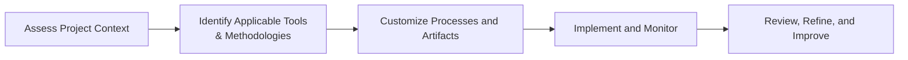

## 5.6 Tailoring and Adaptation

Tailoring is the deliberate and thoughtful customization of project management processes, methodologies, and practices to align with the unique context of a project or organization. Within the realm of the PMBOK® Guide Seventh Edition principles, tailoring recognizes that no single approach works for every initiative. Project professionals must adapt methods, artifacts, and governance structures to suit differences in size, complexity, risk, stakeholder engagement, and organizational culture. By applying the right level of rigor at the right time, you maximize effectiveness, reduce overhead, and enable successful outcomes. This section explores the art and science of tailoring, offering practical steps, examples, and insights on how to systematically adapt your project management frameworks.

### Understanding Tailoring and Adaptation

The PMI’s principle of “Tailoring and Adaptation” calls for project teams to thoughtfully select, adapt, and sometimes combine practices from different methods—whether predictive, agile, or hybrid—to address the specific needs of the project. Incorporating guidance from standards such as PMIstandards+ and the Agile Practice Guide, you build a fit-for-purpose approach that maximizes value delivery. To fully grasp tailoring, one must recognize it is not about arbitrarily removing elements from a methodology. Rather, tailoring is a purposeful exercise that balances thoroughness with practicality.

Key factors that prompt the need for tailoring include:

- Project size and complexity  
- Organizational culture and stakeholder expectations  
- Regulatory or compliance requirements  
- Risk exposure and uncertainty  
- Technical domain or product-specific demands  

By tailoring a framework to these conditions, project managers ensure the processes are neither too rigid nor overly simplistic.

### Benefits of an Effective Tailoring Approach

An effective tailoring strategy can deliver numerous benefits:

- Reduced overhead: Eliminating unnecessary artifacts or approvals frees up time and resources.  
- Enhanced stakeholder satisfaction: Processes that fit the context create smoother collaboration and alignment with stakeholder needs.  
- Improved adaptability: Tailored methods can more readily pivot in response to changes or risks.  
- Streamlined governance: Only focus on essential checkpoints, resulting in more clarity and efficiency.  
- Higher probability of success: A well-tailored approach leads to more focused, feasible project plans and consistent delivery of intended value.

### Steps to Tailoring Project Management Practices

Tailoring can be seen as an iterative process—much like continuous improvement—that involves planning, implementing, reviewing, and refining. Here is a conceptual flow to guide you:

1. **Assess Project Context**  
   Begin by understanding project objectives, scope, constraints, initial requirements, stakeholder expectations, and organizational circumstances. Evaluate the project’s complexity, risk profile, and the environment in which it operates (e.g., agile-friendly, strongly regulated).  
   
2. **Identify Applicable Tools and Methodologies**  
   Determine which frameworks—predictive (traditional), agile, or hybrid—might satisfy the needs uncovered during the context assessment. Draw from PMI’s recommended practices, recognized standards (e.g., PRINCE2®), or specialized methods (e.g., Lean-Agile, eXtreme Programming for software development).  
   
3. **Customize Processes and Artifacts**  
   Break down selected processes into practical steps. Modify templates (e.g., risk register, stakeholder register, project charter) so they remain relevant but not overly complex. Identify which knowledge area inputs, tools, and techniques are truly necessary. If you are conducting a project in an agile environment, you may reduce or combine governance steps, or rely on more face-to-face communication rather than detailed documents.  
   
4. **Implement and Monitor**  
   Execute the tailored approach and track progress. Ensure the team knows why certain processes or ceremonies are included or excluded. Gather feedback from stakeholders on whether the adapted methods are effective, whether documentation remains valuable, and if your governance approach captures essential controls.  
   
5. **Review, Refine, and Improve**  
   Based on results, lessons learned, and feedback, refine the tailored approach. This step may involve iterative adjustments as the project evolves. In agile settings, you might conduct retrospectives to see if the approach is adequate for subsequent sprints. In predictive settings, you might hold structured gate reviews to test if the chosen approach remains fit for purpose.

### Tailoring in Predictive Projects

In *predictive* or *traditional* project environments, processes can be quite structured, often based on the PMBOK® Guide’s Knowledge Areas and process groups. Tailoring in these contexts often involves paring down or expanding the structure depending on project size, risk, and stakeholder involvement:

- A small local marketing campaign may not need a robust earned value measurement system or a comprehensive risk register.  
- A large infrastructure initiative might require thorough risk management, detailed scheduling, multi-layer stakeholder engagement, and specialized compliance processes.

#### Example: Streamlining Integration Management

Suppose you are leading a small, internal IT upgrade project. You might choose to:

- Combine scope and cost management into a single integrated plan for simpler oversight.  
- Reduce the frequency of formal status updates from weekly to bi-weekly due to stable risk and minimal stakeholder involvement.  
- Use a short, targeted charter that clarifies objectives, success criteria, and constraints, while omitting less critical administrative details.

### Tailoring in Agile Projects

Agile environments rely heavily on adaptive planning, rapid feedback loops, and close collaboration. Tailoring here means judiciously selecting ceremonies, artifacts, and metrics appropriate for the team and the project:

- A distributed scrum team may opt for virtual stand-ups, asynchronous communication for retrospective feedback, or additional knowledge-sharing sessions to accommodate diverse time zones.  
- Larger agile projects might integrate scaled frameworks such as SAFe® or LeSS, requiring some minimal documentation for cross-team alignment.  
- Some agile teams adopt Earned Value Management (EVM) for progress tracking if mandated by governance, although this is not traditionally an agile artifact.

Because agile thrives on flexibility, the tailoring process may happen continuously. For instance, you might begin with Scrum and adapt by pulling certain practices from Kanban—like a visual board for tracking workflow and limiting work-in-progress (WIP)—if you discover bottlenecks.

### Tailoring in Hybrid Projects

Hybrid approaches blend predictive and adaptive components—scheduling certain parts of the project with a waterfall approach while refining others through iterative sprints, or customizing agile best practices to integrate with corporate governance processes. Tailoring in a hybrid domain often involves:

- Defining clear interfaces between the predictive and agile parts of the project (e.g., design phase is predictive, development spirals are agile).  
- Maintaining minimal but vital documentation (e.g., risk register, project schedule) to meet organizational standards, while preserving agile’s flexibility.  
- Coordinating different roles, such as a Scrum Master in the agile segment and a Project Manager for the predictive portion, ensuring seamless information flow.

This often suits projects where certain deliverables are well-defined (e.g., a regulatory compliance document) while others are exploratory (e.g., user experience design).

### Adapting to Organizational Culture and Strategy

Projects do not exist in a vacuum. Organizational culture, maturity in project management, and strategic goals influence tailoring decisions:

- **Governance Requirements**: Heavily regulated industries (e.g., construction, pharmaceuticals, aerospace) may require robust documentation, strict approvals, and compliance gating.  
- **Organizational Maturity**: If the organization is new to agile, more frequent alignment meetings and thorough training may be essential. If the culture is used to formal processes, you might have to carefully introduce or justify adaptive methods.  
- **Strategic Goals**: If the strategic objective is to bring a product to market quickly, you may tailor out some lengthy approval processes. Conversely, if brand reputation is at stake and mistakes are costly, you may tailor in additional testing or validation steps.

### Challenges and Pitfalls in Tailoring

Despite its benefits, tailoring can present challenges:

- **Over-Tailoring**: Cutting out essential processes or controls can lead to confusion, poor risk management, or misaligned stakeholder expectations.  
- **Under-Tailoring**: Simply applying a standard methodology straitjacket to every scenario could overwhelm the team with unnecessary work.  
- **Lack of Stakeholder Buy-In**: Stakeholders might resist changes to “the way we’ve always done it,” leading to friction. Failing to demonstrate the reason or benefits for changes might invite pushback.  
- **Misalignment with Organizational Policies**: Some tailoring attempts clash with corporate standards. Make sure any deviation is within permissible governance frameworks.  
- **Insufficient Documentation of Tailoring Decisions**: Not documenting the rationale behind each tailoring decision can breed confusion and hamper knowledge sharing for future projects.

### Best Practices for Successful Tailoring

1. **Base Decisions on Data**  
   Gather input from data-driven analyses (risk assessments, cost-benefit analyses, stakeholder interviews) to identify the key drivers for tailoring.

2. **Collaborate with Stakeholders**  
   Co-create the tailored approach with team members and sponsors. Their insights and buy-in will reduce resistance and promote alignment throughout the project.

3. **Implement Incrementally**  
   Start small with your tailoring changes. Test and refine them rather than making sweeping transformations in one go.

4. **Maintain Transparency**  
   Keep everyone informed about what changes are being made, why they matter, and how they affect project outcomes.

5. **Document Tailoring Rationale**  
   Record tailoring decisions, their anticipated impact, and any metrics used to monitor effectiveness. This historical reference benefits future projects in understanding what worked and what did not.

6. **Assess Continually**  
   Tailoring is not a one-time exercise. Reassess periodically—particularly at major milestones or stage gates—to see if further adjustments are needed.

### Practical Examples of Tailoring

Consider two different scenarios to illustrate how tailoring can unfold:

#### Example 1: Software Development for a Government Agency

- **Context**: The agency imposes rigorous traceability and compliance audits.  
- **Tailoring Decisions**:  
  - Use iterative Scrum for faster feedback on feature development, but maintain a separate Requirements Traceability Matrix for compliance.  
  - Schedule formal stage-gate reviews at the end of each major release to incorporate mandated sign-offs.  
  - Provide weekly compliance tracking dashboards for audit readiness.  
- **Outcome**: The project balances agility in delivering user-focused features with robust compliance documentation.  

#### Example 2: Fast Track Marketing Campaign for a Startup

- **Context**: Time-sensitive campaign; minimal corporate governance.  
- **Tailoring Decisions**:  
  - Use a Kanban board to visualize tasks and facilitate continuous flow.  
  - Reduce formal risk management to a simple risk checklist reviewed in weekly stand-ups.  
  - Focus on real-time metrics (like cost per lead) rather than formal monthly variance reports.  
- **Outcome**: More streamlined processes. The lean approach fosters quick decision-making suited to a startup environment.

### Tools, Techniques, and Artifacts for Tailoring

A variety of tools and artifacts can support effective tailoring decisions:

- **Project Tailoring Checklist**: A short, structured checklist that helps evaluate each Knowledge Area or principle to see if it’s relevant and to what extent.  
- **Stakeholder Engagement Analysis**: Clarifies the level of collaboration needed from each stakeholder group.  
- **Risk-Driven Approach**: Tools like cause-and-effect diagrams or a risk breakdown structure help reveal areas needing more robust processes.  
- **Hybrid Methodology Matrix**: A matrix that outlines which facets of the project follow predictive steps and which follow an iterative approach.  
- **Tailor-Fit Governance Plan**: Outlines the approval levels, frequency of reviews, and reporting requirements, scaled to the project’s complexity.

### Looking Ahead

Tailoring is central to modern project management. As organizations grow in complexity and diversity, there is no “one-size-fits-all.” Whether you’re working on a high-stakes construction project, a multi-disciplinary humanitarian mission, or a cutting-edge software product, the ability to consciously shape and adapt your approach can significantly increase the likelihood of success. Remain flexible, stay informed, and collaborate with stakeholders to fine-tune methods, processes, and tools for maximum value realization.

For further study, consult:

- [PMIstandards+](https://standardsplus.pmi.org/), which offers additional principles-based guidance on tailoring practices.  
- PMI’s *Agile Practice Guide* for in-depth advice on customizing agile frameworks.  
- “Disciplined Agile” from PMI, showing how to systematically blend agile and lean methods.  
- *Managing Successful Projects with PRINCE2®* for governance-based tailoring approaches in predictive environments.

## Quiz: Tailoring & Adaptation Essentials



### In tailoring a project management methodology, which factor most often drives customization?

- [ ] The project manager’s personal preference  
- [ ] A desire to minimize communication with stakeholders  
- [x] The unique context and requirements of the project  
- [ ] The need for maximum documentation in all scenarios  

> **Explanation:** Tailoring should always be driven by the unique context of the project, including scope, stakeholders, and organizational factors.  

### Which of the following are valid reasons to tailor a process? (Select two.)

- [x] The project size is small and does not require extensive documentation.  
- [ ] The CEO wants to try a new tool with no justification.  
- [x] Regulatory requirements mandate specific risk monitoring steps.  
- [ ] Tailoring is never recommended in agile projects.  

> **Explanation:** Projects can be tailored to fit size, risk, and compliance needs. Random changes without justification provide little benefit and can create confusion.  

### What is a common risk of “over-tailoring” a methodology?

- [x] Key checkpoints or controls might be removed, increasing project risk.  
- [ ] The team will have too many templates to complete.  
- [ ] The organization will not allow any customization.  
- [ ] Stakeholders will not notice any changes.  

> **Explanation:** Over-tailoring can lead to eliminating vital processes, exposing the team and the project to unmanaged uncertainties.  

### In a hybrid project environment, how should predictive and agile components be coordinated?

- [ ] Both components remain entirely independent.  
- [ ] Convert agile deliverables into predictive artifacts only at the end.  
- [ ] Predictive components should fully replace the agile ones.  
- [x] There should be clear interfaces and coordination mechanisms between the two.  

> **Explanation:** The essence of hybrid approaches is to define where each method applies, ensure transparency, and coordinate roles and outputs across predictive and agile dimensions.  

### Which are best practices for successful tailoring? (Select two.)

- [x] Ongoing assessment and willingness to refine.  
- [ ] Mandate no changes to standard processes.  
- [x] Collaborate with stakeholders to gain buy-in.  
- [ ] Eliminate all documentation to save time.  

> **Explanation:** Collaboration and continual assessment are important so the approach evolves with the project’s needs. Completely removing processes or never tailoring are less effective.  

### A key principle in tailoring is to base decisions on data. Which of the following best embodies this principle?

- [x] Using a risk assessment to decide if additional approvals are necessary.  
- [ ] Selecting processes based on personal intuition only.  
- [ ] Copying another project’s methodology without analysis.  
- [ ] Avoiding stakeholder input.  

> **Explanation:** Data-driven decisions involve leveraging quantitative or qualitative inputs to determine how and where to tailor processes, rather than relying on guesswork or assumptions.  

### What is a primary challenge when tailoring agile frameworks?

- [x] Ensuring buy-in from a culture used to formal, predictive practices.  
- [ ] Agile prohibits any type of hybridization.  
- [x] Maintaining minimal but required documentation for governance.  
- [ ] Agile frameworks do not allow any adaptation.  

> **Explanation:** In many organizations, formal governance might conflict with agile’s emphasis on lightweight documentation, so reconciling these two is a common challenge. Achieving cultural acceptance is also critical.  

### How might tailoring in an enterprise environment ensure alignment with organizational strategy?

- [x] By adapting processes to support long-term goals and compliance standards.  
- [ ] By completely ignoring higher-level objectives.  
- [ ] By focusing only on the best-known agile methods.  
- [ ] By removing all risk management tasks.  

> **Explanation:** Tailoring ensures that every process, method, or tool used directly contributes to broader strategic goals, while respecting constraints such as compliance and governance.  

### In a small marketing campaign project, what tailoring decision might be most appropriate?

- [x] Combining scope, cost, and schedule plans into a single simplified plan.  
- [ ] Using five different quantitative risk models for tracking.  
- [ ] Holding daily 4-hour status meetings with every stakeholder.  
- [ ] Requiring a new project manager for each deliverable.  

> **Explanation:** A small marketing campaign typically benefits from streamlined planning and minimal overhead, allowing quick, flexible execution.  

### Tailoring should be documented because…

- [x] It provides clarity and helps future projects learn from the approach.  
- [ ] It can hide oversights and mistakes from senior stakeholders.  
- [ ] Oral communication is always enough.  
- [ ] No one needs to know the rationale behind changes.  

> **Explanation:** Documenting the reasons and outcomes of tailoring promotes transparency, knowledge transfer, and organizational learning.  



---

## PMP Mastery: 1500+ Hard Mock Exams with Full Explanations 

Looking to crush the PMP exam with confidence? Dive deep into 6 rigorous mock exams totaling 1500+ advanced-level questions, each accompanied by clear, step-by-step explanations. Hone your test-taking strategies, master complex topics, and build the resilience you need on exam day. Perfect for serious PMs aiming beyond fundamentals.  

Enroll now:  
[PMP Mastery: 1500+ Hard Mock Exams with Exceptional Clarity & Full Explanations](https://www.udemy.com/course/pmp-2025/?referralCode=CF83A54BC86BE27F9AFE)

_Disclaimer: This course is not endorsed by or affiliated with the PMI examination authority. All content is provided purely for educational and preparatory purposes._
