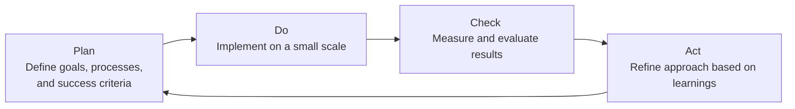

## 5.7 Quality and Continuous Improvement

Quality and continuous improvement form the backbone of any successful project management practice. Regardless of methodology—predictive, agile, or hybrid—both concepts help teams meet or exceed stakeholder expectations, drive organizational value, and foster a culture of excellence. In the context of PMI’s 12 Project Management Principles (as outlined in the PMBOK® Guide Seventh Edition), “Quality and Continuous Improvement” underscores the ongoing commitment to refining processes, products, and services. This principle promotes proactive quality techniques, leverages lessons learned, and encourages iterative improvement cycles that ensure each phase and iteration contributes to greater performance and stakeholder satisfaction.

This section explores the foundational elements and practical applications of quality and continuous improvement, highlighting relevant strategies, tools, and case studies to guide project managers in building robust, value-driven project environments.

---

### Understanding Quality in Project Management

Quality in project management refers to the degree to which a project and its deliverables meet the requirements and expectations of stakeholders. It involves:

• Designing work processes that help teams adhere to specifications.  
• Monitoring and controlling outcomes to maintain consistent standards.  
• Continuously refining deliverables by learning from past mistakes and identifying opportunities for growth.

Quality has both a product dimension—ensuring deliverables are fit for purpose—and a process dimension—ensuring that project activities are efficient, well-structured, and compliant with relevant standards. Effective project quality management saves time, money, and resources. It also enhances stakeholder trust, reduces risk, and strengthens the overall reputation of the project team and the organization.

#### Differentiating Quality from Grade
One fundamental distinction is that “quality” is not synonymous with “grade.” You can deliver a high-grade product that still lacks quality if it fails to meet the requirements. Alternatively, a lower-grade product might remain perfectly acceptable if it meets every specification and stakeholder expectation. Hence, quality management focuses less on luxury or sophisticated features and more on preventing defects, satisfying explicit and implicit needs, and reducing variation from agreed-upon standards.

---

### Core Concepts of Continuous Improvement

Continuous improvement is an ongoing effort to enhance products, services, and processes. While traditionally associated with lean manufacturing and total quality management (TQM), continuous improvement philosophies now permeate agile, hybrid, and predictive project management approaches alike.

Some common aspects that underscore continuous improvement include:

• Incremental changes driven by cyclical feedback loops and retrospectives.  
• Transparent performance metrics, such as Key Performance Indicators (KPIs) or Earned Value metrics (see Chapter 13: Measurement Performance Domain for details).  
• A supportive leadership environment that encourages team members to voice ideas on process improvements.  
• Structured lessons learned sessions that capture insights for future projects (refer to Chapter 11: Project Work Performance Domain for more on knowledge transfer).

#### The PDCA Cycle
A cornerstone of many improvement initiatives is the Plan-Do-Check-Act (PDCA) cycle, also known as the Deming cycle. PDCA advocates for a structured approach to iterative enhancements:

1. **Plan**: Establish objectives and processes needed to deliver results according to customer requirements and organizational policies.  
2. **Do**: Execute the plan on a small scale to test its feasibility.  
3. **Check**: Assess the test results by comparing performance outcomes with expectations or established metrics.  
4. **Act**: Implement necessary improvements based on findings. This step often leads to additional planning dialogues, creating a self-reinforcing feedback loop.

The PDCA cycle can be repeated indefinitely, making it a perfect fit for agile sprints, iterative prototypes, or even rolling wave planning in more predictive environments.

---

### Proactive Quality Techniques

Quality management efforts are most effective when integrated into each project phase, rather than treated as an add-on or last-minute review. Proactive techniques enhance consistency and reduce costly rework:

• **Quality by Design (QbD)**: Incorporate quality considerations into the earliest stages of project planning, ensuring requirements, scope, and design elements meet desired standards from the outset.  
• **Early Testing and Validation**: Conduct frequent testing, whether it is software testing in agile sprints or prototype reviews in product design, to detect defects early.  
• **Standards and Checklists**: Develop and use standardized checklists or templates (see Chapter 41: Reference Charts and Templates) to avoid common errors, omissions, or near-misses.  
• **Preventive vs. Corrective Actions**: Emphasize preventive actions that deter problems before they occur, rather than relying heavily on corrective measures that address issues post-facto.

#### Agile Retrospectives
A central feature of agile methodology, retrospectives naturally align with continuous improvement. At the end of each iteration or sprint, the team meets to discuss:

• What went well  
• What can be improved  
• How to incorporate feedback into the next cycle

Because retrospectives are time-boxed and routinely scheduled, they promote a habit of consistent reflection and real-time process enhancement. This approach contrasts sharply with a traditional project closeout session, which might capture lessons learned but not necessarily apply changes until future initiatives.

---

### Tools and Techniques for Quality and Continuous Improvement

Modern project management practitioners have a large toolkit to manage quality and ensure continuous improvement:

1. **Root Cause Analysis (RCA)**: Systematic investigation of underlying causes for issues, commonly depicted with Fishbone (Ishikawa) diagrams or “5 Whys” technique.  
2. **Failure Mode and Effects Analysis (FMEA)**: Identifies potential failure points and prioritizes them based on severity, occurrence, and detection.  
3. **Kaizen**: A Japanese concept (“kai” = change, “zen” = good) that promotes daily continuous improvements.  
4. **Six Sigma**: Focuses on reducing process variation and defects, emphasizing the DMAIC (Define, Measure, Analyze, Improve, Control) framework.  
5. **Scrum Retrospective Techniques**: Structured activities (e.g., “Start, Stop, Continue”) that encourage open dialogue on improvement opportunities every sprint.

The key is choosing methods that align with your organization’s culture and the unique demands of each project or product cycle. One size does not fit all, and tailoring (see Chapter 5.6: Tailoring and Adaptation) is often necessary to ensure effectiveness.

---

### Intersection with Risk Management, Stakeholders, and Governance

Quality and continuous improvement intersect significantly with other project management disciplines:

• **Risk Management**: By proactively identifying potential failures or suboptimal processes, teams can mitigate or eliminate quality risks early (see Chapter 14: Uncertainty Performance Domain and Chapter 22: Risk and Uncertainty Management (Revisited)).  
• **Stakeholder Engagement**: Gathering regular feedback from stakeholders helps verify whether current deliverables meet their needs. This fosters transparency and ensures alignment on quality assumptions (see Chapter 7: Stakeholder Performance Domain).  
• **Governance and Organizational Standards**: Many organizations have formal quality standards (e.g., ISO 9001) or internal guidelines for project delivery. Aligning with these frameworks ensures compliance and fosters a consistent quality culture.

---

### Continuous Improvement in Agile, Hybrid, and Predictive Environments

1. **Agile and Iterative Methodologies**  
   Agile frameworks like Scrum and Kanban inherently support continuous improvement. Each sprint or iteration includes monitoring, adaptation, and shared learnings. Progress is visually tracked via tools such as burn charts and cumulative flow diagrams (see Chapter 13: Measurement Performance Domain).

2. **Hybrid Approaches**  
   Hybrid models blend predictive planning with agile or iterative feedback loops. Here, continuous improvement may appear as structured stage-gate reviews combined with agile retrospectives for specific portions of the project. This synergy allows large-scale planning while still capturing and implementing lessons learned incrementally.

3. **Predictive Projects**  
   Even in highly regulated or traditional environments, continuous improvement techniques can be woven in. Teams can conduct intermediate milestones or design phase gate reviews, collecting data for future improvements. Frequent quality checks, risk assessments, and stakeholder reviews keep quality standards in check and encourage process refinements.

---

### Real-World Case Studies

#### Case Study 1: Continuous Improvement in a Software Migration Project
A large financial institution sought to migrate its legacy system to a cloud-based platform. Initially, teams faced repeated performance bottlenecks. By implementing weekly retrospectives (adapted from agile processes) and using the PDCA cycle to pilot performance improvements, the team identified specific code inefficiencies and architectural constraints. Incremental changes resulted in a 30% performance uplift within two months, demonstrating the effectiveness of iterative improvement in a traditionally predictive environment.

#### Case Study 2: Manufacturing Quality Enhancement
An automotive parts manufacturer leveraged root cause analysis (RCA) and “5 Whys” to uncover a critical defect in its assembly line. Rework costs were mounting, and product returns threatened the company’s reputation. By asking “why” repeatedly, the team traced the defect to an equipment miscalibration introduced when shifting production lines. Correcting the calibration procedure and standardizing future line-shift protocols drastically decreased defects by 60%. The lesson learned was integrated as a permanent standard operating procedure.

---

### Common Pitfalls and Best Practices

• **Pitfall: Overlooking Small Defects**  
  Minor defects or technical debts can accumulate over time, eroding quality. Best practice: Encourage the team to address small improvements continuously before they become large-scale issues.

• **Pitfall: Blaming Individuals**  
  A blame culture stifles open dialogue and creative solutions for improvement. Best practice: Adopt a systems-thinking approach, focusing on process improvement rather than finger-pointing.

• **Pitfall: Not Measuring Improvements**  
  Without data, it’s impossible to determine whether implemented changes have the desired effect. Best practice: Employ appropriate metrics—for instance, defect density for software or scrap reduction in manufacturing—and track them continuously.

• **Pitfall: Isolated “Lessons Learned”**  
  Documenting lessons learned but failing to disseminate them organizationally undermines improvement. Best practice: Establish a formal knowledge repository accessible to all relevant stakeholders.

• **Pitfall: Neglecting Stakeholder Input**  
  Quality criteria often come from stakeholder expectations. Failing to continuously refine those expectations or reevaluate them can jeopardize project success. Best practice: Maintain active communication channels, particularly in agile frameworks.

---

### Integrating Lessons Learned Across Projects

Quality management extends beyond a single project. Many organizations formalize post-project evaluations to share insights. Such knowledge artifacts can feed future risk analysis (Chapter 14), refine scope management (Chapter 17), and improve resource allocation (Chapter 21). To maximize the benefit, ensure these artifacts are:

• Easily accessible (e.g., in a central repository)  
• Succinct and well-structured  
• Regularly reviewed to stay relevant

This approach closes the loop between project outcomes and continuous organizational improvement, forming a virtuous cycle that elevates both deliverables and processes across an entire portfolio of projects (see Chapter 35: Portfolio and Program Management Intersections).

---

### Bringing It All Together

By embedding quality and continuous improvement at every level, project teams can deliver greater value, adapt more quickly to change, and anticipate potential pitfalls. Whether employing agile retrospectives, traditional stage-gate reviews, or hybrid approaches, project managers who embrace iterative learning, transparent communication, and proactive risk mitigation will see reduced rework, greater stakeholder satisfaction, and ongoing organizational benefits.

Dedicated time for reflection, combined with a rigorous but flexible approach to monitoring and measuring quality, ensures that teams evolve over time. This commitment is central to PMI’s project management principles and is a hallmark of effective, sustainable project leadership.

---

## Quality and Continuous Improvement Knowledge Check



### Which term best describes the practice of making small, incremental changes to processes or products to continually refine and enhance quality?

- [ ] Process Reengineering
- [ ] Scope Creep
- [x] Kaizen
- [ ] Baseline Corrective Action

> **Explanation:** Kaizen, originating from the Japanese term for “good change,” is widely recognized as an approach to making ongoing, incremental improvements that drive quality and performance over time.

### Which of the following is typically associated with agile project management to regularly inspect and adapt processes, focusing on continuous improvement?

- [x] Sprint Retrospectives
- [ ] WBS Dictionary
- [ ] Gantt Chart Reviews
- [ ] Eichleay Formula Calculations

> **Explanation:** Agile teams frequently use sprint retrospectives (or iteration retrospectives) to evaluate what worked well and what needs improvement, reinforcing an iterative improvement cycle.

### In the context of a predictive life cycle, which of the following best serves as a touchpoint for evaluating project quality and identifying necessary adjustments?

- [ ] Daily Standups
- [ ] Product Backlog Refinement
- [ ] JAD (Joint Application Design) Sessions
- [x] Phase Gate Reviews

> **Explanation:** While daily standups and backlog refinements are more typical in agile techniques, phase gate reviews are formal checkpoints in predictive life cycles that verify quality, scope, and feasibility before proceeding.

### What does the “Check” step in the PDCA (Plan-Do-Check-Act) cycle primarily involve?

- [ ] Implementing changes based on evaluation
- [x] Monitoring and verifying the results of the initial implementation
- [ ] Defining goals and defining improvement approaches
- [ ] Fixing major defects through rework

> **Explanation:** The “Check” stage is focused on evaluating results from the test implementation, measuring performance, and verifying outcomes against expectations.

### Which of the following is a key risk of neglecting stakeholder feedback as part of quality and continuous improvement efforts?

- [x] Deliverables may be misaligned with actual requirements.
- [ ] Project costs may inflate due to overcommunication.
- [x] Late changes may cause costly rework.
- [ ] Documentation might become overly comprehensive.

> **Explanation:** Without stakeholder feedback, project teams risk misalignment between deliverables and evolving customer needs, often leading to costly late-stage changes or rework.

### In agile environments, how do daily standups contribute to continuous improvement?

- [x] They quickly surface obstacles and improvements on a day-to-day basis.
- [ ] They replace the need for formal quality reviews.
- [ ] They are used exclusively for scope changes.
- [ ] They only address budget variances.

> **Explanation:** Daily standups allow agile teams to address small issues or improvement areas quickly, ensuring that impediments, defects, and process enhancements are identified and resolved without delay.

### Which quality management tool is designed to identify potential failure modes and prioritize them based on severity, occurrence, and detection?

- [ ] Ishikawa Diagram
- [x] FMEA (Failure Mode and Effects Analysis)
- [ ] Pareto Analysis
- [ ] Critical Chain Method

> **Explanation:** FMEA is specifically designed to evaluate possible failure points in a system or process, determining their significance, frequency, and detectability to prioritize corrective actions.

### Which statement best describes the difference between quality and grade?

- [x] Quality ensures meeting requirements; grade reflects product sophistication or feature sets.
- [ ] Quality and grade have the same meaning and usage.
- [ ] Grade always refers to compliance with standards; quality refers to variations.
- [ ] Grade is determined by stakeholder engagement methods, while quality is derived from official standards.

> **Explanation:** Quality is about fulfilling specifications and expectations, regardless of how “premium” or robust a product is. Grade refers to a product’s category or rank based on feature sets or sophistication levels.

### What is the main benefit of rooting quality efforts in both “Prevention” and “Inspection” techniques?

- [x] Minimizing defects while rapidly detecting and correcting any that occur.
- [ ] Eliminating the need for formal risk management.
- [ ] Avoiding stakeholder sign-offs.
- [ ] Replacing the project management plan with an inspection schedule.

> **Explanation:** Prevention aims to reduce the likelihood of defects at their source, while inspection techniques identify any latent issues early. Together, they create a holistic quality management approach.

### Continuous improvement is fully implemented when:

- [x] True
- [ ] False

> **Explanation:** Continuous improvement, by definition, does not have an endpoint; it is an ongoing cycle. While organizations strive for higher levels of maturity, there is always room to refine processes further.



---

## PMP Mastery: 1500+ Hard Mock Exams with Full Explanations 

Looking to crush the PMP exam with confidence? Dive deep into 6 rigorous mock exams totaling 1500+ advanced-level questions, each accompanied by clear, step-by-step explanations. Hone your test-taking strategies, master complex topics, and build the resilience you need on exam day. Perfect for serious PMs aiming beyond fundamentals.  

Enroll now:  
[PMP Mastery: 1500+ Hard Mock Exams with Exceptional Clarity & Full Explanations](https://www.udemy.com/course/pmp-2025/?referralCode=CF83A54BC86BE27F9AFE)

_Disclaimer: This course is not endorsed by or affiliated with the PMI examination authority. All content is provided purely for educational and preparatory purposes._
