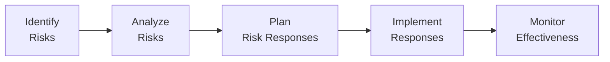

## 5.8 Optimizing Risk Responses

Project risk is inherent—no matter how flawlessly we plan, uncertainties remain. While identifying and assessing risks lay the groundwork for proactive project management, the real value lies in how effectively we respond to these uncertainties. Optimizing risk responses means selecting and implementing the most suitable strategies to manage negative risks (threats) and capitalize on positive risks (opportunities). This section delves into proven techniques and best practices that help project managers systematically prioritize, address, and monitor risks throughout the project life cycle.

A strong linkage exists between this topic and earlier chapters—particularly Chapter 14 (Uncertainty Performance Domain) and Chapter 22 (Risk and Uncertainty Management Revisited)—offering more extensive coverage of risk identification and analysis. The following discussion focuses specifically on response planning, implementation, and optimization to ensure risks are managed cumulatively and effectively.

---

### The Imperative of Optimizing Risk Responses

In the context of PMI’s 12 Project Management Principles, “Optimizing Risk Responses” embodies the practice of systematically evaluating potential threats and opportunities and deciding on actions that balance the project’s objectives with stakeholder expectations. Effective optimization requires:

• A thorough understanding of project goals, constraints, and success criteria.  
• Continuous engagement with relevant stakeholders, ensuring risk responses align with overarching business objectives.  
• Iterative re-assessment of risk response effectiveness, adapting strategies as new data emerges or project conditions change.  

Emphasizing risk response optimization fosters a proactive culture, reduces unnecessary uncertainties, and cultivates a climate of preparedness. This approach is not only required for exam success but also integral to delivering consistently high-performing projects in any domain or methodology—predictive, agile, or hybrid.

---

### Overview of Risk Response Process

Before focusing on optimization, it is helpful to recall the overall risk management process:

1. Identify Risks: Brainstorm potential threats and opportunities; record them in the risk register.  
2. Analyze Risks: Perform qualitative and/or quantitative analysis to prioritize and understand each risk’s impact and probability.  
3. Plan Risk Responses: Choose strategies to address high-priority risks in a way that aligns with project objectives.  
4. Implement Responses: Carry out the selected risk response actions, integrating them into project plans.  
5. Monitor Effectiveness: Track ongoing results, adjust where necessary, and ensure continuous improvement.

For optimization, effort centers on Steps 3 to 5, but success depends heavily on quality inputs from Steps 1 and 2.

---

### Strategies for Negative Risk (Threats)

Threats are potential events or conditions that, if they occur, can harm project objectives (scope, schedule, cost, quality). Common response strategies include:

Avoid  
• Strategy: Eliminate the threat entirely by adjusting project scope, schedule, or approach.  
• Example: A software team decides to remove a complex, high-risk module from the initial release to prevent potential schedule overruns.

Mitigate  
• Strategy: Reduce the probability or impact of the threat to an acceptable level.  
• Example: Allocating extra resources or adding additional testing phases to decrease the likelihood of a critical bug reaching production.

Transfer  
• Strategy: Shift the impact of the threat to a third party, typically through contractual agreements such as insurance, warranties, or outsourcing.  
• Example: Hiring a specialized vendor who bears the legal or technical risks of a critical project component.

Escalate  
• Strategy: Pass the risk to a higher-level authority (e.g., program or portfolio management) when it falls outside the scope or control of the project.  
• Example: A government regulation risk that requires C-suite intervention or specialized legal teams.

Accept  
• Strategy: Acknowledge the threat and do nothing proactively. Used when the risk is minor or no cost-effective response exists.  
• Example: A marketing campaign might accept a small chance of a website outage, relying on robust hosting but not investing in further prevention.

---

### Strategies for Positive Risk (Opportunities)

Opportunities are potential events or conditions that, if realized, can benefit the project. Key response strategies include:

Exploit  
• Strategy: Ensure the opportunity definitely happens.  
• Example: Scheduling a product demo at a major conference to guarantee widespread exposure.

Enhance  
• Strategy: Increase the probability or impact of the opportunity.  
• Example: Offering early-bird discounts to drive higher product pre-orders, boosting initial adoption.

Share  
• Strategy: Partner with a third party who can help leverage the opportunity for mutual gain.  
• Example: Co-developing a feature with another company that already has the technology or market reach to maximize impact.

Escalate  
• Strategy: Hand the opportunity to an entity better positioned to realize its benefits.  
• Example: Informing executive management about a strategic partnership that can only be pursued at the corporate level.

Accept  
• Strategy: Recognize the opportunity but take no additional measures to pursue it.  
• Example: The team acknowledges a chance to add a minor feature if time permits, but chooses not to invest additional funds or resources.

---

### Key Considerations for Selecting a Strategy

While the categories of responses for both threats and opportunities appear straightforward, deciding how best to optimize risk response strategies can be complex. Several considerations guide project managers to choose an optimal path:

Alignment with Project Objectives  
• Ensure the chosen response does not undermine the broader project vision or deliverables.  
• For example, removing a high-value functionality to avoid a threat might conflict with strategic goals.

Cost-Benefit Analysis  
• Evaluate if the effort or expense required to implement a response is justified by the risk’s potential impact.  
• For instance, the expense of specialized cybersecurity insurance might outweigh the cost of potential downtime, depending on system criticality.

Risk Appetite and Tolerance  
• Determine how risk-averse or risk-tolerant the organization and key stakeholders are.  
• This shapes whether you choose to avoid or exploit a risk, helping balance caution with innovation.

Resource Availability  
• Organizations might not have the resources or expertise to effectively implement certain responses, prompting transfer or escalation.  
• For example, relying on a third party (transfer) if internal capabilities are insufficient.

Potential Secondary Risks  
• Each response can generate new threats or opportunities.  
• For instance, accelerating the schedule might lead to errors in deliverables, or outsourcing might open the door to quality control issues.

---

### Techniques to Optimize Risk Response Strategies

After selecting the appropriate strategies, the process of optimization ensures the best outcome in a dynamic environment. Common techniques include:

Monte Carlo Simulation  
• Used during quantitative risk analysis to model different forecasts, measuring how changes in schedule, cost, or scope might alter risk outcomes.  
• Results help refine strategies—if uncertainties remain too high, managers may pivot to alternative responses.

Sensitivity Analysis (Tornado Diagrams)  
• Identifies which risks have the greatest potential impact on project objectives.  
• Allows the team to focus time and resources on high-leverage risks, thereby optimizing the overall response plan.

Decision Tree Analysis  
• Evaluates different response pathways and their expected monetary value (EMV).  
• Useful in cost-benefit comparisons where outcomes and probabilities can be quantifiably assigned.

Iterative Feedback Loops  
• Integral to agile or hybrid methods, continuous review and improvement cycles ensure the risk response remains valid as project conditions evolve.  
• This might involve sprint retrospectives or regular backlog grooming sessions where new risks are discovered and addressed.

Stakeholder Engagement and Expert Judgment  
• Collaboration with subject matter experts, sponsors, or external specialists can yield innovative or previously overlooked strategies.  
• Early and frequent stakeholder feedback fosters buy-in and ensures risk responses resonate with real-world scenarios.

---

### Integrating Risk Responses into the Project Plan

The best risk response strategies often fail due to lack of integration with the broader project plan. To successfully implement and monitor responses:

• Update the Risk Register: Document chosen strategies, triggers, and responsibilities.  
• Create or Revise the Schedule: Factor new tasks or buffer times into the project timeline.  
• Adjust Budgetary Requirements: Include any contingency or management reserves needed to carry out responses effectively.  
• Communicate Changes to Stakeholders: Inform everyone, from team members to executive sponsors, about changes in responsibilities or expectations.  
• Assign Risk Owners: Ensure each risk has a clear owner who leads response implementation and tracking.

---

### Monitoring and Measuring Risk Response Effectiveness

To optimize risk responses, monitoring must be systematic, using established metrics or Key Performance Indicators (KPIs) that highlight response performance. Consider:

• Frequency and Severity of Trigger Events: Have triggers been activated more often than anticipated? Are the impacts on schedule or budget within acceptable limits?  
• Earned Value Management (EVM) Metrics: Cost and schedule variances can signal emerging issues or highlight the success of risk responses.  
• Incident Logs and Lessons Learned: Maintaining a log of near-miss events or realized threats can expose patterns, guiding future refinement.  
• Regular Risk Review Sessions: Periodic risk reviews keep the conversation about risk open and transparent, allowing for ongoing response adjustments.

---

### Real-World Examples

Pharmaceutical Product Launch  
• Threat Identified: Delays in legal approvals could push back the market launch and undermine competitive advantage.  
• Response: Transfer by outsourcing regulatory compliance tasks to a legal firm specializing in pharmaceutical approvals. This approach reduced the potential for costly schedule overruns and reputational damage.  
• Monitoring: Monthly check-ins with the legal firm and internal compliance team, ensuring tasks remain aligned with the overall product release timeline.  

Customer Experience Program in a Retail Chain  
• Opportunity Identified: A new data analytics tool could provide more personalized shopping recommendations, boosting sales by 15%.  
• Response: Exploit by integrating these analytics into the point-of-sale systems quickly, ensuring immediate capture of benefits.  
• Monitoring: Tracking the change in average transaction value (ATV) and customer recurrence rates to confirm that the opportunity indeed yields incremental revenue.

Software Development for a Government Agency  
• Threat Identified: Rapidly changing regulations might require constant updates to the project scope, risking rework and timeline overages.  
• Response: Escalate to the organizational legal department to define a dedicated “Regulatory Updates Liaison,” ensuring real-time awareness of legislative changes.  
• Monitoring: Implement a weekly meeting between the development team and the liaison to confirm alignment on compliance changes.

---

### Common Pitfalls and How to Avoid Them

• Overreliance on a Single Strategy: Using “avoid or accept” for every threat or relying on “enhance” for every opportunity can create blind spots.  
• Inadequate Documentation: Lack of updated records makes it difficult to track whether responses are actually mitigating the risk as intended.  
• Failure to Establish Ownership: Without a designated risk owner, critical response actions may languish in a busy project environment.  
• Ignoring Secondary Risks: A short-sighted approach to risk response can introduce new threats that were never identified or addressed.  

---

### Best Practices for Stress-Free, Effective Risk Responses

• Involve the Whole Team: Encourage brainstorming and feedback from all project roles and expertise levels.  
• Incorporate Continuous Learning: Dedicate time at the end of each project or phase to revisit risk management practices and adapt them for future endeavors.  
• Combine Qualitative and Quantitative Methods: Balancing agile feedback loops, numeric simulations, and best-case scenario analysis provides a robust view of risk.  
• Align with Overall Business Strategy: Confirm that chosen responses make sense in the context of broader corporate objectives.

---

### References and Further Reading

• Project Management Institute. (2021). A Guide to the Project Management Body of Knowledge (PMBOK® Guide) – Seventh Edition.  
• Project Management Institute. (2019). Agile Practice Guide. PMI.  
• Hillson, D. (2009). Managing Risk in Projects. Routledge.  
• Hubbard, D. (2014). The Failure of Risk Management: Why It’s Broken and How to Fix It. Wiley.  
• PMIstandards+: Additional digital content expanding on the PMBOK® Guide’s risk management concepts.  

---

## Test Your Knowledge on Optimizing Risk Responses



### Which of the following strategies for threats eliminates the threat completely by changing the scope or approach?  
- [x] Avoid  
- [ ] Transfer  
- [ ] Escalate  
- [ ] Accept  

> **Explanation:** The “Avoid” strategy seeks to eliminate the threat entirely, often by changing the project scope or approach so that the risk no longer applies.

### Which technique helps identify which risks have the greatest potential impact on project outcomes by modeling multiple scenarios?  
- [ ] Checklists  
- [x] Monte Carlo Simulation  
- [ ] Cost of Quality  
- [ ] Benchmarking  

> **Explanation:** Monte Carlo Simulation performs numerous iterations to predict the range of possible outcomes, revealing which risks most significantly affect project objectives.

### An opportunity has been identified in your project that could increase your market share significantly if implemented. Which strategy focuses on making sure the opportunity definitely occurs?  
- [ ] Accept  
- [ ] Enhance  
- [ ] Escalate  
- [x] Exploit  

> **Explanation:** “Exploit” assures an opportunity definitely materializes, typically by committing time and resources toward implementing that potential benefit.

### If a certain risk is beyond the control of the project team, and it needs higher-level oversight to be effectively managed, the most suitable response strategy is to:  
- [ ] Mitigate  
- [x] Escalate  
- [ ] Transfer  
- [ ] Avoid  

> **Explanation:** Escalate is the preferred choice for dealing with a risk or opportunity that falls outside the project’s control, requiring broader or more senior engagement.

### When deciding among risk response strategies, one primary factor to consider is the project’s:  
- [x] Risk Appetite and Tolerance  
- [ ] Demographics  
- [ ] Global Brand Recognition  
- [ ] Marketing Budgets  

> **Explanation:** The organization’s risk appetite and tolerance strongly guide the selection of strategies, influencing whether the team takes an offensive or defensive stance.

### In agile settings, how can risk response strategies be repeatedly validated and improved?  
- [x] Iterative feedback loops  
- [ ] Extended Waterfall planning  
- [ ] Escalation to outside experts only  
- [ ] Strictly through cost variance  

> **Explanation:** Agile emphasizes frequent revisions and continuous feedback loops (e.g., in sprint retrospectives), enabling timely improvements to risk response strategies.

### Which of the following statements is true about secondary risks?  
- [x] They may arise from implementing a chosen response strategy.  
- [ ] They are risks only relevant to cost management.  
- [x] They can sometimes reveal opportunities as well.  
- [ ] They never affect project schedules.  

> **Explanation:** Secondary risks emerge as a direct result of taking steps to address an existing threat or opportunity. Some might also shed light on new chances to improve outcomes.

### A pharmaceutical project has a tight regulatory schedule. Which threat response strategy involves paying an external firm to handle complex legal approvals?  
- [ ] Mitigate  
- [x] Transfer  
- [ ] Accept  
- [ ] Avoid  

> **Explanation:** In this scenario, the project is transferring risk to an external firm that assumes responsibility for legal approvals, removing that burden from the internal project team.

### Which factor typically drives a project manager to choose “Accept” as a response strategy for both threats and opportunities?  
- [x] The cost or feasibility of other strategies outweighs the potential impact.  
- [ ] The risk is mandatory and cannot be changed.  
- [ ] Stakeholders have no opinion.  
- [ ] Ethical obligations prevent further action.  

> **Explanation:** Accept is often used when the resource expenditure required to address a risk is not justified by its likelihood or impact, or no feasible strategies exist.

### Identifying, prioritizing, and strategically addressing threats and opportunities can lead to higher project success because:  
- [x] It aligns risk responses with project objectives, saving time and resources in the long run.  
- [ ] It ensures that every risk is eliminated from the project scope.  
- [ ] It focuses on controlling only financial risks.  
- [ ] It prevents the use of agile or hybrid approaches.  

> **Explanation:** When project objectives guide risk response decisions, the team can allocate resources effectively, minimize disruptions, and capitalize on beneficial events.



---

## PMP Mastery: 1500+ Hard Mock Exams with Full Explanations 

Looking to crush the PMP exam with confidence? Dive deep into 6 rigorous mock exams totaling 1500+ advanced-level questions, each accompanied by clear, step-by-step explanations. Hone your test-taking strategies, master complex topics, and build the resilience you need on exam day. Perfect for serious PMs aiming beyond fundamentals.

Enroll now:  
[PMP Mastery: 1500+ Hard Mock Exams with Exceptional Clarity & Full Explanations](https://www.udemy.com/course/pmp-2025/?referralCode=CF83A54BC86BE27F9AFE)

_Disclaimer: This course is not endorsed by or affiliated with the PMI examination authority. All content is provided purely for educational and preparatory purposes._
