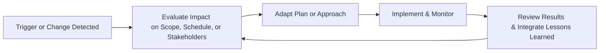
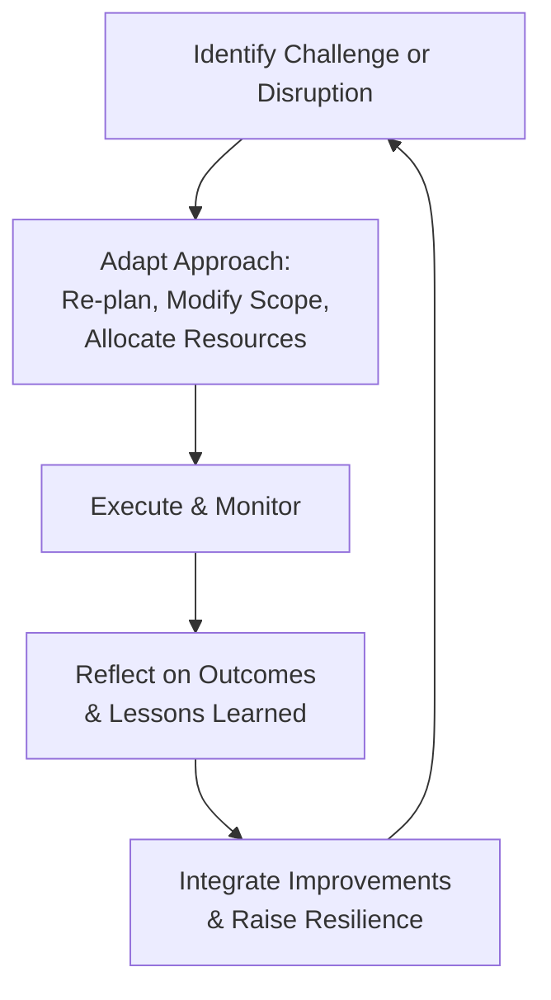

## 5.9 Embracing Adaptability and Resilience

When leading projects under dynamic market conditions, organizational shifts, or unforeseen disruptions, the ability to adapt swiftly and respond effectively to change can make the difference between success and failure. Adaptability and resilience go hand in hand: adaptability ensures that teams and project leaders can pivot quickly in response to scope, schedule, or stakeholder changes, while resilience equips them to maintain consistency and quality even when confronted with challenges or setbacks. This principle—“Embracing Adaptability and Resilience”—is central to ensuring that projects continue delivering value under any circumstances. In this section, we explore why adaptability and resilience are critical success factors, how to cultivate these qualities in project teams, and practical ways to implement them across predictive, agile, and hybrid environments.

### Understanding Adaptability

Adaptability involves responding to changes—whether expected or unexpected—smoothly, without becoming overwhelmed by modified objectives or constraints. In the context of project management:

• It enables project teams to reevaluate goals whenever significant variances or new opportunities arise.  
• It involves a proactive approach to monitoring the project environment, staying aware of potential changes, and having a plan in place to execute swift course corrections.  
• It acknowledges that rigid plans are less effective in environments characterized by constant learning, continuous feedback, or evolving stakeholder requirements.

In agile settings, adaptability is a cornerstone principle embodied in iterative planning, incremental flow of deliverables, and frequent refinements. However, adaptability is equally vital in predictive environments, where establishing formal change control mechanisms and fostering an environment of continuous improvement can help maintain flexibility.

### Understanding Resilience

Resilience is the capacity to recover quickly from difficulties and thrive in the face of adversity. While adaptability focuses on how quickly a project manager or team can change direction, resilience emphasizes how well they can absorb shocks, recover, and remain productive or even use adversity to gain strength. Resilience expresses itself on multiple levels:

• Individual resilience: Each team member’s ability to manage stress and maintain performance under changing or adverse conditions.  
• Team resilience: How well the group supports one another, learns from failures, and continues to collaborate effectively despite setbacks.  
• Organizational resilience: The organization’s ability to anticipate threats, design robust processes, and remain operationally agile.

A resilient project environment helps prevent small disruptions from evolving into larger crises. It places emphasis on reflective learning (see Chapter 11: Project Work Performance Domain for additional discussion on lessons learned) and continuous improvement.

### The Value of Adaptability and Resilience in Projects

Projects rarely proceed exactly as planned. Market conditions can shift, and stakeholders might propose scope changes. A global pandemic or supply chain disruption might force a redefinition of core objectives. Adaptable and resilient teams:

• Recognize that change is inevitable and incorporate feedback loops for early detection.  
• Continuously refine their approach, taking into account new data, lessons learned, and evolving stakeholder priorities.  
• Foster psychological safety so that team members can experiment, fail fast, recover, and share insights openly.  
• Build stronger stakeholder relationships through consistent communication, empathy, and understanding of changing stakeholder needs.

By weaving adaptability and resilience into the project culture, project managers can leverage uncertainty for innovation rather than viewing it purely as a threat.

### Managing Scope, Schedule, and Stakeholder Changes Through Adaptability

A hallmark of project management involves balancing project constraints (scope, schedule, cost, quality, resources, risk) in the face of evolving demands. Adjustments to scope or schedule are among the most frequent changes project managers face:

• Scope changes: These may arise from poorly defined requirements, evolving market trends, or stakeholder feedback. Effective scope management (see Chapter 17: Scope and Requirements Management) involves continuous validation and prioritization of scope elements.  
• Schedule changes: Regulatory delays, resource shortages, or technology hurdles can push out deadlines. Proactive schedule management (see Chapter 18: Schedule Management) and continuous risk monitoring help identify potential schedule slippages early.  
• Stakeholder changes: A new sponsor, shift in leadership, or changes in regulatory frameworks may force an overhaul of project priorities or deliverables. A project manager equipped with robust stakeholder engagement strategies (see Chapter 16: Stakeholder and Communications Management) will more effectively communicate updates and mitigate dissatisfaction.

Adaptable leaders stay alert to signals that changes may be on the horizon, preparing contingency plans or alternative pathways rather than reacting when problems escalate. This idea closely aligns with risk management approaches (discussed in Chapter 14: Uncertainty Performance Domain and Chapter 22: Risk and Uncertainty Management).

Below is a simplified flowchart illustrating one approach to adapting quickly to a scope or schedule change:

In this cycle:  
1. A change trigger is identified—perhaps a new stakeholder request.  
2. The team evaluates impact on cost, scope, schedule, or resource allocations.  
3. The plan or delivery approach is adapted to incorporate the change.  
4. Teams implement and monitor changes in real-time.  
5. Results are reviewed, lessons are documented, and improvements feed back into the adaptation cycle.

### Cultivating Resilience in Project Teams

Project teams develop resilience by reinforcing supportive structures that promote learning, collaboration, and trust. The following factors promote resilience:

• Psychological Safety. When team members feel safe admitting mistakes or acknowledging uncertainties, potential issues surface early and can be addressed before they escalate. This fosters a learning environment where risks can be openly discussed.  
• Autonomy and Empowerment. Giving team members ownership of tasks encourages them to identify potential threats and opportunities early. Empowered individuals adapt more readily and are better prepared to handle unexpected situations.  
• Strong Communication Channels. Regular check-ins, daily standups (see Chapter 26: Key Agile Events and Artifacts), and open communication lines keep everyone informed. Rapid knowledge sharing accelerates the team’s capacity to adapt and recover from setbacks.  
• Continuous Improvement and Reflection. Routinely review processes and outcomes to spot improvement areas. A team that values lessons learned and integrates them into future iterations (see Chapter 11: Project Work Performance Domain) becomes naturally more resilient over time.

### Adapting Across Delivery Approaches

Every project life cycle—predictive, agile, or hybrid—can benefit from adaptability and resilience:

• Predictive (Waterfall) Projects: Include robust change management processes from the start. Maintain an integrated change control board (see Chapter 15: Integration Management), regularly update baselines, and conduct frequent risk reviews to mitigate any emerging issues.  
• Agile Projects: Emphasize iterative planning, collaborative reflection (e.g., scrum retrospective), and cross-functional teams. The entire agile framework is designed to adapt quickly by re-prioritizing backlogs, updating requirements each iteration (see Chapter 25: Agile Frameworks and Methodologies).  
• Hybrid Projects: Combine predictive discipline (such as scope or schedule control boards) with agile flexibility to pivot quickly. Regular governance checkpoints (see Chapter 27: Hybrid Approaches) ensure changes are integrated effectively without compromising the project’s overall vision.

### Strategies for Strengthening Adaptability and Resilience

1. Early Warning Systems  
   Proactive risk detection and early response enable immediate action. Techniques like risk identification workshops, frequent stakeholder check-ins, or reviewing metrics on a project dashboard (see Chapter 13: Measurement Performance Domain) can reveal looming threats and opportunities.

2. Agile Mindset  
   Even if the project life cycle is predominantly predictive, adopting an agile mindset—characterized by valuing people over processes, acknowledging changing conditions, and encouraging frequent inspection and adaptation—enhances overall adaptability.

3. Scenario Planning  
   Teams outline various “what-if” scenarios (e.g., resource shortage, major scope shift, new stakeholder demands) and plan potential responses in advance. This exercise is especially pertinent for large or complex initiatives, multi-stakeholder projects, or in uncertain industries such as software, healthcare, or aerospace.

4. Buffering and Contingency  
   Resilience can be amplified by building buffers into the project’s schedule or budget, such as management reserves explicitly set aside for unforeseen changes. While these buffers may not always be used, having them in place reduces panic when an unplanned risk materializes.

5. Transparent Leadership  
   Leaders who address issues openly and encourage transparent communication set the tone for how teams respond to unexpected developments. Cultivating trust helps individuals share good or bad news early, preventing small hiccups from spiraling into major crises.

### Case Study: Software Implementation Amid Scope Changes

Imagine a cross-functional team implementing a new customer relationship management (CRM) solution. Initially, the scope was to migrate an existing database and set up basic configuration for the sales department. However, a month into the project, the marketing department requested custom dashboards to track social media engagement. This additional requirement significantly expanded the project’s scope and threatened the established timeline.

• Adaptability in Action:  
  The project manager convened a quick impact assessment session, evaluating the effort and cost required for the new dashboards. After receiving input from the sponsor and collecting data on potential ROI, the team adjusted the scope to include these dashboards, added an additional UI/UX specialist, and developed a revised schedule.  
• Building Resilience:  
  Although some team members felt stressed about the late addition, the project manager fostered open communication. Daily standups highlighted potential roadblocks, and a risk assessment identified tasks that could be deferred if further delays arose. This agile mindset not only accommodated the marketing department’s request but also discovered new insights on how CRM data could support future market campaigns. The team completed the project on the revised schedule, retaining stakeholder satisfaction and critical user adoption rates.

### Tools and Techniques for Embracing Adaptability and Resilience

1. **Kanban Boards or Task Boards:** Visual tools that allow tracking of work in progress, making it easier to adapt tasks and priorities in real-time.  
2. **Rolling Wave Planning:** A technique in predictive or hybrid methodologies where teams plan in detail only the immediate or current phase and keep future phases at a higher level until more clarity emerges (see Chapter 10: Planning Performance Domain).  
3. **Scrum Ceremonies:** Iteration planning, daily standup, sprint review, and retrospective—in agile environments—are all opportunities to learn rapidly and pivot quickly.  
4. **Monte Carlo Simulations:** For more complex risk assessments, simulations help predict cost or schedule fluctuations. As circumstances change, these simulations can be updated for real-time risk forecasting.  
5. **Stakeholder Collaboration Tools:** Digital collaboration platforms that facilitate synchronous and asynchronous communication across distributed teams. They improve transparency and accelerate responses to changes in scope or feedback.

### Pitfalls and Common Challenges

• Overemphasis on Plan Certainty: Some project teams place excessive confidence in initial plans, resisting any adaptation. This rigidity can cause them to miss opportunities or become overwhelmed once significant changes occur.  
• Inadequate Communication: Even if a team is highly adaptable, poorly executed communication strategies (e.g., failing to inform stakeholders or ignoring cross-functional dependencies) can generate confusion and misalignment.  
• Insufficient Risk Management: Teams that regard risk management as a mere formality often fail to detect the early signs of major changes. Adding a robust risk register, timely risk reviews, and contingency planning can significantly improve adaptability.  
• Lack of Team Empowerment: If decision-making is overly centralized, project managers might become bottlenecks. Empowered teams can adjust minor details rapidly and escalate critical issues promptly without waiting through extended approval processes.

### Building a Culture That Embraces Adaptability and Resilience

Adopting adaptable and resilient behaviors often requires organizational backing. Below are strategies to help teams thrive:

• **Sponsor Support**: Ensure senior executives or project sponsors recognize the importance of flexibility and resilience. Their visible endorsement fosters top-down acceptance of necessary changes.  
• **Learning & Development**: Provide continuous training on agile methods, risk management, and emotional resilience to equip team members with the knowledge they need to be proactive.  
• **Reward Systems**: Recognize and incentivize responsiveness and creative problem-solving. Reward initiatives that identified and mitigated potential roadblocks before they caused disruptions.  
• **Transparency with Stakeholders**: When scope needs to pivot, proactively inform and engage key stakeholders. Demonstrating how changes lead to improved results creates a collaborative rather than adversarial tone.

### Diagram: The Adaptability–Resilience Cycle

Below is a high-level view of how adaptability (continuous response to change) and resilience (ability to withstand shocks and bounce back) interrelate throughout a project, supporting a healthy cycle of growth:

**Explanation:**  
• Challenges or disruptions (A) may emerge from external changes or internal project variations.  
• Teams adapt their approach (B) by adjusting plans or scope.  
• Execution proceeds, and progress is monitored (C).  
• The team evaluates results (D) to understand what worked and what did not.  
• Improvements are integrated (E) into the next iteration, strengthening the team’s overall resilience and setting the team up for more effective adaptation when the next challenge arises (returning to A).

### References for Further Exploration

• PMI’s PMBOK® Guide – Seventh Edition: Focus on the principle of “Navigating Complexity” and check PMIstandards+ for application guidance.  
• “Managing Transitions” by William Bridges: Insight into navigating organizational and personal change.  
• “Resilient Organizations” by Erica Seville: Introduces frameworks on building operational resilience across different industries.  
• “The Fifth Discipline” by Peter Senge: Explores systems thinking, which is closely connected to resilience and adaptability in complex environments (see Chapter 32: Complex Adaptive Systems and Systems Thinking).

### Conclusion

Adaptability and resilience are not optional extras; they are essential for any project team operating in a world marked by constant change. By anticipating and responding to emerging challenges, learning from both successes and failures, and remaining focused on value delivery, project managers cultivate a project environment that not only survives adversity but thrives on it. Whether your project follows a predictive, agile, or hybrid path, embracing adaptability and resilience is the sure way to keep your stakeholders engaged, your teams motivated, and your projects on track for delivering meaningful and lasting outcomes.

## Adaptability and Resilience Mastery Quiz



### Embracing adaptability in project management primarily means:
- [ ] Adhering to the baseline plan no matter what changes occur.
- [x] Being prepared to quickly modify approaches and strategies as new information or requirements arise.
- [ ] Stopping all work whenever a small change is detected.
- [ ] Eliminating risk by planning extensively upfront.

> **Explanation:** Adaptability involves rapidly modifying the project plan in response to updated insights or changing conditions, rather than stubbornly adhering to an outdated plan.

### Which factor best describes resilience in project teams?
- [x] The ability to recover rapidly from setbacks and maintain performance.
- [ ] The ability to avoid any kind of conflict by rigid rules.
- [ ] The ability to rely solely on a single solution.
- [ ] The capability to micromanage every detail of team assignments.

> **Explanation:** Resilience underlines how teams cope with adversity and quickly rebound, leveraging lessons learned to remain productive and collaborative.

### What is a common sign of overemphasizing baseline certainty in a project?
- [x] A rigid mindset that resists making necessary adjustments until crises emerge.
- [ ] Frequent communication with stakeholders.
- [x] Excessive changes that cause rework.
- [ ] Using rolling wave planning in uncertain projects.

> **Explanation:** Overreliance on baseline plans can create an environment where the team is unwilling or slow to adapt, turning minor issues into major problems. Additionally, the question includes a second correct answer regarding frequent rework that arises from ignoring small changes until they become large.

### How do buffers (e.g., schedule or budget contingencies) enhance resilience?
- [x] They provide a cushion that allows teams to absorb unforeseen changes without jeopardizing the project.
- [ ] They eliminate the need for communication in times of crisis.
- [ ] They guarantee no variation from the baseline plan.
- [ ] They reduce the frequency of stakeholder communication.

> **Explanation:** Including time or cost contingencies helps a project absorb shocks from unexpected events, supporting rapid calibration rather than scrambling for ad hoc solutions.

### Which approach best illustrates adaptability in an agile project?
- [x] Continuously refining backlog items and adjusting sprint goals based on feedback.
- [ ] Locking scope for the entire project duration after initial planning.
- [x] Relying on daily updates from the development team about potential interventions.
- [ ] Restricting stakeholder access to the project’s backlog until final delivery.

> **Explanation:** Agile methods rely on iterative and incremental adjustments to scope, tasks, and priorities based on continuous feedback loops. Daily communication with the dev team about issues is also a sign of adaptability.

### What is a key advantage of forming a psychologically safe environment for teams?
- [x] It encourages individuals to highlight issues without fear, leading to faster identification and resolution of potential risks.
- [ ] It restricts open communications to only senior management.
- [ ] It forces teams to follow strict rules to reduce risk-taking.
- [ ] It ensures changes occur only after a full steering committee review.

> **Explanation:** Psychological safety fosters open dialogue, enabling teams to surface problems quickly. This open culture is critical in building resilient teams that effectively adapt to change.

### How do daily standups or routine check-ins enhance team adaptability?
- [x] They allow teams to identify and discuss roadblocks or issues promptly, enabling quick pivots.
- [ ] They reduce the overall project timeline automatically.
- [x] They remove the need for formal communication channels altogether.
- [ ] They eliminate the need to track tasks elsewhere.

> **Explanation:** Daily check-ins provide an immediate forum to raise obstacles, coordinate priorities, and adapt plans in real-time. They do not remove the need for formal communication but rather complement it.

### What is a potential pitfall when adopting hybrid project approaches to handle change?
- [x] Failing to synchronize predictive governance processes with agile iteration cycles, leading to misalignments.
- [ ] Consistently using an integrated change control process.
- [ ] Keeping a flexible backlog for updates.
- [ ] Communicating with stakeholders frequently.

> **Explanation:** Hybrid environments can suffer from a lack of coordination between iterative and predictive elements. Misalignment between a formal change control board and agile sprints is a frequent pitfall.

### In scenario planning for uncertain environments, which statement is accurate?
- [x] Teams identify multiple possible futures, each requiring a different potential response.
- [ ] The best approach is to fix a single baseline and not deviate from it.
- [ ] Stakeholders are minimally involved in planning for uncertain events.
- [ ] Scenario planning only applies to small, predictable changes.

> **Explanation:** Scenario planning explores various plausible situations so the team can formulate flexible responses ahead of time, reducing surprise and improving resilience when a scenario materializes.

### A resilient project team, when faced with an unexpected staffing reduction, would likely:
- [x] Reapportion responsibilities, communicate openly about workloads, and adapt to maintain key deliverables.
- [ ] Immediately halt all project work until older staff return.
- [ ] Attempt to hide the resource shortfall from the client.
- [ ] Complain about the situation without proposing constructive solutions.

> **Explanation:** Resilience manifests as proactive problem solving: the team would communicate changes promptly, adjust work distribution, and seek creative solutions to continue driving the project forward.



## PMP Mastery: 1500+ Hard Mock Exams with Full Explanations 

Looking to crush the PMP exam with confidence? Dive deep into 6 rigorous mock exams totaling 1500+ advanced-level questions, each accompanied by clear, step-by-step explanations. Hone your test-taking strategies, master complex topics, and build the resilience you need on exam day. Perfect for serious PMs aiming beyond fundamentals.  

Enroll now:  
[PMP Mastery: 1500+ Hard Mock Exams with Exceptional Clarity & Full Explanations](https://www.udemy.com/course/pmp-2025/?referralCode=CF83A54BC86BE27F9AFE)

_Disclaimer: This course is not endorsed by or affiliated with the PMI examination authority. All content is provided purely for educational and preparatory purposes._
