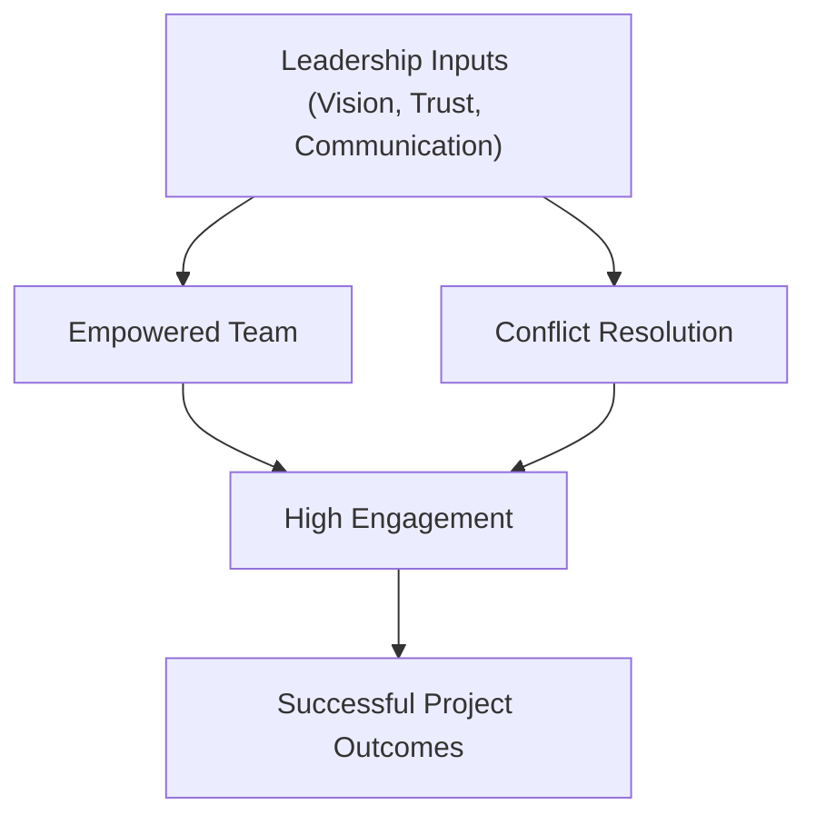

## 6.1 People Domain: Leading and Empowering Teams

Effective project management is not solely about meeting deadlines, controlling budgets, and delivering results; it also hinges on guiding people and fostering collaborative, high-performing teams. The People Domain covers a broad range of leadership behaviors, including setting a vision, building trust, motivating individuals, resolving conflict, and spearheading change. Understanding this domain is critical to ensuring project success because people are the primary drivers behind any endeavor’s success or failure. In this section, we will delve into the competencies, strategies, and tools project managers must master to effectively lead and empower their teams.

---

### The Role of Leadership in the People Domain

The People Domain places significant emphasis on leadership because project managers play a pivotal role in motivating, addressing risks emerging from interpersonal challenges, and aligning team efforts toward the project’s goals. Regardless of the project environment—predictive, agile, or hybrid—individuals flourish under a leader who can unite them around shared values and objectives.

• Leadership vs. Management:  
  - Management focuses on planning, organizing, and coordinating day-to-day tasks.  
  - Leadership centers on inspiring the team, providing direction, and facilitating personal development.  

• Servant Leadership:  
  - Anecdotal evidence and research alike have shown that servant leadership—where the leader supports team members by removing obstacles and promoting a collaborative environment—improves engagement and morale.

• Adaptive Leadership:  
  - Different situations require different leadership styles. Adaptive leaders diagnose the context, respond with agility, and select approaches that resonate best with team members and stakeholders.

---

### Empowering Teams for High Performance

Empowering teams means granting autonomy while providing an environment where members can exercise creativity, accountability, and self-organization. Project managers who encourage high levels of empowerment typically see increased commitment, innovation, and resilience within their teams.

• Autonomy and Delegation:  
  - Assign responsibilities and decision-making authority to the people closest to the work, enabling them to take ownership. Micro-managing dampens creativity and motivation.

• Psychological Safety:  
  - Teams perform best when members can speak openly without fear of punishment or ridicule. Psychological safety fosters honesty, quick issue escalation, and rapport.

• Shared Commitment and Accountability:  
  - Team norms and social contracts ensure everyone knows where they stand. When setting goals, ensure each member understands their role in achieving them—from quality deliverables to timely updates.

• Continuous Learning Environment:  
  - Offer opportunities for training, skill development, and knowledge sharing. Whether through lunch-and-learn sessions or scheduled retrospectives, encouraging learning keeps momentum high.

---

### Key Competencies and Behaviors

Leadership in the People Domain is shaped by a set of competencies and behaviors that, when combined, create a culture of empowerment and high-performance. Some of these are explored below.

#### Emotional Intelligence (EI)

Emotional Intelligence (EI) is the ability to identify, understand, and respond effectively to one’s own emotions and the emotions of others. EI helps project managers gauge team morale and address friction before it escalates.

• Self-awareness: Recognizing your own triggers and limitations.  
• Self-regulation: Controlling emotional impulses; remaining calm and solution-focused under stress.  
• Empathy: Making a genuine effort to understand others’ perspectives, fostering compassion and trust.  
• Relationship Management: Building and maintaining healthy relationships through constructive communication and feedback.

#### Communication and Active Listening

Effective communication is the cornerstone of positive team dynamics. It extends beyond simply conveying a message to actively listening, validating concerns, and ensuring that every individual feels heard.

• Conveying Clarity: Provide concise, specific instructions.  
• Inclusive Communication: Engage diverse viewpoints; adapt language, style, or channel for each stakeholder group.  
• Feedback Loops: Encourage continuous feedback, both formal (performance reviews, retrospectives) and informal (quick check-ins, real-time coaching).

#### Cultural Sensitivity and Inclusion

Globalization increasingly shapes project environments, requiring managers to navigate language barriers, divergent time zones, and unique cultural nuances.

• Cultural Intelligence: Demonstrating respect and willingness to learn.  
• Inclusive Decision-Making: Inviting perspectives from different backgrounds.  
• Accommodation of Varied Schedules: Flexibly addressing religious or regional holidays and time-zone differences to foster goodwill.

---

### Conflict Resolution as a Core Leadership Skill

Conflict is inevitable in any environment where diverse people collaborate. The methods you use to address conflict can either strengthen or weaken relationships. Being proactive and constructive about conflict resolution is essential for high-performing teams.

#### Common Causes of Conflict

• Role Ambiguity: Unclear roles or shifting responsibilities.  
• Resource Constraints: Competition for limited budgets or staff.  
• Scheduling Pressures: Unrealistic timelines leading to tension.  
• Interpersonal Differences: Clashing personalities or communication styles.  

#### Conflict Resolution Techniques

The PMBOK® Guide highlights five principal conflict resolution methods—each useful in specific contexts:

• Avoiding (Withdraw):  
  - Used when the issue is minor, or emotions are high and a cooling-off period is beneficial.  
  - Risk: Unresolved disputes may resurface later, causing more significant tension.

• Accommodating (Smoothing):  
  - Emphasize areas of agreement, relinquish personal interests for the group’s benefit.  
  - Risk: Overuse may lead to decreased personal agency and resentment.

• Compromising (Reconciling):  
  - Both parties concede aspects of their position to reach a middle ground.  
  - Risk: The solution may not fully satisfy either party, creating latent dissatisfaction.

• Forcing (Directing):  
  - Imposing a solution quickly.  
  - Risk: Potential damage to relationships if mandated solutions ignore others’ perspectives.

• Collaborating (Problem Solving):  
  - Aims for a win-win outcome by addressing underlying interests.  
  - Time and resource intensive, but typically yields strong team cohesion.

---

### Negotiation Tactics to Build Trust and Consensus

Negotiation in a project setting often revolves around resource allocation, scope refinement, or reconciling competing stakeholder interests. Effective negotiation requires balancing assertiveness with empathy.

• Principled Negotiation:  
  - Focus on mutual gains and objective criteria.  
  - Separate people from the problem; avoid personal attacks or assumptions.

• BATNA (Best Alternative to a Negotiated Agreement):  
  - Know your fall-back plan if negotiations fail.  
  - This clarity strengthens your confidence and calmness in proceedings.

• Relationship-Oriented Tactics:  
  - Rather than seeing negotiation as a contest, treat it as a problem-solving activity.  
  - Building goodwill can pay off in future interactions, promoting a collaborative culture.

• Closing the Deal:  
  - Ensure negotiated outcomes are documented.  
  - Define roles and responsibilities for follow-through so that agreements come to fruition.

---

### Stages of Team Development

Many teams traverse a predictable path of development. As a project manager, understanding these stages, often referred to as Tuckman’s stages, enables you to calibrate leadership style and interventions.

• Forming: Members are eager but uncertain about their roles. Leaders must provide direction and structure.  
• Storming: Conflicts emerge as individuals assert their viewpoints. Leaders should employ conflict resolution techniques to unify the team.  
• Norming: The team begins to cohere around shared norms and values. Collaboration improves, roles become clearer, and performance stabilizes.  
• Performing: The team achieves high efficiency, making decentralized decisions and self-organizing effectively. Leaders focus on strategic steering and removing roadblocks.  
• Adjourning: The project nears completion, and the team disbands. Leaders should ensure knowledge transfer and celebrate accomplishments.

---

### Motivational Theories and Their Application

Project managers need to not only set goals but also inspire individuals to achieve them. Familiarity with motivational theories helps identify what drives team members to excel.

• Maslow’s Hierarchy of Needs:  
  - Project managers should realize that basic needs, such as job security or equitable compensation, must be met before higher-level motivators (like creativity or self-actualization) come into play.

• Herzberg’s Two-Factor Theory:  
  - Hygiene factors (salary, workspace) prevent dissatisfaction but do not themselves motivate.  
  - Motivators (recognition, growth opportunities) increase job satisfaction and commitment.

• McClelland’s Theory of Needs:  
  - Achievement: Striving for excellence, setting meaningful goals.  
  - Affiliation: Seeking harmonious relationships and collaboration.  
  - Power: Desire for influence and responsibility.

• Self-Determination Theory:  
  - Emphasizes autonomy, competence, and relatedness as the pillars of intrinsic motivation.  
  - Encourages giving team members choice in task execution, providing feedback to improve competence, and fostering social connection.

---

### Practical Approaches to Empowering Teams

Empowerment in project settings can be realized through specific techniques, roles, and frameworks. While many agile or hybrid environments embody these principles, they can be adapted to predictive approaches as well.

• RACI Chart (Responsible, Accountable, Consulted, Informed):  
  - Clarify team responsibilities and ensure no tasks fall through the cracks.  
  - Minimizes overlap, confusion, and potential turf wars.

• Self-Organizing Teams:  
  - Common in agile frameworks such as Scrum, where teams plan and commit to tasks in each iteration.  
  - Encourages accountability, fosters collaboration, and accelerates adaptability.

• Delegating Decision-Making:  
  - For routine decisions, empower team members. Reserve your involvement for strategic or risk-intensive decisions.  
  - Builds a sense of ownership and sharpens decision-making skills across the team.

• Knowledge Sharing Sessions:  
  - Conduct demos, peer reviews, or presentations to share lessons learned.  
  - Encourages cross-functional skill-building and breaks silos.

---

### Common Pitfalls

Despite best efforts, certain traps can undermine team leadership. Recognizing them early can prevent significant setbacks:

• Overreliance on Authority:  
  - Project managers who lean too heavily on formal power can stifle team creativity and encourage passivity.

• Fragmented Information Flow:  
  - Withholding or unevenly distributing crucial data leads to mistrust and errors. Transparent communication is key.

• Avoiding Conflict:  
  - Letting tensions simmer can diminish morale and lead to more disruptive confrontations later.

• Misaligned Rewards:  
  - Individual bonuses or recognition programs that ignore collective efforts may foster unhealthy competition.

• Inadequate Feedback Loops:  
  - Delaying feedback or delivering it only annually can lead to misaligned performance objectives and missed improvement opportunities.

---

### Best Practices for Leading and Empowering Teams

• Foster Open Communication:  
  - Encourage question-asking, knowledge-sharing, and honest discussion to maintain a flow of accurate, real-time information.

• Demonstrate Consistency:  
  - Follow through on commitments. Inconsistencies in rules or expectations breed confusion and conflict.

• Reward Teamwork:  
  - Celebrate noteworthy team achievements. Highlight collaborative behaviors such as cross-functional problem solving or knowledge-sharing that yield positive results.

• Encourage Intrinsic Motivation:  
  - Provide growth opportunities—cross-training, job rotation, or leadership of sub-projects. Give constructive feedback that focuses on growth rather than blame.

• Model the Way:  
  - Exhibit the exact behaviors you want to see from the team. Professional courtesy, integrity in meeting deadlines, and clarity in communication set the template for others.

---

### Real-World Case Example: High-Performing Cross-Functional Team

Consider a cross-functional software development project involving testers, developers, UX designers, and a business analyst. The project manager embraced a servant-leadership approach, removing administrative bottlenecks and providing each role with the necessary resources. The team was empowered to select sprint tasks aligning with their expertise and got direct access to the project’s main stakeholder group for clarifications.

Midway through the project, conflicts arose about how features should be prioritized. Instead of dictating a solution, the project manager employed collaborative conflict resolution: each group presented data to support their perspective, clarifying the impact on user experience, budget, and schedule. They reached a consensus driven by objective, user-centric requirements. Team morale soared, turnover was minimal, and the project delivered features that exceeded user expectations while remaining on time and within budget—a textbook illustration of leading and empowering a team in action.

---

### Supporting Tools and Techniques

Below is a simple diagram illustrating how key leadership actions feed into team empowerment and conflict resolution.

Project managers can combine various tools and techniques to solidify these connections:

• Regular Check-Ins: Short daily or weekly standups focus teams and help identify issues early.  
• Retrospectives: Common in agile settings but equally beneficial in predictive projects for continuous improvement.  
• Clear Documentation: Well-maintained project documentation fosters transparency, ensuring everyone has access to the same factual base.  
• Collaborative Platforms: Tools like project boards (e.g., Scrum/Kanban boards) or knowledge repositories reduce rework and keep everyone aligned.

---

### References for Further Exploration

• Project Management Institute (PMI), “PMBOK® Guide – Seventh Edition”  
• Daniel Goleman, “Emotional Intelligence”  
• Patrick Lencioni, “The Five Dysfunctions of a Team”  
• Ken Blanchard, “Leading at a Higher Level”  
• PMI, “Agile Practice Guide”  

These references offer more nuanced insights into team empowerment, leadership styles, and how to effectively manage interpersonal dynamics in project settings.

---

## Test Your Mastery of Leading and Empowering Teams



### Which of the following best describes servant leadership?

- [ ] A leadership approach focused on top-down authority and directive commands.  
- [x] A mindset where the leader removes obstacles and fosters autonomy among team members.  
- [ ] A management style that emphasizes micromanagement and centralized control.  
- [ ] A negotiation tactic for pressuring team members toward consensus.  

> **Explanation:** Servant leadership emphasizes helping teams by eliminating barriers, providing support, and enabling autonomy. It stands in contrast to micromanagement or authoritative styles.

### What is the primary purpose of employing conflict resolution strategies?

- [ ] To avoid all forms of disagreement.  
- [x] To address misunderstandings and ensure the team remains cohesive and productive.  
- [ ] To highlight individual weaknesses.  
- [ ] To prolong project negotiations.  

> **Explanation:** Conflict resolution is meant to strengthen working relationships, clarify misunderstandings, and maintain a positive project environment. Avoiding disagreements entirely or highlighting weaknesses is counterproductive.

### Which conflict resolution technique involves both parties giving up aspects of their position to reach a middle ground?

- [ ] Forcing  
- [ ] Collaborating  
- [ ] Avoiding  
- [x] Compromising  

> **Explanation:** Compromising is a technique where each party concedes something to come to a mutually acceptable solution—often called “splitting the difference.”

### Which of the following is a key phase in Tuckman’s team development model?

- [x] Storming  
- [ ] Controlling  
- [ ] Rollout  
- [ ] Formalizing  

> **Explanation:** Tuckman’s model includes the stages of Forming, Storming, Norming, Performing, (and in some references, Adjourning). “Controlling,” “Rollout,” and “Formalizing” are not part of this model’s standard stages.

### Which is the best approach to empower teams to be self-organizing?

- [x] Delegating decision-making authority to team members whenever possible.  
- [x] Providing them with the resources and support needed to execute tasks effectively.  
- [ ] Reserving all key decisions for the project manager.  
- [ ] Limiting communication channels to avoid confusion.  

> **Explanation:** Self-organizing teams thrive when delegated decision-making authority and supported with necessary resources. Restricting information flow and centralizing all decisions negate team empowerment.

### What is the main benefit of high emotional intelligence for a project manager?

- [x] Improved ability to recognize and manage emotions, leading to better stakeholder relationships.  
- [ ] The ability to force team members to accept decisions.  
- [ ] Diminished trust because of excessive sensitivity.  
- [ ] Guarantee that conflicts never arise.  

> **Explanation:** Emotional intelligence involves recognizing, understanding, and managing emotions—improving communication, trust, and conflict resolution. It does not eliminate conflict altogether but helps clarify and address it productively.

### Which statement about negotiation in project management is correct?

- [x] Principled negotiation focuses on mutual gains and separates the people from the problem.  
- [ ] Having no fallback plan (BATNA) is key to demonstrating confidence.  
- [x] Building good relationships can pay off in future negotiations.  
- [ ] The ultimate goal is to ensure one party dominates the discussion.  

> **Explanation:** Principled negotiation seeks mutual benefits and objective solutions; a BATNA (Best Alternative to a Negotiated Agreement) is crucial as a fallback. Building strong relationships encourages cooperation, not dominance.

### One common pitfall in team leadership is:

- [x] Overreliance on authority and power.  
- [ ] Encouraging a shared sense of responsibility.  
- [ ] Establishing psychological safety.  
- [ ] Facilitating open and honest communication.  

> **Explanation:** Overreliance on authority can stifle open communication and dampen team morale, making it a common leadership pitfall. Encouraging shared responsibility, psychological safety, and open communication are best practices.

### Which motivational theory distinguishes between hygiene factors and motivators?

- [ ] Maslow’s Hierarchy of Needs  
- [x] Herzberg’s Two-Factor Theory  
- [ ] McClelland’s Theory of Needs  
- [ ] Equity Theory  

> **Explanation:** Herzberg’s Two-Factor Theory highlights hygiene factors that prevent dissatisfaction and motivators that increase satisfaction.

### True or False: Conflict in a project setting should always be avoided to maintain harmony.

- [x] True  
- [ ] False  

> **Explanation:** This is actually a trick statement. It is often believed that conflict should be avoided, but in practice, conflict can be constructive if managed properly. However, the question is phrased in a way that asks you to interpret it strictly. If you interpret it strictly, the statement “Conflict in a project setting should always be avoided to maintain harmony” is actually false. Indeed, in reality, conflict can lead to creative solutions and improvements when managed well.  



---
  
## PMP Mastery: 1500+ Hard Mock Exams with Full Explanations 

Looking to crush the PMP exam with confidence? Dive deep into 6 rigorous mock exams totaling 1500+ advanced-level questions, each accompanied by clear, step-by-step explanations. Hone your test-taking strategies, master complex topics, and build the resilience you need on exam day. Perfect for serious PMs aiming beyond fundamentals.

Enroll now:  
[PMP Mastery: 1500+ Hard Mock Exams with Exceptional Clarity & Full Explanations](https://www.udemy.com/course/pmp-2025/?referralCode=CF83A54BC86BE27F9AFE)

_Disclaimer: This course is not endorsed by or affiliated with the PMI examination authority. All content is provided purely for educational and preparatory purposes._
