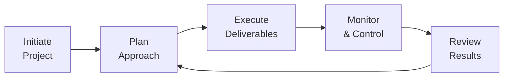

## 6.2 Process Domain: Executing with Efficiency and Control

### Introduction
In the project management landscape, the Process Domain centers on the actual execution of project activities and the mechanisms to keep them on track. It combines the practical elements of monitoring work, reporting progress, adjusting scope, maintaining schedules, and ensuring quality deliverables within the approved budget. While many frameworks separate planning from execution, in reality, the two processes are iterative, often overlapping and informing each other dynamically—particularly in agile or hybrid environments.

Effective project execution requires not only the strict application of tools and techniques but also a deep understanding of how to quickly adapt to shifting constraints. Successful project managers balance accuracy with flexibility, ensuring that every deliverable remains on course to meet the project’s strategic objectives, as defined in the business case or project charter.

This section explores essential methods to manage project scope, schedule, costs, and quality in a controlled and continuous manner. You will discover best practices, common hurdles, and practical strategies for sustained adaptation—whether you operate in a predictive (waterfall) environment, a purely agile setting, or a hybrid of the two.

### The Essence of the Process Domain
The Process Domain, as outlined by the PMP® Exam Content Outline, focuses on the “how” of project management. Domain competencies include:

- Managing and controlling project integration, encompassing processes and artifacts that unify the project.  
- Overseeing project progress to meet requirements and stay within baselines.  
- Updating and refining plans based on real-world data, stakeholder feedback, and risk considerations.  
- Maintaining consistent communication channels for project performance, problems, and potential improvements.

In practice, this domain also integrates with team leadership (People Domain) and business strategy (Business Environment Domain). Most challenges in the Process Domain do not arise in isolation; they typically intersect with stakeholder concerns, organizational culture, and resource constraints. Thus, a holistic understanding of project processes is crucial for delivering real, measurable value.

### Managing Scope with Discipline
Scope management ensures that all the required work to achieve project objectives is identified, planned, and executed—without allowing unapproved additions or omissions.

#### Clarifying Scope Baselines
The scope baseline comprises the project scope statement, the work breakdown structure (WBS), and the WBS dictionary. These documents establish the foundation for understanding what is in and out of scope. A well-defined baseline reduces ambiguity early on and streamlines communication during execution.

#### Monitoring and Controlling Scope Changes
Scope creep is a typical threat to project efficiency. Even if a change appears beneficial, any expansion can lead to schedule delays, cost overruns, or confusion about priorities. The integrated change control process helps mitigate this by requiring formal change requests, impact assessments on time and budget, and stakeholder sign-off. In agile settings, scope changes can be easier to incorporate if:

- User stories are small and discrete.  
- The team can reprioritize backlog items each iteration.  
- Stakeholders have a collaborative mechanism to discuss trade-offs (e.g., dropping less critical user stories in favor of more critical additions).

Whether predictive or agile, continuous vigilance against unauthorized scope expansion protects project resources and outcome value.

#### Encouraging Iterative Feedback Loops
Regularly re-examining and validating the scope with stakeholders keeps the project aligned with actual needs. For example, a software development lifecycle might involve frequent user testing sessions or demonstration events (e.g., sprint reviews), allowing final deliverables to evolve in response to real-time feedback.

### Scheduling for Efficiency
A project’s schedule is the backbone that coordinates work packages, manages resources, and guides deadlines.

#### Building Realistic Schedules
In predictive projects, the schedule often manifests as a Gantt chart or network diagram. Agile teams rely on burndown charts, iteration timelines, or Kanban boards to track tasks. Key steps to constructing a meaningful schedule include:

- Estimating Activity Durations: Incorporate historical data from past projects or utilize subject matter experts to gauge task lengths. Over-optimistic estimates are a frequent cause of schedule slippages.  
- Sequencing Activities: Identify dependencies among tasks (e.g., finish-to-start, start-to-start) to build a logical network.  
- Defining Milestones: Major checkpoints—like client reviews, design signoffs, or key deliverables—help measure progress and inform stakeholders when important stages are reached.

#### Controlling the Schedule Dynamically
Monitoring real performance data against the schedule baseline allows proactive intervention. Techniques such as crashing (adding resources) or fast-tracking (overlapping tasks) can compress schedules when needed. In agile, daily standups, rolling wave planning, and recalibrated sprint goals keep the schedule adaptable.

Below is a simple flowchart illustrating an iterative control cycle, reflecting how scheduling ties in with ongoing planning and execution:

This cycle underscores the interconnected nature of planning, execution, and monitoring, enabling timely schedule adjustments and improved accuracy over the project’s continuum.

### Optimizing Costs
Cost management ensures that project expenditures remain within approved budgets—but it also includes predicting cash flow patterns, managing reserves, and controlling cost fluctuations.

#### Estimating and Budgeting
Estimating is typically performed at the activity or deliverable level. Organizations employ multiple techniques:

- Analogous Estimating: Relying on costs from similar, past projects.  
- Parametric Estimating: Using mathematical relationships (e.g., cost per square foot).  
- Bottom-Up Estimating: Summing detailed estimates for every work package in the WBS.  

During budgeting, these cost estimates combine with contingency and management reserves. The final cost baseline becomes a yardstick to measure actual expenses against planned figures.

#### Earned Value Management (EVM)
To track project performance, EVM integrates cost, schedule, and scope measures. Key metrics include:

- Planned Value (PV): Budgeted cost of scheduled work at a point in time.  
- Earned Value (EV): Budgeted cost of completed work.  
- Actual Cost (AC): Actual cost expended thus far.

From these, managers can derive cost and schedule variances:

$$
CV = EV - AC
$$

If CV < 0, the project is over budget. Similarly, a negative schedule variance indicates the project is behind schedule. EVM also facilitates forecasting final project costs through the Estimate at Completion (EAC) metric.

#### Balancing Trade-Offs in Agile
In agile environments, cost management may focus on fixed constraints such as team capacity (number of sprints given a constant velocity) or the product backlog’s prioritization. Rather than performing detailed cost estimates upfront, agile teams refine these estimates per iteration, ensuring more accurate forecasts.

### Ensuring Quality
Quality is the degree to which the deliverable meets the agreed-upon standards and satisfies stakeholder expectations. Organizations that fail to integrate quality steps during execution often discover defects too late, leading to costly rework.

#### Planning for Quality
Continuous improvement is embedded in modern project environments. Frequent reviews and retrospectives (e.g., agile sprint retrospectives) drive incremental optimizations. A typical quality management plan addresses:

- Quality Standards: Defining product/service benchmarks, international certificates, or organizational standards.  
- Quality Assurance Activities: Preventive measures, peer reviews, audits, or checks integrated into the normal workflow.  
- Quality Control: Verification methods like sampling or testing to identify defects.  

#### Integrating Quality into Execution
Many project teams use the Plan-Do-Check-Act (PDCA) cycle to continuously improve processes and products. Properly integrated and well-communicated quality standards minimize confusion and ensure that cross-functional teams remain consistent in how they define “done.”

### Continuous Monitoring and Adaptation
No project plan remains static once exposed to real-life complexities. The ability to adapt swiftly distinguishes leading organizations from those continually playing catch-up. Continuous monitoring involves:

- Measuring Actual Progress: Using quantitative and qualitative data, such as metrics on defect rates, velocity, or earned value.  
- Comparing Results to Baselines: Identifying performance gaps.  
- Triggering Corrective/Preventive Actions: Rerouting resources, spreading knowledge across teams, adjusting scope features, or reprioritizing backlog items.  

In adaptive (agile/hybrid) projects, feedback loops appear more frequently—daily or weekly. Rapid iteration shortens the gap between a discovered variance and its correction. In predictive projects, such corrections often follow formal protocols like integrated change control. Regardless of the methodology, the principles remain consistent: observe, evaluate, adjust, and repeat.

### Tools and Techniques for Process Control
Project managers have a spectrum of tools to balance efficiency and control:

- Project Management Information Systems (PMIS): Centralized software for tracking tasks, budgets, and issues in real time.  
- Kanban Boards: Visualization aids that make bottlenecks evident, facilitating continuous workflow improvements.  
- Burndown or Burnup Charts: Help agile teams gauge remaining work or sum of completed tasks.  
- Dashboards and Scorecards: Consolidate performance indicators (KPIs), including cost, schedule, risk, and quality metrics.  
- Root Cause Analysis: Investigates underlying reasons for deviations or recurrent issues, enabling evidence-based solutions.

### Common Pitfalls and Challenges
Despite rigorous planning and controls, projects can still encounter difficulties:

- Overconfidence in Estimates: Underestimating activity durations or complexities results in frequent schedule slips and escalated costs.  
- Excessive Bureaucracy: Lengthy approval processes delay necessary changes, undermining the essential agility vital to keep momentum.  
- Lack of Stakeholder Engagement: Disengaged sponsors or end users lead to incomplete or irrelevant requirements, fueling scope changes.  
- Inconsistent Communication: Delayed status updates or misaligned messaging fosters confusion, especially in large or virtual teams.  
- Not Understanding the Organizational Context: Policies, procedures, or strategic changes within the organization can derail well-crafted plans when overlooked.

Being mindful of these traps helps project managers identify early warning signs and proactively adjust.

### Practical Examples and Case Studies
A manufacturing company launching a new product discovered irregularities in early prototypes. By establishing a robust control process, they quickly identified the root cause of defects in the supply chain. The project manager used real-time data from an integrated ERP system (PMIS) to isolate the issue—reducing rework costs by 40% compared to similar projects.

In an agile software development scenario, a FinTech startup requested monthly demos from the dev team. Continuous feedback allowed the team to re-prioritize user stories and incorporate new features. Although the project contained frequent scope changes, the controlled environment, short feedback cycles, and clear acceptance criteria kept the end product within acceptable time and budget parameters.

### Conclusion
Executing projects with efficiency and control does not hinge on a single methodology; rather, it reflects a cohesive approach grounded in data, stakeholder collaboration, and adaptability. Regardless of size or complexity, all projects benefit from well-defined scope management, accurate scheduling and cost forecasting, and a commitment to quality. By actively monitoring and adapting, you stay one step ahead of potential failures, ensuring deliverables align with broader business goals.

Continuous refinement—through daily standups, sprint reviews, or monthly status checks—creates an ongoing “audit trail” for performance, fosters accountability, and identifies early signals for risk or deviation. Underpinning these processes are the crucial leadership behaviors and communication strategies explored throughout this book.

Remember: process-based agility is not restricted to agile frameworks. Whether you deliver tangible construction outcomes, intangible software solutions, or business transformation programs, your ability to iterate in small increments and pivot effectively underpins successful execution.

## Test Your Knowledge: Executing Projects with Control and Adaptability



### Which of the following best describes the importance of continuous monitoring and adaptation in the Process Domain?

- [ ] It is only used in agile environments.  
- [x] It provides the most effective way to detect variances early and respond promptly.  
- [ ] It limits opportunities to refine scope or schedule.  
- [ ] It solely focuses on risk response strategies.  

> **Explanation:** Continuous monitoring and adaptation detect variances quickly, preventing them from escalating. The approach is beneficial for all project environments, not only agile.

### Which document combines the project scope statement, WBS, and WBS dictionary to define the baseline for project deliverables?

- [ ] Requirements Traceability Matrix  
- [ ] Change Control Register  
- [x] Scope Baseline  
- [ ] Lessons Learned Repository  

> **Explanation:** The scope baseline consists of the project scope statement, WBS, and WBS dictionary—establishing what is and isn’t included in the project scope.

### In an agile environment, how do teams typically handle scope changes?

- [ ] They avoid changes to scope once sprint planning is complete.  
- [x] They incorporate changes by re-prioritizing user stories and adjusting backlog items.  
- [ ] They submit changes through a lengthy, formal sign-off process.  
- [ ] They accept new features, but only after final user acceptance testing.  

> **Explanation:** Agile teams leverage iterative planning and backlog re-prioritization to adapt scope, ensuring the product meets evolving needs.

### Which metric in Earned Value Management (EVM) focuses on whether the project is under or over budget at a given point?

- [ ] Schedule Variance (SV)  
- [ ] Schedule Performance Index (SPI)  
- [x] Cost Variance (CV)  
- [ ] Estimate at Completion (EAC)  

> **Explanation:** Cost Variance (CV = EV – AC) indicates if the project is spending more (negative CV) or less (positive CV) than planned.

### Which of the following is a hallmark of effective quality assurance?

- [x] Preventing defects by building quality into the workflow.  
- [x] Regularly conducting peer reviews or audits.  
- [ ] Relying only on testing after development is complete.  
- [ ] Waiting until final integration to identify bugs.  

> **Explanation:** Quality assurance emphasizes preventive measures integrated into each phase, such as peer reviews and audits. Relying solely on late-stage testing often overlooks issues until they are more expensive to fix.

### What is the primary advantage of controlling scope effectively?

- [x] It helps prevent unauthorized additions that can derail the project’s schedule and budget.  
- [ ] It removes the need for a formal change control system.  
- [ ] It eliminates all risk of misunderstanding customer requirements.  
- [ ] It ensures multiple scope baselines are always in place.  

> **Explanation:** Effective scope control mitigates scope creep and helps manage resources and timeline effectively.

### Which type of schedule compression technique involves adding more resources to critical activities?

- [x] Crashing  
- [ ] Fast-Tracking  
- [ ] De-scoping  
- [ ] Sprint Review  

> **Explanation:** Crashing adds additional resources to reduce project duration, whereas fast-tracking involves overlapping tasks without necessarily adding more resources.

### What is a commonly used tool in agile teams for visualizing work in progress and identifying bottlenecks?

- [ ] Gantt Chart  
- [ ] Critical Path Diagram  
- [x] Kanban Board  
- [ ] Network Diagram  

> **Explanation:** A Kanban Board visually represents workflow, quickly revealing where tasks are piling up.

### Which of the following statements about cost management is most accurate?

- [ ] It involves creating multiple cost baselines to handle changes.  
- [ ] It only includes calculating initial estimates.  
- [x] It integrates budgeting, monitoring expenses, and forecasting future costs.  
- [ ] It is rarely relevant in agile projects.  

> **Explanation:** Cost management is a continuous effort that includes estimating, budgeting, controlling, and forecasting expenditures.

### True or False: The continuous improvement mindset is only necessary in agile or hybrid project environments.

- [x] True  
- [ ] False  

> **Explanation:** While agile emphasizes continuous improvement more explicitly, all project environments benefit from regular reflection and process enhancement, making it a valuable mindset across methodologies.



---

## PMP Mastery: 1500+ Hard Mock Exams with Full Explanations 

Looking to crush the PMP exam with confidence? Dive deep into 6 rigorous mock exams totaling 1500+ advanced-level questions, each accompanied by clear, step-by-step explanations. Hone your test-taking strategies, master complex topics, and build the resilience you need on exam day. Perfect for serious PMs aiming beyond fundamentals.

Enroll now:  
[PMP Mastery: 1500+ Hard Mock Exams with Exceptional Clarity & Full Explanations](https://www.udemy.com/course/pmp-2025/?referralCode=CF83A54BC86BE27F9AFE)

_Disclaimer: This course is not endorsed by or affiliated with the PMI examination authority. All content is provided purely for educational and preparatory purposes._
