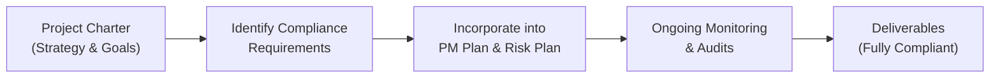
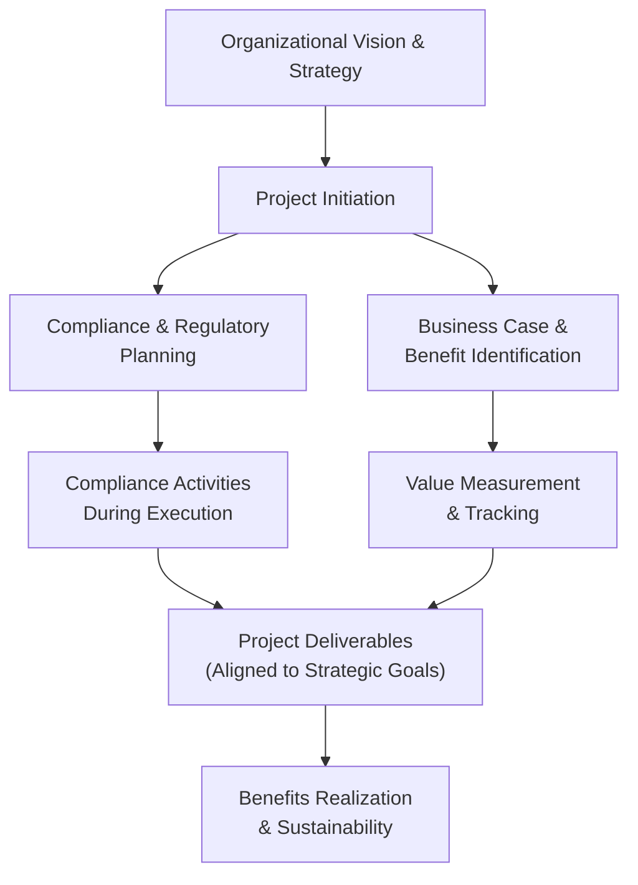

## 6.3 Business Environment Domain: Strategy, Compliance, and Value Delivery

Ensuring that your projects consistently deliver tangible benefits to the organization requires close alignment with broader strategic objectives. In the PMP® Exam, this is often tested through scenario-based questions that examine your ability to recognize organizational strategies, identify compliance requirements, and integrate value-oriented practices. This segment of the Business Environment Domain recognizes that project managers do more than just deliver on time and within budget—they serve as critical enablers of strategic success and must ensure that projects positively impact the organization’s broader ecosystem.

This chapter explains how to align project work with organizational objectives, ensuring full compliance with relevant rules and regulations, and implementing the value delivery focus that is essential for modern project management. You will learn how to manage external influences, internal governance demands, regulatory constraints, and stakeholder viewpoints to achieve your project's strategic intent.

## The Business Environment in Project Management

Projects do not operate in a vacuum. They exist within a dynamic business environment shaped by:
- Organizational strategies and goals.  
- Market and industry competition.  
- Legal and regulatory frameworks.  
- Socio-economic and environmental factors.  

When these forces are harnessed efficiently, your project can drive meaningful changes and deliver long-term value. Conversely, failing to understand them can lead to scope creep, non-compliance issues, reputational damage, and even project failure.

Project managers must be able to identify environmental factors affecting their projects, ensure their plans comply with all obligations, and link deliverables back to tangible business benefits. This perspective underscores how project management extends beyond simple operational tasks into strategic planning and value realization.

## Strategy and Organizational Goals

Organizational strategy provides the overarching purpose and direction. Projects exist to turn strategic objectives into actionable outcomes that generate positive returns—whether financial, reputational, or social. The link between organizational strategy and project execution has never been more critical; leaders expect projects to create real, measurable benefits that contribute to sustaining a competitive advantage in the marketplace.

### Strategy Alignment in Practice

Strategy alignment starts with understanding high-level goals outlined in strategic planning. For example, if an organization is focusing on digital transformation, relevant projects may include upgrading IT infrastructure, adopting cloud solutions, or implementing robust cybersecurity practices. As a project manager, you must ensure that:

- Project deliverables and success metrics reflect organizational aims.  
- Stakeholder requirements are balanced with strategic intent.  
- Activities remain flexible to account for changes in corporate direction.  

Coordinating with portfolio and program managers ensures that the project’s scope, timeline, and budget decisions do not happen in isolation but are part of a larger roadmap.

### Practical Example

Imagine a financial institution launching a new mobile payment application to enhance customer satisfaction and boost market share. At the strategic level, the organization aims for a 15% increase in digital wallet engagement within two years. As a project manager, you would:

- Validate that the project charter references the strategic objective (increasing digital wallet usage).  
- Design success measures (such as growth in app downloads, customer retention rates, or transaction volumes) that directly correlate to improved market share.  
- Plan risk controls, vendor engagements, and user training in tandem with regulatory guidelines and compliance checks, ensuring a holistic approach to value delivery.  

## Compliance and Regulatory Context

Compliance expectations continually evolve in today’s globalized environment. Government regulations, industry standards, health and safety protocols, environmental mandates, and data privacy requirements can vary by country, region, and sector. Non-compliance can lead to penalties, reputational harm, or suspension of business licenses. It is vital that a project manager stays informed of these requirements and weaves them into the project’s governance processes.

### Key Compliance Considerations

- Legislative Requirements: Local laws regarding labor, taxation, data handling, and public reporting.  
- Industry Standards: ISO certifications, Good Manufacturing Practice (GMP), or IEEE standards, depending on the domain.  
- Ethical Guidelines: PMI’s Code of Ethics and Professional Conduct, corporate codes of conduct, and broader societal expectations such as sustainability.  
- Contractual Obligations: Terms and conditions established with sponsors, clients, or suppliers, which may contain specific regulatory stipulations.  

### Compliance Management Process

Effective compliance management entails identifying relevant standards during project initiation, incorporating them into the project’s risk management plan, and performing regular audits to verify that deliverables meet these standards. You should involve legal counsel, compliance officers, and subject matter experts when defining acceptance criteria and quality thresholds.

Below is a simplified diagram illustrating how compliance integrates into project oversight:

In this flow, compliance is not an afterthought but an integral part of planning and execution. Continual monitoring ensures that each milestone aligns with regulatory constraints.

## Delivering Tangible Value to the Organization

Value delivery focuses on managing projects so that they yield benefits that matter to the organization and its stakeholders. A once-common myth in project management was that success is defined solely by meeting scope, time, and cost objectives. Modern best practices highlight that real success hinges on how well the final product, service, or result meets strategic needs and sustains ongoing benefits.

### Defining Benefits and Value

Value can take many forms: increased revenue, cost savings, compliance with new regulations, improved brand reputation, enhanced customer satisfaction, or employee well-being. Benefits Realization Management (BRM) is a structured approach used to identify, track, and optimize these benefits throughout the project life cycle and beyond. Projects often use a benefits register that details the expected benefits, their measurement metrics, and timelines for realization.

### Establishing Measurable Metrics

Clear metrics are essential to articulate the impact of a project. They might include:
- Return on Investment (ROI)  
- Net Present Value (NPV)  
- Customer Satisfaction Scores (CSAT)  
- Employee Retention Rates  
- Market Share Growth  
- Operational Efficiency Gains  

Here is an example KaTeX formula illustrating a simple Return on Investment:


ROI = \frac{\text{Gain from Investment} - \text{Cost of Investment}}{\text{Cost of Investment}}


While ROI is popular for financial appraisal, intangible benefits—like brand preference or organizational learning—may also weigh heavily on strategic decision-making. Regardless, define at the onset how these intangible benefits will be assessed or approximated.

### Ensuring Ongoing Value Delivery

Even once the project closes, organizations should continue monitoring benefits during operations. Ongoing measurement confirms whether the project’s original business case assumptions hold true. If they do not, corrective action or additional improvement initiatives may be necessary. This recognition forms the basis of a feedback loop, which is integral to continuous improvement.

## Integrating Business Environment Considerations into Project Management Processes

Project managers can systematically incorporate strategic alignment, compliance, and value considerations throughout the project life cycle. The PMBOK® Guide (Seventh Edition) stresses the importance of “focus on value” and “adaptability and resiliency,” emphasizing that your planning and execution processes must adapt to shifts in the business environment.

### Initiation and Planning

During project initiation, create or review the business case, ensuring that the proposed outputs link to organizational objectives. Identify relevant business environment factors—such as laws, culture, and market trends—and integrate them into the project charter. Early risk identification pays dividends in anticipating compliance burdens or external disruptions.

Facility with tailoring is essential here. In some industries, you may need rigorous documentation to satisfy auditors (predictive approach), while agile settings might emphasize iterative feedback and evolving product increments. Regardless of approach, your project management plan must reflect the environment in which you operate.

### Execution and Monitoring

Execution is where the rubber meets the road. You coordinate resources, manage stakeholder engagement, control quality, and ensure continuous alignment with the corporate strategy. Regular “health checks” ensure compliance with legal requirements and contractual obligations. Communicate any changes to project stakeholders, adjusting scope or processes if new rules or strategic shifts emerge.

Monitoring project performance involves collecting metrics for the triple constraint (scope, schedule, cost), but it also includes a watchful eye on whether predicted benefits are still on track. Use real-time dashboards or cumulative flow diagrams if you are applying an agile approach. In a predictive environment, compare planned baselines to current actuals, and reevaluate any mismatch.

### Closing and Transition to Operations

Upon project closure, verify whether target benefits and strategic outcomes have been delivered and hand over relevant knowledge to operational teams. This includes compliance documentation, lessons learned on how the project navigated legal complexities, and final financial metrics that illustrate the project’s return on investment. Proper closure assures that any outstanding compliance items are still addressed, and operational units have the framework to maintain or scale up the delivered solution.

## Leadership in a Regulated and Strategically Driven Context

A project manager needs advanced leadership skills to navigate the complexities of the modern business environment. You may find yourself influencing senior leadership decisions, mediating between regulatory bodies and operational staff, or persuading cross-functional teams about the necessity of compliance activities.

Cultivate competencies like emotional intelligence, negotiation, conflict management, and stakeholder communication. Engage champions within the organization who can help expedite approvals or resource allocations. Building trust in your leadership is vital to ensure that your team and stakeholders follow through on strategic decisions and compliance guidelines.

## Common Pitfalls and Strategies to Overcome Them

Failing to Align with Strategy: Projects that do not explicitly tie to their organization’s strategy risk losing funding or being deprioritized. Regularly confirm that your project objectives remain in sync with corporate goals.

Ignoring or Underestimating Compliance: Neglecting legal or regulatory standards leads to penalties or project shutdowns. Assign dedicated compliance roles or consult subject matter experts early.

Focusing Solely on Cost and Schedule: Reducing a project to cost and timeline metrics can undermine real, sustainable value. Incorporate key performance indicators (KPIs) that measure customer success, quality, and strategic ROI.

Neglecting the Transition to Operations: Some project teams deliver outputs without ensuring adoption or benefits realization. Develop a robust transition plan with clear ownership of post-project activities.

Resisting Adaptive Changes: A rigid plan that does not accommodate new regulations or strategic pivots can derail a project. Maintain a flexible change management process to address emerging constraints.

## Case Study: Implementing a Renewable Energy Initiative

Scenario: A manufacturing firm seeks to reduce its carbon footprint and comply with new environmental regulations by building a solar energy facility on-site. The strategic goal is both to improve sustainability Credibility (brand reputation) and to achieve cost savings by reducing dependence on external power grids.

Actions and Outcomes:
- The project manager develops a benefits register highlighting reduced electricity costs, compliance with environmental standards, and brand enhancement.  
- A compliance officer is assigned to ensure the project meets local building codes and environmental regulations.  
- The project scope, schedule, and budget incorporate tasks such as acquiring the necessary construction permits, evaluating soil/environmental impact, and scheduling vendor reviews.  
- Ongoing measurement includes tracking monthly energy cost savings, carbon footprint metrics, and stakeholder surveys on brand perception.  

Result: By closely aligning the project with the enterprise’s sustainability objectives and adhering to regulatory standards, the organization not only avoids expensive non-compliance penalties but also reaps long-term financial and reputational benefits.

## Visualizing the Business Environment Domain

The following Mermaid diagram provides an integrated view of how strategy, compliance, and value delivery interact within the Business Environment Domain:

This figure shows a linear but interrelated progression, emphasizing how each step feeds into the next, with compliance and value tracking running in parallel, both weaving into overall strategy execution.

## Putting It All Together

Mastering the Business Environment Domain demands a balanced focus on:
- Translating strategic objectives into project scope and deliverables.  
- Identifying and managing all forms of compliance requirements.  
- Tracking and realizing benefits that matter to stakeholders.  

Project managers who excel in this domain position themselves as strategic enablers, adept at forecasting organizational needs and leading teams through complex regulations while never losing sight of tangible outcomes. As you prepare for the PMP® exam, reinforce your knowledge of how to integrate compliance activities, track organizational alignment, and measure value. Case studies and real-world experiences show that true project success emerges only when you deliver significant, sustainable benefits that align with the broader vision.

## Additional References

• PMI. (2021). A Guide to the Project Management Body of Knowledge (PMBOK® Guide) – Seventh Edition. Project Management Institute.  
• PMI. (2017). The Standard for Program Management – Fourth Edition. Project Management Institute.  
• PMI. (2019). Benefits Realization Management: A Practice Guide. Project Management Institute.  
• Kerzner, H. (2017). Project Management: A Systems Approach to Planning, Scheduling, and Controlling. Wiley.  
• Kotter, J. (2012). Leading Change. Harvard Business Review Press.  

## Test Your Mastery: Strategy, Compliance, and Value Delivery



### In the broader business environment, which factor is most relevant to ensuring a project's alignment with organizational strategies?
- [ ] Documenting lessons learned from previous projects  
- [x] Linking project deliverables to strategic objectives in the project charter  
- [ ] Staffing the project with cross-functional specialists  
- [ ] Obtaining approval from the project management office only  

> **Explanation:** While lessons learned, resource allocation, and PMO support are all important, the most critical aspect is explicitly aligning project deliverables with the organization’s strategic objectives.

### Which of the following best illustrates effective compliance planning in a project?
- [ ] Conducting a single compliance review at the end of the project life cycle  
- [x] Integrating legal, regulatory, and standard requirements into the project management plan early  
- [ ] Deferring compliance activities until all deliverables have been accepted by the sponsor  
- [ ] Informing stakeholders about compliance during project closure only  

> **Explanation:** Effective compliance planning begins early and is integrated throughout the project. Waiting until late in the project to address compliance introduces risk of non-compliance and rework.

### What is the primary reason modern project management emphasizes ongoing value measurement rather than only focusing on the triple constraint?
- [x] Organizations prioritize strategic benefits realization and sustainability  
- [ ] The triple constraint has been rendered obsolete by agile methodologies  
- [ ] Budget and schedule baselines are always subject to direct senior management control  
- [ ] Regulators demand that the triple constraint be retired  

> **Explanation:** While scope, schedule, and cost remain important, organizations increasingly focus on how the project’s outputs provide sustainable, strategic benefits. This shift in focus is a reflection of value-driven project management principles.

### How can a project manager best address complex regulations that vary across multiple regions?
- [x] Consult with local SMEs and add region-specific compliance tasks in the project plan  
- [ ] Gather only the broadest regulatory requirements and hope to meet local standards by default  
- [ ] Segregate compliance management to a dedicated overhead project  
- [ ] Focus on the largest market’s regulations and ignore smaller markets  

> **Explanation:** Involving local subject matter experts (SMEs) and integrating those regulatory details into your project plan ensures thorough coverage of legal and compliance needs across various regions.

### What is a key characteristic of Benefits Realization Management?
- [x] It extends beyond project closure to track long-term benefits  
- [ ] It concludes once the project deliverables are validated and accepted  
- [x] It relies solely on financial metrics like ROI and NPV  
- [ ] It must always be outsourced to a dedicated benefits manager  

> **Explanation:** Benefits Realization Management monitors and measures project outcomes well after the formal project has closed, ensuring sustainable improvements are maintained. While financial metrics are common, intangible benefits should also be considered.

### When evaluating the outcome of a project for strategic alignment, which measure is most informative?
- [x] Achievement of pre-defined KPIs that reflect organizational priorities  
- [ ] The ratio of planned tasks completed on time  
- [ ] The number of change requests accepted  
- [ ] The frequency of team-building exercises conducted  

> **Explanation:** Key Performance Indicators aligned with strategic goals best illustrate the extent to which the project supports broader organizational objectives.

### Which action demonstrates the link between project scope and organizational vision most directly during execution?
- [x] Checking each deliverable against strategic end goals  
- [ ] Limiting scope changes to one per iteration  
- [x] Relying solely on the project sponsor to monitor strategy alignment  
- [ ] Skipping design reviews to expedite delivery  

> **Explanation:** Continuously verifying each deliverable’s contribution to the organization’s defined vision makes sure efforts are spent on strategically relevant work. Sponsors should be engaged, but the project manager should also actively ensure alignment.

### A project sponsor insists on accelerating the project timeline, although it might jeopardize compliance activities. How should this be handled?
- [x] Communicate risks of non-compliance and propose a mitigation plan  
- [ ] Accept the sponsor’s directive and expedite the schedule unconditionally  
- [ ] Escalate the issue directly to a regulatory authority for guidance  
- [ ] Delegate compliance decisions to junior team members  

> **Explanation:** Balancing schedule demands with regulatory compliance is crucial. The best approach is to transparently communicate potential compliance risks, propose mitigations, and work with the sponsor to make an informed decision.

### Which project role is typically responsible for integrating compliance requirements into the overall project scope and schedule?
- [x] Project manager with inputs from compliance or legal teams  
- [ ] Procurement manager responsible for all aspects of external vendor oversight  
- [ ] Sponsor who sets strategic direction exclusively  
- [ ] Team lead for the development group  

> **Explanation:** The project manager drives holistic planning and ensures that compliance requirements—facilitated by experts in legal or regulatory fields—are incorporated into the project management plan.

### The project has delivered its final product, yet the organization wants to track post-launch ROI for six months. This is an example of:
- [x] Monitoring benefits realization beyond the project’s closure  
- [ ] Locking the baseline until the next project phase  
- [ ] Neglecting the communications management plan  
- [ ] Shifting the project back to the initiating phase  

> **Explanation:** Even after the project is officially closed, the organization often continues measuring outcomes to determine if the actual ROI aligns with initial forecasts. This is standard practice in benefits realization management.



## PMP Mastery: 1500+ Hard Mock Exams with Full Explanations

Looking to crush the PMP exam with confidence? Dive deep into 6 rigorous mock exams totaling 1500+ advanced-level questions, each accompanied by clear, step-by-step explanations. Hone your test-taking strategies, master complex topics, and build the resilience you need on exam day. Perfect for serious PMs aiming beyond fundamentals.

Enroll now:  
[PMP Mastery: 1500+ Hard Mock Exams with Exceptional Clarity & Full Explanations](https://www.udemy.com/course/pmp-2025/?referralCode=CF83A54BC86BE27F9AFE)

_Disclaimer: This course is not endorsed by or affiliated with the PMI examination authority. All content is provided purely for educational and preparatory purposes._
