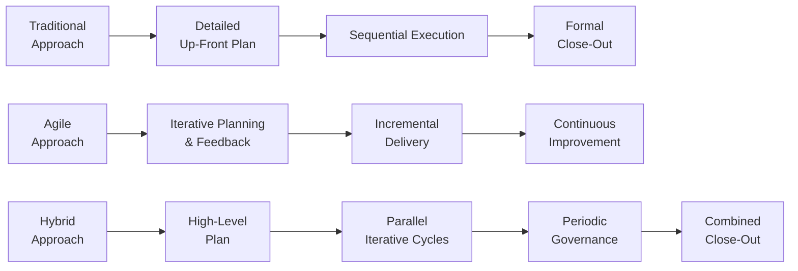

## 6.4 Agile, Hybrid, and Traditional Approaches within Each Domain

Effective project management hinges on selecting the right approach to meet organizational objectives, stakeholder needs, and the nature of the work. This section explores how projects across the three PMP® Exam domains—People, Process, and Business Environment—can benefit from Agile, Hybrid, or Traditional (predictive) methodologies. We will provide comparative analysis and best-fit recommendations, offering practical guidance for tailoring your approach to any project environment.

To frame this discussion, recall that:  
• The People Domain focuses on team performance, leadership, and stakeholder engagement.  
• The Process Domain centers on technical project management skills, decision-making, and overall planning/execution activities.  
• The Business Environment Domain addresses strategic alignment, compliance, and the broader organizational context impacting a project.

This chapter ties directly into the domains outlined in Sections 6.1 through 6.3, highlighting how each domain can be addressed using Agile, Hybrid, and Traditional approaches.

---

### Understanding the Project Approaches

Before we turn to each domain, let’s clarify the distinct characteristics of each project management approach:

• Traditional (Predictive) Approach  
  – Often uses a linear, sequential model (e.g., Waterfall).  
  – Relies on detailed up-front planning with a strong emphasis on documentation and scope control.  
  – Well-suited for projects with stable, clearly defined requirements and minimal expected changes.  

• Agile Approach  
  – Encourages iterative planning, frequent feedback loops, and adaptive processes.  
  – Emphasizes autonomy, collaboration, and rapid value delivery to stakeholders.  
  – Well-suited for projects with high uncertainty, rapidly changing requirements, or iterative product builds.  

• Hybrid Approach  
  – Combines elements of both Traditional and Agile approaches to balance predictability and flexibility.  
  – Often used when certain aspects of the project require structured planning (e.g., regulatory compliance), while others benefit from iterative exploration.  
  – Tailored to the specific constraints and opportunities within the project environment.

---

### People Domain in Agile, Hybrid, and Traditional Approaches

Successful project outcomes depend on effective leadership, teamwork, and stakeholder engagement strategies. Each approach offers a different style of managing people.

#### Traditional Approach in the People Domain  
• Roles and Responsibilities  
  – Typically hierarchical, with a project manager who owns decision-making and resource allocation.  
  – Team members may have specialized, function-specific roles.  

• Stakeholder Communication  
  – Often formal, following hierarchical lines of reporting.  
  – Communication may include structured weekly or monthly status reports.  

• Leadership Style  
  – Project managers often leverage directive leadership: top-down decision-making, with an emphasis on control.  

• Best-Fit Situations  
  – Works well when roles are well-defined, and stakeholders expect a structured, command-based leadership style (e.g., in large construction or heavy manufacturing projects where safety and compliance are paramount).  

#### Agile Approach in the People Domain  
• Roles and Responsibilities  
  – Self-organizing teams, cross-functional collaboration, and servant leadership from Scrum Masters or Agile coaches.  
  – Team members share accountability for outcomes, encouraging continuous learning and adaptation.  

• Stakeholder Communication  
  – Frequent touchpoints, such as daily standups, sprint reviews, and retrospectives, engaging stakeholders throughout the project.  
  – Emphasizes transparency and real-time feedback to ensure alignment.  

• Leadership Style  
  – Emphasis on servant leadership, coaching, and empowerment.  
  – Facilitates a trust-based environment to encourage innovation and adaptability.  

• Best-Fit Situations  
  – Suitable for dynamic environments requiring frequent changes in scope or priorities, such as software or digital product development.  

#### Hybrid Approach in the People Domain  
• Roles and Responsibilities  
  – May combine a traditional project manager role for top-level decisions with self-organizing sub-teams handling iterative workstreams.  
  – Some areas of the team may be agile (e.g., software development), while others remain structured (e.g., procurement or hardware).  

• Stakeholder Communication  
  – Mix of formal reporting for key milestones and iterative touchpoints for evolving requirements.  
  – Stakeholders can experience both set milestone reviews and ongoing sprint demos.  

• Leadership Style  
  – Blends command-and-control where necessary for risk mitigation or compliance while adopting servant leadership for functions needing agility.  
  – The project manager—or agile lead—modulates approach based on the maturity and nature of each sub-team.  

• Best-Fit Situations  
  – Useful in environments needing consistency in some aspects (e.g., regulated segments) and flexibility in others (e.g., user-facing innovation).  

---

### Process Domain in Agile, Hybrid, and Traditional Approaches

The Process Domain focuses on the “how” of project management—planning, scheduling, monitoring, controlling, and delivering results effectively.

#### Traditional Approach in the Process Domain  
• Planning and Scheduling  
  – Detailed Work Breakdown Structure (WBS) and Gantt charts define tasks, durations, and dependencies from the start.  
  – Rigid baselines established for scope, schedule, and budget, with changes managed via formal processes.  

• Monitoring and Controlling  
  – Extensive documentation, formal change requests, and sign-offs.  
  – Heavy reliance on earned value metrics, status reports, and milestone tracking.  

• Best-Fit Situations  
  – Appropriate when stability is expected, or changes are limited and costly (e.g., major infrastructure projects).  
  – Perfect for a structured environment where a comprehensive project management plan (PMP) can be meticulously followed.  

#### Agile Approach in the Process Domain  
• Iterative Planning  
  – Processes revolve around short sprints or iterations.  
  – Continuous backlog refinement triggers rolling wave planning based on feedback from stakeholders.  

• Flexibility and Adaptation  
  – Changes are not only expected but welcomed if they add value.  
  – Incremental delivery allows for quick value realization and early course corrections.  

• Best-Fit Situations  
  – Ideal for projects with unclear or evolving requirements, or when speed to market and stakeholder feedback are critical.  
  – Highly effective for knowledge-based initiatives, from software products to complex research prototypes.  

#### Hybrid Approach in the Process Domain  
• Tailored Planning  
  – Core components may include a high-level Gantt or milestone plan, while sub-teams adopt iterative cycles.  
  – Certain deliverables might follow a predictive schedule for regulatory approvals, whereas iterative development occurs for user-facing features.  

• Monitoring and Controlling  
  – Uses a blend of classic control systems (e.g., phased gate reviews) and agile metrics (e.g., burn-down charts).  
  – Formal documentation is generated for critical components, while less critical or uncertain areas are managed iteratively.  

• Best-Fit Situations  
  – Projects with some components that must adhere to fixed deliverables or compliance standards, while other areas benefit from rapid iteration and early feedback.  

---

### Business Environment Domain in Agile, Hybrid, and Traditional Approaches

The Business Environment Domain remains vital for ensuring strategic alignment and compliance, addressing how projects fit within the broader organizational and external context.

#### Traditional Approach in the Business Environment Domain  
• Strategic Alignment  
  – Leverages feasibility studies, cost-benefit analyses, and business cases aligned with the organizational strategy before project initiation.  
  – Focuses on predictable outcomes that tie directly into the organization’s long-term plans.  

• Compliance and Governance  
  – Emphasizes formal governance structures, regular audits, and stage-gate approvals.  
  – Close oversight from Project Management Offices (PMOs) or steering committees ensures alignment with organizational standards.  

• Best-Fit Situations  
  – When organizational processes are heavily regulated or have strong governance frameworks (e.g., pharmaceutical, aerospace).  
  – Priorities remain fairly static, and high-level strategic objectives are unlikely to shift mid-project.  

#### Agile Approach in the Business Environment Domain  
• Strategic Alignment  
  – Continuously validates alignment through ongoing stakeholder collaboration, with the possibility of pivoting quickly if market conditions change.  
  – Incremental delivery allows for new opportunities to be seized rapidly and projects to reorganize their priorities with minimal overhead.  

• Compliance and Governance  
  – Agile teams may use “just enough” documentation and focus on demonstrating compliance iteratively.  
  – Uses lightweight governance, often focusing on cross-functional reviews rather than formal gates.  

• Best-Fit Situations  
  – When an organization competes on innovation speed and must quickly respond to evolving market conditions (e.g., tech startups, digital product companies).  
  – When compliance can be met iteratively, e.g., modular certification phases in regulated industries.  

#### Hybrid Approach in the Business Environment Domain  
• Strategic Alignment  
  – High-level plans remain aligned with corporate strategy, ensuring predictability for key milestones.  
  – Adjustments in scope or direction can be made at defined intervals or whenever fresh market data emerges.  

• Compliance and Governance  
  – Certain phases undergo rigid compliance checks (e.g., final product sign-off), while others are iteratively refined.  
  – May adopt “Agile black-out periods” for compliance testing, blending standard stage-gate reviews with agile reviews.  

• Best-Fit Situations  
  – Organizations with layered portfolios or programs that require both stable, long-term planning for certain aspects and rapid iteration for others.  
  – Entities exploring agile transformation but still retaining core elements of a stage-gate process for high-criticality deliverables.  

---

### Practical Examples and Case Studies

The choice of project management approach can vary widely depending on organizational context, type of industry, and stakeholder expectations. Below are examples that illustrate how each domain might be handled differently.

• People Domain (Construction Project)  
  – Traditional: A highway expansion project requires a hierarchical team structure with a site manager, multiple supervisors, and well-defined roles for engineers, laborers, and inspectors. Project leadership sets clear sub-tasks and holds weekly status and safety meetings.  
  – Agile: Although construction is typically predictive, some phases—such as interior design for move-in ready homes—can adopt agile-like iterations, adjusting user preferences for fittings and finishes. In such a scenario, the finishing crew might hold regular standups to respond to design changes from the homeowners.  
  – Hybrid: A large urban development project might maintain a formal schedule for foundational work with strict regulatory sign-offs, while interior design sub-teams iterate with building owners for real-time feedback on fixture selection and layout changes.

• Process Domain (Software Implementation)  
  – Traditional: An enterprise resource planning (ERP) rollout with fixed scope requires a robust initial design, with a detailed plan and minimal changes to the baseline.  
  – Agile: A startup designing a ticketing mobile app uses short sprints, user feedback sessions, and continuous deployment of incremental features.  
  – Hybrid: A financial services company deploying a new CRM system does so with an overarching schedule for data migration (predictive) while continuously refining the user interface and functionalities (agile).

• Business Environment Domain (Healthcare Product Launch)  
  – Traditional: A medical device manufacturer’s R&D team uses a “waterfall” approach to meet FDA standards, with formal stage gates: research → prototyping → clinical trials → production.  
  – Agile: A telemedicine platform uses frequent releases, quickly iterating to ensure HIPAA compliance is integrated throughout the software development lifecycle.  
  – Hybrid: Key hardware elements in a wearable health device follow predictive gating to pass certification, while the supporting mobile application and user interface update frequently based on user feedback.

---

### Key Considerations and Best Practices

• Tailoring is Essential  
  – There is no one-size-fits-all approach. PMI emphasizes tailoring your methodology, processes, and artifacts to the project’s context.  
  – Even in purely predictive environments, some agile principles like continuous feedback or incremental releases can be beneficial.  

• Governance, Risks, and Compliance  
  – Agile does not inherently mean a lack of governance. Instead, it means governance is integrated in frequent intervals.  
  – Focus on early risk detection; agile fosters incremental discovery of risks, whereas traditional approaches may push risk discovery to the latter stages.  

• Stakeholder Engagement  
  – People domain strategies differ widely between approaches. Identify stakeholder preferences early to decide whether to favor more collaborative, iterative sessions or formal communications.  
  – Hybrid approaches must ensure no stakeholder group is neglected in the combination of agile and predictive practices.  

• Organizational Culture and Readiness  
  – Assess your organization’s tolerance for ambiguity, speed of decision-making, and leadership style.  
  – Hybrid can mitigate cultural resistance by preserving familiar controls while introducing new ways of working.  

• Continuous Improvement  
  – In agile, retrospectives are a key mechanism for improvement.  
  – In traditional approaches, post-mortem reviews focus on lessons learned. Hybrid projects can blend both, ensuring iterative improvements throughout the project while still documenting final insights.  

---

### Tools & Techniques for Adapting Approaches

Depending on each domain’s specific needs, you might integrate a variety of tools to accommodate agile, hybrid, or traditional approaches. Below are some commonly used options:

• Traditional Tools  
  – Gantt charts, critical path method (CPM), earned value management (EVM), project management information systems (PMIS), standard operating procedures (SOPs).  

• Agile Tools  
  – Product backlogs, Kanban boards, burn-down or burn-up charts, sprint retrospectives, daily standups.  

• Hybrid Tools  
  – Milestone-based Gantt overlaid with sprint boards.  
  – Phase-gate reviews for critical deliverables combined with iterative user demos.  
  – Use of “end-to-end” PMIS that supports agile extension modules.  

Managing each domain with these tools ensures both the People and Process aspects are covered, while aligning the deliverables with Business Environment priorities and constraints.

---

### Visual Comparison

Below is a simplified flowchart comparing the general flow of Traditional, Hybrid, and Agile approaches at a high level. While not exhaustive, it illustrates how each approach interlaces with project phases.

• Traditional Approach  
  – Moves sequentially from one phase to the next (Plan → Execution → Closure).  
• Agile Approach  
  – Involves iterative cycles, continuous planning, and ongoing improvement.  
• Hybrid Approach  
  – Integrates elements of both, with structured governance at key points and iterative cycles for certain components.

---

### Conclusion

Choosing the appropriate approach for each PMP® Exam domain is a strategic decision that profoundly affects project outcomes. Whether you lean on a purely predictive method for regulated construction or hardware projects, embrace agile for quick feedback in software development, or blend both in a hybrid fashion, aligning methodology with project needs and organizational culture is paramount. The People domain thrives when leadership styles match stakeholder and team expectations, the Process domain demands the right level of flexibility and control, and the Business Environment domain requires strategic alignment and compliance tailored to organizational realities. By examining these domains carefully and applying relevant tools and techniques, you can maximize project success while keeping stakeholders engaged and satisfied.

---

## Test Your Knowledge: Agile, Hybrid, and Traditional Strategies in Each Domain



### Which project management approach is most suitable for a project with stable requirements and minimal expected changes?

- [ ] Agile
- [ ] Hybrid
- [x] Traditional
- [ ] None of the above

> **Explanation:** Traditional (predictive) approaches are well-suited for scenarios with minimal uncertainties, as they rely on clearly defined requirements and a robust up-front plan.

### In Agile environments, which technique commonly fosters continuous team improvement?

- [ ] Milestone Gate Reviews
- [x] Retrospectives
- [ ] Cost-Benefit Analysis
- [ ] Post-Mortem Evaluations

> **Explanation:** During retrospectives, Agile teams examine their process and outcomes at the end of each iteration. This allows them to identify improvements regularly, thereby enhancing performance throughout the project life cycle.

### Which type of leadership style is most characteristic of an Agile environment?

- [ ] Directive Leadership
- [x] Servant Leadership
- [ ] Autocratic Leadership
- [ ] Bureaucratic Leadership

> **Explanation:** In Agile methodologies, team-oriented leadership is emphasized (often called servant leadership). This style supports team autonomy, trust, and empowerment, enabling them to adapt quickly to changes.

### In a Hybrid approach, what best describes the core strategy for managing the Business Environment Domain?

- [ ] Relying entirely on predictive models
- [ ] Shunning all stage-gate reviews
- [ ] Performing only retrospective evaluations
- [x] Balancing iterative reviews with required formal governance

> **Explanation:** A Hybrid approach may integrate formal governance for compliance or critical stages while using iterative reviews for other areas of the project. This dual approach helps maintain alignment with broader business requirements.

### Which statement best represents a key difference between Agile and Traditional techniques in the Process Domain?

- [x] Agile uses iterative planning and delivery cycles; Traditional relies on detailed up-front planning and sequential execution.
- [ ] Traditional obtains frequent stakeholder feedback; Agile follows a rigid plan established at the beginning.
- [ ] Agile seldom incorporates planning techniques or controls; Traditional strategies seldom require documentation.
- [ ] Agile and Traditional approaches do not differ significantly in the Process Domain.

> **Explanation:** Agile continuously refines requirements and delivers incremental value through frequent iterations. In contrast, Traditional approaches rely on a comprehensive plan with a largely linear life cycle.

### In the People Domain, what is the primary focus of self-organizing teams in an Agile context?

- [x] Shared accountability for outcomes
- [ ] Rigid adherence to top-down objectives
- [ ] Adhering to a strict, unchanging schedule
- [ ] Avoiding stakeholder involvement

> **Explanation:** Agile teams thrive when they own decisions collectively, taking shared responsibility for delivering value. Frequent stakeholder feedback further guides them in refining their deliverables.

### Which approach is typically a strong fit for industries with heavy regulation and compliance needs, such as healthcare or aerospace?

- [x] Traditional
- [x] Hybrid
- [ ] Agile
- [ ] No approach is suitable

> **Explanation:** Traditional approaches with structured governance are common in heavily regulated sectors. However, a Hybrid model can also be beneficial if certain aspects of the project demand flexibility but still require formal checks for compliance.

### When adopting a Hybrid approach for the Process Domain, which practice might occur?

- [x] Using milestone-based Gantt charts for external stakeholder reporting while delivering smaller functionality in sprints
- [ ] Relying only on daily standups without any form of documentation
- [ ] Freezing all requirements from the start of the project
- [ ] Eliminating internal quality checks until the final phase

> **Explanation:** Hybrid approaches often mix predictive plans (for top-level timelines and governance) with iterative cycles (for specific deliverables). For instance, you might deliver frequent small increments managed via sprints while consistently reporting progress at broader milestones.

### Which statement is TRUE about the Business Environment Domain in Agile?

- [x] It allows for real-time market feedback, letting the project pivot quickly.
- [ ] It omits any documentation for governance.
- [ ] It depends solely on stage-gate approvals to move forward.
- [ ] It discourages budgetary oversight for emergent changes.

> **Explanation:** A key benefit of Agile is its adaptability, allowing teams to shift project direction swiftly based on new business or market insights. Projects still maintain sufficient governance (albeit less formal than in predictive models) and responsible budget management.

### Using a Hybrid approach can be advantageous when each part of the project:

- [x] Has different requirements or uncertainty levels, requiring both predictive and iterative methods
- [ ] Involves no stakeholder collaboration
- [ ] Is fully certain from the start
- [ ] Must follow exactly the same procedures across all workstreams

> **Explanation:** A Hybrid approach is well-suited for projects with distinct segments—some stable and predictable, others uncertain and needing iterative feedback. This ensures each portion of the work is managed in the most effective way.



---

## PMP Mastery: 1500+ Hard Mock Exams with Full Explanations 

Looking to crush the PMP exam with confidence? Dive deep into 6 rigorous mock exams totaling 1500+ advanced-level questions, each accompanied by clear, step-by-step explanations. Hone your test-taking strategies, master complex topics, and build the resilience you need on exam day. Perfect for serious PMs aiming beyond fundamentals.

Enroll now:  
[PMP Mastery: 1500+ Hard Mock Exams with Exceptional Clarity & Full Explanations](https://www.udemy.com/course/pmp-2025/?referralCode=CF83A54BC86BE27F9AFE)

_Disclaimer: This course is not endorsed by or affiliated with the PMI examination authority. All content is provided purely for educational and preparatory purposes._
