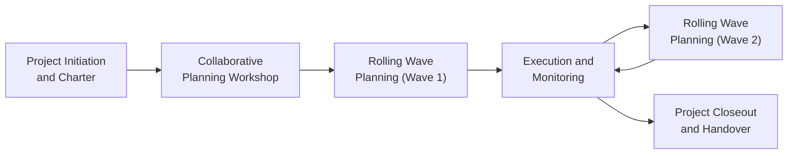
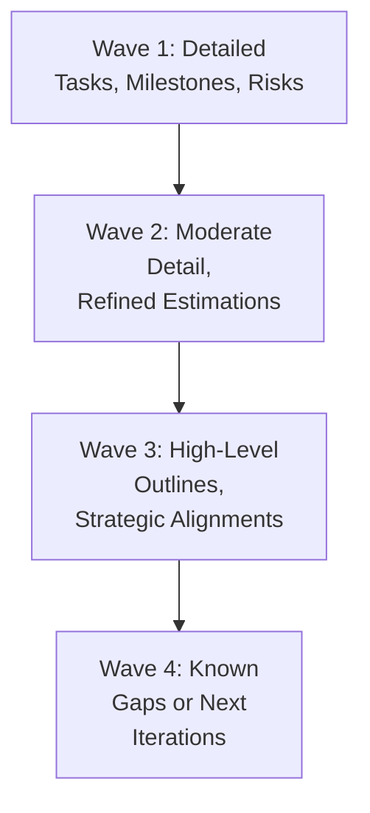

## 10.1 Collaborative Planning and Rolling Wave Techniques

Collaborative planning and rolling wave techniques offer powerful frameworks for planning complex projects in a way that embraces evolving requirements and encourages strong stakeholder engagement. By using these approaches, project managers can capture critical insights early, refine scope incrementally, and adapt to new information as it surfaces. This iterative and participatory style promotes transparency, improves team morale, and leads to deliverables that are more closely aligned with strategic objectives. In this section, we will explore how collaborative planning sessions are structured, how rolling wave planning helps shape evolving scope, and what best practices can support their successful implementation in any project environment.

Collaborative planning involves diverse stakeholders—including project teams, sponsors, business owners, and key subject matter experts—working together to define and refine project objectives, scope boundaries, potential risks, and initial estimations. This fosters a shared sense of ownership and accountability. Rolling wave planning complements such collaboration by employing a phased approach to planning: near-term tasks are planned in detail, while future tasks are kept at a higher-level outline until more information is available. This hybrid approach of strategic foresight and incremental detailing can be highly effective for managing risky or ambiguous projects.

Below, we will examine core principles of collaborative planning, address how rolling wave techniques align with the Development Approach and Life Cycle Performance Domain (from Chapter 9) and the Planning Performance Domain (Chapter 10), showcase real-world examples, and provide best practices for successfully implementing these methods on your projects.

### Why Collaborative Planning Matters

Collaborative planning builds trust and shared commitment among stakeholders. By creating a forum for open communication and consensus-building, the project manager can gather essential insights, identify unknowns, and promote mutual understanding of project constraints and goals. This inclusive approach has several advantages:

• More Accurate Planning Inputs  
• Higher Level of Stakeholder Buy-In  
• Early Detection of Risks and Issues  
• Enhanced Confidence in Scope and Schedule  
• Stronger Cohesion Among Cross-Functional Teams  

Additionally, collaborative planning aligns with PMI’s project management principles regarding stakeholder engagement, team environment, and effective communication (refer to Chapter 5: PMI’s 12 Project Management Principles). Whether in predictive or agile environments, development plans benefit from direct and consistent stakeholder involvement.

### The Rolling Wave Planning Concept

Rolling wave planning is an iterative approach allowing project managers to detail immediate or near-term tasks, while leaving future tasks in outline form until more relevant data becomes available. This contrasts with attempting to plan every detail of the project at the start, which can waste effort if scope or requirements change significantly.

Key steps in rolling wave planning:

• Establish a high-level project roadmap (macro plan).  
• Plan the upcoming phase or iteration in detail.  
• Execute on that phase, incorporating feedback and lessons learned.  
• Refine plans for subsequent phases, increasing detail based on emergent insights and new data.  

Rolling wave planning often pairs well with agile or hybrid methodologies, where iterative, incremental delivery is a centerpiece of managing evolving project requirements. However, even in traditionally structured (predictive) projects, rolling wave planning can help address high-uncertainty areas by allowing for staged refinement of scope and schedule.

### Link to the Planning Performance Domain

The Planning Performance Domain (covered in Chapter 10) emphasizes creating a plan that integrates objectives, deliverables, constraints, risk considerations, resources, and stakeholder needs. Collaborative planning and rolling wave techniques directly contribute to these outcomes. When combined, these approaches ensure that each incremental plan is co-created and validated by relevant stakeholders, while the overarching roadmap remains aligned to organizational objectives defined in the Business Environment Domain (Chapter 6.3) and strategic considerations outlined in Book sections on benefits realization and value delivery (Chapters 28 and 29).

Below is a simplified visualization of how collaborative planning and rolling wave planning fit into a project’s life cycle:

In this diagram:  
• Project teams and stakeholders collaboratively determine initial scope, constraints, and risks.  
• The first wave of planning is highly detailed, covering near-term tasks and deliverables.  
• Future waves remain at higher levels of abstraction until the project progresses further and more information is known.  

### Key Elements of Collaborative Planning

While each organization’s planning sessions may look different, the principles of collaborative planning tend to remain consistent. Important elements include:

Defining Clear Objectives:  
Before convening a workshop, craft a concise vision of what needs to be accomplished. For example, clarifying the top-level outcome from the session—such as establishing the project’s major milestones, scope boundaries, high-level budget, or a refined risk register—ensures everyone understands the purpose.

Inclusive Stakeholder Representation:  
Collaborative sessions should include individuals from different departments and with different expertise, ensuring comprehensive input. Representation typically includes:  
• Sponsors and senior management (for strategic alignment and budget approvals)  
• Key end-users or business representatives (to convey functional requirements)  
• Technical leads or architects (to validate feasibility and constraints)  
• Functional managers or resource owners (to clarify capacity and availability)  
• Project manager and/or scrum master (to facilitate the discussion)

Structured Facilitation Methods:  
Techniques such as brainstorming, affinity mapping, user story writing, or mind mapping can help manage the range of ideas in a structured way. Breakout groups organized by theme can address complex topics more efficiently. In hybrid or agile settings, techniques like story-point estimation, story mapping, and release planning may also be employed.

Focus on Shared Understanding of Priorities:  
Discussions should drive recognition of the most critical features, risk factors, or dependencies. By aligning on priorities, teams can make more informed decisions regarding resource allocation, milestone targets, and risk response strategies.

Documentation and Transparency:  
Using clear visualization tools like Kanban boards, RACI charts, or risk matrices ensures that outcomes from collaborative workshops are captured, visible, and traceable. Accessible documentation is crucial for sustaining buy-in and accountability.

### The Rolling Wave Planning Process in Detail

Rolling wave planning can be carried out on a cyclical basis—often monthly or quarterly for large predictive projects, or in shorter sprints for agile or hybrid initiatives. The process typically has these phases:

Planning the Immediate Tasks:  
In the first wave, near-term tasks are fully decomposed with detailed schedules, resource allocations, and risk mitigation plans. This allows for tangible short-term execution clarity. The project manager often employs tools like the Work Breakdown Structure (WBS) (refer to Chapter 17 on Scope and Requirements Management) or a sprint backlog (see Chapter 26 on Agile Events and Artifacts) to break down work packages thoroughly.

Monitoring and Execution:  
Work commences on the detailed plan. The team monitors progress against established performance criteria. Any changes or insights discovered during execution are noted and integrated into the next wave’s planning.

Refining Future Waves:  
As the project progresses, the next wave is planned in more detail using the most up-to-date information on scope, resource availability, risk posture, and stakeholder feedback. Over time, the level of planning detail for future deliverables increases, allowing for better accuracy and adaptability.

In large-scale projects, this rolling approach can continue through multiple waves until all major deliverables have been addressed. In more agile contexts, rolling wave planning takes the form of iterative backlog refinement, sprint planning, or program increments.

Below is a conceptual diagram showing how a project’s granularity of planning evolves over different planning waves:

As the team moves from Wave 3 to Wave 4, the once “high-level outlines” eventually become “moderate detail,” and so forth, illustrating iterative planning cycles.

### Real-World Applications

Consider a pharmaceutical product launch requiring regulatory approvals, marketing materials, and distribution networks spread across multiple regions. Initially, teams may know the overall timeline and budget constraints but lack final detail for every region and regulatory change. By establishing a high-level plan based on known constraints and deadlines, the project team can move forward with near-term milestones—such as finalizing the product’s brand design for the first region—while progressively detailing the exact tasks for subsequent regions once the initial regulatory feedback is in.

Similarly, software development teams often encounter shifting user requirements, changing technology stacks, or evolving business strategies. By planning the first few sprints (or increments) in depth, they can deliver a functional subset of features, get end-user feedback, and revise their understanding of future features accordingly. This approach helps mitigate the risk of rework and misaligned expectations.

### Integrating Collaborative and Rolling Wave Practices

Though distinct in concept, collaborative planning and rolling wave planning naturally support one another:

• Highly engaged stakeholders are more likely to provide critical insights for the upcoming wave.  
• Collaborative sessions ensure continuous alignment with project objectives, enabling agile or hybrid teams to pivot quickly if customer needs shift.  
• Lessons learned in earlier phases or sprints are fed back into subsequent planning discussions, ensuring a dynamic and adaptive project environment.  

By emphasizing collaboration for initial scoping and incremental waves for planning, project managers can balance thoroughness with flexibility. This can be particularly helpful when dealing with emerging technologies, rapidly changing business environments, or complex supply chains (see Chapter 31 for advanced regulatory considerations).

### Best Practices

Champion Ongoing Engagement:  
Avoid the “once-and-done” mentality in planning. Encourage continual stakeholder and team participation in monthly, quarterly, or sprint-level planning sessions.

Set Clear Expectations:  
Stakeholders should understand that rolling wave planning does not imply the complete absence of a plan. Rather, it means the plan is updated regularly to reflect the most accurate and relevant information available.

Use Collaborative Tools:  
Digital collaboration platforms, virtual whiteboards, or specialized project management software can significantly enhance remote or distributed planning sessions. Use them to co-create WBS elements, track action items, and visualize dependencies in real time.

Allocate Sufficient Time:  
Rushed planning sessions can lead to overlooked details, misaligned teams, or unaddressed risks. While rolling wave planning spreads out planning over time, it is crucial to ensure each wave receives the attention and thoroughness it demands.

Balance Flexibility and Control:  
The heart of rolling wave planning is adaptability, but project managers must also ensure a disciplined approach to scope, schedule, and resource modifications. Frequently refer back to the Project Charter or the Project Management Plan (see Chapter 15 on Integration Management) to verify alignment with strategic objectives.

### Common Pitfalls

• Overloading Early Waves: Attempting to fully detail future phases prematurely defeats the rolling wave principle and can generate significant rework if assumptions change.  
• Inadequate Stakeholder Representation: If key contributors or decision-makers are absent, any plan developed during a collaborative session can lack depth and buy-in.  
• Weak Documentation: Insights from planning sessions might be lost if not diligently recorded and tracked. This can erode accountability and dilute the value of collaboration.  
• Avoiding Changes for Fear of Instability: Rolling wave planning accommodates changes based on new information. Resisting these changes can lead to a mismatch between project outcomes and stakeholder needs.

### Strategies for Overcoming Challenges

• Facilitate Skilled Discussions: Hiring or training project managers in facilitation techniques can significantly improve the quality of collaborative workshops and wave-based planning sessions.  
• Maintain a Risk-Driven Approach: Use risk analysis to determine which areas of the project benefit most from immediate, detailed planning, and which can remain at a higher level.  
• Evaluate Progress and Reflect: End each wave or sprint with a retrospective session, capturing lessons learned and integrating them into subsequent waves.  
• Communicate Early and Often: Provide frequent updates to stakeholders on rolling wave outcomes, upcoming sessions, and newly refined scope or schedule elements.

### Conclusion

Collaborative planning and rolling wave techniques offer a dynamic and inclusive approach to project planning by admitting that not all details can be known at the outset. This flexibility enables teams to adapt as more information arrives or circumstances evolve, greatly reducing the risk of extensive rework or stakeholder dissatisfaction. Whether your project follows a predictive model, agile methodology, or hybrid structure, these techniques help ensure strategic alignment, foster robust stakeholder engagement, and promote continuous improvement over the project’s life cycle.

By incorporating these frameworks into your next project, you can harness the collective intelligence of your team and stakeholders, plan effectively in shorter increments, and navigate the inherent uncertainties that come with more complex projects. Remember to review other topics in this book—like risk planning (Chapter 14) and integration management (Chapter 15)—to gain a holistic understanding of how collaborative and iterative approaches fit into the broader project management tapestry.

### Further Reading and References

• Project Management Institute. (2021). A Guide to the Project Management Body of Knowledge (PMBOK® Guide) – Seventh Edition.  
• PMI Agile Practice Guide.  
• Highsmith, J. (2019). Adaptive Leadership and Agile Project Management.  
• PMIstandards+ online resource library (www.pmi.org).  
• Kerzner, H. (2022). Project Management: A Systems Approach to Planning, Scheduling, and Controlling.  

## Test Your Knowledge: Collaborative and Rolling Wave Planning



### In collaborative planning, which of the following is a key advantage?

- [x] Gaining diverse perspectives that improve decision-making.
- [ ] Accelerating resource procurement by outsourcing tasks early.
- [ ] Reducing the need for risk management.
- [ ] Limiting stakeholder participation to executive leadership.

> **Explanation:** Collaborative planning promotes shared ownership and gains valuable input from diverse stakeholders. This inclusive approach leads to better decision-making and alignment.

### Which best describes “rolling wave planning?”

- [x] Planning near-term tasks in detail while keeping future tasks at a higher-level outline.
- [ ] Relying on traditional Gantt charts and fixed baselines until the project ends.
- [x] Emphasizing incremental planning only after final requirements are fixed.
- [ ] Avoiding planning tasks until the project sponsor mandates specific deliverables.

> **Explanation:** Rolling wave planning details work items in the near term while leaving long-term activities in outline form, updating and refining plans as the project progresses.

### What is the main benefit of engaging stakeholders early in a planning workshop?

- [x] Ensuring their knowledge and concerns are incorporated from the start.
- [ ] Allowing the project manager to skip formal documentation.
- [ ] Preventing any changes to the baseline scope.
- [ ] Avoiding conflict by limiting their roles in the final plan.

> **Explanation:** Early stakeholder engagement captures critical insights, helps the project team gauge feasibility and risk, and ensures broad-based support.

### Which statement about rolling wave planning is correct?

- [x] It promotes frequent updates to the schedule and scope as more information emerges.
- [ ] It requires all project phases and deliverables to be fully defined at the outset.
- [ ] It is only valid for agile projects and cannot be applied to predictive environments.
- [ ] It reduces the emphasis on iterative feedback.

> **Explanation:** Rolling wave planning is iterative. Near-term activities are planned in detail, while future tasks are refined later, regardless of the delivery approach used.

### During a collaborative planning session, how can a facilitator ensure balanced participation?

- [x] Use structured techniques (like brainstorming, affinity mapping) and encourage every attendee to speak.
- [ ] Let only the project sponsor ask questions to avoid confusion.
- [x] Restrict interactions to subject matter experts alone.
- [ ] Emphasize the hierarchy by allowing senior management to speak first.

> **Explanation:** Facilitators should create an environment where all participants are comfortable sharing ideas, which can be achieved through structured techniques or smaller breakout groups.

### Which of the following is a recommended best practice for rolling wave planning?

- [x] Perform detailed planning for the immediate phase while keeping the next phases at a higher level until more information becomes available.
- [ ] Create a full schedule baseline for the entire project at the beginning without changes.
- [ ] Avoid engagement with stakeholders until the final wave.
- [ ] Combine rolling wave planning only with purely agile methods.

> **Explanation:** Rolling wave planning allows managerial flexibility by fully detailing near-term tasks and leaving later tasks at a higher-level plan until the project advances.

### What is a critical risk if over-detailing future phases too early?

- [x] Plans become quickly outdated, causing rework when assumptions inevitably change.
- [ ] Stakeholders feel overly engaged and become confused.
- [x] The team finishes ahead of schedule.
- [ ] The project manager can skip change control processes.

> **Explanation:** Over-detailing future waves introduces the risk of significant rework and frustration when conditions or requirements shift.

### How does collaborative planning support risk management?

- [x] By surfacing potential unknowns through diverse stakeholder perspectives early on.
- [ ] By automatically adjusting risk triggers and thresholds.
- [ ] By ensuring that only the project manager can control risk responses.
- [ ] By limiting the risk register to minimal items.

> **Explanation:** Collaborative planning often entails broader discussions that reveal hidden risks, allowing for early risk identification and a more proactive response strategy.

### In a hybrid project, rolling wave planning is most effective when the project manager:

- [x] Combines agile sprints for high-uncertainty areas with predictive scheduling for well-understood tasks.
- [ ] Completely eliminates the use of Gantt charts or baseline schedules.
- [ ] Applies rolling wave planning only after 50% of the project is complete.
- [ ] Uses a single-phase approach with no iteration.

> **Explanation:** Hybrid methodologies frequently intertwine agile and predictive planning, tailoring each approach to the level of uncertainty in each area of the project.

### Rolling wave planning invites regular reassessment of the project roadmap. True or False?

- [x] True
- [ ] False

> **Explanation:** A key principle of rolling wave planning is the regular review and refinement of future tasks, ensuring continuous alignment with evolving project realities.



## PMP Mastery: 1500+ Hard Mock Exams with Full Explanations

Looking to crush the PMP exam with confidence? Dive deep into 6 rigorous mock exams totaling 1500+ advanced-level questions, each accompanied by clear, step-by-step explanations. Hone your test-taking strategies, master complex topics, and build the resilience you need on exam day. Perfect for serious PMs aiming beyond fundamentals.

Enroll now:  
[PMP Mastery: 1500+ Hard Mock Exams with Exceptional Clarity & Full Explanations](https://www.udemy.com/course/pmp-2025/?referralCode=CF83A54BC86BE27F9AFE)

_Disclaimer: This course is not endorsed by or affiliated with the PMI examination authority. All content is provided purely for educational and preparatory purposes._
