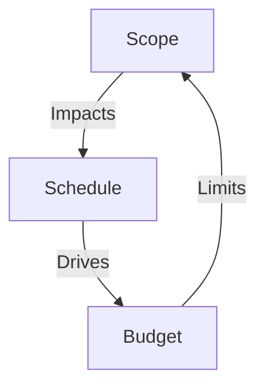

## 10.2 Scope, Schedule, and Budget Integration

Achieving a seamless relationship between scope, schedule, and budget is a cornerstone of effective project planning. In practice, these three elements—often called the “Triple Constraints” or the “Iron Triangle”—are interdependent. Changes to one constraint almost inevitably impact the others, making it critical for project managers to view them as an integrated system. This section provides a comprehensive overview of how to create an integrated project baseline based on scope, schedule, and budget alignment. It also dives into essential techniques for managing trade-offs and handling inevitable changes while preserving project objectives.

Integrating these three constraints ensures that all stakeholders have a common reference for what will be delivered, when it will be delivered, and how much it will cost. This clear baseline supports more robust oversight, risk mitigation, resource allocation, and decision-making at every stage of the project.

  
Ensuring alignment among scope, schedule, and budget safeguards a project against conflicts that often arise from miscommunication or uncontrolled changes. While the scope defines the “what,” the schedule delineates “when,” and the budget specifies “how much,” they must work synergistically to handle complexities and to maintain overall project performance.

  
### Core Concepts in Scope, Schedule, and Budget Integration

A well-established project baseline must incorporate three interwoven baselines:

• Scope Baseline  
• Schedule Baseline  
• Cost (Budget) Baseline  

Aligned together, these baselines form an integrated baseline that guides the project team and stakeholders on consistent, data-driven decisions.

  
#### Scope Baseline

The scope baseline embodies the total scope of the project—both product scope and project scope—and clarifies what is (and is not) included. It typically includes:

• The Scope Statement, describing the project deliverables, key objectives, and boundaries.  
• The Work Breakdown Structure (WBS), which decomposes the total scope into manageable deliverables, sub-deliverables, and work packages.  
• The WBS Dictionary, detailing each deliverable’s attributes, assumptions, methodologies, and acceptance criteria.  

Establishing a clear, validated scope baseline prevents uncontrolled expansions (scope creep) and ensures stakeholders share a unified vision of what will be created or delivered.

  
#### Schedule Baseline

Building a schedule baseline aligns the project timeline with the established scope, making sure all deliverables and tasks required to fulfill the scope are correctly sequenced and allocated. Key components can include:

• An Activity List or Task Breakdown, derived from the WBS.  
• Dependencies and Sequencing (e.g., via precedence diagrams).  
• Duration Estimates, fed by historical data, expert judgment, or analogous estimation.  
• Resource Allocation and Availability, ensuring tasks are properly staffed.  
• The Critical Path, highlighting tasks with zero float and high impact on overall duration.  

A solid schedule baseline acts as the project’s timeline anchor, detailing start and end dates for each activity. It is a valuable benchmark for measuring schedule performance and adjusting the plan when changes arise.

  
#### Cost (Budget) Baseline

A cost baseline projectizes expenses across the timeline, providing a time-phased budget that predicts when certain funds will be spent. Techniques like bottom-up estimation or parametric estimation allow you to combine the scope’s deliverables and the schedule’s timeline to forecast cost over time. Major components:

• The Project Budget, aggregated by the WBS elements.  
• Contingency Reserves for identified risks.  
• Management Reserves for unforeseeable events or strategic pivots.  
• Cash Flow Projections, illustrating when costs are incurred over the life cycle.  

Creating a cost baseline offers clarity on the project’s overall financial magnitude, helps coordinate funding requirements, and highlights how resources flow through different phases.

  
### Why Integration Matters

Without a robust method to integrate scope, schedule, and budget, project teams risk losing sight of how minor adjustments in one area affect the others. Integration fosters a harmonious project environment, clarifies stakeholder expectations, and substantially improves risk management—for instance, if the project scope is expanded, you must revisit both the schedule and budget to incorporate the new tasks, resources, and associated costs. Similarly, a shorter schedule often requires more funding or adjustments to the scope definition.

  
Below is a simple Mermaid.js diagram illustrating how these three constraints interconnect and influence one another:

This circular influence forms the basis of project planning, and continual integration efforts keep the project on track despite evolving circumstances.

  
### Creating an Integrated Baseline

Establishing an integrated baseline means consolidating the final, approved scope, schedule, and budget into one cohesive system of control. The process typically follows these steps:

1. Define the Project Scope  
   • Work with key stakeholders to finalize requirements and elaborations.  
   • Decompose the scope into a clear WBS and WBS dictionary.  
   • Outline acceptance criteria to validate deliverables.

2. Develop the Schedule  
   • Convert the WBS work packages into activities.  
   • Sequence the activities with logical relationships.  
   • Estimate durations and resource requirements.  
   • Determine the critical path and analyze schedule viability.  

3. Estimate and Allocate Costs  
   • Leverage historical data, parametric estimation, or analogous methods.  
   • Roll up a bottom-up cost estimation from each task to the project level.  
   • Assign relevant contingency reserves for known risks.  

4. Validate and Approve  
   • Present the integrated plan to key stakeholders or sponsors.  
   • Conduct a formal baseline approval session, often an Integrated Baseline Review (IBR).  
   • Finalize sign-offs, ensuring the scope, schedule, and cost baselines are sealed.

  
### Using Progressive Elaboration and Rolling Wave Planning

Many projects tackle complexity by adopting progressive elaboration or rolling wave planning. Rather than fully detailing every activity at the project’s onset, you plan near-term work thoroughly while keeping mid-to-late-phase activities at a higher-level. As the project moves forward and more clarity emerges, future tasks are elaborated in greater detail. This approach is especially beneficial in Agile or hybrid settings, where iterative feedback loops refine requirements, budget allocations, and timelines incrementally.

  
### Managing Trade-offs and Changes

One of the biggest challenges in real-world project management is balancing competing demands. In theory, if scope expands, then either the schedule or budget must also expand—or both. In practice, you may have to compress tasks, reassign resources, or shift priorities to manage constraints. Some common strategies for trade-offs include:

• Scope Reduction or Adjustment  
  – Can certain features or deliverables be deferred or re-scoped?  
  – Is any nonessential work that can be phased out or postponed to a later release?  

• Schedule Compression  
  – Look at “fast tracking” tasks by performing them in parallel if possible.  
  – Consider “crashing” the schedule by adding resources or overtime (though this may increase costs).  

• Budget Realignment  
  – Increase funding, if feasible, by reallocating resources, requesting additional capital, or reducing expenditures elsewhere.  
  – Reevaluate the time-phased distribution of funds to match newly updated schedules.  

• Risk-Based Decision Making  
  – Conduct scenario analyses to anticipate the impact of changes on cost, schedule, and scope.  
  – Evaluate the trade-offs among possible risk responses, and choose the one that best aligns with the organization’s risk tolerance and strategic priorities.

  
In all scenarios, making trade-offs requires transparent communication with stakeholders, regular re-baselining if significant changes occur, and thorough documentation of decisions to maintain project integrity.  

  
### Leveraging Earned Value Management (EVM)

Earned Value Management (EVM) is a powerful technique that aligns scope, schedule, and budget in one set of metrics. By methodically tracking Planned Value (PV), Earned Value (EV), and Actual Cost (AC), project teams gain deep insight into both cost and schedule performance. For example, the key EVM formulas:

  
Planned Value:  
PV = Baseline Budget × % of planned work scheduled to be complete  

Earned Value:  
EV = Baseline Budget × % of actual work completed  

Schedule Variance (SV):  
\\( SV = EV - PV \\)

Cost Variance (CV):  
\\( CV = EV - AC \\)

  
Positive variance indicates the project is ahead of schedule or under cost; negative variance reflects the opposite. By integrating scope progress with schedule timelines and cost expenditures, EVM provides an early warning system of deviations, making it easier to take corrective action.

  
### Practical Case Study

Imagine a mid-size software development project to deploy a new e-commerce platform. After establishing a thorough WBS, the team created a Gantt chart with individual sprints for iterative releases. Their cost baseline was derived from labor rates, hardware requirements, and software licenses.  

As the project moved forward, the client requested additional analytics features for customer browsing behavior. This new requirement expanded the scope. Using integrated baselines, the project manager quickly re-estimated the labor needs, updated the schedule’s agile sprints to accommodate extra tasks, and recalculated the cost baseline. After reviewing viable trade-offs, the sponsor decided to add a one-week sprint extension and an extra developer to keep to the original release date. Although the budget slightly increased, the re-baselined integrated plan ensured that the entire team and stakeholders stayed aligned on deliverables, timing, and costs.

  
### Tools and Techniques for Effective Integration

• Project Management Information Systems (PMIS): Tools such as Microsoft Project, Jira, or Primavera help maintain real-time updates to the integrated plan.  
• Collaborative Platforms: Platforms like Confluence, SharePoint, or Slack facilitate cross-team communication and reduce silos, keeping scope, schedule, and budget in sync.  
• Binder or Repository of Baseline Documents: A single location to store and manage the scope statement, WBS, schedule, cost estimates, associated assumptions, and change requests.  
• Integrated Change Control Process: A structured change process ensures that all proposed changes are evaluated for their scope, schedule, cost, resource, and quality implications.  
• Regular Status Meetings: Short daily or weekly standups, supported by monthly or quarterly stakeholder reviews, keep the iterative integration in view and ensure that any major decisions involve the right voices.

  
### Best Practices and Common Pitfalls

Best Practices:  
• Involve All Key Stakeholders: Include representatives from every impacted function—technical leads, finance, operations, marketing—to build a realistic baseline.  
• Obtain Formal Approval: A clear sign-off on the integrated baseline underscores organizational buy-in and clarifies accountability.  
• Maintain a “Single Source of Truth”: Keep all official baselines in a centralized, version-controlled repository.  
• Continuous Monitoring: Regularly track progress using metrics like Planned vs. Actual and Earned Value, adopting timely corrective actions where needed.

Common Pitfalls:  
• Mismatched Levels of Detail: If the schedule or budget is more granular than the scope, or vice versa, alignment will be weak. Ensure consistent decomposition across all baselines.  
• Ignoring Stakeholder Dynamics: Scope, schedule, and budget can all shift if stakeholder expectations aren’t managed and changes aren’t communicated.  
• Overlooking Risk: If neither time nor money is reserved for potential issues, then even small hiccups can derail the entire integrated baseline.  
• Delayed Updates: Postponing baseline updates can result in confusion, scope creep, or missed deadlines.

  
### Incorporating Agile and Hybrid Approaches

In Agile or hybrid environments, iterative methods like Scrum or Kanban rely on short-term planning that can produce a series of “micro” or rolling wave baselines. Each sprint or iteration can become a miniature project with scope, schedule, and budget constraints. These approaches demand constant communication, collaboration, and flexibility:

• Agile ceremonies—like sprint planning, daily scrums, and retrospective sessions—provide frequent checkpoints for revalidating scope, schedule, and cost.  
• Product backlogs act as a living scope document, and each iteration or release plan updates the baseline.  
• Burn-down or burn-up charts reflect budget consumption or feature completion, reinforcing an integrated view of constraints.

  
### Recommended References and Further Reading

• Project Management Institute. (2021). A Guide to the Project Management Body of Knowledge (PMBOK® Guide) – Seventh Edition.  
• PMIstandards+ (Online resource).  
• Kerzner, H. (2022). Project Management: A Systems Approach to Planning, Scheduling, and Controlling.  
• Fleming, Q. W., & Koppelman, J. M. (2016). Earned Value Project Management.  
• Cohn, M. (2005). Agile Estimating and Planning.  

  
In summary, scope, schedule, and budget must fit together like the pieces of a puzzle. The more precisely they’re aligned, the more likely the project is to deliver on stakeholder expectations while optimizing resources, timelines, and overall investments. Mastering the integration of these three constraints helps project managers drive greater efficiency and strategic value, providing the backbone for successful project outcomes.

## Integrated Baseline Knowledge Check



### Which of the following best describes an integrated baseline in project management?

- [ ] A baseline that focuses solely on resource allocations.
- [x] A consolidated scope, schedule, and budget baseline serving as a central reference.
- [ ] A specialized document only required in Agile projects.
- [ ] An extraneous plan unrelated to risk management.

> **Explanation:** An integrated baseline includes scope, schedule, and budget combined so teams have a single, unified point of reference for measuring project performance.  

### What is the primary benefit of formally approving an integrated baseline?

- [ ] It automatically prevents any changes in scope.
- [ ] It simplifies communication by establishing a single sponsor’s authority.
- [x] It secures organizational buy-in and clarifies accountability.
- [ ] It eliminates the need for change control.

> **Explanation:** When an integrated baseline is formally approved, all key participants agree on a shared set of expectations. This promotes alignment, reduces ambiguity, and assigns clear responsibility.

### If a project’s schedule is compressed to meet an earlier deadline, which of the following impacts might you expect on the baseline?

- [ ] A natural decrease in the project scope.
- [ ] No impact on cost or scope since only the schedule changes.
- [x] Potential increases in costs for added resources or overtime.
- [ ] A relaxation of quality standards to maintain the same budget.

> **Explanation:** Accelerating a schedule often requires more resources or overtime, driving up costs. If scope remains unchanged, the budget typically changes when the schedule is compressed.

### In rolling wave planning, which baseline component is planned in greater detail for the near term and at a higher level for the future?

- [ ] The cost baseline only.
- [ ] The communications plan.
- [ ] The project charter.
- [x] The schedule baseline.

> **Explanation:** Rolling wave planning often deals with the schedule in waves: near-term tasks are planned in detail while longer-term tasks remain at a broader level.  

### What does a cost baseline typically include?

- [x] Time-phased budget, contingency reserves, and management reserves.
- [ ] Only direct labor and material expenses.
- [x] Parametric or analogous estimates for each work package and deliverable.
- [ ] The project scope statement.

> **Explanation:** A cost baseline allocates costs over the project timeline and includes contingency and management reserves. It integrates with scope to reflect how each deliverable consumes resources.

### Which tool is used to monitor and control how closely a project adheres to the integrated baselines?

- [x] Earned Value Management (EVM) system.
- [ ] SWOT Analysis.
- [ ] Stakeholder Register.
- [ ] Responsibility Assignment Matrix (RAM).

> **Explanation:** EVM systematically measures schedule and cost variances against planned baselines. It is specifically designed to provide comprehensive performance feedback.

### How can an Agile approach effectively manage integrated baselines over multiple iterations?

- [x] By updating scope and budget plans at each sprint planning and review.
- [ ] By eliminating the need for baselines entirely.
- [x] By utilizing frequent retrospectives and burn-down charts to refine cost and schedule forecasts.
- [ ] By creating static, unchangeable plans at project initiation.

> **Explanation:** Agile leverages iterative cycles to refine scope, schedule, and cost at a regular cadence (e.g., each sprint or iteration), ensuring alignment remains current as new information arises.

### Which of the following is a best practice when managing trade-offs among scope, schedule, and budget?

- [x] Conducting open discussions with stakeholders on realistic impact and feasibility.
- [ ] Resorting to gold plating where possible.
- [ ] Approving changes only after project launch to avoid confusion.
- [ ] Treating scope, schedule, and budget independently to reduce complexity.

> **Explanation:** Stakeholder involvement and transparent evaluation of impact is crucial. Failing to coordinate or communicate changes leads to unintended ripple effects.

### Which scenario most likely requires re-baselining?

- [x] The sponsor requests a major feature addition that doubles the scope.
- [ ] A short, one-hour power outage at the organization’s data center.
- [ ] The project receives a minor resource shift among existing teams.
- [ ] A weekly status meeting reveals no schedule changes.

> **Explanation:** Large scope changes or expansions often necessitate revisiting and updating all three baselines—scope, schedule, and budget—to maintain accurate project control.

### True or False: An integrated change control process evaluates change requests to scope, schedule, or budget without impacting the other constraints.

- [x] True
- [ ] False

> **Explanation:** The integrated change control process ensures that any proposed alteration is analyzed for its cascading effects on all constraints and on overall project objectives.



## PMP Mastery: 1500+ Hard Mock Exams with Full Explanations

Looking to crush the PMP exam with confidence? Dive deep into 6 rigorous mock exams totaling 1500+ advanced-level questions, each accompanied by clear, step-by-step explanations. Hone your test-taking strategies, master complex topics, and build the resilience you need on exam day. Perfect for serious PMs aiming beyond fundamentals.

Enroll now:  
[PMP Mastery: 1500+ Hard Mock Exams with Exceptional Clarity & Full Explanations](https://www.udemy.com/course/pmp-2025/?referralCode=CF83A54BC86BE27F9AFE)

_Disclaimer: This course is not endorsed by or affiliated with the PMI examination authority. All content is provided purely for educational and preparatory purposes._


