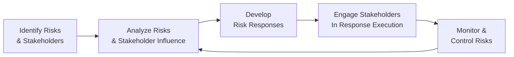

## 10.3 Risk Planning and Stakeholder Management

Effective project planning demands thorough, up-front analysis that accounts for both the known and the unknown. Risk Planning determines how the project team will proactively identify, analyze, and respond to possible threats and opportunities. Meanwhile, Stakeholder Management is instrumental in shaping project success by engaging individuals, teams, and organizations that have interests in the outcome. When risk management strategies align with stakeholders’ expectations, you create synergy that ensures everyone is on the same page from the inception of the project. This synergy not only reduces surprises but also strengthens trust, collaboration, and commitment.

Bringing risk planning and stakeholder engagement strategies together means understanding how a change event or emerging uncertainty can resonate across various stakeholders. In turn, the support and insights of stakeholders can significantly enhance risk identification and response planning. Below, we explore critical considerations, practical frameworks, and actionable strategies to integrate risk planning with stakeholder management for holistic planning and a resilient project environment.

## Holistic Risk Planning and Stakeholder Engagement

Risk Planning often involves identifying uncertainties, quantifying their potential impact, creating response strategies, and formulating monitoring protocols. Traditionally, organizations might treat risk planning as a purely technical exercise—focusing on probabilities, costs, and schedules. However, modern project management underlines the importance of tying stakeholder considerations to risk processes:

• Stakeholder Insights: Stakeholders can offer specialized knowledge, lessons from past experiences, or early warnings about external factors that could threaten the project.  
• Risk Attitudes: Each stakeholder (or stakeholder group) has a different tolerance for risk, shaped by individual or organizational culture.  
• Communication Expectations: Proper risk reporting and escalation requirements vary among stakeholders and must be included in the communication plan.  

When designed and executed in tandem, risk and stakeholder strategies help identify hidden threats and opportunities, while also ensuring consistent buy-in for planned response measures. In essence, integrated planning recognizes that the success of risk mitigation or exploitation of opportunities often depends on stakeholder engagement, resources, and shared commitment.

## Aligning Risk Management Plans with Stakeholder Concerns

Most projects develop distinct sections or sub-plans focusing on risk management and stakeholder management. Yet, alignment of these plans is critical. By examining how stakeholder engagement fosters or impedes risk response strategies, project managers can produce a comprehensive plan that:

• Identifies key stakeholders who need to be involved in risk assessments.  
• Incorporates stakeholder feedback loops in risk response activities.  
• Ensures transparency and consistent messaging around risks, especially for high-profile or sensitive issues.  
• Provides escalation paths that incorporate the organizational hierarchy, particularly for critical risks that may require executive intervention.  

When building your integrated plan, also address the timeline. High-impact and time-critical risks demand engagement from certain stakeholders sooner, whereas lower-impact or longer-range risks can be monitored and addressed with less frequency or urgency.

## Key Steps in Integrating Risk Planning and Stakeholder Management

### Step 1: Identify Common Objectives and Requirements
Begin by clarifying the project’s success criteria and connecting them to both risk tolerance thresholds and stakeholder expectations. This might involve capturing stakeholder definitions of “success” and mapping these against project constraints (scope, schedule, cost, quality).

### Step 2: Conduct Joint Risk Identification
Leverage brainstorming sessions, Delphi techniques, or risk identification workshops that invite stakeholder participation. By opening the floor to multiple perspectives, you uncover risk scenarios that might otherwise remain invisible.

### Step 3: Evaluate Risk and Stakeholder Impact Together
Once you have a list of risks, analyze them to see which stakeholders might be affected. This helps determine the seriousness of a risk and whether it might provoke resistance, require additional resources, or disrupt key relationships.

### Step 4: Formulate Risk Responses with Stakeholder Input
Engage relevant stakeholders in designing responses. Some might allay concerns by providing data or knowledge, while others can supply resources or sponsor critical risk mitigation funds. This collaboration helps tailor responses so they are feasible and favorable to stakeholder priorities.

### Step 5: Embed Risk Communication in Stakeholder Management
Develop a communication framework that includes risk-related information. The frequency, format, and medium of risk reporting should reflect stakeholder influence, interest, and risk tolerance levels. This framework should feed into your larger communications management strategy.

### Step 6: Monitor and Review Risk and Stakeholder Engagement
Monitor stakeholder sentiments over time. Newly identified risks or shifts in existing risk probabilities may change stakeholder perceptions, roles, or required actions. Regularly review your combined plan to keep it aligned with real-time project conditions.

The entire risk planning process can be visualized in conjunction with stakeholder involvement through the following diagram:

In this diagram, risk identification, analysis, and response frequently loops back to the stakeholder dimension. Effective communication lines and feedback loops ensure that as you monitor risks, you also update stakeholders on relevant shifts.

## Tools and Techniques for Risk Planning with Stakeholder Input

• Brainstorming & Workshops: Gathering cross-functional teams and key stakeholders in a structured workshop can rapidly capture diverse risk scenarios.  
• SWOT Analysis: Stakeholders can provide perspectives on Strengths, Weaknesses, Opportunities, and Threats relating to the project.  
• Risk Breakdown Structure (RBS): Cross-reference potential risk categories (technical, external, organizational, etc.) with different stakeholder groups.  
• Opportunity Management: Consider not just threats but also potential opportunities that might materialize through specific stakeholder relationships or new business prospects.  

These mechanisms form the backbone of a robust, stakeholder-inclusive risk plan. When stakeholders are both the source of and a solution to risk, the synergy becomes an iterative cycle of continuous improvement.

### Quantitative Methods and Stakeholder Engagement
Quantitative tools such as Monte Carlo simulations or decision tree analysis rely heavily on accurate data inputs. Stakeholders—particularly technical experts or those controlling budgets—are critical for providing valid assumptions. An example is the Expected Monetary Value (EMV) approach, expressed through the formula:


\text{EMV} = \sum(P_i \times I_i)


Where \\( P_i \\) is the probability of occurrence and \\( I_i \\) is the monetary impact of the event (negative for threats and positive for opportunities). If stakeholders do not agree on the underlying data, your quantitative analysis will be flawed. Hence, incorporate stakeholder consensus or well-reasoned input at each step.

## Tools and Techniques for Stakeholder Management Supporting Risk Plans

• Stakeholder Register: Capture details on stakeholder influence, interest, communication preferences, and risk attitudes.  
• Power/Interest Grids: Map out stakeholders to see how their power over project decisions intersects with their degree of interest. High-power, high-interest stakeholders often have pivotal roles in risk decisions.  
• Emotional Intelligence: Build rapport and trust with stakeholders to facilitate more honest disclosure about project concerns and uncertainties.  

Blending these tools ensures your project is well-prepared to handle the inevitable complexities that arise from stakeholder expectations and risk events that could disrupt progress.

## Real-World Case Study: Launch of a Global IT Platform

A multinational organization embarked on a project to roll out a cloud-based IT platform across regional offices worldwide. Initially, the project team neglected stakeholder engagement in risk discussions, focusing primarily on technical aspects:  
• The risk plan cited potential server downtime, data breaches, and latency issues but ignored the possibility of user resistance.  
• When it came time for user acceptance testing, local offices pushed back due to fear of job redundancies and lack of training resources.  
• This significant “resistance risk” was unaddressed, causing rollout delays and budget overruns.

Upon revisiting the plan, the project manager created an integrated approach:  
• Conducted stakeholder workshops to uncover cultural and operational concerns.  
• Updated the risk register to include change saturation and workforce morale as key risks.  
• Devised response plans involving focused training, clear communication, local champions, and bridging funds for additional user support.

This adjustment highlights that ignoring stakeholder perspectives can lead to unforeseen obstacles, emphasizing why cohesive stakeholder and risk management is essential in project planning.

## Common Pitfalls

• Treating Stakeholders as Afterthoughts: Stakeholders may raise valid points about potential risks at the project’s outset. Failure to solicit broad input can keep unseen threats hidden until too late.  
• Underestimating Stakeholder Influence: Sometimes, a stakeholder’s formal role does not accurately reflect their influence level, leading to mismatched engagement strategies.  
• Not Revisiting Plans During Execution: Risk management is iterative. Plans must be reassessed and updated as project conditions evolve and new stakeholders emerge or their influence changes.  
• Lack of Transparency: Withholding risk information from stakeholders can damage trust and hamper collaboration. Communicate openly, balancing confidentiality with the need for proactive problem-solving.

## Best Practices

• Co-Create the Plan: Invite key stakeholders to co-author portions of the risk management plan, bridging any knowledge gaps.  
• Tailor Communication Frequency: High-influence, high-interest stakeholders typically require frequent, detail-rich updates, whereas lower-interest parties can thrive with occasional, high-level summaries.  
• Use Visual Aids: Leverage risk maps, bubble charts, or dashboards that show how risk levels are changing, helping stakeholders see at a glance whether the project is trending up or down in risk exposure.  
• Link to Project Objectives: Continually remind stakeholders how risk responses help protect or enhance critical project objectives (e.g., scope, schedule, cost, quality).  

## Strategies to Overcome Potential Challenges

1. Early Resistance to Collaboration: Encourage open dialogues and highlight the benefits of risk planning to each stakeholder group. Show them the personal or departmental payoff of engaged risk management.  
2. Cultural Barriers: In global or cross-cultural projects, create an inclusive environment by translating materials, using interpreters, or adapting meeting formats to local norms.  
3. Shifting Organizational Priorities: If the organization’s strategic direction changes, revisit your integrated plan. Determine which stakeholders are most impacted by the shift and how risk thresholds need adjustment.  
4. Resource Constraints: If the project lacks dedicated resources for robust risk and stakeholder efforts, champion the importance of meeting these needs. Position this investment as beneficial for preventing costlier rework or crisis management down the road.

## Conclusion

Risk Planning and Stakeholder Management are intrinsically linked. Together, they form a feedback-driven planning approach that helps teams proactively manage uncertainty while securing the commitment and resources necessary for meaningful responses. By embedding continual stakeholder engagement within each phase of risk planning, organizations can create a project environment poised for both innovation and resilience. The more you integrate these strategic perspectives, the fewer unwelcome surprises you will face, and the stronger your ability to capitalize on emerging opportunities.

Remember that no matter the development approach—predictive, agile, or hybrid—risk and stakeholders together drive the trajectory of your project. Aim for collaboration, transparency, and continuous improvement to ensure that your risk plan remains robust and aligned with the dynamic concerns of your stakeholders.

## Quiz: Assess Your Risk and Stakeholder Synergy



### Which statement best describes the synergy between Risk Planning and Stakeholder Management?

- [x] Stakeholder insights can reveal hidden risks, while risk planning adapts to stakeholder expectations.
- [ ] Risk planning rarely requires the input of stakeholders because risks are typically technical in nature.
- [ ] Stakeholder management and risk planning must remain separate to avoid conflicting interests.
- [ ] Only senior-level executives can provide valid risk data for the project.

> **Explanation:** By engaging stakeholders in risk discussions, project teams benefit from additional perspectives, uncover potential blind spots, and ensure that response plans align with stakeholder expectations.

### What is the main advantage of involving stakeholders in early risk identification sessions?

- [x] Multiple perspectives can reveal diverse risks and foster broad-based ownership of solutions.
- [ ] It allows project managers to delegate the entire risk planning process to stakeholders.
- [ ] Stakeholders can remove all threats from the project immediately.
- [ ] The project can avoid documenting any risks in official registers.

> **Explanation:** Early stakeholder participation creates a more comprehensive risk picture and builds a shared sense of responsibility for addressing potential challenges.

### Which tool is most useful for mapping stakeholder influence and interest levels as part of the risk planning process?

- [ ] Risk Breakdown Structure (RBS)
- [x] Power/Interest Grid
- [ ] Schedule Network Diagram
- [ ] Critical Path Method

> **Explanation:** A Power/Interest Grid helps project managers understand which stakeholders have the most power and greatest interest, which is crucial for tailoring risk-related communication and gaining buy-in for response plans.

### When using Expected Monetary Value (EMV), which values are multiplied to calculate each risk event’s potential impact?

- [ ] Severity × Duration
- [ ] Frequency × Occurrence
- [x] Probability × Impact
- [ ] Budget × Quality

> **Explanation:** EMV calculates the probability of a risk event against its estimated impact. This reveals a monetary average outcome for each risk to prioritize effort and resources effectively.

### What is the primary reason for frequent risk-plan re-evaluation during project execution?

- [x] Risk probabilities, stakeholder opinions, and organizational assumptions can shift over time.
- [ ] The project manager must satisfy auditor requirements to fill out weekly reports.
- [x] Stakeholder priorities can never be predicted with any accuracy.
- [ ] Frequent re-evaluation is not necessary if the initial risk plan is comprehensive.

> **Explanation:** Both risk factors and stakeholder interests are dynamic. Regular reviews keep the plan current and appropriately aligned with the evolving landscape of a project.

### What real-world challenge does the case study of a global IT platform rollout highlight?

- [ ] Risk management is unnecessary for global projects.
- [x] Ignoring stakeholder concerns can introduce significant implementation delays.
- [ ] Technical risks are always more impactful than cultural or organizational risks.
- [ ] Communication planning is overrated in large, global endeavors.

> **Explanation:** The case demonstrated that failing to account for stakeholder perspectives—particularly regarding cultural and operational concerns—led to unforeseen resistance and budget impacts.

### Which best practice supports effective integration of Risk Planning and Stakeholder Management?

- [x] Co-creating risk responses with stakeholders.
- [ ] Focusing solely on the project manager’s risk appetite.
- [x] Building an entirely separate communication structure for risk-only discussions.
- [ ] Avoiding visual risk aids to keep information confidential.

> **Explanation:** Collaborative creation of risk strategies fosters inclusivity, ownership, and ensures responses are realistic given the expertise and resources of stakeholders.

### What is the main benefit of using quantitative risk analysis tools, such as decision trees or Monte Carlo simulations, in stakeholder engagement?

- [ ] They eliminate the need for any subjective interpretation.
- [ ] They assure all project risks can be completely eradicated.
- [x] They provide data-driven insights that guide informed stakeholder decision-making.
- [ ] They can replace qualitative discussions with automated processes.

> **Explanation:** Quantitative analyses lend structure to the discussion, enabling stakeholders to see how varied probabilities or cost factors can shape outcomes, thus improving consensus-building.

### How can emotional intelligence (EI) improve stakeholder engagement in risk planning?

- [x] By creating trust and open communication, stakeholders feel comfortable disclosing concerns and uncertainties.
- [ ] By avoiding difficult issues in risk discussions to maintain harmony.
- [ ] By promoting an authoritarian leadership approach.
- [ ] By ensuring only the project's sponsor is allowed to voice concerns.

> **Explanation:** Emotional intelligence skills—such as empathy, rapport-building, and active listening—help the team raise sensitive issues and collaborate on acceptable solutions.

### Is it advisable to keep certain high-impact risks hidden from all but the project manager?

- [x] False
- [ ] True

> **Explanation:** Transparency is vital for effective collaboration and informed decision-making. Concealing key risks undermines stakeholder trust and can jeopardize the project’s success.



## PMP Mastery: 1500+ Hard Mock Exams with Full Explanations 

Looking to crush the PMP exam with confidence? Dive deep into 6 rigorous mock exams totaling 1500+ advanced-level questions, each accompanied by clear, step-by-step explanations. Hone your test-taking strategies, master complex topics, and build the resilience you need on exam day. Perfect for serious PMs aiming beyond fundamentals.  

Enroll now:  
[PMP Mastery: 1500+ Hard Mock Exams with Exceptional Clarity & Full Explanations](https://www.udemy.com/course/pmp-2025/?referralCode=CF83A54BC86BE27F9AFE)

_Disclaimer: This course is not endorsed by or affiliated with the PMI examination authority. All content is provided purely for educational and preparatory purposes._
