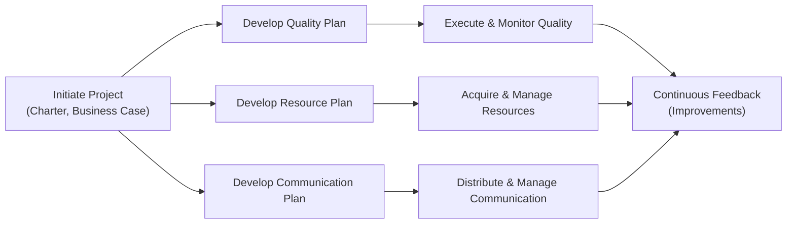

## 10.4 Quality, Resources, and Communication Plans

Establishing clear and robust plans for quality, resources, and communication is a critical component of the Planning Performance Domain. Effective planning in these three areas helps ensure that the product or service meets or exceeds expectations, that the project has the right people and materials at the right time, and that all stakeholders remain aligned and informed. This section outlines how to develop, integrate, and adapt these plans across traditional, agile, and hybrid environments. You will also find practical examples and considerations that reflect the complexity of real-world projects.

---

### The Triad: Quality, Resources, and Communication

Quality, resources, and communication plans are interdependent in driving successful project outcomes:

• A good quality plan ensures deliverables meet requirements and stakeholder expectations.  
• An effective resource plan aligns teams, materials, and budgets, making sure capacity meets demand.  
• A robust communication plan keeps everyone informed, fosters collaboration, and makes certain that the right people receive the right information at the right time.

In combination, these plans support a holistic approach to project management that aligns with the PMBOK® Guide Seventh Edition principles (e.g., Stewardship, Value Focus, System Thinking, and Tailoring) and the PMP® Exam domains.

---

### Quality Planning

At its essence, quality planning strives to define acceptable standards, methods, and criteria to deliver outcomes that fulfill stakeholder requirements. Developing a quality plan involves anticipating potential issues, prioritizing preventative measures, and specifying metrics to evaluate performance. Regardless of delivery approach (predictive, agile, or hybrid), quality planning is vital to ensure a smooth path from requirements to final acceptance.

#### Key Components of a Quality Plan

1. **Quality Objectives**  
   • Clearly specify quality goals (e.g., internal defect rate, customer satisfaction levels).  
   • Relate objectives to the business case and expected benefits.  

2. **Quality Standards and Regulations**  
   • Incorporate relevant industry standards (e.g., ISO 9001) or organizational guidelines.  
   • Comply with legal, regulatory, or environmental requirements.  

3. **Metrics and Acceptance Criteria**  
   • Define measurable criteria (e.g., test coverage, error margins, performance benchmarks).  
   • Use acceptance tests or checklists to confirm whether deliverables meet expectations.  

4. **Tools and Techniques**  
   • Identify or tailor procedures for Quality Assurance (QA) and Quality Control (QC), such as:  
     – Statistical Process Control (SPC)  
     – Cause-and-Effect (Ishikawa) Diagrams  
     – Pareto Analysis  
     – Checklists and Audits  

5. **Roles and Responsibilities**  
   • Assign who is responsible for each quality activity (e.g., test lead, QA manager, or Scrum Master).  
   • Ensure accountability aligns with the governance structure.  

6. **Continuous Improvement Processes**  
   • Plan for ongoing feedback loops, such as agile retrospectives or Final Project Reviews.  
   • Emphasize the PDCA (Plan-Do-Check-Act) cycle or Kaizen technique for incremental improvements.

#### Quality in Predictive vs. Agile Approaches

• **Predictive Methodologies**  
  – Quality control frequently relies on formal inspections, gating processes, or milestone reviews.  
  – QA tasks are scheduled with deliverables (e.g., after each major phase in a waterfall approach).  

• **Agile Methodologies**  
  – Quality is “baked in” through frequent testing, continuous integration, and quick feedback loops.  
  – Collaboration with the Product Owner or stakeholders ensures quality requirements are continuously refined and validated.  

• **Hybrid**  
  – Blends formal gating processes and iterative feedback to expedite early discovery of defects.  

#### Common Pitfalls and Best Practices

**Pitfalls**  
• Over-engineering quality measures that slow down the delivery.  
• Ignoring the cost of poor quality, such as rework and negative brand impact.  
• Assuming a single approach fits all project contexts.

**Best Practices**  
• Right-size your quality plan through tailoring: more rigorous methodologies for high-stakes projects, lighter for smaller or less complex deliveries.  
• Involve cross-functional stakeholders in establishing acceptance criteria.  
• Keep quality metrics visible through dashboards or burn charts.  

---

### Resource Planning

Resource planning encompasses the identification, allocation, and management of physical, human, and organizational resources required to execute the project successfully. This includes defining team roles, obtaining materials or equipment, and ensuring budget alignment with project needs. Resource planning is integral to agile or predictive environments alike—both require coordination of capacity and skills to deliver value.

#### Types of Resources

• **Human Resources**  
  – Project team members, subject matter experts, stakeholders, vendors.  
  – Skills, competencies, capacity, and availability.  

• **Physical Resources**  
  – Equipment, facilities, materials, infrastructure.  
  – Maintenance, logistics, and storage considerations.  

• **Financial Resources**  
  – Budget allocations, funding resilience (contingency reserves), compliance with financial constraints.  

• **Knowledge Resources**  
  – Databases, intellectual property, previous lessons learned, or organizational knowledge repositories.  

#### Developing a Resource Plan

1. **Resource Requirements**  
   • Identify the skill sets or materials needed.  
   • Specify timing and quantity (full-time, part-time, or just-in-time availability).  

2. **Resource Breakdown Structure (RBS)**  
   • Create hierarchical charts to categorize resources by function, department, or type.  
   • Similar to a Work Breakdown Structure (WBS) but focusing on resources rather than tasks.  

3. **Staffing and Team Formation**  
   • Clarify roles and responsibilities using RACI (Responsible, Accountable, Consulted, Informed) charts.  
   • Ensure alignment with the project’s governance structure and stakeholder register.  

4. **Resource Acquisition and Outsourcing**  
   • Evaluate make-or-buy decisions (see also Procurement Management in Chapter 23).  
   • Factor in vendor lead times, external constraints, or licensing requirements.  

5. **Capacity Management**  
   • Monitor resource utilization and potential bottlenecks.  
   • Use forecasting or velocity (in agile) to adjust resource allocations.  

6. **Performance and Team Development**  
   • Plan for training needs, coaching, or conflict resolution.  
   • Establish an environment that encourages knowledge sharing and cross-training.

#### Agile vs. Predictive Resource Management

• **Predictive (Traditional) Projects**  
  – Often rely on a strict timeline with up-front resource allocations.  
  – Resource leveling or smoothing techniques are applied during scheduling.  

• **Agile Projects**  
  – Emphasize stable, cross-functional teams that remain intact over multiple iterations.  
  – Resource allocation is flexible, responding to backlog changes and velocity.  

• **Hybrid**  
  – Some resources might be fixed and allocated through a predictive schedule, while agile teams adjust sprints as needed.  

#### Real-World Challenges and Mitigation

• **Challenge**: Unexpected staff turnover (e.g., key developer resigns).  
  – **Mitigation**: Cross-training, knowledge transfer sessions, or using a robust knowledge repository.  

• **Challenge**: Rapid scale-ups due to scope expansion.  
  – **Mitigation**: Incorporate contingency plans for staff augmentation or flexible supplier contracts.  

• **Challenge**: International or remote teams.  
  – **Mitigation**: Address cultural, time-zone, and language barriers with effective communication tools and cultural awareness training.  

---

### Communication Planning

Communication is the lifeblood of successful projects. A communication plan outlines the modes, cadence, and responsibilities for generating and distributing information. It is especially critical in projects involving multiple departments, diverse stakeholders, or distributed teams.

#### Objectives of a Communication Plan

• Ensuring timely and accurate information flow to the appropriate audiences.  
• Fostering trust and transparency through consistent updates.  
• Minimizing misunderstandings, scope creep, or delays resulting from miscommunications.  
• Supporting stakeholder engagement by tailoring messages to each group’s needs.

#### Elements of a Communication Plan

1. **Stakeholder Identification and Analysis**  
   • Use stakeholder registers to categorize and prioritize influence, interest, and information needs.  
   • Consider language preferences, time zones, or communication channels.  

2. **Information Requirements**  
   • What details do stakeholders need (progress updates, risk status, budget reports)?  
   • Define required level of detail (high-level summary vs. granular detail).  

3. **Communication Methods and Technologies**  
   • Formal reports, presentations, agile ceremonies, collaboration tools (e.g., Microsoft Teams, Slack, Jira).  
   • Face-to-face vs. virtual, synchronous vs. asynchronous.  

4. **Schedule and Frequency**  
   • Monthly steering committee reviews, weekly stand-ups, daily team check-ins, or milestone-based updates.  
   • Align the communication rhythm with the project lifecycle (predictive phases or agile sprints).  

5. **Roles and Responsibilities**  
   • Audience segmentation: who sends, who receives, who reviews, and who approves.  
   • RACI or stakeholder matrix clarifies communication accountability.  

6. **Feedback Mechanisms**  
   • Collect feedback through retrospectives, surveys, or continuous improvement loops.  
   • Adjust communication channels and frequency based on stakeholder response.

#### Traditional vs. Agile Communication

- **Predictive**  
  – Often formal, documented communications (e.g., milestone reports).  
  – May concentrate on extensive documentation over frequent informal updates.  

- **Agile**  
  – Emphasizes face-to-face interactions, daily stand-ups, and iterative reviews.  
  – Lightweight documentation with real-time communication.  

- **Hybrid**  
  – Formal communication layered with frequent agile touchpoints.  

#### Communication Agents in Virtual Settings

In an increasingly remote and globalized environment, teams rely heavily on digital platforms. Common best practices include:

• Consistent use of video conferencing to build rapport and mitigate misunderstandings.  
• Shared document repositories to ensure version control.  
• Virtual whiteboards or brainstorming tools (e.g., Mural, Miro) to encourage creative collaboration.  

---

### Integrated Perspective: Bringing Quality, Resource, and Communication Plans Together

Although we often organize these plans independently (for clarity and accountability), they must integrate seamlessly for a successful project outcome. The relationship can be visualized as follows:

In this diagram:  
• Quality, Resource, and Communication Plans originate from initial project documents.  
• Each plan feeds into its respective execution activities.  
• All are connected through continuous feedback loops, emphasizing that planning is iterative and adaptive.  

---

### Practical Case Study: Software Implementation Project

Consider a medium-scale software implementation in a mid-sized enterprise. This project operates in a hybrid mode, where overall phases are defined predictively (Requirements, Design, Implementation, Testing, Deployment), yet iteration cycles within Implementation and Testing are agile.

1. **Quality Plan**  
   - The business owner sets a <strong>critical success criterion</strong> of no more than 2% post-deployment defects.  
   - The project team decides to perform continuous integration and weekly code reviews.  
   - Acceptance tests are defined jointly by the Product Owner, business analysts, and testers.  

2. **Resource Plan**  
   - A specialized cloud architect is needed only during the design phase (4-6 weeks).  
   - Two agile teams work in parallel, supported by a shared pool of UI/UX specialists.  
   - A RACI chart clarifies that the Product Owner approves user stories, while the Scrum Master manages resource conflicts.  

3. **Communication Plan**  
   - Daily stand-ups for each agile team; weekly stakeholder sync calls.  
   - Monthly steering committee review for senior executives, focusing on sponsor-level metrics and budget alignment.  
   - Internal confluence page with dashboards of sprint velocity, defect trends, and risk status updates.

---

### Adapting Plans Throughout the Project

Plans are living documents. In environments that emphasize adaptive lifecycles (like agile or hybrid), planning iterates as more information becomes available. It is essential to maintain:

• **Baselining Important Segments**  
  – For predictive components, once baselined, changes must follow a formal change control process.  
  – For agile sprints, the scope is locked in for each iteration, but the backlog can continuously evolve.  

• **Frequent Review and Alignment**  
  – Revisit quality standards as new regulatory guidelines emerge or stakeholder priorities shift.  
  – Update resource allocations if the project scope changes or team velocity is higher/lower than expected.  
  – Fine-tune communication cadence to match stakeholder engagement levels.  

• **Collaboration and Stakeholder Engagement**  
  – Empower team members to provide input on improvements to each plan.  
  – Engage stakeholders to confirm if communication methods remain effective.

---

### Common Challenges and Strategies for Success

• **Challenge**: Insufficient or fluctuating budgets.  
  – **Strategy**: Use resource buffers, secure sponsor buy-in early, and prioritize scope to match available funding.  

• **Challenge**: Varying stakeholder expectations on quality standards.  
  – **Strategy**: Develop shared definitions of “Done” and “Acceptance Criteria” with regular check-ins to manage expectations.  

• **Challenge**: Cultural or language barriers aside from time-zone differences.  
  – **Strategy**: Provide documentation in multiple languages if needed, appoint local liaisons, or use more visual forms of communication (infographics, diagrams).  

• **Challenge**: Lack of alignment between resource plan and communication plan.  
  – **Strategy**: Ensure resource constraints (e.g., part-time staff availability) are reflected in the communication schedule.  

---

### Additional Resources

• **PMBOK® Guide Seventh Edition** – Particularly the sections on Performance Domains (Planning, Project Work, Delivery, Measurement, Uncertainty).  
• **Agile Practice Guide** by PMI – Explores agile communication cadences and resource management techniques in iterative contexts.  
• **“Quality Management for Projects and Programs”** by Lewis Irvine – Offers an in-depth understanding of implementing quality processes.  
• **RITA Mulcahy’s PMP® Exam Prep Book** – Strong coverage of planning processes, including resource and communication planning best practices.  

Consider enrolling in advanced online courses (e.g., Udemy, Coursera) targeting specific aspects of project planning, resource management, or agile leadership to deepen your knowledge.

---

## Elevate Your Project Plans: Quality, Resources, and Communication Quiz



### Which statement best describes the primary goal of a project’s quality plan?

- [ ] To conduct audits and produce detailed quality control checklists.  
- [ ] To quantify risk thresholds based on quality metrics.  
- [x] To define acceptable standards, criteria, and methods that ensure deliverables meet stakeholder requirements.  
- [ ] To outline only the cost-related quality activities.  

> **Explanation:** A quality plan outlines the required standards and processes to ensure deliverables achieve or surpass stakeholder expectations. While audits, quantification, and other aspects are essential, the core purpose is to define and assure quality requirements are met.

### Which of the following is most critical for maintaining team morale and effectiveness in agile resource planning?

- [x] Ensuring stable, cross-functional teams that remain intact across iterations.  
- [ ] Creating a daily RACI chart for every user story.  
- [ ] Hiring a consultant for every specialized need.  
- [ ] Rotating team members randomly to cover different roles.  

> **Explanation:** Agile frameworks emphasize keeping stable, cross-functional teams that grow in synergy and expertise over multiple iterations. Frequent reassignments or random rotations often disrupt team bonding and efficiency.

### A key difference between communication in a predictive environment versus an agile approach is:

- [ ] Agile projects never document communications in formal reports.  
- [ ] Predictive projects exclusively use face-to-face communication.  
- [x] Agile teams emphasize continuous feedback loops with lighter documentation, while predictive teams rely more on formal, scheduled updates.  
- [ ] There is no real difference; both follow the same processes.  

> **Explanation:** Traditional, plan-driven projects often focus on scheduled, formal communications, while agile methodologies highlight more frequent, informal but highly interactive communication. Agile fosters face-to-face or real-time collaboration to quickly adapt to changes.

### In a hybrid project, how can resource planning combine aspects of both predictive and agile methods?

- [x] Identify fixed assignments for certain phases while keeping flexible cross-functional teams for iterative tasks.  
- [ ] Require that all tasks be completed at the same pace without room for change.  
- [ ] Implement a fully dedicated agile team for initial planning, then switch to a waterfall approach.  
- [ ] Rely solely on baseline budgets without adjusting for iteration-based changes.  

> **Explanation:** Hybrid environments often lock in certain critical resources for well-defined phases (predictive), while other components adopt an agile approach allowing for iterative adaptation and flexible resourcing.

### Which of the following is NOT typically a focus of the quality plan?

- [x] Defining the stakeholder register.  
- [ ] Establishing acceptance criteria.  
- [x] Specifying relevant industry or regulatory standards.  
- [ ] Selecting Quality Assurance and Quality Control tools.  

> **Explanation:** The stakeholder register is typically a communication or stakeholder management artifact, not specifically part of the quality plan. Quality planning indeed includes acceptance criteria, relevant standards, and QA/QC tools. (Note: Two correct answers above are a demonstration of a multi-select question where both specifying relevant standards and establishing acceptance criteria are valid focuses, whereas setting the stakeholder register is usually outside the scope of a quality plan.)

### How can organizations ensure effective communication for distributed (virtual) teams?

- [x] Use consistent video conferencing and collaboration tools, shared document repositories, and well-defined communication cadences.  
- [ ] Enforce complete reliance on asynchronous email to avoid scheduling complexities.  
- [ ] Eliminate daily standups to accommodate different time zones.  
- [ ] Appoint a single communication channel for all project types.  

> **Explanation:** Virtual teams need a mixture of synchronous communication (video conferencing, stand-ups) and asynchronous tools (shared docs) to overcome distance and time-zone gaps. Consensus on the frequency and method fosters clarity and collaboration.

### Which statement describes a best practice in resource management for complex projects?

- [x] Conduct ongoing evaluations of skills, capacity, and availability, and adapt resource allocations accordingly.  
- [ ] Lock in resources at project inception with no changes allowed.  
- [x] Employ a simplistic approach; assume the same resource needs for each phase.  
- [ ] Neglect cross-training, focusing only on specialized experts.  

> **Explanation:** Resource requirements inevitably shift when facing complexities, changing user needs, or unforeseen events. Conducting regular evaluations and building adaptability (including cross-training) is essential for beating complexity.

### What is a common pitfall in quality planning?

- [x] Over-engineering quality processes leading to schedule delays and cost overruns.  
- [ ] Involving stakeholders early to define acceptance criteria.  
- [ ] Aligning quality metrics with strategic objectives.  
- [ ] Using PDCA cycles for continuous improvement.  

> **Explanation:** While thoroughly planned quality management is vital, going overboard with excessive or bureaucratic processes can hinder project flow and inflate costs. The other answer choices represent best practices.

### During the planning phase, if the project scope expands substantially, which of the following should occur?

- [x] The resource plan and communication plan should be updated to reflect increasing demands on personnel availability and stakeholder information needs.  
- [ ] Only the schedule management plan should be changed.  
- [ ] Immediately freeze the project to avoid further changes.  
- [ ] Escalate to the sponsor but keep existing plans unchanged.  

> **Explanation:** A significant scope shift typically triggers re-evaluation of resources needed and communication strategies. All relevant plans must be updated to ensure alignment and stakeholder engagement remain effective.

### True or False: In an agile project, communication requires substantially less planning because of constant collaboration.

- [x] True  
- [ ] False  

> **Explanation:** While agile projects emphasize face-to-face interactions and daily collaboration, they still demand thorough planning of communication modes, frequencies, and stakeholder engagement—albeit often in a lighter, iterative format rather than a single, static document.



---

## PMP Mastery: 1500+ Hard Mock Exams with Full Explanations 

Looking to crush the PMP exam with confidence? Dive deep into 6 rigorous mock exams totaling 1500+ advanced-level questions, each accompanied by clear, step-by-step explanations. Hone your test-taking strategies, master complex topics, and build the resilience you need on exam day. Perfect for serious PMs aiming beyond fundamentals.

Enroll now:  
[PMP Mastery: 1500+ Hard Mock Exams with Exceptional Clarity & Full Explanations](https://www.udemy.com/course/pmp-2025/?referralCode=CF83A54BC86BE27F9AFE)

_Disclaimer: This course is not endorsed by or affiliated with the PMI examination authority. All content is provided purely for educational and preparatory purposes._
