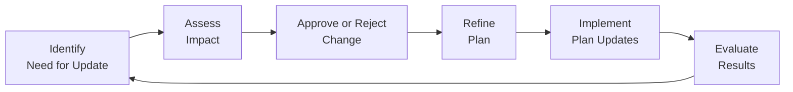

## 10.5 Ongoing Refinement and Updates

In project management, no plan remains static. Whether you follow a predictive, agile, or hybrid life cycle, the need for continuous review and adjustment of your plans never disappears. Changes may arise from countless sources: stakeholder demands, new risks or opportunities, shifts in business priorities, or unforeseen technological disruptions. To maintain alignment with strategic goals and deliver maximum value, project managers and teams must embrace ongoing refinement and updates throughout the project life cycle. This section explores processes, best practices, and real-world techniques to ensure that plans remain current, relevant, and responsive to emerging conditions.

  
### The Living Nature of Project Plans  
Project plans are often misunderstood as static documents, fixed at the start of the project. While some baselines (scope, schedule, budget) do exist as formal references, effective project management requires recognizing that plans are also living documents. They must evolve to reflect newly uncovered information, changing requirements, or lessons learned during execution.  

- Living Document Concept:  
  A “living” plan is subject to authorized updates whenever a new development impacts outcomes. These updates follow a defined change control process—whether lightweight or rigorous—and ensure alignment across all project management domains (stakeholders, team performance, planning, work execution, delivery, measurement, and uncertainty).

- Plan-Do-Check-Act (PDCA):  
  The PDCA cycle, popularized by W. Edwards Deming, provides a model for continuous improvement. After implementing an updated plan (Plan and Do), the team verifies results against expected targets (Check), then acts on any discrepancies or new opportunities (Act). This cycle ensures an ongoing flow of refinements.

  
### Key Drivers for Ongoing Refinement  
The factors that prompt plan adjustments vary greatly by industry, project size, and organizational culture. Nevertheless, several common scenarios repeatedly arise across most project environments:  

- Shifting Stakeholder Requirements  
- Regulatory or Compliance Changes  
- Emergence of New Risks or Opportunities  
- Resource Availability Issues  
- Market and Technological Changes  
- Adjustments in Organizational Strategy

By systematically monitoring these drivers, you can anticipate and respond proactively, reducing the likelihood of negative project impacts.  

  
### Aligning Refinements with Change Control  
In many predictive or traditional environments, formal change control procedures govern how and when updating the project plan is permissible. In agile and hybrid scenarios, change is integrated into every iteration, thus making refinement an expected part of each cycle. Regardless of approach, the balance between flexibility and control defines how swiftly and frequently updates can happen.  

- Predictive Projects:  
  In a predictive (waterfall) environment, change requests typically go through a formal evaluation. This may include conducting an impact analysis on schedule, cost, quality, and risk factors before approval by a project control board.  

- Agile Projects:  
  In agile methods like Scrum, schedules and costs might remain comparatively stable (for instance, a fixed number of sprints or time-boxes), while scope can be adjusted each iteration via product backlog refinements. The plan is refined at regular intervals (sprint reviews, backlog grooming sessions), making updates more dynamic.  

- Hybrid Projects:  
  Projects that blend elements from predictive and agile models maintain a relatively fixed overall timeline and budget, but incorporate iterative cycles for scope definition and continuous feedback. Typically, the high-level roadmap might be set at the outset, while details are continually refined within each iterative cycle.  

  
### Integrating Feedback Loops and Continuous Improvement  
Frequent feedback loops—such as daily stand-ups, weekly status meetings, or sprint reviews—play a central role in discovering what changes are necessary. Each feedback loop offers learning that can inform plan modifications.

- Daily/Weekly Status Checks:  
  Short, regular check-ins with the team help identify blockers, highlight risks, and reveal new opportunities. These discussions often lead to micro-adjustments in task assignments, resource allocations, or schedules.  

- Periodic Retrospectives:  
  In agile frameworks, retrospectives foster a sense of continuous team improvement. Outputs from retrospectives might address process gaps, communication inefficiencies, or risk management blind spots. Action items often result in updates to the project plan or supporting documentation.  

- Increment Reviews:  
  Whenever a project phase or development iteration ends, you gain insights into how well deliverables align with stakeholder expectations. Feedback from demonstrations or user acceptance testing can lead to refined requirements or revised end dates.  

  
### Ensuring Traceability of Changes  
Even in the most flexible project environments, traceability of changes remains essential. Without proper documentation, teams risk confusion, scope creep, or duplication of effort.  

- Version Control:  
  Treat key project documents and artifacts (project management plan, schedule, backlog) with the same rigor as source code, tagging versions as you incorporate changes.  

- Automated Tracking:  
  Many project management tools provide audit trails automatically. Every change to a user story, feature, or backlog item is logged with user, timestamp, and reason for change.  

- Change Impact Analysis:  
  Before implementing a change, evaluate its effect on all relevant project constraints: timeline, budget, scope, quality, and risk profile. Present these findings transparently to decision-makers (stakeholders, sponsors, product owners) to ensure informed acceptance of modifications.  

  
### Processes for Continuous Plan Refinement  
Refinement and updating activities can be approached in a structured or flexible way, depending on the project environment. Common techniques and steps include:

- Scheduled Replanning Sessions  
  Scheduling monthly or quarterly replanning sessions ensures that designated time is set aside to adjust scope, budget, or schedule. In large projects, these sessions typically occur at major milestones.  

- Rolling Wave Planning  
  Instead of planning detailed tasks for the entire project horizon, rolling wave planning offers detail only for upcoming phases, leaving later stages in a high-level format. As the project progresses, more refined planning takes place closer to execution.  

- Agile Ceremonies  
  Within agile teams, the product backlog refinement ceremony is a cornerstone. Here, features are re-prioritized based on user needs, technology constraints, and market conditions.  

- Cross-Functional Workshops  
  Bringing diverse stakeholders and subject matter experts into the same room can streamline alignment and reduce rework. Conducting frequent workshops to re-evaluate assumptions fosters collaboration and shared ownership.  

  
### Balancing Flexibility with Stability  
A common challenge is determining how often and how extensively to adjust the plan. Overly frequent changes may create chaos, while inadequate updates can lead to plan obsolescence.

- Stabilizing Intervals:  
  Even agile projects can benefit from short intervals (like sprints) during which the team commits to certain objectives while limiting changes. This creates predictability for the team while still allowing for iteration-to-iteration refinements.  

- Prioritization Rules:  
  Establish guidelines for which changes merit immediate revisions. For example, a minor schedule tweak affecting only a single small task may not justify a full plan re-baseline. In contrast, a major shift in strategic direction or budget constraints demands prompt response.  

- Paradox of Rigid vs. Fluid:  
  Striking the right balance involves tailoring. For instance, in a highly regulated environment, you may need a stricter change control process. In a startup environment, you might incorporate rapid pivots with minimal bureaucracy.  

  
### Real-World Example: E-commerce Platform Upgrade  
Imagine an e-commerce startup undertaking a platform overhaul to accommodate high-volume seasonal traffic. Once the project plan is drafted, initial sprints reveal that user interface enhancements need more work than originally estimated. Additionally, the marketing team decides to pivot and add loyalty program features mid-project.  

- Refinement Step 1:  
  The product owner updates the user stories, adjusting priorities to accommodate new loyalty-based functionality and deferring lower-impact enhancements.  

- Refinement Step 2:  
  The scrum team updates estimates for user interface tasks based on a deeper understanding of complexities. The revised schedule is shared with stakeholders.  

- Refinement Step 3:  
  A new risk is identified regarding increased load-testing requirements. This leads to an updated resource plan and budget allocation for performance testing.  

As these refinements occur, the project remains aligned with marketing objectives, effectively meeting stakeholder demands in near real-time rather than waiting for a formal phase-gate.  

  
### Case Study: Multi-Year Infrastructure Project  
Large-scale infrastructure projects often require multi-year planning, making them vulnerable to market volatility, policy changes, and cost fluctuations. In one such project involving the construction of a regional highway, initial estimates for labor and materials changed drastically after geopolitically triggered events caused the cost of steel to surge 30%. Additionally, local regulatory agencies introduced new environmental compliance requirements mid-project.  

1. Material Cost Spike:  
   - Updated Cost Baseline: The project’s cost baseline was re-evaluated. Adjustments had to be made to accommodate higher steel prices.  
   - Stakeholder Communication: A detailed briefing was conducted to explain the cost variance. 

2. Regulatory Adjustment:  
   - Scope Statement Revision: The project scope was extended to include additional environmental safeguards.  
   - New Timeline: Implementing these measures meant adding time to the project schedule and reassigning resources.  

3. Contingency Assignment:  
   - Reserves Recalculation: Both management and contingency reserves were updated to reflect new risks.  
   - Risk Register Update: The risk register incorporated environmental compliance as a higher probability-likelihood risk for future phases.  

By embracing ongoing refinement and transparent updates, the project was able to stay on course despite significant external pressures, ultimately delivering a compliant infrastructure solution that stakeholders could endorse.  

  
### Tools and Techniques to Support Refinement  
Technology can greatly simplify plan refinement, especially in environments with distributed teams and complex deliverables.

- Integrated Project Management Tools:  
  Tools like Microsoft Project, Primavera P6, Jira, or other platforms support real-time collaboration, resource leveling, budgeting, and integrated change tracking.  

- Burn Charts and Cumulative Flow Diagrams:  
  Agile teams frequently rely on burn charts or cumulative flow diagrams to visualize progress and flow constraints. Any unexpected plateau or spike in these charts may suggest the need to refine or re-prioritize tasks.  

- What-If Scenario Analysis:  
  Many scheduling tools offer “what-if” scenario planning, allowing you to test different assumptions and potential solutions. This is invaluable when analyzing complex changes that alter multiple schedule pathways or resource availability.  

  
### Diagram: Cyclical Refinement Process  
Below is a simple Mermaid diagram illustrating one way to conceptualize the cyclical process of project plan refinement:

In this cycle:  
- Identify the need for update.  
- Assess the impact on the project’s constraints.  
- Decide whether to proceed (approve) or not (reject).  
- Refine the plan based on approved changes.  
- Implement updates so the team can adopt them in daily work.  
- Evaluate how the refinements affect project performance.  
- Return to the identification step, ensuring continuous vigilance for potential new needs.  

  
### Best Practices and Tips  
- Maintain Transparency  
  Keep communication channels open so all stakeholders and team members understand why plans are changing and how the changes benefit the project.  

- Document Rationale  
  When refining a plan, capture the rationale behind each change. This minimizes confusion later when analyzing project history or dealing with new stakeholders.  

- Validate Changes with Stakeholders  
  Ensure your refinements maintain or enhance alignment with the organizational strategy and stakeholder requirements.  

- Regularly Monitor External Factors  
  Beyond internal factors like product scope or resources, keep an ear to external influences (market trends, regulations, competitor actions) that may necessitate plan updates.  

- Leverage Lessons Learned  
  Lessons learned from previous projects or earlier phases can guide more tactical plan refinements and reduce repeated mistakes.  

  
### Common Pitfalls  
- Overreaction to Minor Fluctuations:  
  Not every small adjustment requires a formal re-baseline. Excessive tinkering can destabilize the team.  

- Lack of Change Control:  
  In the absence of formal or semi-formal procedures, changes may accumulate in an ad hoc manner, resulting in misalignment and confusion.  

- Inadequate Communication:  
  Even well-justified changes can stall if not backed by comprehensive stakeholder communication.  

- Failure to Forecast Impact:  
  Making changes without quantitative or qualitative impact analysis can lead to inadvertent cost overruns or schedule delays.  

- Resistance to Change:  
  Teams that are not culturally prepared for continuous improvements may push back, leading to partial implementation or ignored updates.  

  
### Streamlining Updates in a Hybrid Environment  
Hybrid environments combine the discipline of predictive planning with the flexibility of agile execution. This allows for stable project-level baselines while providing teams leeway to adapt on a sprint or iteration level.

- Baseline at the High-Level  
  Major milestones and budgets are typically set upfront. Teams have clarity on overall boundaries and deadlines.  

- Empower Operational Teams  
  Within those boundaries, teams can refine user stories or tasks with minimal bureaucracy, ensuring quick adaptation to new findings or stakeholder feedback.  

- Frequent Feedback Points  
  Hybrid governance structures often include check-ins after each iteration or phase, ensuring strategic alignment without micromanaging day-to-day tasks.  

  
### Measuring the Effectiveness of Updates  
Refining a plan without gauging the results can quickly turn into guesswork. Data-driven monitoring helps confirm whether changes are leading to meaningful improvements.

- Key Performance Indicators (KPIs):  
  Define metrics such as schedule variance, cost variance, and defect rates to measure how well your changes are impacting project performance.  

- Qualitative Feedback:  
  Engage stakeholders through surveys or interviews to determine if changes are meeting expectations.  

- Velocity and Throughput:  
  In agile contexts, maintain a close watch on velocity or throughput metrics. If these metrics continuously drop or fail to improve, it may indicate systemic issues that refine-and-update cycles have not addressed.  

- Lessons Learned Sessions:  
  Dedicate time to not only gather lessons learned but also examine whether previously adopted suggestions are genuinely improving project outcomes.  

  
### Encouraging a Culture of Adaptation  
Fostering an environment where refinements are welcomed (rather than dreaded) is crucial for sustained success.  

- Leadership Buy-In:  
  Effective adaptation starts with leaders modeling openness to feedback and championing data-driven decisions.  

- Psychological Safety:  
  Team members should feel confident about voicing concerns or proposing improvements without fear of blame.  

- Training:  
  Equip the team with training on agile principles, change control processes, or advanced project management methodologies.  

- Celebrate Successes:  
  When refinements lead to positive outcomes—like cost savings, accelerated timelines, or user satisfaction gains—share the story widely.  

  
### References for Further Exploration  
- Project Management Institute. (2021). A Guide to the Project Management Body of Knowledge (PMBOK® Guide) – Seventh Edition.  
- Agile Practice Guide. (2017). Project Management Institute and Agile Alliance.  
- PMIstandards+™ Digital Solutions (Regularly updated).  
- Deming, W. E. (1986). Out of the Crisis. MIT Press.  
- Kerzner, H. (2017). Project Management: A Systems Approach to Planning, Scheduling, and Controlling. John Wiley & Sons.  

These resources provide deeper insights into refining project plans, dealing with changes, and managing ongoing updates across different types of project environments.  

  
## Quiz: Elevate Your Project Plan Adaptation Skills



### In a predictive project environment, how are significant plan updates typically managed?

- [ ] Through ad hoc updates by individual team members.
- [ ] Through automated software updates with no formal approvals.
- [x] Through a structured change control process with formal evaluation and approvals.
- [ ] Through a continuous cycle of backlog refinement every sprint.

> **Explanation:** In predictive (waterfall) project environments, significant plan updates generally follow a structured change control process, often requiring formal approvals to maintain alignment with baselines.  

### What is a key advantage of rolling wave planning?

- [ ] It locks down the entire schedule at project initiation, preventing any alterations.
- [ ] It disallows any form of scope changes throughout the project.
- [x] It allows detailed planning for nearer-term activities while keeping future tasks at a higher-level view.
- [ ] It eliminates the need for risk management early in the project.

> **Explanation:** Rolling wave planning breaks down the project schedule into progressively elaborated phases. Near-term tasks are planned in detail, while longer-term tasks remain high-level until more information is available.  

### Which best describes why excessive tinkering with the project plan can be detrimental?

- [x] It may create instability and confusion among team members.
- [ ] It guarantees cost reduction and simplification of tasks.
- [ ] It always ensures quicker project delivery.
- [ ] It is more important than stakeholder engagement.

> **Explanation:** Constantly changing the plan can cause confusion, disrupt productive workflows, and foster instability within the team, counteracting the benefits of structured adaptability.  

### In agile contexts, which of the following is TRUE regarding plan updates?

- [ ] Stakeholder feedback is never used to drive plan changes.
- [ ] Plan changes are strictly prohibited after sprint planning.
- [x] Regular refinement sessions (such as backlog grooming) ensure ongoing plan updates.
- [ ] Comprehensive changes must wait until the project is entirely complete.

> **Explanation:** In agile projects, backlog grooming sessions and sprint reviews provide structured opportunities to incorporate stakeholder feedback and adapt the product backlog or plan continuously.  

### Which type of risk must be monitored for potential changes and ongoing plan modifications?

- [x] External market shifts that affect project deliverables
- [ ] Completed tasks with zero pending actions
- [x] Emerging opportunities that could enhance scope
- [ ] Completed risk events that have already been closed

> **Explanation:** Risks include both external threats (market shifts) and potential opportunities. Both must be monitored for the possibility of beneficial or detrimental impacts that warrant plan modifications.  

### What is a common tool used to visualize how project work is progressing, which can trigger plan refinements?

- [ ] Gantt chart with no milestone markers
- [x] Cumulative flow diagram in agile contexts
- [ ] Calendar alerts in personal mobile devices
- [ ] Team velocity chart used for human resource planning only

> **Explanation:** Cumulative flow diagrams are commonly used in agile to monitor flow and identify bottlenecks. Observable flow issues can highlight areas for plan refinement or reallocation of resources.  

### How can traceability be maintained for plan updates?

- [x] Employ version control or automated tracking for all changes.
- [ ] Only store the final version of every document without archived history.
- [x] Document rationale for each change along with impact assessments.
- [ ] Disallow any access to previous versions once the new plan is approved.

> **Explanation:** Maintaining traceability involves version control, documentation, and clear impact analysis. This allows future reference and auditing of changes while minimizing confusion.  

### In hybrid project environments, how is stability generally maintained despite ongoing iterative updates?

- [x] High-level baselines are typically set, while detailed refinements happen within iterative cycles.
- [ ] All decisions must be made at a single initial launch meeting.
- [ ] No changes are permitted once the sponsor signs off on the scope.
- [ ] Updates can be made randomly without a dedicated process.

> **Explanation:** In a hybrid environment, high-level milestones and baselines provide structure, while iterative cycles allow regular refinements. This balances stability with flexibility.  

### Why is stakeholder communication critical when implementing plan updates?

- [x] It ensures transparency, builds trust, and secures alignment for changes.
- [ ] It is not necessary if the project manager can implement changes alone.
- [ ] It slows down the process without adding any benefits.
- [ ] It helps shift accountability away from the project team.

> **Explanation:** Communicating changes with stakeholders promotes transparency, clarifies reasons behind updates, and fosters acceptance. It is essential for maintaining trust and alignment.  

### Ongoing refinement and updates are intended to:

- [x] Keep the project aligned with changing conditions and new insights.
- [ ] Guarantee that the project never changes scope, schedule, or budget.
- [ ] Remove oversight from project sponsors and leadership.
- [ ] Eliminate the need for a formal project plan once work starts.

> **Explanation:** The primary purpose of continuous refinement is to ensure the project remains aligned with evolving priorities, opportunities, and constraints, ultimately delivering appropriate outcomes.  



## PMP Mastery: 1500+ Hard Mock Exams with Full Explanations

Looking to crush the PMP exam with confidence? Dive deep into 6 rigorous mock exams totaling 1500+ advanced-level questions, each accompanied by clear, step-by-step explanations. Hone your test-taking strategies, master complex topics, and build the resilience you need on exam day. Perfect for serious PMs aiming beyond fundamentals.

Enroll now:  
[PMP Mastery: 1500+ Hard Mock Exams with Exceptional Clarity & Full Explanations](https://www.udemy.com/course/pmp-2025/?referralCode=CF83A54BC86BE27F9AFE)

_Disclaimer: This course is not endorsed by or affiliated with the PMI examination authority. All content is provided purely for educational and preparatory purposes._
