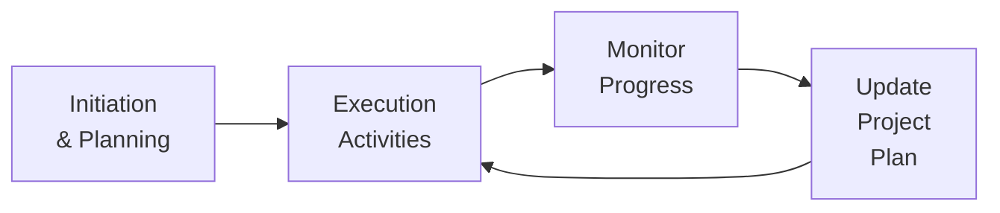

## 11.1 Executing with Efficiency and Consistency

Executing a project plan may sound straightforward on paper, but transforming a well-crafted plan into tangible results requires persistence, discipline, and effective coordination. This section explores the strategies, tools, and mindsets that ensure you can guide your team through day-to-day tasks productively and align ongoing work with broader project objectives. This focus on execution also intersects with other Performance Domains — such as Planning (Chapter 10), Delivery (Chapter 12), and Measurement (Chapter 13) — illustrating that achieving consistent flow demands integrated thinking across multiple project facets.

Efficient execution emphasizes using resources (time, budget, and personnel) wisely, while consistency ensures these resources remain directed toward the correct outcomes or deliverables. Let’s examine an array of techniques, best practices, and scenarios crucial for bringing your project plan to life.

---

### The Essence of the Project Work Performance Domain
In PMBOK® Guide (Seventh Edition), the Project Work Performance Domain underscores the importance of converting plans into actual deliverables while meeting predefined objectives. This domain involves:  
• Coordinating and directing tasks, teams, and resources effectively.  
• Managing and examining the progress of work, including the ability to shift or adapt as needs arise.  
• Maintaining smooth communication flows and fostering knowledge transfer.  
• Executing control processes to detect variances and implement corrective measures in real time.  

When focusing on “11.1 Executing with Efficiency and Consistency,” you are effectively ensuring that your day-to-day project tasks, team engagements, and progress monitoring stay aligned with the planned approach. Consistent execution is key to preventing rework, cost overruns, and schedule slippages.

---

### Guiding Principles for Efficient Execution
Achieving execution excellence is less about robotic adherence to a plan and more about disciplined flexibility within the project environment. Below are guiding principles that will help you steer daily activities:

• Adapt and Tailor: As emphasized in Chapter 5 (PMI’s 12 Project Management Principles), tailoring is not merely an option but a necessity. Even when you have robust execution processes, you must adapt them to suit the complexity and culture of your project environment.  
• Maintain Outcome Alignment: Keep your eyes on desired outcomes or deliverables. Regularly review your work to ensure that each task contributes to the ultimate project objectives.  
• Encourage Team Ownership: Foster a sense of accountability among team members by creating clarity about individual roles, responsibilities, and performance expectations.  
• Emphasize Communication: As an offshoot of Chapter 16 (Stakeholder and Communications Management), clear channels of communication reduce risk, rework, and encourage timely problem identification.  
• Promote Learning and Continuous Improvement: Adopt a mindset of iteration, feedback loops, and incremental progress. This approach is critical whether you run a predictive, hybrid, or agile project.  

---

### Setting Your Team Up for Success
Strong execution thrives in an environment where team members understand priorities, timelines, and success criteria. To establish these foundational elements:

#### Create and Share a Detailed Task Breakdown
• Use a Work Breakdown Structure (WBS) or product backlog that details deliverables in manageable components.  
• Assign each component to a specific owner or small sub-team for accountability and transparency.  
• Set clear acceptance criteria so that team members know when “done” is genuinely done.  

#### Clarify Roles and Responsibilities
• Document RACI (Responsible, Accountable, Consulted, Informed) or similar frameworks.  
• Hold quick daily or weekly stand-up meetings to reaffirm tasks and address any confusion.  
• Ensure everyone knows the escalation path for issues or resource constraints.

#### Provide Adequate Resources and Support
• Make certain that budgets, equipment, and personnel are in place before tasks commence.  
• Address skill gaps through training, mentoring, or immediate hiring if needed.  
• Encourage open-door policies allowing the team to signal resource shortages early.

---

### Day-to-Day Coordination & Oversight
Daily coordination ensures that activities remain on track and issues are promptly addressed.

#### Daily Stand-ups or Huddles
• Particularly effective in agile or hybrid settings, brief sessions help the team coordinate, raise impediments, and briefly share progress.  
• Keep them short and focused to avoid meeting fatigue.  

#### Synchronization of Distributed Teams
• In cross-cultural or virtual teams (Chapter 8), standardize collaboration tools and set communication norms (e.g., response times, meeting etiquettes).  
• Leverage project management platforms that support chat, video conferencing, file-sharing, and real-time task boards.  
• Establish “core working hours” to facilitate real-time discussions if time zones significantly overlap.

#### Balancing Autonomy with Oversight
• Encourage initiative while maintaining a structured approach to keep tasks aligned to objectives.  
• End-of-day or shift-reporting can help confirm progress and future actions without micromanaging.  

---

### Monitoring Work Progress and Addressing Variances
No matter how well you plan, execution inevitably encounters unexpected changes, resource constraints, or team dynamics shifts. Monitoring progress and responding to variances is a continuous cycle.

#### Real-Time Status Tracking
• Update task statuses daily or at critical milestones using integrated project management software.  
• Encourage transparency: tasks falling behind schedule should be visible, prompting quick discussions on solutions.  
• Use visual management tools (Kanban boards, burn charts, dashboards) that team members can easily understand.

#### Regular Checkpoints
• Weekly or bi-weekly checkpoints (mini “lessons learned” sessions) can uncover improvement areas.  
• Compare actual vs. planned performance in terms of schedule, cost, and quality.  
• Focus on root-cause analysis rather than blame when diagnosing shortfalls.

#### Corrective and Preventive Actions
• Adjust tasks, re-allocate resources, or revise deadlines as needed.  
• Document corrective actions in the risk register or an issue log (refer to Chapter 41 for templates).  
• Ensure the entire team is aware of official re-baselines or plan adjustments to avoid confusion.

---

### Maintaining Consistency in Deliverables
Consistency implies that deliverables meet agreed-upon standards repeatedly and align with the project narrative.

#### Quality Checkpoints
• Align execution tasks with your quality plan (Chapter 20).  
• Adopt continuous testing and validation procedures.  
• Use iterative feedback loops to ensure each component meets the “definition of done.”

#### Configuration Management
• In predictive projects, keep versions and revisions clear through a configuration management system.  
• In agile, have clear branching and merging strategies for code or product increments to avoid confusion over the “latest version.”  

#### Change Control Mechanisms
• Reinforce an integrated change control process (Chapter 15) that logs approved and rejected changes for full transparency.  
• Evaluate the potential impact of each proposed change on scope, schedule, cost, quality, and stakeholders.  

---

### Example Case Study: Software Product Implementation
Imagine a software development project tasked with delivering a new user portal for a healthcare client. During execution, the development team realized that certain third-party APIs were slower than expected, jeopardizing performance requirements. Instead of waiting until system testing to address the bottleneck, they:

1. Monitored daily progress via their Kanban board.  
2. Noticed the issue early through daily stand-ups and feedback from an integration specialist.  
3. Immediately reallocated a senior developer to optimize API calls and explored a caching solution.  
4. Updated the risk register and flagged the possibility of future performance constraints if user load spiked.  
5. Communicated changes to stakeholders, adjusting the timeline for a minor version release to ensure adequate testing.  

By integrating multiple feedback loops and real-time collaboration, the team prevented a potential scope and timeline crisis. Their consistent approach to diagnosing and resolving bottlenecks also kept cost escalations under control.

---

### Example Case Study: Construction Project Foundation Phase
In a construction setting, a project manager oversees the foundation pour for a new commercial building. During daily site checks, they find the subcontractor short on materials due to an unexpected supply chain delay. To maintain schedule consistency:

1. The project manager quickly implements a mitigation plan previously defined in the risk register.  
2. Alternate suppliers are contacted immediately while a spare batch of concrete mix is sourced.  
3. Supervisors hold a quick huddle to resequence certain tasks (e.g., rebar arrangement) while awaiting the supplementary materials.  
4. All changes are tracked in the project schedule to maintain clarity on shift impacts.  
5. Frequent communication ensures the site crew remains aware of new timelines and avoids idle time.  

Executing with efficiency in this scenario means keeping progress continuous and preventing a ripple effect on future tasks, even amid supplier bottlenecks.

---

### Continuous Improvement Mindset
Efficiency in execution blossoms when teams learn from mistakes and systematically incorporate improvements. This aligns heavily with agile methodologies but is equally relevant in predictive environments:

• Apply incremental improvements on aspects like test coverage, cost tracking, or clause drafting in contracts.  
• Establish an open environment where “lessons learned” are integrated and used to refine the ongoing approach, not merely archived for posterity.  

---

### Tools & Techniques for Sustained Efficiency
Below are some of the tools you can leverage — many mirror those found in agile, hybrid, and traditional contexts:

• Gantt Charts and Critical Path Analysis: Keep a visual of progress and potential schedule collisions.  
• Collaboration Tools (e.g., Jira, Trello, Microsoft Teams, Slack): Centralize tasks, track conversations, and share files in real time.  
• Kanban Boards: Provide visual cues for task status and help “pull” work systematically.  
• Daily Velocity Charts (Agile): Track how effectively the team is delivering backlogged items.  
• Issue Logs and Risk Registers: Proactively capture and mitigate issues.

---

### Leveraging a Feedback Loop Diagram
Below is a sample flowchart illustrating a feedback loop that ensures day-to-day execution ties seamlessly back to the project’s planning process:

**Diagram Explanation**:  
• [Initiation & Planning]: Prepare your objectives, scope, and strategy.  
• [Execution Activities]: Enact planned tasks with available resources.  
• [Monitor Progress]: Track progress, collect metrics, and identify issues.  
• [Update Project Plan]: Incorporate adjustments or changes to keep alignment with goals.  

This loop ensures that any findings or variances feed back into your plan, achieving continuous alignment with your objectives.

---

### Common Pitfalls and Strategies to Overcome Them

• “Set It and Forget It” Syndrome: Teams might assume the plan is static. Strategy: Encourage continuous engagement with the plan, encourage queries, and validate tasks frequently.  
• Overlooking Team Morale: Low morale breeds inefficiency. Strategy: Offer recognition, maintain open dialogue, and address burnout signs early.  
• Inadequate Progress Tracking: Relying on monthly or quarterly reviews might reveal issues too late. Strategy: Use frequent status updates (daily or weekly) to catch and nip problems early.  
• Resistance to Change: Team members might cling to old methods even if they are inefficient. Strategy: Lead change initiatives by explaining benefits and supporting skill-building.  
• Overemphasis on Speed: Rushed tasks can degrade quality and lead to rework. Strategy: Ensure quality checkpoints and balanced resource management.  

---

### Best Practices for Stronger Execution
1. **Promote Visibility**: Even minor tasks should be documented if their failure to complete could derail the project.  
2. **Implement Staged Milestones**: Segment the project into logical phases or increments, each concluding with a quality or stakeholder review.  
3. **Use Communication Charters**: Define how the team communicates (frequency, modes, channels) to remove ambiguity.  
4. **Integrate Risk Management**: Weave risk insights (from Chapter 14 and Chapter 22) into daily execution, so that risk responses are enacted proactively.  
5. **Celebrate Small Wins**: Motivate the team by acknowledging each achievement. Sustained motivation fosters consistency and drives accountability.  

---

### References for Further Exploration
• Project Management Institute. (2021). A Guide to the Project Management Body of Knowledge (PMBOK® Guide) – Seventh Edition.  
• PMIstandards+™ Platform for evolving standards and practice guidance.  
• Agile Practice Guide. (2017). Project Management Institute.  
• Leffingwell, D. (2021). SAFe® 5.0 Reference Guide: Scaled Agile Framework® for Lean Enterprises.  
• Kerzner, H. (2017). Project Management: A Systems Approach to Planning, Scheduling, and Controlling.  

Use these resources to explore deeper nuances, adopt additional tools and templates, and strengthen your day-to-day execution routine.

---

## Achieve Execution Excellence: Efficiency & Consistency Quiz



### How often should task status be tracked for timely identification of potential delays?
- [ ] Only when the project sponsor requests a status update  
- [ ] Monthly through a formal project status presentation  
- [x] Frequently, such as daily or weekly, to catch issues early  
- [ ] Exclusively at project phase gates  

> **Explanation:** Frequent updates (daily or weekly) allow immediate visibility into performance issues, enabling the project manager and team to correct or mitigate variances swiftly.

### Which of the following best describes “executing with consistency”?
- [x] Delivering tasks according to defined quality standards and alignment with objectives  
- [ ] Adhering rigidly to the project plan, even if new risks arise  
- [ ] Completing tasks as quickly as possible without revisiting decisions  
- [ ] Allowing the team to work on any tasks in any order  

> **Explanation:** Consistency means repeatable quality and alignment with project goals, guaranteeing that each deliverable conforms to preset standards and overall scope requirements.

### Which approach ensures maximum transparency and proactive risk management in day-to-day execution?
- [ ] Preparing monthly progress reports for upper management only  
- [x] Using real-time collaboration tools and visual boards for monitoring tasks  
- [ ] Relying exclusively on third-party auditors to identify team issues  
- [ ] Postponing variance management until the end of each quarter  

> **Explanation:** Real-time task tracking using comprehensive collaboration tools provides immediate visibility into progress, fosters team alignment, and allows risks to be addressed as they emerge.

### In a distributed or virtual team environment, one critical daily execution strategy is:
- [ ] Replacing face-to-face meetings with lengthy emails  
- [ ] Scheduling no regular daily interactions to avoid time conflicts  
- [x] Establishing standardized collaboration practices and ideally a common overlap for synchronous discussions  
- [ ] Assuming all stakeholders have the same cultural and communication norms  

> **Explanation:** When teams are spread across distances and time zones, it’s vital to establish consistent communication tools, guidelines, and overlapping time blocks, so real-time collaboration and clarifications can occur smoothly.

### Which of the following represents a best practice if a critical supplier is delayed during the execution phase?
- [x] Activate an existing risk response plan and re-sequence tasks accordingly  
- [ ] Proceed with the next task in sequence without adjustments  
- [x] Quickly find backup or alternate suppliers as documented in the mitigation plan  
- [ ] Immediately halt the project entirely until the original supplier recovers  

> **Explanation:** Supplier delays are common risks. An effective project manager acts swiftly by invoking mitigation or contingency plans, potentially sourcing alternate suppliers or resequencing tasks to sustain momentum.

### When facing resistance to new methods on the team, the project manager should:
- [x] Communicate the benefits of the new approach and provide training or support  
- [ ] Enforce strict compliance with threats of penalties  
- [ ] Immediately remove those who resist from the team  
- [ ] Ignore dissent, trusting the plan to speak for itself  

> **Explanation:** Resistance often stems from uncertainty or lack of clarity. A proactive project manager will address these fears, offer clear rationales for changes, and provide resources to facilitate adoption.

### Which technique helps ensure that minor, but critical, details are not overlooked during day-to-day execution?
- [x] Maintaining a clear Work Breakdown Structure (WBS) or product backlog  
- [ ] Allowing team members to keep tasks in private notes only  
- [x] Conducting daily or weekly check-ins to confirm key deliverables  
- [ ] Eliminating all documentation to accelerate task completion  

> **Explanation:** A well-defined WBS or backlog plus frequent check-ins keeps small yet crucial details visible, establishing accountability and preventing oversights from derailing the project.

### A good way to manage team morale while executing tasks under tight deadlines is:
- [x] Celebrating small wins and ensuring the team sees the value of their work  
- [ ] Not discussing schedule pressure so as not to “alarm” the team  
- [ ] Prohibiting breaks until all tasks are completed  
- [ ] Assigning additional tasks to the same people who finish faster  

> **Explanation:** Recognizing individual and collective accomplishments, no matter how small, fosters a positive work environment and helps the team remain motivated even under significant schedule pressure.

### Which of the following promotes quick decision-making and responsiveness to change?
- [x] Empowering teams with decision-making authority within defined thresholds  
- [ ] Escalating every minor decision to the project sponsor  
- [ ] Relying on monthly governance meetings to confirm all decisions  
- [ ] Discouraging any adjustments once the project plan is finalized  

> **Explanation:** Teams that can make day-to-day decisions within set boundaries can respond rapidly to emerging issues, leading to more efficient execution and consistent progress.

### True or False: Robust execution requires balancing flexibility with a disciplined approach, ensuring changes do not derail project consistency.
- [x] True  
- [ ] False  

> **Explanation:** Effective project execution finds a middle ground between adhering to the plan and adapting as necessary, thus enabling teams to manage change while preserving overall momentum and consistency.



---

## PMP Mastery: 1500+ Hard Mock Exams with Full Explanations 

Looking to crush the PMP exam with confidence? Dive deep into 6 rigorous mock exams totaling 1500+ advanced-level questions, each accompanied by clear, step-by-step explanations. Hone your test-taking strategies, master complex topics, and build the resilience you need on exam day. Perfect for serious PMs aiming beyond fundamentals.  

Enroll now:  
[PMP Mastery: 1500+ Hard Mock Exams with Exceptional Clarity & Full Explanations](https://www.udemy.com/course/pmp-2025/?referralCode=CF83A54BC86BE27F9AFE)

_Disclaimer: This course is not endorsed by or affiliated with the PMI examination authority. All content is provided purely for educational and preparatory purposes._
