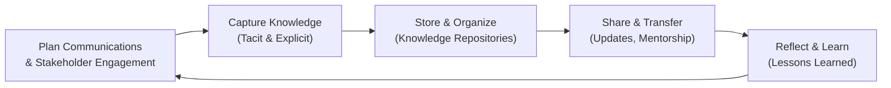

## 11.3 Managing Communication, Knowledge Transfer, and Lessons Learned

Effective project execution is rarely the result of technical expertise alone. It hinges on robust communication mechanisms, structured knowledge transfer activities, and systematic lessons learned processes. Project managers must not only convey information to the right people at the right time, but also ensure that valuable insights gained throughout the project are captured and used to fuel future improvements. This section examines these vital elements in detail, presenting real-world scenarios, tools, and best practices to elevate your project outcomes.

Managing communication, knowledge, and lessons learned is closely intertwined with many aspects and performance domains discussed throughout this book—such as stakeholder engagement (Chapter 7), team collaboration (Chapter 8), and project success measurement (Chapter 13). When executed properly, communication plans, knowledge-sharing activities, and lessons learned sessions help maintain alignment, reduce duplicated efforts, and establish a culture of continuous improvement.

Below, we examine:
• Communication planning and strategies  
• Managing communication in diverse environments (co-located, virtual, and hybrid)  
• Knowledge capture, storage, and transfer techniques  
• Lessons learned processes, including collecting, documenting, and integrating new insights  

All these combined enable a high level of transparency and help transform a project-based organization into a learning organization.

### Importance of Communication, Knowledge Transfer, and Lessons Learned

Communication is at the core of successful project delivery. It fosters clarity, alignment, and trust among team members and stakeholders. However, few projects survive on linear information flow alone. As teams inevitably encounter new information, unforeseen challenges, and hidden resources, they gather knowledge that could significantly strengthen future projects. Instituting a framework for capturing and disseminating this knowledge ensures that valuable insights become part of the organization’s asset portfolio. Lessons learned, in turn, create feedback loops that boost continuous improvement and elevate project maturity levels.

By integrating these three elements—communication planning, knowledge transfer, and lessons learned—teams can drive ongoing performance enhancements, reduce risks, and improve team engagement. Effective communication accelerates decision-making and fosters better stakeholder relationships. Seamless knowledge transfer prevents institutional amnesia by storing project-related insights in standardized repositories, ensuring that new team members and future initiatives benefit from the experience gained. Finally, lessons learned encode both successes and missteps, equipping the organization with tools to avoid repeating mistakes and to replicate triumphs more systematically.

---

### Communication Planning and Strategies

The PMI’s 12 Project Management Principles (Chapter 5) underscore the importance of maintaining clarity and openness in communication—both within project teams (Principle 5: Systems Thinking) and among external stakeholders (Principle 12: Effective Communication and Stakeholder Alignment). In the PMBOK® Guide Seventh Edition context, communication planning involves answering two fundamental questions:

1. Who needs which information and when?  
2. Which communication methods, media, and frequency will facilitate effective transfer of information?

Commonly, you would draft a Communication Management Plan as part of your overall project management plan. This plan typically outlines:

• Stakeholders’ communication requirements  
• Formats (e.g., email updates, dashboards, meetings, intranet postings)  
• Frequency (daily, weekly, monthly)  
• Channel and technology selections (project management tools, instant messaging apps, video conferencing)  
• Owner or responsible party for each communication type  

Communication needs vary widely across industries and project types. In an agile or hybrid context, daily stand-ups and retrospectives might be central to the communication framework, whereas in more traditional, predictive settings, weekly status meetings and monthly steering committee updates may suffice. Tailoring these approaches is crucial. For example, a fully remote software development project may leverage asynchronous communication channels (recorded video updates, shared wikis, or real-time instant messaging) more extensively. Conversely, an on-site construction project may rely on daily in-person huddles and site walk-throughs.

#### Balancing Formal and Informal Communication

Formal communication involves structured reports, project status updates, or official presentations, often documented in a project management information system (PMIS). Informal communication—chats in hallways, coffee breaks, or quick Slack messages—can help uncover hidden stakeholder ambivalence or evolving project risks. Both are necessary:

• Formal communications ensure adherence to contractual and compliance requirements.  
• Informal communications can accelerate decision-making and identify urgent concerns faster.  

Communicating effectively involves striking a balance between these modes. Many project issues escalate when unaddressed informal cues (tone of emails, unanswered calls, etc.) build up until they become formal problems. Encouraging open discussion, especially among interdisciplinary teams, can head off misunderstandings sooner rather than later.

#### Communication in Virtual and Cross-Cultural Environments

In distributed or globally dispersed teams, the risk of miscommunication increases exponentially. Variations in language, time zone, culture, and technology infrastructure can cause confusion. Best practices include:
• Establishing team norms (e.g., a rotating schedule for stand-up calls to accommodate different time zones).  
• Using culturally neutral language, focusing on clarity and brevity.  
• Providing language support or interpreters if necessary.  
• Incorporating asynchronous collaboration tools to complement real-time meetings.  

Likewise, cross-cultural competence (see Chapter 8 on team performance) helps project managers adapt communication styles to different cultural contexts. Techniques like mindful listening, clarifying questions, and paraphrasing can go a long way in ensuring crucial messages land correctly.

---

### Knowledge Capture and Storage

Knowledge transfer is the act of identifying and sharing tacit or explicit knowledge from one individual, team, or project to another. It plays a major role in agile, predictive, or hybrid environments. As modern organizations evolve, knowledge management (KM) becomes a central pillar, ensuring project assets—processes, experiences, data, and insights—do not vanish when team members transition or when one project closes.

To design an effective knowledge management approach, consider:

• Identifying Key Knowledge Areas: Determine which processes, metrics, or technical instructions hold the highest strategic value.  
• Structuring Knowledge Repositories: Define standard templates, file naming conventions, and usage policies to ensure uniform and easy retrieval of information.  
• Leveraging Tools and Platforms: Use project management software, wikis, or enterprise content management systems to store relevant documentation.  
• Establishing Governance: Assign roles (e.g., knowledge managers or librarians) to oversee the knowledge base, manage version control, and maintain data security.

Capturing knowledge thoroughly means going beyond formal documents. Encourage cross-functional collaboration, brainstorming sessions, and open feedback channels. A valuable component of knowledge capture is tapping into intangible knowledge—the know-how, interpersonal nuances, or lessons that may not have a formal procedure. Identifying “knowledge champions” can help gather these intangible experiences and codify them for general availability.

#### Types of Knowledge

1. Explicit Knowledge: Documented information such as manuals, processes, standard operating procedures (SOPs), checklists, and official artifacts.  
2. Tacit Knowledge: Personal insights, expertise, and intangible understanding gained through experience. Tacit knowledge is often shared best through direct interaction, mentoring, pair programming, or shadowing.  

To make tacit knowledge more accessible, consider creating formal mentorships or pairing new employees with seasoned experts. Conduct frequent collaborative workshops or pair different functional areas (e.g., finance with product engineering) to create holistic viewpoints. In agile settings, architecture spikes or knowledge spikes can focus on developing shared understanding about technical uncertainties.

---

### Knowledge Transfer Techniques

#### 1. Peer Reviews and Audits
Whether code review sessions in software engineering or design audits in construction projects, peer reviews help capture the “why” behind certain decisions, highlight best practices, and refine project deliverables. These are also instructive moments for junior team members to grasp intangible aspects of problem-solving or risk mitigation.

#### 2. Communities of Practice (CoPs)
CoPs are informal or semi-formal networks of professionals sharing a common interest in a specific domain. They foster a sense of belonging, encourage open dialogue on real issues, and help participants exchange tacit knowledge. CoPs can be cross-departmental or external (e.g., industry meet-ups, professional forums).

#### 3. Documenting Decision-Making Rationale
At every project phase—particularly during changes, risk assessments, and milestone reviews—team members make decisions that can have lasting impacts. Documenting the rationale behind these decisions helps future teams quickly understand context and reapply or revisit strategies without retracing the same justification processes.

#### 4. On-the-Job Rotations
Short rotations or secondments, where team members move temporarily to another department or project, can proliferate essential skills. These experiential learning opportunities are highly effective for sharing deep domain expertise across organizational silos.

---

### Lessons Learned: The Feedback Loop

Lessons learned blend communication and knowledge transfer into a continuous improvement loop. Rather than collecting lessons only at the project’s conclusion, many practitioners advocate for iterative or continuous lessons learned approaches. In agile environments, retrospectives occur at the end of each iteration, providing a natural platform to identify what went well, what could have been better, and the actions to improve.

#### When and How to Collect Lessons Learned

• Early in the project: At initiation or milestone gates, capturing initial insights about planning, risk identification, and stakeholder buy-in can refine the approach and avoid repeating early missteps.  
• Mid-project reviews: Conduct retrospective or mid-phase lessons learned sessions. This iterative approach helps the team adapt quickly rather than waiting for a post-mortem.  
• Project closure: This is conventional practice. The team synthesizes the entire project experience, culminating in a final lessons learned register that is often integrated into organizational process assets (OPAs).

To ensure systematic capture, create a standard template or checklist for lessons learned that includes:

• Context (project phase, date, or environment)  
• Description of the observation or challenge  
• Root cause analysis (why did it happen?)  
• Impact (time, cost, quality, scope, or stakeholder satisfaction)  
• Recommendations (actions to replicate success or avoid similar challenges)  

#### Incorporating Lessons Learned into Organizational Memory

Capturing lessons learned is just the start. Unless these insights are integrated into continuous improvement cycles, they remain inert knowledge. For example, updates to the risk register or communication plan templates should embed these lessons. Organizations can formalize a repository (e.g., knowledge base or internal wiki) where teams can quickly search for relevant experiences—such as “budget overrun in procurement for similar projects” or “data migration pitfalls in systems integration.”

Project managers should also encourage knowledge-sharing events—like brown-bag lunches or short presentation series—where teams share their lessons learned with a wider audience. Leadership support is essential; if management models a culture of openness about failures and successes, project teams are more likely to share candid reflections.

---

### Real-World Case Study 

Imagine a mid-sized software firm executing a predictive project to overhaul its internal CRM system while simultaneously running multiple agile pilot projects for new product lines:

• Communication Anchor: They adopt a “Two-Week Pulse Meeting” for cross-project updates, ensuring that each project manager shares high-level reporting on risks, achievements, and resource constraints.  
• Knowledge Transfer Sessions: A dedicated knowledge coordinator organizes weekly brown-bag sessions where team members from different projects demo their solutions or discuss roadblocks. This fosters an ongoing culture of providing feedback and helps pinpoint potential synergy (e.g., reusing code from a pilot project in the CRM revamp).  
• Lessons Learned Iterations: Even though the CRM migration is predictive in approach, they incorporate agile-style retrospectives after each major deliverable. These sessions discover, for instance, that many user acceptance testing tasks were delayed by incomplete stakeholder input. As a result, future sprints integrate stakeholder workshops earlier, preventing rework.  
• Storage and Access: All relevant documents, from meeting minutes to design rationale, are stored in an enterprise-wide wiki with robust search functionality. Final project closure is accompanied by a “lessons learned summary” that references specific challenges (e.g., a data synchronization bug) and how it was resolved (e.g., additional user sign-offs, better environment setup).  

After employing these strategies, the firm noticed a measurable decrease in defect backlogs, improved stakeholder satisfaction, and faster onboarding of new staff due to readily available learnings.

---

### Common Pitfalls and Overcoming Them

• “We’re Too Busy to Document”: Under tight deadlines, teams may deprioritize capturing knowledge. In reality, investing a small amount of time now prevents repeated errors and accelerates future projects.  
• Overloading Stakeholders with Communication: Sending excessive reports or scheduling frequent meetings can lead to information fatigue. The key is tailoring frequency, format, and detail based on stakeholder needs.  
• Failing to Follow Through on Lessons Learned: Capturing lessons learned is fruitless if they remain on a shelf unused. Holding the team accountable to apply lessons in subsequent projects is crucial.  
• Limited Cultural Buy-In: Without leadership endorsement, knowledge-sharing behaviors may wither. Leaders should promote open dialogue, highlight successes, and reward teams for valuable contributions.  
• One-Size-Fits-All Approach to Knowledge Transfer: Different functional areas—HR, IT, finance—have unique communication and knowledge needs. Tailor your templates, guidelines, and training approaches accordingly.

---

### Visualizing the Knowledge Cycle

Below is a simplified Mermaid diagram illustrating how communication, knowledge transfer, and lessons learned feed into each other in an ongoing cycle:

Explanations:

• A: Communication planning sets the stage for effective information flow and ensures deliverables, progress, and changes are shared adequately.  
• B: Capturing knowledge involves identifying new insights, best practices, mistakes, or clarifications.  
• C: Storage ensures standardization, secure archiving, and easy retrieval.  
• D: Sharing (through presentations, CoPs, or direct mentoring) transforms captured data into actionable team knowledge.  
• E: Reflecting on experiences (lessons learned) generates improvements that feed back into communication strategies.

---

### Best Practices for Sustained Project Maturity

• Integrate KM in Project Charter: Include a section on knowledge and lessons learned in your project charter or kick-off deck.  
• Schedule Knowledge-Sharing Activities: Embed peer reviews, lunch-and-learn sessions, or short knowledge transfer blocks into the project schedule to ensure time is allocated.  
• Motivate Participation: Recognize or reward teams/individuals who actively contribute valuable lessons. Use friendly competition or gamification to keep knowledge-sharing lively.  
• Use Technology Wisely: Select user-friendly platforms that reduce friction. If a KM system is too cumbersome, it will be neglected.  
• Align with Organizational Strategy: Demonstrate how improved knowledge management or communication efficiency aligns with cost savings, risk reduction, and strategic execution (see Chapter 28 on aligning with organizational strategy).  

---

### References and Further Reading

• PMI. (2021). A Guide to the Project Management Body of Knowledge (PMBOK® Guide) – Seventh Edition.  
• PMI. (2021). The Standard for Project Management.  
• Nonaka, I., & Takeuchi, H. (1995). The Knowledge-Creating Company.  
• Wenger, E. (1999). Communities of Practice: Learning, Meaning, and Identity.  
• Agile Practice Guide (2017). Project Management Institute.  

---

## Test Your Knowledge: Communication & Knowledge Management Quiz



### Which of the following statements best describes the primary goal of a project Communication Management Plan?

- [ ] To catalog all existing project documents in the repository.
- [ ] To define the project’s procurement schedule and vendor activities. 
- [x] To determine who needs specific information, when they need it, and how it will be delivered.
- [ ] To allocate budgets for different communication methods. 

> **Explanation:** The Communication Management Plan outlines the what, who, when, and how of project communication, ensuring the right stakeholders receive accurate and timely information.

### What is a key benefit of continuous lessons learned sessions (e.g., iterative retrospectives) rather than a single session at project closure?

- [ ] They eliminate all project risks from the early stages.  
- [x] They allow teams to capture and apply improvements throughout the project life cycle.  
- [ ] They formalize the change control procedures more efficiently.  
- [ ] They reduce the need for a final project closure process.  

> **Explanation:** Conducting lessons learned at multiple stages allows teams to immediately act on new insights, rather than waiting until the project ends. This iterative approach encourages continuous improvement.

### In knowledge management, tacit knowledge is best described as:

- [ ] Formal guidelines documented in the project plan.  
- [ ] Detailed process maps for organizational workflows.  
- [x] Personal insights, expertise, or understandings gained through experience.  
- [ ] Published technical whitepapers and peer-reviewed articles.  

> **Explanation:** Tacit knowledge belongs to individuals, gained via personal experience and often shared through direct interaction or mentoring, rather than formal documents.

### A project manager notices that daily stand-up meetings are too long and frequently veer off topic. Which action is the most appropriate?

- [x] Encourage team members to stick to the standard stand-up format: “What was done, what will be done, and any blockers.”  
- [ ] Eliminate daily stand-ups and rely solely on status reports.  
- [ ] Allow stand-ups to continue as they are to support an “open culture.”  
- [ ] Reschedule stand-ups to weekly gatherings to reduce the frequency of distractions.  

> **Explanation:** Daily stand-ups should remain short and focused on specific check-in topics; additional discussions should happen off-line or in separate meetings.

### Which technique helps share tacit knowledge within an organization?

- [x] Pair programming or mentoring.  
- [ ] Sending monthly status reports via email.  
- [x] Hosting brown-bag lunch presentations with open Q&A.  
- [ ] Restricting knowledge-related discussions to formal committees only.  

> **Explanation:** Tacit knowledge is best transferred through collaboration, informal coaching, and direct observation—mechanisms like pair programming or interactive lunch sessions encourage conversation and sharing.

### A large construction project involves multiple subcontractors who have different communication styles and languages. Which practices help reduce miscommunication?

- [x] Providing clear documentation in a standardized format.  
- [ ] Eliminating all informal communication channels.  
- [ ] Restricting all communications to face-to-face meetings only.  
- [ ] Creating separate Gantt charts per subcontractor without integration.  

> **Explanation:** Standardized documentation and clearly defined processes help set consistent expectations, reducing confusion that arises from varied styles or languages.

### What is the first step in creating a robust lessons learned register?

- [x] Identify key observations or issues encountered during project tasks.  
- [ ] Solicit immediate sign-off from the project sponsor.  
- [x] Classify lessons by project phase for better organization.  
- [ ] Archive the register after project completion is confirmed.  

> **Explanation:** Capturing observations (both positive and negative) and categorizing them ensures easier retrieval and contextual application in future projects.

### Which best describes the role of leadership in knowledge-sharing initiatives?

- [x] Modeling the transparent sharing of experiences to foster a safe environment.  
- [ ] Restricting knowledge-sharing to managers’ direct reports.  
- [ ] Grooming a few select “knowledge gatekeepers” with exclusive access.  
- [ ] Conducting strictly formal knowledge audits only at year-end.  

> **Explanation:** Leadership must demonstrate openness and encouragement for knowledge-sharing practices, creating a culture where individuals freely contribute insights.

### What is a primary purpose of establishing a knowledge repository for lessons learned?

- [x] To provide a centralized, searchable location where future teams can quickly reference past experiences.  
- [ ] To prevent stakeholders from accessing internal project documentation.  
- [ ] To determine project budgets for subsequent initiatives.  
- [ ] To assign blame for project delays and cost overruns.  

> **Explanation:** A knowledge repository ensures that lessons learned, best practices, and documented experiences are readily accessible for future projects.

### In effective project communication, which statement is TRUE?

- [x] Communication must be tailored to stakeholder needs, considering format, frequency, and level of detail.  
- [ ] It is best to use only one communication channel to maintain consistency.  
- [ ] Silence from stakeholders always indicates approval of the project communication.  
- [ ] Informal communication is unnecessary if formal communication is well-documented.  

> **Explanation:** Tailoring communication to stakeholder needs is vital. Relying on multiple styles (formal and informal) and channels helps ensure everyone is well-informed, engaged, and able to provide timely input.



---

## PMP Mastery: 1500+ Hard Mock Exams with Full Explanations

Looking to crush the PMP exam with confidence? Dive deep into 6 rigorous mock exams totaling 1500+ advanced-level questions, each accompanied by clear, step-by-step explanations. Hone your test-taking strategies, master complex topics, and build the resilience you need on exam day. Perfect for serious PMs aiming beyond fundamentals.  

Enroll now:  
[PMP Mastery: 1500+ Hard Mock Exams with Exceptional Clarity & Full Explanations](https://www.udemy.com/course/pmp-2025/?referralCode=CF83A54BC86BE27F9AFE)

_Disclaimer: This course is not endorsed by or affiliated with the PMI examination authority. All content is provided purely for educational and preparatory purposes._
