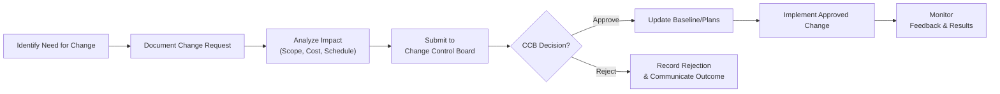

## 11.4 Monitoring Work Progress and Implementing Changes

Efficiently monitoring work progress and implementing changes is a cornerstone of successful project management. This process ensures deliverables meet the specified requirements, project goals remain on track, and any necessary adjustments are swiftly and effectively integrated. In the context of the Project Work Performance Domain, monitoring and change implementation connect all project activities—linking planning, execution, communication, and stakeholder engagement to guarantee value delivery.

This section focuses on the best practices, tools, and processes you can use to detect performance gaps, analyze root causes of deviations, and oversee formal change control. By mastering these techniques, you will be able to anticipate potential issues, quickly respond to them, and guide your project team through the challenges of dynamic environments.

---

### Understanding Monitoring and Control in the Project Work Performance Domain

Monitoring and controlling work progress goes beyond simply checking off tasks on a to-do list. It involves ongoing data collection, analysis of key performance indicators (KPIs), and proactive decision-making to respond to variances. When combined with a robust change control process, effective monitoring helps maintain alignment with the project charter, management plan, and business objectives. As outlined in the PMBOK® Guide Seventh Edition, the Project Work Performance Domain emphasizes holistic oversight of all project activities to ensure outcomes align with intended benefits and stakeholder expectations.

Key considerations in monitoring work progress include:
• Ongoing comparison of actual progress vs. planned progress.  
• Validation of deliverables against scope requirements.  
• Continuous risk identification and response.  
• Timely detection of cost or schedule overruns.  
• Stakeholder satisfaction and feedback loops.

Once variances or improvement opportunities are identified, the project manager must implement necessary changes according to formal processes. This often entails re-planning, resource reallocation, or refining acceptance criteria and deliverables.

---

### The Importance of Monitoring Work Progress

Monitoring ensures a project stays aligned with its baseline objectives (scope, schedule, and cost). Without active oversight, even small deviations can escalate into major issues that jeopardize the project outcome. Effective monitoring enables:

• Early Detection of Issues: By tracking progress regularly and gathering real-time performance metrics, the team can pinpoint problem areas quickly.  
• Proactive Mitigation: Anticipating risks and implementing countermeasures before they escalate can save both time and budget.  
• Quality Assurance: Monitoring ensures that deliverables adhere to specified quality standards.  
• Stakeholder Satisfaction: Frequent updates, transparency, and evidence-backed data cultivate trust among sponsors, stakeholders, and team members.  
• Informed Decision-Making: Accurate performance data help the project manager, sponsor, and other key stakeholders make decisions based on evidence rather than assumptions.

Moreover, effective monitoring fosters a culture of continuous improvement. Lessons learned from performance tracking can uncover best practices or highlight inefficiencies. By integrating these insights back into the project’s workflows (and organizational processes), you enhance the chances of delivering value that meets or exceeds expectations.

---

### Tools and Techniques for Tracking Deliverables

A variety of tools and techniques help you systematically track whether deliverables are on schedule, on budget, and meeting the relevant quality criteria. While these tools apply in all project methodologies—predictive, agile, or hybrid—their usage and frequency of measurement can differ.

#### Status Reporting and Dashboards
Regular status reports offer a snapshot of project performance across scope, schedule, cost, and risk metrics. These can take the form of high-level executive summaries or more detailed team-focused dashboards. Chapter 13 (“Measurement Performance Domain”) provides numerous examples and best practices for setting up dashboards that blend Earned Value Management (EVM) charts, burn charts, and other analytic tools.

#### Earned Value Management (EVM)
EVM is a widely recognized technique for measuring project performance against cost and schedule baselines. It calculates metrics like Earned Value (EV), Actual Cost (AC), and Planned Value (PV), allowing you to derive key performance indicators such as Cost Variance (CV), Schedule Variance (SV), Cost Performance Index (CPI), and Schedule Performance Index (SPI). For instance, a CV < 0 indicates spending is higher than planned, while an SV < 0 suggests delays in work packages. Refer to [Chapter 37: Mastering Key Formulas and Calculations](#) for in-depth coverage of EVM formulas.

#### Kanban Boards and Visual Task Management
Used frequently in agile projects, Kanban boards highlight the flow of tasks from “To Do” to “In Progress” to “Done.” By visualizing progress, you can quickly spot bottlenecks and track the work items’ status in near-real time.

#### Burn Charts
In agile environments, burn charts (burndown or burnup) visually convey how much work remains versus how much time is left in a sprint or release. A burndown chart measures remaining effort, whereas a burnup chart tracks the total amount of completed work relative to the project’s scope.

#### Gantt Charts
Common in predictive and hybrid projects, Gantt charts illustrate tasks over time, showing dependences, start/end dates, and milestone deadlines. These charts are beneficial for identifying scheduling conflicts and measuring actual progress against baseline timelines.

#### Quality Audits and Inspections
These audits ensure the deliverables meet project requirements and quality standards. For instance, design reviews or code inspections can reveal hidden defects. Internal or external auditors may conduct periodic check-ins to confirm compliance with organizational or regulatory standards.

---

### Detecting Deviations and Analyzing Root Causes

Once you have set up a robust system of metrics and dashboards, you can detect deviations early. Effective project managers don’t just record these deviations—they investigate the root causes to address the source of the problem rather than treating symptoms. This root cause analysis may include the following techniques:

• The “Five Whys”: A simple method that involves asking “Why?” repeatedly to trace a problem to its origin.  
• Fishbone Diagram (Ishikawa Diagram): A structured layout that identifies multiple causes of a problem.  
• Pareto Analysis: A technique that helps isolate the most significant sources of errors under the 80/20 principle.  
• Regression Analysis or Sensitivity Analysis: Advanced statistical methods to determine which factors most significantly impact an outcome.

Ultimately, correct identification of causes leads to relevant action—whether that is clarifying requirements, adding more skilled resources, or reevaluating the project schedule.

---

### Formal Change Control Processes

Monitoring performance is inextricably linked with integrated change control. The PMBOK® Guide, particularly in its Integration Management coverage, specifies that formal change control processes ensure only necessary and beneficial changes are approved and integrated into the project baseline. This:

• Preserves the integrity of the scope, schedule, and budget baselines.  
• Prevents scope creep caused by ad-hoc requests.  
• Maintains documentation and traceability, ensuring everyone understands what changed and why.  
• Considers potential impacts on quality, risk, and stakeholder engagement.

#### Key Steps in Change Control

Below is a typical flow for change control, applicable to most predictive and hybrid projects. Agile frameworks often have analogous steps (e.g., backlog refinement or sprint planning sessions), but the concept of controlled acceptance of changes remains essential.

1. Identify Need for Change. Triggers may include new stakeholder requirements, risk events, or observed deliverable defects.  
2. Document Change Request. Provide details about the change drivers, impact, and proposed solution.  
3. Analyze Impact. Conduct a thorough assessment of the potential effect on project baselines, resources, and risk exposures.  
4. Submit Request to Change Control Board (CCB). This cross-functional team evaluates the necessity and feasibility of the requested change.  
5. CCB Decision. The request may be approved, deferred, or rejected.  
6. Update Baseline. If approved, revise the project management plan and relevant documents, ensuring version control.  
7. Implement the Approved Change. Dedicate resources to actualize the change as specified and integrate it with existing project processes.  
8. Monitor Feedback and Results. After implementation, measure the outcome of the change and ensure the issue has been mitigated.

---

### Agile and Hybrid Considerations for Changes

In agile frameworks, change is embraced as a key dimension of adaptability. Rather than submitting formal change requests, product backlog refinements or iteration-level planning serve as channels through which feedback, user stories, and priorities evolve. While formal boards may be less prominent, there is still a well-defined process for evaluating, prioritizing, and scheduling new or changing requirements. Hybrid approaches often blend the structure of a change control board with the agility of incremental backlog adjustments.

---

### Implementing Changes in Practice

Once a change request receives approval, the project team focuses on integrating the change into existing work. Key practices include:

• Communication of Approved Changes. Inform the relevant stakeholders, including team members, sponsors, and vendors, about the nature and scope of the change.  
• Resource Allocation. Where necessary, reassign resources, acquire additional funding, or negotiate schedule shifts.  
• Documentation Updates. Synchronize the project management plan, schedule, scope statement, risk register, or other relevant artifacts.  
• Risk Reassessment. The new change could introduce additional risks or amplify existing ones. Evaluate those impacts carefully to preserve project integrity.  
• Quality Checks and Acceptance. Confirm that the newly implemented change meets quality standards and stakeholder requirements.  
• Lessons Learned. Capture insights on the process, especially if the change was reactive or triggered by a deviation. These lessons guide better risk management strategies in the future.

---

### Common Pitfalls in Monitoring and Change Implementation

Despite solid planning, teams often encounter pitfalls in the monitoring and change control processes:

• Fragmented Monitoring: Relying on multiple tools without a centralized reporting system can produce conflicting data, leading to confusion.  
• Overreliance on Lagging Indicators: Delays in data (e.g., monthly financial close) can miss critical early-warning signals and hamper swift action.  
• Scope Creep: Allowing minor changes without formal documentation eventually leads to substantial scope expansions and cost overruns.  
• Ineffective Communication: Failing to inform stakeholders of new changes can result in misaligned priorities or duplicated efforts.  
• Resistance to Change: Team members, stakeholders, or end users may resist or misunderstand the rationale behind adjustments. Proactive stakeholder engagement and change management techniques (see Chapter 10: Planning Performance Domain) help overcome these hurdles.

---

### Best Practices for Success

To avoid these pitfalls and excel in monitoring and implementing changes:

• Establish Clear Baselines. A robust planning baseline for scope, schedule, cost, and quality ensures you have a yardstick to measure actual performance against.  
• Employ Multiple Data Points. Rely on both quantitative (EVM, schedule variance) and qualitative (stakeholder feedback, informal updates) data sources for a fuller picture.  
• Maintain Transparency. Make progress data available to all relevant team members and stakeholders. Shared insights foster ownership and a collaborative problem-solving spirit.  
• Embrace Iterative Reviews. Regular stand-ups, retrospectives, and stakeholder check-ins facilitate quick detection and resolution of potential problems.  
• Conduct Thorough Impact Analyses. For each change, document potential effects on scope, cost, schedule, risk, and stakeholder expectations.  
• Train the Team. Provide ongoing training in monitoring and reporting tools, and educate team members on the formal change request process.  
• Keep Records. For every change, maintain comprehensive documentation in the change log or integrated change control system. This ensures accountability, traceability, and lessons learned.

---

### Case Example: Detecting a Deviation Early

Consider a software development project that follows a hybrid approach. During a status update, a developer notices that a key module is taking twice as long as planned. The project manager immediately checks the Kanban board and EVM metrics, and sees an alarming schedule variance (SV) of -$10,000. Initially, the cause appears to be an underestimation of product complexity, but the “Five Whys” analysis reveals that the statement of work from a major subcontractor is incomplete, leading to numerous reworks.

With formal change control, the project manager raises a change request to secure additional developer support and clarifies the subcontractor’s statement of work. The request is approved by the Change Control Board, the new baseline is updated, and the changes are implemented. Subsequent sprints show an improvement in velocity with the revised requirements. This proactive approach, facilitated by robust monitoring, prevented further schedule slippage and minimized cost overruns.

---

### Practical Considerations and Tips

• Balance Rigor vs. Flexibility: Highly regulated industries (pharmaceuticals, aviation) may demand strict, documented change control procedures, while agile startups may use leaner processes—but both must maintain a transparent audit trail of decisions.  
• Involve the Right People: Consider key stakeholders not just from the project team, but also from operations, finance, and compliance functions to ensure well-rounded assessments.  
• Automate Where Possible: Many project management software platforms offer real-time tracking, automated dashboards, and integrated change control workflows that streamline administration.  
• Treat Rapid Feedback Loops as Essential: Even in predictive projects, adopting aspects of agile’s frequent check-ins can ensure that unexpected developments are swiftly addressed.  
• Customize Templates: Tailor your organization’s templates for logs, repository structures, and dashboards to feature only data critical to your specific project. Overly complex templates can confuse the team.

---

### Additional References and Resources

• PMI’s “PMBOK® Guide – Seventh Edition” and “PMIstandards+” for integrated change control frameworks and performance domain guidelines.  
• Chapter 6: The PMP® Exam Domains, Tasks, and Enablers – For a deeper understanding of how monitoring and controlling integrates with key exam content areas.  
• Chapter 13: Measurement Performance Domain – Explores Earned Value Management, burn charts, and other metrics in detail.  
• Chapter 15: Integration Management – Discusses the project manager’s role in coordinating all aspects of project planning and execution, including formal change control.  
• Books on Lean and Agile methodologies, such as “Lean Software Development” by Mary and Tom Poppendieck, for insights into continuous improvement mechanisms.  
• Online courses like “PMP Mastery: 1500+ Hard Mock Exams with Exceptional Clarity & Full Explanations” for advanced simulations (see direct link at the end of this chapter).

---

## Test Your Knowledge on Monitoring and Change Control



### Which of the following is a primary outcome of effective monitoring in a project environment?

- [ ] Maintaining a rigid workflow that discourages new ideas
- [x] Early detection of potential issues before they escalate
- [ ] Consistent scope creep to add new features
- [ ] Increased project bureaucracy for all team members

> **Explanation:** Effective monitoring helps identify risks and issues early so they can be addressed promptly, thereby preserving schedule, cost, and quality baselines.

### What is the main purpose of the Change Control Board (CCB)?

- [x] To review and approve or reject change requests
- [ ] To mandate unplanned changes directly to the team
- [ ] To create a separate project baseline
- [ ] To serve only as a communication channel

> **Explanation:** The CCB performs a formal review of change requests, ensuring that only beneficial or necessary changes are approved and integrated into the project baselines.

### In an agile project environment, how are changes typically managed?

- [ ] Through a formal approval process involving legal professionals
- [ ] By blocking all new requirements after sprint planning
- [x] Via product backlog refinement, iterative planning, and prioritization
- [ ] By converting all changes into separate predictive projects

> **Explanation:** Agile frameworks incorporate and adapt to change through continuous backlog refinement, iteration reviews, and prioritization. While formal boards may be less common, dedicated mechanisms still govern how alterations enter the development pipeline.

### What does a negative Schedule Variance (SV) indicate in Earned Value Management?

- [ ] The project is under budget
- [x] The project is behind schedule
- [ ] The project is breaking even
- [ ] The project is ahead of schedule

> **Explanation:** A negative SV (SV < 0) indicates that the project’s actual progress is behind the planned schedule at that point in time.

### Which statement best describes a root cause analysis technique?

- [ ] It immediately addresses the symptom of a problem
- [x] It identifies the fundamental reason(s) behind a deviation
- [ ] It is used only in highly complex risk scenarios
- [ ] It sets new baselines for cost and schedule

> **Explanation:** Techniques like the “Five Whys” or Ishikawa (fishbone) diagrams are used to dig deeper into underlying causes, enabling targeted corrective actions.

### When deciding whether to implement a change, which factor is most critical to evaluate?

- [x] The overall impact on scope, time, cost, quality, and risk
- [ ] The project manager’s personal preference
- [ ] The cost of implementing the change only
- [ ] The sponsor’s persuasion skills

> **Explanation:** A comprehensive impact analysis ensures that proposed changes are beneficial to the project as a whole, rather than focusing only on one dimension.

### Which of the following is a risk of having inadequate documentation for approved changes?

- [x] Confusion over project baselines and deliverable requirements
- [ ] Streamlined communication across the team
- [x] Potential duplication of efforts or conflicting tasks
- [ ] Automatic project cancellation

> **Explanation:** Poor documentation of changes often leads to confusion, rework, and potential overlaps. Proper record-keeping keeps all stakeholders aligned on what the new baselines should be.

### What is the primary benefit of using both quantitative and qualitative data in monitoring?

- [x] Achieving a more holistic view of project performance
- [ ] Reducing the need for stakeholder engagement
- [ ] Eliminating formal change requests
- [ ] Completing the project well ahead of schedule

> **Explanation:** Combining metrics like EVM or burn charts (quantitative) with stakeholder feedback or informal communication (qualitative) offers a more comprehensive picture of project health.

### Why is stakeholder communication crucial after implementing a change?

- [x] It ensures everyone understands the new direction and updated responsibilities
- [ ] It helps add extra scope to the project
- [ ] It authorizes the sponsor to override the project manager
- [ ] It weakens the team’s knowledge base

> **Explanation:** Changes can impact team roles, deliverables, and timelines. Proper communication ensures alignment, commitment, and clarity among all stakeholders.

### True or False: Agile projects do not need any form of change control because agile teams expect change.

- [x] True
- [ ] False

> **Explanation:** This is a tricky question, as “change control” in agile is less formal than in predictive environments, but agile projects still use structured approaches such as backlog refinement and sprint planning to ensure changes are evaluated, prioritized, and introduced responsibly.



---

## PMP Mastery: 1500+ Hard Mock Exams with Full Explanations 

Looking to crush the PMP exam with confidence? Dive deep into 6 rigorous mock exams totaling 1500+ advanced-level questions, each accompanied by clear, step-by-step explanations. Hone your test-taking strategies, master complex topics, and build the resilience you need on exam day. Perfect for serious PMs aiming beyond fundamentals.

Enroll now:  
[PMP Mastery: 1500+ Hard Mock Exams with Exceptional Clarity & Full Explanations](https://www.udemy.com/course/pmp-2025/?referralCode=CF83A54BC86BE27F9AFE)

_Disclaimer: This course is not endorsed by or affiliated with the PMI examination authority. All content is provided purely for educational and preparatory purposes._
