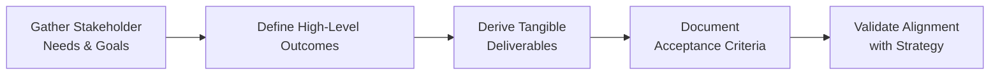

## 12.1 Defining Required Outcomes and Deliverables

Defining required outcomes and deliverables is a vital step in ensuring a project’s success. It lays the foundation for what needs to be produced and how it will be measured to confirm that the end results align with organizational strategy and stakeholder expectations. By clarifying and articulating outcomes in tangible, measurable terms, project managers and teams can track progress, minimize ambiguity, and deliver solutions that genuinely create value.

This section explores approaches, methods, and best practices to identify the “what” and the “why” behind a project’s outputs. We will also examine the relationship between outcomes, deliverables, acceptance criteria, and strategic goals, highlighting how precise definitions mitigate risk and facilitate smoother project execution. Throughout, you will find references to other sections of the book to provide a holistic perspective, as well as real-world examples and a visual diagram illustrating key steps.

---

### Understanding the Significance of Required Outcomes

In project management, an outcome is the specific benefit or result that a project aims to achieve. This could be an increase in customer satisfaction, improvement in operational efficiency, or compliance with new regulations. Deliverables, on the other hand, are tangible or intangible products or artifacts produced during the project life cycle—such as a software module, a blueprint, a training program, or a marketing campaign asset.

From the perspective of the PMBOK® Guide (Seventh Edition) and the accompanying performance domains, focusing on “Delivery” (Chapter 12) involves creating and sustaining the tangible outputs that fulfill expectations. However, delivery in the modern sense goes beyond just handing over a product—it involves ensuring that the deliverable yields real, measurable benefits. This principle-based approach emphasizes value-centric project management, driving home the point that defined outcomes must connect with strategic goals.

#### Key Points

• Outcomes articulate the project’s impact or value (e.g., reduced processing time, cost savings, or enhanced user experience).  
• Deliverables represent the product, service, or result that directly enables those outcomes (e.g., a new application, a manufacturing prototype, or a change management training).  
• Effective definition of outcomes early in the project helps the team remain aligned on what truly matters: delivering tangible benefits that meet stakeholder expectations.  

---

### Differentiating Between Outcomes and Deliverables

Outcomes and deliverables are intimately linked, yet each serves a distinct purpose:

• Outcomes: Long-term, overarching achievements aligning with business or stakeholder objectives (e.g., “improve operational efficiency by 25% within six months of product launch”).  
• Deliverables: Concrete items (tangible or intangible) required to ensure the outcome is achievable (e.g., “Develop a new inventory-management system with automated reordering and real-time reporting capabilities”).  

When the project manager and team understand this difference, it becomes easier to plan effectively, measure success, and ensure that the project remains anchored to organizational value.

---

### Tying Outcomes to Business Objectives and Strategy

In many organizations, project proposals must clearly demonstrate how the resulting outcomes link to broader strategic objectives. To achieve this synergy, consider the following:

• Stakeholder Engagement: By actively collaborating with key stakeholders (see Chapter 7: Stakeholder Performance Domain), you can uncover the driving reasons behind the project. Understanding the “why” is the precursor to defining outcomes that genuinely matter.  
• Organizational Strategy: Aligning project outcomes with corporate, departmental, or product-line strategies ensures not only top-management support but also better resource prioritization. If your organization’s strategic thrust is cost optimization, project outcomes should reflect that objective.  
• Value-Creation Measures: The PMBOK® Guide (Seventh Edition) emphasizes value generation. Outcomes should be measurable and time-bound to ensure both deliverables and results fulfill that promise of value.  

A common pitfall is focusing exclusively on deliverables without regard to the underlying purpose or desired result. Always confirm that each stated deliverable supports a business objective, and ensure that success criteria are framed in terms of measurable outcomes.

---

### Steps to Identifying Required Outcomes and Deliverables

While each organization may adopt variations of the process, four fundamental steps typically guide the articulation of outcomes and deliverables:

#### Engage Stakeholders Early

Stakeholders include end-users, sponsors, customers, and others who have a vested interest in project outputs. By engaging them up front—through interviews, workshops, surveys, or requirements-gathering sessions (see Chapter 17: Scope and Requirements Management)—you can uncover crucial insights into the defining needs and expectations.  

#### Align with Organizational Strategy

Before locking down outcomes, examine the project’s strategic fit. Cross-reference organizational goals, market drivers, or compliance mandates. Is this project intended to boost an existing product line’s market share? Is it primarily about brand reputation or data security? Clarifying alignment helps prioritize what really matters.

#### Define High-Level Outcomes

Synthesize stakeholder expectations and strategic information to describe the overarching outcomes. If the organization wants to streamline its supply chain, define that outcome. For instance: “Reduce lead time across the supply chain by 40%, resulting in an 18% reduction in inventory costs by Q4.” The more specific, the easier it is to derive deliverables and acceptance criteria.

#### Translate Outcomes into Tangible Deliverables

With high-level outcomes established, translate them into deliverables: the physical artifacts or intangible completions that the project will provide. This step often involves the creation of a robust Scope Statement or an Epic/Feature breakdown in Agile contexts. For complex projects, a Work Breakdown Structure (WBS) can help visualize how each deliverable ties to the overarching outcome.

Below is a simplified Mermaid diagram illustrating these steps:

Each step feeds into the next, ensuring alignment and consistency throughout the project. Their logical progression prevents misinterpretation and helps maintain coherence across all performance domains.

---

### Making Outcomes Tangible and Measurable

One of the fundamental responsibilities of a project manager is to ensure outcomes are SMART (Specific, Measurable, Achievable, Relevant, and Time-Bound). Regardless of industry, a well-defined outcome statement must provide clarity on what success looks like. For example:

• Poorly defined outcome: “Increase customer satisfaction.”  
• Well-defined outcome: “Increase customer Net Promoter Score (NPS) from 70 to 80 in the EMEA region by Q3 while maintaining a support resolution time of <24 hours.”

Notice how the second statement includes a quantifiable metric (NPS score), a specific region, a timeline (by Q3), and additional constraints (resolution time <24 hours). This approach ensures there is no ambiguity over whether the project has achieved its objectives.

#### Acceptance Criteria

To verify that deliverables enable the intended outcome, teams establish acceptance criteria—conditions or requirements that must be met before a deliverable is deemed complete or successful. For every deliverable, acceptance criteria clarify:

• Functionality: What must it do?  
• Quality: How well must the deliverable perform?  
• Standards: Which standards or regulatory requirements apply?  
• Validation Method: How will we test or confirm compliance?

Managing acceptance criteria is a key step in the Delivery Performance Domain. The more explicit you are about acceptance criteria upfront, the smoother the verification and validation processes become, reducing rework, confusion, and disputes.

---

### Techniques and Tools for Defining Outcomes and Deliverables

A wide array of techniques can help you define required outcomes and deliverables with clarity and precision. Key examples include:

• Requirements Workshops: Facilitated sessions with stakeholders to clarify business needs and outcomes.  
• MoSCoW Prioritization: Classifying requirements or deliverables into Must-Have, Should-Have, Could-Have, and Won’t-Have items provides better alignment to outcomes.  
• User Stories (Agile Context): User stories capture “who” wants “what” and “why,” emphasizing the outcomes materialized for the end-user.  
• Mind Mapping: Visual representation of how outcomes link to sub-outcomes and deliverables, promoting holistic thinking.  
• Prototypes and Simulations: In software or product development, quick prototypes help stakeholders and the team visualize the deliverable, refining definitions before large-scale rollout.  

---

### Ensuring Cross-Functional Clarity

Many projects fail to reap the value they promise because deliverables are well-defined within one department but misaligned with others. For example, the engineering team might create a technically sound deliverable, but if the marketing or end-user training needed to support a new product is lacking, the broader outcome could suffer. Take these measures to ensure cross-functional clarity:

• Regular Review Sessions: Schedule interactive reviews (e.g., iteration reviews, sprint reviews, or technical/operational walkthroughs) to gather feedback.  
• Common Artifacts and Templates: Use shared templates (see Chapter 41: Reference Charts and Templates) to articulate deliverables, acceptance criteria, and success metrics.  
• Single-Source Documentation: Maintain a single shared repository or platform where all teams can track the definition of outcomes, deliverables, and statuses.  

---

### Integrating Risk and Change Management

As projects evolve, so do the required outcomes and deliverables. Unexpected events, stakeholder feedback, or changing market conditions may necessitate refining what was initially defined. When adjusting outcomes or deliverables, remain vigilant of side effects or potential risks:

• Conduct Impact Analysis: Gauge how changes to one deliverable affect the ability to realize the intended outcome.  
• Update Acceptance Criteria: If the scope or features shift, update acceptance criteria promptly to reflect new realities.  
• Reassess Stakeholder Expectations: Communicate changes proactively. Align with sponsor priorities to ensure the pivot is valid.  

By integrating robust change control procedures (see Chapter 15: Integration Management) and risk management frameworks (see Chapter 14: Uncertainty Performance Domain), you ensure that modifications in the deliverables continue to support the defined outcomes and overall project goals.

---

### Case Study: Automating a Supply Chain Process

Imagine a multinational retail company launching a project to automate its regional supply chain processes. Initial stakeholder interviews revealed the following aspirational outcome: reduce lead times across the supply chain. However, this statement was too broad and lacked clarity. Through deeper engagement and alignment with corporate strategy, the project team reframed it:

• Outcome: “Reduce supply chain lead times by 35% by the end of the fiscal year in three pilot regions, thereby cutting inventory holding costs by at least 20% in those regions.”

Next, they identified deliverables to support this outcome:

• Deliverable 1: Detailed process map of the existing supply chain (with acceptance criteria specifying that the map covers all regional variations and is validated by at least two supply chain SMEs).  
• Deliverable 2: Automated order management module integrated into the company’s ERP system (with acceptance criteria specifying real-time inventory updates across all distribution centers and compliance with local regulations).  
• Deliverable 3: A training program for logistics team members and warehouse staff (with acceptance criteria including interactive e-learning modules, in-person session outlines, plus usage analytics and pass/fail assessments).

By linking each deliverable to a precise acceptance criterion, the project team established clear guidelines for measuring performance. Ultimately, the business case recognized how the well-defined outcome (35% lead-time reduction) was central to meeting cost-reduction strategies.

---

### Common Pitfalls and Best Practices

Project managers often face stumbling blocks when defining outcomes and deliverables. Some typical pitfalls include:

• Vague or Non-Measurable Outcomes: Leads to misunderstanding among stakeholders regarding the project’s success criteria.  
• Focusing on “What” Without the “Why”: When deliverables are created in isolation, the link to strategic objectives or stakeholder benefits may be lost.  
• Not Iterating or Validating: In dynamic industries (e.g., software development or marketing), failing to revisit deliverable definitions regularly can lead to obsolescence or misalignment.  
• Insufficient Stakeholder Buy-In: When key players feel their needs or constraints are not considered, project adoption—and thus outcome realization—may be compromised.

Conversely, best practices for ensuring clarity and alignment include:

• Joint Definition Sessions: Bring multiple stakeholder groups together to co-create the outcome statements and acceptance criteria.  
• Traceability Matrices: Map each outcome to corresponding deliverables and acceptance criteria to ensure none are overlooked (a technique also used in the “Planning Performance Domain,” Chapter 10).  
• Boundary Spanning: Encourage cross-department representation in reviews, ensuring no departmental silo can derail outcome attainment.  
• Continuous Improvement: Through retrospectives or lessons-learned sessions (see Chapter 11: Project Work Performance Domain), refine the process of defining outcomes and deliverables for future projects.

---

### The Role of Adaptive Methods in Defining Outcomes

In Agile or hybrid environments, outcomes and deliverables are not always fully known at the inception of the project. Instead, iterative development cycles progressively refine them based on stakeholder feedback. Adopting an Agile mindset means:

• Embracing Incremental Outcomes: Break larger outcomes into smaller increments, validated in each iteration or sprint.  
• Fostering Collaboration: Constant communication—via daily standups, reviews, retrospectives—keeps the evolving deliverable on track with stakeholder expectations (see Chapters 24–27 on Agile and Hybrid Delivery Approaches).  
• Prioritizing Flexibility Over Documentation: While thorough documentation remains valuable, the key is delivering a working product or service that provides incremental value at each iteration.

---

### Maintaining a Line of Sight to Benefits

Ultimately, defining outcomes and deliverables should never be a static exercise. Revisiting the project’s business case and outcomes helps you confirm that anticipated benefits remain relevant. Chapter 29: Benefits Realization Management explores the full life cycle of benefit tracking, reinforcing why clarity in the initial definition is only one piece of ensuring long-term success.

---

### References for Further Exploration

• PMBOK® Guide – Seventh Edition: Delivery Performance Domain  
• PMIstandards+ and Agile Practice Guide: Guidance on iterative and agile ways to define outcomes  
• Chapter 10 (Planning Performance Domain) and Chapter 17 (Scope and Requirements Management) in this book  
• Industry Articles: “Using Outcome-Driven Innovation to Uncover Hidden Needs” by Anthony W. Ulwick  
• Online Courses: LinkedIn Learning offers modules on Defining Project Scope and Requirements  

---

## Test Your Knowledge on Project Outcomes & Deliverables



### What is the primary difference between an outcome and a deliverable in the context of project management?

- [ ] Outcomes are always intangible, while deliverables are always tangible.  
- [x] Outcomes represent the value or impact of a project, whereas deliverables are the tangible or intangible products enabling that value.  
- [ ] Outcomes are specific work items in the project plan, while deliverables are only post-project results.  
- [ ] Outcomes and deliverables are interchangeable terms with no discernible difference.  

> **Explanation:** Outcomes focus on the end effect or value created (e.g., cost savings, process efficiency), while deliverables are the items or services produced to achieve those outcomes.

### Which is an example of a properly defined outcome?

- [ ] Increase sales of certain products.  
- [x] Increase the market share of Product X from 15% to 20% in Q2 while maintaining current profit margins.  
- [ ] Improve brand awareness.  
- [ ] Offer new digital marketing channels to customers.  

> **Explanation:** The best outcome statements are specific and measurable. They contain a clear target (15% to 20%) and a timeframe (Q2) while retaining current margins.

### When translating high-level outcomes into deliverables, which artifact can help visualize and break down tasks?

- [x] Work Breakdown Structure (WBS)  
- [ ] Responsibility Assignment Matrix (RAM)  
- [ ] Project Charter  
- [ ] Sprint Burndown Chart  

> **Explanation:** A Work Breakdown Structure (WBS) decomposes outcomes and major deliverables into actionable work packages, providing a clear structure for project execution.

### Which scenario illustrates a valid acceptance criterion for a deliverable?

- [ ] “Implement a new vendor management system that is successful.”  
- [ ] “Install a new vendor management system.”  
- [x] “Ensure the vendor management system processes orders within three seconds and supports at least 1,000 transactions per hour.”  
- [ ] “Implement all features requested by the procurement department.”  

> **Explanation:** Effective acceptance criteria include specific, measurable conditions, such as processing speed or transaction capacity.

### Why is it risky to define deliverables without clarifying the underlying outcome?

- [x] The deliverables might not align with broader strategic objectives.  
- [ ] The number of project team members might increase.  
- [x] Stakeholders may lose sight of the business value.  
- [ ] Delivery speed always increases when outcomes are undefined.  

> **Explanation:** Defining deliverables in isolation can cause misalignment with the organization’s strategic goals, and stakeholders might not see the real business benefits, leading to scope creep or dissatisfaction.

### Which approach helps ensure that deliverables remain relevant as project conditions evolve?

- [x] Iterative reviews and change control processes  
- [ ] Locking the scope early and forbidding modifications  
- [ ] Relying solely on the project sponsor’s opinion  
- [ ] Avoiding stakeholder engagement beyond initiation  

> **Explanation:** Iterative reviews and a structured change control mechanism allow the project team to adapt deliverables to dynamic requirements while maintaining alignment with business goals.

### What is the prime advantage of establishing explicit acceptance criteria?

- [x] They make quality checks more objective and trackable.  
- [ ] They reduce the time needed for resource allocation.  
- [x] They ensure that stakeholders understand project constraints.  
- [ ] They eliminate the need for risk management.  

> **Explanation:** Clear acceptance criteria reduce ambiguity by setting measurable standards for success, which in turn fosters understanding and consistency across all project participants.

### What is the primary benefit of linking deliverables directly to strategic organizational goals?

- [ ] It guarantees higher budgets for the project.  
- [ ] It eliminates the risk of schedule delays.  
- [x] It ensures higher executive support and relevance of the project.  
- [ ] It requires fewer documented requirements.  

> **Explanation:** Projects aligned with strategic goals are more likely to gain ongoing executive backing and deliver outcomes that produce tangible organizational value.

### Which technique is most suitable for prioritizing deliverables based on their value to the organization?

- [x] MoSCoW analysis  
- [ ] Pareto Chart  
- [ ] Fishbone diagram  
- [ ] SWOT analysis  

> **Explanation:** MoSCoW stands for Must-Have, Should-Have, Could-Have, and Won’t-Have. It helps rank deliverables by necessity and value, guiding resource allocation and scope decisions.

### True or False: An outcome can still be considered well-defined if it lacks a specified timeframe.

- [x] True  
- [ ] False  

> **Explanation:** While it is ideal for outcome statements to include a timeframe, sometimes the project may focus primarily on a performance metric without a strict deadline. Yet best practice generally advocates specifying a timeframe for clarity and accountability.



---

## PMP Mastery: 1500+ Hard Mock Exams with Full Explanations 

Looking to crush the PMP exam with confidence? Dive deep into 6 rigorous mock exams totaling 1500+ advanced-level questions, each accompanied by clear, step-by-step explanations. Hone your test-taking strategies, master complex topics, and build the resilience you need on exam day. Perfect for serious PMs aiming beyond fundamentals.

Enroll now:  
[PMP Mastery: 1500+ Hard Mock Exams with Exceptional Clarity & Full Explanations](https://www.udemy.com/course/pmp-2025/?referralCode=CF83A54BC86BE27F9AFE)

_Disclaimer: This course is not endorsed by or affiliated with the PMI examination authority. All content is provided purely for educational and preparatory purposes._
