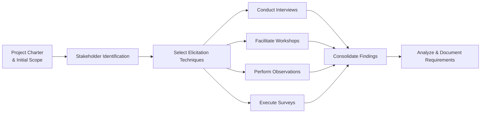

## 12.2 Effective Requirements Gathering and Validation

Effective requirements gathering and validation is a cornerstone of successful project delivery. Poorly defined or misunderstood requirements are among the most common causes of project failure, ranging from cost overruns and schedule delays to stakeholder dissatisfaction. This section explores proven strategies for identifying, documenting, and confirming requirements within the Delivery Performance Domain. We will examine how to collaborate with stakeholders to clarify needs, manage expectations, and demonstrate alignment with project objectives. Additionally, you will learn about techniques to validate and confirm requirements, ensuring the final deliverables truly satisfy the agreed-upon outcomes.

---

### The Role of Requirements in the Delivery Performance Domain

Requirements define the capabilities, features, and conditions that a final product, service, or result must meet to address a business need. Within the Delivery Performance Domain (see Chapter 12), these requirements directly influence how deliverables are produced and handed off. They also inform acceptance criteria, testing strategies, and critical decisions throughout the project life cycle, whether you are operating under predictive, agile, or hybrid methodologies. The goal of this section is to provide project managers with practical tools to ensure requirements are well understood, properly documented, and thoroughly validated methodically and efficiently.

---

### Foundations of Requirements Gathering

A requirement is more than a mere wish list; it represents a documented need that provides measurable value to stakeholders. Requirements can be broken down into several categories:

• Business requirements: High-level outcomes that align with the strategic objectives of the organization.  
• Stakeholder requirements: Capture needs and expectations from each relevant stakeholder group, ensuring alignment across diverse perspectives.  
• Solution requirements: Detailed specifications of the solution's functionality and quality. This category is often subdivided into functional (what it does) and non-functional (how it performs) requirements.  
• Transition requirements: Outlines how to move from the current state to the desired future state.  
• Project requirements: Constraints, assumptions, and parameters (e.g., cost, schedule, regulatory compliance).  
• Quality requirements: Defines standards and criteria for effectively measuring whether requirements are met (often aligns with acceptance criteria).

By clarifying these nuances, project managers can create a solid foundation for comprehensive and organized requirements.

---

### Elicitation Techniques

Elicitation is the structured process of discovering, capturing, and refining stakeholder needs. Each project may leverage multiple elicitation methods to gather well-rounded, validated input.

#### Interviews
One of the most direct and personal methods, interviews allow the project team to speak with stakeholders individually. They can be highly structured (predefined questions), semi-structured (flexible conversation guided by a framework), or unstructured (open-ended exploration).

• Advantages: Deep insights, strong rapport, ability to ask follow-up questions  
• Disadvantages: Time-consuming, possible bias if interviewing a limited set of stakeholders  

#### Focus Groups
Focus groups bring stakeholders together to discuss needs and brainstorm solutions collectively. Skilled facilitators can uncover conflicts, commonalities, and creative solutions that may not emerge from individual interviews.

• Advantages: Group synergy, rapid input from multiple stakeholders  
• Disadvantages: Risk of dominant personalities overshadowing quieter participants  

#### Requirements Workshops
Workshops use interactive, structured activities—such as story mapping, role-play, or group modeling—to identify requirements collaboratively. Workshops are useful for quickly aligning diverse stakeholders and framing the scope.

• Advantages: High engagement, real-time consensus building  
• Disadvantages: Requires significant coordination, skilled facilitation needed  

#### Observations and Job Shadowing
By observing actual user behavior in their work environment, project managers or business analysts can capture unspoken needs and operational constraints often overlooked during formal meetings.

• Advantages: Identifies real-world context, uncovers process inefficiencies  
• Disadvantages: Time-intensive, intrusiveness concerns among stakeholders  

#### Brainstorming
A highly flexible approach in which participants rapidly propose ideas without criticism, followed by grouping and evaluation. Brainstorming spurs creativity, enabling teams to explore various angles.

• Advantages: Encourages idea generation, fosters team creativity  
• Disadvantages: Requires disciplined moderation, risk of groupthink  

#### Document Analysis
Reviews existing policies, standards, diagrams, previous project artifacts, or historical data to identify relevant requirements. Document analysis is especially valuable in regulated industries or for projects with heavy compliance needs.

• Advantages: Objective data, reduced reliance on stakeholder memory  
• Disadvantages: Documents may be outdated or incomplete, can be time-consuming  

#### Prototyping
Projects with a strong user-interface component often use prototypes—mock-ups, wireframes, or early proof-of-concept models—to visualize features and clarify user expectations.

• Advantages: Reduces ambiguity, fosters user feedback early  
• Disadvantages: Creation can be resource-intensive  

#### Surveys and Questionnaires
Especially in large, geographically dispersed projects, surveys help gather broad input quickly. Carefully structured questions yield quantitative metrics, which can guide prioritization during planning.

• Advantages: Reach large audiences, cost-effective  
• Disadvantages: Potential low response rates, limited depth of feedback  

Below is a sample visualization of how these elicitation techniques can integrate into a requirements gathering workflow:

In practice, data from these different methods often overlap, giving the project manager a more holistic view of stakeholder expectations.

---

### Documenting and Tracing Requirements

Once requirements are elicited, they must be documented in a structured and accessible format. This approach ensures stakeholders can review, agree upon, and modify them as necessary during the planning and execution phases.

#### Requirements Documentation

• Text-based artifacts (e.g., requirements specification documents)  
• Story-based descriptions (user stories, use cases)  
• Visual models (process maps, data flow diagrams, or user-interface mockups)  

To maintain a consistent approach, project managers should establish a standardized format for capturing each requirement’s ID, description, category (business, stakeholder, solution), acceptance criteria, and owner.

#### Requirements Traceability Matrix (RTM)

An RTM tracks each requirement through its entire life cycle—from the moment it is identified to final approval. This ensures no requirement is lost, altered without authorization, or left untested. An RTM often links requirements to:

• Business needs  
• Design documents, prototypes, or user stories  
• Code modules and test cases  
• Validation or acceptance criteria  
• Deployment or release records  

---

### Validating Requirements

Validation confirms that documented requirements accurately reflect stakeholder needs and that the solution satisfies these requirements. This process can occur at various points in the project life cycle (e.g., at the end of a sprint in agile environments or after a design phase in traditional approaches).

#### Acceptance Criteria

Clear, objective acceptance criteria describe how to determine whether a requirement is fulfilled. These criteria help teams develop relevant test plans, ensure alignment between development and quality assurance, and provide clarity to stakeholders on what “done” means.

#### Feedback Loops and Reviews

Regular review sessions (e.g., sprint reviews, peer reviews, or sponsor checkpoints) create structured feedback loops. Early and frequent validation reduces rework by highlighting errors or gaps in understanding before substantial resources are invested.

#### Formal Sign-Off

Especially critical for heavily regulated or contractual projects, formal sign-off is a documented acknowledgment from stakeholders or third parties that the captured requirements match their expectations. This often involves key decision-makers reviewing a requirements baseline and approving it in writing or via electronic systems.

#### Prototyping and Demonstrations

Prototypes, demos, or simulations allow stakeholders to experience an early working model or representation of the solution. Having hands-on engagement helps confirm if the documented requirements align with user expectations in practice.

---

### Common Pitfalls and Best Practices

**Pitfalls**  
• Failing to engage the right stakeholders, leading to incomplete or biased requirements.  
• Overlooking non-functional requirements such as performance, reliability, and security.  
• Assuming that stakeholder statements are final without probing for deeper insights or clarifications.  
• Lack of traceability: organizations often lose track of how each requirement connects to final outputs.  

**Best Practices**  
• Begin with clear business objectives to align each requirement with organizational strategy (see Chapter 28 on Aligning Projects with Organizational Strategy).  
• Use multiple elicitation techniques to capture a broad spectrum of requirements.  
• Emphasize collaborative validation sessions (e.g., joint application design workshops).  
• Maintain a living RTM, reviewing it in each iteration or at specific project milestones to preserve alignment.  
• Foster open communication and feedback channels—particularly important in agile or hybrid environments (see Chapter 27 on Hybrid Approaches).

---

### Real-World Case Example

A mid-sized e-commerce company needed to implement a new customer relationship management (CRM) system. Initially, the project team relied solely on written statements from the marketing department, resulting in incomplete requirements and frequent design rework.

By switching to a more comprehensive approach—facilitating brainstorming sessions, observing sales representatives during calls, and analyzing support tickets for recurring issues—the team discovered additional requirements related to automated email triggers, integration with a knowledge base, and robust analytics. Prototyping and frequent iteration reviews then ensured these newfound needs were validated. The project successfully delivered a CRM solution that improved lead management efficiency and customer satisfaction, under budget and ahead of schedule.

---

### Agile and Hybrid Considerations

Agile frameworks like Scrum integrate requirements gathering and validation into each sprint, typically through user stories, product backlog refinement, and sprint reviews (see Chapter 25 on Agile Frameworks and Methodologies). In hybrid environments, project managers often combine predictive artifacts like a Work Breakdown Structure (WBS) with agile ceremonies to gather and validate requirements in iterative cycles. Regardless of the approach, the core principles—thorough elicitation, clear documentation, and frequent validation—remain essential for success.

---

### Requirements Coverage Measurements

In large or complex projects, it is helpful to measure how many requirements have been successfully validated. A simple coverage formula below illustrates the concept:

$$
\text{Requirements Coverage} = \frac{\text{Number of Validated Requirements}}{\text{Total Requirements}} \times 100\%
$$

By tracking this metric over time, teams can quickly identify incomplete or pending requirements before they become sources of rework or missed stakeholder expectations.

---

### Conclusion

Effective requirements gathering and validation underpins strong project delivery and significantly reduces the risk of rework, cost overruns, and stakeholder dissatisfaction. By employing a versatile mix of elicitation techniques, maintaining thorough documentation (such as an RTM), and using structured validation processes, project managers can align outputs to real-world needs. Whether operating in a fully predictive context or leveraging agile and hybrid approaches, the project’s success often begins with well-defined, well-understood, and thoroughly validated requirements.

---

## Test Your Knowledge of Effective Requirements Gathering & Validation



### Which of the following statements best describes a core reason why incomplete requirements often lead to project failures?

- [ ] They reduce documentation effort.  
- [x] They create gaps in the project scope, leading to rework and missed objectives.  
- [ ] They eliminate the possibility of stakeholder conflicts.  
- [ ] They encourage agile documentation practices.  

> **Explanation:** Incomplete or vague requirements fail to provide complete project scope, often causing misunderstandings, rework, and misaligned solutions.

### When is it most beneficial to use observations or job shadowing for eliciting requirements?

- [x] When it’s necessary to understand real-world tasks and workflows in detail.  
- [ ] When multiple stakeholders have identical needs in different locations.  
- [ ] When project requirements are fully documented and signed off.  
- [ ] When no other elicitation techniques are available.  

> **Explanation:** Observing stakeholders in their natural environment helps uncover subtle details or process inefficiencies that might not be mentioned in interviews or workshops.

### Which of the following is a key advantage of using prototypes during requirements gathering?

- [x] They provide a visual and interactive way for stakeholders to validate features.  
- [ ] They prolong the elicitation phase to ensure thorough documentation.  
- [ ] They reduce the need for user feedback altogether.  
- [ ] They make regression testing unnecessary.  

> **Explanation:** Prototypes help users visualize and interact with potential solutions, leading to more accurate feedback on the feasibility and correctness of requirements.

### Which artifact helps track each requirement through its entire life cycle?

- [ ] Quality Management Plan  
- [ ] Product Backlog  
- [x] Requirements Traceability Matrix  
- [ ] Risk Register  

> **Explanation:** A Requirements Traceability Matrix (RTM) links requirements to their origins and tracks changes, helping ensure they remain relevant and validated throughout the project.

### In agile environments, which technique is commonly used to ensure continuous requirements validation?

- [x] Sprint reviews where stakeholders actively provide feedback.  
- [ ] Only focusing on a traditional sign-off after final testing.  
- [x] Backlog refinement sessions to clarify user stories.  
- [ ] Foregoing all documentation to prioritize collaboration.  

> **Explanation:** Agile projects typically use sprint reviews for showcasing completed user stories, while backlog refinement sessions ensure continuous alignment of priority and clarity.

### Which requirement category focuses on transitioning from the current state to the intended future state?

- [x] Transition requirements  
- [ ] Non-functional requirements  
- [ ] Business requirements  
- [ ] Project requirements  

> **Explanation:** Transition requirements cover the steps and conditions needed to move from the as-is environment to the to-be environment, ensuring a smooth adoption of new solutions.

### Which of the following best describes the main purpose of formal sign-off?

- [x] To confirm stakeholder buy-in that requirements accurately capture intended outcomes.  
- [ ] To speed up stakeholder outreach.  
- [x] To legally absolve the team from future changes.  
- [ ] To define new performance metrics.  

> **Explanation:** Formal sign-off is the process by which key stakeholders confirm that the documented requirements match their expectations, often for contractual or regulatory reasons.

### What is one potential pitfall of relying solely on a single stakeholder group for requirement input?

- [ ] Quicker overall agreement reduces the project timeline.  
- [ ] Guarantees final product acceptance without conflicts.  
- [x] Potentially biased or incomplete information leading to overlooked perspectives.  
- [ ] Eliminates the need for refinement or changes later.  

> **Explanation:** Solely engaging one stakeholder group risks neglecting other voices, potentially leading to sponsors, users, or other departments having misaligned expectations.

### Which of the following best describes the objective of acceptance criteria in requirements?

- [x] To provide an objective basis for determining when the solution meets the requirement.  
- [ ] To accelerate design and coding phases by limiting user feedback.  
- [ ] To restrict changes after sign-off.  
- [ ] To identify budget constraints related to requirement changes.  

> **Explanation:** Acceptance criteria serve as precise performance or functional indicators, ensuring both the team and the stakeholders have a common understanding of what “done” looks like.

### True or False: Frequent reviews and feedback loops during requirements validation help reduce costly rework in later project phases.

- [x] True  
- [ ] False  

> **Explanation:** Early and continuous validation helps project teams detect misunderstandings, scope gaps, or design flaws well before they propagate, avoiding expensive downstream corrections.



---

## PMP Mastery: 1500+ Hard Mock Exams with Full Explanations 

Looking to crush the PMP exam with confidence? Dive deep into 6 rigorous mock exams totaling 1500+ advanced-level questions, each accompanied by clear, step-by-step explanations. Hone your test-taking strategies, master complex topics, and build the resilience you need on exam day. Perfect for serious PMs aiming beyond fundamentals.  

Enroll now:  
[PMP Mastery: 1500+ Hard Mock Exams with Exceptional Clarity & Full Explanations](https://www.udemy.com/course/pmp-2025/?referralCode=CF83A54BC86BE27F9AFE)

_Disclaimer: This course is not endorsed by or affiliated with the PMI examination authority. All content is provided purely for educational and preparatory purposes._
