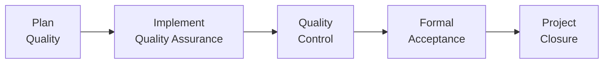

## 12.3 Quality Assurance and Product Acceptance

Quality Assurance (QA) and Product Acceptance are central to the Delivery Performance Domain (see Chapter 12). While earlier chapters of this book—particularly Chapter 20: “Quality Management”—introduce the broader quality framework, this section focuses on how QA audits and processes confirm deliverables are compliant with agreed-upon quality standards and lead to formal acceptance. In other words, QA ensures that you “build the product right,” and Product Acceptance ensures that you “build the right product.”

By proactively monitoring procedures, processes, and frameworks, QA helps teams deliver consistent outcomes with fewer defects. Product Acceptance, meanwhile, is the formal sign-off from authorized stakeholders that deliverables are ready for deployment, handover, or transition. The synergy of QA and acceptance strengthens trust, enhances stakeholder satisfaction, and preserves project value throughout the project’s lifespan.

  
### The Role of Quality Assurance in the Delivery Performance Domain

The Delivery Performance Domain focuses on ensuring that outcomes are provided in a timely manner and to specifications. Within this domain, Quality Assurance is a systematic approach to preventing defects and verifying team compliance with policies, processes, and standards established during planning (refer to Chapter 10: “Planning Performance Domain” and Chapter 20: “Quality Management”). QA also aligns with the PMI principle of Value Focus (see Chapter 5), ensuring that deliberate quality practices optimize outcomes for project stakeholders.

QA involves more than just checking the end product. It spans across the entire lifecycle—whether predictive, agile, or hybrid—providing checks and balances in areas such as:

- Adherence to organizational process assets (OPAs) and compliance guidelines.  
- Implementation of continuous improvement frameworks, like Kaizen or Lean.  
- Ongoing process auditing, ensuring teams follow consistent and effective procedures.  
- Reviewing metrics and analyzing trends to diagnose potential issues early.  

In agile and hybrid projects, QA is frequently iterative and integral to each sprint or iteration. Teams conduct frequent inspections of how they work (e.g., a sprint retrospective or Kaizen event) to refine processes, address bottlenecks, and reduce defect rates in real time. That iterative QA approach supports agility, fosters cross-functional collaboration, and ensures that quality becomes a shared mindset across the entire team.

  
### Distinguishing Quality Assurance from Quality Control

Although Quality Assurance and Quality Control (QC) share the overarching goal of ensuring good-quality outputs, they differ in both scope and timing:

- Quality Assurance (QA): Proactive. Focuses on preventing defects by refining processes and methods. Ensures correct procedures are in place and adhered to, encouraging continuous improvement.  
- Quality Control (QC): Reactive. Focuses on identifying defects in deliverables or processes after they occur. Uses inspections, testing, or reviews to detect variances against pre-defined expectations.  

In a traditional predictive approach, QA takes place during project execution (see Chapter 11: “Project Work Performance Domain”) and checks if the project’s methods, policies, and standards are being correctly followed. QC steps in toward the end or specified checkpoints (e.g., after a product increment is produced) to confirm whether the product meets the required specifications or acceptance criteria.

In agile frameworks, these lines blur since frequent iterations mean both QA and QC often overlap in shorter cycles. For instance, a Scrum team might incorporate test-driven development (TDD), continuous integration, and frequent peer reviews—these practices serve both QA (preventing defects) and QC (detecting defects).

  
### Fundamental QA Activities

Quality Assurance involves systematic, structured steps. Although these can vary by organization and project, they typically include:

- **Developing a QA Plan**  
  Created alongside the overall project management plan (see Chapter 15: “Integration Management”), a QA Plan identifies standards, tools, and methodologies to ensure consistent quality management. This plan is tailored to the project type—predictive, agile, or hybrid—and addresses the stakeholder requirements gathered during scope definition (see Chapter 17: “Scope and Requirements Management”).

- **Implementing Process Audits**  
  QA experts or internal auditors conduct periodic audits to evaluate if processes, procedures, and guidelines align with organizational standards and project-specific requirements. Internal audits clarify roles and responsibilities (see Chapter 8: “Team Performance Domain”) and mitigate risk that can arise from process deviations, as discussed in Chapter 14: “Uncertainty Performance Domain.”

- **Analyzing Metrics and Trends**  
  Data analysis tools—like control charts, run charts, or Pareto diagrams—help identify patterns and areas of defect concentration. By examining whether process assumptions hold true or if calibration is needed, QA teams can proactively adjust processes, thereby reducing cost of rework.

- **Continuous Improvement Initiatives**  
  Many projects adopt formal continuous improvement models, such as Kaizen events or Plan-Do-Check-Act (PDCA). These reinforce a culture where processes are regularly examined, refined, and possibly replaced to eliminate waste, reduce errors, and improve overall output.  

  
### Linking QA and Stakeholder Expectations

Stakeholders often equate product quality with customer satisfaction. When you align QA with stakeholder engagement (see Chapter 7: “Stakeholder Performance Domain”), you create clarity around how the project will meet or exceed stakeholder expectations. QA is especially beneficial for:

- **Refining Acceptance Criteria**  
  By working with your stakeholders early in the planning process, you ensure acceptance criteria are precise, measurable, and feasible. Clarity in requirements (see Chapter 17) translates into fewer misunderstandings and rework.

- **Improving Transparency**  
  Activities such as publishing QA metrics or distributing audit reports build stakeholder confidence. Openly communicating improvements or challenges fosters trust and helps stakeholders feel involved with how the project addresses quality issues.

- **Enhancing Communication Channels**  
  Effective QA relies on timely feedback loops (see Chapter 16: “Stakeholder and Communications Management”). Ensuring that communication paths are well-defined—e.g., using daily stand-ups in agile or weekly status meetings in predictive—helps QA findings be immediately acted upon.

  
### Product Acceptance: Delivering What the Customer Really Wants

Formal acceptance of deliverables lies at the juncture of the Delivery Performance Domain and the final sign-off from authorized stakeholders. Product Acceptance, sometimes referred to as final buy-off, is the process that officially confirms a deliverable has met its agreed-upon acceptance criteria and is authorized to proceed to handover or transition (see Chapter 12.4: “Handover, Transition, and Maximizing Value”).

Acceptance is the critical checkpoint between the finishing line of active development and the transition or closeout phase. Ideally, acceptance occurs in a series of milestones throughout the project—each milestone culminating in the partial or complete sign-off of deliverables.

  
### Key Steps for Formal Acceptance

1. **Review of Acceptance Criteria**  
   Outline and confirm acceptance criteria at the beginning of development. These should be specific—quantifiable measures, tests, or performance thresholds. In agile environments, these acceptance criteria can be found in user stories or backlog items. In predictive settings, they may be documented in scope statements, Statement of Work (SOW), or project charters.

2. **Quality Control Testing**  
   Before acceptance, completed work is subjected to QC tests or inspections. For instance, in software projects, this could involve a system integration test; in construction projects, it might be a site inspection or structural stress test. QA ensures that the process for these QC tests is robust and meets organizational standards.

3. **Validation and Approvals**  
   Results from QC tests are compared against acceptance criteria. If discrepancies exist, rework or defect repairs must occur. When results pass inspection, formal acceptance can be initiated. In agile frameworks, this might happen incrementally each sprint, such as a sprint review or demonstration session.

4. **Sign-Off from Authorized Stakeholders**  
   Stakeholders or product owners in agile contexts provide the final confirmation that deliverables meet or exceed the acceptance criteria. This step typically requires documentation. In enterprise environments, legal or procurement teams might require official sign-off or certificates of compliance.

5. **Record and Communicate**  
   All relevant documentation—test results, sign-off forms, compliance certificates—should be recorded for traceability and lessons learned (see Chapter 11.3: “Managing Communication, Knowledge Transfer, and Lessons Learned”).  

  
### Audits, Process Checks, and Product Acceptance in Different Approaches

Different project life cycle approaches call for different QA and acceptance strategies:

- **Predictive or Waterfall**  
  QA is typically documented in the Project Management Plan, with audits scheduled at specific intervals. Acceptance occurs at major milestones or phase gates. Requirements are mostly signed off early and remain stable throughout, emphasizing front-loaded QA processes.

- **Agile**  
  QA is embedded into daily activities, with techniques like continuous integration, daily stand-ups, test-driven development (TDD), and frequent retrospectives. Acceptance is iterative: each sprint ends with a “Done” Product Increment that is demonstrated to stakeholders for incremental acceptance or constructive feedback.

- **Hybrid**  
  Teams may use predictive techniques for certain components (e.g., hardware or compliance-heavy tasks) while using agile techniques to deliver software features incrementally. QA’s role is to harmonize these processes so that neither approach suffers from mismatched quality standards. Acceptance might happen continuously for agile parts and at set milestones for predictive stages.  

  
### Cost of Quality and Its Implications on Acceptance

A successful Quality Assurance program streamlines acceptance, reduces rework, and maintains budgets. However, it does require upfront investment in process audits, training, and possibly additional tools. Balancing these costs against the risk of delivering poor-quality products is crucial:

- **Cost of Conformance**  
  Investments in training, standardized documentation, or process audits that help prevent defects (or detect them early). These costs often lower the project’s total cost over time by reducing rework and enhancing stakeholder satisfaction.

- **Cost of Nonconformance**  
  Expenses or losses resulting from failing to meet quality standards or acceptance criteria. Late defect discovery, product recalls, or stakeholder dissatisfaction can lead to direct and indirect costs—lost opportunities, missed deadlines, and reputation damage.

  
### Common Pitfalls and Best Practices

Pitfalls:
- **Vague or Shifting Requirements**  
  Without well-defined acceptance criteria, it becomes nearly impossible to reliably conduct QA or finalize acceptance.  
- **Limited Stakeholder Involvement**  
  Excluding key decision makers from the QA or acceptance processes can lead to last-minute changes or rejections.  
- **Underestimating Time/Cost for QA Activities**  
  Rushing QA or skipping audits often leads to costly defects down the line.  

Best Practices:
- **Embed QA Early**  
  Engage teams in QA from the project’s inception. Early involvement helps incorporate best practices from the start.  
- **Tailor QA Approach**  
  Adapt QA processes to suit the scale and complexity of your project (see Chapter 5.6: “Tailoring and Adaptation”).  
- **Use Tools and Automation**  
  Tools like automated testing scripts or continuous integration platforms expedite QA findings, reduce manual errors, and present faster feedback cycles.  
- **Maintain Clear Documentation**  
  A thorough audit trail of QA findings and acceptance sign-offs ensures compliance, accountability, and future reference.  

  
### Real-World Example: Automotive Manufacturing

Consider a company manufacturing components for electric vehicles. In a predictive-focused environment, the QA team establishes quality gates at each production phase (e.g., materials inspection, initial assembly, final assembly). If a process audit reveals that a certain welding technique deviates from safety regulations, the QA team halts production, identifies the root cause, and refines the procedure. Although this may cause interim delays, it ultimately prevents high-cost recalls and reputational damage.

When the final assembly meets critical performance standards (battery life, structural integrity, safety compliance), an inspector—often an external stakeholder—signs off on the final acceptance document, approving the vehicle component for shipment. The manufacturer’s disciplined QA approach ensures that acceptance sign-off is quick, confident, and requires minimal rework.

  
### Real-World Example: Software as a Service (SaaS)

In an agile development environment for a SaaS platform, QA might be integrated into each sprint with testers part of the development team. The team consistently writes user stories with explicit acceptance criteria, performs daily automated tests, and reviews code changes in real time. Frequent retrospectives ensure that the QA process evolves—if defects are repeatedly found in user-interface (UI) functions, the team might increase peer reviews or incorporate new design checks.

At the end of each sprint, the Product Owner reviews the newly developed features and thoroughly tests them against the acceptance criteria. Whenever the feature fulfills (or exceeds) the criteria, it is considered accepted, integrated into the production environment, and possibly released immediately to end-users.

  
### Diagram: QA and Acceptance Flow

Below is a simplified flowchart that illustrates how Quality Assurance feeds into Quality Control and, ultimately, formal acceptance within a project lifecycle. This high-level process can be adapted to predictive, agile, or hybrid contexts.

- **Plan Quality**: Define standards, metrics, and processes (Chapters 10, 20).  
- **Implement Quality Assurance**: Execute audits, refine processes, and ensure standards are met.  
- **Quality Control**: Perform inspections, testing, or reviews on deliverables.  
- **Formal Acceptance**: Stakeholders sign off that deliverables meet acceptance criteria.  
- **Project Closure**: Transition deliverables, finalize documentation, and capture lessons learned.  

  
### Connecting QA and Acceptance to Other Performance Domains

- **Stakeholder Domain (Chapter 7)**: Early engagement ensures that QA aligns with stakeholder priorities; acceptance is expedited when all relevant parties are informed and supportive.  
- **Planning Domain (Chapter 10)**: A thorough QA Plan that complements the project management plan fosters consistent processes and accurate forecasting of schedule and cost.  
- **Measurement Domain (Chapter 13)**: QA metrics, dashboards, and acceptance test results feed directly into project performance measurements, enabling data-driven decisions.  
- **Uncertainty Domain (Chapter 14)**: QA audits help detect issues early, thereby reducing risk. Acceptance gates also serve as risk mitigation checkpoints, ensuring alignment before advancing.  

  
### Conclusion

Quality Assurance is a proactive, process-oriented approach that, when implemented effectively, reduces variances, mitigates risks, and significantly improves team synergy. It involves detailed planning, systematic audits, and continuous collaboration across cross-functional teams. With QA well-established, Product Acceptance becomes a deliberate, structured procedure that secures formal stakeholder endorsement, marking a key milestone in delivering project success.

By integrating QA from the start and engaging stakeholders in acceptance reviews, you minimize last-minute surprises and rework. In turn, you promote a transparent, efficient, and high-quality environment that ensures your project truly meets—and ideally, exceeds—customer expectations.

---

## Test Your Knowledge: Quality Assurance & Product Acceptance



### In which phase of a predictive project do formal acceptance activities often occur?

- [ ] During initial project planning
- [x] At milestones or phase gates
- [ ] Just after risk assessments
- [ ] Before the project charter is finalized

> **Explanation:** In traditional/predictive approaches, acceptance activities often occur at significant milestones, phase gates, or upon completion of major deliverables.

### Which statement best describes the difference between Quality Assurance (QA) and Quality Control (QC)?

- [ ] QA ensures deliverables meet acceptance criteria, while QC ensures stakeholder buy-in
- [ ] QC focuses on process improvement, while QA focuses on final product checks
- [x] QA prevents defects by refining processes, while QC identifies defects in deliverables
- [ ] QC applies only to agile projects, while QA applies only to predictive projects

> **Explanation:** QA is proactive in preventing defects and improving processes; QC is reactive, focusing on detecting and correcting defects in produced deliverables.

### What is a key benefit of embedding QA audits throughout the project lifecycle?

- [ ] Shortening the project timeline by bypassing rework
- [ ] Reducing overall project transparency
- [x] Identifying process gaps early and preventing defects
- [ ] Making sure QC is always performed at the end

> **Explanation:** Continuous QA audits catch issues early, reducing the likelihood of significant rework, cutting costs, and boosting adherence to standards.

### Why is stakeholder involvement crucial in establishing acceptance criteria?

- [ ] To prolong the planning phase
- [x] It ensures alignment with stakeholder expectations and reduces misunderstandings
- [ ] So that QC can ignore the acceptance process
- [ ] Because agile projects do not require acceptance criteria

> **Explanation:** Involving stakeholders ensures that acceptance criteria truly reflect user needs and industry standards, minimizing confusion and rework.

### Which of the following is most closely associated with reducing the cost of nonconformance?

- [x] Continuous improvement culture
- [ ] Skipping audits to save time
- [x] Preventive training on new processes
- [ ] Delaying defect detection to the end of the project

> **Explanation:** Fostering a continuous improvement mindset and offering preventive training help avoid errors, thereby reducing the cost of nonconformance.

### Which tool helps visualize the frequency or pattern of defects across a timeline?

- [ ] Responsibility Assignment Matrix (RAM)
- [x] Control Chart
- [ ] RACI Chart
- [ ] Stakeholder Register

> **Explanation:** A control chart plots measurements over time to monitor process stability and detect variances or trends in defects.

### How do agile teams typically conduct QA activities?

- [x] By integrating QA practices, such as TDD and continuous integration, into every sprint
- [ ] By reviewing defects only at project closure
- [x] By holding a single QA review at the end of the project
- [ ] By delegating QA exclusively to a separate external team

> **Explanation:** Agile teams often embed QA strategies—like continuous integration, automated testing, and daily scrums—throughout each iteration or sprint.

### What is one potential impact of failing to implement a robust QA plan?

- [ ] Easing stakeholder acceptance since no audits are required
- [x] Increased rework, defects, and overall project costs
- [ ] Improved team morale due to fewer process constraints
- [ ] Faster schedule completion due to reduced oversight

> **Explanation:** Without QA, defects or process issues accumulate, leading to higher costs, frustration, and schedule delays.

### In a project using a hybrid approach, how are acceptance activities typically handled?

- [x] Using both incremental acceptance for agile components and milestone-based acceptance for predictive components
- [ ] Completing all acceptance activities only at final project closure
- [ ] Eliminating formal acceptance because hybrid is flexible
- [ ] Conducting acceptance activities only through an external vendor

> **Explanation:** Hybrid approaches often blend incremental feedback loops for agile deliverables with more formal acceptance gates for predictive project segments.

### QA is generally considered a (n) _____ approach, while QC is considered a (n) _____ approach.

- [x] Proactive, Reactive
- [ ] Reactive, Proactive

> **Explanation:** QA proactively prevents defects by focusing on processes and methods, while QC is reactive, identifying and correcting defects after deliverables are produced.



---

## PMP Mastery: 1500+ Hard Mock Exams with Full Explanations

Looking to crush the PMP exam with confidence? Dive deep into 6 rigorous mock exams totaling 1500+ advanced-level questions, each accompanied by clear, step-by-step explanations. Hone your test-taking strategies, master complex topics, and build the resilience you need on exam day. Perfect for serious PMs aiming beyond fundamentals.

Enroll now:  
[PMP Mastery: 1500+ Hard Mock Exams with Exceptional Clarity & Full Explanations](https://www.udemy.com/course/pmp-2025/?referralCode=CF83A54BC86BE27F9AFE)

_Disclaimer: This course is not endorsed by or affiliated with the PMI examination authority. All content is provided purely for educational and preparatory purposes._
