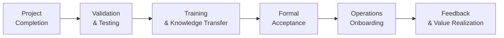

## 12.4 Handover, Transition, and Maximizing Value

Transferring ownership of project deliverables from the project team to the operational environment is a pivotal moment. This phase—commonly referred to as “handover” and “transition”—involves more than simply delivering documents or presenting a final product. It requires multi-dimensional coordination, stakeholder alignment, a plan for operational readiness, and a robust strategy to ensure that the project’s intended benefits are realized over time.  

In this section, we explore how to plan for a smooth handover and transition, highlight best practices for knowledge transfer, discuss aligning deliverables with ongoing operations, and provide strategies for maximizing long-term value. We also address real-world complexities that can threaten a successful handover—such as incomplete acceptance criteria, stakeholder turnover, or lack of operational training—and offer guidance on preventing common pitfalls. The ultimate goal is to ensure that once the project is completed, its outputs deliver sustained value to the organization.

### The Importance of a Thoughtful Handover

Delivering on time and within budget is of little consequence if the receiving operational teams are unprepared or unable to harness the project’s outputs. Handover and transition culminate all the preceding efforts in the Delivery Performance Domain, ensuring continuity of service, product usage, or strategic outcomes.  

• Aligns with Organizational Strategy: A well-structured transition underscores the project’s alignment with broader organizational objectives (see Chapters 28 and 29).  
• Facilitates Organizational Readiness: By intentionally training operational teams and providing clear documentation, organizations reduce disruptions that might erode trust in the new product or service.  
• Sets the Stage for Future Improvements: Effective handover includes lessons learned and feedback loops, enabling continuous improvement or iterative enhancements in agile, hybrid, and even predictive environments.  

### Concepts and Terminology

Before exploring the practical steps, it helps to clarify some key terms:

• Handover: The formal process of transferring final deliverables or products from the project to stakeholders, sponsors, or end users.  
• Transition: A broader concept that includes integrating the delivered products or services into existing operations or new environments, deploying necessary updates, and establishing support mechanisms.  
• Operational Readiness: The state in which stakeholders, end users, and the organization are adequately prepared to operate, maintain, and continuously improve the delivered product or service.  
• Maximizing Value: Ensuring that project outcomes continue to yield or exceed the expected benefits, aligning with the organization’s strategic direction.

### Planning for Operational Readiness

An effective handover does not occur spontaneously at the end of a project; it requires planning from the early stages of project work and must be continuously refined as more is learned.  

• Early Stakeholder Engagement: Involve operational stakeholders and end users early in defining acceptance criteria (see Chapter 12.2) to ensure alignment with real-world operating conditions.  
• Clear Acceptance Criteria: Documented requirements and acceptance tests ensure that all parties agree on what “done” means, reducing the risk of disputes during transition.  
• Training and Capacity Building: Develop a structured learning path—videos, workshops, job aids, or other training materials—for the operational team.  
• Communication Planning: Communication channels outlined in the communication management plan (see Chapter 16) keep relevant parties engaged in transition updates.  

### Steps for an Effective Handover and Transition

Although specific details vary by industry and project, most effective handover strategies follow these steps:

#### 1. Final Validation and Testing

• Confirm Requirements: Verify delivery of the product or service against the scope baseline (refer to Chapter 17).  
• User Acceptance Testing (UAT): Provide operational owners and end users an opportunity to test the deliverables using real-life scenarios.  
• Quality Checks and Inspections: Perform final quality assurance and control activities (see Chapter 20) to confirm that the deliverables meet defined standards.  

#### 2. Documentation and Knowledge Transfer

• Compile Key Artifacts: Gather user manuals, standard operating procedures (SOPs), training guides, and project documentation.  
• Lessons Learned: Ensure that lessons learned are documented and shared, so operational teams understand how to maintain and optimize the product or service.  
• Intellectual Property (IP) and Licenses: If relevant, confirm that required software licenses, intellectual property rights, or patent considerations are appropriately handed over.  

#### 3. Formal Acceptance and Sign-Off

• Obtain Stakeholder Approvals: Secure sign-off from sponsors, senior management, or regulators as needed.  
• Transition Checklists: Use a structured checklist to validate that every critical element—such as resource allocation, readiness of support teams, and data migration—has been addressed.  
• Risk Review: Revisit and close or transfer any open risks or issues to the operational owner (see Chapter 14 and Chapter 22).  

#### 4. Release and Deployment

• Deployment Strategy: Plan a phased release, pilot program, or big-bang deployment based on project risk tolerance and complexity.  
• Contingency Measures: Have rollback or rollback triggers in place if the selected deployment method encounters significant issues.  
• Monitoring and Stabilization: Immediately after deployment, monitor system performance, user adoption, or output quality to stabilize in the operational environment.

#### 5. Transition to Ongoing Operations

• Operational Handover Plan: Outline responsibilities for ongoing governance, continuous improvement, and performance monitoring.  
• Training and Onboarding: Conduct final training sessions, either in-person or virtually, and confirm that knowledge transfer is completed.  
• Confirm Service Level Agreements (SLAs): Define and communicate operational performance targets, escalation paths, and response times to ensure that operational teams are prepared for ongoing support.  

#### 6. Leveraging Feedback and Continuous Improvement

• Feedback Loops: Establish regular feedback sessions between operational teams and project management to refine and enhance deliverables.  
• Post-Implementation Reviews (PIR): Conduct a structured review (often 30–90 days post-handover) to address issues, track benefits, and identify improvement opportunities.  
• Tracking Key Metrics: Evaluate the operational stability, end-user satisfaction, and realized benefits using metrics defined in your measurement plan (see Chapter 13).

### Agile and Hybrid Approaches to Handover

In agile and hybrid environments, handover and transition activities occur more frequently and iteratively. Each incremental release might incorporate its own mini-handover cycle, often referred to as a “delivery” or “deployment.” Rather than waiting until the very end, agile teams:  

• Continually Involve Operational Stakeholders: Ongoing reviews, retrospectives, and feedback sessions ensure that solutions evolve seamlessly into operational use.  
• Use Product Owners as Bridges: In Scrum, for example, the Product Owner liaises between the development team and stakeholders, helping to coordinate acceptance tests and user feedback.  
• Deliver and Transition in Smaller Chunks: Instead of one major handover event, smaller increments reduce risks and lower the burden on operational teams.  

### Ensuring Long-Term Value Realization

A project’s success is not only measured by whether it meets its immediate objectives but also by whether its deliverables create lasting value. Many organizations use a Benefits Realization Management framework (see Chapter 29) to track realized benefits over the long term. Key aspects include:  

• Benefit Tracking and Reporting: Regularly measure the outcomes tied to revenue, cost savings, or strategic improvements.  
• Continuous Engagement with Stakeholders: Maintain relationships with key stakeholders to evaluate how the product or service is performing in the field.  
• Aligning with Organizational Strategy: Revisit how the project outputs serve the organization’s vision, mission, and strategic objectives. If the environment changes, be prepared to adapt.  

### Measuring Post-Handover Success

During or after transition, reevaluate key objectives laid out in the project charter and benefits plan. For instance, you might:  

• Compare Actual vs. Planned ROI:  
  KaTeX Example:  
  ROI = \\(\frac{\text{Net Benefits}}{\text{Total Cost}} \times 100\%\\)  

• Measure Adoption Rates: Track system usage or user satisfaction scores under the new product or process.  
• Assess Service Levels: Evaluate uptime, response times, or defect rates to see if the delivered solution meets operational SLAs.  
• Review Stakeholder Satisfaction: Capture feedback through surveys or formal interviews to see how effectively the project deliverables meet stakeholder needs.  

### Common Pitfalls to Avoid

• Incomplete Transfer of Knowledge: Neglecting to properly train or equip the operational team can lead to difficulties in using or maintaining the deliverables.  
• Overlooking Organizational Culture: Resistance to change or a lack of alignment with existing processes can stall the adoption of new solutions.  
• Late Involvement of Operations: If the operational team is brought in too late, tension and misunderstandings can arise, causing rework or incomplete acceptance.  
• Inadequate Documentation: Failing to provide comprehensive and easy-to-understand documentation impedes smooth integration and future updates.  

### Real-World Example: Transitioning an IT System

Imagine a financial services firm implementing a new customer relationship management (CRM) system. The CRM development project is executed over nine months, involving a series of phased rollouts in a hybrid approach. Here is how handover and transition might play out:

1. During planning, the operational support team was involved to define support requirements, such as 24/7 helpdesk coverage.  
2. Throughout each iteration, end users in the sales department provided feedback and used the system in pilot mode.  
3. In the final handover, the project team delivered user manuals, training sessions, and all system documentation.  
4. The operational team signed off once the system passed UAT and performance benchmarks.  
5. Two months post-implementation, a focused benefits review was conducted, evaluating revenue gains from improved sales efficiency. The team iterated on the CRM to address emerging needs and expand the system’s capabilities.  

### Visualizing Handover and Transition

The handover process can be illustrated in a high-level flowchart:

• A: Marks the point at which project scopes have been fulfilled and deliverables are ready for final checks.  
• B: Ensures the deliverables meet defined quality standards and acceptance criteria.  
• C: Transfers critical knowledge to the receiving organization.  
• D: Formal sign-off ensures accountability and ownership within the operational environment.  
• E: The operational environment embraces the deliverable, coordinating any final adjustments.  
• F: Measures and enhances value over time, ensuring strategic alignment and continuous improvement.

### Practical Tips for Maximizing Value Post-Handover

• Early Handover Planning: Incorporate transition activities into the project management plan at the outset.  
• Stakeholder-Driven Acceptance Criteria: Involve direct users in acceptance testing to guarantee relevance and usability.  
• Align with Organizational Change Management: For deeper organizational impacts, integrate with change management strategies (see Chapter 30).  
• Monitor Benefits Over the Long Run: Set triggers or review points (e.g., 6 months, 1 year) to assess the sustained impact of project deliverables.  
• Update Governance Documents: Ensure the new products or services are reflected in organizational policies, procedures, and corporate knowledge repositories.

### References for Further Exploration

• PMI’s “A Guide to the Project Management Body of Knowledge (PMBOK® Guide) – Seventh Edition” for principles-based handover best practices  
• “Agile Practice Guide” (by PMI and Agile Alliance) for iterative handover and feedback approaches  
• Chapter 29 of this book: “Benefits Realization Management” for in-depth guidance on tracking and maximizing value  
• Chapter 41 of this book: “Reference Charts and Templates” for checklists and life cycle management tools  

Handover and transition stand as critical concluding stages in the Delivery Performance Domain, bridging a project’s work results with operational needs. By embedding these activities throughout the project—from early requirement-gathering to final lessons learned—you can achieve a seamless transition, reduce resistance, and maximize the project’s value for your organization long after the final deliverable is accepted.

## Test Your Knowledge: Handover, Transition, and Value Realization



### During a project’s final phase, which action best ensures a smooth transition to operations?

- [ ] Extending the project schedule to accommodate additional scope  
- [x] Providing comprehensive training and documentation to operations staff  
- [ ] Reassigning cost reserves to the marketing team  
- [ ] Initiating scope changes based on post-project feedback  

> **Explanation:** A smooth transition relies on well-prepared operational teams—achieved with training, thorough documentation, and knowledge transfer.

### Which of the following is the best definition of “operational readiness”?

- [ ] The project team’s confidence in meeting the final deadline  
- [ ] The point at which the project deliverables have been signed off by key stakeholders  
- [x] The state in which end users and support teams are fully prepared to receive and sustain the project outputs  
- [ ] The readiness of the sponsor to provide additional funding for future phases  

> **Explanation:** Operational readiness focuses on ensuring that those who will use and maintain the deliverables have the necessary support, training, and comfort level.

### A major pitfall when handing over project deliverables to operations is:

- [x] Inadequate documentation and incomplete knowledge transfer  
- [ ] Scheduling a formal acceptance meeting with senior management  
- [ ] Using standardized checklists to verify deliverables  
- [ ] Conducting post-implementation reviews and collecting feedback  

> **Explanation:** An insufficient handover can leave operational teams unprepared to operate or maintain the deliverables, leading to inefficiencies and user frustration.

### A post-implementation review (PIR) is typically conducted to:

- [x] Assess the delivered product, validate benefits, and collect feedback for improvement  
- [ ] Extend the project’s budget due to scope creep  
- [ ] Create the initial project charter and stakeholder register  
- [ ] Eliminate any communication requirements in the final phase  

> **Explanation:** A PIR evaluates how well a solution meets its intended objectives and gathers insights for ongoing enhancements.

### Which aspect is crucial for long-term benefits realization after a product has transitioned to operations?

- [x] Continuous stakeholder engagement and metrics tracking  
- [ ] Immediate project closure with no further updates  
- [x] Defined feedback loops and iterative improvements  
- [ ] Reduction of operational resources to save costs  

> **Explanation:** Maintaining engagement, tracking metrics, and iterating based on feedback ensure that benefits are realized and sustained over time.

### Which of the following steps is part of a formal acceptance and sign-off process?

- [x] Using a checklist to validate that each deliverable meets the predefined acceptance criteria  
- [ ] Introducing entirely new features after the deliverables are finalized  
- [ ] Omitting legal compliance checks to expedite sign-off  
- [ ] Shifting the project to a new scope definition  

> **Explanation:** Formal acceptance often involves verifying that documented acceptance criteria at the project outset are indeed met.

### In agile or hybrid settings, handover activities are often:

- [x] Frequent and iterative, tied to ongoing increments or releases  
- [ ] Limited to a single final handover event at project closeout  
- [x] Combined with continuous feedback and backlog grooming efforts  
- [ ] Disconnected from user or stakeholder involvement  

> **Explanation:** Agile encourages smaller, more frequent releases, each accompanied by some form of transition or continued stakeholder involvement.

### When measuring the success of a handover, which metric would be most relevant?

- [x] End-user satisfaction or adoption rates  
- [ ] The number of unresolved project risks stored in the risk register  
- [ ] The quantity of meetings the project manager attended  
- [ ] The project’s internal rate of return calculated during initiation  

> **Explanation:** Measuring elements such as user satisfaction, adoption, or usage rates directly reflects how effectively the transition was handled.

### In a benefits realization framework (as discussed in Chapter 29), which action plays a key role in maximizing value after handover?

- [x] Defining and reviewing key performance indicators (KPIs) on a scheduled basis  
- [ ] Allowing the product or deliverable to function without any measuring or monitoring  
- [ ] Cancelling all stakeholder engagement activities  
- [ ] Transitioning the benefits plan to the project charter  

> **Explanation:** Tracking value through KPIs provides a structured means to determine if the expected benefits are materializing and to adjust approaches if they are not.

### The concept of “rollback” during deployment protects:

- [x] True  
- [ ] False  

> **Explanation:** Rollback plans provide a contingency option if a new release introduces issues detrimental to business operations, promoting safer transitions.



---

## PMP Mastery: 1500+ Hard Mock Exams with Full Explanations 

Looking to crush the PMP exam with confidence? Dive deep into 6 rigorous mock exams totaling 1500+ advanced-level questions, each accompanied by clear, step-by-step explanations. Hone your test-taking strategies, master complex topics, and build the resilience you need on exam day. Perfect for serious PMs aiming beyond fundamentals.  

Enroll now:  
[PMP Mastery: 1500+ Hard Mock Exams with Exceptional Clarity & Full Explanations](https://www.udemy.com/course/pmp-2025/?referralCode=CF83A54BC86BE27F9AFE)

_Disclaimer: This course is not endorsed by or affiliated with the PMI examination authority. All content is provided purely for educational and preparatory purposes._


