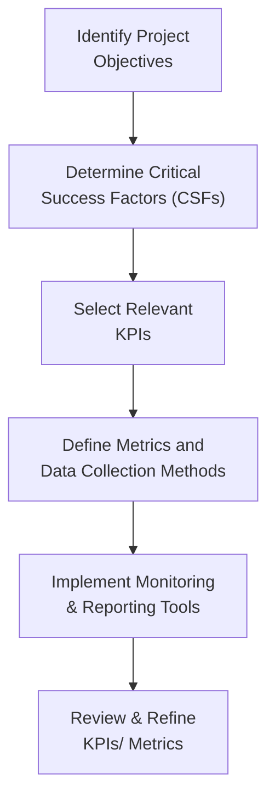

## 13.1 Establishing KPIs, Metrics, and Reporting Methods

Measuring a project's performance is a fundamental requirement for ensuring success, enabling proactive decision-making, and meeting stakeholders’ expectations. Key Performance Indicators (KPIs) and well-defined metrics are at the core of this measurement. Given the dynamic nature of projects today—ranging from fully agile to hybrid to traditional waterfall—understanding how to tailor performance metrics is critical. This section explores the frameworks and methodologies for selecting the right KPIs, developing relevant metrics, and designing transparent reporting dashboards that keep the project team and stakeholders aligned.

### Why KPIs and Metrics Matter
Projects exist to deliver value. As discussed in Chapter 5 (PMI’s 12 Project Management Principles) and Chapter 12 (Delivery Performance Domain), focusing on outcomes and value is essential. KPIs keep your eyes on those outcomes. By systematically measuring progress, quality, and efficiency, you can detect performance trends, anticipate risks, and make informed decisions.

KPIs and metrics:
- Show how effectively objectives are being met.  
- Provide early warning signs to mitigate risks.  
- Enable continuous improvement.  
- Increase stakeholder confidence and engagement.  

### Understanding Key Terminology

#### KPI vs. Metric
- A KPI is a special type of metric that directly relates to a strategic objective. KPIs are not merely data points; they should signal whether the project is on track to deliver business value.  
- A metric can be any quantifiable measure, such as the number of defects found in a sprint or average cost per deliverable. Not all metrics are strategic; some are simply diagnostic or operational measures.  

For example, "Team Velocity" might be a metric, while a KPI could be "Number of Features Deployed that Align to Core Organizational Strategy."

#### Leading and Lagging Indicators
- Leading Indicators: Predict future performance. For instance, the rate at which new risks are identified per month might indicate how challenging the project environment will become.  
- Lagging Indicators: Reflect past performance. Earned Value calculations (e.g., Cost Performance Index) tell you how a project has performed so far.

Balancing both leading and lagging indicators gives a holistic view of progress and helps anticipate future obstacles.

### Selecting Appropriate KPIs

Selecting the right performance indicators requires an in-depth review of the project’s objectives, stakeholders’ expectations, and organizational strategies. As explored in Chapter 7 (Stakeholder Performance Domain), a misguided KPI that does not matter to stakeholders will quickly lose relevance and create confusion.  

1. Align With Strategy: Every KPI must link back to strategic, project-specific, or organizational goals. This keeps the project aligned with enterprise-level objectives (see Chapter 28: Aligning Projects with Organizational Strategy).  

2. Maintain Relevance: Avoid extraneous or “vanity” metrics. Choose KPIs that reflect genuine project health and risks.  

3. Keep It Actionable: A good KPI points to specific behaviors or changes that can be made when performance is off track. For example, if stakeholder engagement is low, you can reassess your communication plan or expand your project demonstrations.  

4. Make It Measurable and Time-Bound: KPIs need to have clear, quantifiable targets and straightforward measurement intervals (weekly, monthly, or per sprint), so everyone understands the timeframe in which improvement is expected or required.  

#### The SMART Principle
Many teams use the SMART framework to guide them in defining strong KPIs:  
- Specific: Clearly defined scope, boundaries, objectives.  
- Measurable: Quantifiable through standard measurement tools.  
- Achievable: Realistic within available resources and constraints.  
- Relevant: Aligned to project goals and stakeholder expectations.  
- Time-Bound: Measured within a set timeframe (e.g., monthly or quarterly).  

### Linking KPIs to Project Phases
Projects evolve over multiple phases. This is especially true in hybrid or large-scale initiatives where planning, execution, and transitioning to operations may be complex. Throughout these phases, your KPIs might shift or evolve:

- Initiation Phase: Forecast demand, business case alignment, stakeholder buy-in.  
- Planning Phase: Quality of scope definition, schedule feasibility, cost accuracy.  
- Execution Phase: Deliverable quality, team velocity, defect rates, risk management efficiency.  
- Monitoring and Controlling Phase: Variance in budget (Cost Variance, CV), variance in schedule (Schedule Variance, SV), earned value metrics (SPI, CPI), conformance to scope.  
- Closure/Transition Phase: Stakeholder satisfaction, benefits realization metrics, lessons learned adoption rate.  

### Constructing Useful Metrics

Once you have identified your KPIs, you need to translate them into trackable metrics—both quantitative and qualitative. Common families of metrics include:

1. Scope Metrics  
   - Number of scope changes per iteration  
   - Requirements stability index  
   - Delivered vs. planned features  

2. Schedule Metrics  
   - On-time milestones (predictive approach)  
   - Sprint velocity (agile approach)  
   - Lead time or cycle time (Kanban method)  

3. Budget/Cost Metrics  
   - Earned Value Management measures (CPI, SPI)  
   - Budget variance, cost variance  
   - Projected final cost vs. baseline  

4. Quality Metrics  
   - Defect density or defect escape rate  
   - Customer satisfaction survey results  
   - Quality gate pass rate  

5. Risk Metrics  
   - Risk exposure index (combining probability and impact)  
   - Number of escalated risks vs. total identified risks  
   - Risk burn-down rate (agile contexts)  

6. Stakeholder Engagement Metrics  
   - NPS (Net Promoter Score) for stakeholder happiness  
   - Participation rate in project reviews  
   - Response time to feedback requests  

7. Integration/Collaboration Metrics  
   - Cross-functional team involvement hours  
   - Knowledge transfer and turnover rates  
   - Collaboration tool usage  

Below is a sample table illustrating different categories of metrics:

| Category            | Example Metric              | Purpose                              |
|---------------------|-----------------------------|--------------------------------------|
| Scope               | Percentage of Requirements Met | Ensures alignment with scope baseline |
| Schedule            | Sprint Velocity            | Predicts future delivery capacity      |
| Cost                | CPI (Cost Performance Index) | Measures spending efficiency           |
| Quality             | Defect Escape Rate         | Gauges testing and QA effectiveness    |
| Risk                | Risk Exposure Index        | Prioritizes high-impact risks          |
| Stakeholder         | NPS (Net Promoter Score)   | Assesses overall stakeholder sentiment |
| Collaboration       | Tool Utilization Rate      | Indicates adoption of communication mediums |

### Methods for Reporting
Reporting methods bring metrics to life by conveying them in a format that stakeholders and project teams can readily interpret and act upon. Common reporting methods include:

- Traditional Status Reports: Summaries of accomplishments, next steps, issues, and risks (see also Chapter 16: Stakeholder and Communications Management).  
- Dashboards: Visual displays of real-time or near-real-time project metrics.  
- Agile Information Radiators: In Scrum or Kanban settings, boards, burndown/burnup charts, and cumulative flow diagrams help the team self-manage.  
- Executive Summaries: High-level overviews highlighting critical KPIs for senior leadership.  

#### Designing Effective Dashboards
Dashboards provide quick snapshots of project progress and performance. They can be simple spreadsheets, specialized project management tools, or integrated enterprise solutions like Power BI or Tableau. A good dashboard:

1. Targets the Right Audience  
   - Executive dashboards emphasize high-level KPIs, strategic alignment, budget, and risk.  
   - Team dashboards may include daily tasks, sprint backlogs, velocity, and quality checks.  

2. Offers Visual Clarity  
   - Use color codes (red, yellow, green) to highlight urgent vs. stable areas.  
   - Apply consistent chart types for easy comparison (e.g., line graphs for trends, bar charts to compare categories).  

3. Provides Real-Time (or Timely) Data  
   - Automate data flow to minimize manual errors.  
   - Refresh intervals should match project need: daily, weekly, or monthly.  

4. Encourages Engagement  
   - Provide interactive filters or drill-down options so stakeholders can explore more details.  

### Visual Representation: KPI Development Flow

Below is a Mermaid diagram that outlines a typical process for developing project KPIs and metrics:

- A["Identify Project Objectives"]: Clarify specific, measurable goals early in the project.  
- B["Determine Critical Success Factors (CSFs)"]: Pinpoint the most vital elements that must be in place for success.  
- C["Select Relevant KPIs"]: Prioritize indicators that link most directly to those CSFs.  
- D["Define Metrics and Data Collection Methods"]: Ensure the data is both collectable and verifiable.  
- E["Implement Monitoring & Reporting Tools"]: Put in place dashboards, spreadsheets, or automated systems to track data.  
- F["Review & Refine KPIs/ Metrics"]: Periodically assess KPI relevance. Adapt to changes in project environment or scope.

### Best Practices for Effective KPI Management
1. Involve Stakeholders Early: Solicit input from key stakeholders, including sponsors, end users, and team members. This creates buy-in and ensures alignment with the project’s vision.  
2. Keep It Simple: Narrow down to a manageable set of KPIs—too many can dilute focus.  
3. Automate Where Possible: Automated data collection reduces errors and frees up time for analysis and action.  
4. Schedule Regular Reviews: Use iterative feedback loops (as described in Chapter 9: Development Approach and Life Cycle Performance Domain) to adjust KPIs.  
5. Link to Decision-Making: KPIs should facilitate decisions, not merely decorate reports.  

### Common Pitfalls and Challenges
- Defining Irrelevant KPIs: A KPI that no one cares about or that doesn’t reflect strategic value can waste resources.  
- Lack of Baselines: Without historical data or a clear baseline, it is difficult to gauge improvement or address issues.  
- Overcomplication: A highly complex KPI might require extraordinary data collection efforts, leading to inefficiency.  
- Ignoring Qualitative Factors: Not all project components can be measured purely in numbers; stakeholder perception, team morale, and organizational culture may require qualitative assessment.  
- Lack of Transparency: Hiding or misrepresenting KPI data undermines trust. Ensure openness and honesty in reporting.  

### Real-World Example: Dashboard Implementation in a Nonprofit Project
Imagine a nonprofit organization launching a new fundraising platform to finance clean water projects. As the project manager, you select KPIs focusing on:
- Online Donation Conversion Rate  
- Donor Retention Rate  
- Average Response Time to Donor Inquiries  
- Project Implementation Speed in Target Regions  

To track these KPIs, you design a live dashboard integrated with the fundraising site’s back-end. In near real-time, you see how donations are trending, whether returning donors are contributing, and whether field teams face delays. When donor retention dips, you investigate and discover your acknowledgment emails are too generic. You tailor your messaging, and in a subsequent review, see donor retention rates climb. This cycle of measurement, analysis, and timely action is a prime example of effective KPI utilization.

### Advanced Tips and Continuous Improvement
- Combine EVM with Qualitative Measures: Earned Value offers a window into cost and schedule performance (see Chapter 37: Mastering Key Formulas and Calculations), but overlaying a stakeholder satisfaction indicator can provide deeper insight into overall project health.  
- Incorporate Forecasting Models: Use trend analysis or even AI-based predictive models (see Chapter 34: Emerging Technologies in Project Management) to forecast future performance.  
- Adapt to Hybrid Approaches: In large organizations, different teams or departments might prefer agile or predictive aspects. Ensure your KPIs accommodate these varying methods.  
- Maintain a Healthy Feedback Loop: Consult with your project sponsor, PMO, or other governance bodies on the validity of your KPIs. If they no longer align with evolving goals, refine them.  

### Further Reading and References
1. PMI. (2021). A Guide to the Project Management Body of Knowledge (PMBOK® Guide) – Seventh Edition.  
2. PMI. (2017). Agile Practice Guide.  
3. Kerzner, H. (2022). Project Management Best Practices: Achieving Global Excellence.  
4. Marr, B. (2015). Key Performance Indicators (KPI): The 75 Measures Every Manager Needs to Know.  
5. [PMIstandards+](https://standardsplus.pmi.org/) – Additional insights on measurement and reporting in various industries.

---

## Strengthen Your Understanding of KPIs, Metrics, and Reporting Methods



### Which of the following best describes a Key Performance Indicator (KPI)?
- [ ] A broad, qualitative measure of project morale.  
- [x] A strategic metric aligned with project or organizational goals.  
- [ ] Any numerical metric you track in your status report.  
- [ ] A visual chart automatically generated by project management software.  

> **Explanation:** KPIs are specialized metrics linked to strategic objectives or critical success factors, ensuring emphasis on what truly matters for project success.

### What is the primary purpose of leading indicators in project measurement?
- [x] To forecast future performance or potential risks.  
- [ ] To retrospectively evaluate project performance.  
- [ ] To summarize completed tasks in a weekly status update.  
- [ ] To visualize key milestones in bar charts.  

> **Explanation:** Leading indicators serve as predictive signals, providing early warnings so team members can take preemptive actions and optimize project outcomes.

### In designing an effective dashboard, which of the following should NOT be a priority?
- [x] Using as many charts and colors as possible to impress stakeholders.  
- [ ] Ensuring data is refreshable in real-time or at relevant intervals.  
- [ ] Tailoring available information to the specific needs of the audience.  
- [ ] Highlighting metrics that show project progress or risk factors.  

> **Explanation:** Cluttering the dashboard with excessive visuals and colors can obscure insights. Simplicity and relevancy drive the utility of a dashboard.

### Which principle ensures that a KPI has objective criteria and time-based goals?
- [ ] The Just-In-Time (JIT) principle  
- [ ] The Flow principle  
- [x] The SMART principle  
- [ ] The Kano model  

> **Explanation:** SMART (Specific, Measurable, Achievable, Relevant, Time-Bound) is a widely used framework for defining robust KPIs and objectives.

### Which of the following is an example of a leading indicator?
- [ ] Cost Performance Index (CPI)  
- [ ] Actual Cost (AC)  
- [ ] Schedule Variance (SV)  
- [x] Risk discovery rate  

> **Explanation:** The risk discovery rate signals future risk obligations. CPI and SV are lagging indicators because they reveal past or current performance rather than future trends.

### In agile methodologies, which metric primarily gauges how many units of work a team completes per iteration?
- [ ] Burndown Chart  
- [x] Velocity  
- [ ] CPI  
- [ ] Quality Gate Pass Rate  

> **Explanation:** Velocity measures how many story points or user stories the team completes over a sprint, guiding them in future planning.

### When might you need to adjust or retire a KPI?
- [ ] Whenever the project sponsors change their meeting schedule.  
- [ ] When new color schemes are requested for the dashboard.  
- [x] If the project goals or strategic objectives evolve significantly.  
- [ ] If the project team is comfortable with the status quo.  

> **Explanation:** KPIs should reflect current goals and operational realities. If objectives change, the KPIs must adapt to remain relevant.

### Which item listed below is a common pitfall when defining project KPIs?
- [x] Selecting too many irrelevant metrics that dilute the focus.  
- [ ] Aligning metrics to critical success factors.  
- [ ] Involving stakeholders in KPI brainstorming sessions.  
- [ ] Automating data collection for real-time dashboards.  

> **Explanation:** Overloading a project with too many metrics can cause confusion and diminish the value of core KPIs.

### Which of the following is an example of a qualitative metric?
- [x] Stakeholder satisfaction score based on open-ended feedback.  
- [ ] Cost Variance (CV) in US dollars.  
- [ ] Schedule performance index (SPI).  
- [ ] Lines of code tested.  

> **Explanation:** Qualitative metrics often assess subjective aspects like stakeholder sentiment, morale, or perceived risk, requiring interpretive analysis.

### True or False: Earned Value Management (EVM) can be combined with stakeholder satisfaction metrics to better reflect overall project health.
- [x] True  
- [ ] False  

> **Explanation:** EVM alone measures cost and schedule efficiency, but adding stakeholder satisfaction metrics creates a more holistic view of the project’s impact and success potential.



---

## PMP Mastery: 1500+ Hard Mock Exams with Full Explanations 

Looking to crush the PMP exam with confidence? Dive deep into 6 rigorous mock exams totaling 1500+ advanced-level questions, each accompanied by clear, step-by-step explanations. Hone your test-taking strategies, master complex topics, and build the resilience you need on exam day. Perfect for serious PMs aiming beyond fundamentals.  

Enroll now:  
[PMP Mastery: 1500+ Hard Mock Exams with Exceptional Clarity & Full Explanations](https://www.udemy.com/course/pmp-2025/?referralCode=CF83A54BC86BE27F9AFE)

_Disclaimer: This course is not endorsed by or affiliated with the PMI examination authority. All content is provided purely for educational and preparatory purposes._
