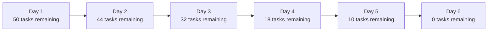
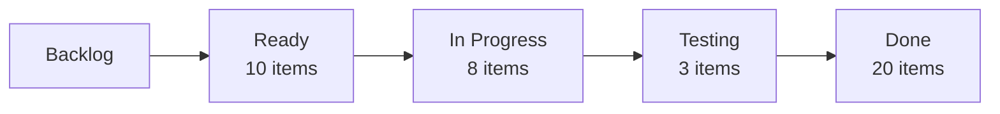

## 13.3 Dashboards, Burn Charts, and Cumulative Flow Diagrams

Visual data representations are an essential aspect of the Measurement Performance Domain. They enable project managers, teams, and stakeholders to quickly assess performance, progress, and potential bottlenecks. Three of the most commonly utilized visual tools are Dashboards, Burn Charts, and Cumulative Flow Diagrams (CFDs). In this section, we will explore each tool’s primary purpose, distinguish their ideal use cases, and illustrate how you can integrate these tools to gain deeper insights across both predictive and agile project environments. 

Unlike large textual reports, these visual tools present data succinctly—leading to more cohesive decision-making and greater transparency. Whether you are driving a fully agile team, working in a predictive (waterfall) setting, or operating in a hybrid environment, understanding these tools can elevate how you plan, measure, and deliver project outcomes.

### The Value of Visual Data in Project Management

Before spotlighting each individual technique, it is worth noting why graphics and data visualization matter in project management:

• Rapid comprehension: Visual indicators shorten the time needed to interpret large volumes of data.  
• Engaging communication: Charts and diagrams can spark meaningful dialogue with stakeholders.  
• Ongoing performance tracking: You can identify anomalies or Improvement opportunities early.  
• Informed decision-making: Trends are clearer, giving you advanced warning of potential issues.

Such benefits can be realized whether your project is short or long in duration, large or small in scale, or reliant on manual data collection or sophisticated tool suites.

---

## Dashboards

A dashboard is a consolidated interface that displays key performance indicators (KPIs), metrics, and data points relevant to a specific project or set of projects. Dashboards can range from simple spreadsheets with color-coded cells to advanced, real-time business intelligence systems.

### Purpose and Composition

Dashboards typically show:

• Task progress (e.g., percentage complete)  
• Budget status and burn rate  
• Schedule performance metrics (e.g., behind, on track, ahead)  
• Risk heat maps and issue statuses  
• Quality metrics, defect counts, or test coverage  
• Team member availability and capacity  
• Earned value metrics such as Cost Performance Index (CPI) or Schedule Performance Index (SPI)  

Dashboards are unique in their flexibility. They can be tailored to stakeholder requirements, updated dynamically or manually, and designed to highlight the metrics that matter most. For instance, an executive stakeholder might care primarily about a project’s overall ROI, while a functional manager might prioritize resource utilization details.

### Types of Dashboards

1. **Operational Dashboards**  
   • Provide daily or near-real-time insights into project tasks, resource assignments, and bottlenecks.  
   • Often used by project managers and team leads for tactical decisions.

2. **Strategic Dashboards**  
   • Focuses on alignment with organizational mandates, portfolio performance, and strategic goals.  
   • Frequently used by senior leadership to decide whether to reallocate resources or prioritize specific deliverables.

3. **Analytical Dashboards**  
   • Delve deeper into historical data, trends, and forecasting models.  
   • Facilitate scenario planning by offering insights into “what-if” scenarios.

### Key Considerations in Dashboard Design

• **Relevance**: Include only the metrics that your stakeholders find valuable. Clutter diminishes clarity.  
• **Real-time vs. Manual Updates**: Automated data retrieval ensures timely updates, but manual or partially automated methods may suffice for smaller projects.  
• **Color-coding and Visual Hierarchy**: Use color sparingly to highlight urgent matters or critical KPIs.  
• **Accessibility and Usability**: Ensure dashboards are easy to navigate, with minimal training needed.  

### Example: Resource Utilization Dashboard

Imagine managing a cross-functional software implementation project. Your dashboard might display:

• Current tasks’ statuses (In Progress, Blocked, Completed)  
• Resource capacity allocations (e.g., Team Member A: 80%, Team Member B: 90%)  
• Weekly burn rate of allocated budget  
• Top 3 project risks with red/yellow/green (RYG) status  

This single-page view enables daily check-ins to see if you need to shift workloads or re-estimate tasks, identifying any risk of cost or schedule overruns early in the project lifecycle.

---

## Burn Charts

Burn charts are staples in agile and iterative environments, used to reflect how much work remains (or has been completed) over a designated time period. They provide real-time insight into team velocity and progress, promoting transparency for both the team and stakeholders. 

Although often associated with Scrum, burn charts can be highly effective in other environments, including Kanban or even traditional settings with milestone-based tracking.

### Types of Burn Charts

#### Burn-Down Charts

A burn-down chart typically shows how much work remains (e.g., story points, tasks, or hours) on the y-axis, with time displayed on the x-axis. The line descends as tasks or story points are completed, ideally reaching zero by the close of a sprint or project phase.

##### Reading a Burn-Down Chart
• **Ideal Line**: The straight diagonal line from the top-left corner (total tasks at the start) to the bottom-right corner (zero tasks left).  
• **Actual Progress Line**: The day-by-day or iteration-by-iteration points plotting how much work remains.  
• **Interpretation**: If the actual progress line is above the ideal line, the team may be behind schedule. If it is below, they may be ahead.

#### Burn-Up Charts

A burn-up chart focuses on work completed, rather than work remaining. The y-axis typically represents the total amount of work. The completed work line moves upward over time until it reaches the goal (the total scope). An “ideal progress” line may also be overlaid for comparison.

##### Reading a Burn-Up Chart
• **Completed Work Line**: As tasks or story points are done, the line inches closer to the total scope.  
• **Scope Line**: Shows the overall scope or total amount of work. If scope changes, that line shifts upward or downward.  
• **Interpretation**: If the completed work line flattens while the scope line remains constant, the team might be stuck, or velocity has slowed.

### Practical Mermaid Example for a Burn-Down Flow

Below is a simplified flow diagram in Mermaid syntax demonstrating how work can “burn down” visually over several days. (Note that Mermaid does not render line charts in the same way typical burn charts do, but it can still illustrate sequential states of completion.)

The visual indicates a gradual progression from 50 tasks down to zero, aligning with a target completion date.

### Best Practices and Pitfalls for Burn Charts

1. **Accurate Estimation**: Story points or task-hour estimates must be realistic to create meaningful charts.  
2. **Regular Updates**: In an agile environment, daily or per-iteration updates help track progress accurately.  
3. **Scope Creep Monitoring**: If new tasks are continuously added without resetting the baseline, the chart can appear misleading.  
4. **Team Communication**: Use daily standups or checkpoint meetings to verify that the burn chart aligns with actual progress.

---

## Cumulative Flow Diagrams (CFDs)

While burn charts focus on how fast tasks are being completed, Cumulative Flow Diagrams (CFDs) present a holistic view of tasks across different stages of workflow—particularly in Kanban or continuous flow systems. A CFD plots the cumulative count of tasks in each stage over time (e.g., ‘To Do,’ ‘In Progress,’ ‘Testing,’ ‘Done’). This visualization makes it easier to spot bottlenecks and measure throughput.

### Key Components of a Cumulative Flow Diagram

• **X-axis**: Represents time (days, weeks, or iterations).  
• **Y-axis**: Represents the total number of tasks or work items.  
• **Colored Bands**: Each color in the diagram usually correlates to a workflow state (e.g., purple band for “To Do,” blue band for “In Progress,” green band for “Done,” etc.). The thickness of each band at any point in time reflects how many tasks currently occupy that state.

### How to Read a Cumulative Flow Diagram

1. **Flow Consistency**: If lines spread out or converge unpredictably, it indicates variation in flow. A stable system typically has parallel lines or minimal expansions/retractions.  
2. **Bottlenecks**: If the band for “In Progress” expands significantly over time, it means tasks are accumulating in that stage, suggesting a bottleneck.  
3. **Lead Time & Cycle Time**: The horizontal distance between when an item enters the workflow and when it is completed can be gleaned from the CFD.  
4. **Throughput**: The slope of the top “Done” line can help measure the team’s throughput (completed work rate) over time.

### Example Mermaid Diagram for Cumulative Flow

While it is challenging to display a fully accurate CFD using Mermaid, we can approximate the idea of multiple steps in a workflow:

Each node represents a different workflow state. In a CFD line chart, these states would be “stacked” over time. Monitoring how items move from one state to another reveals constraints or flow inefficiencies.

### Interpreting a CFD in a Real-World Scenario

Consider you have a marketing project where your team creates campaign assets (banners, social media posts, blog articles, etc.):

• “Backlog” might represent ideas or requests awaiting approval.  
• “Ready” indicates items that have gone through initial vetting and are ready for creation.  
• “In Progress” covers tasks actively being worked on by graphic designers or copywriters.  
• “Testing” could represent a review step by brand managers or quality assurance.  
• “Done” is the final approved stage, ready for public release or scheduling.

If you spot a rising thickness in the “Testing” area, you might deduce that reviews are not happening quickly enough or your QA resources are constrained. By addressing that issue (perhaps assigning more reviewers), you can maintain a stable, continuous flow and reduce overall lead times.

---

## Combining or Comparing Dashboards, Burn Charts, and CFDs

In many modern project environments, especially those leveraging a hybrid approach, you might use all three visualizations simultaneously. For example:

• **Dashboards** provide a high-level snapshot for stakeholders, incorporating cost, risk, and schedule aspects.  
• **Burn Charts** assist teams with achieving sprint goals or short-term milestones, offering daily or weekly progress updates.  
• **CFDs** illustrate how efficiently tasks flow across stages, highlighting where improvements to process or resource distribution are needed.

A strategic project manager understands at which level of detail each of these tools is needed. Often, the same underlying data (e.g., tasks in a backlog, tasks completed, effort hours, etc.) can be fed into different charts, each offering a distinct lens through which to view performance.

---

## Practical Examples and Case Studies

### Case Study 1: Hybrid Scrum-Kanban Implementation

A software development firm is building an enterprise mobile application. The team uses:

• **Burn-Down Chart in Two-Week Sprints**: The developers work in sprints, tracking user story completion with a burn-down chart. The Product Owner uses daily updates to see if the sprint goal is still feasible.  
• **Cumulative Flow Diagram**: Parallel to the scrum process, the team uses Kanban practices to manage feature deployment tasks in the release pipeline (e.g., “Deployment Prep,” “Integration Testing,” “Security Review,” “Production Release”). The CFD helps them identify if security reviews become a bottleneck.  
• **Executive Dashboard**: Management wants to see costs, scope changes, and high-level progress. The project manager updates an integrated Power BI dashboard weekly, featuring top risks, budget consumption, and overall milestone health.

### Case Study 2: Marketing Campaign with a Predictive Approach

A marketing department runs a three-month campaign launch plan with a predictive (waterfall) schedule for each phase: creative ideation, production, approval, and launch. They use a simple excel-based **Dashboard** to track actuals vs. planned tasks and budget. They do not maintain a fully iterative approach, but weekly they use a form of a **Burn-Up Chart** to see how much content has been produced against the overall plan, which is broken down into deliverables (videos, social media posts, press releases). By regularly updating the burn-up chart, the marketing manager can anticipate if the final deliverables will be ready before the scheduled launch date.

---

## Creating and Maintaining Your Visual Tools

### Data Sources

• **Project Management Information Systems (PMIS)**: Tools like Microsoft Project, Jira, Trello, Asana, or Monday.com often have built-in dashboards, burn chart, and CFD capabilities.  
• **Manual Spreadsheets**: For smaller projects, manual data entry into a spreadsheet can suffice.  
• **Automated Integrations**: Connect Git repositories, time-tracking tools, or issue management systems for real-time updates.

### Updating Cadences

• **Daily**: Agile teams often update burn charts daily in tandem with daily stand-ups.  
• **Weekly or Monthly**: Dashboard updates might be scheduled to match the frequency of stakeholder reporting or governance reviews.  
• **On-Demand**: Automated systems can be refreshed at any time for immediate insights.

### Common Challenges

1. **Data Accuracy**: Garbage in, garbage out. If tasks are not updated promptly or consistently, visuals lose their value.  
2. **Over-Engineering**: Creating too many specialized charts can overwhelm the team and stakeholders.  
3. **Misinterpretation**: Without proper training, stakeholders might draw incorrect conclusions from the visual data.  
4. **Resistance to Transparency**: Some team members or managers may fear that “performance charts” could be used punitively.

### Tips for Successful Implementation

• **Educate Stakeholders**: Offer short training sessions so everyone can read, interpret, and trust the charts.  
• **Tailor and Evolve**: Start simple. Over time, refine or add metrics as your project matures.  
• **Highlight Achievements**: Use positive trends to celebrate team wins, reinforcing the value of data-driven approaches.  
• **Focus on Continuous Improvement**: Track metrics not just to judge performance, but to identify process weaknesses and collaborate on solutions.

---

## Using These Tools in Relation to the PMBOK® Guide Seventh Edition

In the Seventh Edition of the PMBOK® Guide, the focus shifts toward principles and performance domains over strict processes. Visual measurement tools align seamlessly with multiple Performance Domains:

• **Stakeholder Performance Domain**: Dashboards and charts keep stakeholders informed and engaged.  
• **Team Performance Domain**: Burn charts reinforce team commitment to achieving iteration goals.  
• **Delivery Performance Domain**: CFDs promote focus on throughput and continuous flow of value to customers.  
• **Measurement Performance Domain**: All these tools—dashboards, burn charts, CFDs—enhance real-time measurement, enabling better decision-making.  

By pairing these visual techniques with risk management, refined governance, and stakeholder collaboration, you create a feedback-rich ecosystem that drives predictability, quality, and ultimately, project success.

---

## Further Reading and References

• “Agile Practice Guide” by Project Management Institute: offers deeper insights into burn charts and flow metrics.  
• “Essential Kanban Condensed” by David J. Anderson and Andy Carmichael: discusses Kanban metrics, including CFDs.  
• “Practical Tableau” by Ryan Sleeper: for those looking to design advanced dashboards with real-time data.  
• PMIstandards+: curated content on measurement best practices and how to tailor them to specific industries.  

Whether you prefer advanced software tools or approachable spreadsheets, investing in visual measurement solutions pays off through enhanced clarity, alignment, and visibility. These frameworks invite continuous learning and adaptation, setting you and your team on a trajectory of improved planning, risk management, and value delivery.

---

## Test Your Knowledge on Dashboards, Burn Charts, and CFDs



### Which of the following best describes the primary purpose of a project dashboard?

- [ ] To eliminate the need for daily status meetings
- [x] To provide a consolidated overview of key metrics for quick decision-making
- [ ] To replace individual task lists and to-do systems
- [ ] To hide bad news from executives until the end of the project

> **Explanation:** Dashboards offer a concise, data-driven view of core metrics such as schedule, cost, and risk. They enable managers and stakeholders to make timely decisions based on clear, high-level insights.

### In a typical burn-down chart, the y-axis most commonly represents:

- [x] Remaining work (e.g., tasks, hours, or story points)
- [ ] Cumulative tasks completed in each sprint
- [ ] Total velocity achieved by the team
- [ ] Individual team member productivity for performance reviews

> **Explanation:** Burn-down charts measure remaining work over time. As items are completed, the line “burns down” toward zero.

### When reviewing a burn-up chart, which metric is visually tracked moving upward?

- [ ] Remaining budget
- [ ] Total tasks or story points not yet started
- [x] Completed work (e.g., story points delivered)
- [ ] Defect counts that remain open

> **Explanation:** A burn-up chart focuses on the work completed over time. The line moves upward as tasks are finished, approaching the total scope line.

### Cumulative Flow Diagrams (CFDs) are particularly useful in:

- [ ] Predictive, waterfall environments with rigid milestones
- [ ] Project scheduling for Gantt charts
- [x] Kanban and flow-based systems for visualizing work-in-progress
- [ ] Traditional hierarchical status reporting

> **Explanation:** CFDs highlight the distribution of tasks across workflow states in a Kanban or continuous flow setting, helping to identify bottlenecks and manage WIP (work in progress).

### Which statement accurately describes a burn-down vs. a burn-up chart?

- [ ] Burn-down is best for large-scale projects; burn-up is best for smaller tasks
- [x] Burn-down tracks remaining work; burn-up tracks completed work
- [ ] Burn-down focuses on cost; burn-up focuses on schedule
- [ ] Both charts are identical in how data is plotted

> **Explanation:** The fundamental difference is in orientation. Burn-down charts show work yet to be completed, while burn-up charts illustrate cumulative work completed.

### One key advantage of dashboards over traditional textual reports is:

- [x] Quick visual comprehension of essential metrics
- [ ] Full elimination of the need for stakeholder communication
- [ ] More complicated data structures and advanced programming
- [ ] Restricting data access to management only

> **Explanation:** Dashboards allow stakeholders to quickly process large sets of data. This leads to efficient decision-making and fosters transparency.

### A critical pitfall when using these visual tools is:

- [ ] Ensuring that the team is aware of the charts
- [x] Inaccurate or inconsistent data updating
- [ ] Using software to automate chart creation
- [ ] Showing them to senior management too often

> **Explanation:** Even the most well-designed charts lose value if updates are infrequent, inconsistent, or inaccurate, misleading the entire project team.

### What does it generally indicate if the “In Progress” band in a CFD keeps expanding over time?

- [x] A potential bottleneck in the workflow
- [ ] The team is completing tasks faster than expected
- [ ] Scope is decreasing
- [ ] The backlog is not prioritized

> **Explanation:** Excessive accumulation in “In Progress” stages reveals that tasks are not moving downstream quickly, signifying a bottleneck in the process.

### When analyzing a burn-down chart that stays consistently above the ideal trend line:

- [ ] The project is on schedule or possibly ahead
- [ ] The data is definitely incorrect
- [x] The team may be behind the planned schedule
- [ ] The project scope has almost certainly increased

> **Explanation:** If the actual progress line sits above the ideal line, the team is removing less work than planned, suggesting a lag in progress.

### True or False: Dashboards, Burn Charts, and CFDs are exclusively applicable in agile methodologies.

- [x] True
- [ ] False

> **Explanation:** While these tools are widely used in agile, they can also add value in traditional or hybrid settings by improving visibility and measurement. The statement is false. (Correct answer: False)



---

## PMP Mastery: 1500+ Hard Mock Exams with Full Explanations 

Looking to crush the PMP exam with confidence? Dive deep into 6 rigorous mock exams totaling 1500+ advanced-level questions, each accompanied by clear, step-by-step explanations. Hone your test-taking strategies, master complex topics, and build the resilience you need on exam day. Perfect for serious PMs aiming beyond fundamentals.  

Enroll now:  
[PMP Mastery: 1500+ Hard Mock Exams with Exceptional Clarity & Full Explanations](https://www.udemy.com/course/pmp-2025/?referralCode=CF83A54BC86BE27F9AFE)

_Disclaimer: This course is not endorsed by or affiliated with the PMI examination authority. All content is provided purely for educational and preparatory purposes._
