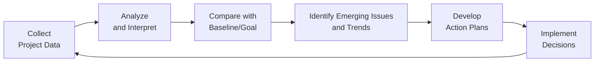
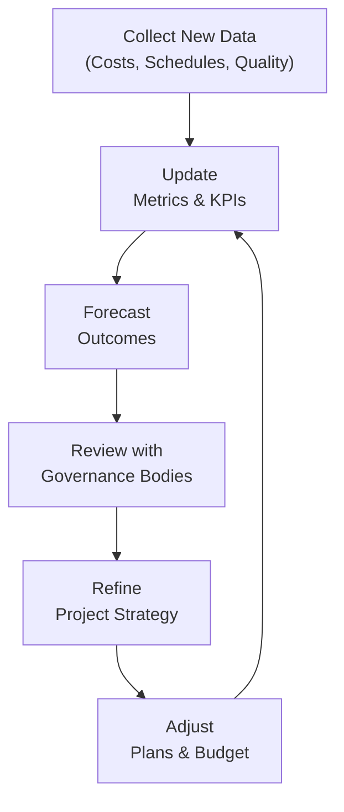

## 13.4 Data-Driven Decision Making and Forecasting

Data-driven decision making and forecasting are crucial for managing uncertainty and planning for the future. In the context of project management, decisions guided by reliable data can help you see problems before they escalate, adjust expectations realistically, and maintain clear visibility into project progress. In traditional and agile projects alike, you will routinely gather and interpret metrics—such as cost performance, schedule performance, quality metrics, and risk indicators—in order to shape strategies for your upcoming phases. By analyzing trends, refining forecasts, and making evidence-based course corrections, project managers can drive better outcomes, reduce risk, and optimize resource usage.

This section explores how to interpret metrics, proactively account for emerging issues, and refine future plans based on data. It ties together the measurement concepts and tools often discussed in earlier chapters—such as Earned Value Management (Chapter 13.2) or risk metrics (Chapter 14)—and offers guidance on when and how to act on new insights. Whether your project follows a predictive, agile, or hybrid approach, data-driven decision making fosters transparency, proactive management, and higher stakeholder confidence.

  
Introduction  
------------
Data is the cornerstone of informed decision making in project management. Without credible information on project progress and performance, teams might rely on intuition or incomplete anecdotal evidence. Over time, such an approach can escalate cost overruns, schedule delays, low product quality, and decreased stakeholder satisfaction.

Forecasters and analysts within project teams use a variety of statistical and analytical techniques to interpret data. Once you see a trend emerging—for example, a dip in productivity or an unexpected risk event—proactive data-driven adjustments can keep your project aligned with expected outcomes. By focusing on actionable information and real-time indicators, you build a more resilient team and project environment.

Why Data-Driven Decision Making Matters  
---------------------------------------
• Improved Accuracy: Data-based insights are far more reliable than guesses or gut feelings.  
• Timely Intervention: Recognizing underperformance early allows immediate corrective or preventive actions.  
• Reduced Bias: Decisions guided by metrics and objectively analyzed trends reduce individual biases and personal opinions.  
• Stakeholder Confidence: Demonstrating that the project’s decisions are grounded in evidence boosts stakeholder trust and fulfills governance requirements.  
• Strategic Alignment: Tying project performance metrics to long-term organizational goals ensures that resources are allocated effectively to projects with the highest strategic value.

Key Metrics in Data-Driven Decision Making  
------------------------------------------
Data-driven decision making requires you to formulate specific and measurable metrics. While Chapter 13.1 provides an overarching view on establishing KPIs and metrics, several commonly used project metrics deserve additional attention here:

• Earned Value Metrics:  
  – Planned Value (PV)  
  – Earned Value (EV)  
  – Actual Cost (AC)  
  – Cost Performance Index (CPI) and Schedule Performance Index (SPI)  
  – Estimate at Completion (EAC)  

• Schedule Metrics:  
  – Critical Path Analysis  
  – Float or Slack  
  – Schedule Variance  

• Quality Metrics:  
  – Defect Density  
  – Failed Test Cases vs. Total Test Cases  
  – Rework and Scrap Rates  

• Risk Metrics:  
  – Exposure Index (Likelihood × Impact)  
  – Frequency of Emerging Risks  
  – Issues vs. Risks Ratio  

• Agile-Specific Metrics:  
  – Team Velocity and Burnup/Burndown Charts  
  – Cycle Time and Lead Time (Kanban)  
  – Throughput (Number of Completed Items within a Sprint)  

Analyzing metrics is rarely a one-time activity. Effective projects build a continuous “measure-and-adapt” cycle, reevaluating and refining metrics in light of real project conditions.  

Forecasting Techniques for Project Management  
--------------------------------------------
Forecasting uses historical and current performance data to predict future events, trends, or outcomes. Below are several forecasting techniques commonly used in projects:

Trend Extrapolation  
: Involves projecting current data trends—or patterns of change—into the future. This can be based on short-term or long-term trending. For instance, if the project’s velocity indicates an average of 50 story points per iteration, future forecasts might assume a similar pace.

Moving Averages  
: A technique where you compute the average of a certain number of past data points (e.g., weekly performance) to smooth out short-term fluctuations. Moving averages help in identifying seasonal trends or cyclical behaviors.

Earned Value Analysis (EVA)  
: EVA-based forecasting relies on performance indices such as CPI (Cost Performance Index) and SPI (Schedule Performance Index). For example, if you want to forecast the total project cost at completion under current cost performance conditions, you can use:


\text{EAC} = \frac{\text{BAC}}{\text{CPI}}


where:  
• EAC = Estimate at Completion  
• BAC = Budget at Completion (the originally planned total budget)  
• CPI = Cost Performance Index (EV ÷ AC)  

Regression Analysis  
: Statistical modeling used to identify relationships between variables. You might use regression to see how training hours correlate with product defect rates or how a certain product backlog refinement technique influences user acceptance test (UAT) success.

Adaptive Forecasting in Agile  
: Techniques like backlog refinement, burnup or burndown charts, and velocity-based planning leverage real-time performance data and adjust the plan incrementally. Forecasting in agile projects is typically time-boxed and reexamined every iteration.

  
Realigning with Strategic Objectives  
------------------------------------
Data-driven decisions should tie neatly back to organizational strategy and business objectives. As you interpret data and forecast potential directions, continually evaluate the alignment of your decisions with the larger context:

• Revisit the Project Charter: Confirm that the project purpose, objectives, and success criteria remain relevant.  
• Engage Stakeholders: Validate that the data used for decisions and forecasts matches stakeholder expectations. In agile scenarios, frequent feedback loops are integral.  
• Discuss with the PMO/Steering Committee: Some forecast-driven changes may require higher-level approvals, especially if they involve budget or resource realocations.  
• Update the Business Case: If data signals that the fundamental feasibility or ROI of the project is at risk, senior leadership should be informed so they can decide on next steps.  

  
The Iterative Cycle of Data Collection and Analysis  
---------------------------------------------------
A structured cycle comprises collecting data, analyzing patterns, comparing them with baselines, and taking corrective or preventive plans. The diagram below illustrates the iterative cycle used in data-driven decision making.  

• Collect Project Data: Integrate multiple sources—status reports, time sheets, defect logs, and risk registers—to ensure holistic coverage.  
• Analyze and Interpret: Transform raw data into meaningful insights. Techniques include correlation analysis, trend charts, or root cause techniques.  
• Compare with Baseline/Goal: Benchmark actual results against the project plan or relevant organizational standards.  
• Identify Emerging Issues and Trends: Proactively look for red flags or positive patterns (e.g., cost saving initiatives).  
• Develop Action Plans: Prioritize tasks, revise resource allocations, or call for additional risk response measures.  
• Implement Decisions: Execute adjustments in an agile or predictive manner.  
• Repeat Continuously: Keep this loop alive throughout the project.  

  
Case Study: A Global Software Deployment  
----------------------------------------
Consider a global software deployment project with multiple agile teams spread across different time zones. Early in the project, the team identifies throughput as a crucial metric. After four sprints, the throughput is averaging 22 user stories completed per sprint, lower than the anticipated 30. Delays in user acceptance testing and the inability to prioritize tasks quickly are discovered as root causes.

By analyzing throughput data and cross-referencing with defect density metrics, the project manager notices that the combined effect of multiple environment configurations is slowing down test cycles. Because of these data-driven insights, management decides to introduce a new test automation framework and allocate two additional testers. Within two sprints, the throughput increases to 29 stories per sprint. Forecasting suggests that by sustaining current velocity, the team can meet the overall release window with a buffer equal to about 10% of the originally planned schedule, thereby mitigating risk.

This example highlights how measuring performance and analyzing root causes can shape concrete decisions that keep the project aligned with customer expectations and strategic goals.

Accountability and Governance  
-----------------------------
Data-driven decision making must align with governance structures established for the project or within your organization. Some critical steps to ensure accountability:

• Document Decisions: Keep a record in a change log or decision register. Make sure to articulate the exact rationale (“CPI below 0.9 for three consecutive months”).  
• Engage Sponsors: Complex decisions that alter cost or scope must involve project sponsors and relevant governance bodies.  
• Communicate Thoroughly: Ensure your communication plan (Chapter 16) is updated to reflect data-driven changes. Provide stakeholders with dashboards or real-time metrics for better transparency.  
• Conduct Reviews: Periodic reviews with the steering committee or PMO are essential for larger strategic adjustments.  

  
Common Pitfalls and How to Avoid Them  
-------------------------------------
• Cherry-Picking Data: Relying on selective data points to justify a preconceived decision or ignoring relevant negative trends. A robust approach includes analyzing all relevant datasets, even if some are contrary to the initial hypothesis.  
• Over-Reliance on Single Metrics: No single metric can paint a complete picture. Combine multiple indicators—such as cost, schedule, and quality—to arrive at balanced conclusions.  
• Lack of Timely Data: Old or infrequent data can render the forecasting stale and inaccurate. In agile settings, short feedback loops mitigate this risk.  
• Tribal Knowledge over Hard Data: Always combine expert judgment with quantitative metrics, ensuring neither approach completely overshadows the other.  
• Not Accounting for Complexity: Complex environments or changing demands can transform data patterns rapidly. Tailoring your metrics (Chapter 5.6) is critical for relevant insights.  

  
Tools and Technologies  
----------------------
Multiple tools can facilitate a robust data-driven and forecasting approach:

• Business Intelligence (BI) Platforms: Allow data visualization, dashboards, and automated reporting. Tools such as Power BI, Tableau, or Qlik help communicate complex findings.  
• Specialized PMIS Software: Tools like Microsoft Project, Primavera P6, Jira, or Azure DevOps provide integrated dashboards for cost, schedule, risk, and more.  
• Agile Management Tools: Kanban boards, burnup charts, and velocity tracking available in Trello, Jira, or Rally.  
• Statistical Analysis Tools: R, Python, or Minitab for advanced modeling and regression analysis.  
• Cloud-Based Collaboration: Real-time analytics and shared dashboards enable distributed teams to collaborate on data-driven insights.  

  
Culture of Continuous Improvement  
---------------------------------
A culture committed to ongoing learning expands the benefits of data-driven decision making. Encourage your team to:

• Analyze Performance Regularly: Get the entire team together to interpret data, brainstorm improvements, and refine metrics.  
• Reward Questions: Celebrate individuals who question trends or suggest alternative root causes.  
• Proactively Scan for New Data Sources: Continually expand your sources to include user feedback, environmental scans, and competitor intelligence.  
• Revisit Forecasts: Validate your forecast after each milestone or iteration. Adjust them quickly if new factors are discovered (e.g., a major scope change).  

  
Refining Future Agendas Based on Data  
-------------------------------------
Data-driven lessons should feed into your future agendas and strategic planning. Examples include:

Adaptive Roadmaps  
: Regularly update release or delivery roadmaps based on performance to date.  

Budgeting Adjustments  
: If the data indicates that certain project elements require additional resources, adjust your budget early before an unplanned overrun becomes inevitable.  

Stakeholder Communications  
: Use data to tailor discussions. For instance, if you notice a pattern in frequent scope changes, plan more interactive stakeholder sessions.  

Talent Management  
: If critical skills are consistently missing, project data may justify investing in staff training or securing external expertise.  

Evolving Governance Policies  
: If recurring issues with vendor compliance surface, update vendor selection and oversight processes.  

  
Diagram: Integrating Forecasts into Project Strategy  
----------------------------------------------------
Below is a simplified visual showing how forecasts feed directly into project governance and strategic discussions:

This cycle of collecting, forecasting, reviewing, refining, and adjusting underscores the data-driven approach essential for continuous improvement and strategic integration.

Conclusion  
----------
Data-driven decision making, complemented by precise forecasting methods, is crucial in modern project management. By systematically collecting and analyzing metrics—ranging from earned value data to agile velocity charts—you build a robust feedback loop that informs each stage of the project. Transparent metrics bolster stakeholder confidence, and proactive adjustments deter cost overruns, schedule slippages, and subpar quality outcomes.  

Foster a workplace culture of continuous improvement and open communication. Encourage team members to challenge assumptions and highlight anomalies, ensuring that data becomes a shared language for improvement rather than a siloed or mistrusted entity. Above all, maintain alignment with the organization’s strategic objectives. This synergy between data-driven insights and business goals will guide you to more consistent performance and successful project delivery.  

For further exploration of the advanced techniques, consult:  
• Chapter 13.2 for deeper insights into Earned Value Management.  
• Chapter 14 for comprehensive approaches to risk-based forecasting.  
• Chapter 42 for an extended bibliography on emerging data analytics tools and project management practices.  

  
## Test Your Knowledge: Data-Driven Forecasting Essentials



### As a project manager, how can data-driven decision making help address cost overruns early?

- [x] By identifying unfavorable cost performance trends in real time and allowing timely corrective actions.  
- [ ] By avoiding any communication with stakeholders until a trend is confirmed.  
- [ ] By delegating all cost control matters to senior management only.  
- [ ] By assuming that cost overruns will resolve themselves when schedule also improves.  

> **Explanation:** Monitoring cost metrics like CPI and AC regularly helps you spot early signals of cost overrun, enabling swift corrective measures such as resource reallocation or scope adjustments.

### Which statement best describes the forecasting approach known as trend extrapolation?

- [x] It uses historical performance patterns to project future outcomes.  
- [ ] It relies exclusively on expert judgment to create cost baselines.  
- [ ] It is a method used solely in agile retrospectives.  
- [ ] It calculates cost by dividing the budget by the total defects discovered.  

> **Explanation:** Trend extrapolation extends current data trends into future periods, drawing logical inferences based on how metrics have changed up to the present.

### In earned value management, which formula represents Estimate at Completion (EAC) assuming current cost performance remains the same?

- [x] EAC = BAC / CPI  
- [ ] CPI = BAC / AC  
- [ ] EAC = PV × SPI  
- [ ] BAC = EAC - AC  

> **Explanation:** EAC = BAC / CPI means that if the CPI (EV ÷ AC) is expected to remain constant, the project’s final budget forecast is found by dividing the original budget at completion by the CPI.

### Which of the following is most likely to happen if you focus on only one metric to assess project health?

- [x] You may overlook issues in other areas such as quality or resource allocation.  
- [ ] You will gain a complete view of the project’s success with minimal effort.  
- [ ] Stakeholders become more engaged because they have fewer metrics to follow.  
- [ ] You can reduce the need for frequent reporting.  

> **Explanation:** Single-metric focus rarely provides a holistic perspective. The project could appear fine on cost metrics yet be failing on schedule or quality.

### Why is regular data collection particularly critical in agile projects?

- [x] Because agile thrives on quick feedback loops to inform iteration planning.  
- [ ] Because agile projects do not use actual cost data at all.  
- [ ] Because it eliminates the need for stakeholder communication.  
- [ ] Because agile encourages disregarding any form of data in favor of guesses.  

> **Explanation:** Frequent measurements in agile methods inform iteration planning, reveal bottlenecks, and drive continuous improvement.  

  
### A local government construction project discovered that the schedule CPI was underperforming. Which data-driven step should the project manager take first?

- [x] Investigate root causes behind the lower CPI (e.g., delayed deliveries, resource constraints) before forming a mitigation plan.  
- [ ] Immediately fire the vendors without further analysis to eliminate potential delays.  
- [ ] Double the workforce without checking cost implications.  
- [ ] Stop collecting data until the CPI returns to expected values.  

> **Explanation:** Before any corrective action, the project manager must analyze why the performance is below expectations.

### Which type of tool best supports real-time dashboards and analytical visualizations for project performance?

- [x] Business Intelligence (BI) platforms (e.g., Power BI, Tableau)  
- [ ] Basic spreadsheet software with no automation  
- [ ] Manual status reports only  
- [ ] Web browsers with no specialized plugins  

> **Explanation:** BI platforms are designed to synthesize multiple data sources into cohesive, actionable dashboards that facilitate rapid decision making.

### What is a primary risk in cherry-picking data to justify decisions?

- [x] Biased conclusions may be drawn, masking real issues and hindering project success.  
- [ ] Data is not fully utilized, but decisions are always more accurate.  
- [ ] Stakeholders become more convinced of the project manager’s leadership skills.  
- [ ] Data trends never correlate with actual project outcomes.  

> **Explanation:** Focusing on selective data while ignoring contradictory evidence can result in skewed forecasts and missed warning signs.

### How can data-driven forecasting align projects with strategic business objectives?

- [x] By continuously refining forecasts and ensuring they support long-term capital planning and ROI goals.  
- [ ] By disregarding the original charter if cost indexes remain stable.  
- [ ] By never adjusting schedules once the baseline is established.  
- [ ] By punishing team members who collect negative data.  

> **Explanation:** Data-driven forecasts help leadership adjust portfolios and budgets to optimize return on investment, thus aligning project execution with organizational strategy.

### True or False: Data-driven decision making eliminates the need for stakeholder engagement throughout the project.

- [x] True  
- [ ] False  

> **Explanation:** This statement is false. Data-driven decision making does not replace stakeholder engagement. On the contrary, it enhances transparency and fosters more informed discussions with stakeholders.



## PMP Mastery: 1500+ Hard Mock Exams with Full Explanations 

Looking to crush the PMP exam with confidence? Dive deep into 6 rigorous mock exams totaling 1500+ advanced-level questions, each accompanied by clear, step-by-step explanations. Hone your test-taking strategies, master complex topics, and build the resilience you need on exam day. Perfect for serious PMs aiming beyond fundamentals.  

Enroll now:  
[PMP Mastery: 1500+ Hard Mock Exams with Exceptional Clarity & Full Explanations](https://www.udemy.com/course/pmp-2025/?referralCode=CF83A54BC86BE27F9AFE)

_Disclaimer: This course is not endorsed by or affiliated with the PMI examination authority. All content is provided purely for educational and preparatory purposes._
