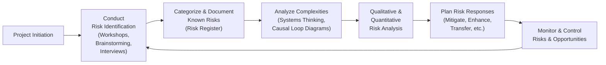

## 14.1 Identifying Risks, Uncertainties, and Complexities

Effective risk identification is at the heart of successful project management. Risk, uncertainty, and complexity collectively shape the environment in which projects are executed. Properly discovering these elements enables project teams to be proactive, anticipate problems, and seize new opportunities. This section explores practical techniques, workshop formats, and organized approaches for identifying and categorizing both known and unforeseen events that could impact project objectives.

### Understanding the Foundations of Risk, Uncertainty, and Complexity

Project “risk” can be thought of as any uncertain event or condition that, if it occurs, has a positive or negative effect on one or more project objectives. “Uncertainty” refers to the unknown factors in a project environment, which could be technical, situational, or even socio-political. “Complexity” arises from interdependencies, emergent behaviors, or large-scale, multifaceted systems that make outcomes more difficult to predict. 

Organizations often focus on threats—events that negatively impact cost, schedule, scope, or quality. However, recognizing opportunities is equally vital, as seizing beneficial events can enhance value and performance. 

### Key Principles in the Uncertainty Performance Domain

1. Acknowledge that projects are interwoven with uncertainty.  
2. Employ a flexible and adaptive mindset for dealing with unknowns.  
3. Use a combination of qualitative and quantitative methods.  
4. Ensure broad stakeholder involvement for comprehensive identification.  
5. Document and communicate uncertainties to maintain transparency.  

For more on the broader Uncertainty Performance Domain, refer to [Chapter 14: Uncertainty Performance Domain](#) in this guide, which details strategies for analyzing and responding to risks after they have been identified.

### Differentiating Risks, Issues, and Assumptions

Before delving into specific identification techniques, it is vital to distinguish among key concepts often confused during risk discussions:

• Risks are uncertain events or conditions that might affect the project if they occur.  
• Issues are events or conditions that are happening in the present and need immediate attention.  
• Assumptions are conditions believed to be true but that remain unverified or are beyond the project’s control.  

Maintaining clarity on these definitions ensures that management efforts are directed appropriately.

### Practical Approaches for Identifying Risks and Uncertainties

Identifying risks, uncertainties, and complexities typically involves gathering input from multiple sources, synthesizing information collaboratively, and updating documentation as the project evolves. The following approaches are commonly used:

#### 1. Brainstorming Sessions

Brainstorming remains a classic yet potent tool for generating creative ideas. Employ a structured or unstructured format:

• Structured brainstorming: The facilitator poses a series of pointed questions to participants, recording all ideas without debate or judgment.  
• Unstructured brainstorming: Participants share ideas freely, with the session taking shape organically.  

Best practices include encouraging open communication, ensuring psychological safety for all participants, and focusing on quantity before quality. After the initial idea generation, prioritize the identified risks for further analysis.

#### 2. Delphi Technique

The Delphi Technique is a systematic method that involves consulting a panel of experts anonymously through multiple rounds of questionnaires or surveys. Each round refines the group’s perspectives until consensus about likely risks or uncertainties is reached. This technique minimizes the impact of any single dominant personality and helps consolidate expert judgment for complex scenarios, especially where extensive industry knowledge is essential.

#### 3. Nominal Group Technique (NGT)

NGT is an organized approach that balances individual idea generation with collective prioritization. It typically follows these steps:

• Participants independently list potential risks.  
• Each participant shares one risk at a time, often displayed on a flip chart or shared screen.  
• Group discusses each risk for clarity (but not for debate at this stage).  
• Participants vote or rank the risks, resulting in a prioritized list.  

NGT ensures equal contribution by all group members, preventing overshadowing by more outspoken participants.

#### 4. Interviews and Expert Judgments

In one-on-one or small-group interviews, project leaders gather specific insights about risk sources. Subject Matter Experts (SMEs) may illuminate deeper technical or contextual aspects of the project that are not readily apparent to the general team. Incorporating different perspectives—from sponsors, end users, business analysts, and external vendors—offers a richer picture of potential threats and uncertainties.

#### 5. Checklists and Historical Data

Checklists, especially those derived from past projects or organizational process assets (OPAs), are frequently used. They serve as a starting point to ensure no major risk category is overlooked. Examples include:

• Common project risk checklists (technical, operational, external, financial).  
• Regulatory compliance checklists (environmental, legal, health and safety).  
• Lessons learned repositories.  

While useful as prompts, checklists should not substitute for exploration of novel or unique risks pertinent to the specific context of the current project.

#### 6. SWOT Analysis (Strengths, Weaknesses, Opportunities, Threats)

SWOT analysis can be leveraged to surface strategic risks and opportunities. By examining internal strengths and weaknesses, as well as external market and environmental factors, teams can generate robust conversations about improvement areas, potential vulnerabilities, and strategic positioning. This method can be particularly insightful in agile or hybrid projects, where rapid iteration demands constant reevaluation of the environment.

#### 7. Workshop Formats for Comprehensive Risk Discovery

Expertly facilitated workshops bring stakeholders together in a focused environment to delve into the project’s risk profile. Below are examples of workshop designs:

- Half-Day “Risk Blitz”:  
  • Agenda focuses on immediate threats, quick listing, and initial prioritization.  
  • Ideal for early project phases or new increments in agile contexts.

- Multi-Day Discovery Workshop:  
  • Agenda includes background presentations, breakout sessions, and group discussions.  
  • Use dynamic facilitation to encourage active participation, including collaborative exercises such as scenario building.

- Scenario Planning Sessions:  
  • Stakeholders explore alternative futures based on different assumptions (e.g., changes in market trends, regulatory shifts).  
  • Ensures forward-looking identification of uncertainties and complexities.

Workshops can also include specialized sessions for “Black Swan” events—rare situations with extreme impact. While challenging to predict, discussing potential extreme scenarios can help teams design resilience into their project plans.

### The Role of Complexity in Risk Identification

Complexity is not merely about the number of tasks but also about how tasks interrelate, the fluidity of dependencies, and the emergent properties that arise from multiple interacting elements. Complex projects often involve:

• High stakeholder diversity and conflicting interests.  
• Technological innovation with rapidly shifting requirements.  
• Global coordination (time zones, cultural nuances).  
• Unfamiliar or untested regulatory landscapes.  

In these cases, traditional linear tools (e.g., a simple risk register) may be insufficient. Instead, focusing on systems thinking and iterative re-evaluation helps teams navigate emergent complexities. Techniques such as causal loop diagrams and system flowcharts enable teams to visualize how one part of the project can cascade into another, uncovering hidden linkages that might amplify risks.

### Visualizing the Risk Identification Process

Below is a Mermaid diagram illustrating a simplified flow for identifying and documenting risks, uncertainties, and complexities:

In this simplified view, risk identification is an iterative process. Stakeholder feedback and updated information can circle back to add newly discovered risks or revise existing ones.

### Best Practices and Common Pitfalls

• Engage Stakeholders Early and Often  
  - Inviting a diverse set of perspectives leads to a well-rounded risk inventory.  
  - Pitfall to avoid: Overlooking frontline team members or end users, resulting in missing critical insights.

• Implement a Structured Process  
  - Consistency boosts both efficiency and reliability.  
  - Pitfall to avoid: Using overly rigid frameworks that discourage fresh thinking.

• Balance Documented Checklists with Freeform Methods  
  - Checklists ensure no major category is overlooked, while freeform methods stimulate creativity.  
  - Pitfall to avoid: Relying solely on checklists from past projects, thereby missing novel risks unique to the current endeavor.

• Leverage Both Qualitative and Quantitative Approaches  
  - Early identification can be qualitative, but eventually deepen the analysis with quantitative methods (e.g., Monte Carlo simulations).  
  - Pitfall to avoid: Failing to refine or update the risk register, leading to stagnant or outdated perspectives.

• Use Iterative Methods in Agile or Hybrid Projects  
  - Revisit the backlog and user stories frequently to identify new or evolving risks.  
  - Pitfall to avoid: Relying on a one-time risk identification step, particularly in rapidly changing environments.

### Using Probability × Impact for Basic Risk Exposure

A common formula used in project management is:

$$
\text{Risk Exposure} = \text{Probability} \times \text{Impact}
$$

Probability is the likelihood that an event will occur, and impact is the potential effect if the event takes place. While simplified, this formula helps create a baseline for prioritizing risks numerically, guiding which risks demand immediate action or monitoring.

### Real-World Example: Implementing a Risk Identification Workshop

Consider a multinational software rollout aimed at several offices with diverse cultural, legal, and operational backgrounds. The project sponsor convenes a three-day Risk Discovery Workshop, integrating participants from legal, IT infrastructure, regional management, and frontline support teams. Each day focuses on specific risk areas:

• Day 1: Brainstorm potential regulatory pitfalls, integration challenges with existing technology, and staff readiness.  
• Day 2: Conduct Delphi sessions with industry experts to validate or refine the list, discover hidden complexities around data privacy, and produce a ranked set of top risks.  
• Day 3: Finalize an initial risk register containing clear definitions. Responsible personnel are assigned to each risk, along with a schedule for ongoing review.  

This comprehensive, multi-perspective workshop fosters alignment and ensures that both macro-level and micro-level concerns are addressed quickly.

### Expanding Risk Identification into Hybrid and Agile Settings

Many projects operate under hybrid or fully agile approaches. In Scrum, for example, risk identification may be integrated into Sprint Planning sessions and further refined during Daily Stand-ups or Retrospectives. The fluid nature of agile cycles invites continuous scanning for emerging risks. By embedding risk discussions into recurring ceremonies, project teams stay vigilant, adjusting quickly to changes in scope or user feedback.

### References for Further Exploration

• Project Management Institute. (2021). A Guide to the Project Management Body of Knowledge (PMBOK® Guide) – Seventh Edition.  
• PMI Standards+: Online resource offering extended discussions on risk management practices and frameworks.  
• Institute of Risk Management (IRM): [https://www.theirm.org/](https://www.theirm.org/)  
• Rita Mulcahy’s PMP Exam Prep, covering strategies for risk identification.  
• Global Knowledge-based Repositories (company-specific OPAs and lessons learned databases).

---

## Test Your Knowledge: Risk Identification Essentials



### During a brainstorming session for risk identification, which of the following should be avoided?

- [ ] Inviting a diverse group of stakeholders  
- [ ] Focusing on quantity rather than quality at the start  
- [ ] Avoiding any criticism or evaluation while generating ideas  
- [x] Immediately filtering and dismissing ideas that seem minor  

> **Explanation:** In brainstorming, initially capture all ideas without judgment. Immediate filtering or dismissing of ideas can stifle creativity and potentially overlook meaningful risks.

### Which tool is primarily aimed at reaching consensus among a group of experts through iterative surveys?

- [x] Delphi Technique  
- [ ] Nominal Group Technique  
- [ ] Checklist Analysis  
- [ ] Monte Carlo Simulation  

> **Explanation:** The Delphi Technique involves collecting written responses from experts over multiple rounds, enabling refined consensus without the influence of dominant personalities.

### One of the primary differences between “issues” and “risks” is:

- [x] Issues are happening now, while risks are potential future events  
- [ ] Risks have higher impact than issues  
- [ ] Issues are always negative, but risks are mixed  
- [ ] Issues cannot be mitigated  

> **Explanation:** Issues refer to events already occurring or confirmed, requiring immediate resolution. Risks are future uncertainties that may or may not occur.

### What is the purpose of checklists in risk identification?

- [x] To ensure no major category of risk is overlooked  
- [ ] To eliminate the need for freeform brainstorming  
- [ ] To substitute expert judgment in complex projects  
- [ ] To finalize a static risk register  

> **Explanation:** Checklists serve as a guide based on historical data or common risk categories. They stimulate initial thought but do not replace expert insights or the need for continuous discovery.

### In a multi-day risk workshop, how can facilitators best address rare but high-impact events (Black Swan events)?

- [ ] Ignore them due to their low probability  
- [x] Dedicate a portion of the workshop to scenario building and extreme event brainstorming  
- [ ] Treat them as standard risks without special analysis  
- [ ] Let participants individually note them outside the main discussion  

> **Explanation:** Black Swan events aren’t always uncovered through standard analysis. Providing focused time (e.g., scenario-based exercises) can help uncover and prepare for these rare yet potentially disruptive events.

### When would you consider the Nominal Group Technique (NGT) most appropriate?

- [x] To ensure equal participation and a structured approach to ranking risks  
- [ ] To expand a single expert’s viewpoint  
- [ ] To generate a quick list of potential risks without discussion  
- [ ] To narrow down the project scope  

> **Explanation:** NGT balances individual ideation with group prioritization to reduce dominance and reach a consensus on critical risks.

### Which statement best describes complexity in project environments?

- [x] It arises from the interdependencies and emergent behaviors of multiple interacting elements  
- [ ] It is solely determined by the number of tasks in the schedule  
- [ ] It disappears once a risk register is created  
- [ ] It is unrelated to stakeholder diversity  

> **Explanation:** Complexity often involves multiple factors, such as interdependencies, scale, unknown relationships, and diverse stakeholder interests, making outcomes more unpredictable.

### Which of the following best describes the Delphi Technique’s advantage over standard brainstorming?

- [ ] It is quicker and more organic  
- [x] It prevents strong personalities from dominating the discussion  
- [ ] It focuses on quantity over quality  
- [ ] It immediately resolves all conflicts  

> **Explanation:** Delphi relies on anonymous feedback and iterative refinement, minimizing the influence of dominant voices and providing equal input from all experts.

### How do agile teams handle risk identification differently from traditional teams?

- [x] They integrate risk discussions into Sprint Planning, Daily Stand-ups, and Retrospectives  
- [ ] They only identify risks at project initiation  
- [ ] They only rely on quantitative risk management methods  
- [ ] They do not create a risk register  

> **Explanation:** Agile approaches encourage continuous identification and discussion of risks, woven into regular ceremonies.

### Risk Exposure can be expressed as:

- [x] True  
- [ ] False  

> **Explanation:** Risk Exposure is frequently calculated as Probability × Impact, a simple yet effective way to derive a numerical risk value.



---

## PMP Mastery: 1500+ Hard Mock Exams with Full Explanations 

Looking to crush the PMP exam with confidence? Dive deep into 6 rigorous mock exams totaling 1500+ advanced-level questions, each accompanied by clear, step-by-step explanations. Hone your test-taking strategies, master complex topics, and build the resilience you need on exam day. Perfect for serious PMs aiming beyond fundamentals.  

Enroll now:  
[PMP Mastery: 1500+ Hard Mock Exams with Exceptional Clarity & Full Explanations](https://www.udemy.com/course/pmp-2025/?referralCode=CF83A54BC86BE27F9AFE)

_Disclaimer: This course is not endorsed by or affiliated with the PMI examination authority. All content is provided purely for educational and preparatory purposes._
