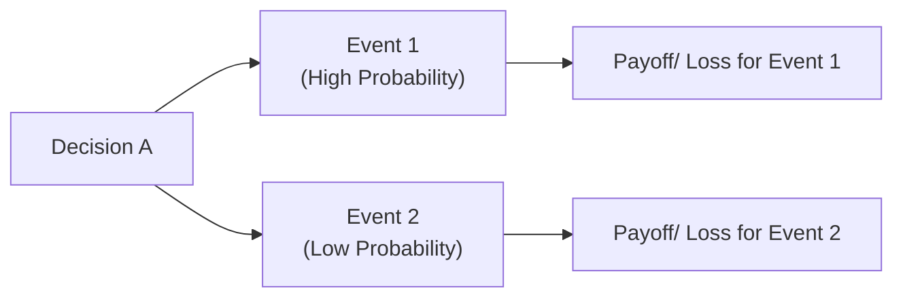
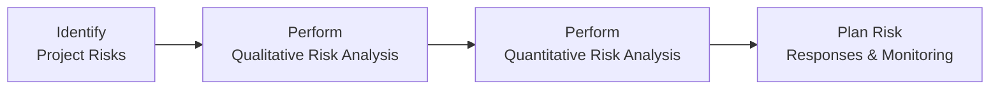

## 14.2 Qualitative and Quantitative Risk Analysis

In project management, risks can be as pervasive as they are unpredictable. Whether you are operating in a predictive, agile, or hybrid environment, understanding potential threats and opportunities is paramount to delivering successful outcomes. This section will help you build a strong foundation in both qualitative and quantitative risk analysis—critical components of effective risk management. Here, we distill the theory, practices, and tools needed to assess uncertainties thoroughly, providing not only better insights into your project’s risk exposure but also actionable strategies to mitigate or leverage risks for maximum value.

### Purpose and Context

Within the PMBOK® Guide Seventh Edition, risk analysis works in concert with other performance domains to manage uncertainty throughout the project lifecycle. It is supported by the Project Management Principles—especially those related to “Optimizing Risk Responses” and “Value Focus and Outcomes.” In real-world settings, risk assessment goes beyond a static compliance exercise, becoming a continuous, iterative process that empowers teams and stakeholders to anticipate challenges and pivot effectively. The formal categorization of risk analysis into qualitative and quantitative methods allows project managers to tailor their approach based on the complexity, strategic importance, and available data for each project.

### Relationship with the Uncertainty Performance Domain

This section correlates directly with the Uncertainty Performance Domain from Chapter 14, which addresses not only traditional risk management techniques but also the broader aspects of dealing with ambiguity, complexity, and emergent change. Qualitative and quantitative analyses are the dual engines that drive informed decisions in risk management. By systematically exploring all possible influences on the project’s objectives, you sharpen your ability to prioritize, allocate resources, and align stakeholders effectively.

---

## Qualitative Risk Analysis

Qualitative risk analysis involves categorizing and describing risks using subjective measures of probability and impact. These measures are often rooted in expert judgment, stakeholder perceptions, or historical data when precise numerical information is either unavailable or not cost-effective to obtain.

### Objectives

• Quickly prioritize risks based on their potential effects on project objectives.  
• Facilitate a swift allocation of resources and management attention.  
• Provide a structured yet flexible framework to capture both tangible and intangible dimensions of risk.  

By focusing on likelihood and potential impacts (both positive and negative), teams can devise preliminary responses early on—without waiting for extensive data collection. This approach is particularly advantageous in agile and iterative projects, where rapid feedback loops favor a quicker, more iterative risk management process.

### Risk Scoring and Probability-Impact Matrix

A cornerstone of qualitative risk analysis is the Probability-Impact Matrix (PIM). This matrix allows project teams to define scales (e.g., 1 to 5, or “Low” to “High”) for both probability and impact and then calculate a risk “score” that triggers prioritization and responses.

Here’s a typical scoring scheme illustrating probability and impact levels:

| Probability | Impact       | Score (Example) |
|-------------|------------- |-----------------|
| Very Low (0.1) | Low (2)      | 0.2             |
| Low (0.2)    | Medium (5)   | 1               |
| Medium (0.4) | High (8)     | 3.2             |
| High (0.6)   | High (8)     | 4.8             |
| Very High (0.8) | Very High (10) | 8.0             |

Above is a simplified depiction. The key is determining consistent definitions for each rating (probability and impact) so the team can quickly yet reliably compare different risks.

#### Example: Event Disruption Risk
• Probability: Medium (0.4)  
• Impact: High (8)  
• Risk Score = 0.4 × 8 = 3.2  

If you decide any risk with a score above 3.0 is “critical,” then this particular risk would undergo immediate review for possible responses, such as scheduling all high-impact tasks in a window of minimal external dependencies or preparing a contingency plan.

### Risk Appetite and Tolerance

An organization’s risk appetite and tolerance significantly influence qualitative analysis. If the organization is highly risk-averse, a moderate probability or minor impact could still be considered critical. Conversely, risk-tolerant environments might only trigger a response for “High-High” risks. 

### Tools for Qualitative Analysis

1. **Risk Breakdown Structure (RBS):** A hierarchical framework to categorize and cluster risks by source.  
2. **Expert Judgment:** Involving subject matter experts, stakeholders, or risk specialists to score probability and impact.  
3. **Risk Workshops:** Facilitated sessions where participants brainstorm risks and build consensus on scoring.  
4. **Risk Urgency Assessment:** Evaluates how soon a risk might materialize and whether immediate action is necessary.  

These qualitative methods enable quick, comprehensive coverage of a wide risk spectrum—even in the face of ambiguity.

---

## Quantitative Risk Analysis

Where qualitative risk analysis offers a broad, subjective categorization, quantitative risk analysis dives deeper into numerical methods to estimate a risk’s potential impact on project objectives. While it often requires more time, expertise, and data, quantitative analysis shines with rigorous, data-driven insights that help teams and executives make decisions about risk prioritization, budget, and schedule buffers.

### Objectives

• Assign numeric probabilities and monetary (or time) values to risk impacts.  
• Evaluate overall project risk exposure and potential range of outcomes.  
• Guide decision-making on risk reserve, schedule padding, or strategic pivoting with more precision.  

Quantitative analysis is not always mandatory; it is typically performed for high-stakes projects or where precise forecasts are needed. Some organizations also conduct quantitative risk analysis only on specific “Top 10” or “Most Critical” risks identified through qualitative means.

### Probability Distributions and Models

Quantitative approaches often rely on probability distributions to model uncertain events or variables (e.g., cost, time, or resource availability). Common distributions include:

• **Triangular Distribution:** Defined by minimum, most likely, and maximum values—often used in cost and time estimates with moderate data availability.  
• **PERT (Program Evaluation and Review Technique) Distribution:** Assigns weighted average durations (commonly 4 times the most likely) to better approximate real-world scenarios.  
• **Normal Distribution:** Applied in cases with symmetrical risk presence around the mean.  
• **Lognormal Distribution:** Useful when the risk’s lower bound is near zero while the upper bound is significantly higher (e.g., technology cost overruns).

Choosing the right distribution can heavily influence your analysis. For instance, if your team believes that small overruns are common but extreme overruns are rare (but possible), a skewed distribution like lognormal or triangular might better reflect reality.

### Expected Monetary Value (EMV)

A widely used formula in quantitative risk analysis is the Expected Monetary Value (EMV), especially in financial or cost-oriented contexts:

$$
\text{EMV} = \text{Probability of the Risk Event} \times \text{Potential Impact (Cost or Benefit)}
$$

For each identified risk, you compute the EMV and then sum these values to estimate the overall risk exposure. A negative EMV signals a potential cost overrun or loss, whereas a positive EMV indicates an opportunity.

#### EMV Example

• Risk Probability: 30% (0.3)  
• Impact if Occurs: –\$200,000  
• EMV = 0.3 × (–200,000) = –\$60,000  

This result is a negative expected value of \$60,000 to the project budget or net present value. You can then compare it against available contingency or weigh it against other mitigating factors.

### Decision Tree Analysis

Decision Tree Analysis is another popular quantitative technique that helps evaluate options when multiple uncertain outcomes exist. This method visually maps out decisions, subsequent chance events, and final outcomes.

• Each node branching from the decision identifies possible risk events.  
• Each outcome carries a probability and monetary impact, facilitating a clear comparison of EMVs.  

This method is helpful in stakeholder discussions around whether to proceed with a major technology investment or pivot to alternative approaches with different risk profiles.

### Monte Carlo Simulation

In complex projects with multiple uncertain variables, Monte Carlo simulation is the gold standard for quantitative risk analysis. It leverages repeated random sampling and statistical distribution assumptions to generate thousands or even millions of possible outcomes. The simulation aggregates these outcomes into a probability distribution, providing metrics such as:

• Probability of achieving a certain cost or finishing by a specific date.  
• Confidence intervals (e.g., P50, P80) that clarify the certainty of meeting objectives.  
• Sensitivity (Tornado) charts showing which risk variables most influence project results.

Monte Carlo simulations often require specialized software (e.g., Palisade’s @RISK or Oracle’s Crystal Ball), but the results can be integrated back into your risk register and broader project plans for robust decision-making.

---

## Linking Qualitative and Quantitative Methods

Qualitative and quantitative risk analyses are complementary. It is common to follow this flow:

1. **Identifying and Logging Risks:** Gather potential events through interviews, brainstorming, and research.  
2. **Qualitative Screening:** Filter out trivial issues and highlight those requiring deeper focus.  
3. **Quantitative Modeling (if warranted):** Apply numerical methods, especially for high-priority risks.  
4. **Plan Responses:** Devise strategies such as avoidance, mitigation, transfer, acceptance, or exploitation (for opportunities).  
5. **Monitor and Adjust:** Continually update risk data as the project evolves.

### Balancing Cost and Benefit

The depth of analysis should reflect project scale, complexity, and criticality. Over-analysis can drain resources while under-analysis leaves you vulnerable to unanticipated setbacks. Many project managers use a “risk threshold” approach, focusing quantitative analysis on the top 10–20% of risks that pose the most significant threat or opportunity.

---

## Advanced Considerations

### Correlated Risks

In real-life scenarios, risks often interrelate rather than appear in isolation. For instance, a schedule delay on one critical path might amplify the risk of cost overruns, and workforce constraints can compound to increase the probability of rework. Advanced quantitative models, such as correlated Monte Carlo, factor these interdependencies into the simulation.

### Sensitivity Analysis and Tornado Diagrams

Sensitivity analysis allows you to isolate which factors most impact project objectives. The **Tornado Diagram** is a helpful visual that ranks risk variables by their potential influence on the final outcome:

• The widest bar (at the top of the diagram) corresponds to the factor producing the largest swings in cost or schedule.  
• This helps focus mitigation strategies on high-impact risk drivers.

### Risk Tolerance and Confidence Levels

Decision-makers often want to know the probability of finishing within budget or on schedule. For example, “We have an 80% confidence level that we will complete the project within \$2 million.” Such a statement emerges from a well-executed Monte Carlo simulation. The choice of confidence level (e.g., P80 or P90) typically reflects management’s risk appetite. Lower confidence means less buffer is baked in, while higher confidence can be costlier but safer.

### Agile and Hybrid Contexts

In agile or hybrid projects, risk is handled dynamically with iterative planning sessions and continuous backlog refinement. Each iteration revalidates both qualitative and quantitative data, ensuring a living, adaptive risk approach. Quantitative methods might focus on velocity-based forecasting or cost-of-delay metrics. Qualitative methods often appear in daily standups and sprint retrospectives, driving quick adjustments to address evolving risks.

---

## Common Pitfalls in Risk Analysis

1. **Overcomplicating the Process:** Excessive detail can overwhelm teams; maintain balance between thoroughness and practicality.  
2. **Biases in Expert Judgment:** Anchoring bias or groupthink can skew probability and impact assessments; consider diverse viewpoints.  
3. **Incomplete Risk Identification:** Failing to list or capture all significant risks undermines the entire process.  
4. **Stagnant Risk Registers:** Analysis is not a “one and done” event. Regularly update risk data as new information emerges.  
5. **Ignoring Opportunities:** Risks are not always negative—overlooking potential benefits leads to suboptimal strategies.

---

## Case Study: IT Infrastructure Upgrade

A telecommunications company undertakes a large-scale IT infrastructure upgrade expected to cost \$10 million. Through a series of risk meetings:

1. **Qualitative Assessment:**  
   - Identifies 25 risks, primarily around vendor delays, technology incompatibilities, and regulatory approvals.  
   - Uses a Probability-Impact Matrix to spot 5 critical threats with risk scores above 4.0.  

2. **Quantitative Analysis:**  
   - The project manager applies Monte Carlo simulation to integrate correlated risks (e.g., vendor delays exacerbate labor cost overshoot).  
   - Results suggest a 70% chance of finishing under \$10.5 million.  
   - A deeper cost analysis reveals that adopting a secondary vendor reduces the risk exposure by \$200,000 (EMV basis).  

With these insights, senior management decides to invest in a backup vendor contract (mitigation strategy) and sets an additional \$500,000 risk reserve. The continuing iteration of these analyses helps monitor risk status after each major milestone, ensuring the project remains on target.

---

## Best Practices and Recommendations

• **Establish Clear Criteria:** Define probability, impact, and scoring scales in advance to reduce subjectivity.  
• **Combine Expert Judgment with Data:** Historical data, market trends, and simulation outputs complement each other.  
• **Frequent Reassessment:** Especially in agile contexts, reevaluate probabilities and impacts at regular intervals or sprint boundaries.  
• **Focus on High-Impact Risks:** Use a threshold-based approach for greater efficiency.  
• **Communicate Clearly:** Visual aids, such as heat maps and tornado diagrams, help stakeholders understand risk exposure quickly.  

---

## Additional Resources

• **PMI’s PMBOK® Guide and Standards:** Refer to the PMBOK® Guide Seventh Edition and “PMIstandards+” for additional frameworks.  
• **Agile Practice Guide (by PMI):** Provides insights on adapting risk management in agile settings.  
• **Books:**
  - Hillson, David. “The Risk Management Handbook.”  
  - Kendrick, Tom. “Identifying and Managing Project Risk.”  
• **Software Tools:**  
  - Palisade @RISK  
  - Oracle Crystal Ball  
  - Microsoft Project with risk add-ins  

---

## Elevate Your Mastery of Risk Analysis: Quiz



### During qualitative risk analysis, which tool best helps categorize and prioritize risks based on their likelihood and potential impact?

- [ ] Sensitivity Analysis
- [x] Probability-Impact Matrix (PIM)
- [ ] Monte Carlo Simulation
- [ ] Decision Tree Analysis

> **Explanation:** A Probability-Impact Matrix is typically used in qualitative risk analysis to quickly score and compare multiple risks.

### Which of the following is a quantitative risk analysis technique that uses repeated random sampling to simulate a wide range of outcomes?

- [ ] Probability-Impact Matrix
- [x] Monte Carlo Simulation
- [ ] Risk Categorization
- [ ] RACI Charting

> **Explanation:** Monte Carlo Simulation is a statistical technique that assesses project uncertainties by running numerous simulation trials.

### What result is commonly derived from Expected Monetary Value (EMV) analysis?

- [ ] Number of project staff required
- [x] Potential cost or benefit in monetary terms
- [ ] Spare parts inventory for the project
- [ ] Decrease in process defects over time

> **Explanation:** EMV assigns a probability to a monetary outcome, determining the financial exposure or potential gain.

### How does decision tree analysis differ from basic probability-impact analysis?

- [ ] It only applies to opportunities.
- [ ] It uses a static approach without branching.
- [x] It maps out decisions, chance events, and end outcomes visually and numerically.
- [ ] It invalidates all qualitative data.

> **Explanation:** Decision trees incorporate branching logic along with probabilities and monetary outcomes, helping to compare different decision paths.

### In risk analysis, which distribution is often used to handle scenarios where the most likely estimate is heavily weighted compared to extremes?

- [x] PERT distribution
- [ ] Lognormal distribution
- [x] Triangular distribution
- [ ] Pareto distribution

> **Explanation:** Both PERT and triangular distributions place emphasis on the most likely estimate, while allowing for minimum and maximum bounds.

### Which of the following best characterizes a common pitfall in qualitative risk analysis?

- [x] Over-reliance on subjective opinions without clearly defined scales
- [ ] Extensive scenarios and simulations
- [ ] Using standard definitions for probability and impact
- [ ] Conducting multiple risk workshops

> **Explanation:** If probability and impact definitions are too vague, the entire exercise becomes subjective and less reliable.

### When is it most beneficial to perform quantitative risk analysis?

- [x] When high-priority or high-stakes risks are identified and require precise assessment
- [ ] When no data is available
- [x] When the project is strictly limited to a single sponsor
- [ ] For every single risk, regardless of impact or probability

> **Explanation:** Quantitative analysis is cost-intensive and typically reserved for critical risks requiring more detailed assessment.

### Which analysis technique visually ranks risk variables by their impact on the project’s outcome, often used with Monte Carlo simulations?

- [ ] Flowchart
- [x] Tornado diagram
- [ ] Gantt chart
- [ ] Control chart

> **Explanation:** A tornado diagram shows the influence of each variable on project cost or schedule, helping prioritize risk responses.

### What is the primary advantage of combining both qualitative and quantitative risk analysis?

- [x] It balances quick prioritization with data-driven insights.
- [ ] It eliminates the need for expert judgment.
- [ ] It requires no stakeholder involvement.
- [ ] It can be completed at the end of the project.

> **Explanation:** Qualitative methods quickly sort risks by importance, while quantitative techniques provide precise estimates, leading to well-informed decisions.

### Conducting Monte Carlo simulations can provide an 80% confidence level of meeting a specific project objective. This reflects:

- [x] True
- [ ] False

> **Explanation:** The statement is correct. Monte Carlo simulations typically yield probability distributions that allow project managers to interpret confidence levels for cost or schedule outcomes.



---

## PMP Mastery: 1500+ Hard Mock Exams with Full Explanations 

Looking to crush the PMP exam with confidence? Dive deep into 6 rigorous mock exams totaling 1500+ advanced-level questions, each accompanied by clear, step-by-step explanations. Hone your test-taking strategies, master complex topics, and build the resilience you need on exam day. Perfect for serious PMs aiming beyond fundamentals.

Enroll now:  
[PMP Mastery: 1500+ Hard Mock Exams with Exceptional Clarity & Full Explanations](https://www.udemy.com/course/pmp-2025/?referralCode=CF83A54BC86BE27F9AFE)

_Disclaimer: This course is not endorsed by or affiliated with the PMI examination authority. All content is provided purely for educational and preparatory purposes._
