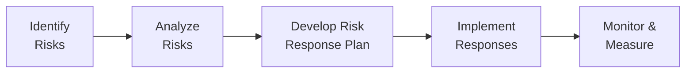
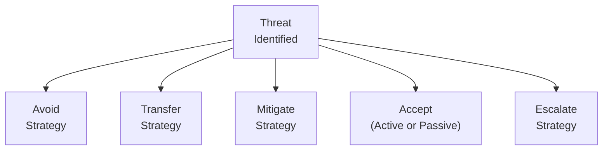
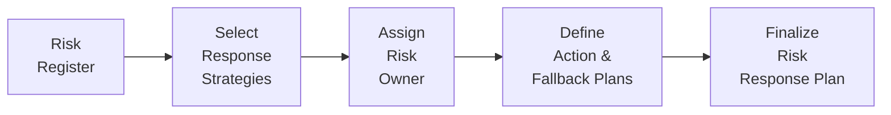

## 14.3 Planning and Implementing Risk Responses

Risk response planning and implementation remain among the most critical aspects of effective project management. In this section, we build upon the preceding steps of identifying and analyzing risks (Sections 14.1 and 14.2) to formulate actionable plans that address both threats and opportunities. Properly designed and effectively executed risk responses can help teams proactively navigate uncertainty, maintain project performance, and maximize value. 

This section also reinforces how strategically aligned, operationally feasible, and tactically efficient responses lead to better outcomes—both during project execution and after final deliverables are handed over. By aligning with PMI’s best practices, as well as referencing other portions of this book (such as Chapter 22: “Risk and Uncertainty Management (Revisited)” and Chapter 5.8: “Optimizing Risk Responses”), you will gain a roadmap for turning risk insights into purposeful actions that protect and enhance project objectives. 

Ensuring a Thorough Understanding of Risk Response Strategies
------------------------------------------------------------

Organizations often classify their risk management actions along three distinct but interlinked layers:
- Strategic  
- Operational  
- Tactical  

Strategic measures align high-level organizational objectives with risk appetite. Operational measures deal with the processes, structures, and day-to-day directives that support the strategic aims. Tactical measures, on the other hand, focus on practical, on-the-ground activities for risk mitigation or enhancement. By coordinating these three layers, project leaders can integrate risk responses seamlessly into all project phases.

Below is a visual overview of the project risk management flow:

• A: Identify Risks – The process of uncovering all possible adverse events (threats) or beneficial events (opportunities).  
• B: Analyze Risks – The phase in which teams evaluate the probability, impact, and urgency of each risk.  
• C: Develop Risk Response Plan – The creation of a practical, tailored plan for handling risks.  
• D: Implement Responses – Executing the planned actions.  
• E: Monitor & Measure – Ongoing assessment to ensure the efficacy and relevance of the risk response approach.

The Risk Response Lifecycle
---------------------------

Planning and implementing risk responses comprises a mini-lifecycle within the broader process of risk management. It typically includes:

• Selecting the right strategy to address each identified risk.  
• Formalizing an approach to deploy these strategies (assigning owners, scheduling resources, building budgets, etc.).  
• Monitoring and controlling the outcomes, making adjustments where necessary.  

Within this lifecycle, teams often revisit earlier stages as new risks emerge or previously assessed risks change in priority.

### Strategic Risk Responses

Strategic risks can shape or shake entire business models, significantly impact ROI, or disrupt the organization’s long-term objectives. These risks can include regulatory changes, major market shifts, or industry-wide disruptions. Typical response measures can be integrated into both the Project Charter (see Chapter 15.1) and organizational-level strategy documents.

• Threat Examples (Strategic):  
  - Emerging legislation that poses potential compliance barriers.  
  - A disruptive technology on the horizon.  

• Opportunity Examples (Strategic):  
  - Mergers or acquisitions that expand organizational capabilities.  
  - New market segments that promise large-scale benefits.

Strategic responses often require executive endorsement and interdepartmental collaboration, given the significant investment of organizational resources needed. This could mean pivoting an entire project to a different technology, allocating more capital to accelerate product development, or establishing new governance practices to manage regulatory risk. 

### Operational Risk Responses

Operational risks typically involve the systems, processes, and everyday execution that drive a project’s success. These include anything from supplier reliability to internal resource availability to process efficiencies.

• Threat Examples (Operational):  
  - Key vendor’s production shortfall.  
  - IT system downtime that impacts deliverables.  
  - High turnover among specialized staff.

• Opportunity Examples (Operational):  
  - Improvements in process flow that reduce cost or time.  
  - Additional capacity or technology available mid-project.  

Operational responses often relate directly to schedule, budget, and resource management (see Chapters 18, 19, and 21). For instance, a team might negotiate special clauses in vendor contracts to handle contingencies, implement robust data backups to mitigate IT outages, or cross-train employees to reduce single-person dependencies.  

### Tactical Risk Responses

Tactical risks are narrower in scope and affect teams on the ground or the immediate workflow. They are often day-to-day issues that can be quickly identified and resolved with minimal cross-functional oversight.

• Threat Examples (Tactical):  
  - A sudden illness affecting a critical team member.  
  - Minor variations in supply times.  
  - Incomplete specification discovery.

• Opportunity Examples (Tactical):  
  - Gaps in the schedule that can be repurposed for additional testing.  
  - Access to a newly released software patch that enhances efficiency.

Tactical responses usually involve immediate adjustments—such as reassigning tasks, adjusting scope, or requesting an internal resource reallocation. The cost or budgetary implication is usually modest relative to strategic or operational changes.  

By thinking in terms of these three layers—strategic, operational, and tactical—project managers can ensure their responses address the proper level and that decision-making is distributed appropriately across individuals with the right authority and resources.

Threat Response Strategies
--------------------------

According to the Project Management Institute (PMI), there are five generally accepted strategies for handling threats:

1. **Avoid**  
   Eliminates the threat entirely by changing project scope or objectives, or by removing its cause. For example, choosing a well-known vendor with a proven track record instead of a new, untested supplier avoids the threat of poor service reliability.

2. **Transfer**  
   Shifts ownership of a threat’s impact to a third party, commonly through insurance policies, warranties, or contractual agreements. Although the risk remains, the responsibility and potential financial burden move elsewhere. In agile environments, transferring risk could take the form of contracting specialized capabilities to a partner firm.

3. **Mitigate**  
   Reduces the probability or impact of a threat to an acceptable level. Mitigation often requires additional steps like partial redundancies in critical paths, employing advanced technologies, or cross-training team members to reduce reliance on single skilled individuals.

4. **Accept (Passive or Active)**  
   A decision to tolerate the threat without taking immediate action, usually when the cost or feasibility of further steps is prohibitive. Passive acceptance might involve doing nothing. Active acceptance sees the creation of contingency reserves or fallback plans in case the threat materializes.

5. **Escalate**  
   Used when the threat is beyond the authority or control of the project manager and must be handled at a higher organizational level. For instance, a threat involving broad structural changes or major policy decisions may need involvement from the CEO or a steering committee.

Below is a simple visual overview of typical threat response strategies:

Opportunity Response Strategies
-------------------------------

Likewise, opportunities, if seized effectively, can help projects exceed stakeholder expectations and amplify business value. PMI outlines five strategies:

1. **Exploit**  
   Capture the full benefit of an opportunity by ensuring the conditions for it to occur, often requiring reallocation of resources or changing the project constraints. For instance, adjusting timelines to coincide with a favorable marketing campaign window.

2. **Enhance**  
   Increases the probability or impact of an opportunity. For example, a team might provide specialized training to staff so they can take advantage of a newly discovered technology that cuts down project time.

3. **Share**  
   Collaborates with outside parties to realize the opportunity, often splitting the benefits and associated risks. Partnerships, joint ventures, or alliances serve as typical vehicles for sharing an opportunity.

4. **Accept**  
   Recognizes an opportunity but chooses to proceed with minimal action. This might occur when the opportunity is minor, or resources to leverage it are constrained.

5. **Escalate**  
   Passes an opportunity to a higher authority if realization of that opportunity belongs outside the scope or authority of the project. For example, an opportunity that offers a broad organizational benefit might be escalated to the COO for integrated resource planning across multiple projects.

Planning Risk Responses
-----------------------

The risk response planning phase involves documenting how each risk (threat or opportunity) will be addressed, who will be responsible, and how project constraints (scope, schedule, budget) might be affected. The core deliverable is typically captured in a “Risk Response Plan” or integrated directly into the “Risk Register” (see Chapter 22.1 for additional templates).

### Inputs to the Risk Response Planning Phase

- **Risk Register**: Lists identified risks, their current statuses, root cause, and analysis outcomes.
- **Project Management Plan**: Includes scope, timelines, budgetary constraints, quality management guidelines, and communication protocols.
- **Organizational Process Assets (OPAs)**: Company procedures, industry standards, and available templates from past projects.
- **Enterprise Environmental Factors (EEFs)**: Internal organizational culture, marketplace conditions, and socio-political environment that shape risk tolerance.

### Essential Components of a Risk Response Plan

1. **Risk Description**  
   A concise summary of the risk, including its root cause, potential triggers, and classification (threat or opportunity).

2. **Chosen Response Strategy**  
   Clearly designate whether the response is Avoid, Transfer, Mitigate, Accept, or Escalate (for threats) or Exploit, Enhance, Share, Accept, or Escalate (for opportunities).

3. **Responsible Owner**  
   Name the individual or group who will oversee the chosen strategy. This ensures accountability.

4. **Action Steps**  
   Define the steps needed to implement the strategy. Outline the timeline, budget, and resources required.

5. **Fallback Plan**  
   A backup strategy if the main response plan is ineffective or if the risk event occurs despite mitigation.  

6. **Contingency Plan**  
   Prearranged measures that kick in if certain triggers are met.

7. **Residual Risk**  
   Any risk that remains after the response is implemented. This could include secondary risks triggered by the response itself.

8. **Monitoring & Reporting Mechanisms**  
   Identify how you will measure the effectiveness of the response and the frequency of reporting on the risk’s status.

Organizations that embed risk response planning into their overall project planning tend to see a reduced rate of cost overruns, schedule slippage, and resource constraints, as well as an increase in realized benefits from opportunities.  

Below is a schematic of how these essential components come together:

Implementing Risk Responses
---------------------------

Implementation moves risk response planning from paper to practice. Lack of proper implementation can cause even the best-designed response measures to fail. Detailed planning ensures each task is feasible, but strong leadership and continuous engagement are paramount to maintain momentum.

### Assigning Risk Owners and Teams

Having a clearly designated risk owner is critical for accountability. This individual (or team) must have the authority and the necessary resources to act. Depending on the risk magnitude and complexity, specialized skill sets might be required.

### Integrating with the Project Schedule

Actions to address risks should be assigned tasks in the project schedule (see Chapter 18 for scheduling best practices). For example, a risk response that requires new equipment must be integrated into the procurement lead times and added to the critical path if it impacts overall project delivery.

### Budgeting and Funding

Planning resource availability for risk responses often involves establishing contingency or management reserves (see Chapter 19.3 on controlling costs and reserves). When a mitigation plan calls for an external specialist or advanced hardware, a portion of the budget must be set aside specifically for these responses.

### Communications and Stakeholder Engagement

Whenever a risk response includes major re-planning, reallocation of funds, or changes in scope or quality, stakeholders must be consulted—particularly if changes impact acceptance criteria or business objectives. Refer to Chapter 16 for communication strategies and stakeholder engagement models.

### Monitoring and Adjusting Responses

Implementing a response is rarely a one-time activity. Teams must continuously monitor whether the response is effective or if new triggers and secondary risks have emerged:

• **Ongoing Risk Audits**  
  Periodic reviews to see if the risk responses remain valid and if owners are fulfilling their responsibilities.

• **Key Performance Indicators (KPIs)**  
  Performance metrics (many times tracked through Earned Value Management [Chapter 19.2] or velocity in agile) can spotlight the success or shortcomings of risk responses.

• **Change Management Processes**  
  If a risk response changes the baseline scope, schedule, or cost, it must go through Integrated Change Control (Chapter 15.3) to keep the entire project in sync.

Case Study Example
------------------

Imagine a construction project aiming to build a critical facility. During the planning phase (Chapter 10), the project manager identifies a high-probability threat: harsh winter conditions could delay foundation work. The chosen strategy is **mitigation**:

• **Action Steps**: The team purchases specialized thermal blankets capable of allowing concrete to cure even in subfreezing temperatures.  

• **Resources**: Additional funds are allocated into a contingency reserve.  

• **Ownership**: An experienced site engineer is assigned to oversee usage of the thermal blankets.  

• **Fallback**: If temperatures become dangerously low or consistent storms hamper the site, the fallback plan calls for shifting certain indoor construction tasks forward in the schedule.  

During implementation, the site engineer continuously monitors weather forecasts and ensures the specialized equipment is readily available. Because the predicted weather issue arises earlier than expected, the readiness and timely action prevent further delays. Although some extra cost is incurred, the overall schedule remains intact, satisfying stakeholder expectations.

Aligning with Agile, Hybrid, and Predictive Life Cycles
------------------------------------------------------

Risk response approaches differ slightly across predictive, agile, and hybrid methodologies:

• **Predictive**  
  Detailed risk management documentation is created early, and execution generally follows a planned approach with periodic risk reviews at phase gates.

• **Agile**  
  Teams address risks continuously. Risk response steps may be added to iteration backlogs, and daily stand-ups will surface emerging issues quickly (see Chapter 24 for more on agile mindsets).

• **Hybrid**  
  Combines structured planning with iterative feedback loops, where risk response strategies can be pitched, tested, and refined in shorter cycles, ensuring responsiveness to dynamic project conditions.

Common Pitfalls and Challenges
------------------------------

1. **Overlooking Secondary Risks**  
   Sometimes a response triggers new risks. Failing to incorporate these secondary threats or opportunities can lead to blind spots in the overall plan.

2. **Insufficient Resource Allocation**  
   Great plans fail if adequate budgets, time, or human resources are not secured to implement them.

3. **Poor Communication**  
   Responses that change fundamental aspects of the project can cause confusion or conflict among stakeholders if not clearly broadcast and managed.

4. **Neglecting Opportunities**  
   While threats often get top priority, ignoring opportunities forfeits potential gains for the organization.

5. **Failure to Review and Update**  
   A static risk response plan can quickly become outdated. Lack of iterative review leads to half-baked solutions that do not match new realities.

6. **No Clear Accountability**  
   If risk owners are not explicitly named or do not have enough authority, the implementation of risk responses becomes disorganized or stalled.

Tips and Best Practices
-----------------------

• **Tailor Responses to Context**  
  Adapt the chosen strategy to your project’s unique culture, constraints, and complexities.

• **Involve Stakeholders Early**  
  Involve relevant stakeholders, including senior management, in planning responses to ensure buy-in.

• **Use a Lessons Learned Repository**  
  Document the successes and failures of risk responses. Future projects benefit from this knowledge repository (see Chapter 11.3 on knowledge transfer).

• **Regularly Review the Risk Register**  
  Continually update risk statuses, keep an eye on triggers, and confirm if fallback plans or secondary strategies need activation.

• **Practice Active Acceptance**  
  Even if your team opts to accept a risk, remain prepared with reserves or fallback plans.

• **Escalate Wisely**  
  Do not wait too long to escalate critical risks. Escalation can bring the necessary resources or authority that a project manager may lack.

• **Celebrate Opportunities**  
  Acknowledge successes, especially when an opportunity provides substantial added value or cost savings. This helps reinforce the positive impact of risk management.

References and Further Exploration
----------------------------------

• PMI’s “Practice Standard for Risk Management” for detailed frameworks and processes.  
• Chapter 22 of this book for more advanced tools like Monte Carlo simulation for quantitative risk analysis.  
• Chapter 5.8 on “Optimizing Risk Responses” for additional case studies.  
• Agile Practice Guide by PMI for agile-oriented risk strategies.  
• Research articles on enterprise risk management for insights on strategic risk response programs.  
• ISO 31000 Risk Management Guidelines for a broader international perspective.

## Test Your Knowledge: Risk Response Strategies and Implementation



### Which layer of risk responses is primarily concerned with project-wide or company-wide initiatives and overall resource allocation?

- [ ] Tactical
- [x] Strategic
- [ ] Operational
- [ ] Agile

> **Explanation:** Strategic risk responses deal with long-term, overarching organizational goals, often requiring executive support and considerable resource reallocation.

### Which of the following is a logical example of a tactical threat response?

- [ ] Signing an insurance policy to shift financial impacts
- [ ] Postponing a major release to align with new market trends
- [x] Having a backup developer for critical tasks
- [ ] Creating a broad corporate alliance to share technology

> **Explanation:** A backup developer is an immediate, hands-on method of mitigating a short-term risk, fitting a tactical response model.

### When should you escalate a risk or opportunity?

- [x] When the response is outside the project manager’s authority
- [ ] When the risk impact is minimal
- [ ] When the project manager wants to transfer accountability
- [ ] When you have no fallback plan

> **Explanation:** Escalation is used if the risk (threat or opportunity) cannot be appropriately managed at the project level and needs higher-level decision-making or resource support.

### What is the main difference between “Enhance” and “Exploit” strategies for opportunities?

- [ ] Enhance eliminates the opportunity, while Exploit shares it with others
- [x] Enhance increases the chance or impact, while Exploit ensures full realization
- [ ] Enhance focuses on transferring partial benefits, while Exploit focuses on acceptance
- [ ] They are synonymous terms for seizing an opportunity

> **Explanation:** “Enhance” aims to amplify the probability or positive impact of an opportunity, whereas “Exploit” seeks to guarantee the opportunity is fully realized.

### Which of the following documents typically captures the assigned risk owner, chosen response strategy, and fallback plan?

- [ ] Stakeholder Engagement Plan
- [ ] Issue Log
- [x] Risk Register (or Risk Response Plan)
- [ ] Stakeholder Matrix

> **Explanation:** The Risk Register (and integrated Risk Response Plan) is the primary document where each identified risk is paired with a response strategy, ownership details, and fallback plans.

### In cost management, how do project managers typically prepare for unexpected but possible risk events?

- [ ] Keep the baseline budgets intact and hope for the best
- [x] Allocate contingency or management reserves
- [ ] Apply schedule padding for every activity
- [ ] Use only internal resources to lower risk

> **Explanation:** Setting aside contingency or management reserves ensures that funds are available if an identified risk materializes.

### If a team intentionally decides not to take further action against a certain threat and does not create a fallback plan or reserves, which strategy is being applied?

- [x] Passive Acceptance
- [ ] Mitigation
- [ ] Active Acceptance
- [ ] Avoid

> **Explanation:** If no action or contingency plan is prepared, it constitutes passive acceptance, whereby the project simply tolerates the risk.

### What is a key benefit of ongoing risk audits?

- [x] Ensuring risk responses remain effective and current
- [ ] Extending the project timeline
- [ ] Replacing the entire management team
- [ ] Escalating all risks to the executive sponsor

> **Explanation:** Risk audits periodically check whether the risk responses are still relevant, ensuring that no new triggers or secondary risks are overlooked.

### Which of the following best describes “residual risk”?

- [ ] A fully eliminated threat
- [ ] An opportunity that cannot be exploited
- [x] The risk that remains after a response is implemented
- [ ] A risk that must be escalated immediately

> **Explanation:** Residual risk refers to the amount or type of risk remaining after a chosen strategy has been executed, indicating that some risk exposure still exists.

### In responding to a threat, which of the following strategies involves moving liability to a third-party firm through contractual means?

- [x] Transfer
- [ ] Avoid
- [ ] Mitigate
- [ ] Accept

> **Explanation:** Transfer shifts the financial or operational repercussions of a threat to a third party, commonly via contractual agreements or insurance.



## PMP Mastery: 1500+ Hard Mock Exams with Full Explanations

Looking to crush the PMP exam with confidence? Dive deep into 6 rigorous mock exams totaling 1500+ advanced-level questions, each accompanied by clear, step-by-step explanations. Hone your test-taking strategies, master complex topics, and build the resilience you need on exam day. Perfect for serious PMs aiming beyond fundamentals.

Enroll now:  
[PMP Mastery: 1500+ Hard Mock Exams with Exceptional Clarity & Full Explanations](https://www.udemy.com/course/pmp-2025/?referralCode=CF83A54BC86BE27F9AFE)

_Disclaimer: This course is not endorsed by or affiliated with the PMI examination authority. All content is provided purely for educational and preparatory purposes._
