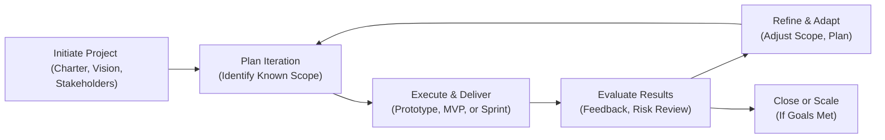

## 14.4 Adaptive Strategies for Ambiguity and Complexity

Ambiguity and complexity are inevitable aspects of many modern projects. As technology advances and markets shift rapidly, project managers often confront situations in which requirements are incomplete or evolving, stakeholder needs are uncertain, and external conditions change unpredictably. Effective leadership in such environments requires an adaptive mindset, flexible methodologies, and the continuous engagement of stakeholders to navigate the unknown.  

This section addresses how you can adopt and tailor approaches—agile, hybrid, or even adaptive variants of predictive models—to successfully deliver outcomes amid uncertainty. Whether your project is new-to-market, operates in a highly regulated sector, or involves novel technologies, these strategies help you pilot through complexity, turning risk into opportunity and ambiguity into clarity.

  
### Understanding Ambiguity and Complexity

Project ambiguity often arises when critical information—requirements, goals, technology constraints, or success criteria—is missing or rapidly changing. This can manifest, for example, in:
- Unclear business objectives or needs.  
- Disparate or evolving stakeholder expectations.  
- Lack of precedent or a prototype for an innovative product.  
- Shifting market conditions or regulations.  

Project complexity, on the other hand, is characterized by the presence of numerous interconnected parts and dynamic relationships. Changing one aspect can cause unpredictable ripple effects throughout the project’s environment. Complexity may be driven by:  
- Large-scale programs with multiple subsystems.  
- Distributed teams with cultural and language differences.  
- Multiple regulatory bodies imposing conflicting requirements.  
- Technology constraints and integration challenges.  

While ambiguity focuses on the “unknowns” of a project, complexity is generally about how the “knowns” interact in unexpected ways. Both phenomena overlap when changes occur faster than planned, or when the system’s interactions aren’t entirely clear from the outset.  

In Chapter 32 on Complex Adaptive Systems and Systems Thinking, we explore how complex systems exhibit emergent behaviors that often defy linear cause-and-effect explanations. Those insights lay a foundation for the techniques you will learn here.

  
### The Adaptive Mindset

Dealing with ambiguity often requires an iterative, experimentation-driven approach. Rather than anchoring on fixed plans, you refine your strategy as you learn more. You probe, sense, and respond, engaging with stakeholders in real time to adapt. This is particularly true for organizations that are transforming digitally or seeking to disrupt established marketplace norms.  

Key elements of the adaptive mindset include:  
- Embracing continuous learning: Accept early prototypes or pilot solutions to learn quickly.  
- Encouraging open, transparent communication: Invite feedback from stakeholders at all stages.  
- Cultivating resilience: Expect setbacks and reframe them as opportunities to improve.  
- Prioritizing collaboration: Engage cross-functional teams to synthesize diverse viewpoints.  

These ideas align with PMI’s 12 Project Management Principles (Chapter 5), particularly those emphasizing collaboration, adaptability, and value focus. They also resonate with Chapter 8, where building high-performing, self-organizing teams is imperative for navigating rapidly changing environments.

  
### Sensemaking Frameworks and Project Environments

In projects dominated by uncertainty, managers often use sensemaking frameworks such as the Cynefin framework to categorize challenges and select the most appropriate management style. Cynefin sorts problems into domains—simple (obvious), complicated, complex, and chaotic—and prescribes different actions for each.

When the environment is complex or chaotic, typical linear approaches from Chapters 9 and 10 (planning and life cycle performance domains) may not suffice. Instead, the following strategies tend to prevail:  
- Experimentation over heavy up-front planning.  
- Staggered or rolling-wave planning experiences (see Chapter 10: Planning Performance Domain).  
- Frequent iterations, feedback loops, and minimal viable product (MVP) development.  
- Emphasis on short planning horizons and continuous revalidation of scope and goals.

  
### Strategies for Navigating Ambiguity

Ambiguity often describes situations with a lack of clarity on goals, constraints, or resource availability. When faced with ambiguity, managers must creatively acquire the missing insights.  

#### Iterative Requirements Elicitation
Instead of trying to map all requirements thoroughly at the start (as in a purely predictive model), gather requirements in multiple threads:
- Conduct user workshops, interviews, or joint design sessions.  
- Use prototypes or wireframes to clarify end-user needs.  
- Refine user stories over successive sprints, as in agile Scrum.  

This rolling backlog approach (see Chapter 26 on Key Agile Events and Artifacts) helps overcome the barrier of incomplete requirements by promoting iterative exploration rather than forcing stakeholders to articulate everything perfectly on day one.  

#### Rapid Prototyping and Proof of Concept
To reduce the unknowns, develop small experiments or proofs of concept before committing large budgets and resources:
- Employ technology spikes for uncertain technical issues (e.g., investigating new frameworks or integrations).  
- Build low-fidelity mock-ups for stakeholder reviews.  
- Conduct feasibility analyses to narrow down the solution space.  

In complicated or complex environments, these proofs shape your roadmap, preventing potentially costly misdirection.  

#### Incremental Rolling-Wave Planning
When the project’s later stages remain fuzzy, adopt rolling-wave or iterative planning:
- Plan future phases or sprints in detail only once you have relevant insights.  
- Adjust your scope and deliverables based on stakeholder feedback and ongoing learnings.  
- Incorporate leading indicators from agile metrics (e.g., velocity, burndown/burnup charts) to forecast future capacity and constraints.  

Frequent reevaluation of the plan fosters agility, aligning better with emerging realities than a static baseline that quickly becomes obsolete.

  
### Strategies for Navigating Complexity

Complexity arises when multiple components within a project or program are interrelated, producing non-linear outcomes. Traditional breakdown structures and linear scheduling may fail to capture the inherent unpredictability.  

#### Systems Thinking
Systems thinking (addressed in Chapter 32) promotes viewing the project as an interconnected system rather than isolated parts. By understanding how subsystems, teams, or marketplace dynamics reinforce (or counteract) each other, you can:
- Identify potential domino effects.  
- Design integrated feedback loops.  
- Find synergy or resource-sharing opportunities across sub-projects.  

In practice, you may use a dependency mapping or cause-and-effect diagram to visualize how tasks, teams, or processes intersect.  

#### Modular Design and Architectural Decomposition
When solutions are large or multi-layered:
- Decompose the system into loosely coupled modules.  
- Align work packages with these modules to minimize cross-team dependencies.  
- Maintain well-defined interfaces that let you iterate without breaking the entire solution.  

This approach echoes the principle of decoupling in agile software architecture: it allows smaller teams to experiment quickly with minimal risk to the broader system.

  
#### Coordination and Collaboration Mechanisms
In a complex environment with multiple stakeholders, organizational units, or technology stacks, adopt robust collaboration mechanisms:
- Virtual shared workspaces for real-time updates.  
- Regular cross-team scrums or scoping sessions to identify dependencies.  
- Dynamic risk management sessions with relevant experts in attendance (see Chapter 14.1 on Identifying Risks and Uncertainties).  

Coordinating often transcends standard Gantt charts or resource histograms (discussed in Chapter 18 and Chapter 19). By establishing frequent alignment sessions, you reduce the risk of small misalignments spiraling into major project disruptions.

  
### Balancing Ambiguity and Complexity with Risk-Based Approaches

Risk-based thinking is crucial when the project intersects ambiguous and complex zones. Chapter 22 revisits Risk and Uncertainty Management, where continuous identification, assessment, and response planning serve as the backbone. The difference here is the relentless need for adaptation:

1. Conduct frequent risk reviews as new information surfaces.  
2. Categorize uncertainties as knowledge gaps (for which you run experiments), or emergent complexities (for which you fortify system resilience).  
3. Use real options thinking: invest incrementally in knowledge acquisition or architecture and pivot if the context shifts.  

  
### Leveraging Hybrid Methodologies

Hybrid models that blend predictive and agile practices offer middle-ground solutions for organizations that require structured governance while also benefiting from flexibility. A project might follow a predictive approach for defined deliverables while integrating iterative cycles for ambiguous components. For instance:  
- Fixed-scope hardware design phases combined with agile sprints for firmware or software.  
- A sequential procurement process that transitions into iterative MVP testing once contracts have been awarded.  
- A stable phase gate that sequence releases, yet each gate fosters adaptive planning for the next phase.  

Chapter 27 on Hybrid Approaches expands on real-world examples illustrating how to combine the best of both frameworks.

  
### Leadership and Team Empowerment

Leading under ambiguous and complex conditions requires nuanced leadership styles. Chapter 8 discusses the importance of servant leadership and self-organizing teams, especially in agile contexts; these become even more critical amid high uncertainty. Leaders should:
- Empower teams to make decisions as close to the work as possible.  
- Grant psychological safety so that team members openly discuss risks or errors.  
- Promote iterative learning, pivoting based on evidence rather than hierarchy.  

Leaders also need to consistently communicate guiding principles and vision, allowing teams to align around shared objectives even if the path forward frequently changes.  

  
### Case Study: Launching an Innovative Product in a Volatile Market

Consider an electronics manufacturer preparing to launch a cutting-edge device into a rapidly evolving market. The project faces high ambiguity: emerging technologies, uncertain user acceptance, and a fuzzy regulatory environment. Additionally, complexity abounds: hardware, software, user experience, supply chain integration, and tight alignment with marketing campaigns.

1. The product team embraces a partial predictive approach to secure critical hardware components with long lead times—these follow a more traditional approach because the supply chain demands structured planning and vendor contracts.  
2. For the software and firmware, the team adopts agile sprints. They refine user stories as they gather feedback from alpha testers. When regulatory guidelines shift, they rerun feasibility checks to adjust licensing or operational parameters.  
3. Rolling-wave planning is employed for potential product variants (premium vs. standard) to match competitor releases or market demand. The team invests in early prototypes that reveal user preferences, decommissioning unpromising ideas before scaling.  
4. Cross-functional standups help the hardware and software teams share real-time insights, mitigating the risk of hardware-software misalignment.  

Through iterative planning, risk-based pivots, and daily alignment, the company navigates the project’s uncertain environment, ultimately delivering a product that resonates with customers and meets emerging regulations.

  
### Visualizing an Adaptive Feedback Loop

Below is a mermaid diagram illustrating a simplified adaptive project model. Feedback and iterative learning loops flow continuously, helping teams respond effectively to ambiguity and complexity.

Explanation:  
• The project is initiated with high-level objectives.  
• An iteration is planned, focusing on the aspects most certain or urgent.  
• The team executes and delivers partial or prototype-level results.  
• A comprehensive evaluation reveals new insights, including risks or changing stakeholder expectations.  
• Based on these insights, the plan is refined or pivoted.  
• If key objectives are met or the iteration indicates success, the solution can be scaled or closed. Otherwise, it loops back for another iteration.  

  
### Best Practices and Common Pitfalls

**Best Practices**  
- Maintain continuous stakeholder involvement, even if the project scope is not entirely set.  
- Encourage a culture of experimentation and “safe-to-fail” trials.  
- Invest in frequent communication channels and cross-functional alignment sessions.  
- Adopt robust knowledge management practices to capture lessons learned from each iteration (see Chapter 11.3 on Knowledge Transfer).  

**Common Pitfalls**  
- Trying to overly structure an inherently uncertain environment with static Gantt charts and locked baselines.  
- Neglecting stakeholder involvement in early prototypes, leading to misaligned expectations.  
- Underestimating the difficulty of coordinating across multiple, interdependent teams in complex systems.  
- Failing to adapt risk responses in real time, treating them as a one-time planning exercise.  

  
### Summary

In ambiguous and complex scenarios, an adaptive project management strategy synthesizes experimentation, agile planning, and resilience in the face of frequent change. By iteratively refining requirements, fostering collaboration, and focusing on stakeholder engagement, you transform uncertainty into manageable—and often advantageous—outcomes.  

Remember, there is no single methodology that can solve every challenge in high-uncertainty environments. The essence lies in tailoring a blend of predictive, agile, and hybrid tools to your context, building a high-performing team culture, and adjusting quickly as new information emerges.  

If you want to dive deeper into complexity thinking, refer to Chapter 32 for advanced techniques on managing complex adaptive systems. For risk and uncertainty planning tools, revisit Chapter 22. By embracing adaptive strategies, you equip your team and stakeholders for success, no matter how uncertain your project’s path may be.

  

## Sharpen Your Adaptive Strategies Know-How: 10 Questions on Managing Ambiguity and Complexity



### Which of the following best describes ambiguity in a project environment?
- [ ] A condition where project objectives are extremely detailed and static.
- [x] A situation characterized by unclear or evolving requirements, goals, or constraints.
- [ ] The presence of large-scale projects with multiple regulatory bodies.
- [ ] An environment where all risks are known and mitigated.

> **Explanation:** Ambiguity arises when information about goals, requirements, or external conditions is incomplete, rapidly changing, or too unclear to define precisely.

### What is the primary purpose of rolling-wave planning in ambiguous environments?
- [ ] To eliminate the need for change control altogether.
- [ ] To lock down the baseline schedule early in the project.
- [x] To plan for the near term in more detail and refine subsequent phases later.
- [ ] To avoid stakeholder input until the final product inspection.

> **Explanation:** Rolling-wave planning focuses on detailed planning for the upcoming work while deferring certain decisions and detailed planning for future phases, allowing for better adjustment to emerging information.

### Which leadership style is generally most effective when dealing with high ambiguity and complexity?
- [ ] Autocratic leadership that dictates the project plan.
- [x] Servant leadership that empowers collaboration and decentralized decision-making.
- [ ] Laissez-faire leadership with minimal oversight.
- [ ] Transactional leadership based strictly on rewards and penalties.

> **Explanation:** Servant leadership emphasizes collaboration, team empowerment, and transparent communication, crucial for adapting to constant change and uncertainty.

### In a complex project, which element should be prioritized to manage interdependencies and feedback loops effectively?
- [ ] Detailed linear schedules that assume no changes will occur.
- [ ] Eliminating cross-functional coordination.
- [x] Systems thinking to see how different parts interact and influence each other.
- [ ] Strict gate reviews with zero tolerance for deviations.

> **Explanation:** Systems thinking helps project managers understand interdependencies and emergent behaviors, allowing for better coordination and risk mitigation in complex settings.

### Which statement is most accurate regarding the interplay between ambiguity and complexity?
- [x] Ambiguity refers to unclear or unknown elements, whereas complexity involves interdependencies within the known elements.
- [ ] Complexity can be resolved by creating a single, static project management plan.
- [ ] Ambiguity only occurs in small, short-term projects, while complexity arises in large initiatives.
- [ ] Both ambiguity and complexity can be fixed by applying a rigid change control process.

> **Explanation:** Ambiguity revolves around unknown or evolving project information, while complexity deals with how known elements interact in non-linear ways.

### What technique is most useful for uncovering hidden assumptions and clarifying requirements in an ambiguous project?
- [x] Rapid prototypes or proofs of concept.
- [ ] Freezing scope at the start.
- [ ] Strict timeboxing with no iterative feedback.
- [ ] Traditional Work Breakdown Structures for the entire project.

> **Explanation:** Rapid prototyping helps teams test ideas and generate feedback, quickly uncovering unknowns or faulty assumptions before significant resources are committed.

### In the case of multiple interdependent teams, how can project managers best facilitate alignment during execution?
- [x] Conduct frequent cross-team discussions to identify dependencies and resolve conflicts.
- [ ] Restrict communication to formal status reports only.
- [x] Use collaboration tools for real-time updates and joint decision-making.
- [ ] Allow each team to operate independently without synchronization.

> **Explanation:** Frequent cross-team communication, along with integrated collaboration platforms, ensures transparency and timely resolution of issues, critical in complex environments.

### What type of project life cycle approach is often chosen when part of the scope is well-understood and another part remains ambiguous?
- [ ] Purely predictive or waterfall approach.
- [ ] Strictly agile with no documentation.
- [ ] Project pipeline with no feedback loops.
- [x] A hybrid model combining agile practices with predictive elements.

> **Explanation:** Hybrid models allow teams to handle known and stable aspects predictively while employing agile methods for exploratory or uncertain areas.

### Which of the following is a key characteristic of an adaptive project model diagram?
- [x] Continuous feedback loops for learning and refinement.
- [ ] A single, rigid pass from initiation to closing.
- [ ] Eliminating retrospectives to avoid rework.
- [ ] Sequential gates with no iteration.

> **Explanation:** Adaptive models emphasize iterative feedback loops where results inform subsequent planning and execution, enabling teams to adapt to changing conditions.

### True or False: Frequent risk reviews and risk re-assessment are crucial in projects with high ambiguity and complexity.
- [x] True
- [ ] False

> **Explanation:** When conditions, technology, or stakeholder requirements change rapidly, ongoing risk management efforts must remain vigilant to adapt response strategies effectively.



## PMP Mastery: 1500+ Hard Mock Exams with Full Explanations 

Looking to crush the PMP exam with confidence? Dive deep into 6 rigorous mock exams totaling 1500+ advanced-level questions, each accompanied by clear, step-by-step explanations. Hone your test-taking strategies, master complex topics, and build the resilience you need on exam day. Perfect for serious PMs aiming beyond fundamentals.  

Enroll now:  
[PMP Mastery: 1500+ Hard Mock Exams with Exceptional Clarity & Full Explanations](https://www.udemy.com/course/pmp-2025/?referralCode=CF83A54BC86BE27F9AFE)

_Disclaimer: This course is not endorsed by or affiliated with the PMI examination authority. All content is provided purely for educational and preparatory purposes._
