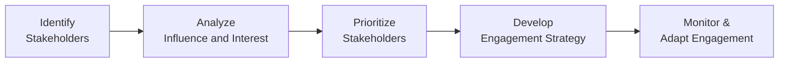

## 7.1 Identifying, Analyzing, and Prioritizing Stakeholders

Effective stakeholder engagement is essential for project success because stakeholders wield significant influence on project objectives, resources, and outcomes. The PMBOK® Guide (Seventh Edition) repositions stakeholder management as a performance domain—emphasizing collaboration, relationships, and adaptability. In this section, we explore the methods, models, and best practices used to identify, analyze, and prioritize project stakeholders. We cover both predictive and agile approaches, highlight relevant real-world scenarios, and discuss how to maintain stakeholder engagement throughout the project life cycle.

## The Importance of Stakeholder Identification

Stakeholders can range from sponsors and senior executives, to end users, functional managers, regulatory authorities, or even the general public. They can affect or be affected by project outcomes, and their involvement can influence cost, schedule, quality, and overall value delivery. By proactively identifying, analyzing, and prioritizing stakeholders early—usually during project initiation and repeatedly throughout a project’s life cycle—project managers can mitigate miscommunications, reduce resistance to change, address competing priorities, and foster better support.

From a PMP® Exam perspective, understanding how to capture stakeholder needs, define engagement strategies, and dynamically adapt those strategies is fundamental. Each project domain (People, Process, and Business Environment) ties directly back to how well stakeholder relationships are managed.

## Overview of Stakeholder Management in Projects

Stakeholder management traditionally has included four key steps:

1. Identifying stakeholders  
2. Planning stakeholder engagement strategies  
3. Managing engagement throughout execution  
4. Monitoring stakeholder relationships and engagement levels  

In the PMBOK® Guide Seventh Edition, the *Stakeholder Performance Domain* underscores an outcome-based view. Rather than a linear process, stakeholder engagement is a dynamic cycle of continuous improvement, responsive collaboration, and situational awareness.

Below is a simplified high-level flow of identifying and engaging stakeholders:

Each stage informs the next. Note that this flow is iterative and should be revisited throughout the project. Stakeholder expectations, interests, or attitudes can shift over time.  

## Identifying Stakeholders

Identifying stakeholders involves systematically listing all persons, groups, or organizations with any interest in the project’s outcome or who can influence the project’s success or failure. Early identification often starts with:

• Reviewing the business case or project charter.  
• Conducting brainstorming sessions with the project team or subject matter experts.  
• Evaluating enterprise environmental factors (EEFs) and organizational process assets (OPAs).  
• Consulting organizational charts or existing stakeholder registers from previous projects.  
• Soliciting inputs from the sponsor and functional managers who have domain knowledge.

### Internal vs. External Stakeholders

• Internal stakeholders include the project sponsor, team members, functional managers, or department heads within the same organization.  
• External stakeholders often include customers, government agencies, vendors, contractors, industry forums, or community representatives.  

In agile approaches, the concept of a “Product Owner” or “Customer Representative” emerges as a key stakeholder, bridging business needs with the development team. Conversely, in predictive environments, the project manager may rely on the sponsor and functional managers for insights, approvals, and resources.

### Positive and Negative Stakeholders

In some projects, certain parties may view the initiative negatively because they see it as a threat to their interests or status quo. A proposed software automation tool, for example, might be seen as beneficial by an engineering department but detrimental by a group who fears job displacement. Proactive identification of both supportive (positive) and opposing (negative) stakeholders is vital to develop a realistic engagement plan.

## Analyzing Stakeholders

Once you have identified potential stakeholders, you need to understand their power, influence, interest, expectations, and attitudes. Stakeholder analysis typically involves categorizing and evaluating them based on how their influence and interest can shape project outcomes.

### Key Dimensions of Stakeholder Analysis

• Power: The level of authority or ability a stakeholder has to make decisions, allocate resources, or veto project elements.  
• Interest: The degree of concern or relevance the project holds for a stakeholder.  
• Impact: The extent to which the stakeholder can affect the project or be affected by it.  
• Urgency: The time-sensitivity of the stakeholder’s needs or expectations.  
• Legitimacy: The validity or appropriateness of a stakeholder’s involvement or demand in the project.  
• Proximity: How closely a stakeholder is associated with project processes or deliverables.  

### Common Models and Tools

#### Power/Interest Grid

One of the simplest and most frequently used stakeholder analysis tools is the Power/Interest grid. It plots stakeholders on a two-dimensional grid:

• Low Power / Low Interest: Monitor  
• Low Power / High Interest: Keep Informed  
• High Power / Low Interest: Keep Satisfied  
• High Power / High Interest: Manage Closely  

| Power \ Interest | Low Interest             | High Interest          |
|------------------|--------------------------|------------------------|
| **High Power**   | Keep Satisfied          | Manage Closely         |
| **Low Power**    | Monitor (Minimal Effort) | Keep Informed          |

This helps project managers prioritize communication frequency and depth. Stakeholders in the high power–high interest quadrant demand the highest engagement efforts.

#### Salience Model (Power, Legitimacy, Urgency)

The Salience Model evaluates stakeholders in terms of:

• Power (the stakeholder’s ability to influence the project)  
• Legitimacy (the appropriateness of the stakeholder’s involvement)  
• Urgency (the time-sensitive nature of a stakeholder’s claims)  

Stakeholders that rank highly on multiple dimensions are considered to have greater salience. For instance, a stakeholder who has both high power and urgent concerns is a top priority, even if their legitimacy is contested.

#### Stakeholder Cube

A more advanced version of traditional grids, the stakeholder cube combines multiple dimensions (power, interest, and attitude) into a three-dimensional model. This approach is beneficial for complex projects with numerous stakeholders and helps the project manager visualize potential conflict points.

## Prioritizing Stakeholders

After analysis, you need to determine which stakeholders require the most attention, resources, and time. Often, you cannot engage every stakeholder with the same level of intensity. Prioritization clarifies where effort and project budget can achieve the highest return in terms of preventing issues, leveraging support, and meeting project objectives.

Prioritization criteria often include:

• Potential impact on the project (positive or negative)  
• Resource requirements of different stakeholder groups  
• Project survival dependency (e.g., regulatory authorities or sponsor)  
• Probability of stakeholder influence materializing  

A helpful approach is to map stakeholders on the Power/Interest (or Power/Influence) grid, then apply the Salience Model as a secondary check. Combining multiple analysis tools refines your understanding and helps segregate critical from less critical stakeholders.

## Tailoring Engagement Strategies

After stakeholders are prioritized, the next step is to craft appropriate engagement strategies. There is no one-size-fits-all approach. Tailoring is influenced by organizational culture, project type (predictive, agile, or hybrid), regulatory environment, and the stakeholder’s own communication style or preferences.

### Engagement Levels

• Unaware: Some stakeholders might not know about the project or its potential impact.  
• Resistant: They may be aware but opposing or worried about the project outcome.  
• Neutral: They may be aware but neither supportive nor resistant.  
• Supportive: They actively support the project goals and outcomes.  
• Leading: They champion the project and guide others toward its success.  

Moving stakeholders from lower support levels to higher support levels is essential. Strategies might include:

1. Frequent, transparent communication to build trust.  
2. Involving stakeholders in decision-making, especially for high-impact items.  
3. Offering training workshops or informational sessions to mitigate confusion.  
4. Addressing negative perceptions early through open feedback loops.  

### Agile vs. Predictive Approaches

• Agile: Close collaboration with customers and end users is prioritized. Stakeholders often engage directly with the project team via sprint reviews, daily scrums (when feasible), or backlog refinement sessions.  
• Predictive (Waterfall): Communication might be more structured, with formal status reports, stakeholder meetings at set intervals, and stage gate reviews.  

In hybrid environments, you might have structured progress tracking for regulatory compliance alongside iterative feedback loops for user-facing features.

## Stakeholder Register and Management Plans

A stakeholder register is a living document that consolidates details about each stakeholder, such as:

• Name, role, contact information  
• Power/Interest category or other classification  
• Preferred communication method  
• Engagement level (current vs. desired)  
• Relevant comments or historical interactions  

Below is a generic table illustrating how some of this information might be recorded:

| Stakeholder  | Role / Title   | Power | Interest | Engagement Level (Current → Desired) | Communication Mode         | Notes                                   |
|--------------|----------------|-------|---------|----------------------------------------|----------------------------|-----------------------------------------|
| Alice        | Sponsor        | High  | High     | Leading → Leading                      | Weekly meetings, emails    | Major decision-maker                    |
| Bob          | Senior Manager | High  | Medium   | Supportive → Leading                   | Bi-weekly updates          | Potential resource constraints          |
| Carla        | CIO            | High  | High     | Supportive → Leading                   | Steering committee reviews | Key influencer on infrastructure        |
| David        | Customer Rep   | Medium| High     | Neutral → Supportive                   | Daily standups (Agile)     | Concerned about timely feature releases |
| Evelyn       | End User       | Low   | Medium   | Unaware → Supportive                   | Monthly bulletins          | Must be trained on new system           |

This table helps you track real-world dynamics, ensuring timely responses to any changes in stakeholder priorities or attitudes.

## Challenges and Best Practices

### Common Pitfalls

• Underestimating stakeholder influence: Many managers overlook low-interest or seemingly low-power stakeholders who can later become powerful influencers (e.g., union representatives, regulatory changes).  
• Lack of continuous engagement: Stakeholder analysis is not a one-time exercise. Project managers should revisit and update the stakeholder register and engagement plan regularly.  
• Over-reliance on sponsor input: Relying solely on the sponsor can lead to blind spots if other stakeholder groups are not consulted adequately.  
• Poor communication strategy: Sending complex messages to non-technical stakeholders without simplification can create confusion and resistance.

### Best Practices

1. Begin stakeholder identification early and repeat often.  
2. Customize engagement strategies for each stakeholder group.  
3. Use multiple analysis tools (Power/Interest, Salience Model) for cross-verification.  
4. Engage both formal and informal networks, especially in large organizations.  
5. In agile environments, encourage direct stakeholder participation in feedback loops and product backlog refinements.  
6. Monitor stakeholder feedback channels through regular standups, status meetings, or co-location (if feasible).  
7. Establish a plan for conflict resolution (e.g., use a formal escalation path).  

## Real-World Scenarios

1. Construction Project for a Public Facility:  
   • The city council has high power but variable interest. They may only become highly interested if their constituents begin raising concerns.  
   • A local environmental group might initially have moderate power but could increase their power by mobilizing public opinion if environmental risks are not addressed.  
   • The project manager would benefit by proactively engaging the environmental group to analyze and mitigate ecological risks.

2. Software Product Launch:  
   • The marketing manager has high interest in user-friendly design but low power regarding technical decisions.  
   • The IT director has high power (budget, resource approvals) but moderate interest. They need to be kept satisfied with periodic progress updates.  
   • End users have high interest in application features but generally low formal power. However, if their dissatisfaction escalates, they can undermine adoption.

In both scenarios, continuous stakeholder analysis and adaptation of engagement strategies help align the needs and expectations of parties that might otherwise derail the project.

## Conclusion

Identifying, analyzing, and prioritizing stakeholders lays the foundation for successful project execution and value delivery. By using analytical tools such as the Power/Interest grid or Salience Model, project managers can anticipate challenges and create tailored engagement strategies. Whether working in a predictive or agile environment, iterative updates to stakeholder analysis are critical—stakeholders’ levels of interest and influence can shift due to organizational changes, evolving deliverables, or external circumstances. When combined with transparent communication, empathy, and an inclusive approach, stakeholder management becomes a strategic project driver rather than just an administrative exercise.

### References for Further Exploration
- Project Management Institute. *A Guide to the Project Management Body of Knowledge (PMBOK® Guide) – Seventh Edition*.  
- PMI. *Pulse of the Profession®*: In-Depth Reports on Stakeholder Management.  
- PMI. *Agile Practice Guide*.  
- Freeman, R. E. *Strategic Management: A Stakeholder Approach*.  
- Bourne, L. *Stakeholder Relationship Management: A Maturity Model for Organisational Implementation*.  

----

## Test Your Knowledge: Stakeholder Identification and Prioritization



### A project manager can first identify potential stakeholders by:

- [x] Reviewing organizational charts, the project charter, and historical documents.  
- [ ] Asking only the project sponsor for a list of stakeholders.  
- [ ] Delaying identification until execution begins.  
- [ ] Relying solely on external third-party consultants.  

> **Explanation:** The sponsor is a key source, but you should also use organizational charts, historical records, and the project charter to gather a comprehensive view of potential stakeholders.

### Which of the following best describes the Power/Interest grid?

- [x] A tool that categorizes stakeholders based on their level of authority and level of concern for project outcomes.  
- [ ] An exclusive tool used only for conflict management among team members.  
- [ ] A resource allocation technique to decide budget distribution.  
- [ ] A scheduling method that tracks task dependencies.  

> **Explanation:** The Power/Interest grid helps classify stakeholders according to their authority and their interest in the project, guiding engagement priorities.

### In a project with numerous stakeholders, the Salience Model helps determine:

- [x] Which stakeholders have the greatest combination of power, legitimacy, and urgency.  
- [ ] The timeline for procuring vendor contracts.  
- [ ] How to allocate project resources to tasks.  
- [ ] The speed of product delivery in agile sprints.  

> **Explanation:** The Salience Model considers power, legitimacy, and urgency to identify which stakeholders demand the most immediate and focused attention.

### True or False: Stakeholders must be managed the same way throughout the entire project life cycle.

- [x] False  
- [ ] True  

> **Explanation:** Stakeholder needs, influence, and attitudes can change over time. Engagement strategies and communication plans must be revisited and adapted.

### One of the most common pitfalls in stakeholder identification is:

- [x] Failing to consider negative stakeholders who may view the project as a threat.  
- [ ] Asking the sponsor’s opinion.  
- [x] Assuming lower-tier employees have no influence.  
- [ ] Incorporating feedback from the entire organization.  

> **Explanation:** Ignoring negative stakeholders or dismissing lower-tier employees can lead to significant resistance or hidden obstacles down the road.

### A project manager has identified stakeholders who might not benefit from the product. How should the project manager engage them?

- [x] Build an open feedback loop, address concerns empathetically, and involve them at critical review points.  
- [ ] Exclude them from communications entirely.  
- [ ] Only copy them on final status reports.  
- [ ] Escalate immediately to the project sponsor to handle them.  

> **Explanation:** Early dialogue, transparency, and empathy can help transform opponents into supporters or at least mitigate risks by gaining their constructive input.

### In agile environments, a product owner typically acts as:

- [x] The primary liaison between end users, business stakeholders, and the development team.  
- [ ] An external contractor managing legal aspects of the project.  
- [x] The team member in charge of procurement.  
- [ ] The sole individual creating the Gantt chart.  

> **Explanation:** In agile frameworks, the product owner is responsible for understanding stakeholder needs and prioritizing product backlog items accordingly.

### The Stakeholder Register is:

- [x] A living document that tracks engagement level, communication preferences, and analysis details for all identified stakeholders.  
- [ ] A static chart used only at the beginning of the project to list stakeholder names.  
- [ ] Primarily for logging budgets and scheduled tasks.  
- [ ] An optional record to be created at the end of the project.  

> **Explanation:** The stakeholder register evolves as new stakeholders emerge or others change roles, and it includes critical details for proper stakeholder management.

### In the Power/Interest grid, stakeholders with low power and low interest should generally be:

- [x] Monitored with minimal effort.  
- [ ] Directly managed with daily face-to-face meetings.  
- [ ] Given absolute control of the project budget.  
- [ ] Directed to sponsor-level decision-making tasks.  

> **Explanation:** Low power/low interest stakeholders need not receive high-level attention or resources. Minimal monitoring is usually sufficient unless their power or interest changes.

### Hiding information from negative stakeholders is an effective stakeholder management technique.

- [x] False  
- [ ] True  

> **Explanation:** Concealing or withholding information typically backfires and erodes trust, risking heightened conflict or escalation. Transparent and open communication is essential, even if stakeholders have opposing views.



----

## PMP Mastery: 1500+ Hard Mock Exams with Full Explanations 

Looking to crush the PMP exam with confidence? Dive deep into 6 rigorous mock exams totaling 1500+ advanced-level questions, each accompanied by clear, step-by-step explanations. Hone your test-taking strategies, master complex topics, and build the resilience you need on exam day. Perfect for serious PMs aiming beyond fundamentals.

Enroll now:  
[PMP Mastery: 1500+ Hard Mock Exams with Exceptional Clarity & Full Explanations](https://www.udemy.com/course/pmp-2025/?referralCode=CF83A54BC86BE27F9AFE)

_Disclaimer: This course is not endorsed by or affiliated with the PMI examination authority. All content is provided purely for educational and preparatory purposes._
