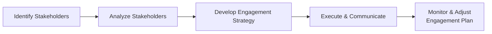

## 7.2 Developing Stakeholder Engagement Strategies

Developing stakeholder engagement strategies is a critical component of any project's success. Stakeholders often have diverse interests, expectations, and levels of influence on a project's outcome. As a project manager, you must adopt deliberate methodologies to build trust, secure buy-in, and maintain healthy relationships with those who can affect or be affected by the project. This section explores key principles, practical techniques, and emerging best practices for designing tailored stakeholder engagement strategies that cater to varied communication styles and cultural contexts. By the end of this chapter, you will not only understand how to manage stakeholders but also develop a strong sense of collaboration and partnership critical for enhancing overall project value.

### Importance of Stakeholder Engagement

A robust stakeholder engagement strategy does more than just inform stakeholders of project developments. It:

- Demonstrates respect for stakeholder expectations and leverages their expertise.  
- Helps preempt conflicts and misunderstandings by providing open communication channels.  
- Facilitates easier implementation of changes and clarifications, reducing costly delays.  
- Ensures alignment between the final deliverables and the actual needs of the end-users or project beneficiaries.  
- Fosters long-term relationships that can be beneficial beyond the immediate project scope.  

These benefits are underscored throughout various sections of the PMBOK® Guide (Seventh Edition) and are integral to the Stakeholder Performance Domain, which emphasizes continuous collaboration and relationship-building.

### Identifying Stakeholder Needs and Expectations

To develop an effective engagement strategy, start by identifying each stakeholder’s interests, concerns, and participation level. Chapter 7.1 (Identifying, Analyzing, and Prioritizing Stakeholders) covered the process of stakeholder identification and analysis. Building on that foundation, focus on using these insights to create tailored engagement approaches.

1. Clarify Stakeholder Requirements:  
   - Ask pointed questions to capture what each stakeholder expects from the project.  
   - Gather their definition of success, preferred communication channels, and potential constraints.

2. Assess Stakeholder Influence and Impact:  
   - Determine which stakeholders hold decision-making authority or can influence outcomes.  
   - Identify any cultural or departmental power structures.  

3. Map Stakeholder Tolerance and Sensitivity:  
   - Some stakeholders may be risk-averse, while others are open to experimentation.  
   - Certain stakeholders may require extensive detail, while others prefer high-level summaries.

### Crafting a Stakeholder Engagement Plan

A Stakeholder Engagement Plan (sometimes an extension of the Stakeholder Register) formalizes your approach. This plan typically includes:

- Stakeholder Roster: A comprehensive list of stakeholders, including their roles, responsibilities, and interest levels.  
- Engagement Objectives: The desired outcomes for each stakeholder relationship (e.g., secure financial backing, gather specialized knowledge, implement decisions, etc.).  
- Tailored Strategies: Specific methods, communication formats, and frequency of interactions for each stakeholder group.  
- Cultural and Linguistic Considerations: Strategies to address language barriers, time-zone differences, holidays, or other cultural factors affecting engagement.  
- Metrics and Key Performance Indicators (KPIs): Criteria for measuring the effectiveness of your engagement efforts (e.g., feedback response rates, number of sign-offs received on time).

### Methods and Tools for Stakeholder Engagement

A myriad of tools and frameworks exist to facilitate stakeholder engagement. Some of the most practical include:

- Power/Interest Grid: Plots stakeholders according to their power to influence the project and their level of interest.  
- Stakeholder Onion Diagram: Visualizes stakeholders in concentric layers based on their proximity or directness of influence on the project.  
- Responsibility Assignment Matrix (RACI): Clarifies who is Responsible, Accountable, Consulted, and Informed for specific tasks or decisions.  
- Communication Plans: Defines mediums (emails, meetings, dashboards) and frequency (daily, weekly, monthly) to ensure targeted communications.  
- Surveys and Interviews: Help gather input, feedback, or sentiment from stakeholders at critical milestones.  

These tools are widely accepted in traditional, agile, and hybrid project environments. Tailor them to the scale, complexity, and culture of your organization to maximize effectiveness.

### Communication Style and Frequency

#### Selecting Appropriate Channels

Communication styles may be formal, informal, synchronous, or asynchronous. Matching a stakeholder’s preferences can significantly improve engagement. Prioritize the following:

- Formal vs. Informal: Some stakeholders prefer official memos and documentation, while others are fine with informal chats.  
- High-Tech vs. Low-Tech: Certain organizations rely heavily on digital tools like Slack, Trello, or Microsoft Teams, whereas others prefer face-to-face or phone calls.  
- Timing and Frequency: Stakeholders with rigorous schedules or short attention spans might find weekly dashboards more useful than daily volunteer updates.

#### Using Layered Communication

Layered communication involves using multiple channels—emails, dashboards, stand-up meetings, and face-to-face sessions—to reinforce messages and confirm understanding. For example:

1. Send out weekly summary emails with key updates.  
2. Conduct monthly video calls to address strategic decisions.  
3. Maintain an always-updated project dashboard to provide real-time data.

Layering these approaches ensures that crucial project information reaches stakeholders in a way most convenient and meaningful for them.

### Cultural Considerations and Language Nuances

Projects in multinational enterprises or global markets often involve stakeholders from different cultural backgrounds. Cultural nuances may include variations in:

- Hierarchical vs. Egalitarian Approaches: Some cultures respect top-down authority, while others favor collaborative decision-making.  
- Direct vs. Indirect Communication Styles: Certain stakeholders expect succinct, results-focused communication; others may value relationship-building and context.  
- Attitudes Toward Time: Perception of punctuality, deadlines, and scheduling can vary widely across cultures.  

Address these differences by:

- Providing materials in multiple languages if necessary.  
- Scheduling meetings at times that work for different time zones.  
- Seeking cultural mediators or ambassadors who understand localized customs and business etiquette.  

### Collaboration and Relationship-Building Techniques

#### Active Listening and Empathy

Active listening involves paying close attention to stakeholders’ verbal and non-verbal cues. It also includes asking clarifying questions and rephrasing their statements to confirm understanding. Empathy further strengthens these relationships by showing care and concern for their viewpoints, objections, or needs.

#### Co-Creation Workshops

Co-creation allows stakeholders to actively contribute to project deliverables. Engaging them early in product or solution design fosters a sense of ownership, increases buy-in, and aligns expectations. Workshops can use techniques like brainstorming, mind mapping, or design thinking exercises.

#### Regular Retrospectives

Drawing from agile methodologies, retrospectives allow teams and stakeholders to reflect on progress, identify what is working well, and discuss areas for improvement. By inviting stakeholders into these sessions (when appropriate), you can cultivate transparency and mutual trust that can significantly enhance ongoing engagement.

### Conflict Resolution and Stakeholder Engagement

Inevitable disagreements or conflicts emerge when diverse groups come together. Effective conflict resolution is vital to maintaining productive stakeholder relationships. Consider:

- Proactive Identification of Differences: Use stakeholder interviews or listening sessions to surface potential conflicts.  
- Conflict Resolution Frameworks: Rely on approaches like the Thomas-Kilmann Conflict Mode Instrument (TKI) to understand if a compromising, collaborating, or accommodating style is best.  
- Maintaining Objectivity: Act as a neutral facilitator whenever stakeholders disagree, using data and evidence to guide discussions.  
- Escalation Pathways: Have a well-defined process for involving upper management or project sponsors if issues cannot be resolved at the project team level.

### Monitoring and Reviewing Engagement Effectiveness

Stakeholder engagement is not a one-time event. Continually monitoring and reviewing your strategy ensures high responsiveness to emerging challenges. Key practices include:

- Periodic Check-Ins: Schedule meetings or surveys to verify stakeholder satisfaction and gather feedback.  
- Engagement Metrics: Measure items such as stakeholder meeting attendance, speed of approvals, or the number of change requests from stakeholders.  
- Adapting to Project Complexity: Adjust communication frequency or style as the project evolves from concept to execution or as stakeholder roles shift.

### Visualizing the Stakeholder Engagement Strategy

Below is a simplified Mermaid diagram illustrating the high-level flow for developing and executing a stakeholder engagement strategy:

- A["Identify Stakeholders"]: Gather a comprehensive list of individuals or groups.  
- B["Analyze Stakeholders"]: Assess their power, influence, and expectations.  
- C["Develop Engagement Strategy"]: Plan tailored communication and involvement.  
- D["Execute & Communicate"]: Implement the engagement strategy through established channels.  
- E["Monitor & Adjust   Engagement Plan"]: Continuously review metrics and feedback, refining approaches as needed.

This cycle is iterative—expect to revisit these steps multiple times throughout the project life cycle, updating and refining your stakeholder engagement strategy as circumstances evolve.  

### Practical Case Study

Consider a multinational software development project in which organizational leadership (high power, high interest) demands weekly formal reports, while the middle management team (low power, high interest) prefers collaborative Slack channels and daily stand-ups. Meanwhile, end-users (indirect influence, medium interest) request occasional surveys and user acceptance sessions.

1. Identification and Analysis: A project manager identifies three major stakeholder groups: executives, middle management, and end-users.  
2. Strategy Development:  
   - Executives: Weekly formal email updates with metrics and progress charts.  
   - Middle Management: Daily stand-ups, Slack channel for quick Q&As, and a monthly video conference for alignment.  
   - End-Users: Periodic user acceptance testing sessions and digital surveys to gather feedback on features.  
3. Execution: The team consistently holds daily stand-ups with middle management and publishes summarized results in formal weekly emails for executives.  
4. Monitoring: The project manager tracks feedback from each group to ensure no critical issues remain unaddressed.  
5. Adjustment: After the first sprint, the project manager realizes executives appreciate graphical dashboards more than text-heavy emails. The engagement strategy is modified to include a dynamic online dashboard every Thursday.

Through adaptive engagement, the project meets each group’s unique needs, fostering positive relationships that carry through to project completion.

### Best Practices and Common Pitfalls

#### Best Practices

- Align Engagement with Project Goals: Ensure your engagement approach promotes the project’s strategic objectives.  
- Keep it Transparent: Maintain open communication about project risks, delays, or changes.  
- Encourage Two-Way Feedback: Create channels that allow stakeholders to voice concerns and suggestions easily.  
- Document and Retain Evidence: Keep track of stakeholder requests, sign-offs, and feedback for future reference and lessons learned.

#### Common Pitfalls

- Over-Communicating: Bombarding stakeholders with excessive information can lead to disengagement.  
- Under-Communicating: Infrequent updates or vague messaging can cause confusion or mistrust.  
- One-Size-Fits-All Approach: Failing to tailor communication and engagement tactics to different stakeholder groups can undermine project success.  
- Ignoring Cultural Sensitivities: Overlooking cultural norms or values can alienate certain stakeholders, leading to resistance or low morale.

### References for Further Exploration

• Project Management Institute. (2021). A Guide to the Project Management Body of Knowledge (PMBOK® Guide) – Seventh Edition.  
• Project Management Institute. (2017). Agile Practice Guide.  
• Bridges, W. (2016). Managing Transitions: Making the Most of Change. Da Capo Press.  
• Kotter, J. P. (2012). Leading Change. Harvard Business Review Press.  
• Hofstede Insights: Cultural tools and frameworks – https://www.hofstede-insights.com  

## Quiz: Elevate Your Stakeholder Engagement Expertise



### Which of the following best describes a Stakeholder Engagement Plan?

- [x] A formal yet dynamic document that outlines tailored communication and involvement strategies for each stakeholder.
- [ ] A short, one-time memorandum summarizing stakeholder roles.
- [ ] A task list to be completed by every stakeholder.
- [ ] A training manual for project managers only.

> **Explanation:** The Stakeholder Engagement Plan is an evolving document that outlines how and when stakeholders will be engaged, accounting for communication styles, reporting frequency, and cultural considerations.

### What is the primary purpose of conducting co-creation workshops with stakeholders?

- [x] To foster a sense of ownership and gather critical feedback during the development process.
- [ ] To comply with organizational policy of mandatory workshops.
- [ ] To replace the need for collecting traditional project requirements.
- [ ] To display project progress in a purely ceremonial manner.

> **Explanation:** Co-creation sessions are designed to actively involve stakeholders in the development of project deliverables, promoting collaboration, buy-in, and alignment with user needs.

### Which tool helps classify stakeholders based on their level of power and interest?

- [x] A Power/Interest Grid
- [ ] A Responsibility Assignment Matrix (RACI)
- [ ] A Burndown Chart
- [ ] A Risk Breakdown Structure

> **Explanation:** The Power/Interest Grid is specifically used to map stakeholders’ power and interest, guiding appropriate communication and engagement strategies.

### A project manager notices that project stakeholders from different cultural backgrounds have conflicting communication styles. Which action is most effective?

- [x] Adapt engagement strategies to address cultural preferences and communication norms.
- [ ] Send identical status updates to everyone without adjustments.
- [ ] Require stakeholders to adapt to one standardized approach.
- [ ] Exclude certain stakeholders to avoid conflict.

> **Explanation:** Adapting communication styles to accommodate cultural differences fosters inclusion and reduces misunderstandings.

### What is a typical pitfall associated with stakeholder engagement?

- [x] Using a one-size-fits-all communication approach for all stakeholders.
- [ ] Scheduling meetings around the most critical stakeholders.
- [ ] Aligning communication with stakeholder preferences.
- [ ] Regularly reviewing stakeholder feedback metrics.

> **Explanation:** One-size-fits-all approaches overlook unique stakeholder needs, interest levels, and cultural differences, thereby hampering effective engagement.

### Active listening in stakeholder engagement primarily involves:

- [x] Paying close attention, summarizing, and clarifying stakeholders’ messages.
- [ ] Quickly writing down instructions without clarifications.
- [ ] Informing stakeholders of your project role.
- [ ] Only speaking when spoken to.

> **Explanation:** Active listening is a deliberate practice of focusing on a speaker’s words, rephrasing key points, and confirming understanding to ensure effective communication and rapport.

### Which of the following best describes layering communication?

- [x] Using multiple channels (e.g., email, calls, dashboards) to reinforce key messages.
- [ ] Relying on a single platform for all communications.
- [ ] Scheduling meetings every day to cover all topics.
- [ ] Encouraging stakeholders to handle communication among themselves without manager oversight.

> **Explanation:** Layering communication ensures repetition of important information across various mediums, thereby increasing retention and reducing misunderstandings.

### If a stakeholder frequently fails to attend scheduled meetings, the project manager should:

- [x] Investigate underlying causes, adjust the engagement strategy, and offer alternative meeting formats or schedules.
- [ ] Report the stakeholder to senior management for disciplinary action.
- [ ] Cancel future meetings with that stakeholder.
- [ ] Continue with meetings without attempting to involve the stakeholder.

> **Explanation:** Proactively addressing the cause (schedule conflict, format preference, misunderstanding of expectations) can help secure better stakeholder attendance and engagement.

### Which key principle helps to overcome disagreements among stakeholders?

- [x] Maintaining objectivity by using data-driven discussion and evidence.
- [ ] Escalating all conflicts immediately to the CEO.
- [ ] Enforcing a strict chain-of-command communication approach.
- [ ] Choosing a single stakeholder’s viewpoint over others.

> **Explanation:** Data-driven, neutral facilitation helps mediate conflicts more effectively while preserving professional relationships.

### Stakeholders from different time zones require meeting accommodations. What is the most sensible approach?

- [x] Rotate meeting times or pre-record sessions to accommodate all time zones fairly.
- [ ] Request stakeholders adjust to the project team’s designated schedule without exception.
- [ ] Consolidate all meeting agendas into a single all-day marathon.
- [ ] Postpone all meetings until end-of-project reviews.

> **Explanation:** Accommodating time zone differences by rotating meeting slots or providing recorded sessions is inclusive and encourages global stakeholder participation.



## PMP Mastery: 1500+ Hard Mock Exams with Full Explanations 

Looking to crush the PMP exam with confidence? Dive deep into 6 rigorous mock exams totaling 1500+ advanced-level questions, each accompanied by clear, step-by-step explanations. Hone your test-taking strategies, master complex topics, and build the resilience you need on exam day. Perfect for serious PMs aiming beyond fundamentals.  

Enroll now:  
[PMP Mastery: 1500+ Hard Mock Exams with Exceptional Clarity & Full Explanations](https://www.udemy.com/course/pmp-2025/?referralCode=CF83A54BC86BE27F9AFE)

_Disclaimer: This course is not endorsed by or affiliated with the PMI examination authority. All content is provided purely for educational and preparatory purposes._
