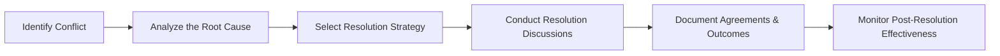

## 7.3 Managing Expectations and Resolving Conflicts

Managing stakeholder expectations and effectively resolving conflicts are at the heart of high-performance project management. When expectations are misaligned, misunderstandings arise, and if left unchecked, they can escalate into bigger disputes that threaten team morale and overall project success. Conversely, proactively setting clear expectations and using structured resolution approaches can transform disagreements into opportunities for growth, innovation, and unity. 

Building on the Stakeholder Performance Domain, this section examines the principles, techniques, and real-world practices behind helping teams navigate conflicts while preserving—and often strengthening—relationships among stakeholders. We will explore context-specific methods, from predictive to agile and hybrid environments, with a view toward maintaining alignment throughout the project life cycle. 

---

### The Key Dimensions of Expectations

Project stakeholders—sponsors, team members, external partners, or end-users—all have varying perspectives, assumptions, and desired outcomes. Their differing viewpoints impact how they define "success" and perceive those outcomes. Consequently, setting and managing expectations plays a pivotal role in:

• Ensuring stakeholders have a mutual understanding of the project’s scope, purpose, and constraints.  
• Clarifying performance metrics and acceptance criteria.  
• Minimizing misunderstandings and friction, especially during change management.  
• Aligning day-to-day tasks with higher organizational objectives (see Chapter 28: Aligning Projects with Organizational Strategy).

#### Understanding Individual and Group Perspectives
Effective expectation management begins with recognizing the multiple lenses through which people approach the project. For instance, senior executives may focus primarily on ROI or strategic alignment, whereas technical teams might emphasize the feasibility of implementation, resource limitations, or compliance aspects. Proactively capturing these viewpoints:

• Facilitates robust requirement gathering.  
• Fosters well-rounded budgeting and scheduling approaches.  
• Enhances the completeness of risk analyses (see Chapter 22: Risk and Uncertainty Management Revisited).  

---

### Common Causes of Misaligned Expectations

Breaking down the frequent drivers of expectation gaps sets the stage for preventative and corrective actions. Common causes include:

• Inadequate communication frequency or format: Stakeholders receive fragmented updates or rely on secondhand information.  
• Ambiguity in project documentation: If the project charter, scope statement, or acceptance criteria are vague or incomplete, conflicting interpretations can arise.  
• Shifting organizational priorities: When strategic goals change mid-project, stakeholders may expect an immediate adjustment in direction without accounting for impact on scope or budget.  
• Cultural or regional differences: Especially in global or multi-site projects, cultural norms around communication styles can lead to misunderstanding (see Chapter 8.4: Virtual Teams and Cross-Cultural Collaboration).  

---

### Principles of Effective Expectation Management

1. Align Early and Often  
   Seek alignment on scope, success criteria, and constraints as early as project inception by creating a robust communications plan and a stakeholder engagement plan. Continuously refine expectations as new insights emerge (see Chapter 41.1: Stakeholder Register, Risk Register, Issue Log Samples).

2. Set Realistic and Measurable Milestones  
   Use objective metrics to define progress. By specifying deliverables in measurable terms (e.g., “completed test scripts for module X by Q2”), you liberate the conversation from assumptions and subjective measures.

3. Involve Stakeholders in Decision-Making  
   Encourage active stakeholder participation to promote a sense of ownership and shared understanding of deliverables. This is particularly relevant in Agile approaches, where iterative stakeholder feedback shapes product increments (see Chapter 26: Key Agile Events and Artifacts).

4. Communicate Timely and Consistently  
   Use consistent messaging to counter fragmentation. By establishing predictable communication channels—weekly stakeholder newsletters or monthly steering committee meetings—everyone remains updated with the same information.

5. Document Changes Promptly  
   Whether employing a change control board (in predictive environments) or backlog refinement sessions (in Agile contexts), record any expectation shifts in the appropriate system or documentation to maintain transparency and clarity (see Chapter 15.3: Integrated Change Control).

---

### The Nature of Project Conflicts

Conflicts are natural and inevitable within projects that bring together multiple individuals with varied backgrounds, interests, and communication styles. Although project managers often attempt to limit conflict, addressing it constructively provides an opportunity to build trust and strengthen relationships.

Common areas of conflict include:

• Diverging opinions on technical solutions.  
• Resource allocations and workload distribution.  
• Misinterpretation of requirements or scope expansions.  
• Personal values and beliefs, especially in culturally diverse teams.  

Given that conflict can be driven by incomplete information or emotional triggers, a structured approach to resolution—one that emphasizes active listening, empathy, and collaboration—can lead to creative solutions and deeper stakeholder engagement.

---

### Conflict Resolution Strategies

Before examining specific methods, it is crucial to recognize that there is no one-size-fits-all technique. The project manager, or any mediator, should select strategies based on context, urgency, and the relationships at stake. Below are five commonly acknowledged resolution styles suited to different scenarios:

1. Collaborating (Win-Win)  
   • Emphasis: High on relationship, high on achieving mutual gains.  
   • Usage: Best when project success hinges on building long-term stakeholder trust, or when teams must coordinate to develop a critical solution.  
   • Skills Required: Excellent communication, willingness to share information openly, and a creative approach to brainstorming solutions.  

2. Compromising (Moderate Win, Moderate Win)  
   • Emphasis: Achieves an acceptable resolution swiftly but may not fully satisfy all parties.  
   • Usage: Useful when a balanced outcome is necessary, and the conflict must be resolved quickly to move the project forward.  
   • Skills Required: Skilled facilitation, negotiation, and an ability to identify middle ground.  

3. Accommodating (Lose-Win)  
   • Emphasis: Preserves relationships by yielding to another stakeholder’s needs.  
   • Usage: Effective when preserving harmony is vital, or the topic is more crucial to the other party.  
   • Skills Required: Understanding of project priorities and ability to weigh the consequences of conceding a point.  

4. Competing (Win-Lose)  
   • Emphasis: Prioritizes achieving one’s position, often at the expense of opposing viewpoints.  
   • Usage: Can be imperative if the issue is urgent, or if upholding a strict policy or compliance standard. Overuse can destroy trust.  
   • Skills Required: Decisiveness, clarity in justification, ability to handle potential negative impact on relationships.  

5. Avoiding (Lose-Lose)  
   • Emphasis: Delaying or sidestepping an issue.  
   • Usage: Situationally valid when the conflict is trivial, more pressing concerns exist, or emotions require de-escalation first.  
   • Skills Required: Strong judgment on when to address vs. when to wait, tact in temporarily deferring conflict.  

---

### The Conflict Resolution Process

For mid-to-high severity disputes, a more systematic approach can help the team progress constructively and transparently. Below is a simplified model in a Mermaid diagram illustrating the resolution flow.

• Identify Conflict: Gather facts and listen to all parties’ perspectives.  
• Analyze the Root Cause: Differentiate between surface symptoms and root issues (technical, emotional, or organizational).  
• Select Resolution Strategy: Tailor strategy to conflict intensity, timescales, and relationship implications.  
• Conduct Resolution Discussions: Use active listening, neutral language, and focus on solutions rather than blame.  
• Document Agreements and Outcomes: Secure mutual understanding of the agreed path forward.  
• Monitor Post-Resolution Effectiveness: Follow up to confirm that conflict does not resurface and the resolution still holds value.  

---

### Techniques for Managing Expectations While Resolving Conflicts

1. Active Listening and Empathy  
   • Clarify each stakeholder’s core concerns—even if they are not expressed directly (e.g., fear of losing project influence).  
   • Demonstrate empathy by rephrasing participants’ statements and feelings.  

2. Joint Problem-Solving  
   • Transform the conflict into a shared challenge that all parties solve together.  
   • Focus on objective data and project goals rather than on personal positions.  

3. Use of Neutral Facilitators  
   • Mull bringing in a neutral third party—such as a senior manager or industry expert—to mediate highly charged conflicts, especially if the project manager is too involved or suspected of bias.  

4. Formal Sessions or Workshops  
   • Schedule conflict resolution workshops or sessions dedicated to alignment.  
   • Encourages a deeper, structured conversation that surpasses casual hallway conversations.  

5. Communication Plan Recalibration  
   • If persistent conflicts and misalignments continue, revisit communication plans.  
   • Adjust who receives updates, how frequently, and with what level of detail.  

6. Leveraging PM Artifacts for Visibility  
   • RACI matrices, Gantt charts, burn-down charts, or backlog boards all provide objective reference points that stakeholders can collectively view.  
   • Encourages transparency, channeling debates toward data rather than assumptions (see Chapter 13: Measurement Performance Domain).  

---

### Case Study Example: Scope Adjustment and Conflicting Priorities

Imagine a mid-sized software development project in which Marketing, Sales, and IT each have different priorities:

• Marketing wants to integrate advanced social media features to amplify brand awareness.  
• Sales needs robust e-commerce functionalities to drive revenue.  
• IT is concerned about the stability of the current architecture and resource constraints.  

Throughout the project, scope expansion requests from both Sales and Marketing create tension given that IT must safeguard system performance. In multiple steering committee meetings, these conflicts escalate when deadlines are threatened by new feature requests.

#### Steps Taken

1. The project manager holds a workshop to clarify the root cause of disputes—lack of shared definition around “critical features,” uncertain budget allowances, and inconsistent updates.  
2. All parties collaboratively rank feature requests based on priority and align them with the project’s business objectives, referencing acceptance criteria and the original project charter.  
3. The manager uses a “collaborating” style, encouraging the teams to brainstorm technical solutions that can partially satisfy the need for advanced features without undermining system stability.  
4. The final resolution is documented, including a schedule reforecast and a realigned scope statement.  
5. A weekly cross-functional “feature triage” meeting ensures continuous monitoring of new requests.  

#### Outcome

While not all desired features were implemented at once, the conflict was channeled into a more strategic conversation, leading to better synergy. Stakeholders grew more confident in the change request process, and the team reestablished crucial trust and transparency.

---

### Preventing and Mitigating Future Conflicts

Even after resolving a dispute, project managers and teams can adopt proactive measures to prevent recurrences:

• Conduct Post-Resolution Reviews: Analyze what triggered the conflict and how quickly it was identified. Share lessons learned in a knowledge repository (see Chapter 11.3: Managing Communication, Knowledge Transfer, and Lessons Learned).  
• Reinforce Ground Rules: Encourage the use of constructive language, timely feedback, and respect for deadlines.  
• Recognize Early Warning Signs: Keep an eye out for sudden declines in participation or abrupt escalation in email tone—both can signal brewing conflict.  
• Maintain Transparent Governance: Regularly review issues, risks, and changes with a governance board or sponsor so that emerging conflicts receive timely attention.  

---

### Techniques for Measuring Expectation Alignment

How do you know if expectations are on track? Beyond anecdotal feedback, you can systematically gauge alignment by:

• Stakeholder Satisfaction Scores: Gather scheduled surveys or “pulse checks” to rate satisfaction with communication, progress, and overall involvement.  
• Escalation Metrics: Track the frequency and severity of escalations or change requests as indictors of alignment gaps.  
• Attendance and Participation: Measure how actively stakeholders engage in meetings, workshops, or retrospectives—low engagement could hint at silent conflict or dissatisfaction.  
• Milestone Performance: Evaluate if major deliverables are meeting acceptance criteria without extensive rework.  

---

### Tips for Effective Stakeholder Management During Conflicts

• Keep Emotions in Check: Model composure to promote calm discussions.  
• Separate the Person from the Issue: Focus on resolving the dispute, not assigning blame for failings or personal traits.  
• Encourage Respectful Dialogue: Use ground rules that prohibit personal attacks or sarcastic undertones.  
• Start with Common Goals: Finding a shared objective can help unify multiple viewpoints.  
• Involve the Right People at the Right Time: Move beyond the core team if a conflict requires sponsor-level decisions.  

---

### Summary and Best Practices

Managing stakeholder expectations and resolving conflicts are deeply intertwined, as conflicts often stem from unmet or misunderstood expectations. A project environment committed to open communication, early alignment, and structured resolution processes can harness conflicts as catalysts for creativity. By carefully selecting resolution strategies and facilitating ongoing transparency, project managers serve as the linchpins that keep stakeholders engaged, productive, and ultimately satisfied with project outcomes.

Key Takeaways:

• Identify and clarify expectations early in the project to avoid hidden assumptions and reduce the likelihood of conflict surprises.  
• Use data-driven evidence, objective metrics, and well-crafted project artifacts to steer conversations away from personal biases.  
• Leverage a range of conflict resolution styles—selecting the most appropriate based on urgency, stakes, and desired relationship outcomes.  
• Document agreements reached, maintain ongoing communication, and measure the efficacy of post-resolution steps to ensure lasting alignment.  

For deeper exploration, consider reviewing Chapters 8 (Team Performance Domain) and 9 (Development Approach and Life Cycle Performance Domain) to better appreciate the influence of leadership styles, collaborative behaviors, and lifecycle models on conflict emergence and resolution.  

---

### References and Further Reading

• Project Management Institute. (2021). A Guide to the Project Management Body of Knowledge (PMBOK® Guide) – Seventh Edition.  
• Fisher, R., Ury, W., & Patton, B. (2011). Getting to Yes: Negotiating Agreement Without Giving In. New York: Penguin Books.  
• Thomas, K. W., & Kilmann, R. H. (1974). Thomas-Kilmann Conflict Mode Instrument. New York: Xicom.  
• Barsky, A. E. (2017). Conflict Resolution for the Helping Professions. Oxford University Press.  

---

## Sharpen Your Skills in Managing Expectations & Conflict Quiz



### Which of the following is a fundamental benefit of effective expectation management among stakeholders?

- [ ] It eliminates the need for conflict resolution entirely.  
- [x] It minimizes misunderstandings and promotes transparent alignment on project goals.  
- [ ] It ensures the project manager always wins disagreements.  
- [ ] It guarantees no changes occur once the project plan is set.  

> **Explanation:** Effective expectation management aligns varying perspectives, reduces uncertainty, and prevents the kinds of confusion that often lead to conflict.

### When analyzing the root cause of a conflict situation, what is a recommended best practice?

- [x] Distinguish between symptomatic issues and deeper structural or relational challenges.  
- [ ] Focus on assigning responsibility for the issue to individuals.  
- [ ] Immediately escalate the conflict to the sponsor without discussion.  
- [ ] Avoid documenting the process to preserve transparency.  

> **Explanation:** By differentiating surface symptoms from underlying causes, the team can address the genuine source of conflict rather than placing blame or glossing over deeper tensions.

### Which conflict resolution style prioritizes mutual benefit and fosters collaborative problem-solving?

- [ ] Accommodating  
- [ ] Compromising  
- [x] Collaborating (Win-Win)  
- [ ] Competing  

> **Explanation:** Collaborating seeks to understand the needs and goals of all parties, aiming for innovative solutions that satisfy everyone’s interests.

### In what situation might an avoiding style be temporarily appropriate?

- [ ] If the conflict is urgently threatening the project.  
- [x] If the issue is trivial or when emotions need to cool before resolution can be effective.  
- [ ] If the project manager never wants to address the conflict.  
- [ ] If it contradicts organizational policy to confront conflict directly.  

> **Explanation:** Avoiding can be valid to allow time for tempers to subside or if the matter is minor, but it should be revisited once it becomes significant.

### Which of the following best describes a key advantage of using a neutral facilitator in conflict resolution?

- [x] They offer an impartial perspective that can help guide fair discussion and outcomes.  
- [ ] They are responsible for final enforcement of project scope changes.  
- [x] They automatically eliminate deeply rooted interpersonal conflicts.  
- [ ] They can rewrite the project plan as they see fit.  

> **Explanation:** Neutral facilitators bring objectivity and help mediate sensitive discussions. However, they do not unilaterally solve all interpersonal issues, and scope changes still require formal processes.

### What is a common reason cultural or regional factors can lead to stakeholder expectation misalignment?

- [ ] All cultures communicate stakeholder needs identically.  
- [x] Different norms around communication style can cause misunderstandings.  
- [ ] Cultural factors rarely affect large-scale projects.  
- [ ] Projects are typically unaffected by regional communication patterns.  

> **Explanation:** Cross-cultural projects often involve divergent approaches to feedback, hierarchy, and conflict. Without awareness and deliberate effort, these differences can spark misunderstanding.

### How can a project manager help ensure alignment after reaching a conflict resolution?

- [x] Document all decisions and follow up to confirm if agreements remain effective.  
- [ ] Not apply any lessons learned for future interactions.  
- [x] Rely solely on verbal communication to avoid too much paperwork.  
- [ ] Avoid assessing the resolution process to prevent new conflicts.  

> **Explanation:** Clear documentation and post-resolution follow-ups help confirm if the underlying problem has been resolved and can prevent the same conflict from reemerging.

### Which measure might be used to identify developing misalignments in stakeholder expectations?

- [ ] Dropping all formal status reporting.  
- [x] Monitoring the frequency and nature of escalations or change requests over time.  
- [ ] Restricting communication to top-level executives only.  
- [ ] Relying on partial, informal updates between certain team members.  

> **Explanation:** Frequent escalations or unexpected change requests often signify deeper misalignment. Tracking and analyzing their patterns can reveal areas to address early.

### What should be the primary focus during formal resolution sessions dedicated to conflict?

- [ ] Establishing personal accountability and potential disciplinary actions.  
- [x] Jointly developing objective, data-driven solutions that align with project goals.  
- [ ] Highlighting each participant’s shortcomings in the conflict.  
- [ ] Criticizing the team’s inability to communicate effectively.  

> **Explanation:** Formal sessions should emphasize shared problem-solving based on facts, data, and organizational goals. Focusing on blame rarely leads to constructive solutions.

### When using the collaborating style of conflict resolution, it is:

- [x] True  
- [ ] False  

> **Explanation:** Collaborating is a joint effort where parties seek outcomes that benefit everyone, known as a Win-Win situation. By pooling resources and sharing perspectives, teams often discover creative solutions that satisfy broader objectives.



---

## PMP Mastery: 1500+ Hard Mock Exams with Full Explanations 

Looking to crush the PMP exam with confidence? Dive deep into 6 rigorous mock exams totaling 1500+ advanced-level questions, each accompanied by clear, step-by-step explanations. Hone your test-taking strategies, master complex topics, and build the resilience you need on exam day. Perfect for serious PMs aiming beyond fundamentals.  

Enroll now:  
[PMP Mastery: 1500+ Hard Mock Exams with Exceptional Clarity & Full Explanations](https://www.udemy.com/course/pmp-2025/?referralCode=CF83A54BC86BE27F9AFE)

_Disclaimer: This course is not endorsed by or affiliated with the PMI examination authority. All content is provided purely for educational and preparatory purposes._
